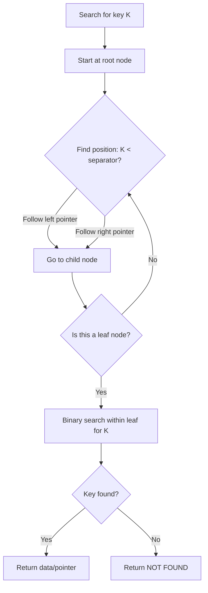
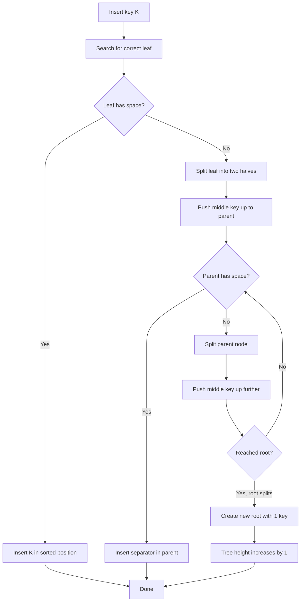
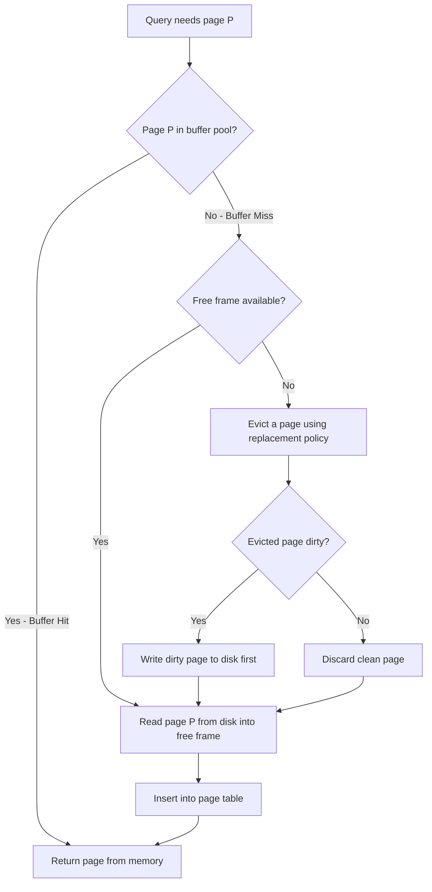

# B+ Tree: Read-Optimized Storage Engine

## What Is a B+ Tree?

A **B+ Tree** is a self-balancing, disk-oriented tree structure optimized for
systems that read and write large blocks of data. It is the dominant indexing
structure in virtually all relational databases because it provides efficient
point lookups, range scans, and ordered iteration with minimal disk I/O.

**Core insight:** Disk I/O is measured in pages (4KB-16KB). A B+ Tree maximizes
the number of keys per page (high fan-out), minimizing tree height and therefore
disk reads per query.

### Who Uses B+ Trees?

| Database | Storage Engine | Notes |
|----------|---------------|-------|
| **PostgreSQL** | Heap + B-Tree indexes | All indexes are B+ Tree variants |
| **MySQL InnoDB** | Clustered B+ Tree | Primary key IS the table |
| **Oracle** | B+ Tree indexes | Default index type |
| **SQL Server** | Clustered/non-clustered | Same as InnoDB model |
| **SQLite** | B+ Tree (table) + B-Tree (index) | File-based |
| **MongoDB WiredTiger** | B+ Tree option | Alternative to LSM |

---

## B+ Tree Structure

### Key Differences: B-Tree vs B+ Tree

| Property | B-Tree | B+ Tree |
|----------|--------|---------|
| Data location | In ALL nodes | ONLY in leaf nodes |
| Leaf linkage | None | Doubly-linked list |
| Range scans | Requires inorder traversal | Follow leaf pointers |
| Fan-out | Lower (data in internal nodes) | Higher (keys only in internals) |
| Disk I/O for range | More | Less |
| Duplicate keys | Not needed | Internal keys are separators |

**Why B+ Tree wins for databases:**
- All data in leaves = predictable access pattern
- Linked leaves = sequential scan for range queries without backtracking
- Higher fan-out = shallower tree = fewer disk reads

### Anatomy of a B+ Tree (ASCII)

```
  B+ Tree (order=4, max 3 keys per node):

                        INTERNAL (ROOT)
                    +---+---+---+---+
                    |   | 30| 60|   |
                    +-+-+---+---+-+-+
                   /      |       \
                  /       |        \
                 v        v         v
          INTERNAL     INTERNAL     INTERNAL
       +--+--+--+   +--+--+--+   +--+--+--+
       |10|20|  |   |40|50|  |   |70|80|90|
       +-++-++-++   +-++-++-++   +-++-++-++
      /  |  |       /  |  |      /  |  |  \
     v   v  v      v   v  v     v   v  v   v

  LEAF NODES (contain actual data, linked together):

  +--------+   +--------+   +--------+   +--------+
  |1,5,8   |-->|10,12,20|-->|21,25,29|-->|30,35,40|-->
  |d d d   |   |d  d  d |   |d  d  d |   |d  d  d |
  +--------+   +--------+   +--------+   +--------+

  -->+--------+   +--------+   +--------+   +--------+
     |41,45,50|-->|51,55,59|-->|60,65,70|-->|71,75,80|-->
     |d  d  d |   |d  d  d |   |d  d  d |   |d  d  d |
     +--------+   +--------+   +--------+   +--------+

  -->+--------+   +--------+
     |81,85,90|-->|91,95,99|
     |d  d  d |   |d  d  d |
     +--------+   +--------+

  d = data pointer (or actual row data in clustered index)
  --> = sibling pointer (doubly linked for bidirectional scan)
```

### Node Structure Detail

```
  Internal Node (non-leaf):
  +------+-----+------+-----+------+-----+------+
  | Ptr0 | K1  | Ptr1 | K2  | Ptr2 | K3  | Ptr3 |
  +------+-----+------+-----+------+-----+------+
     |           |           |           |
     v           v           v           v
   <K1        K1<=x<K2    K2<=x<K3     >=K3

  - Keys are separators (guide search, not actual data)
  - Pointers lead to child pages
  - Fan-out = number of pointers = keys + 1

  Leaf Node:
  +------+------+------+------+------+------+------+
  | Prev | K1:D | K2:D | K3:D |      |      | Next |
  +------+------+------+------+------+------+------+
     ^                                          |
     |    Sibling pointer chain                 v
   Prev                                       Next
   Leaf                                       Leaf

  - K:D = Key + Data (or pointer to heap row)
  - Prev/Next = pointers to sibling leaves
  - Sorted by key within the leaf
```

---

## Why B+ Trees Are Shallow

The **fan-out** (branching factor) of a B+ Tree is enormous compared to binary
trees because each node fills an entire disk page.

```
  Calculation:

  Page size:     8 KB (8192 bytes)
  Key size:      8 bytes (bigint)
  Pointer size:  6 bytes (page ID)
  Header:        ~100 bytes

  Keys per internal node:
    (8192 - 100) / (8 + 6) = ~578 keys
    Fan-out = 579 pointers per node

  Levels needed for N rows:

    Level 1 (root):     1 node         ->  579 children
    Level 2:          579 nodes        ->  579^2 = 335,241 children
    Level 3:       335,241 nodes       ->  579^3 = ~194 million leaves
    Level 4:   194,000,000+ nodes      ->  579^4 = ~112 billion rows

  Result:
    3 levels  = ~194 million rows
    4 levels  = ~112 billion rows

  A 4-level B+ Tree can index THE ENTIRE INTERNET's URLs.
  Root + 1-2 internal levels are cached in memory.
  Point query = 1-2 disk reads (only leaf + maybe one internal node).
```

---

## Operations

### Search: O(log_b N)



```
  Search for key=45:

  Root: [30 | 60]
    45 >= 30 and 45 < 60 --> follow middle pointer

  Internal: [40 | 50]
    45 >= 40 and 45 < 50 --> follow middle pointer

  Leaf: [41, 43, 45, 48]
    Binary search --> found at position 2
    Return data for key=45

  Total disk reads: 3 (root usually cached -> 2 actual reads)
```

### Insert



```
  Insert key=25 into full leaf [20, 22, 24, 28]:

  BEFORE:
                [20 | 30]
               /    |    \
  [10,15,18] [20,22,24,28] [30,35,40]

  Step 1: Leaf [20,22,24,28] is full, insert 25 -> split
          Left:  [20, 22]       Right: [24, 25, 28]
          Push separator 24 up to parent

  AFTER:
                [20 | 24 | 30]
               /    |    |    \
  [10,15,18] [20,22] [24,25,28] [30,35,40]

  If parent overflows, it splits too (cascading splits).
  Worst case: split propagates to root -> tree grows by 1 level.
  This happens extremely rarely due to high fan-out.
```

### Delete

```
  Delete key=22 from leaf [20, 22, 24]:

  Simple case (leaf stays above minimum occupancy):
    Remove 22 -> [20, 24]
    Done.

  Underflow case (leaf drops below minimum):
    Option 1: Borrow from sibling
      - Take a key from adjacent sibling
      - Update parent separator

    Option 2: Merge with sibling
      - Combine two underfull leaves into one
      - Remove separator from parent
      - Parent may underflow -> cascade

  In practice:
    - Most databases use lazy deletion (mark as deleted, reclaim later)
    - PostgreSQL: dead tuples cleaned by VACUUM
    - InnoDB: purge thread cleans up
```

---

## Clustered vs Non-Clustered Indexes

This distinction is critical for understanding real database behavior.

### Clustered Index (InnoDB Primary Key)

The **table itself** is organized as a B+ Tree, with leaf nodes containing
the complete row data.

```
  InnoDB Clustered Index (Primary Key = id):

  Internal Nodes:
                    [50 | 100]
                   /     |     \
                  v      v      v
              [20|40]  [70|90]  [120|150]
              / | \    / | \    / | \
             v  v  v  v  v  v  v  v  v

  Leaf Nodes (contain FULL ROW DATA):
  +------------------------------------------+
  | id=1  | name="Alice" | age=30 | city=... | --> next leaf
  | id=2  | name="Bob"   | age=25 | city=... |
  | id=5  | name="Carol" | age=35 | city=... |
  +------------------------------------------+

  Key insight: The clustered index IS the table.
  There is no separate "heap" file.
  Row data is physically sorted by primary key on disk.
```

**Properties:**
- Only ONE clustered index per table (data has one physical order)
- Range scans by PK are extremely fast (sequential disk reads)
- Inserts into the middle cause page splits
- InnoDB auto-creates a hidden clustered index if no PK defined

### Non-Clustered (Secondary) Index

Leaf nodes contain the indexed columns + a pointer back to the row.

```
  InnoDB Secondary Index on "name":

  Leaf Nodes:
  +---------------------------------------+
  | name="Alice" | PK=1                   | --> next leaf
  | name="Bob"   | PK=2                   |
  | name="Carol" | PK=5                   |
  +---------------------------------------+
         |
         | To get full row:
         | Look up PK=1 in the CLUSTERED index
         | (this is called a "bookmark lookup"
         |  or "index lookup" or "double lookup")
         v
  Clustered Index:
  PK=1 --> {id=1, name="Alice", age=30, city=...}
```

**The double lookup problem (InnoDB):**
- Secondary index lookup finds PK value
- Must then traverse the clustered index to get the full row
- For N rows, this is N random I/O operations
- The optimizer may choose a full table scan if N is large

### PostgreSQL Model: Heap + Indexes

PostgreSQL uses a different approach:

```
  PostgreSQL Architecture:

  HEAP TABLE (unordered rows stored in pages):
  +-------+-------+-------+-------+-------+
  | Page0 | Page1 | Page2 | Page3 | Page4 |  ...
  +-------+-------+-------+-------+-------+
  | row1  | row4  | row7  | row10 | row13 |
  | row2  | row5  | row8  | row11 | row14 |
  | row3  | row6  | row9  | row12 | row15 |
  +-------+-------+-------+-------+-------+

  B+ Tree Index on "id" (ALL indexes are non-clustered):
  Leaf: [id=1 -> (page0, offset0)]
        [id=2 -> (page0, offset1)]
        [id=3 -> (page0, offset2)]
        ...

  B+ Tree Index on "name":
  Leaf: [name="Alice" -> (page0, offset0)]
        [name="Bob"   -> (page0, offset1)]
        ...

  Every index points directly to (page_number, offset) in the heap.
  No "double lookup" through another index.
  But: heap rows are unordered, so range scans by any key may
       require random I/O across many pages.
```

### Comparison Table

| Feature | InnoDB (Clustered) | PostgreSQL (Heap) |
|---------|-------------------|-------------------|
| Primary key lookup | 1 B+ Tree traversal | 1 B+ Tree + 1 heap read |
| Secondary key lookup | 2 B+ Tree traversals | 1 B+ Tree + 1 heap read |
| Range scan (PK) | Sequential I/O (fast) | Random I/O (slower) |
| Range scan (secondary) | Random double lookups | Random heap reads |
| INSERT (random PK) | Page splits | Append to heap (fast) |
| INSERT (sequential PK) | Append to last page | Append to heap (fast) |
| UPDATE (in-place) | Yes (if fits in page) | No (new tuple, old marked dead) |
| Dead row cleanup | Purge thread | VACUUM |
| Index size (secondary) | Stores PK (can be large) | Stores TID (6 bytes) |

---

## Page Structure (Disk Layout)

Every B+ Tree node corresponds to one disk **page**. Understanding page layout
is essential for performance analysis.

### Generic Page Layout

```
  Database Page (typically 8KB or 16KB):

  +--------------------------------------------------+
  |  PAGE HEADER (fixed size, ~24-100 bytes)          |
  |  - Page ID / LSN / Checksum                       |
  |  - Free space offset / Item count                 |
  |  - Prev/Next page pointers (for leaf linking)     |
  +--------------------------------------------------+
  |  ITEM POINTERS (array, grows downward)            |
  |  [Ptr1] [Ptr2] [Ptr3] [Ptr4] [Ptr5] ...          |
  |   |       |      |      |      |                  |
  |   v       v      v      v      v                  |
  +--------------------------------------------------+
  |                                                    |
  |           FREE SPACE                               |
  |     (grows from both ends toward middle)           |
  |                                                    |
  +--------------------------------------------------+
  |  TUPLE DATA (actual rows/keys, grows upward)       |
  |  [...Tuple5...] [...Tuple4...] [...Tuple3...]      |
  |  [...Tuple2...] [...Tuple1...]                     |
  +--------------------------------------------------+
  |  SPECIAL AREA (B-tree specific metadata)           |
  +--------------------------------------------------+

  Item pointers grow DOWN from the header.
  Tuple data grows UP from the bottom.
  When they meet in the middle, the page is full.
```

### PostgreSQL Heap Page (Detail)

```
  PostgreSQL 8KB Page:

  Bytes 0-23:     Page Header
                  pd_lsn (8)       - last WAL LSN that modified this page
                  pd_checksum (2)  - page checksum
                  pd_lower (2)     - offset to start of free space
                  pd_upper (2)     - offset to end of free space
                  pd_special (2)   - offset to special space
                  ...

  Bytes 24-...:   Line Pointers (4 bytes each)
                  lp[1] = (offset=8100, length=40, flags=NORMAL)
                  lp[2] = (offset=8060, length=40, flags=NORMAL)
                  lp[3] = (offset=8020, length=40, flags=DEAD)
                  ...

  Free space:     Between line pointers and tuple data

  Tuple area:     HeapTupleHeader (23 bytes) + null bitmap + data
                  - t_xmin: transaction that inserted this tuple
                  - t_xmax: transaction that deleted/updated (0 if live)
                  - t_ctid: current tuple ID (points to newer version if updated)

  For MVCC: old and new versions of a row can coexist on the same page.
```

---

## Buffer Pool / Page Cache

Databases do NOT read from disk on every query. They maintain a **buffer pool**
-- a region of memory holding recently accessed pages.

```
  Buffer Pool Architecture:

  +-----------------------------------------------------------+
  |                    BUFFER POOL (shared memory)             |
  |                                                            |
  |  +-------+ +-------+ +-------+ +-------+ +-------+        |
  |  |Page 1 | |Page 42| |Page 7 | |Page 99| |Page 3 |  ...  |
  |  |CLEAN  | |DIRTY  | |CLEAN  | |DIRTY  | |CLEAN  |        |
  |  +-------+ +-------+ +-------+ +-------+ +-------+        |
  |                                                            |
  |  Page Table (hash map: page_id -> buffer frame)            |
  |  Free List (unused frames)                                 |
  |  LRU / Clock replacement policy                            |
  +-----------------------------------------------------------+
         ^                    |
         |                    v
     READ (page miss)    WRITE (dirty page flush)
         ^                    |
         |                    v
  +-----------------------------------------------------------+
  |                    DISK (data files)                        |
  +-----------------------------------------------------------+
```



### Key Metrics

| Metric | Target | Notes |
|--------|--------|-------|
| **Buffer hit ratio** | > 99% | If below 95%, add more memory |
| **Buffer pool size** | 70-80% of RAM | PostgreSQL: `shared_buffers`, InnoDB: `innodb_buffer_pool_size` |
| **Dirty page ratio** | < 75% | Too high = risk of checkpoint storms |

### Eviction Policies

| Policy | How It Works | Used By |
|--------|-------------|---------|
| **LRU** | Evict least recently used | Simple but suffers from scan pollution |
| **Clock (approximation)** | Circular buffer with reference bits | PostgreSQL (clock-sweep) |
| **LRU-K** | Track last K accesses, evict by Kth access time | SQL Server |
| **ARC** | Adaptive, balances recency and frequency | ZFS, some custom implementations |
| **Midpoint insertion** | New pages enter LRU at midpoint, not head | InnoDB (avoids scan pollution) |

**Scan pollution problem:** A full table scan loads thousands of pages that are
used once, evicting hot pages from the cache. Mitigation: midpoint insertion
(InnoDB) or separate buffer pools for large scans.

---

## Covering Indexes and Index-Only Scans

A **covering index** includes all columns needed by a query, avoiding the
heap/clustered-index lookup entirely.

```
  Query: SELECT name, age FROM users WHERE name = 'Alice'

  Non-covering index on (name):
    1. Search B+ Tree for name='Alice'     --> find TID/PK
    2. Fetch row from heap/clustered index  --> get age
    Total: 2 lookups

  Covering index on (name, age):
    1. Search B+ Tree for name='Alice'     --> leaf has (name, age)
    2. Return directly from index           --> no heap access
    Total: 1 lookup

  PostgreSQL: CREATE INDEX idx ON users (name) INCLUDE (age);
  MySQL:      Automatically covering if all columns are in the index
```

### Index-Only Scan (PostgreSQL Specific)

PostgreSQL can skip the heap visit if the **visibility map** confirms all
tuples on that page are visible to all transactions:

```
  Visibility Map:
  Page 0: [1]  -- all tuples visible, safe for index-only scan
  Page 1: [0]  -- some tuples not visible, must check heap
  Page 2: [1]  -- safe
  ...

  VACUUM updates the visibility map.
  Frequent updates = more [0] bits = fewer index-only scans.
```

---

## Fill Factor and Page Splits

```
  Fill Factor = percentage of page space to fill on initial load

  Default: 100% (pack pages full)

  Problem with 100%:
    Page [10, 20, 30, 40, 50]  (FULL)
    Insert 25 -> no space -> PAGE SPLIT
    -> [10, 20, 25]  [30, 40, 50]  (two half-full pages)
    -> random I/O, fragmentation, parent update

  With fill factor 90%:
    Page [10, 20, 30, 40, __]  (10% reserved)
    Insert 25 -> fits in reserved space
    -> [10, 20, 25, 30, 40]  (no split needed)

  PostgreSQL: CREATE INDEX ... WITH (fillfactor = 90);
  InnoDB: innodb_fill_factor = 90 (global setting, not per-index)

  Best practice:
    - Read-only or append-only tables: fillfactor = 100
    - Tables with random updates/inserts: fillfactor = 70-90
```

---

## B+ Tree Concurrency Control

Multiple readers and writers accessing the same B+ Tree require careful
locking to prevent corruption.

### Latch Crabbing (Lock Coupling)

```
  Search (read path):
    1. Acquire shared latch on root
    2. Find child pointer
    3. Acquire shared latch on child
    4. Release latch on parent
    5. Repeat until leaf
    6. Read leaf, release leaf latch

  Insert (write path -- optimistic):
    1. Acquire shared latches down to leaf (like search)
    2. If leaf has space: acquire exclusive latch on leaf, insert, done
    3. If leaf needs split: restart with exclusive latches from root
       (pessimistic mode -- rare)

  The key insight: most inserts don't cause splits, so optimistic
  locking (shared latches on the path, exclusive only on the leaf)
  provides high concurrency.
```

### Right-Link (Lehman-Yao) Trees

PostgreSQL uses **right-link** B+ Trees that add a right-sibling pointer to
each internal node, allowing concurrent splits without holding parent latches:

```
  Standard B+ Tree split: must hold parent latch during split
  Right-link tree: split leaf, add right-link, update parent later

  If a reader follows a pointer to a split page and the key isn't there,
  it follows the right-link to find the new sibling.
```

---

## Interview Patterns

### "Why does InnoDB recommend auto-increment primary keys?"

> Clustered index stores rows sorted by PK. Auto-increment = new rows always
> append to the end = no page splits, sequential I/O. Random UUIDs as PK =
> inserts scatter across all pages = constant page splits, random I/O, 
> 2-5x slower write performance.

### "Your query is slow despite having an index. What could be wrong?"

> 1. Low selectivity (index returns too many rows, optimizer chooses seq scan)
> 2. Non-covering index + many heap lookups (random I/O)
> 3. Index not in buffer pool (cold cache after restart)
> 4. Stale statistics (ANALYZE not run, optimizer makes bad choices)
> 5. Bloated index (needs REINDEX after heavy deletes)
> 6. Wrong column order in composite index

### "Explain the cost model for B+ Tree point lookup"

> height * (page_read_cost) + leaf_tuple_extraction
> height = log_b(N) where b = fan-out (~500)
> For 1 billion rows: log_500(1B) = ~3.3 = 4 levels
> Root and likely L1 are cached -> 1-2 actual disk reads
> Each read = ~0.1ms SSD, ~4ms HDD
> Total: 0.1-0.2ms on SSD, 4-8ms on HDD

---

## Key Takeaways

1. **B+ Trees are read-optimized** because their high fan-out (hundreds of keys
   per node) keeps the tree at 3-4 levels for billions of rows, meaning any
   point lookup requires at most 3-4 page reads.

2. **Clustered vs non-clustered** is a fundamental distinction. InnoDB's
   clustered primary key means the table is the B+ Tree. PostgreSQL's heap
   model means all indexes are secondary.

3. **Buffer pool is critical.** A well-sized buffer pool with > 99% hit rate
   means most B+ Tree traversals never touch disk.

4. **Page structure matters** for understanding fragmentation, fill factor,
   MVCC overhead, and vacuum behavior.

5. **Covering indexes** eliminate heap/clustered lookups entirely -- one of the
   most impactful query optimizations.

6. **Concurrency** is handled via latch crabbing and right-link tree variants.
   Optimistic locking keeps throughput high because splits are rare.
