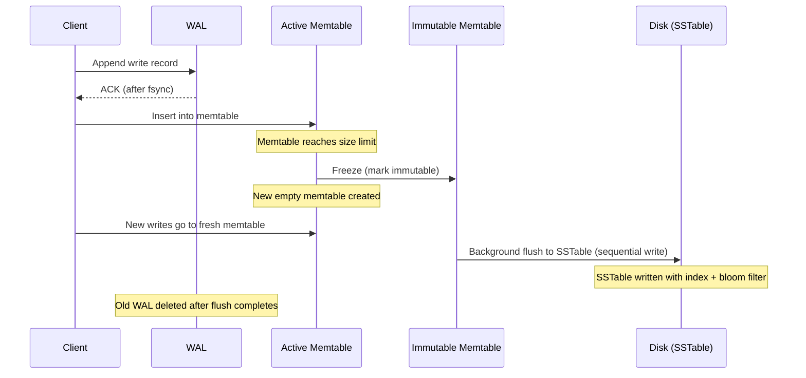
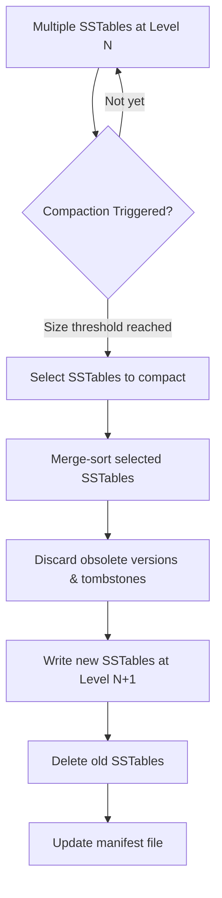
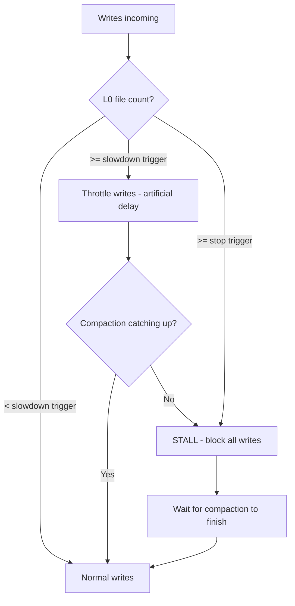

# LSM Tree (Log-Structured Merge Tree)

## What Is an LSM Tree?

A **Log-Structured Merge Tree** is a write-optimized data structure that converts
random writes into sequential writes by buffering mutations in memory and
periodically flushing sorted runs to disk. It trades read performance and space
efficiency for dramatically higher write throughput.

**Core insight:** Disk sequential I/O is 100-1000x faster than random I/O.
Instead of updating data in-place (like B+ Trees), LSM trees *append* data and
reconcile later through background compaction.

### Who Uses LSM Trees?

| Database / Engine | Notes |
|-------------------|-------|
| **RocksDB** | Facebook's fork of LevelDB; embedded engine for many systems |
| **LevelDB** | Google's original LSM implementation |
| **Apache Cassandra** | Distributed wide-column store |
| **Apache HBase** | Hadoop-ecosystem column store |
| **ScyllaDB** | C++ rewrite of Cassandra |
| **CockroachDB** | Uses RocksDB/Pebble as storage layer |
| **TiKV (TiDB)** | Distributed KV store built on RocksDB |
| **InfluxDB (TSM)** | Time-series variant of LSM |
| **BadgerDB** | Go-native LSM for Dgraph |

---

## The LSM Tree Architecture (ASCII)

```
                        WRITE PATH
                            |
                            v
                   +------------------+
                   |   Write-Ahead    |
                   |   Log (WAL)      |  <-- Step 1: durability guarantee
                   +------------------+
                            |
                            v
          +--------------------------------------+
          |          MEMTABLE (Mutable)           |
          |   (Sorted: Skip List or Red-Black)    |
          |                                       |   <-- Step 2: in-memory write
          |   Key1:Val  Key3:Val  Key7:Val  ...   |
          +--------------------------------------+
          |      IMMUTABLE MEMTABLE (Read-only)   |
          |   (Being flushed to disk)             |   <-- Step 3: freeze & flush
          +--------------------------------------+
                            |
                  FLUSH (sequential write)
                            |
                            v
  ===================== DISK (SSTables) =====================

  Level 0 (L0):  Overlapping SSTables from memtable flushes
  +----------+  +----------+  +----------+  +----------+
  | SSTable  |  | SSTable  |  | SSTable  |  | SSTable  |
  | [A-Z]    |  | [B-X]    |  | [C-W]    |  | [D-Y]    |
  +----------+  +----------+  +----------+  +----------+
        |              |             |             |
        +-------+------+------+------+
                |  COMPACTION  |
                +--------------+
                       |
                       v
  Level 1 (L1):  Non-overlapping, sorted SSTables
  +----------+  +----------+  +----------+  +----------+
  | SSTable  |  | SSTable  |  | SSTable  |  | SSTable  |
  | [A-D]    |  | [E-K]    |  | [L-R]    |  | [S-Z]    |
  +----------+  +----------+  +----------+  +----------+
                       |
                       v  (10x larger)
  Level 2 (L2):  Non-overlapping, sorted SSTables
  +------+ +------+ +------+ +------+ +------+ +------+
  |[A-B] | |[C-E] | |[F-I] | |[J-N] | |[O-T] | |[U-Z] |
  +------+ +------+ +------+ +------+ +------+ +------+
                       |
                       v  (10x larger)
  Level 3 (L3):  ...and so on...
```

---

## Write Path (Step-by-Step)

### Step 1: Write to WAL (Durability)

Every write is first appended to a **Write-Ahead Log** on disk. This is a
sequential append -- extremely fast. The WAL guarantees that if the process
crashes after acknowledging the write but before flushing the memtable, the
data can be recovered by replaying the log.

```
  Client Write (PUT key=foo, val=bar)
         |
         v
  +-------------------------------------------+
  | WAL File (append-only, sequential)        |
  |                                           |
  | [LSN:1001] PUT foo=bar                    |
  | [LSN:1002] PUT baz=qux                    |
  | [LSN:1003] DEL old_key                    |
  | ...                                       |
  +-------------------------------------------+
```

- WAL is fsynced before acknowledging the write (configurable)
- One WAL per memtable; when memtable flushes, WAL is discarded
- WAL files are small, sequential, and cheap

### Step 2: Write to Memtable (In-Memory Sorted Structure)

After WAL, the key-value pair is inserted into the **memtable** -- an in-memory
sorted data structure.

**Common implementations:**

| Structure | Insert | Lookup | Notes |
|-----------|--------|--------|-------|
| **Skip List** | O(log n) | O(log n) | RocksDB default; lock-free variants possible |
| **Red-Black Tree** | O(log n) | O(log n) | Balanced BST; used in some implementations |
| **B-Tree** (in-memory) | O(log n) | O(log n) | Cache-friendly |

**Why Skip List is preferred (RocksDB):**
- Simpler concurrent access (lock-free skip lists exist)
- Lower constant factors for in-memory operations
- Easy to iterate in sorted order for flushing

```
  Skip List Memtable (conceptual):

  Level 3:  HEAD ---------> [K] --------------------------> NIL
  Level 2:  HEAD ---------> [K] --------> [R] -----------> NIL
  Level 1:  HEAD --> [D] -> [K] -> [M] -> [R] -> [W] ----> NIL
  Level 0:  HEAD -> [B]->[D]->[F]->[K]->[L]->[M]->[R]->[W]-> NIL
                     ^    ^    ^    ^    ^    ^    ^    ^
                     |    |    |    |    |    |    |    |
                   val  val  val  val  val  val  val  val
```

### Step 3: Flush Memtable to SSTable

When the memtable reaches a size threshold (typically 64MB-256MB):

1. Current memtable is marked **immutable** (read-only)
2. A new empty memtable + WAL is created for incoming writes
3. Background thread flushes the immutable memtable to disk as an **SSTable**
4. The SSTable is written sequentially (fast)
5. Old WAL file is deleted



### Step 4: Background Compaction

Over time, SSTables accumulate on disk. **Compaction** merges multiple SSTables
into fewer, larger ones -- removing duplicates, applying deletes (tombstones),
and reducing read amplification.



---

## SSTable (Sorted String Table) Internal Structure

An SSTable is an immutable, sorted file on disk:

```
  SSTable File Layout:
  +----------------------------------------------------------+
  |                     DATA BLOCKS                          |
  |  +------------+  +------------+  +------------+          |
  |  | Block 0    |  | Block 1    |  | Block 2    |   ...    |
  |  | key1:val1  |  | key50:val  |  | key100:val |          |
  |  | key2:val2  |  | key51:val  |  | key101:val |          |
  |  | ...        |  | ...        |  | ...        |          |
  |  | key49:val  |  | key99:val  |  | key149:val |          |
  |  +------------+  +------------+  +------------+          |
  +----------------------------------------------------------+
  |                    META BLOCKS                           |
  |  +---------------------------------------------------+  |
  |  | Bloom Filter (bit array for membership testing)    |  |
  |  +---------------------------------------------------+  |
  |  | Compression Dictionary                             |  |
  |  +---------------------------------------------------+  |
  +----------------------------------------------------------+
  |                    INDEX BLOCK                           |
  |  +---------------------------------------------------+  |
  |  | key1   -> offset Block 0                           |  |
  |  | key50  -> offset Block 1                           |  |
  |  | key100 -> offset Block 2                           |  |
  |  | ...                                                |  |
  |  +---------------------------------------------------+  |
  +----------------------------------------------------------+
  |                      FOOTER                              |
  |  Index block offset | Meta block offset | Magic number   |
  +----------------------------------------------------------+
```

**Key properties of SSTables:**
- **Immutable**: once written, never modified (append-only paradigm)
- **Sorted**: keys are in sorted order within each SSTable
- **Block-based**: data divided into blocks (4KB-64KB) for efficient I/O
- **Compressed**: each block can be independently compressed (Snappy, LZ4, Zstd)

---

## Read Path

Reads in an LSM tree check multiple locations, from newest to oldest:

```
  READ key=foo
       |
       v
  1. Check ACTIVE MEMTABLE ──────── Found? ──> Return
       |                              (newest data)
       v (not found)
  2. Check IMMUTABLE MEMTABLE(s) ── Found? ──> Return
       |
       v (not found)
  3. For each SSTable level (L0 first, then L1, L2, ...):
       |
       +──> Check BLOOM FILTER ──── Definitely not here? ──> Skip
       |         |
       |         v (maybe here)
       +──> Binary search INDEX BLOCK ──> Read DATA BLOCK
       |         |
       |         v
       +──> Binary search within block ── Found? ──> Return
       |
       v (checked all levels)
  4. Key does not exist ──> Return NOT FOUND
```

### Why reads can be slow:
- Worst case: key does not exist, must check ALL levels
- L0 SSTables can overlap -- must check ALL L0 SSTables
- Bloom filters mitigate this (see below)
- Compaction reduces the number of SSTables to check

### Read amplification:
- **Point query**: may read 1 block per level = up to ~7 disk reads
- **Range query**: must merge results from all levels (merge iterator)

---

## Bloom Filters: Avoiding Unnecessary Disk Reads

A **Bloom filter** is a probabilistic data structure that answers: "Is this key
*possibly* in this SSTable?" It can have false positives but **never false
negatives**.

### How It Works

```
  Bloom Filter (m bits, k hash functions):

  Insert key "foo":
    h1("foo") = 3    ──> set bit 3
    h2("foo") = 7    ──> set bit 7
    h3("foo") = 12   ──> set bit 12

  Bit array:
  Position: 0  1  2  3  4  5  6  7  8  9 10 11 12 13 14 15
  Value:    0  0  0  1  0  0  0  1  0  0  0  0  1  0  0  0

  Lookup key "bar":
    h1("bar") = 3    ──> bit 3 = 1  (ok)
    h2("bar") = 9    ──> bit 9 = 0  (MISS!)
    Result: "bar" is DEFINITELY NOT in this SSTable --> skip disk read

  Lookup key "baz":
    h1("baz") = 3    ──> bit 3 = 1  (ok)
    h2("baz") = 7    ──> bit 7 = 1  (ok)
    h3("baz") = 12   ──> bit 12 = 1 (ok)
    Result: "baz" is MAYBE in this SSTable --> must check disk
    (could be false positive if all bits set by other keys)
```

### False Positive Rate Formula

```
  FPR = (1 - e^(-kn/m))^k

  Where:
    m = number of bits in the filter
    n = number of keys inserted
    k = number of hash functions
    FPR = false positive rate

  Optimal k (minimizes FPR):
    k = (m/n) * ln(2)

  Practical rule of thumb:
    10 bits per key  -->  ~1% false positive rate
    15 bits per key  -->  ~0.1% false positive rate
    20 bits per key  -->  ~0.01% false positive rate
```

### Impact on Read Performance

| Scenario | Without Bloom Filter | With Bloom Filter (1% FPR) |
|----------|---------------------|---------------------------|
| Key exists | Read 1 SSTable | Read 1 SSTable |
| Key absent (7 levels) | Read 7 SSTables | Read ~0.07 SSTables on avg |
| Random point queries | Terrible | Excellent |
| Range queries | N/A (bloom filters don't help) | N/A |

**RocksDB default:** 10 bits per key, ~1% FPR. Full Bloom filters (not
partitioned) are held in memory for fast access.

---

## Compaction Strategies

Compaction is the most critical background operation in LSM trees. The strategy
determines write amplification, read amplification, and space amplification.

### Strategy 1: Size-Tiered Compaction (STCS)

**Idea:** Group SSTables of similar size and merge them together.

```
  Size-Tiered Compaction:

  Time -->

  Flush:  [S1]  [S2]  [S3]  [S4]     (4 small SSTables, ~64MB each)
               |
               v  (compact when 4 SSTables of similar size)
          [====== M1 ======]           (1 medium SSTable, ~256MB)

  More flushes: [S5] [S6] [S7] [S8]
               |
               v
          [====== M2 ======]           (another medium)

  When 4 medium:
  [==M1==] [==M2==] [==M3==] [==M4==]
               |
               v
  [=============== L1 ===============]  (1 large, ~1GB)

  And so on...
```

**Pros:**
- Simple to implement
- Low write amplification (each key rewritten ~log(N) times)
- Good sustained write throughput

**Cons:**
- High space amplification (duplicate keys across tiers)
- Temporary 2x space needed during compaction
- Read amplification: must check all SSTables in a tier
- Large compactions cause I/O spikes

**Used by:** Cassandra (default), HBase, ScyllaDB (option)

### Strategy 2: Leveled Compaction (LCS)

**Idea:** Organize SSTables into levels. Each level is 10x larger than the
previous. Within each level (except L0), SSTables have non-overlapping key
ranges.

```
  Leveled Compaction:

  L0:  [SST] [SST] [SST] [SST]     (overlapping, from flushes)
         \     |     /
          \    |    /
           v   v   v
  L1:  [A-D] [E-K] [L-R] [S-Z]     (non-overlapping, ~10 SSTables)
              |
              v  (when L1 is full, compact into L2)
  L2:  [A-B][C-D][E-F][G-I][J-L][M-O][P-R][S-U][V-Z]  (~100 SSTables)
              |
              v
  L3:  [A-A][A-B]...[Y-Z][Z-Z]     (~1000 SSTables)

  Compaction from L1 to L2:
  +---------+            +------+------+------+
  | L1: E-K | overlaps   | L2:  | L2:  | L2:  |
  +---------+ with -->   | E-F  | G-I  | J-L  |
       |                 +------+------+------+
       |                      |      |     |
       v                      v      v     v
  +----------+----------+----------+----------+
  | Merge all overlapping SSTables together   |
  | Write new SSTables back to L2             |
  +----------+----------+----------+----------+
```

**Pros:**
- Low space amplification (~10% overhead)
- Good read performance (at most 1 SSTable per level to check)
- Bounded and predictable read amplification

**Cons:**
- Higher write amplification (~10x per level transition)
- More I/O spent on compaction
- Can cause write stalls when compaction falls behind

**Used by:** RocksDB (default), LevelDB

### Strategy 3: Time-Window Compaction (TWCS)

**Idea:** Partition SSTables by time windows. Within each window, use STCS.
Never compact across windows. Old windows are dropped entirely (TTL).

```
  Time-Window Compaction:

  Window: [9:00-10:00]  [10:00-11:00]  [11:00-12:00]  [NOW]
          +-----------+  +------------+  +------------+ +--------+
          | Compacted |  | Compacted  |  | Compacted  | | Active |
          | Single    |  | Single     |  | Single     | | STCS   |
          | SSTable   |  | SSTable    |  | SSTable    | | [S][S] |
          +-----------+  +------------+  +------------+ +--------+
               ^               ^               ^
               |               |               |
          Immutable       Immutable       Immutable
          (drop after     (drop after
           TTL expires)    TTL expires)

  Within active window:
  [S1] [S2] [S3] [S4]  --> STCS compaction --> [=== M1 ===]
```

**Pros:**
- Perfect for time-series data with TTL
- Old data dropped by deleting entire SSTables (no rewrite needed)
- No cross-window compaction overhead
- Very efficient for append-only temporal data

**Cons:**
- Only works for time-partitioned data
- Updates to old data are expensive
- Cannot be used for general-purpose workloads

**Used by:** Cassandra (for time-series), ScyllaDB, InfluxDB (variant)

### Strategy 4: FIFO Compaction

**Idea:** Treat SSTables as a FIFO queue. Drop oldest when total size exceeds
limit. No merging at all.

**Used for:** TTL-only, append-only workloads (logging, metrics)

### Comparison Table

| Dimension | STCS | LCS | TWCS | FIFO |
|-----------|------|-----|------|------|
| **Write amplification** | Low (~log N) | High (~10x/level) | Low | None |
| **Read amplification** | High (many SSTables) | Low (1/level) | Low (within window) | High |
| **Space amplification** | High (2x during compact) | Low (~10%) | Low | Low |
| **Write throughput** | High | Medium | High | Highest |
| **Read latency** | Higher | Lower | Low (recent data) | Higher |
| **Best for** | Write-heavy mixed | Read-heavy mixed | Time-series | Logs/metrics |
| **Worst for** | Read-heavy | Write-heavy | Updates to old data | Queries |
| **Compaction I/O** | Bursty, large | Steady, predictable | Minimal | Zero |

---

## Write Amplification

**Definition:** The ratio of bytes written to storage vs bytes written by the
application.

```
  Write Amplification Factor (WAF):

                Total bytes written to disk
  WAF  =  ─────────────────────────────────────
              Total bytes written by application

  Example (Leveled Compaction with 10x size ratio):
  - Data enters memtable:                           1x write
  - Flush memtable to L0:                           1x write
  - Compact L0 -> L1:                               ~1x write
  - Compact L1 -> L2 (data rewritten with peers):   ~10x write
  - Compact L2 -> L3:                               ~10x write
  ─────────────────────────────────────────────────
  Total WAF for leveled:  ~10-30x (depends on levels)

  For size-tiered:
  - Each key rewritten ~4-5 times total
  - WAF typically 4-10x
```

**Why it matters:**
- SSDs have limited write endurance (P/E cycles)
- High WAF = shorter SSD lifespan
- High WAF = compaction consuming disk bandwidth, competing with user I/O
- RocksDB tuning often revolves around reducing WAF

### Read Amplification

```
  Read Amplification:

                   Number of disk reads per query
  RAF  =  ──────────────────────────────────────────
                        1 (logical read)

  Leveled: ~1 read per level (with bloom filters) = ~4-7 reads
  Size-Tiered: could be dozens (all SSTables in each tier)
```

### Space Amplification

```
  Space Amplification:

              Actual disk space used
  SAF  =  ────────────────────────────
            Logical data size (live data)

  Leveled:      ~1.1x  (10% overhead)
  Size-Tiered:  ~2-3x  (duplicates + compaction temp space)
  FIFO:         ~1.0x  (no duplicates, just TTL drop)
```

### The Amplification Triangle

You can optimize at most two of three -- the third suffers:

```
         Write Amp
           /\
          /  \
         /    \
        /  You \
       /  pick  \
      /   TWO    \
     /____________\
  Read Amp    Space Amp

  Leveled:     Low Read + Low Space,   High Write
  Size-Tiered: Low Write + (ok Space), High Read
  FIFO:        Low Write + Low Space,  High Read
```

---

## Tombstones and Deletes

LSM trees do not delete data in-place. Instead, they write a **tombstone** --
a special marker indicating the key is deleted.

```
  Write: PUT(A, 100)    -->  Memtable: A=100
  Write: PUT(A, 200)    -->  Memtable: A=200  (overwrites)
  Write: DEL(A)         -->  Memtable: A=<TOMBSTONE>

  After flush, SSTable contains:
  [A=<TOMBSTONE>]

  During compaction:
  - If tombstone meets older version of A --> discard both
  - If tombstone is at the last level --> can discard tombstone
  - If tombstone is NOT at last level --> must keep it
    (to shadow older values in deeper levels)
```

**Tombstone problem:** Tombstones consume space and slow reads until they are
compacted out. Range deletes can create many tombstones.

**Range tombstones:** RocksDB supports DeleteRange() which writes a single
marker to delete an entire key range efficiently.

---

## RocksDB Deep Dive

RocksDB is the most widely used LSM engine. Understanding its internals is
essential for senior interviews.

### Column Families

A RocksDB instance can have multiple **column families** -- logically separate
keyspaces that share the same WAL but have independent memtables and SSTables.

```
  RocksDB Instance:
  +--------------------------------------------------+
  |  Shared WAL                                      |
  +--------------------------------------------------+
  |                                                  |
  |  Column Family: "default"    CF: "metadata"      |
  |  +---------------------+    +------------------+ |
  |  | Memtable            |    | Memtable         | |
  |  +---------------------+    +------------------+ |
  |  | L0: [SST][SST]      |    | L0: [SST]        | |
  |  | L1: [SST][SST][SST] |    | L1: [SST][SST]   | |
  |  | L2: [SST]...[SST]   |    | L2: [SST]..      | |
  |  +---------------------+    +------------------+ |
  +--------------------------------------------------+
```

**Use cases:** Separate hot/cold data, different compaction settings per CF,
isolate metadata from user data.

### Key RocksDB Tuning Parameters

| Parameter | Default | Effect |
|-----------|---------|--------|
| `write_buffer_size` | 64MB | Memtable size before flush |
| `max_write_buffer_number` | 2 | Concurrent memtables (1 active + N immutable) |
| `level0_file_num_compaction_trigger` | 4 | L0 files before compaction starts |
| `level0_slowdown_writes_trigger` | 20 | L0 files before write throttling |
| `level0_stop_writes_trigger` | 36 | L0 files before write stall |
| `max_bytes_for_level_base` | 256MB | Max size of L1 |
| `max_bytes_for_level_multiplier` | 10 | Each level is Nx larger |
| `target_file_size_base` | 64MB | SSTable target size |
| `num_levels` | 7 | Maximum number of levels |
| `compression_per_level` | varies | Compression algorithm per level |

### Compression Strategy

```
  Typical per-level compression:

  L0, L1:  No compression or LZ4  (fast, CPU-light -- hot data)
  L2-L4:   LZ4 or Snappy          (balanced)
  L5-L6:   Zstd                   (high ratio -- cold data, large volume)

  Rationale:
  - Upper levels are small and frequently accessed -> fast decompression
  - Lower levels are large and rarely accessed -> maximize compression ratio
```

### Write Stalls

When compaction cannot keep up with writes:



**Avoiding stalls:**
- Increase `max_write_buffer_number` (buffer more in memory)
- Increase compaction parallelism (`max_background_compactions`)
- Use faster storage (NVMe SSD)
- Tune compaction triggers

### RocksDB Read Flow (Detailed)

```
  GET(key) in RocksDB:

  1. Check active memtable           ──> O(log n) skip list lookup
     |
     v (miss)
  2. Check each immutable memtable   ──> newest first
     |
     v (miss)
  3. Check L0 SSTables (all of them, newest first)
     |
     For each L0 SSTable:
     |  a. Check bloom filter        ──> false? skip
     |  b. Binary search index block
     |  c. Read data block (may be in block cache)
     |
     v (miss)
  4. For each level L1, L2, ..., Ln:
     |  a. Binary search to find which SSTable covers key range
     |  b. Check bloom filter         ──> false? skip
     |  c. Read index block (may be cached)
     |  d. Read data block (may be cached)
     |
     v (miss at all levels)
  5. Return NOT FOUND
```

### Block Cache

RocksDB maintains a **block cache** (LRU by default) to keep frequently
accessed data blocks in memory.

```
  Memory Layout:
  +----------------------------------+
  |  Block Cache (LRU)               |
  |  - Data blocks from SSTables     |
  |  - Index blocks                  |
  |  - Filter blocks (bloom filters) |
  |  Default: 8MB (way too small!)   |
  |  Production: 1-32GB              |
  +----------------------------------+
  |  Memtables                       |
  |  write_buffer_size * max_number  |
  +----------------------------------+
  |  Table/Index/Filter Readers      |
  +----------------------------------+
```

---

## Merge Operator (RocksDB Advanced)

Instead of read-modify-write, RocksDB supports **merge operators** that defer
the merge to compaction or read time.

```
  Without merge operator (read-modify-write):
    val = GET(counter)       # 1 read
    val = val + 1
    PUT(counter, val)        # 1 write
    Problem: 2 I/O ops per increment; race conditions

  With merge operator:
    MERGE(counter, +1)       # 1 write (no read!)
    MERGE(counter, +1)       # 1 write
    MERGE(counter, +1)       # 1 write

    GET(counter):
    Finds PUT(counter, 100) in L3
    Finds MERGE(+1), MERGE(+1), MERGE(+1) in L0-L2
    Returns: 100 + 1 + 1 + 1 = 103
```

**Use cases:** Counters, append-to-list, bitwise OR (CockroachDB MVCC uses this)

---

## Practical Sizing Example

```
  Scenario: 1TB logical data, Leveled Compaction, 10x multiplier

  Level sizes:
    L1:  256MB     (~4 SSTables of 64MB)
    L2:  2.56GB    (~40 SSTables)
    L3:  25.6GB    (~400 SSTables)
    L4:  256GB     (~4000 SSTables)
    L5:  1TB+      (remaining data)

  Total levels needed:  5-6 for 1TB of data
  Read amplification:   ~5-6 disk reads per point query (with bloom filters: ~1)
  Write amplification:  ~10-30x
  Space amplification:  ~1.1x --> need ~1.1TB disk

  Bloom filter memory (10 bits/key):
    1 billion keys * 10 bits = 1.25 GB of bloom filter data
    (Typically kept in block cache or pinned in memory)
```

---

## Interview Patterns

### "Design a write-heavy time-series database"

> Use LSM tree with TWCS. Keys are (metric_id, timestamp). Write path:
> WAL -> memtable -> flush to SSTable partitioned by time window. Old
> windows are dropped by TTL (just delete the SSTable files). Bloom
> filters on metric_id prefix. This is essentially how InfluxDB/Cassandra
> handle time-series.

### "Why is RocksDB used as the storage engine for so many databases?"

> Because it provides a well-tuned, embeddable LSM engine with:
> pluggable compaction, compression, column families, merge operators,
> snapshots, transactions, and extensive tuning knobs. Building this from
> scratch would take years.

### "How do you handle a compaction storm?"

> 1. Rate-limit compaction I/O (`rate_limiter`)
> 2. Increase compaction parallelism
> 3. Use direct I/O to bypass OS page cache pollution
> 4. Consider STCS for burst-write workloads (lower write amp)
> 5. Monitor L0 file count -- early warning of compaction debt

---

## Key Takeaways

1. **LSM trees trade read performance for write performance** by converting
   random writes into sequential writes via in-memory buffering and periodic
   flushing.

2. **The write path is simple:** WAL -> Memtable -> SSTable flush. The
   complexity is in compaction.

3. **Compaction strategy is the most important tuning decision:** STCS for
   writes, LCS for reads, TWCS for time-series.

4. **Bloom filters are essential:** they reduce point-query read amplification
   from O(levels) to O(1) on average.

5. **Write amplification is the primary cost:** it wears out SSDs and consumes
   disk bandwidth. Leveled compaction can have 10-30x write amplification.

6. **RocksDB is the de facto standard LSM engine:** understanding its column
   families, block cache, compression tiers, and write stall mechanics is
   expected at senior level.
