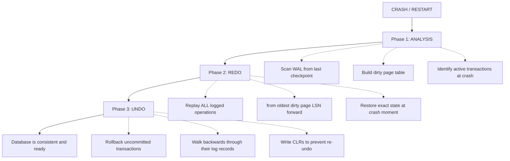
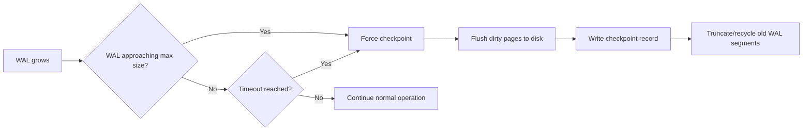
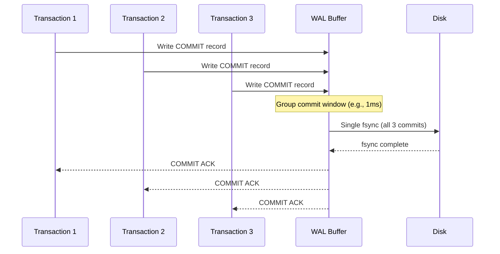

# Write-Ahead Log (WAL) and Recovery

## The Fundamental Problem

Databases modify data in memory (buffer pool) for speed, but memory is
volatile. If the system crashes, all in-memory modifications are lost. We
need a mechanism to guarantee **durability** (the D in ACID) without writing
every data page to disk synchronously (which would be prohibitively slow).

**Solution:** Write-Ahead Logging (WAL).

**The WAL rule:** Before any modification to a data page is written to disk,
the corresponding log record MUST be written to stable storage first.

This single rule enables crash recovery with no data loss.

---

## How WAL Works

### The Write Flow

```
  Transaction: UPDATE accounts SET balance = 200 WHERE id = 1;
  (Previous balance was 100)

  Step 1: Write log record BEFORE modifying data page
  +----------------------------------------------------------+
  | WAL Record:                                               |
  | LSN: 1001                                                 |
  | Transaction ID: T42                                       |
  | Page ID: 5                                                |
  | Operation: UPDATE                                         |
  | Before Image: {id=1, balance=100}                         |
  | After Image:  {id=1, balance=200}                         |
  +----------------------------------------------------------+
         |
         v  (fsync to WAL on disk)

  Step 2: Modify the data page IN MEMORY (buffer pool)
  +----------------------------------------------------------+
  | Buffer Pool - Page 5 (DIRTY):                             |
  | {id=1, balance=200}  <-- modified in memory only          |
  | Page LSN: 1001       <-- tracks latest WAL record         |
  +----------------------------------------------------------+

  Step 3: On COMMIT, ensure WAL is fsynced
  +----------------------------------------------------------+
  | WAL Record:                                               |
  | LSN: 1005                                                 |
  | Transaction ID: T42                                       |
  | Operation: COMMIT                                         |
  +----------------------------------------------------------+
         |
         v  (fsync -- this is when durability is guaranteed)
         |
         v  ACK to client: "COMMIT successful"

  Step 4: Data page 5 written to disk LATER (checkpoint)
  (Could be seconds, minutes, or even hours later)
```

### WAL Sequence Diagram

```mermaid
sequenceDiagram
    participant C as Client
    participant E as Query Engine
    participant BP as Buffer Pool
    participant WAL as WAL (disk)
    participant DF as Data Files (disk)

    C->>E: BEGIN; UPDATE balance=200 WHERE id=1;
    E->>WAL: Write log record (LSN:1001, before=100, after=200)
    WAL-->>E: Log record persisted (fsync)
    E->>BP: Modify page 5 in memory (mark dirty)
    BP-->>E: Page modified

    C->>E: COMMIT;
    E->>WAL: Write COMMIT record (LSN:1005)
    WAL-->>E: Commit record persisted (fsync)
    E-->>C: COMMIT OK

    Note over BP,DF: Page 5 is dirty in buffer pool,<br/>NOT yet on disk

    Note over BP,DF: Later... checkpoint triggers

    BP->>DF: Write dirty page 5 to disk
    DF-->>BP: Page persisted
    Note over BP: Page 5 now clean
```

### Log Sequence Number (LSN)

The **LSN** is a monotonically increasing identifier for each WAL record. It
serves as the logical clock of the database.

```
  WAL Stream:
  +-------+-------+-------+-------+-------+-------+-------+
  | LSN   | LSN   | LSN   | LSN   | LSN   | LSN   | LSN   |
  | 1000  | 1001  | 1002  | 1003  | 1004  | 1005  | 1006  |
  | BEGIN | UPDATE| INSERT| DELETE| UPDATE| COMMIT| BEGIN |
  | T42   | T42   | T43   | T42   | T43   | T42   | T44   |
  +-------+-------+-------+-------+-------+-------+-------+

  Each data page tracks its pageLSN = LSN of the last log record
  that modified this page.

  During recovery:
    If pageLSN < WAL record LSN  -->  redo needed (page is stale)
    If pageLSN >= WAL record LSN -->  skip (page already has this change)
```

---

## WAL Record Types

| Record Type | Contents | Purpose |
|-------------|----------|---------|
| **INSERT** | After image (new row) | Redo inserts during recovery |
| **UPDATE** | Before + after image | Redo updates; undo if needed |
| **DELETE** | Before image (deleted row) | Undo deletes if rollback |
| **COMMIT** | Transaction ID | Marks transaction as committed |
| **ABORT** | Transaction ID | Marks transaction as rolled back |
| **CHECKPOINT** | Dirty page table, active txn list | Recovery starting point |
| **CLR** (Compensation Log Record) | Undo operation logged | Prevents re-undoing during repeated crash |

---

## ARIES Recovery Algorithm

**ARIES** (Algorithms for Recovery and Isolation Exploiting Semantics) is the
gold standard recovery algorithm used by PostgreSQL, MySQL InnoDB, SQL Server,
and DB2.

### The Three Phases



### Phase 1: Analysis

Starting from the last **checkpoint record**, scan the WAL forward:

```
  WAL:  ... [CHECKPOINT] ... [records] ... [records] ... [CRASH]
                 ^                                          ^
                 |                                          |
              Start scan here                         Crash point

  Build two data structures:

  1. Dirty Page Table (DPT):
     +----------+-------------------+
     | Page ID  | Recovery LSN      |
     |          | (first LSN that   |
     |          |  dirtied the page)|
     +----------+-------------------+
     | Page 5   | LSN 1001          |
     | Page 12  | LSN 1003          |
     | Page 8   | LSN 1010          |
     +----------+-------------------+

  2. Active Transaction Table (ATT):
     +--------+----------+----------+
     | Txn ID | Status   | Last LSN |
     +--------+----------+----------+
     | T42    | COMMITTED| 1005     |  <-- saw COMMIT record
     | T43    | ACTIVE   | 1004     |  <-- no COMMIT found -> loser
     | T44    | ACTIVE   | 1006     |  <-- no COMMIT found -> loser
     +--------+----------+----------+

  "Winners" = committed transactions (T42)
  "Losers"  = active at crash time (T43, T44) -> must undo
```

### Phase 2: Redo (Repeating History)

ARIES redoes ALL operations, not just committed ones. This restores the
database to its exact state at the crash point.

```
  Start redo from: min(all RecoveryLSN values in DPT)
  In our example: min(1001, 1003, 1010) = LSN 1001

  For each log record from LSN 1001 to end of WAL:

  LSN 1001 (UPDATE Page 5):
    Is Page 5 in DPT? YES
    Is 1001 >= RecoveryLSN for Page 5 (1001)? YES
    Read Page 5 from disk. Is pageLSN < 1001? 
      YES -> apply the change (redo)
      NO  -> skip (already applied)

  LSN 1002 (INSERT Page 12):
    Same check... redo if needed

  ... continue through ALL records ...

  After redo: database is in the exact state it was at crash time.
  This includes UNCOMMITTED changes from T43 and T44.
```

**Why redo uncommitted transactions?**
- Simplifies recovery logic (no need to distinguish during redo)
- Required for physical logging (page-level changes might be interleaved)
- Uncommitted changes will be undone in Phase 3

### Phase 3: Undo (Rolling Back Losers)

Walk backward through the WAL records of each uncommitted transaction:

```
  Undo T43 (last LSN = 1004):
    Read LSN 1004: DELETE on Page 12
      -> Write a CLR: "undo of DELETE = re-INSERT on Page 12"
      -> Apply the undo
      -> Follow prevLSN pointer to T43's previous record

    Read LSN 1002: INSERT on Page 12
      -> Write a CLR: "undo of INSERT = DELETE on Page 12"
      -> Apply the undo

    T43 fully undone. Write ABORT record.

  Undo T44 (last LSN = 1006):
    Similar process...

  CLR records ensure that if we crash AGAIN during recovery,
  we don't re-undo operations that were already undone.
```

### Why CLRs (Compensation Log Records)?

```
  Scenario: Crash during recovery

  First crash:
    WAL: ... [T43:INSERT] ... [T43:DELETE] ... [CRASH-1]

  Recovery attempt 1:
    Undo T43's DELETE -> write CLR-1
    Undo T43's INSERT -> [CRASH-2 during undo!]

  Recovery attempt 2 (without CLRs):
    Would try to undo DELETE again -> WRONG (already undone)

  Recovery attempt 2 (with CLRs):
    Sees CLR-1 -> skip, already undone
    Continues undoing INSERT -> complete
    T43 fully undone.

  CLRs make recovery IDEMPOTENT -- safe to restart at any point.
```

---

## Checkpointing

Checkpoints reduce recovery time by flushing dirty pages and establishing a
known-good starting point.

### Types of Checkpoints

```
  1. Sharp Checkpoint (naive):
     - STOP all transactions
     - Flush ALL dirty pages to disk
     - Write checkpoint record to WAL
     - Resume transactions

     Problem: stalls the entire database. Unusable in production.

  2. Fuzzy Checkpoint (used in practice):
     - Write BEGIN_CHECKPOINT to WAL
     - Record the current dirty page table and active transaction table
     - Write END_CHECKPOINT to WAL (with DPT and ATT)
     - Flush dirty pages IN THE BACKGROUND (no stall)

     The checkpoint record captures a SNAPSHOT of the state.
     Recovery starts from this snapshot, not from the beginning of time.

  3. Incremental Checkpoint:
     - Continuously flush oldest dirty pages in the background
     - Periodically write a checkpoint record
     - Used by InnoDB (adaptive flushing)
```

### Checkpoint Frequency Trade-off

```
  Frequent checkpoints:
    + Faster recovery (less WAL to replay)
    + Can truncate old WAL (save disk space)
    - More I/O for flushing dirty pages
    - Can interfere with normal workload

  Infrequent checkpoints:
    + Less I/O overhead during normal operation
    - Longer recovery time after crash
    - More WAL space consumed

  PostgreSQL: checkpoint_timeout (default 5 minutes)
  InnoDB:     innodb_log_file_size controls when checkpoint is forced
```



---

## WAL in Different Databases

### PostgreSQL WAL

```
  WAL Segment Files (default 16MB each):
  pg_wal/
    000000010000000000000001   (16MB)
    000000010000000000000002   (16MB)
    000000010000000000000003   (16MB)
    ...

  Key parameters:
    wal_level = replica          (minimal, replica, logical)
    max_wal_size = 1GB           (triggers checkpoint when exceeded)
    min_wal_size = 80MB          (minimum WAL to retain)
    wal_buffers = 16MB           (WAL buffer in shared memory)
    synchronous_commit = on      (fsync on commit -- durability guarantee)
    checkpoint_timeout = 5min    (time between checkpoints)

  Streaming Replication:
    Primary --> sends WAL records --> Standby (replays WAL)
    This is how PostgreSQL HA works: the standby is always
    replaying the primary's WAL, staying in sync.

  WAL Archiving:
    archive_mode = on
    archive_command = 'cp %p /archive/%f'
    Completed WAL segments are archived for point-in-time recovery.
```

### MySQL InnoDB Logs

MySQL has TWO separate log systems:

```
  1. InnoDB Redo Log (WAL equivalent):
     - Circular log files: ib_logfile0, ib_logfile1
     - Fixed size (default 48MB each, should be much larger in prod)
     - Used for crash recovery (redo)
     - Key parameter: innodb_log_file_size

  2. Binary Log (Binlog):
     - NOT a WAL -- it's a logical replication log
     - Records SQL statements or row changes
     - Used for:
       a. Replication (primary -> replica)
       b. Point-in-time recovery
       c. CDC (Change Data Capture)
     - Written AFTER transaction commits

  The relationship:
  +----------+     +--------------+     +----------+
  | InnoDB   | --> | 2-Phase      | --> | Binary   |
  | Redo Log |     | Commit (XA)  |     | Log      |
  +----------+     +--------------+     +----------+
       ^                                      |
       |                                      v
    Crash recovery                     Replication
    (physical redo)                    (logical replay)

  The 2-phase commit between redo log and binlog ensures they
  are consistent. Without it, a crash could leave them out of sync.
```

### Cassandra Commit Log (LSM WAL)

```
  Cassandra Write Path:
  1. Append to Commit Log (WAL equivalent)
  2. Write to Memtable

  Differences from RDBMS WAL:
  - Commit log is per-node, not per-table
  - No redo/undo phases -- just replay into memtables
  - Once memtable is flushed to SSTable, commit log segment is discarded
  - Simpler because Cassandra doesn't support transactions across rows

  Commit Log Segments:
  commitlog/
    CommitLog-1234.log   (when full, new segment created)
    CommitLog-1235.log
    CommitLog-1236.log   (active, being written to)
```

---

## Log-Structured Storage vs In-Place Update

Two fundamentally different approaches to storage:

```
  In-Place Update (B+ Tree model):
  +--------+--------+--------+
  | Page 1 | Page 2 | Page 3 |   Fixed pages on disk
  +--------+--------+--------+
       ^
       |
    UPDATE: overwrite data directly in the page
    (requires WAL for crash safety)

  Log-Structured (LSM / Append-Only):
  +------+------+------+------+------+------+-->
  | Rec1 | Rec2 | Rec3 | Rec4 | Rec5 | Rec6 |  Append-only
  +------+------+------+------+------+------+-->
                   ^             ^
                   |             |
              Old version   New version of same key
              (will be garbage collected by compaction)

  In log-structured storage, the WAL IS the database.
  There is no separate "data file" -- the log is the source of truth.
```

| Aspect | In-Place Update | Log-Structured |
|--------|----------------|----------------|
| Write pattern | Random I/O | Sequential I/O |
| WAL needed? | Yes (for crash recovery) | The log IS the data |
| Read pattern | Direct page access | Merge from multiple files |
| Space usage | Compact | Amplified (old versions) |
| Recovery | ARIES (complex) | Replay log (simpler) |
| Concurrency | Page-level locking | Append-only (no conflicts) |
| Fragmentation | Page splits, dead tuples | Compaction handles it |

---

## Group Commit Optimization

Fsyncing the WAL on every single COMMIT is expensive. **Group commit**
batches multiple transactions' commit records into a single fsync.

```
  Without group commit:
    T1: COMMIT -> fsync WAL   (4ms)
    T2: COMMIT -> fsync WAL   (4ms)
    T3: COMMIT -> fsync WAL   (4ms)
    Total: 12ms, 3 fsyncs

  With group commit:
    T1: COMMIT -> write to WAL buffer
    T2: COMMIT -> write to WAL buffer
    T3: COMMIT -> write to WAL buffer
    Leader: fsync WAL buffer once  (4ms)
    All three ACK'd: 4ms, 1 fsync

  Throughput improvement: up to 10-50x for short transactions
```



**PostgreSQL:** `commit_delay` and `commit_siblings` control group commit
behavior. With enough concurrent transactions, group commit happens naturally.

---

## Durability Trade-offs

| Setting | Durability | Performance | Use Case |
|---------|-----------|-------------|----------|
| `synchronous_commit = on` | Full | Slowest | Financial transactions |
| `synchronous_commit = off` | Risk of last ~600ms | Faster | Analytics, logging |
| `fsync = off` | None after crash | Fastest | Development only |
| WAL on battery-backed cache | Full | Fast | Production best practice |

**The `synchronous_commit = off` trick (PostgreSQL):**
- WAL is still written, just not fsynced on every commit
- Background WAL writer flushes every `wal_writer_delay` (200ms default)
- Maximum data loss: ~3x `wal_writer_delay` = ~600ms of transactions
- The database remains consistent (no corruption), but recent commits may vanish
- Excellent for write-heavy workloads where losing the last 600ms is acceptable

---

## Interview Patterns

### "How does a database guarantee durability?"

> Write-Ahead Logging. Every modification is logged to the WAL and fsynced to
> disk BEFORE acknowledging the commit. If the system crashes, the WAL is
> replayed during recovery: committed transactions are redone, uncommitted
> transactions are undone (ARIES algorithm). The data pages themselves can be
> written lazily via checkpoints.

### "What happens if the database crashes mid-transaction?"

> During recovery: (1) Analysis phase scans WAL from last checkpoint to
> identify dirty pages and active transactions. (2) Redo phase replays all
> logged operations to restore the exact crash-moment state. (3) Undo phase
> rolls back any transaction that did not commit. CLR records ensure this
> process is idempotent even if we crash again during recovery.

### "Why does PostgreSQL need VACUUM?"

> PostgreSQL uses MVCC with in-place versioning: updates create new tuple
> versions, and old versions remain until VACUUM removes them. VACUUM also
> updates the visibility map (enabling index-only scans) and freezes old
> transaction IDs (preventing wraparound). Without VACUUM, tables bloat
> and eventually transaction ID wraparound causes a forced shutdown.

---

## Key Takeaways

1. **WAL is the foundation of database durability.** The rule is simple: log
   the change before making the change. Everything else follows from this.

2. **ARIES recovery** (Analysis, Redo, Undo) is the standard algorithm. It
   replays history to restore crash-moment state, then undoes uncommitted work.
   CLRs make it idempotent.

3. **Checkpoints** bound recovery time by periodically flushing dirty pages and
   establishing a WAL starting point.

4. **Group commit** is essential for write throughput -- batching fsync calls
   for multiple transactions into one.

5. **Different databases, same principle:** PostgreSQL (WAL segments + streaming
   replication), MySQL (redo log + binlog with 2PC), Cassandra (commit log +
   memtable flush). The WAL concept is universal.

6. **Log-structured vs in-place update** is the fundamental storage dichotomy.
   In-place update needs WAL for recovery; log-structured storage IS the log.
