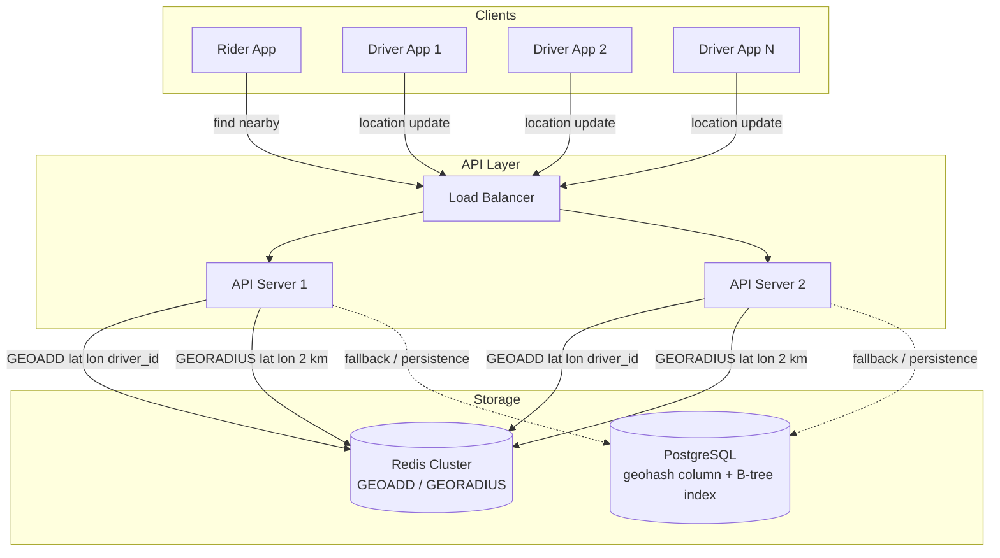
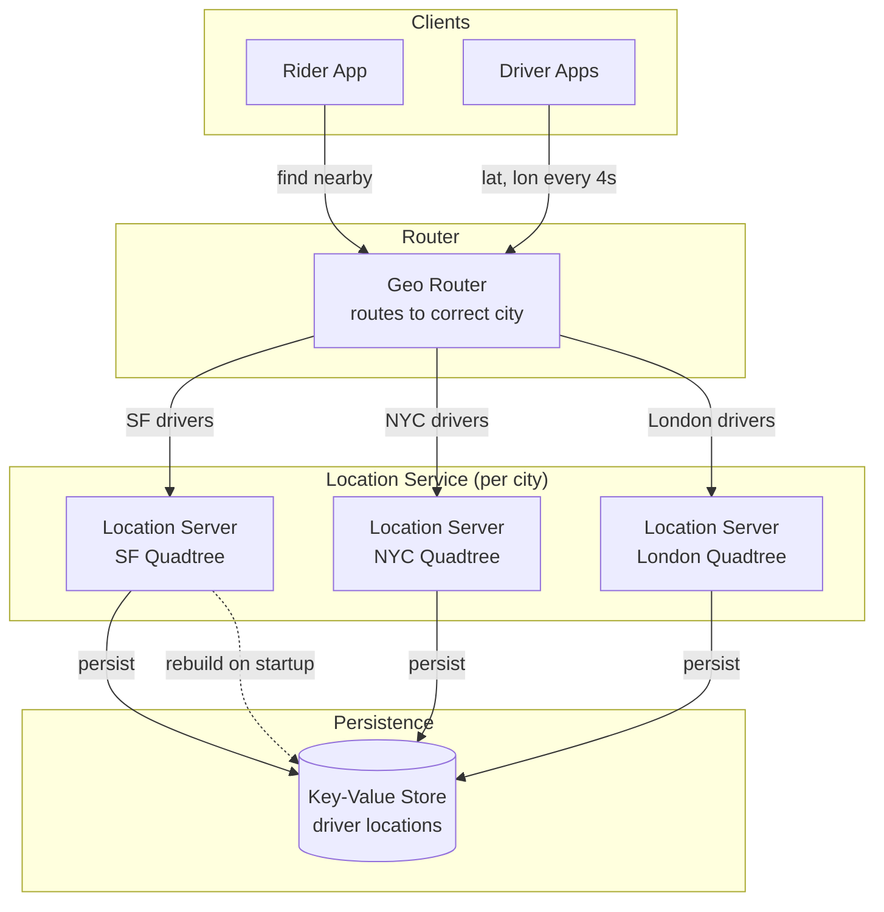
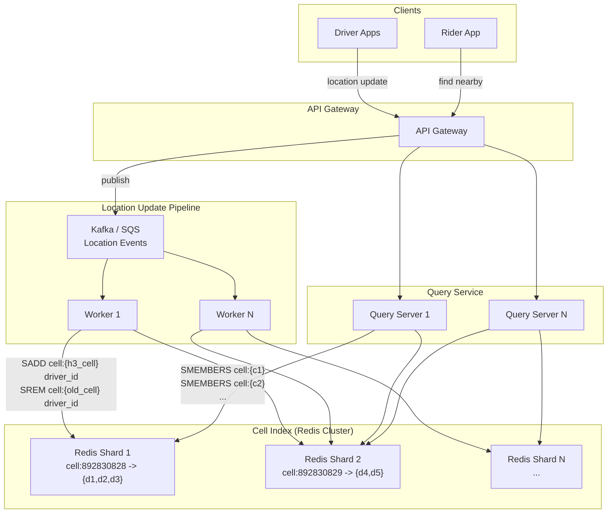
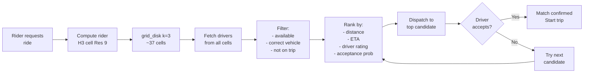

# Proximity Search System Design

## The Classic Interview Question

> "Design a system to find nearby friends / find the nearest available drivers."

This is the bread-and-butter Uber interview question. It combines geospatial
indexing, real-time updates, and scale challenges. Below are three concrete
approaches, each with architecture diagrams and trade-off analysis.

---

## Approach 1: Geohash + Database

### How It Works

1. Every driver periodically sends (lat, lon) to the server
2. Server computes geohash (precision 6, ~1.2 km cells) and stores it
3. When a rider requests nearby drivers:
   - Compute rider's geohash
   - Find 9 cells (current + 8 neighbors)
   - Query database for all drivers in those cells
   - Post-filter by Haversine distance
   - Return top K closest

### Architecture



### Implementation

```python
import redis
import math

r = redis.Redis(host="redis-cluster", port=6379)

# --- Driver sends location update ---
def update_driver_location(driver_id: str, lat: float, lon: float):
    """Called every 3-5 seconds per active driver."""
    r.geoadd("active_drivers", lon, lat, driver_id)
    # Also store metadata
    r.hset(f"driver:{driver_id}", mapping={
        "lat": lat, "lon": lon, "status": "available",
        "updated_at": int(time.time())
    })

# --- Rider requests nearby drivers ---
def find_nearby_drivers(rider_lat: float, rider_lon: float,
                         radius_km: float = 3.0, max_results: int = 10):
    """Find closest available drivers within radius."""
    nearby = r.georadius(
        "active_drivers",
        longitude=rider_lon,
        latitude=rider_lat,
        radius=radius_km,
        unit="km",
        withcoord=True,
        withdist=True,
        sort="ASC",
        count=max_results * 3  # over-fetch to account for unavailable
    )
    
    # Filter to only available drivers
    results = []
    for driver_id, dist, (lon, lat) in nearby:
        driver_id = driver_id.decode()
        status = r.hget(f"driver:{driver_id}", "status")
        if status == b"available":
            results.append({
                "driver_id": driver_id,
                "distance_km": dist,
                "lat": lat,
                "lon": lon
            })
        if len(results) >= max_results:
            break
    
    return results
```

### Trade-offs

| Pros                              | Cons                                        |
|:----------------------------------|:--------------------------------------------|
| Simple to implement               | Redis GEORADIUS is O(N) within the sorted set|
| Redis handles millions of updates | Single point of failure without clustering   |
| No custom data structures needed  | Geohash edge effects (mitigated by Redis)   |
| Battle-tested (Redis GEO since 3.2)| All drivers in one sorted set = hot key    |

---

## Approach 2: Quadtree in Memory

### How It Works

1. Build an in-memory quadtree of all active drivers for each city
2. Drivers send location updates to a location service
3. Location service updates the quadtree (delete old, insert new)
4. Rider query: KNN search on the quadtree
5. Periodically rebuild the tree to avoid fragmentation

### Architecture



### Key Design Decisions

**Sharding by city:**
```
Each city gets its own quadtree server.
- SF: ~50K active drivers --> ~5 MB tree
- NYC: ~80K active drivers --> ~8 MB tree
- All cities combined: fits on a single machine, but sharding
  provides isolation and reduces blast radius.
```

**Handling driver movement:**
```python
class CityQuadTreeService:
    def __init__(self, city_bounds):
        self.tree = QuadTree(city_bounds, capacity=50)
        self.driver_points = {}  # driver_id -> Point
    
    def update_location(self, driver_id, lat, lon):
        # Remove old position
        old_point = self.driver_points.get(driver_id)
        if old_point:
            self.tree.delete(old_point)
        
        # Insert new position
        new_point = Point(lon, lat, {"driver_id": driver_id})
        self.tree.insert(new_point)
        self.driver_points[driver_id] = new_point
    
    def find_nearest(self, lat, lon, k=10):
        return self.tree.knn(Point(lon, lat, {}), k)
    
    def rebuild(self):
        """Called every 15 seconds to defragment."""
        new_tree = QuadTree(self.tree.boundary, capacity=50)
        for point in self.driver_points.values():
            new_tree.insert(point)
        self.tree = new_tree  # atomic swap
```

### Trade-offs

| Pros                                  | Cons                                    |
|:--------------------------------------|:----------------------------------------|
| Adapts to data density automatically  | In-memory only -- lost on crash         |
| Very fast KNN queries (~1 ms)         | Must rebuild periodically               |
| No external dependencies              | Sharding logic adds complexity          |
| Natural pruning for efficient search  | Not horizontally scalable per city      |
| Good for non-uniform driver density   | Needs replication for HA                |

---

## Approach 3: H3 / S2 Grid + Cache

### How It Works

1. Assign each driver to an H3 cell (resolution 9, ~174 m)
2. Store cell-to-drivers mapping in Redis/Memcached
3. On query: compute rider's cell, get k-ring neighbors, look up drivers
4. Post-filter by actual distance

### Architecture



### Implementation

```python
import h3
import redis

r = redis.Redis(host="redis-cluster", port=6379)
H3_RESOLUTION = 9  # ~174 m cells

# --- Location Update Worker ---
def process_location_update(driver_id: str, lat: float, lon: float):
    """Called by Kafka consumer for each location event."""
    new_cell = h3.latlng_to_cell(lat, lon, H3_RESOLUTION)
    
    # Get driver's previous cell
    old_cell = r.hget(f"driver:{driver_id}", "h3_cell")
    
    pipe = r.pipeline()
    
    # Remove from old cell if changed
    if old_cell and old_cell.decode() != new_cell:
        pipe.srem(f"cell:{old_cell.decode()}", driver_id)
    
    # Add to new cell
    pipe.sadd(f"cell:{new_cell}", driver_id)
    
    # Update driver metadata
    pipe.hset(f"driver:{driver_id}", mapping={
        "lat": lat, "lon": lon,
        "h3_cell": new_cell,
        "status": "available"
    })
    
    # TTL: auto-expire if driver stops sending updates
    pipe.expire(f"cell:{new_cell}", 60)
    
    pipe.execute()

# --- Query Service ---
def find_nearby_drivers(rider_lat: float, rider_lon: float,
                         k_ring: int = 2, max_results: int = 10):
    """Find nearest drivers using H3 k-ring search."""
    rider_cell = h3.latlng_to_cell(rider_lat, rider_lon, H3_RESOLUTION)
    
    # Get all cells within k rings (k=2 --> 19 cells)
    search_cells = h3.grid_disk(rider_cell, k_ring)
    
    # Fetch all drivers from all cells (pipeline for efficiency)
    pipe = r.pipeline()
    for cell in search_cells:
        pipe.smembers(f"cell:{cell}")
    cell_results = pipe.execute()
    
    # Collect all candidate driver IDs
    candidate_ids = set()
    for members in cell_results:
        candidate_ids.update(m.decode() for m in members)
    
    # Fetch locations and compute distances
    candidates = []
    pipe = r.pipeline()
    for did in candidate_ids:
        pipe.hgetall(f"driver:{did}")
    driver_data = pipe.execute()
    
    for did, data in zip(candidate_ids, driver_data):
        if not data or data.get(b"status") != b"available":
            continue
        dlat = float(data[b"lat"])
        dlon = float(data[b"lon"])
        dist = haversine(rider_lat, rider_lon, dlat, dlon)
        candidates.append((did, dist, dlat, dlon))
    
    # Sort by distance, return top K
    candidates.sort(key=lambda x: x[1])
    return candidates[:max_results]
```

### Trade-offs

| Pros                                   | Cons                                    |
|:---------------------------------------|:----------------------------------------|
| Horizontally scalable (shard by cell)  | More moving parts (Kafka + Redis + API) |
| Hexagons = better distance approx      | Cell membership management adds logic   |
| Decoupled updates from queries         | Slightly stale data (async pipeline)    |
| Natural for analytics (surge, demand)  | Requires H3 library everywhere          |
| Works globally (no pole distortion)    | More Redis keys to manage               |

---

## The Haversine Formula

Used to calculate the great-circle distance between two points on a sphere:

```python
import math

def haversine(lat1: float, lon1: float, lat2: float, lon2: float) -> float:
    """Return distance in kilometers between two lat/lon points."""
    R = 6371.0  # Earth's radius in km
    
    lat1, lon1, lat2, lon2 = map(math.radians, [lat1, lon1, lat2, lon2])
    
    dlat = lat2 - lat1
    dlon = lon2 - lon1
    
    a = (math.sin(dlat / 2) ** 2 +
         math.cos(lat1) * math.cos(lat2) * math.sin(dlon / 2) ** 2)
    c = 2 * math.asin(math.sqrt(a))
    
    return R * c

# Example
dist = haversine(37.7749, -122.4194, 37.7849, -122.4094)
print(f"{dist:.3f} km")  # ~1.387 km
```

**Interview note:** You do not need to derive Haversine from scratch. Just know:
- It accounts for Earth's curvature (unlike Euclidean distance on lat/lon)
- It assumes a perfect sphere (Earth is actually an oblate spheroid)
- For short distances (<10 km), the error vs a flat approximation is negligible
- For Uber-scale accuracy, Vincenty's formula is more precise but slower

---

## Real-World: How Uber Actually Does It

### The Full Picture

Uber uses different spatial indexes for different purposes:

```
+------------------------------------------------------------------+
|                        Uber's Geospatial Stack                    |
+------------------------------------------------------------------+
|                                                                    |
|  SURGE PRICING         DRIVER MATCHING        ETA ESTIMATION      |
|  +-----------+         +-----------+          +-----------+        |
|  | H3 Res 7  |         | H3 Res 9  |          | H3 + Road |       |
|  | (~1.2 km) |         | (~174 m)  |          | Network   |       |
|  +-----------+         +-----------+          +-----------+        |
|       |                      |                      |              |
|  Demand/supply          Candidate             Historical           |
|  per hex cell           drivers in            travel times         |
|  --> multiplier         k-ring search         per cell pair        |
|                              |                                     |
|                        +-----+------+                              |
|                        | Ranking &  |                              |
|                        | Assignment |                              |
|                        +-----+------+                              |
|                              |                                     |
|                        Dispatch to                                 |
|                        best driver                                 |
+------------------------------------------------------------------+
```

### Uber's Driver Matching Flow



### Key Design Decisions at Uber Scale

**1. Why not just use GEORADIUS?**
At Uber's scale (millions of active drivers), a single Redis sorted set becomes
a hot key. H3 cells distribute the load across millions of Redis keys.

**2. Why H3 over S2?**
Uber chose hexagons for analytics (surge, demand forecasting). The equidistant
neighbor property makes spatial aggregation cleaner. S2 is better for pure
spatial indexing; H3 is better when you also need spatial analytics.

**3. How do they handle cell boundaries?**
k-ring search (grid_disk) naturally handles boundaries. A k=2 ring at resolution 9
covers roughly a 700 m radius -- enough for most urban matching.

**4. Update frequency?**
Active drivers send GPS every 4 seconds. That is ~250K updates/second for a
large city. The Kafka-based pipeline absorbs this without blocking queries.

---

## Interview Walkthrough: "Design Uber's Driver Matching"

Follow this structure for a 45-minute system design interview:

### Minutes 0-5: Requirements

**Functional:**
- Riders can request a ride from their current location
- System finds the closest available driver
- Drivers continuously report their location
- Support millions of concurrent drivers and riders

**Non-functional:**
- Latency: match within 5 seconds
- Availability: 99.99% uptime
- Consistency: a driver should only be matched to one rider at a time
- Scale: 1M active drivers, 100K concurrent ride requests

### Minutes 5-15: High-Level Design

```
Rider --> API Gateway --> Matching Service --> Response

                              |
                    +---------+---------+
                    |                   |
            Location Index        Driver State
            (H3 + Redis)         (status, vehicle)
                    |
            Location Updates
            (from Driver apps)
```

### Minutes 15-30: Deep Dive into Spatial Indexing

Choose H3 (or explain the trade-offs and let the interviewer guide you):

1. **Cell assignment:** Each driver is assigned to an H3 cell at resolution 9
2. **Storage:** Redis SET per cell: `cell:{h3_index} -> {driver_ids}`
3. **Query:** Rider's cell + grid_disk(k=2) = 19 cells to search
4. **Ranking:** Sort candidates by (ETA, rating, acceptance probability)
5. **Dispatch:** Send request to top driver, timeout after 15s, try next

### Minutes 30-40: Scale and Edge Cases

**Scale:**
- Shard Redis by H3 cell hash (consistent hashing across Redis cluster)
- Location update pipeline: Kafka partitioned by driver_id for ordering
- Matching service: stateless, horizontally scalable

**Edge cases:**
- No drivers nearby: expand k-ring (k=3, k=4, ...) up to a max radius
- Driver goes offline mid-match: timeout + retry with next candidate
- Cell boundary: k-ring naturally handles this (no 9-neighbor hack needed)
- High-demand area: surge pricing kicks in (separate H3 res 7 analysis)

### Minutes 40-45: Monitoring and Operations

- Track: match latency p50/p99, match success rate, empty-cell queries
- Alert on: spike in "no drivers found", Redis latency > 10ms
- Graceful degradation: if Redis shard fails, fall back to wider search

---

## Common Follow-Up Questions with Answers

**Q: How do you handle drivers moving across cell boundaries?**
Each location update recomputes the H3 cell. If the cell changed, remove from old
cell set, add to new cell set. This is an atomic Redis pipeline operation. Since
updates come every 4 seconds and cells are ~174 m wide, most updates stay in the
same cell.

**Q: What if there are no drivers in the k-ring?**
Expand the search radius. Increase k from 2 to 3, 4, 5, etc. At k=5, you cover
~91 cells (~1.7 km radius at res 9). If still empty, switch to a coarser
resolution (res 7 or 8) for a wider search.

**Q: How do you prevent two riders from matching to the same driver?**
Use an optimistic locking pattern. When the matching service selects a driver:
1. SET driver:{id}:status "matching" NX EX 15 (atomic, fails if already set)
2. If SET succeeds, send dispatch request to driver
3. If driver accepts, SET status to "on_trip"
4. If driver declines or times out, DEL the status key

**Q: How do you handle surge pricing with the same system?**
Surge uses a coarser H3 resolution (res 7, ~1.2 km cells). A separate analytics
pipeline counts requests and available drivers per cell over a sliding window.
When demand/supply > threshold, a surge multiplier is set for that cell. This is
independent of the matching system but uses the same H3 indexing.

**Q: What about ETA estimation?**
Pre-compute average travel times between H3 cells using historical trip data.
Store in a lookup table: `eta[cell_a][cell_b] -> minutes`. For the initial
estimate, use straight-line Haversine distance / average city speed. Refine
with routing engine (OSRM / Valhalla) for the final ETA shown to the rider.

**Q: Why not just use PostGIS?**
PostGIS with an R-Tree index is excellent for spatial queries, but:
1. PostgreSQL cannot handle 250K writes/second for location updates
2. R-Tree rebalancing on every insert adds latency
3. Redis is faster for simple key-value lookups (sub-millisecond)
4. PostGIS shines for complex spatial queries (polygon intersection, routing),
   not for simple "find nearest points" at extreme write throughput.

**Q: How does this differ for "Nearby Friends" vs "Find Drivers"?**
- Nearby Friends: both sides move, but update frequency is lower (every 30s).
  Can use a simpler geohash + Redis approach. No surge or ranking logic needed.
- Find Drivers: one side (rider) is fixed, drivers move frequently. Needs
  sub-second query latency, driver state tracking, and dispatch logic.
  Requires H3/S2 at scale.
