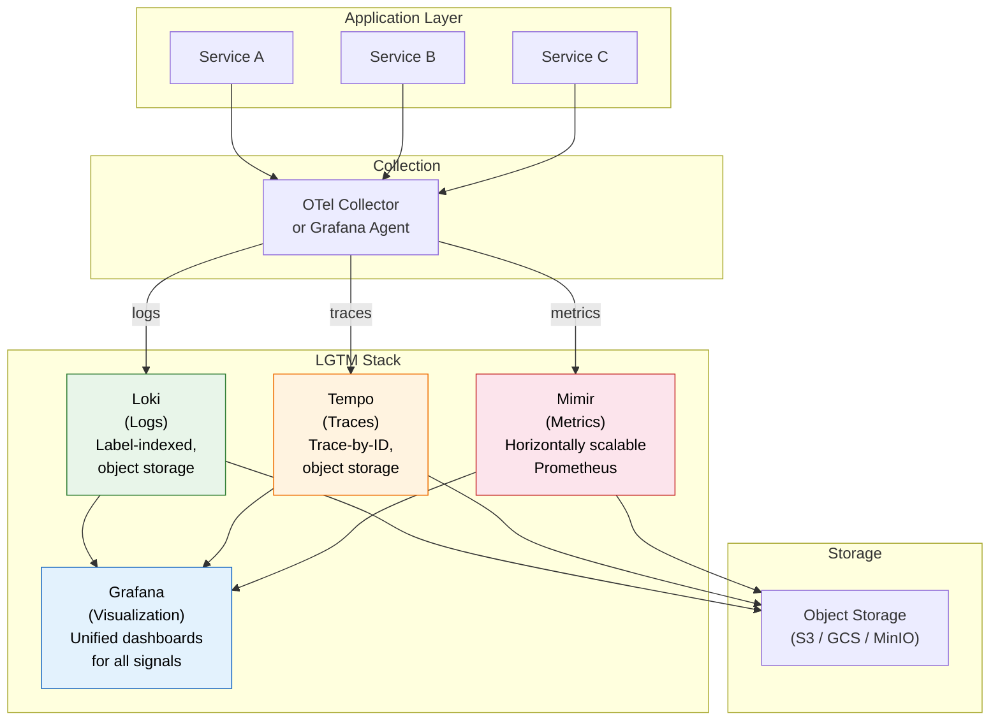
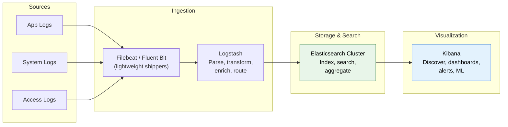
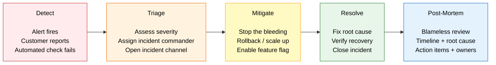
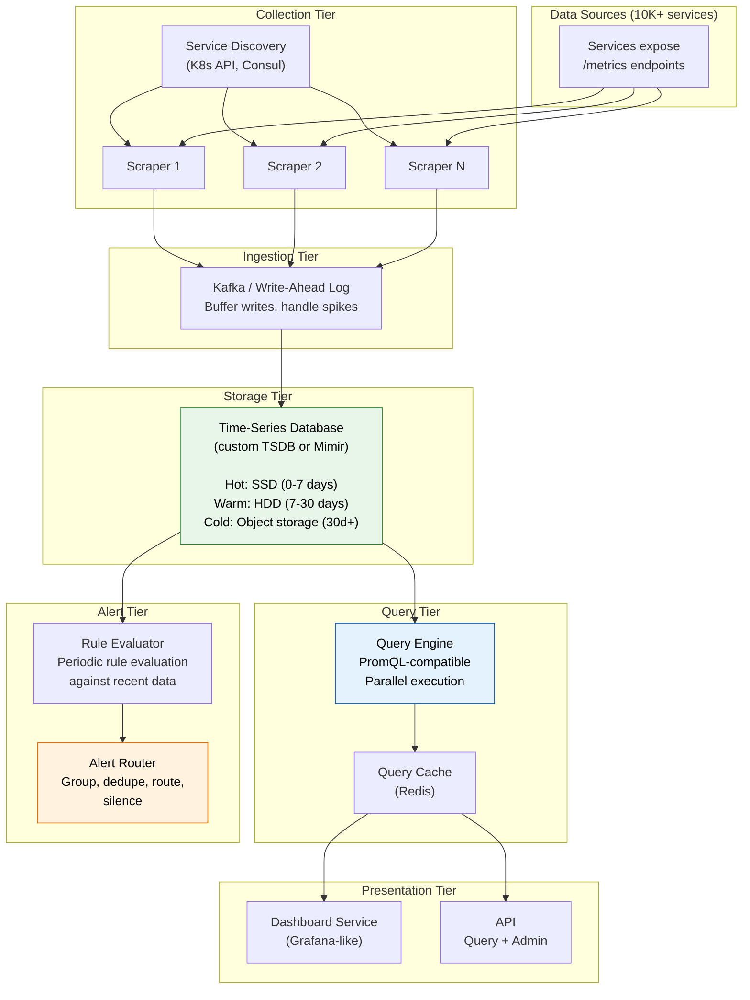

# Monitoring Stacks and Incident Management

## The LGTM Stack: Loki + Grafana + Tempo + Mimir

The Grafana Labs open-source stack provides a unified, cost-effective observability
platform where all signals share a single visualization layer (Grafana) and use
a consistent label-based query model.



### Component Summary

| Component | Signal | Storage Model | Query Language |
|-----------|--------|--------------|----------------|
| **Loki** | Logs | Index labels only, store compressed chunks in object storage | LogQL |
| **Tempo** | Traces | Trace-by-ID lookups, object storage backend | TraceQL |
| **Mimir** | Metrics | Horizontally scalable Prometheus TSDB | PromQL |
| **Grafana** | All | N/A (visualization layer) | Supports all above |

### Why LGTM Over ELK

| Aspect | LGTM Stack | ELK Stack |
|--------|-----------|-----------|
| Storage cost | Low (object storage, label-only indexing) | High (full-text indexing in Elasticsearch) |
| Operational complexity | Moderate (stateless components + object storage) | High (JVM tuning, shard management, cluster) |
| Query flexibility | Label queries fast, content grep slower | Full-text search on any field, very fast |
| Trace support | Native (Tempo) | Requires separate tool (Jaeger, Elastic APM) |
| Kubernetes fit | Excellent (same label model as Prometheus) | Good but heavier |
| Best for | Cost-conscious, cloud-native, Kubernetes | Log analytics, full-text search, compliance |

---

## The ELK Stack: Elasticsearch + Logstash + Kibana

The ELK Stack remains the industry standard for log analytics when you need powerful
full-text search and complex aggregations.



### When to Use ELK

- You need **full-text search** across log content (not just label queries)
- You have **compliance requirements** that need detailed log retention and audit
- You need **complex analytics** and aggregations on log data
- You have a dedicated team to manage the Elasticsearch cluster
- You are already invested in the Elastic ecosystem

### Elasticsearch Index Lifecycle Management

```
Hot   (0-7 days)   → SSD storage, full replicas, fast queries
Warm  (7-30 days)  → HDD storage, reduced replicas, slower queries
Cold  (30-90 days) → Compressed, minimal replicas, rare access
Frozen (90+ days)  → Searchable snapshots, S3-backed, very slow
Delete (365+ days) → Purge per retention policy
```

---

## Prometheus + Grafana + AlertManager

### Prometheus: Pull-Based Metrics Collection

Prometheus scrapes metrics from target endpoints at regular intervals (typically
every 15-30 seconds). Targets expose metrics on an HTTP endpoint (usually `/metrics`).

**Service discovery:** Prometheus automatically discovers targets via Kubernetes API,
Consul, DNS, EC2 API, or static configuration.

```yaml
# prometheus.yml
global:
  scrape_interval: 15s
  evaluation_interval: 15s

rule_files:
  - "alerts/*.yml"

alerting:
  alertmanagers:
    - static_configs:
        - targets: ["alertmanager:9093"]

scrape_configs:
  - job_name: "kubernetes-pods"
    kubernetes_sd_configs:
      - role: pod
    relabel_configs:
      - source_labels: [__meta_kubernetes_pod_annotation_prometheus_io_scrape]
        action: keep
        regex: true
      - source_labels: [__meta_kubernetes_pod_annotation_prometheus_io_path]
        action: replace
        target_label: __metrics_path__
        regex: (.+)

  - job_name: "node-exporter"
    static_configs:
      - targets: ["node-exporter:9100"]
```

### PromQL Examples for Real Dashboards

```promql
# ── RED Method Queries ──

# Request rate by service (last 5 min)
sum by (service) (rate(http_requests_total[5m]))

# Error rate percentage by endpoint
sum by (endpoint) (rate(http_requests_total{status=~"5.."}[5m]))
/ sum by (endpoint) (rate(http_requests_total[5m])) * 100

# p99 latency by service
histogram_quantile(0.99,
  sum by (service, le) (rate(http_request_duration_seconds_bucket[5m]))
)

# ── USE Method Queries ──

# CPU utilization by instance
100 - (avg by (instance) (
  rate(node_cpu_seconds_total{mode="idle"}[5m])
) * 100)

# Memory saturation (swap usage)
node_memory_SwapTotal_bytes - node_memory_SwapFree_bytes

# Disk I/O errors
rate(node_disk_io_errors_total[5m])

# ── Capacity Planning ──

# Predict disk full in 4 hours
predict_linear(node_filesystem_avail_bytes{mountpoint="/"}[6h], 4*3600) < 0

# Rate of change in active connections
deriv(app_active_connections[15m])

# ── SLO Monitoring ──

# Error budget remaining (30-day window, 99.9% SLO)
1 - (
  sum(increase(http_requests_total{status=~"5.."}[30d]))
  / sum(increase(http_requests_total[30d]))
) / 0.001
# Returns fraction of budget remaining (1.0 = full, 0.0 = exhausted)
```

### Alert Rules

```yaml
# alerts/application.yml
groups:
  - name: application-alerts
    rules:
      # High error rate
      - alert: HighErrorRate
        expr: |
          sum by (service) (rate(http_requests_total{status=~"5.."}[5m]))
          / sum by (service) (rate(http_requests_total[5m])) > 0.05
        for: 5m
        labels:
          severity: critical
          team: backend
        annotations:
          summary: "High error rate on {{ $labels.service }}"
          description: "Error rate is {{ $value | humanizePercentage }} (threshold 5%)"
          runbook: "https://runbooks.internal/high-error-rate"

      # High latency
      - alert: HighLatencyP99
        expr: |
          histogram_quantile(0.99,
            sum by (service, le) (rate(http_request_duration_seconds_bucket[5m]))
          ) > 2.0
        for: 10m
        labels:
          severity: warning
          team: backend
        annotations:
          summary: "High p99 latency on {{ $labels.service }}"
          description: "p99 latency is {{ $value }}s (threshold 2s)"

      # Pod restart loop
      - alert: PodCrashLooping
        expr: |
          increase(kube_pod_container_status_restarts_total[1h]) > 5
        for: 5m
        labels:
          severity: critical
          team: platform
        annotations:
          summary: "Pod {{ $labels.pod }} is crash-looping"
          description: "{{ $value }} restarts in the last hour"

  - name: infrastructure-alerts
    rules:
      # Disk space prediction
      - alert: DiskWillFillIn4Hours
        expr: |
          predict_linear(node_filesystem_avail_bytes{mountpoint="/"}[6h], 4*3600) < 0
        for: 30m
        labels:
          severity: warning
          team: platform
        annotations:
          summary: "Disk on {{ $labels.instance }} will fill in < 4 hours"

      # High memory usage
      - alert: HighMemoryUsage
        expr: |
          (node_memory_MemTotal_bytes - node_memory_MemAvailable_bytes)
          / node_memory_MemTotal_bytes > 0.90
        for: 15m
        labels:
          severity: warning
          team: platform
        annotations:
          summary: "Memory usage above 90% on {{ $labels.instance }}"
```

### AlertManager: Routing, Grouping, and Silencing

AlertManager handles what happens after Prometheus fires an alert.

```yaml
# alertmanager.yml
global:
  resolve_timeout: 5m
  slack_api_url: "https://hooks.slack.com/services/T00/B00/XXXX"
  pagerduty_url: "https://events.pagerduty.com/v2/enqueue"

# Inhibition: suppress lower-severity alerts when higher fires
inhibit_rules:
  - source_matchers:
      - severity = critical
    target_matchers:
      - severity = warning
    equal: [service]

# Routing tree
route:
  receiver: default-slack
  group_by: [alertname, service]
  group_wait: 30s
  group_interval: 5m
  repeat_interval: 4h

  routes:
    # Critical: page on-call
    - matchers:
        - severity = critical
      receiver: pagerduty-oncall
      group_wait: 10s
      repeat_interval: 1h

    # Warning during business hours: Slack channel
    - matchers:
        - severity = warning
      receiver: team-slack
      active_time_intervals:
        - business-hours

    # Warning outside business hours: email only
    - matchers:
        - severity = warning
      receiver: team-email

receivers:
  - name: default-slack
    slack_configs:
      - channel: "#alerts-default"
        title: "{{ .GroupLabels.alertname }}"
        text: "{{ range .Alerts }}{{ .Annotations.summary }}\n{{ end }}"

  - name: pagerduty-oncall
    pagerduty_configs:
      - routing_key: "YOUR_PAGERDUTY_ROUTING_KEY"
        severity: critical
        description: "{{ .GroupLabels.alertname }}: {{ .CommonAnnotations.summary }}"

  - name: team-slack
    slack_configs:
      - channel: "#alerts-backend"
        send_resolved: true

  - name: team-email
    email_configs:
      - to: "backend-oncall@company.com"

time_intervals:
  - name: business-hours
    time_intervals:
      - weekdays: ["monday:friday"]
        times:
          - start_time: "09:00"
            end_time: "18:00"
```

**Key AlertManager concepts:**

| Concept | What It Does |
|---------|-------------|
| **Grouping** | Combine related alerts into one notification (e.g., all pods in one service) |
| **Inhibition** | Suppress low-severity alerts when high-severity fires for the same service |
| **Silencing** | Temporarily mute alerts (during maintenance windows) |
| **Routing** | Direct alerts to different receivers based on labels |
| **Repeat interval** | How often to re-notify for an unresolved alert |

---

## Incident Management

### Severity Levels

| Severity | Name | Definition | Response Time | Example |
|----------|------|-----------|---------------|---------|
| **SEV1** | Critical | Total service outage or data loss | 15 min | Payment processing down for all users |
| **SEV2** | Major | Significant degradation, partial outage | 30 min | 50% of API requests failing, one region down |
| **SEV3** | Minor | Limited impact, workaround available | 4 hours | Dashboard loading slowly, non-critical feature broken |
| **SEV4** | Low | Minimal impact, cosmetic or minor | Next business day | Typo in error message, minor UI glitch |

### On-Call Rotation

**Tools:** PagerDuty, OpsGenie, Grafana OnCall

**Healthy on-call practices:**
- **Primary + secondary rotation:** Secondary escalation if primary doesn't ack in 10 min
- **Follow the sun:** Rotate across time zones so no one gets paged at 3am
- **On-call handoff:** 30-minute overlap with briefing on active issues
- **Compensation:** On-call pay, time off after heavy rotations
- **Toil tracking:** Measure pages per week; investigate if > 2 pages/shift

### Incident Response Lifecycle



### Incident Response: Detailed Breakdown

**1. Detect (time to detect = TTD)**
- Automated: alert fires from monitoring
- Manual: customer reports issue via support
- Goal: Minimize TTD with proactive monitoring and SLO-based alerting

**2. Triage (time to triage)**
- On-call acknowledges the page
- Assess severity: SEV1-SEV4
- Create incident channel (Slack: `#inc-20240315-payment-outage`)
- Assign roles: Incident Commander (IC), Communications Lead, Subject Matter Experts
- For SEV1/SEV2: Declare a formal incident immediately

**3. Mitigate (time to mitigate = TTM)**
- Priority is stopping user impact, not finding root cause
- Common mitigations:
  - Rollback the last deploy
  - Scale up infrastructure
  - Toggle feature flag off
  - Failover to a secondary region
  - Block bad traffic (rate limit, WAF rule)
- Document every action and timestamp in the incident channel

**4. Resolve (time to resolve = TTR)**
- Deploy the actual fix
- Verify with metrics and logs that the issue is resolved
- Monitor for regression
- Close the incident

**5. Post-Mortem**
- Required for all SEV1 and SEV2 incidents
- Conducted within 48 hours while memory is fresh

### Blameless Post-Mortems

The post-mortem is the most important part of incident management. It transforms
incidents from losses into organizational learning.

**Template:**

```
## Incident Post-Mortem: [Title]
Date: 2024-03-15
Severity: SEV1
Duration: 47 minutes
Impact: 100% of payment processing failed for all users

## Summary
A connection pool leak in the Stripe SDK (v2.3.1) caused all payment service
instances to exhaust their connection pool within 30 minutes of the v1.4.2
deployment.

## Timeline (all times UTC)
- 14:00 - Deploy v1.4.2 to production (includes Stripe SDK upgrade)
- 14:12 - First connection pool exhaustion warning
- 14:23 - Payment error rate hits 5%, SEV2 alert fires
- 14:25 - On-call acknowledges, begins investigation
- 14:30 - Error rate hits 95%, escalated to SEV1
- 14:32 - Incident Commander declared, war room opened
- 14:35 - Decision to rollback to v1.4.1
- 14:38 - Rollback deployed
- 14:42 - Connection pools recovering
- 14:47 - Error rate back to baseline, incident resolved

## Root Cause
The Stripe SDK v2.3.1 introduced a change that created a new HTTP connection
for each retry attempt without releasing the previous one. Under normal load,
connections accumulated until the pool was exhausted.

## Contributing Factors
1. The Stripe SDK upgrade was bundled with unrelated feature changes
2. Load testing did not cover retry scenarios
3. Connection pool metrics were not monitored

## Action Items
| Action | Owner | Priority | Due Date |
|--------|-------|----------|----------|
| Pin Stripe SDK to v2.3.0, file bug upstream | @alice | P0 | 2024-03-16 |
| Add connection pool utilization to dashboards | @bob | P1 | 2024-03-22 |
| Add alert for connection pool > 80% | @bob | P1 | 2024-03-22 |
| Separate dependency upgrades from feature deploys | @carol | P2 | 2024-03-29 |
| Add retry scenario to load test suite | @dave | P2 | 2024-04-05 |

## Lessons Learned
- Dependency upgrades should be deployed in isolation
- Connection pool metrics are as important as request metrics
- The rollback procedure worked well (< 5 min from decision to recovery)
```

**Blameless principles:**
- Focus on **systems and processes**, not individuals
- Ask "what failed in the system that allowed this?" not "who made this mistake?"
- People who make errors are the best source of information about what needs fixing
- Punishment discourages transparency; learning requires psychological safety

### Runbook Automation

Runbooks document the steps to respond to common alerts. Automated runbooks execute
those steps without human intervention.

```
Alert: HighMemoryUsage (> 90%)
  Manual runbook:
    1. Check which process is consuming memory
    2. If it is the application, check for memory leaks
    3. If it is a cache, clear the cache
    4. If immediate relief needed, restart the pod

  Automated runbook:
    1. Trigger: alert fires
    2. Collect diagnostics (heap dump, top processes, recent deploys)
    3. If cache > 80% of memory: auto-clear cache
    4. If pod restart count < 3 in last hour: auto-restart pod
    5. Post diagnostics to incident channel
    6. If auto-remediation fails: escalate to on-call
```

---

## Design Interview: "Design a Monitoring System"

### Requirements Gathering

**Functional:**
- Collect metrics from 10,000+ services
- Support counters, gauges, histograms
- Query metrics with flexible aggregations
- Alert on threshold violations
- Dashboard visualization

**Non-functional:**
- Ingest 10M data points/second
- Query latency < 1 second for dashboard queries
- 30-day retention at full resolution, 1-year at downsampled resolution
- 99.9% availability of the monitoring system itself

### High-Level Architecture



### Key Design Decisions

**Pull vs Push model:**
- Pull (Prometheus-style): Scraper controls the pace, easy to detect down targets
- Push (StatsD-style): Works behind firewalls, better for short-lived jobs
- Recommendation: Pull as primary, push gateway for short-lived jobs

**Time-series storage:**
- Use a custom TSDB optimized for time-series write patterns
- Compression: Gorilla encoding for timestamps, XOR for values (10x compression)
- Partitioning: By time (recent data on fast storage) and by metric name (shard writes)

**Downsampling for long-term retention:**
- Raw data: 15-second resolution for 30 days
- 5-minute averages: keep for 1 year
- 1-hour averages: keep for 5 years
- This reduces storage by 100-1000x for historical data

---

## Interview Questions and Answers

**Q: How would you design a monitoring system that handles 10M metrics per second?**

A: Use a horizontally scalable architecture. Collection: distribute scraping across
N scraper instances using consistent hashing to assign targets. Ingestion: buffer
through Kafka to handle write spikes and decouple collection from storage. Storage:
use a time-series database with time-based partitioning, Gorilla compression, and
tiered storage (SSD for hot, object storage for cold). Query: parallel query
execution with a query cache. Alerts: separate rule evaluation tier that reads from
the TSDB and routes through an alert manager with grouping and deduplication.

**Q: Your team gets paged 10 times per on-call shift. How do you reduce alert fatigue?**

A: First, audit every alert. Classify: is it actionable? Does it page for something
the on-call can fix? Remove alerts that are informational (move to dashboards) or
that auto-resolve (increase the `for` duration). Second, switch from threshold
alerting to SLO-based burn-rate alerting --- this eliminates alerts for brief spikes
that self-heal. Third, add inhibition rules so that a high-severity alert suppresses
related low-severity alerts. Fourth, tune `group_by` to consolidate related alerts
into one notification. Target: fewer than 2 pages per on-call shift.

**Q: Explain the difference between the ELK stack and the LGTM stack. When would you use each?**

A: ELK (Elasticsearch + Logstash + Kibana) indexes the full content of every log
line, giving powerful full-text search and complex aggregations. It is best when you
need to search inside log messages or run analytics on log data. LGTM (Loki +
Grafana + Tempo + Mimir) indexes only labels and stores compressed log chunks in
object storage, making it 10-50x cheaper to operate. It is best for cost-conscious
environments, especially Kubernetes-native stacks that already use Prometheus and
Grafana. Choose ELK for log analytics; choose LGTM for cost-effective
observability.

**Q: Walk me through how you would conduct a blameless post-mortem.**

A: Schedule within 48 hours of the incident. Include everyone who participated in the
response. The facilitator guides the group through a timeline reconstruction ---
what happened, when, and what actions were taken. Focus on systemic causes: what
allowed the failure to happen, what made detection slow, what made mitigation hard.
Explicitly avoid blaming individuals --- ask "what in our process failed?" not "who
caused this?" Generate concrete action items with owners and due dates. Publish the
post-mortem widely so the entire organization learns. Track action items to
completion in subsequent weeks.

**Q: How do you monitor the monitoring system itself?**

A: This is the meta-monitoring problem. Use a separate, minimal monitoring system to
watch the primary one. Prometheus can monitor itself (scrape its own metrics), but
for critical failure detection, run a lightweight secondary instance (or a simple
health-check service) on different infrastructure. Alert through a separate channel
(e.g., direct PagerDuty integration, not through AlertManager). Additionally, use
synthetic checks --- if the monitoring system does not produce a heartbeat metric
every 60 seconds, the secondary system pages.
