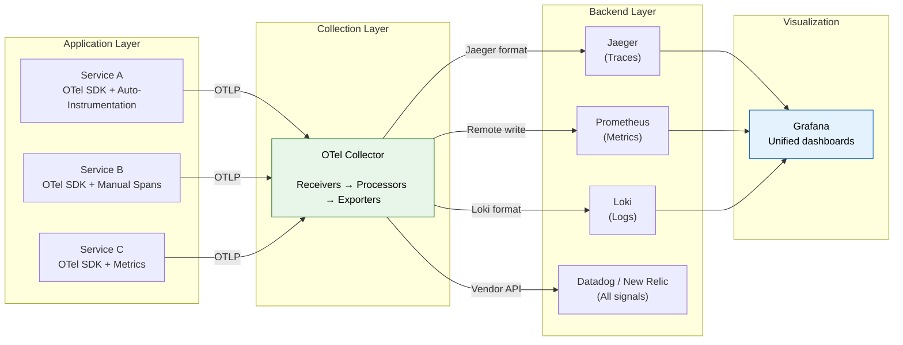
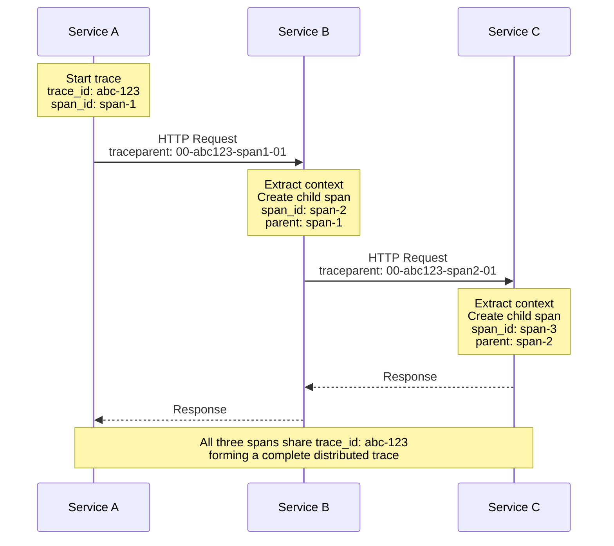
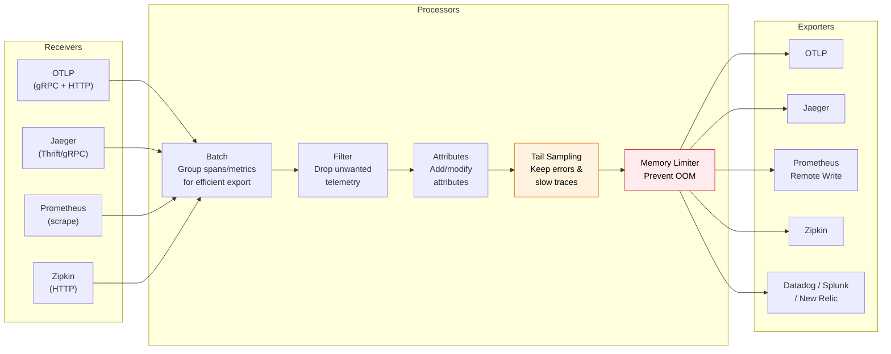
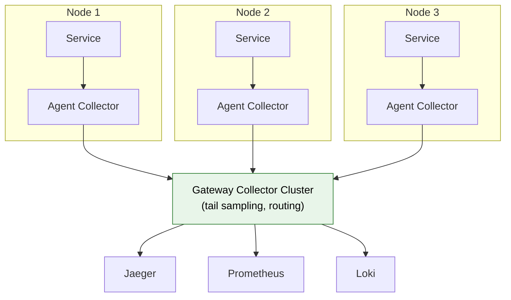
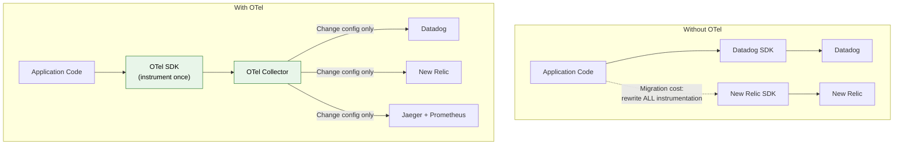

# OpenTelemetry (OTel): The Unified Observability Framework

## What Is OpenTelemetry?

OpenTelemetry is a **vendor-neutral, open-source observability framework** for
generating, collecting, and exporting telemetry data (traces, metrics, and logs).
It is a CNCF (Cloud Native Computing Foundation) incubating project formed by
merging OpenTracing and OpenCensus.

**The core promise:** Instrument your application once, send telemetry data to any
backend --- Jaeger, Prometheus, Datadog, New Relic, Grafana Cloud, or any other
vendor --- without changing your instrumentation code.

### Why OTel Exists

Before OpenTelemetry, the observability landscape was fragmented:

```
Before OTel:
  App → Jaeger SDK → Jaeger (traces only)
  App → Prometheus client → Prometheus (metrics only)
  App → Datadog agent → Datadog (proprietary)
  App → Zipkin SDK → Zipkin (traces only)
  
  Result: Multiple SDKs, multiple formats, vendor lock-in

After OTel:
  App → OpenTelemetry SDK → OTel Collector → ANY backend
  
  Result: Single instrumentation, any backend, all signals
```

---

## Architecture Overview



### The Three-Layer Model

| Layer | Component | Role |
|-------|-----------|------|
| **Instrumentation** | OTel SDK (per language) | Generate telemetry in your application |
| **Collection** | OTel Collector | Receive, process, and export telemetry |
| **Backend** | Jaeger, Prometheus, etc. | Store, query, and visualize telemetry |

---

## The Three Signals

OpenTelemetry unifies all three observability signals under one API and SDK.

### 1. Traces

A trace represents the end-to-end journey of a request. Each trace contains spans.

**Span attributes:**
```
Span:
  trace_id:      "4bf92f3577b34da6a3ce929d0e0e4736"
  span_id:       "00f067aa0ba902b7"
  parent_span_id: "d5aef6e203cf186a"
  name:          "payment.process"
  kind:          SERVER
  start_time:    2024-03-15T14:23:45.123Z
  end_time:      2024-03-15T14:23:45.373Z
  status:        OK
  attributes:
    http.method:      "POST"
    http.url:         "/api/v1/payments"
    http.status_code: 200
    payment.amount:   99.99
    payment.currency: "USD"
  events:
    - name: "payment.authorized"
      timestamp: 2024-03-15T14:23:45.200Z
      attributes:
        auth_code: "A12345"
```

### 2. Metrics

OTel metrics align with Prometheus-style metric types but add richer semantics.

| OTel Metric Instrument | Prometheus Equivalent | Use Case |
|------------------------|----------------------|----------|
| Counter | Counter | Total requests, total bytes sent |
| UpDownCounter | Gauge (counter-like) | Active connections, queue size |
| Histogram | Histogram | Latency distribution |
| Gauge | Gauge | CPU temperature, memory usage |

### 3. Logs

OTel Logs bridge existing logging libraries (log4j, slog, Python logging) into the
OTel ecosystem by attaching trace context to every log record.

```json
{
  "timestamp": "2024-03-15T14:23:45.123Z",
  "severity": "ERROR",
  "body": "Payment processing failed: insufficient funds",
  "resource": {
    "service.name": "payment-service",
    "service.version": "1.4.2",
    "deployment.environment": "production"
  },
  "attributes": {
    "user.id": "12345",
    "order.id": "67890"
  },
  "trace_id": "4bf92f3577b34da6a3ce929d0e0e4736",
  "span_id": "00f067aa0ba902b7"
}
```

The `trace_id` and `span_id` fields automatically correlate this log entry with the
exact trace and span --- enabling seamless navigation from logs to traces and back.

---

## Instrumentation

### Auto-Instrumentation

Auto-instrumentation attaches an agent to your application (at runtime or build
time) that automatically generates spans for common libraries --- HTTP clients, web
frameworks, database drivers, message brokers.

**Zero code changes.** Attach the agent, and you get traces for:
- Incoming HTTP requests (Flask, Django, Spring Boot, Express)
- Outgoing HTTP calls (requests, HttpClient, RestTemplate)
- Database queries (psycopg2, JDBC, Mongoose)
- Message broker operations (Kafka, RabbitMQ, Redis)

**Python auto-instrumentation:**

```bash
# Install
pip install opentelemetry-distro opentelemetry-exporter-otlp
opentelemetry-bootstrap -a install

# Run your app with auto-instrumentation
opentelemetry-instrument \
  --service_name payment-service \
  --traces_exporter otlp \
  --metrics_exporter otlp \
  --exporter_otlp_endpoint http://otel-collector:4317 \
  python app.py
```

**Java auto-instrumentation:**

```bash
# Download the Java agent
curl -LO https://github.com/open-telemetry/opentelemetry-java-instrumentation/releases/latest/download/opentelemetry-javaagent.jar

# Run your app with auto-instrumentation
java -javaagent:opentelemetry-javaagent.jar \
  -Dotel.service.name=order-service \
  -Dotel.traces.exporter=otlp \
  -Dotel.metrics.exporter=otlp \
  -Dotel.exporter.otlp.endpoint=http://otel-collector:4317 \
  -jar app.jar
```

### Manual Instrumentation

When auto-instrumentation is not enough --- you need custom spans for business logic,
specific attributes, or events --- use the OTel SDK directly.

**Python manual instrumentation:**

```python
from opentelemetry import trace
from opentelemetry.sdk.trace import TracerProvider
from opentelemetry.sdk.trace.export import BatchSpanProcessor
from opentelemetry.exporter.otlp.proto.grpc.trace_exporter import OTLPSpanExporter
from opentelemetry.sdk.resources import Resource

# Setup (typically in app initialization)
resource = Resource.create({
    "service.name": "payment-service",
    "service.version": "1.4.2",
    "deployment.environment": "production",
})

provider = TracerProvider(resource=resource)
processor = BatchSpanProcessor(OTLPSpanExporter(endpoint="http://otel-collector:4317"))
provider.add_span_processor(processor)
trace.set_tracer_provider(provider)

tracer = trace.get_tracer("payment-service", "1.4.2")


# Usage in business logic
def process_payment(order_id: str, amount: float, currency: str):
    with tracer.start_as_current_span("payment.process") as span:
        # Add attributes to the span
        span.set_attribute("order.id", order_id)
        span.set_attribute("payment.amount", amount)
        span.set_attribute("payment.currency", currency)

        try:
            # Validate payment
            with tracer.start_as_current_span("payment.validate") as validate_span:
                validate_span.set_attribute("validation.type", "card")
                validate_payment(order_id)

            # Charge the card
            with tracer.start_as_current_span("payment.charge") as charge_span:
                result = charge_card(amount, currency)
                charge_span.set_attribute("payment.auth_code", result.auth_code)
                # Add an event (like a log within the span)
                span.add_event("payment.authorized", {
                    "auth_code": result.auth_code,
                })

            return result

        except InsufficientFundsError as e:
            span.set_status(trace.StatusCode.ERROR, "Insufficient funds")
            span.record_exception(e)
            raise
```

**Java manual instrumentation:**

```java
import io.opentelemetry.api.OpenTelemetry;
import io.opentelemetry.api.trace.Span;
import io.opentelemetry.api.trace.Tracer;
import io.opentelemetry.api.trace.StatusCode;
import io.opentelemetry.context.Scope;

public class PaymentService {
    private final Tracer tracer;

    public PaymentService(OpenTelemetry openTelemetry) {
        this.tracer = openTelemetry.getTracer("payment-service", "1.4.2");
    }

    public PaymentResult processPayment(String orderId, double amount, String currency) {
        Span span = tracer.spanBuilder("payment.process")
            .setAttribute("order.id", orderId)
            .setAttribute("payment.amount", amount)
            .setAttribute("payment.currency", currency)
            .startSpan();

        try (Scope scope = span.makeCurrent()) {
            // Child span for validation
            Span validateSpan = tracer.spanBuilder("payment.validate").startSpan();
            try (Scope valScope = validateSpan.makeCurrent()) {
                validatePayment(orderId);
            } finally {
                validateSpan.end();
            }

            // Child span for charging
            Span chargeSpan = tracer.spanBuilder("payment.charge").startSpan();
            try (Scope chargeScope = chargeSpan.makeCurrent()) {
                PaymentResult result = chargeCard(amount, currency);
                chargeSpan.setAttribute("payment.auth_code", result.getAuthCode());
                span.addEvent("payment.authorized",
                    Attributes.of(stringKey("auth_code"), result.getAuthCode()));
                return result;
            } finally {
                chargeSpan.end();
            }

        } catch (InsufficientFundsException e) {
            span.setStatus(StatusCode.ERROR, "Insufficient funds");
            span.recordException(e);
            throw e;
        } finally {
            span.end();
        }
    }
}
```

### Auto vs Manual: When to Use Each

| Aspect | Auto-Instrumentation | Manual Instrumentation |
|--------|---------------------|----------------------|
| Setup effort | Minimal (attach agent) | Requires code changes |
| Coverage | HTTP, DB, messaging libs | Business logic, custom operations |
| Attributes | Standard semantic conventions | Custom business attributes |
| Maintenance | Agent updates only | Code maintenance required |
| Recommendation | Start here | Add where auto is insufficient |

**Best practice:** Start with auto-instrumentation for baseline coverage, then add
manual spans only for business-critical operations that need custom attributes.

---

## Context Propagation

Context propagation is the mechanism that links spans across service boundaries.
When Service A calls Service B, the trace context must be carried in the request
headers so Service B can continue the same trace.

### Propagation Formats

**W3C Trace Context (recommended standard):**

```http
GET /api/orders HTTP/1.1
Host: order-service:8080
traceparent: 00-4bf92f3577b34da6a3ce929d0e0e4736-00f067aa0ba902b7-01
tracestate: congo=t61rcWkgMzE
```

Format: `version-trace_id-parent_span_id-trace_flags`
- `00` = version
- `4bf92f...` = 128-bit trace ID
- `00f067...` = 64-bit parent span ID
- `01` = trace flags (01 = sampled)

**B3 Propagation (Zipkin-originated, still widely used):**

```http
# Single-header format
b3: 4bf92f3577b34da6a3ce929d0e0e4736-00f067aa0ba902b7-1

# Multi-header format
X-B3-TraceId: 4bf92f3577b34da6a3ce929d0e0e4736
X-B3-SpanId: 00f067aa0ba902b7
X-B3-ParentSpanId: d5aef6e203cf186a
X-B3-Sampled: 1
```

**OTel SDK propagation setup (Python):**

```python
from opentelemetry.propagators.composite import CompositePropagator
from opentelemetry.propagators.b3 import B3MultiFormat
from opentelemetry.propagate import set_global_textmap
from opentelemetry.propagators.textmap import TraceContextTextMapPropagator

# Support both W3C and B3 for backward compatibility
set_global_textmap(CompositePropagator([
    TraceContextTextMapPropagator(),
    B3MultiFormat(),
]))
```

### Propagation Flow



---

## The OTel Collector

The Collector is the most operationally critical component. It decouples telemetry
generation from telemetry backends.



### Collector Configuration

```yaml
# otel-collector-config.yaml
receivers:
  otlp:
    protocols:
      grpc:
        endpoint: 0.0.0.0:4317
      http:
        endpoint: 0.0.0.0:4318

  prometheus:
    config:
      scrape_configs:
        - job_name: 'kubernetes-pods'
          kubernetes_sd_configs:
            - role: pod

  jaeger:
    protocols:
      thrift_http:
        endpoint: 0.0.0.0:14268

processors:
  batch:
    timeout: 5s
    send_batch_size: 1000
    send_batch_max_size: 2000

  memory_limiter:
    check_interval: 1s
    limit_mib: 2048
    spike_limit_mib: 512

  filter/drop-health-checks:
    traces:
      span:
        - 'attributes["http.target"] == "/healthz"'
        - 'attributes["http.target"] == "/readyz"'

  attributes/add-environment:
    actions:
      - key: deployment.environment
        value: production
        action: upsert

  tail_sampling:
    decision_wait: 10s
    policies:
      - name: errors-policy
        type: status_code
        status_code:
          status_codes: [ERROR]
      - name: slow-traces-policy
        type: latency
        latency:
          threshold_ms: 2000
      - name: probabilistic-policy
        type: probabilistic
        probabilistic:
          sampling_percentage: 5

exporters:
  otlp/jaeger:
    endpoint: jaeger:4317
    tls:
      insecure: true

  prometheusremotewrite:
    endpoint: http://mimir:9009/api/v1/push

  loki:
    endpoint: http://loki:3100/loki/api/v1/push

service:
  pipelines:
    traces:
      receivers: [otlp, jaeger]
      processors: [memory_limiter, filter/drop-health-checks, attributes/add-environment, tail_sampling, batch]
      exporters: [otlp/jaeger]
    metrics:
      receivers: [otlp, prometheus]
      processors: [memory_limiter, batch]
      exporters: [prometheusremotewrite]
    logs:
      receivers: [otlp]
      processors: [memory_limiter, batch]
      exporters: [loki]
```

### Collector Deployment Patterns

**Agent mode (sidecar / daemonset):**
- One collector per node or per pod
- Receives telemetry from local services
- Forwards to a central collector or directly to backends
- Low latency, handles local buffering

**Gateway mode (central collector):**
- Centralized collector cluster
- Receives from all agents/services
- Handles tail sampling (needs all spans of a trace)
- Manages routing to multiple backends



---

## Baggage

Baggage lets you propagate arbitrary key-value pairs across service boundaries
alongside trace context. Unlike span attributes (local to one span), baggage is
carried through the entire request chain.

**Use cases:**
- Propagate user ID, tenant ID, or region across all services
- Carry A/B test variant information
- Propagate feature flags

```python
from opentelemetry import baggage, context
from opentelemetry.baggage.propagation import W3CBaggagePropagator

# Service A: Set baggage
ctx = baggage.set_baggage("user.tier", "premium")
ctx = baggage.set_baggage("tenant.id", "acme-corp", context=ctx)

# Service B (downstream): Read baggage
user_tier = baggage.get_baggage("user.tier")   # "premium"
tenant_id = baggage.get_baggage("tenant.id")   # "acme-corp"
```

**Caution:** Baggage is sent in headers on every request, so keep values small
and avoid sensitive data (it is visible to all intermediaries).

---

## Semantic Conventions

OpenTelemetry defines standardized attribute names so that telemetry from different
languages and frameworks is consistent and queryable.

```
# HTTP attributes
http.request.method    = "POST"
http.response.status_code = 200
url.full               = "https://api.example.com/orders"
server.address         = "api.example.com"
server.port            = 443

# Database attributes
db.system              = "postgresql"
db.statement           = "SELECT * FROM orders WHERE id = $1"
db.operation           = "SELECT"
db.name                = "orders_db"

# Messaging attributes
messaging.system       = "kafka"
messaging.destination.name = "order-events"
messaging.operation    = "publish"

# Resource attributes
service.name           = "payment-service"
service.version        = "1.4.2"
deployment.environment = "production"
host.name              = "payment-pod-abc123"
k8s.pod.name           = "payment-7d9f8b6c4d-abc12"
k8s.namespace.name     = "production"
```

Using semantic conventions means your Grafana dashboards, alert rules, and trace
queries work the same regardless of which language or framework generated the data.

---

## Why OTel Matters: Avoiding Vendor Lock-In



**Switching backends with OTel:** Change a few lines in the Collector config YAML.
No application code changes. No redeployment of services.

**Without OTel:** Rip out the vendor SDK from every service, replace with the new
vendor's SDK, update all instrumentation code, redeploy everything.

---

## Production Best Practices

1. **Start with auto-instrumentation** for every service. Get baseline traces
   with zero code changes.

2. **Add manual spans** only for business-critical paths where you need custom
   attributes (payment amount, user tier, order value).

3. **Use the Collector** --- never export directly from SDK to backend. The Collector
   gives you batching, retry, tail sampling, and routing without code changes.

4. **Set resource attributes** consistently: `service.name`, `service.version`,
   `deployment.environment` on every service. These are your primary query dimensions.

5. **Implement tail sampling** in the Collector to keep 100% of errors and slow
   traces while sampling normal traffic at 1-5%.

6. **Use semantic conventions** for all attributes. This ensures your dashboards
   and alerts work across languages and frameworks.

7. **Monitor the Collector itself** --- it is a critical piece of infrastructure.
   Track dropped spans, queue depth, and export errors.

---

## Interview Questions and Answers

**Q: What is OpenTelemetry and why would you use it over a vendor-specific APM?**

A: OpenTelemetry is a vendor-neutral observability framework that provides a single
set of APIs, SDKs, and a Collector for generating and exporting traces, metrics, and
logs. You use it to avoid vendor lock-in --- instrument once, send data anywhere. If
you decide to switch from Datadog to Grafana Cloud, you change Collector config, not
application code. It is also the CNCF standard, so it has the broadest ecosystem
support.

**Q: Explain the difference between auto-instrumentation and manual instrumentation.**

A: Auto-instrumentation attaches an agent (Java agent, Python wrapper) that
automatically intercepts calls to known libraries (HTTP, DB, messaging) and generates
spans with standard attributes. Zero code changes required. Manual instrumentation
means writing code to create spans, set attributes, and record events for
business-specific operations. You typically use both: auto for baseline coverage,
manual for business context.

**Q: How does context propagation work in OpenTelemetry?**

A: When Service A calls Service B, the OTel SDK injects trace context (trace ID,
span ID, sampling flag) into the outgoing request headers using a standard format
like W3C Trace Context (`traceparent` header). When Service B receives the request,
the SDK extracts this context and creates a child span linked to the parent. This
chain continues through every service, creating a complete distributed trace.

**Q: How would you deploy the OTel Collector in a Kubernetes environment?**

A: Use a two-tier architecture. Deploy the Collector as a DaemonSet (agent mode) on
every node to receive telemetry from local pods with low latency. These agents
forward to a centralized Collector Deployment (gateway mode) that handles tail
sampling, attribute enrichment, and routing to multiple backends. This pattern
isolates the processing load and enables tail sampling (which requires seeing all
spans of a trace in one place).
