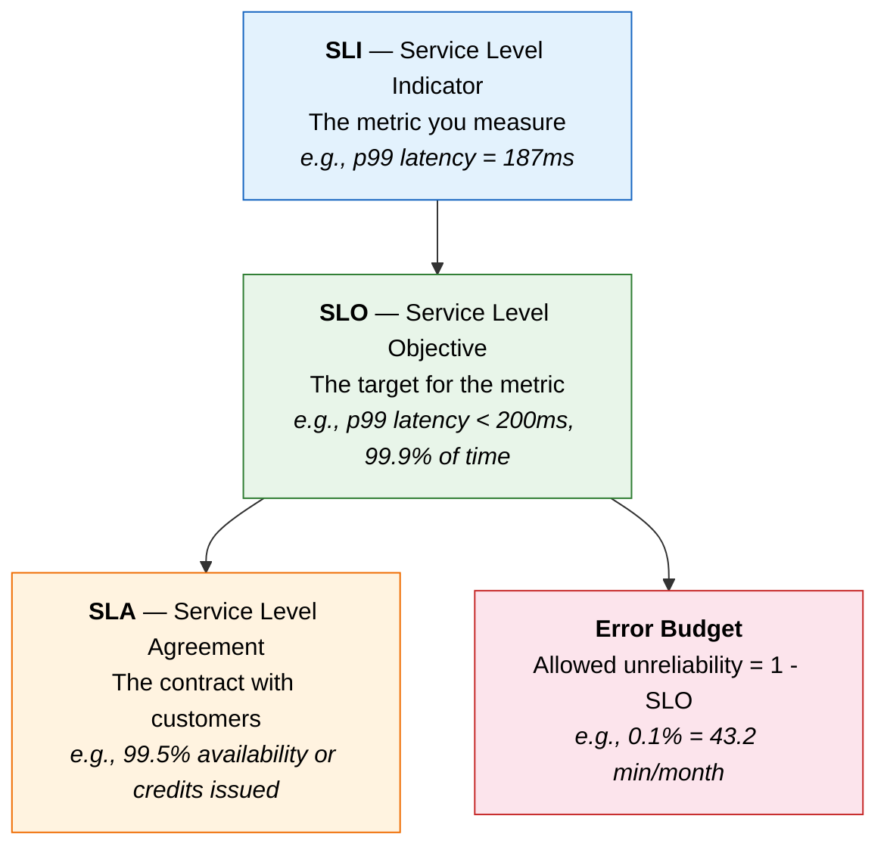
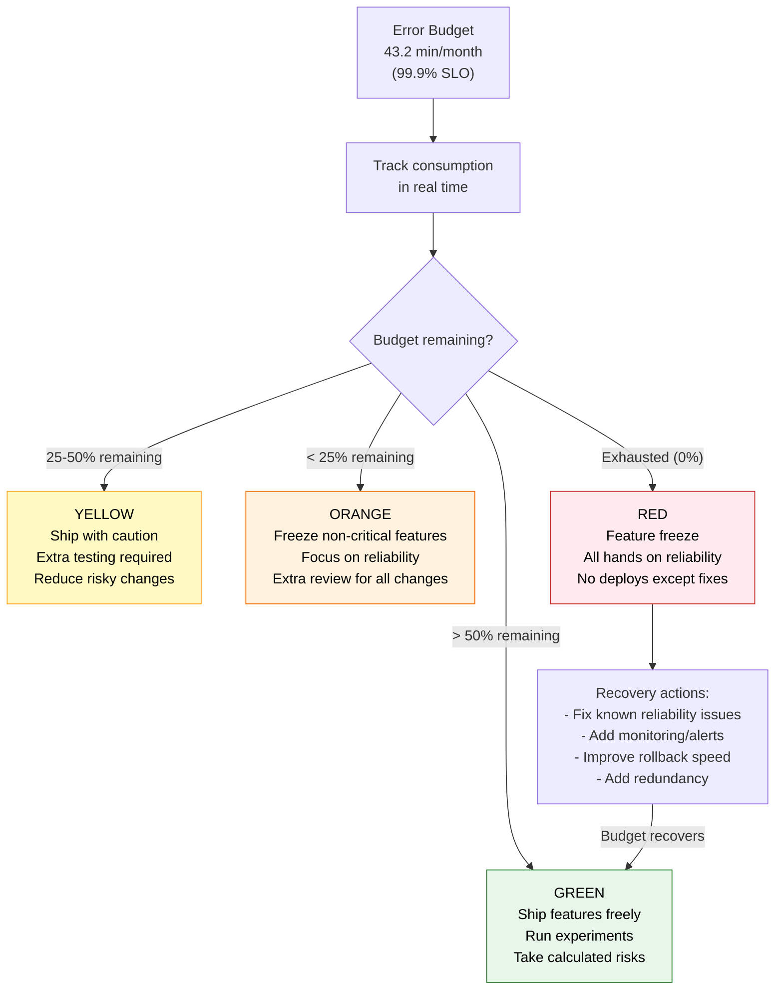
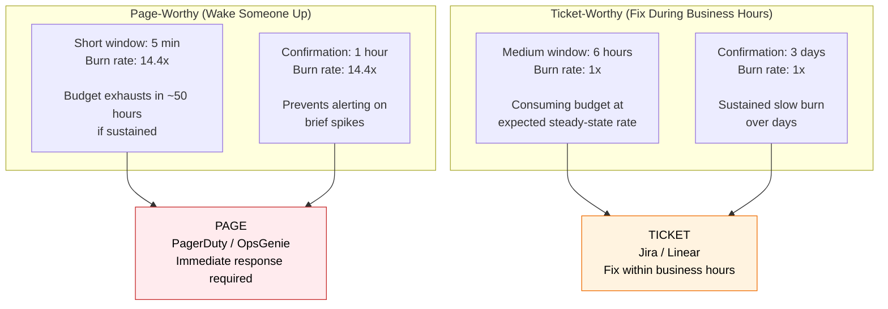

# SLIs, SLOs, SLAs, and Error Budgets

## The Hierarchy



**Critical relationship:** SLA < SLO always. Your internal target (SLO) must be
stricter than your external promise (SLA). If your SLA guarantees 99.5% availability
to customers, your internal SLO should be 99.9% --- giving you a safety margin
before you breach the contract.

---

## SLI: Service Level Indicator

An SLI is a **carefully chosen metric** that quantifies some aspect of the service
level delivered to users. It is the raw measurement.

### Common SLIs

| SLI Category | What It Measures | Example Metric |
|-------------|-----------------|----------------|
| **Availability** | Is the service responding? | `successful_requests / total_requests` |
| **Latency** | How fast is the response? | p50, p90, p99 of request duration |
| **Throughput** | How much work is done? | Requests per second processed successfully |
| **Error rate** | How often does it fail? | `error_requests / total_requests` |
| **Correctness** | Is the response right? | `correct_responses / total_responses` |
| **Freshness** | How stale is the data? | Time since last successful data pipeline run |
| **Durability** | Is the data safe? | Proportion of data retrievable after write |

### Choosing Good SLIs

A good SLI is:

1. **User-facing:** Measures what users actually experience, not internal plumbing.
   - Good: "Request latency as seen by the user"
   - Bad: "CPU utilization of the application server"

2. **Meaningful:** Directly reflects the quality of the user experience.
   - Good: "Percentage of video playback starts within 2 seconds"
   - Bad: "Percentage of CDN cache hit rate"

3. **Actionable:** When the SLI degrades, there is something the team can do.
   - Good: "Error rate of the checkout API"
   - Bad: "Total number of users" (not actionable by engineering)

4. **Measurable:** Can be collected reliably and accurately.

### SLI Specification vs Implementation

**Specification** (what you want to measure):
"The proportion of homepage requests that load successfully in under 1 second."

**Implementation** (how you measure it):
```promql
# Using server-side metrics
sum(rate(http_requests_total{endpoint="/", status=~"2..", le="1.0"}[5m]))
/
sum(rate(http_requests_total{endpoint="/"}[5m]))
```

Where to measure matters:
- **Server-side:** Easy to collect but misses network latency
- **Load balancer:** Captures server + network to LB
- **Client-side (RUM):** Most accurate user experience, hardest to collect

---

## SLO: Service Level Objective

An SLO is the **target value** for an SLI over a given time window. It answers:
"How good does the service need to be?"

### Setting SLOs

**Formula:** `SLI meets threshold for X% of the time window`

Examples:
- "99.9% of requests complete in under 200ms over a 30-day window"
- "99.95% of requests return a non-error response over a 30-day window"
- "The data pipeline completes within 1 hour, 99% of daily runs"

### The Availability Table

This is one of the most referenced tables in SRE. Memorize the key rows.

| Availability | Downtime / Year | Downtime / Month | Downtime / Week |
|-------------|----------------|-----------------|----------------|
| 99% ("two nines") | 3.65 days | 7.31 hours | 1.68 hours |
| 99.5% | 1.83 days | 3.65 hours | 50.4 minutes |
| 99.9% ("three nines") | 8.77 hours | 43.8 minutes | 10.1 minutes |
| 99.95% | 4.38 hours | 21.9 minutes | 5.04 minutes |
| 99.99% ("four nines") | 52.6 minutes | 4.38 minutes | 1.01 minutes |
| 99.999% ("five nines") | 5.26 minutes | 26.3 seconds | 6.05 seconds |

**Key insight:** Each additional nine is 10x harder and 10x more expensive to
achieve. The jump from 99.9% to 99.99% means going from 43 minutes of monthly
downtime to 4 minutes --- requiring redundancy, failover, and zero-downtime
deployments that fundamentally change your architecture.

### How to Set SLOs

1. **Start from user expectations.** Survey users, analyze support tickets, study
   competitor performance. Users of a payment API expect higher availability than
   users of a reporting dashboard.

2. **Consider business requirements.** Revenue-critical paths need tighter SLOs.
   A checkout page at 99.99% costs more to maintain than an admin panel at 99%.

3. **Account for dependency SLOs.** Your service cannot be more reliable than its
   dependencies. If your database has a 99.95% SLO, your service SLO cannot
   meaningfully exceed 99.95% for requests that hit the database.

4. **Start conservative, tighten later.** It is much easier to tighten an SLO than
   to loosen one. Start at 99.5% and improve to 99.9% based on data.

5. **Use rolling windows, not calendar months.** A 30-day rolling window avoids the
   "fresh budget on the 1st" problem and gives a more accurate current view.

---

## SLA: Service Level Agreement

An SLA is a **contractual agreement** between a service provider and a customer.
It defines what happens when the SLO is not met --- typically financial penalties
(service credits, refunds, or contract termination).

### SLA Examples from Major Cloud Providers

| Provider | Service | SLA | Penalty |
|----------|---------|-----|---------|
| AWS | EC2 | 99.99% monthly uptime | 10% credit < 99.99%, 30% < 99.0% |
| Google Cloud | Compute Engine | 99.99% monthly uptime | 10-50% credit depending on shortfall |
| Azure | Virtual Machines | 99.99% (availability zones) | 10% credit < 99.99%, 25% < 99%, 100% < 95% |
| Stripe | API | 99.99% monthly uptime | Credits defined in enterprise contracts |

### Why SLA < SLO

```
   SLA: 99.5%  ─── External promise to customers (contractual)
                     ↕ Safety margin
   SLO: 99.9%  ─── Internal target for engineering (operational)
                     ↕ Current performance
Actual: 99.95% ─── What the system actually achieves
```

If your SLO and SLA are the same number, you have zero safety margin. The moment
you barely miss your SLO, you breach your contract and owe money. Always set the
internal target stricter than the external promise.

---

## Error Budgets

The error budget is the most operationally useful concept in SRE. It converts
reliability from a vague goal into a concrete, measurable resource.

### What Is an Error Budget?

```
Error Budget = 1 - SLO

If SLO = 99.9% availability over 30 days:
  Error budget = 0.1% of 30 days
               = 0.001 * 30 * 24 * 60 minutes
               = 43.2 minutes of downtime allowed per month
```

### Error Budget Table

| SLO | Error Budget | Monthly Downtime Allowed |
|-----|-------------|------------------------|
| 99% | 1% | 7 hours 18 min |
| 99.5% | 0.5% | 3 hours 39 min |
| 99.9% | 0.1% | 43.2 min |
| 99.95% | 0.05% | 21.6 min |
| 99.99% | 0.01% | 4.32 min |

### How Error Budgets Drive Decisions



### Error Budget Burn Rate

Burn rate measures how quickly you are consuming your error budget relative to the
expected steady-state rate.

```
Burn rate = 1.0  → Consuming budget exactly on pace (budget exhausts at window end)
Burn rate = 2.0  → Consuming 2x faster → budget exhausts in half the window
Burn rate = 10.0 → Consuming 10x faster → budget exhausts in 1/10 of the window
Burn rate = 0.5  → Consuming half as fast → budget lasts twice as long
```

**Example with 99.9% SLO over 30 days (43.2 min budget):**

| Burn Rate | Time to Exhaust Budget | Severity |
|-----------|----------------------|----------|
| 1x | 30 days (on pace) | Normal |
| 2x | 15 days | Watch |
| 6x | 5 days | Warning |
| 14.4x | 2.08 days (~50 hours) | Critical |
| 36x | 20 hours | Emergency |
| 720x | 1 hour | Total outage |

---

## Alerting on SLOs: Multi-Window, Multi-Burn-Rate

Traditional threshold alerts ("alert if error rate > 1%") are noisy and imprecise.
SLO-based alerting uses burn rates to create meaningful, tiered alerts.

### The Multi-Window Approach

Google SRE recommends using multiple time windows and burn rate thresholds to create
alerts of different severities.



### Alert Configuration (Prometheus)

```yaml
# SLO: 99.9% of requests succeed (30-day window)
# Error budget: 0.1% = 43.2 minutes of errors per month

groups:
  - name: slo-alerts
    rules:
      # PAGE: 14.4x burn rate over 5 minutes, confirmed over 1 hour
      # Catches rapid budget consumption (total outage scenario)
      - alert: HighErrorBudgetBurn_Page
        expr: |
          (
            sum(rate(http_requests_total{status=~"5.."}[5m]))
            / sum(rate(http_requests_total[5m]))
          ) > (14.4 * 0.001)
          AND
          (
            sum(rate(http_requests_total{status=~"5.."}[1h]))
            / sum(rate(http_requests_total[1h]))
          ) > (14.4 * 0.001)
        for: 2m
        labels:
          severity: page
        annotations:
          summary: "High error budget burn rate - page on-call"
          description: "Error rate is 14.4x the budget. Budget will exhaust in ~50 hours."

      # TICKET: 1x burn rate over 6 hours, confirmed over 3 days
      # Catches slow, steady budget drain
      - alert: HighErrorBudgetBurn_Ticket
        expr: |
          (
            sum(rate(http_requests_total{status=~"5.."}[6h]))
            / sum(rate(http_requests_total[6h]))
          ) > (1 * 0.001)
          AND
          (
            sum(rate(http_requests_total{status=~"5.."}[3d]))
            / sum(rate(http_requests_total[3d]))
          ) > (1 * 0.001)
        for: 5m
        labels:
          severity: ticket
        annotations:
          summary: "Sustained error budget burn - create ticket"
          description: "Error rate is consuming budget at 1x rate over 6 hours."
```

### Why Multi-Window Works

| Problem | Single-threshold alert | Multi-window burn-rate alert |
|---------|----------------------|------------------------------|
| Brief spike, self-heals | Fires, wastes on-call time | Short window fires, long window doesn't confirm, no alert |
| Slow, steady degradation | Never fires (below threshold) | Long window detects slow burn, creates ticket |
| Total outage | Fires (correct) | Short window fires with high burn rate, pages immediately |
| Noisy, low-impact issues | Fires frequently | Low burn rate filtered out by thresholds |

---

## Google SRE: Error Budgets for Release Decisions

Google uses error budgets as a **negotiation tool** between product teams (who want
to ship features) and SRE teams (who want to maintain reliability).

### The Error Budget Policy

The error budget policy is a written document that defines:

1. **Who is responsible** for monitoring the error budget (SRE team)
2. **What actions** are triggered at each budget level
3. **Who has authority** to override (VP-level for feature freeze override)
4. **How recovery** is measured and declared

### Decision Framework

```
Error budget > 50% remaining:
  → Ship features at normal velocity
  → Run chaos engineering experiments
  → Perform planned maintenance
  → Deploy to production multiple times per day

Error budget 25-50% remaining:
  → Require extra testing for risky changes
  → Reduce deployment frequency
  → Prioritize known reliability fixes

Error budget < 25% remaining:
  → Freeze all non-critical features
  → Dedicate engineering to reliability
  → Require VP approval for any new feature deploy

Error budget exhausted (0%):
  → Complete feature freeze
  → All engineering works on reliability
  → Post-mortems required for every incident
  → No deploys except reliability fixes
  → Remains until budget recovers
```

### Why This Works

The error budget creates **alignment** between velocity and reliability:

- Product teams want to ship fast? They need the service to be reliable so the
  error budget stays healthy.
- SRE team wants to be more conservative? The error budget objectively shows how
  much room there is.
- Disagreements are resolved by data, not politics.

---

## Interview Questions and Answers

**Q: Explain the difference between SLI, SLO, and SLA with an example.**

A: Consider an e-commerce checkout API. The SLI is the measurement --- for example,
"the proportion of checkout requests that complete within 500ms." The SLO is the
target --- "99.9% of checkout requests complete within 500ms over a 30-day rolling
window." The SLA is the contract --- "We guarantee 99.5% availability; if we miss
it, affected customers receive a 10% service credit." The SLO (99.9%) is
intentionally stricter than the SLA (99.5%) to provide a safety margin.

**Q: What is an error budget and how does it influence engineering decisions?**

A: The error budget is the allowed amount of unreliability, calculated as 1 - SLO.
For a 99.9% SLO, the error budget is 0.1%, which translates to 43.2 minutes of
downtime per month. When the budget is healthy, teams ship features freely. As it
depletes, teams shift from feature work to reliability work. When exhausted, it
triggers a feature freeze. This mechanism makes reliability a measurable, tradeable
resource rather than an abstract goal.

**Q: How would you set up SLO-based alerting instead of traditional threshold-based alerts?**

A: Use multi-window, multi-burn-rate alerts. Define a short window (5 minutes) with
a high burn rate threshold (14.4x) for page-worthy alerts --- this catches rapid
budget consumption. Define a long window (6 hours) with a 1x burn rate threshold for
ticket-worthy alerts --- this catches slow, sustained degradation. Both windows
require a confirmation window to prevent false positives from brief spikes. This
approach is less noisy than threshold alerts and directly tied to user impact
through the error budget.

**Q: A service depends on a database with a 99.95% availability SLO. Can you set a 99.99% SLO for the service?**

A: No, not meaningfully. Your service cannot be more available than its critical
dependencies. If the database is down, your service is effectively down for requests
that require the database. You could achieve higher overall availability by adding
caching, graceful degradation, or read replicas, but the portion of traffic that
hits the database live is bounded by the database SLO. Set your service SLO at or
below the weakest critical dependency unless you have architectural mitigations.

**Q: How should you handle the situation when your error budget is exhausted but the business demands a critical feature launch?**

A: This is a business decision, not purely an engineering one. The error budget
policy should define an escalation path --- typically requiring VP or C-level
approval to override the freeze. The approval should come with conditions: the
launch includes a fast rollback plan, extra monitoring, a canary deployment, and an
explicit acceptance of the risk. Document the override decision for the post-mortem
record. The error budget policy must have teeth to be effective, but it also must
have an escape valve for genuine business-critical situations.
