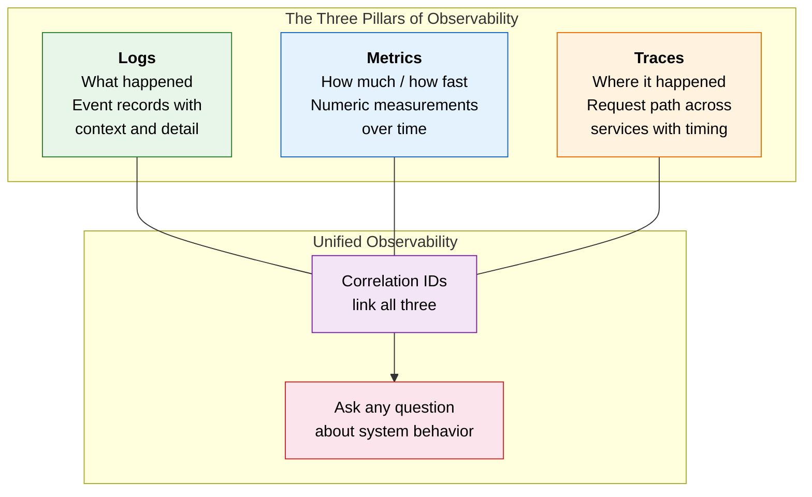
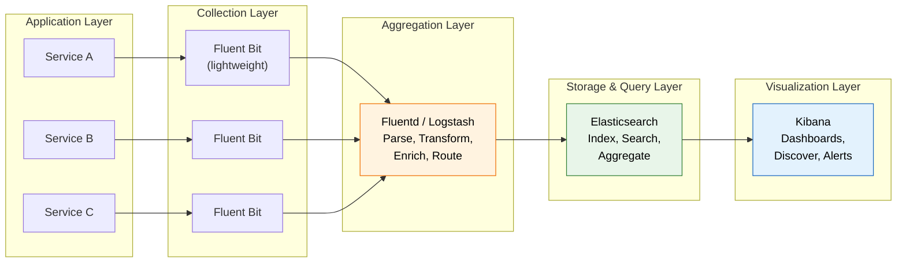
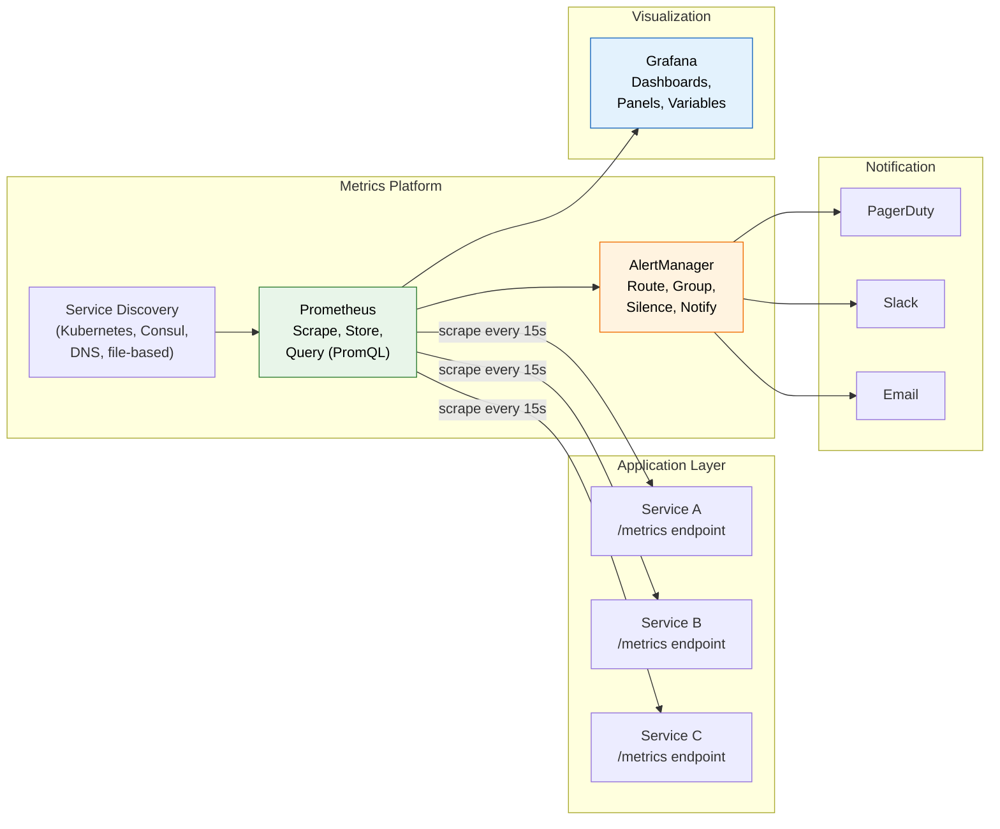
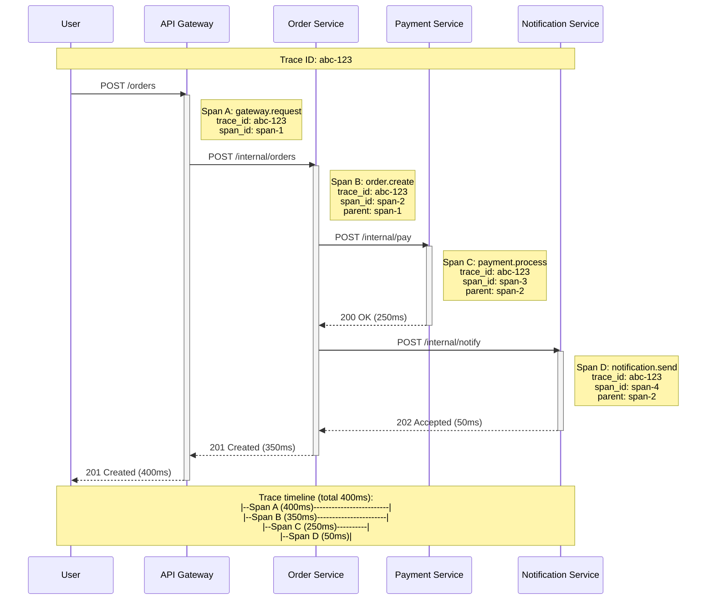
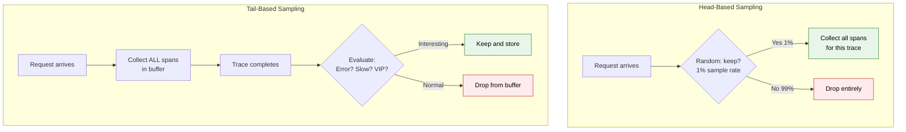
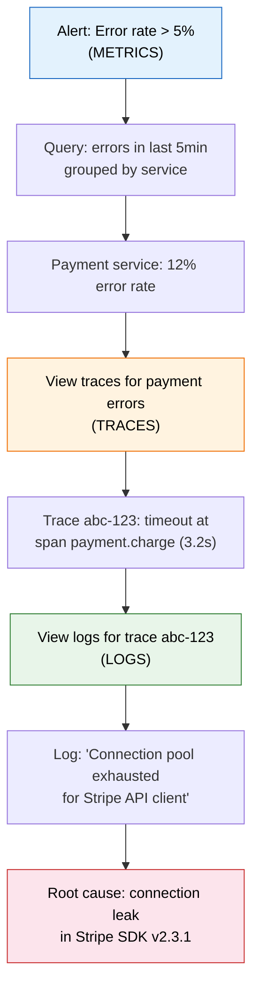

# The Three Pillars of Observability: Logging, Metrics, and Tracing

## Observability vs Monitoring

These terms are often used interchangeably, but they represent fundamentally different
philosophies about understanding system behavior.

### Monitoring: Known Unknowns

Monitoring answers predefined questions. You decide in advance what matters ---
CPU usage, error rates, queue depth --- and build dashboards and alerts for those
specific signals. Monitoring tells you **when** something breaks based on conditions
you anticipated.

- "Is the database up?"
- "Is CPU above 80%?"
- "Are error rates above 1%?"

If you didn't think to monitor it, you won't know about it.

### Observability: Unknown Unknowns

Observability is the ability to understand the **internal state** of a system by
examining its **external outputs**. It lets you ask arbitrary, ad-hoc questions you
never anticipated --- without deploying new code or adding new instrumentation.

- "Why are requests from users in EU taking 3x longer than US users?"
- "What changed between the deploy at 2pm and the latency spike at 2:15pm?"
- "Which specific combination of parameters causes this edge case failure?"

**Key distinction:** Monitoring is a subset of observability. A highly observable
system supports monitoring, but monitoring alone does not give you observability.

```
Monitoring:    "The house is on fire" (smoke detector)
Observability: "The fire started in the kitchen because the stove was left on
                after cooking at 7pm, and the grease pan ignited at 7:42pm"
```

### When Each Matters

| Aspect | Monitoring | Observability |
|--------|-----------|---------------|
| Questions | Predefined | Ad-hoc, exploratory |
| Failure mode | Known failure patterns | Novel, unexpected failures |
| Approach | Dashboard-centric | Query-centric |
| Cardinality | Low (predefined metrics) | High (arbitrary dimensions) |
| Cost model | Fixed overhead | Pay per query/storage |
| Example | "Alert when p99 > 500ms" | "Why did p99 spike for tenant X on endpoint Y?" |

---

## The Three Pillars: Overview



### How They Complement Each Other

- **Metrics** tell you something is wrong (alert fires on high error rate)
- **Logs** tell you what went wrong (stack trace, error message, request payload)
- **Traces** tell you where it went wrong (which service, which hop, which dependency)

A mature observability practice lets you jump between pillars:
1. A metric alert fires: "Error rate spiked to 5%"
2. Click through to traces filtered by that time window
3. Find a failing trace, see it fails at the payment service
4. Jump to logs for that specific trace ID to see the exact error

---

## Pillar 1: Logging

### Structured vs Unstructured Logging

**Unstructured (plain text) --- the old way:**

```
2024-03-15 14:23:45 ERROR PaymentService - Failed to process payment for user 12345, order 67890, amount $99.99, card ending 4242, error: insufficient funds
```

Parsing this requires fragile regex. Every service formats differently. Searching
across millions of lines is slow and unreliable.

**Structured (JSON) --- why it wins:**

```json
{
  "timestamp": "2024-03-15T14:23:45.123Z",
  "level": "ERROR",
  "service": "payment-service",
  "instance": "payment-pod-abc123",
  "trace_id": "4bf92f3577b34da6a3ce929d0e0e4736",
  "span_id": "00f067aa0ba902b7",
  "user_id": "12345",
  "order_id": "67890",
  "amount": 99.99,
  "currency": "USD",
  "card_last_four": "4242",
  "error": "insufficient_funds",
  "message": "Payment processing failed"
}
```

**Why structured logging wins at scale:**

| Aspect | Unstructured | Structured (JSON) |
|--------|-------------|-------------------|
| Parsing | Regex, brittle | Native JSON parsing |
| Querying | Full-text search only | Filter by any field |
| Indexing | Limited | Index any field |
| Alerting | Pattern matching | Precise field matching |
| Correlation | Manual grep | Join on trace_id, user_id |
| Schema evolution | Breaks parsers | Add fields without breaking |
| Machine processing | Difficult | Trivial |

### Log Levels: When to Use Each

```
FATAL  ──→  Application cannot continue. Process will exit.
             Example: Cannot bind to port, database connection pool exhausted
             Action:  Page on-call immediately

ERROR  ──→  Operation failed but application continues.
             Example: Payment declined, API call to dependency failed
             Action:  Alert if rate exceeds threshold

WARN   ──→  Something unexpected but handled gracefully.
             Example: Retry succeeded on 2nd attempt, cache miss fallback to DB
             Action:  Monitor trends, investigate if persistent

INFO   ──→  Normal operational events worth recording.
             Example: Server started, request processed, user logged in
             Action:  Default production level

DEBUG  ──→  Detailed diagnostic information for development.
             Example: SQL query text, request/response bodies, variable values
             Action:  Enable per-service when debugging, never in prod by default
```

**Production rule of thumb:** Run INFO in production. Enable DEBUG per-service
temporarily. Never log at DEBUG globally --- the volume will overwhelm your storage.

### Correlation IDs / Request IDs

In a microservices architecture, a single user request may traverse 5-15 services.
Without a shared identifier, tracing a problem across services is nearly impossible.

```
User Request
    │
    ▼
┌──────────────┐  X-Request-ID: abc-123
│  API Gateway  │──────────────────────────────┐
└──────┬───────┘                               │
       │ X-Request-ID: abc-123                 │
       ▼                                       │
┌──────────────┐                               │
│ Order Service │  logs: {"request_id":"abc-123", ...}
└──────┬───────┘                               │
       │ X-Request-ID: abc-123                 │
       ▼                                       │
┌──────────────┐                               │
│Payment Service│  logs: {"request_id":"abc-123", ...}
└──────┬───────┘                               │
       │ X-Request-ID: abc-123                 │
       ▼                                       │
┌──────────────┐                               │
│ Notification  │  logs: {"request_id":"abc-123", ...}
└──────────────┘                               │
                                               │
Search all logs: request_id = "abc-123" ◄──────┘
```

**Implementation pattern:**
1. API Gateway generates a UUID (or accepts one from the client via `X-Request-ID`)
2. Every service propagates it in headers and includes it in every log line
3. To debug: query your log system for that single ID across all services

### Log Aggregation Architectures

**ELK Stack: Elasticsearch + Logstash + Kibana**



**Loki + Grafana (lightweight alternative):**

| Aspect | ELK Stack | Loki + Grafana |
|--------|----------|----------------|
| Indexing | Full-text index on content | Index labels only (like Prometheus) |
| Storage cost | High (indexes everything) | Low (stores compressed log chunks) |
| Query speed | Fast for any query | Fast for label queries, slower for grep |
| Complexity | High (JVM, cluster mgmt) | Lower (simpler architecture) |
| Best for | Complex log analytics | Cost-effective log storage + Kubernetes |

### Log Sampling and Rate Limiting at Scale

At high throughput (100K+ requests/second), logging every event is impractical.

**Strategies:**

1. **Sample by percentage:** Log 10% of INFO, 100% of ERROR
2. **Sample by attribute:** Log all requests for specific users or tenants
3. **Rate limiting:** Max 1000 logs/second per service; drop excess with a counter
4. **Dynamic sampling:** Increase sampling when errors spike, reduce when healthy
5. **Head-based sampling:** Decide at request entry whether to log this request fully
6. **Tail-based sampling:** Collect everything, decide after completion what to keep (keep errors, slow requests)

```
Normal traffic:  ████████████████████  → sample 1% → ██
Error spike:     ████████████████████  → sample 100% → ████████████████████
Slow requests:   ████████████████████  → keep all > p99 → ████
```

---

## Pillar 2: Metrics

### The Four Metric Types

| Type | What It Measures | Example | Behavior |
|------|-----------------|---------|----------|
| **Counter** | Cumulative total (only goes up) | Total HTTP requests, total errors | Monotonically increasing; reset on restart |
| **Gauge** | Current value (goes up and down) | Current CPU %, active connections, queue depth | Point-in-time snapshot |
| **Histogram** | Distribution of values in buckets | Request latency distribution | Pre-defined buckets; compute percentiles server-side |
| **Summary** | Distribution with client-side quantiles | Request latency p50, p90, p99 | Calculated on client; cannot aggregate across instances |

**When to use Histogram vs Summary:**

- **Histogram:** Use when you need aggregatable percentiles across instances. Define
  buckets in advance (e.g., 10ms, 50ms, 100ms, 250ms, 500ms, 1s, 5s).
- **Summary:** Use when you need precise quantiles from a single instance and do not
  need to aggregate across instances.

### Prometheus: Pull-Based Metrics



**PromQL Examples:**

```promql
# Request rate (requests per second over 5 minutes)
rate(http_requests_total[5m])

# Error rate as percentage
rate(http_requests_total{status=~"5.."}[5m])
/ rate(http_requests_total[5m]) * 100

# 99th percentile latency from histogram
histogram_quantile(0.99, rate(http_request_duration_seconds_bucket[5m]))

# Top 5 endpoints by request rate
topk(5, sum by (endpoint) (rate(http_requests_total[5m])))

# CPU usage by pod
100 - (avg by (instance) (rate(node_cpu_seconds_total{mode="idle"}[5m])) * 100)

# Memory usage percentage
(node_memory_MemTotal_bytes - node_memory_MemAvailable_bytes)
/ node_memory_MemTotal_bytes * 100
```

### Methodologies for Choosing Metrics

**RED Method (for services / request-driven systems):**

| Signal | What to Measure | PromQL Example |
|--------|----------------|----------------|
| **R**ate | Requests per second | `rate(http_requests_total[5m])` |
| **E**rror rate | Failed requests / total | `rate(http_requests_total{status=~"5.."}[5m]) / rate(http_requests_total[5m])` |
| **D**uration | Latency distribution | `histogram_quantile(0.99, rate(http_request_duration_bucket[5m]))` |

**USE Method (for resources / infrastructure):**

| Signal | What to Measure | Example |
|--------|----------------|---------|
| **U**tilization | % of resource capacity used | CPU at 75%, disk at 60% |
| **S**aturation | Work queued beyond capacity | Run queue length, swap usage |
| **E**rrors | Error events on the resource | Disk I/O errors, NIC packet drops |

**Four Golden Signals (Google SRE):**

| Signal | Definition | Why It Matters |
|--------|-----------|---------------|
| **Latency** | Time to serve a request | Distinguish successful vs failed request latency |
| **Traffic** | Demand on the system | Requests/sec, transactions/sec, sessions |
| **Errors** | Rate of failed requests | Explicit (5xx), implicit (wrong content), policy (too slow) |
| **Saturation** | How full the system is | CPU, memory, I/O, queue depth; predict before hitting limit |

**Choosing a methodology:**
- Building a **service dashboard**? Start with RED.
- Debugging **infrastructure**? Start with USE.
- Designing **SLO-based alerting**? Start with the Four Golden Signals.

---

## Pillar 3: Distributed Tracing

### Core Concepts

**Trace:** The complete journey of a single request through the distributed system.
Contains multiple spans.

**Span:** A single unit of work within a trace. Has a start time, duration, operation
name, and metadata (tags/attributes). Spans have parent-child relationships.

**Context Propagation:** The mechanism by which trace context (trace ID, span ID,
sampling decision) is passed between services, typically via HTTP headers.



### Span Relationships

```
Trace: abc-123
│
├── Span A: gateway.request (0ms - 400ms)     [root span]
│   │
│   └── Span B: order.create (10ms - 360ms)   [child of A]
│       │
│       ├── Span C: payment.process (20ms - 270ms)  [child of B]
│       │   │
│       │   └── Span E: db.query (30ms - 60ms)      [child of C]
│       │
│       └── Span D: notification.send (280ms - 330ms) [child of B]
│           │
│           └── Span F: kafka.produce (285ms - 310ms) [child of D]
```

### Tracing Tools

| Tool | Maintainer | Key Features |
|------|-----------|-------------|
| **Jaeger** | CNCF | Native OpenTelemetry support, adaptive sampling, dependency graph |
| **Zipkin** | OpenZipkin | Mature, simple, wide language support |
| **AWS X-Ray** | AWS | Deep AWS integration, service map, insights |
| **Tempo** | Grafana Labs | Object-storage backend (S3/GCS), pairs with Grafana |
| **Datadog APM** | Datadog | Full-stack, code-level profiling, ML-based anomaly detection |

### Trace Sampling Strategies

At high scale, storing every trace is prohibitively expensive. Sampling decides
which traces to keep.

**Head-based sampling:**
- Decision made at the start of the trace (at the entry point)
- Simple: keep 1% of all traces, or 100% of traces with `debug=true` header
- Pro: low overhead, predictable cost
- Con: might miss interesting traces (a rare error in the 99% you dropped)

**Tail-based sampling:**
- Decision made after the trace completes
- The collector sees all spans, then decides: keep errors, keep slow traces, keep traces from important users
- Pro: captures all interesting traces regardless of sampling rate
- Con: must buffer all spans until trace completes; higher resource usage at collector



**Practical sampling rules (tail-based):**

```yaml
# Tail-based sampling policy example
policies:
  - name: errors
    type: status_code
    status_code: { status_codes: [ERROR] }
    # Keep 100% of error traces

  - name: slow-traces
    type: latency
    latency: { threshold_ms: 2000 }
    # Keep 100% of traces slower than 2 seconds

  - name: baseline
    type: probabilistic
    probabilistic: { sampling_percentage: 1 }
    # Keep 1% of remaining normal traces
```

---

## Connecting the Three Pillars

The real power of observability comes from correlating across pillars using shared
identifiers --- primarily the trace ID.



This workflow --- metrics alert you, traces localize the problem, logs reveal the
root cause --- is the foundation of effective incident response in distributed systems.

---

## Interview Questions and Answers

**Q: You're debugging a latency spike in production. You have metrics, logs, and traces. Walk me through your debugging workflow.**

A: Start with metrics to scope the problem --- which service, which endpoint, when
did it start? Then examine traces from that time window filtered to slow requests to
find which downstream dependency is the bottleneck. Finally, look at logs for the
specific trace IDs of slow traces to find the exact error or condition. This
metrics-to-traces-to-logs workflow is the standard observability debugging loop.

**Q: Your system processes 500K requests/second. How do you handle logging at this scale?**

A: Use structured logging (JSON) with a lightweight shipper like Fluent Bit on each
node. Apply sampling: log 100% of errors and slow requests, 1-5% of normal INFO
requests. Rate-limit per service to prevent a logging storm from a single chatty
service. Use a tiered storage strategy: hot (recent, searchable) and cold (archived,
compressed). Consider Loki over Elasticsearch if full-text indexing isn't needed, as
it only indexes labels and stores compressed log chunks.

**Q: Explain the difference between head-based and tail-based trace sampling. When would you choose each?**

A: Head-based decides at request entry (randomly keep N%). It is simple and
predictable but may miss rare errors. Tail-based buffers all spans and decides after
completion --- keeping errors, slow traces, and VIP traffic. Tail-based captures
more interesting data but requires more collector resources. Use head-based for
cost-sensitive environments with high throughput; use tail-based when you cannot
afford to miss error traces.

**Q: Why would you choose Loki over Elasticsearch for logs?**

A: Loki indexes only labels (service name, level, namespace), not log content.
This makes it 10-50x cheaper to operate at scale. It pairs natively with Grafana
and uses the same label-based query model as Prometheus. Choose Elasticsearch when
you need full-text search over log content or complex analytics. Choose Loki when
you want cost-effective log storage, especially in Kubernetes environments where
you already use Prometheus and Grafana.
