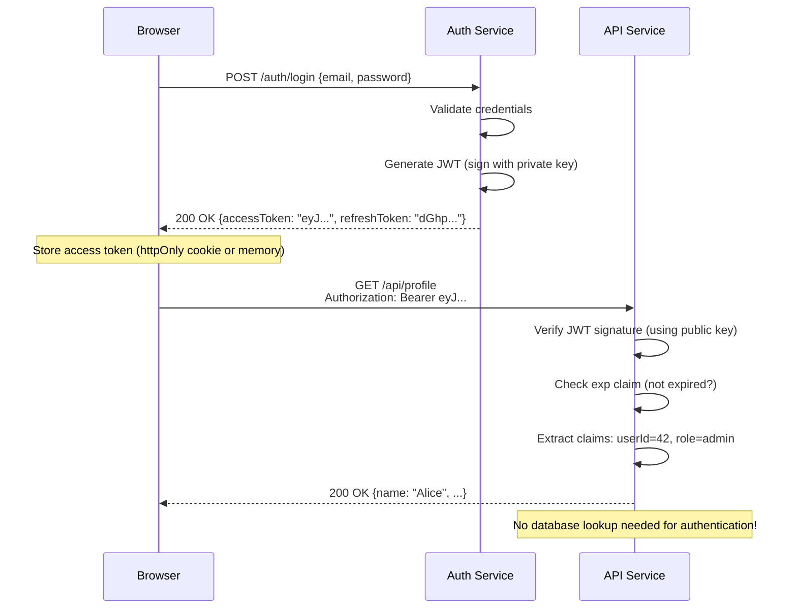
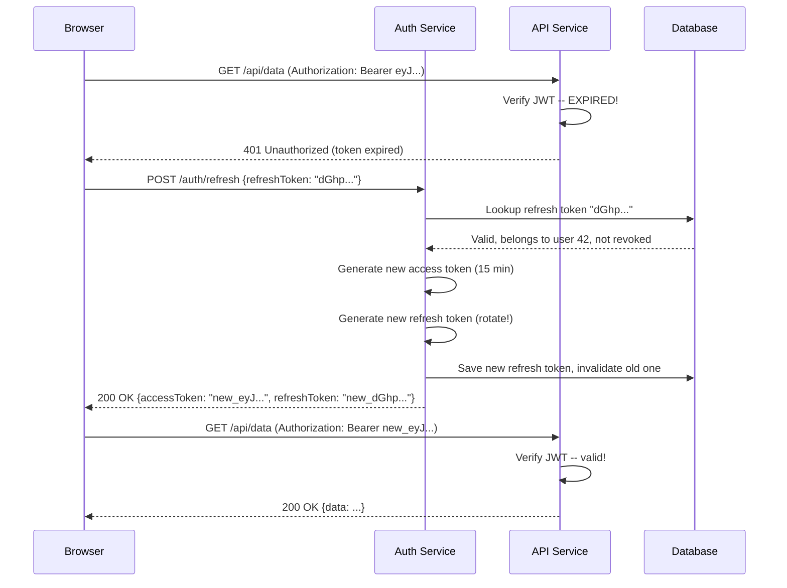
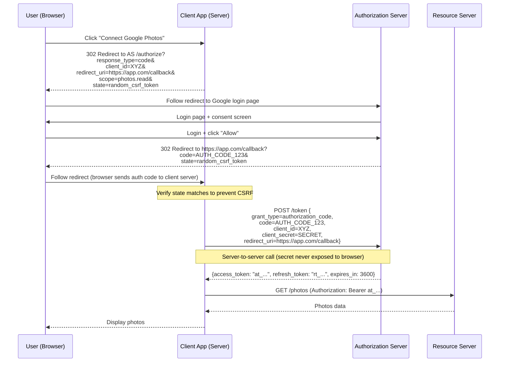
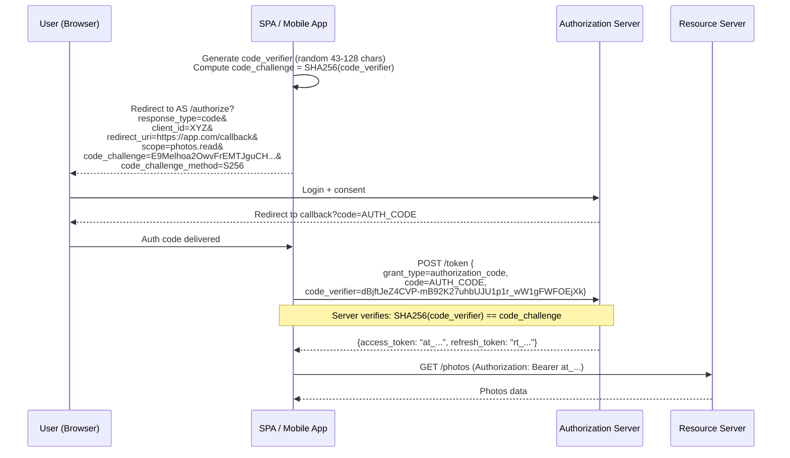
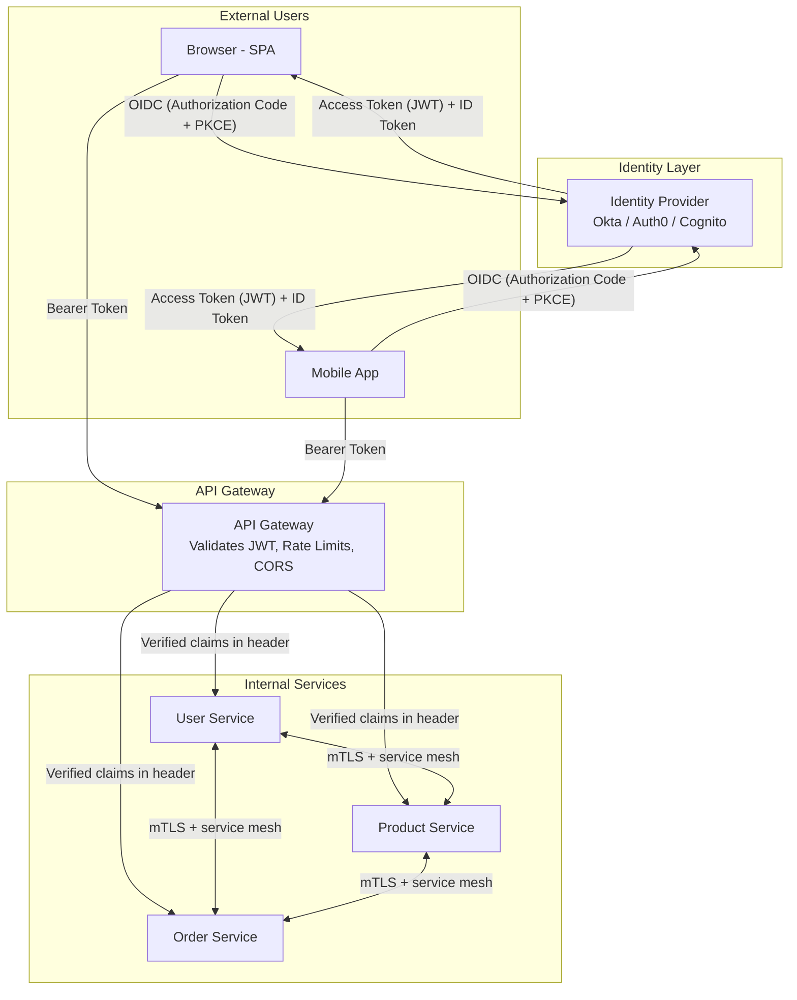

# Authentication -- Deep Dive

## AuthN vs AuthZ

Two distinct concerns that people constantly conflate:

```
Authentication (AuthN): "WHO are you?"
  - Verifying identity
  - Example: Logging in with username + password
  - Example: Presenting a passport at border control
  - Result: An identity claim (user ID, email, etc.)

Authorization (AuthZ): "WHAT can you do?"
  - Verifying permissions
  - Example: Checking if user #42 can delete post #99
  - Example: Checking if your passport lets you enter a country
  - Result: Allow or deny a specific action
```

They happen in sequence -- you cannot authorize without first authenticating:

```
Request arrives
     |
     v
  [AuthN] -- WHO is making this request?
     |
     | identity established (user_id = 42)
     v
  [AuthZ] -- DOES user 42 have permission for this action?
     |
     +---> YES: process the request
     +---> NO:  return 403 Forbidden
```

Key distinction: a 401 Unauthorized response actually means "unauthenticated" (identity
not established). A 403 Forbidden means "authenticated but not authorized" (identity known,
but insufficient permissions). The HTTP spec named 401 poorly.

---

## Session-Based Authentication

The oldest and simplest approach. The server maintains state about each logged-in user.

### How It Works

1. User sends credentials (username + password) to the login endpoint
2. Server validates credentials against the database
3. Server creates a **session** (an in-memory or database record) keyed by a random session ID
4. Server sends back a `Set-Cookie` header with the session ID
5. Browser automatically includes the cookie on every subsequent request
6. Server looks up the session by ID to identify the user

### Login Flow

```mermaid
sequenceDiagram
    participant B as Browser
    participant S as Server
    participant DB as Database
    participant SS as Session Store

    B->>S: POST /login {email, password}
    S->>DB: Find user by email
    DB-->>S: User record (hashed password)
    S->>S: Verify password (bcrypt.compare)
    S->>SS: Create session {sid: "abc123", userId: 42, createdAt: now}
    SS-->>S: Session stored
    S-->>B: 200 OK + Set-Cookie: sid=abc123; HttpOnly; Secure; SameSite=Strict
    Note over B: Browser stores cookie automatically

    B->>S: GET /api/profile (Cookie: sid=abc123)
    S->>SS: Lookup session "abc123"
    SS-->>S: {userId: 42, createdAt: ...}
    S->>DB: SELECT * FROM users WHERE id = 42
    DB-->>S: User data
    S-->>B: 200 OK {name: "Alice", email: "alice@example.com"}
```

### Session Storage Options

| Store | Latency | Scalability | Durability |
|---|---|---|---|
| In-memory (process) | ~0.01ms | Single server only | Lost on restart |
| Redis | ~0.5ms | Horizontally scalable | Configurable persistence |
| Database (PostgreSQL) | ~2ms | Scales with DB | Fully durable |
| Memcached | ~0.5ms | Distributed | No persistence |

### Pros

- **Simple mental model**: session is just a server-side record
- **Server has full control**: can invalidate any session instantly (logout, ban user)
- **Small cookie size**: only a random session ID (~32 bytes)
- **Automatic browser handling**: cookies sent automatically, no JavaScript needed
- **Immune to token theft in XSS**: HttpOnly cookies are not accessible via JavaScript

### Cons

- **Stateful**: server must store every active session
- **Horizontal scaling is painful**: request might hit a different server that does not have the session
  - Fix 1: Sticky sessions (load balancer routes same user to same server) -- but kills load distribution
  - Fix 2: Shared session store (Redis) -- adds network hop and a dependency
- **CSRF vulnerability**: browser sends cookies automatically, so a malicious site can forge requests
  - Fix: CSRF tokens, SameSite cookie attribute
- **Not suitable for mobile/API**: cookies are a browser mechanism

### Session Invalidation

```python
# Server-side logout -- instant and reliable
def logout(request):
    session_id = request.cookies.get("sid")
    session_store.delete(session_id)       # Gone. Immediately invalid.
    response = make_response(redirect("/login"))
    response.delete_cookie("sid")
    return response

# Force-logout a user (e.g., password change, suspicious activity)
def force_logout_user(user_id):
    sessions = session_store.find_by_user(user_id)
    for session in sessions:
        session_store.delete(session.id)   # All sessions destroyed
```

This is a massive advantage over JWTs. When a user changes their password or gets banned,
you can immediately revoke all their sessions. With JWTs, you cannot do this without
additional infrastructure.

---

## Token-Based Authentication (JWT)

JSON Web Tokens encode identity claims into a self-contained, cryptographically signed token.
The server does not need to store session state -- it simply verifies the signature.

### JWT Structure

A JWT has three parts separated by dots, each Base64URL-encoded:

```
eyJhbGciOiJIUzI1NiIsInR5cCI6IkpXVCJ9.        <-- Header
eyJzdWIiOiI0MiIsImVtYWlsIjoiYWxpY2VAZXhhbXBs   <-- Payload
ZS5jb20iLCJyb2xlIjoiYWRtaW4iLCJpYXQiOjE3MDk4
MzIwMDAsImV4cCI6MTcwOTgzMjkwMH0.
SflKxwRJSMeKKF2QT4fwpMeJf36POk6yJV_adQssw5c   <-- Signature
```

Decoded:

```json
// HEADER (algorithm and token type)
{
  "alg": "HS256",    // HMAC-SHA256 (symmetric) or RS256 (asymmetric)
  "typ": "JWT"
}

// PAYLOAD (claims -- the actual data)
{
  "sub": "42",                       // Subject: the user ID
  "email": "alice@example.com",      // Custom claim
  "role": "admin",                   // Custom claim
  "iss": "auth.myapp.com",          // Issuer: who created this token
  "aud": "api.myapp.com",           // Audience: who should accept this token
  "iat": 1709832000,                // Issued At: when the token was created
  "exp": 1709832900,                // Expiration: when the token expires (15 min)
  "jti": "a1b2c3d4"                 // JWT ID: unique token identifier
}

// SIGNATURE
HMAC-SHA256(
  base64UrlEncode(header) + "." + base64UrlEncode(payload),
  secret_key
)
```

### Symmetric vs Asymmetric Signing

| Algorithm | Type | How It Works | Use Case |
|---|---|---|---|
| HS256 | Symmetric | Same secret signs AND verifies | Single service (auth + API on same server) |
| RS256 | Asymmetric | Private key signs, public key verifies | Microservices (auth service signs, all services verify with public key) |
| ES256 | Asymmetric | ECDSA (smaller keys than RSA) | Mobile, IoT (smaller token overhead) |

For microservices, RS256 or ES256 is strongly preferred. With HS256, every service that
needs to verify tokens must have the shared secret -- if any one service is compromised,
all tokens are compromised. With RS256, only the auth service holds the private key;
all other services only need the public key.

### Login Flow with JWT



### Access Token + Refresh Token Pattern

The fundamental problem with JWTs: you cannot revoke them before expiry. The solution
is to make access tokens very short-lived and use a separate refresh token mechanism.

```
Access Token:
  - Short-lived: 5-15 minutes
  - Used for every API call
  - Contains user claims
  - Stateless verification (just check signature + expiry)
  - If stolen, damage is limited to 15 minutes

Refresh Token:
  - Long-lived: 7-30 days
  - Used ONLY to get new access tokens
  - Stored in database (server-side state!)
  - Can be revoked instantly
  - Often rotated on each use (one-time use)
```

### Token Refresh Flow



### Refresh Token Rotation (Theft Detection)

If you rotate refresh tokens on each use and someone steals the old refresh token:

```
Normal flow:
  1. Client uses refresh_token_v1 --> gets access_token + refresh_token_v2
  2. Client uses refresh_token_v2 --> gets access_token + refresh_token_v3
  (refresh_token_v1 is now invalidated)

If attacker steals refresh_token_v1:
  1. Attacker uses refresh_token_v1 --> FAILS (already used/invalidated)
  2. Server detects reuse --> REVOKES entire refresh token family
  3. Legitimate user must re-authenticate

If attacker steals refresh_token_v2 before legitimate user uses it:
  1. Attacker uses refresh_token_v2 --> gets tokens (attacker wins temporarily)
  2. Legitimate user tries refresh_token_v2 --> FAILS (already used)
  3. Server detects reuse --> REVOKES entire family
  4. Attacker's tokens become invalid too
```

### JWT Best Practices

1. **Short expiry for access tokens**: 5-15 minutes maximum
2. **Never store sensitive data in payload**: JWTs are Base64-encoded, NOT encrypted -- anyone can read them
3. **Always use HTTPS**: tokens in transit must be encrypted
4. **Store in httpOnly cookie**: not accessible via JavaScript (XSS protection)
5. **Set `aud` and `iss` claims**: prevent tokens intended for one service from being used on another
6. **Use asymmetric signing (RS256/ES256)** in microservice architectures
7. **Validate ALL claims**: signature, exp, iss, aud -- not just signature
8. **Never use the `none` algorithm**: a common attack vector where attackers strip the signature

### JWT Pitfalls

| Pitfall | Details |
|---|---|
| Cannot revoke before expiry | Need a denylist (Redis) to block specific tokens -- but then you have server-side state again |
| Token size grows with claims | A JWT with many claims can be 1-2KB; sent on every request |
| Payload is readable | Base64 is encoding, not encryption. Do not put secrets in JWTs |
| Clock skew | Servers with different clocks may disagree on expiry. Use small leeway (30s) |
| Algorithm confusion attacks | Attacker switches RS256 to HS256, uses public key as HMAC secret. Libraries must enforce expected algorithm |
| Logout is hard | Destroying the client-side token does not truly log out -- a copied token still works until expiry |

### Code Example: JWT in Node.js

```javascript
const jwt = require('jsonwebtoken');

// --- Auth Service: Signing (private key) ---
const privateKey = fs.readFileSync('private.pem');

function generateAccessToken(user) {
  return jwt.sign(
    { sub: user.id, email: user.email, role: user.role },
    privateKey,
    {
      algorithm: 'RS256',
      expiresIn: '15m',
      issuer: 'auth.myapp.com',
      audience: 'api.myapp.com',
    }
  );
}

// --- API Service: Verification (public key) ---
const publicKey = fs.readFileSync('public.pem');

function verifyAccessToken(token) {
  try {
    return jwt.verify(token, publicKey, {
      algorithms: ['RS256'],           // MUST specify allowed algorithms
      issuer: 'auth.myapp.com',
      audience: 'api.myapp.com',
    });
  } catch (err) {
    if (err.name === 'TokenExpiredError') {
      throw new Error('Token expired -- use refresh token');
    }
    throw new Error('Invalid token');
  }
}

// --- Express Middleware ---
function authMiddleware(req, res, next) {
  const authHeader = req.headers.authorization;
  if (!authHeader?.startsWith('Bearer ')) {
    return res.status(401).json({ error: 'Missing token' });
  }

  const token = authHeader.split(' ')[1];
  try {
    req.user = verifyAccessToken(token);
    next();
  } catch (err) {
    return res.status(401).json({ error: err.message });
  }
}
```

---

## OAuth 2.0

OAuth 2.0 is an **authorization** framework -- NOT an authentication protocol. It lets a
third-party application access a user's resources on another service, without the user
sharing their password.

```
The problem OAuth solves:

  "I want this photo printing app to access my Google Photos,
   but I do NOT want to give it my Google password."

  OAuth solution:
  1. Photo app redirects me to Google
  2. I log in to Google directly (never share password with photo app)
  3. Google asks: "Photo Printer wants to read your photos. Allow?"
  4. I click Allow
  5. Google gives photo app a limited access token (read photos only)
  6. Photo app uses that token to access my photos
```

### OAuth 2.0 Roles

```
Resource Owner:   The user who owns the data (you)
Client:           The application requesting access (Photo Printer app)
Authorization     The server that authenticates the user and issues
Server:           tokens (Google's auth server)
Resource Server:  The server hosting the protected resources
                  (Google Photos API)
```

### Grant Type 1: Authorization Code (Most Secure)

Used by server-side web applications. The most secure flow because the access token is
never exposed to the browser.



Why the intermediate authorization code? The access token is exchanged server-to-server,
never passing through the browser. The authorization code is short-lived (typically 10
minutes, one-time use) and useless without the client_secret.

### Grant Type 2: Authorization Code + PKCE

PKCE (Proof Key for Code Exchange, pronounced "pixie") is mandatory for public clients
like SPAs and mobile apps that cannot securely store a client_secret.



How PKCE prevents interception attacks:

```
Without PKCE (Implicit grant):
  1. Attacker intercepts auth code from redirect
  2. Attacker exchanges code for token --> ATTACK SUCCEEDS

With PKCE:
  1. Client generates random code_verifier, sends SHA256(code_verifier)
  2. Attacker intercepts auth code from redirect
  3. Attacker tries to exchange code, but does not have code_verifier
  4. Server rejects: SHA256(attacker_guess) != stored code_challenge
  --> ATTACK FAILS
```

### Grant Type 3: Client Credentials

Machine-to-machine authentication. No user involved. The client authenticates directly
with its own credentials.

```
Use case: Backend service calling another backend service
  - Microservice A needs to call Microservice B's API
  - A cron job needs to access an API
  - CI/CD pipeline needs to deploy

Flow:
  Client ->> Auth Server: POST /token
                          grant_type=client_credentials
                          client_id=SERVICE_A
                          client_secret=SECRET
  Auth Server -->> Client: {access_token: "...", expires_in: 3600}
  Client ->> Resource Server: GET /api/data (Bearer token)
```

### Grant Type 4: Device Code

For devices with limited input capability (smart TVs, CLI tools, IoT devices).

```
Flow:
  1. Device requests a code pair from auth server
     Response: {device_code: "XYZ", user_code: "WDJB-MJHT", verification_uri: "https://auth.com/device"}

  2. Device displays: "Go to https://auth.com/device and enter code: WDJB-MJHT"

  3. User opens URL on their phone/laptop, enters code, logs in, consents

  4. Meanwhile, device polls auth server every 5 seconds:
     POST /token {grant_type=urn:ietf:params:oauth:grant-type:device_code, device_code=XYZ}
     Response: {error: "authorization_pending"}  ... keep polling
     Response: {error: "authorization_pending"}  ... keep polling
     Response: {access_token: "at_...", refresh_token: "rt_..."}  -- user approved!
```

### Implicit Grant (DEPRECATED)

The implicit grant returned the access token directly in the URL fragment (`#access_token=...`).
It was designed for SPAs before PKCE existed.

Why it is deprecated:
- Access token exposed in URL (browser history, server logs, referrer headers)
- No refresh tokens (must re-authorize when token expires)
- Vulnerable to token injection attacks
- PKCE solves all the same problems more securely

**Never use the implicit grant. Use Authorization Code + PKCE instead.**

### OAuth 2.0 Scopes

Scopes define fine-grained permissions for what the token can access:

```
# Google scopes
https://www.googleapis.com/auth/drive.readonly    # Read Google Drive files
https://www.googleapis.com/auth/drive.file         # Access files created by the app
https://www.googleapis.com/auth/calendar.events    # Manage calendar events

# GitHub scopes
repo            # Full access to repositories
repo:status     # Read-only access to commit statuses
user:email      # Read user email addresses
read:org        # Read organization membership

# Custom scopes
photos:read     # Read photos
photos:write    # Create/update photos
photos:delete   # Delete photos
```

The consent screen shows the user exactly what permissions are being requested. The access
token is scoped to only those permissions. Principle of least privilege.

---

## OpenID Connect (OIDC)

OAuth 2.0 is an authorization framework -- it does NOT tell you WHO the user is.
OpenID Connect adds an **authentication layer on top of OAuth 2.0**.

```
OAuth 2.0 alone:
  "Here is an access token. It lets you read photos."
  But WHO is the user? You would have to call a /userinfo endpoint to find out.

OIDC:
  "Here is an access token AND an ID token.
   The ID token tells you: this is alice@example.com, user ID 42."
```

### What OIDC Adds to OAuth 2.0

```
Standard OAuth 2.0 Flow            OIDC Flow
========================            =========
1. Authorization request            1. Authorization request + scope=openid
2. Get authorization code           2. Get authorization code
3. Exchange code for access token   3. Exchange code for access token + ID TOKEN
4. Use access token to call API     4. Parse ID token to get user identity
                                    5. Optionally call /userinfo endpoint
```

### ID Token vs Access Token

| Property | ID Token | Access Token |
|---|---|---|
| **Purpose** | Tells the CLIENT who the user is | Lets the CLIENT call APIs on behalf of the user |
| **Audience** | The client application | The resource server (API) |
| **Format** | Always a JWT | Can be JWT or opaque string |
| **Contains** | User identity claims (sub, email, name) | Scopes/permissions |
| **Sent to** | Never sent to APIs | Sent as Bearer token to APIs |

### ID Token Claims

```json
{
  "iss": "https://accounts.google.com",    // Issuer
  "sub": "110169484474386276334",           // Subject (unique user ID at this issuer)
  "aud": "my-app-client-id",               // Audience (your app)
  "exp": 1709836500,                       // Expiration
  "iat": 1709832900,                       // Issued at
  "nonce": "abc123",                       // Replay protection
  "email": "alice@example.com",
  "email_verified": true,
  "name": "Alice Smith",
  "picture": "https://lh3.google.com/..."
}
```

### OIDC Scopes

| Scope | Claims Returned |
|---|---|
| `openid` | `sub` (required for OIDC) |
| `profile` | `name`, `family_name`, `given_name`, `picture`, etc. |
| `email` | `email`, `email_verified` |
| `address` | `address` |
| `phone` | `phone_number`, `phone_number_verified` |

### UserInfo Endpoint

OIDC defines a standard `/userinfo` endpoint that returns claims about the authenticated user:

```
GET /userinfo
Authorization: Bearer access_token

Response:
{
  "sub": "110169484474386276334",
  "name": "Alice Smith",
  "email": "alice@example.com",
  "picture": "https://..."
}
```

---

## SAML (Security Assertion Markup Language)

SAML is an XML-based framework for SSO (Single Sign-On), primarily used in enterprise
environments. It predates OAuth/OIDC and is more complex, but remains deeply embedded
in enterprise identity infrastructure.

### How SAML SSO Works

```
1. User tries to access app.company.com (Service Provider / SP)
2. SP redirects user to IdP (Identity Provider, e.g., Okta, Azure AD)
3. User authenticates at IdP (possibly already has an active session)
4. IdP creates a SAML Assertion (XML document, digitally signed)
5. IdP sends the assertion back to the SP via the user's browser (POST)
6. SP validates the assertion signature and extracts user attributes
7. SP creates a local session for the user
```

### SAML vs OIDC

| Feature | SAML | OIDC |
|---|---|---|
| Format | XML | JSON (JWT) |
| Transport | Browser POST/Redirect | HTTP API calls |
| Token size | Large (XML + signatures) | Small (JWT) |
| Mobile friendly | No (XML parsing, redirect flow) | Yes |
| Adoption | Enterprise, legacy | Modern apps, APIs, mobile |
| Complexity | High | Moderate |
| SSO | Primary use case | Supported |

**When to use SAML**: Your enterprise customers require it (Okta, ADFS, PingFederate).
**When to use OIDC**: New applications, mobile apps, APIs, consumer-facing products.
Many companies support both -- SAML for enterprise customers, OIDC for everything else.

---

## Multi-Factor Authentication (MFA / 2FA)

Something you know (password) + something you have (phone) + something you are (fingerprint).

### TOTP (Time-based One-Time Password)

The most common 2FA method. Both server and client share a secret key. Both compute
the same 6-digit code based on the current time.

```python
import hmac, hashlib, struct, time

def generate_totp(secret: bytes, time_step: int = 30) -> str:
    """Generate a 6-digit TOTP code."""
    # Current time period (changes every 30 seconds)
    counter = int(time.time()) // time_step

    # HMAC-SHA1 of the counter using the shared secret
    hmac_hash = hmac.new(secret, struct.pack(">Q", counter), hashlib.sha1).digest()

    # Dynamic truncation: extract 4 bytes at an offset determined by last nibble
    offset = hmac_hash[-1] & 0x0F
    code = struct.unpack(">I", hmac_hash[offset:offset+4])[0] & 0x7FFFFFFF

    # 6-digit code (modulo 10^6)
    return str(code % 1_000_000).zfill(6)

# Server and client both compute: 847 293 (valid for 30 seconds)
```

### SMS-Based 2FA

Sends a code via text message. Widely used but NOT recommended:

- Vulnerable to SIM swapping (attacker transfers your number to their SIM)
- Vulnerable to SS7 attacks (intercepting SMS at the carrier level)
- Messages can be read from lock screen notifications
- NIST has deprecated SMS 2FA for government use

### WebAuthn / Passkeys

The future of authentication. Uses public-key cryptography with hardware authenticators
(YubiKey, fingerprint reader, Face ID).

```
Registration:
  1. Server sends challenge (random bytes)
  2. Authenticator creates a new key pair (private stays on device)
  3. Authenticator signs the challenge with private key
  4. Browser sends public key + signed challenge to server
  5. Server stores public key for the user

Authentication:
  1. Server sends new challenge
  2. Authenticator signs challenge with private key
  3. Server verifies signature with stored public key

Advantages:
  - Phishing-resistant (authenticator checks the origin/domain)
  - No shared secrets (nothing to leak from a database breach)
  - No passwords to remember
  - Biometric verification stays on device (fingerprint never leaves your phone)
```

### MFA Methods Comparison

| Method | Security | Usability | Phishing Resistant | Cost |
|---|---|---|---|---|
| SMS | Low | High | No | Low |
| TOTP (Authenticator app) | Medium | Medium | No (phishable) | Free |
| Push notification | Medium-High | High | Partially | Medium |
| Hardware key (YubiKey) | Very High | Low-Medium | Yes | High ($25-50/key) |
| Passkeys (WebAuthn) | Very High | High | Yes | Free (built into devices) |

---

## Comparison Table: Authentication Mechanisms

| Feature | Session-Based | JWT | OAuth 2.0 | OIDC | SAML |
|---|---|---|---|---|---|
| **Primary purpose** | AuthN | AuthN | AuthZ (delegation) | AuthN (on top of OAuth) | AuthN + SSO |
| **State** | Stateful (server stores session) | Stateless (self-contained) | Depends on implementation | Depends | Stateful (IdP) |
| **Token format** | Opaque session ID | JSON (Base64) | Opaque or JWT | JWT (ID token) | XML |
| **Revocation** | Instant (delete session) | Hard (wait for expiry or maintain denylist) | Revoke at auth server | Same as OAuth | Revoke at IdP |
| **Best for** | Traditional web apps | APIs, microservices | Third-party access | User identity + SSO | Enterprise SSO |
| **Scalability** | Needs shared session store | Excellent (no server state) | Excellent | Excellent | Moderate |
| **Mobile support** | Poor (cookie-based) | Excellent | Excellent | Excellent | Poor |
| **Complexity** | Low | Low-Medium | High | High | Very High |

### Decision Flowchart

```
Do you need third-party access to user resources?
  |
  YES --> OAuth 2.0
  |         |
  |         Do you also need to know WHO the user is?
  |           YES --> OIDC (OAuth 2.0 + ID Token)
  |           NO  --> Plain OAuth 2.0
  |
  NO --> Is this a traditional server-rendered web app?
           |
           YES --> Session-based auth (simplest)
           |
           NO --> Is this an API or SPA/mobile?
                    |
                    YES --> JWT (access + refresh tokens)
                    |
                    Do your enterprise customers need SSO?
                      YES --> SAML (or OIDC)
                      NO  --> JWT is fine
```

---

## Real-World Architecture: Putting It All Together

A typical production system uses multiple mechanisms together:



Key points:
- External clients use OIDC with PKCE to get JWT tokens from the identity provider
- API Gateway validates JWTs centrally (one place to verify tokens, enforce rate limits)
- Internal services communicate over mTLS via a service mesh (no JWT between services)
- Enterprise SSO customers can use SAML, which the IdP federates into the same JWT flow

---

## Interview Quick Reference

**"How would you design an auth system?"**

1. Use an identity provider (Auth0, Cognito, Okta) -- do not roll your own
2. OIDC for user authentication (get ID token + access token)
3. Short-lived JWTs (15min) + refresh tokens (7 days, stored server-side)
4. API Gateway validates JWTs centrally
5. RBAC or ABAC for authorization (see authorization.md)
6. MFA for sensitive operations (require step-up auth for password change, payment)
7. mTLS between internal services

**"How do you revoke a JWT?"**

- Short-lived access tokens (15min) limit the blast radius
- For immediate revocation: maintain a denylist in Redis (check on each request)
- Revoke the refresh token in the database (user cannot get new access tokens)
- For critical scenarios (compromised key): rotate the signing key (invalidates ALL tokens)

**"Session vs JWT?"**

- Sessions: simple, instant revocation, poor horizontal scaling
- JWTs: stateless, great scaling, difficult revocation
- Most production systems use JWTs with refresh tokens stored server-side (hybrid approach)
