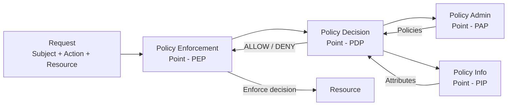
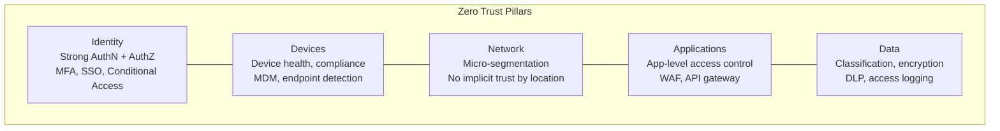
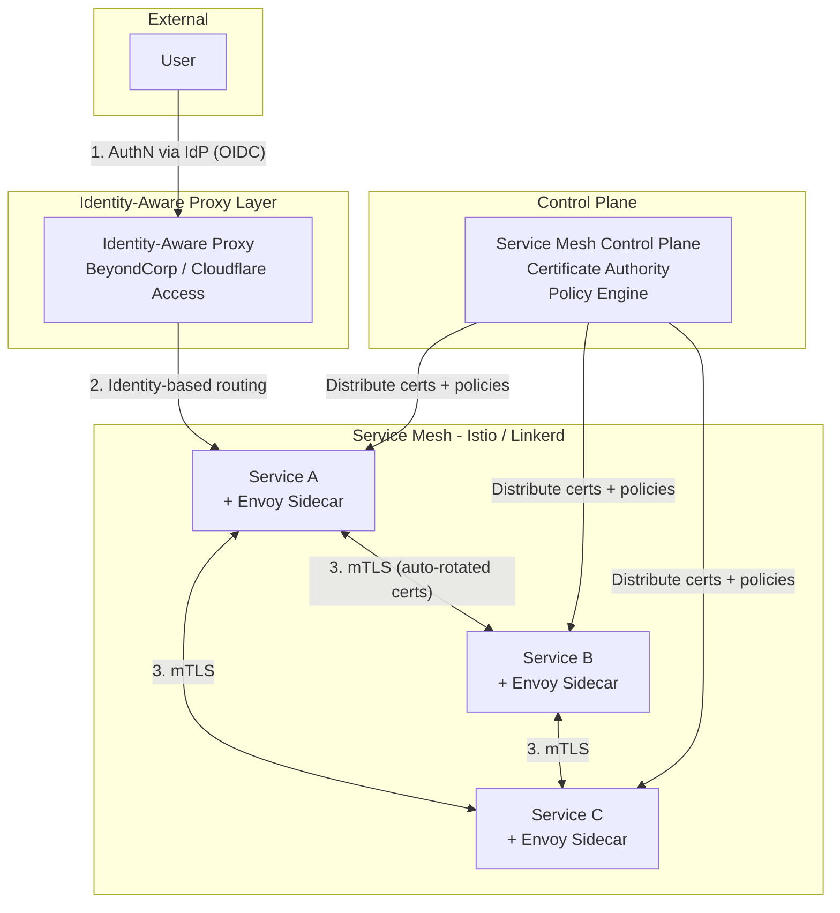

# Authorization Models -- Deep Dive

Authorization answers: "Given that I know WHO you are (authentication), WHAT are you
allowed to do?"

Every system needs an authorization model. The choice depends on the complexity of your
permission requirements and how your organization is structured.

---

## RBAC (Role-Based Access Control)

The most widely used authorization model. Users are assigned roles, and roles have
permissions. Users never get permissions directly -- only through their roles.

### Model

```
Users -----> Roles -----> Permissions
  |            |              |
  Alice   [Admin]     [create_post]
  Bob     [Editor]    [edit_post]
  Carol   [Viewer]    [delete_post]
                      [view_post]
                      [manage_users]
```

### Database Schema

```sql
CREATE TABLE users (
    id          SERIAL PRIMARY KEY,
    email       VARCHAR(255) UNIQUE NOT NULL
);

CREATE TABLE roles (
    id          SERIAL PRIMARY KEY,
    name        VARCHAR(100) UNIQUE NOT NULL  -- 'admin', 'editor', 'viewer'
);

CREATE TABLE permissions (
    id          SERIAL PRIMARY KEY,
    name        VARCHAR(100) UNIQUE NOT NULL  -- 'create_post', 'delete_user'
);

-- Many-to-many: users <-> roles
CREATE TABLE user_roles (
    user_id     INT REFERENCES users(id),
    role_id     INT REFERENCES roles(id),
    PRIMARY KEY (user_id, role_id)
);

-- Many-to-many: roles <-> permissions
CREATE TABLE role_permissions (
    role_id        INT REFERENCES roles(id),
    permission_id  INT REFERENCES permissions(id),
    PRIMARY KEY (role_id, permission_id)
);
```

### Authorization Check

```python
def has_permission(user_id: int, permission: str) -> bool:
    """Check if a user has a specific permission through any of their roles."""
    query = """
        SELECT 1 FROM user_roles ur
        JOIN role_permissions rp ON ur.role_id = rp.role_id
        JOIN permissions p ON rp.permission_id = p.id
        WHERE ur.user_id = %s AND p.name = %s
        LIMIT 1
    """
    result = db.execute(query, (user_id, permission))
    return result is not None


# Usage in an API handler
@app.route('/posts', methods=['POST'])
@login_required
def create_post():
    if not has_permission(current_user.id, 'create_post'):
        return {"error": "Forbidden"}, 403
    # ... create the post
```

### Hierarchical RBAC

Roles can inherit permissions from other roles, forming a hierarchy:

```
         Super Admin
            |
      +-----+-----+
      |           |
    Admin      Auditor
      |
   +--+--+
   |     |
 Editor  Moderator
   |
 Viewer
```

A Super Admin inherits all permissions from Admin AND Auditor. An Admin inherits from
Editor and Moderator. This reduces permission duplication but adds complexity.

### Example: GitHub-Style RBAC

```
Organization
  |-- Owner:   Full control (billing, delete org, manage members)
  |-- Admin:   Manage repos, teams, settings
  |-- Member:  Access repos based on team membership
  |
  Repository
    |-- Admin:      Push, pull, manage settings, add collaborators
    |-- Maintain:   Push, pull, manage issues/PRs
    |-- Write:      Push, pull
    |-- Triage:     Manage issues/PRs (no push)
    |-- Read:       Pull only
```

### Pros and Cons

| Pros | Cons |
|---|---|
| Simple to understand and implement | Role explosion (too many fine-grained roles) |
| Easy to audit ("who has admin?") | Cannot express context-dependent rules |
| Well supported by frameworks and databases | No resource-level permissions (need ACLs) |
| Works for 90% of applications | Static -- cannot handle dynamic attributes |

---

## ABAC (Attribute-Based Access Control)

ABAC evaluates policies based on attributes of the user, the resource, the action, and
the environment. Far more flexible than RBAC, but also more complex.

### Attribute Categories

```
Subject Attributes (who):
  - user.role = "manager"
  - user.department = "engineering"
  - user.clearance_level = 4
  - user.location = "US"

Resource Attributes (what):
  - resource.type = "expense_report"
  - resource.owner = "user:42"
  - resource.classification = "confidential"
  - resource.amount = 8500

Action Attributes (how):
  - action.type = "approve"
  - action.method = "DELETE"

Environment Attributes (when/where):
  - env.time = "2025-03-07T14:30:00Z"
  - env.ip_address = "10.0.1.50"
  - env.is_business_hours = true
  - env.network = "corporate_vpn"
```

### Policy Examples

```
Policy 1: "Managers can approve expense reports under $10,000 during business hours"

  ALLOW IF:
    subject.role == "manager"
    AND action.type == "approve"
    AND resource.type == "expense_report"
    AND resource.amount < 10000
    AND environment.is_business_hours == true

Policy 2: "Users can only edit documents they own"

  ALLOW IF:
    action.type == "edit"
    AND resource.type == "document"
    AND resource.owner == subject.id

Policy 3: "Contractors cannot access confidential data outside the VPN"

  DENY IF:
    subject.employment_type == "contractor"
    AND resource.classification == "confidential"
    AND environment.network != "corporate_vpn"
```

### ABAC Evaluation Flow



**PEP** (Policy Enforcement Point): intercepts the request, asks PDP for a decision
**PDP** (Policy Decision Point): evaluates policies against attributes, returns allow/deny
**PAP** (Policy Administration Point): where policies are authored and stored
**PIP** (Policy Information Point): supplies additional attributes (user store, HR system)

### When to Use ABAC

ABAC is the right choice when:
- Permissions depend on resource properties (owner, classification)
- Permissions depend on context (time, location, network)
- You need fine-grained rules that RBAC cannot express
- Your organization has complex compliance requirements

---

## ACL (Access Control Lists)

ACLs assign permissions directly to individual resources. Each resource has a list
specifying which users or groups can perform which actions.

### Structure

```
Resource: /documents/budget-2025.pdf
  ACL:
    [alice]   -> [read, write, delete]
    [bob]     -> [read]
    [group:finance] -> [read, write]

Resource: /photos/vacation.jpg
  ACL:
    [alice]   -> [read, write, delete]   (owner)
    [public]  -> [read]                  (anyone)

Resource: /etc/shadow (Unix file)
  ACL:
    owner (root): rwx
    group (shadow): r--
    others: ---
```

### File System ACL Example (Linux)

```bash
# View ACL
$ getfacl /data/report.pdf
# file: data/report.pdf
# owner: alice
# group: engineering
user::rw-
user:bob:r--
group::r--
group:finance:rw-
mask::rw-
other::---

# Set ACL
$ setfacl -m u:bob:rw /data/report.pdf     # Give bob read+write
$ setfacl -m g:finance:r /data/report.pdf   # Give finance group read
$ setfacl -x u:bob /data/report.pdf         # Remove bob's ACL entry
```

### Pros and Cons

| Pros | Cons |
|---|---|
| Intuitive: "who can access THIS resource?" | Does not scale (millions of resources = millions of ACLs) |
| Per-resource granularity | Difficult to audit globally ("what can Alice access?") |
| Simple for file systems and shared documents | Managing individual entries is tedious |
| Users understand it (Google Drive sharing) | No support for conditions (time, location) |

---

## Google Zanzibar

Zanzibar is Google's global authorization system, handling permissions for Google Drive,
YouTube, Cloud IAM, Maps, and more. It serves over 10 million authorization checks per
second at sub-10ms latency.

### Core Concept: Relation Tuples

All permissions are stored as relation tuples:

```
<object>#<relation>@<user>

Examples:
  doc:readme#owner@user:alice          -- Alice owns doc:readme
  doc:readme#viewer@user:bob           -- Bob can view doc:readme
  doc:readme#viewer@group:eng#member   -- Members of eng group can view doc:readme
  group:eng#member@user:alice          -- Alice is a member of eng group
  folder:root#parent@doc:readme        -- doc:readme is inside folder:root
```

### Computed Permissions (Userset Rewrite Rules)

Zanzibar can derive permissions from relations via rewrite rules:

```yaml
# Schema definition (similar to SpiceDB syntax)
definition document:
  relation owner: user
  relation editor: user | group#member
  relation viewer: user | group#member

  # Computed permissions -- owner implies editor, editor implies viewer
  permission edit = editor + owner
  permission view = viewer + edit        # viewer OR editor OR owner
  permission delete = owner              # only owner can delete

definition folder:
  relation parent: document
  relation viewer: user | group#member

  permission view = viewer

definition group:
  relation member: user
```

### How Permission Checks Work

```
Question: Can user:bob view doc:readme?

Step 1: Direct check
  Is there a tuple: doc:readme#viewer@user:bob?  YES --> ALLOW

Step 2: If no direct tuple, expand computed relations
  view = viewer + edit
  edit = editor + owner

  Check: doc:readme#editor@user:bob?  NO
  Check: doc:readme#owner@user:bob?   NO

Step 3: Expand group memberships
  Check: doc:readme#viewer@group:eng#member?  YES (tuple exists)
  Check: group:eng#member@user:bob?           YES (tuple exists)
  --> Bob is a member of eng group, which has viewer access --> ALLOW
```

### Zanzibar APIs

| API | Purpose | Example |
|---|---|---|
| **Check** | "Can user X do Y on resource Z?" | Check(doc:readme#view@user:bob) -> true |
| **Expand** | "Who has relation R on resource Z?" | Expand(doc:readme#viewer) -> [alice, bob, group:eng] |
| **Read** | Read relation tuples | Read(doc:readme#*@*) -> all tuples for doc:readme |
| **Write** | Create/delete relation tuples | Write(doc:readme#viewer@user:carol) |
| **Lookup** | "What resources can user X access?" | Lookup(user:bob, view, document) -> [readme, design-doc] |

### Consistency: Zookies

Zanzibar is globally distributed. When you add a permission, it takes time to replicate.
Zookies solve this with consistency tokens:

```
1. Admin adds: doc:readme#viewer@user:carol
   Response includes zookie: "zk_abc123" (a consistency token / timestamp)

2. Carol immediately tries to access the document
   Request includes: Check(doc:readme#view@user:carol, zookie="zk_abc123")

3. Zanzibar ensures the check evaluates against state AT LEAST as fresh as
   the zookie timestamp. If the local replica is behind, it waits or routes
   to a replica that is caught up.

This provides "new enemy" consistency: if you JUST gave someone access,
they can immediately use it. If you JUST revoked access, they are
immediately blocked (from the revoker's perspective).
```

### Open Source Implementations

| Project | Backing | Language | Notes |
|---|---|---|---|
| **SpiceDB** | AuthZed | Go | Most feature-complete, production-ready |
| **OpenFGA** | Auth0/Okta | Go | Backed by Okta, simpler model |
| **Keto** | Ory | Go | Part of Ory ecosystem |
| **Permify** | Permify | Go | Newer, growing adoption |

### SpiceDB Example

```yaml
# Schema
definition user {}

definition group {
  relation member: user
}

definition document {
  relation owner: user
  relation editor: user | group#member
  relation viewer: user | group#member

  permission edit = editor + owner
  permission view = viewer + edit
  permission delete = owner
}
```

```bash
# Write relation tuples
zed relationship create document:readme viewer user:bob
zed relationship create group:eng member user:alice
zed relationship create document:readme viewer group:eng#member

# Check permission
zed permission check document:readme view user:alice
# => true (alice is member of eng, which has viewer on readme)
```

---

## Policy as Code

Instead of hardcoding authorization logic, externalize it into a policy engine. Policies
are written in a declarative language, version-controlled, tested, and deployed independently
from application code.

### OPA (Open Policy Agent)

The most widely adopted policy engine. Policies are written in Rego, a declarative language.

```rego
# policy.rego
package authz

import rego.v1

default allow := false

# Allow if user is admin
allow if {
    input.user.role == "admin"
}

# Allow users to read their own profile
allow if {
    input.action == "read"
    input.resource.type == "profile"
    input.resource.owner == input.user.id
}

# Allow managers to approve expenses under $10k during business hours
allow if {
    input.action == "approve"
    input.resource.type == "expense"
    input.user.role == "manager"
    input.resource.amount < 10000
    is_business_hours
}

is_business_hours if {
    now := time.now_ns()
    hour := time.clock(now)[0]
    hour >= 9
    hour < 17
}
```

```bash
# Query OPA
curl -X POST http://localhost:8181/v1/data/authz/allow \
  -d '{
    "input": {
      "user": {"id": "alice", "role": "manager"},
      "action": "approve",
      "resource": {"type": "expense", "amount": 5000, "owner": "bob"}
    }
  }'
# Response: {"result": true}
```

### Cedar (AWS)

Cedar is Amazon's policy language, used by AWS Verified Permissions and Cedar Agent.
More readable than Rego, with a Rust-based evaluation engine.

```
// Cedar policy: Managers can approve expenses under $10k
permit(
    principal in Role::"manager",
    action == Action::"approve",
    resource is Expense
) when {
    resource.amount < 10000
};

// Cedar policy: Users can view their own documents
permit(
    principal,
    action == Action::"view",
    resource is Document
) when {
    resource.owner == principal
};

// Explicit deny: No one can delete archived documents
forbid(
    principal,
    action == Action::"delete",
    resource is Document
) when {
    resource.status == "archived"
};
```

### OPA vs Cedar

| Feature | OPA (Rego) | Cedar |
|---|---|---|
| Language | Rego (Prolog-like) | Cedar (purpose-built) |
| Readability | Moderate (learning curve) | High (reads like English) |
| Performance | Fast (compiled Wasm) | Very fast (Rust engine) |
| Ecosystem | Large (Kubernetes, Envoy, Terraform) | Growing (AWS-centric) |
| Analysis | Limited | Formal verification (provable correctness) |
| Backed by | CNCF (Styra) | AWS |

---

## RBAC vs ABAC vs ACL Comparison

| Dimension | RBAC | ABAC | ACL |
|---|---|---|---|
| **Granularity** | Role-level | Attribute-level (very fine) | Resource-level |
| **Scalability** | Good (moderate # of roles) | Excellent (policies scale) | Poor (per-resource lists) |
| **Flexibility** | Limited (static roles) | High (dynamic conditions) | Limited (per-resource) |
| **Context-aware** | No | Yes (time, location, etc.) | No |
| **Audit** | Easy ("who is admin?") | Hard (complex policy evaluation) | Hard (scattered across resources) |
| **Implementation** | Simple (DB joins) | Complex (policy engine) | Simple (per-resource lookup) |
| **Best for** | Most web apps, APIs | Complex enterprises, compliance | File systems, shared docs |
| **Examples** | GitHub, AWS IAM (partially) | AWS IAM conditions, HIPAA systems | Unix permissions, Google Drive |

### Decision Guide

```
How complex are your permission requirements?

  Simple (roles map cleanly to permissions):
    --> RBAC
    Examples: admin/editor/viewer, org owner/member

  Medium (need per-resource sharing):
    --> RBAC + ACLs (Google Drive model)
    Examples: document sharing, folder permissions

  Complex (context-dependent, attribute-based rules):
    --> ABAC (with a policy engine like OPA or Cedar)
    Examples: healthcare (HIPAA), finance (time + amount rules)

  Google-scale (billions of resources, millions of users):
    --> Zanzibar-style (SpiceDB, OpenFGA)
    Examples: cloud platforms, collaboration tools
```

---

## Zero Trust Architecture

The traditional security model is "castle and moat" -- everything inside the corporate
network is trusted. Zero Trust rejects this. **Never trust, always verify.**

### Why Zero Trust?

```
Old model (castle and moat):
  Internet ----[ Firewall ]----> Corporate Network (everything trusted)
                                   |
                                   All services talk freely
                                   Attacker who gets in has free reign

Zero Trust:
  Every request is untrusted, regardless of network location.
  A request from inside the corporate network is treated the same
  as a request from the public internet.
```

The reality that makes "castle and moat" obsolete:
- Remote work: employees are outside the corporate network
- Cloud: resources are outside the corporate network
- Lateral movement: once an attacker breaches the perimeter, they move freely inside
- Supply chain attacks: trusted third-party software gets compromised

### The 5 Pillars



### Pillar 1: Identity

- Every access request must be strongly authenticated (MFA)
- Conditional access policies: require step-up auth for sensitive resources
- Just-In-Time (JIT) access: temporary elevated permissions, auto-revoked
- Continuous re-authentication: not just at login, but throughout the session

### Pillar 2: Devices

- Device health posture: is the OS patched? Is disk encrypted? Is antivirus running?
- Device identity: only registered, managed devices can access resources
- MDM (Mobile Device Management): enforce security policies on devices
- Endpoint Detection and Response (EDR): detect threats on the device

### Pillar 3: Network

- **Micro-segmentation**: divide the network into small zones, each with its own access controls
- No lateral movement: even if an attacker compromises one service, they cannot reach others
- Encrypted communications everywhere (mTLS between all services)
- Network does not grant trust: being on the VPN does not mean you are trusted

### Pillar 4: Applications

- Application-level access control (not just network-level)
- Identity-aware proxies: verify identity before allowing access to any application
- Web Application Firewall (WAF): protect against OWASP Top 10
- API security: validate every request, enforce rate limits

### Pillar 5: Data

- Data classification: public, internal, confidential, restricted
- Encryption at rest and in transit
- Data Loss Prevention (DLP): prevent sensitive data from leaving the organization
- Access logging: who accessed what data, when, from where

### Implementation: mTLS + Service Mesh + Identity-Aware Proxy



**How it works:**

1. **Identity-Aware Proxy** (e.g., Google BeyondCorp, Cloudflare Access): authenticates the user
   via OIDC before any request reaches the application. No VPN needed. Access decisions
   based on user identity + device posture + context, not network location.

2. **Service Mesh** (Istio, Linkerd): every service gets a sidecar proxy (Envoy) that
   handles mTLS automatically. Services do not need to implement TLS themselves. The mesh
   manages certificate rotation, authorization policies, and observability.

3. **mTLS** (Mutual TLS): both sides present certificates. Service A proves its identity
   to Service B, AND Service B proves its identity to Service A. Prevents impersonation
   and eavesdropping even within the "trusted" network.

4. **Authorization policies** are enforced at the mesh level:

```yaml
# Istio AuthorizationPolicy: Only frontend can call the order service
apiVersion: security.istio.io/v1
kind: AuthorizationPolicy
metadata:
  name: order-service-policy
spec:
  selector:
    matchLabels:
      app: order-service
  rules:
  - from:
    - source:
        principals: ["cluster.local/ns/default/sa/frontend-service"]
    to:
    - operation:
        methods: ["GET", "POST"]
        paths: ["/api/orders/*"]
```

### Google BeyondCorp: Zero Trust in Practice

Google pioneered Zero Trust with BeyondCorp after the Aurora attack (2009). Key principles:

- Access to services is based on what we know about you and your device, not your network
- All access must be authenticated, authorized, and encrypted
- Access is granted on a per-resource basis (no blanket network access)
- Access policies are dynamic and continuously re-evaluated

```
Traditional VPN access:
  User --> VPN --> Corporate Network --> All internal services (broad access)

BeyondCorp:
  User --> Identity-Aware Proxy --> Specific authorized service (narrow access)
  (No VPN needed. Same experience from office, home, or coffee shop.)
```

---

## Interview Quick Reference

**"How would you design an authorization system?"**

1. Start with RBAC (covers 90% of use cases)
2. Add resource-level permissions if needed (ACLs or Zanzibar-style)
3. Use a policy engine (OPA/Cedar) for complex conditional logic
4. Enforce at the API Gateway level for consistency
5. Log all authorization decisions for audit

**"Explain Zero Trust."**

- Never trust, always verify -- regardless of network location
- Five pillars: Identity, Devices, Network, Applications, Data
- Implementation: mTLS between services, identity-aware proxies for users, micro-segmentation,
  continuous verification, least privilege access

**"RBAC vs ABAC?"**

- RBAC: simple, role-based, covers most apps. Breaks down with context-dependent rules.
- ABAC: flexible, attribute-based, handles complex scenarios. More implementation effort.
- Most real systems use RBAC as the foundation, with ABAC-like rules for specific cases
  (e.g., AWS IAM uses roles + condition keys).
