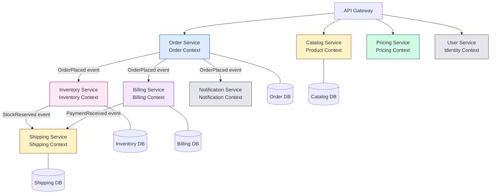
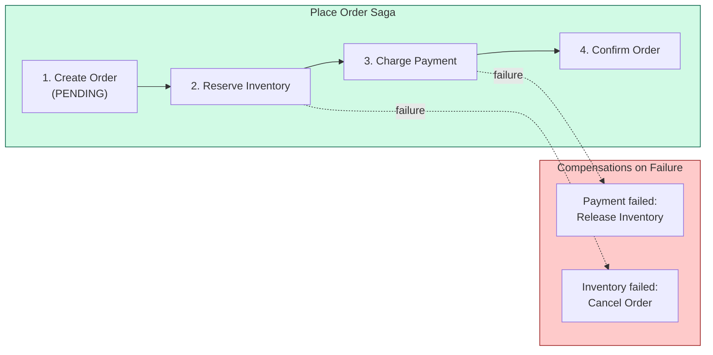
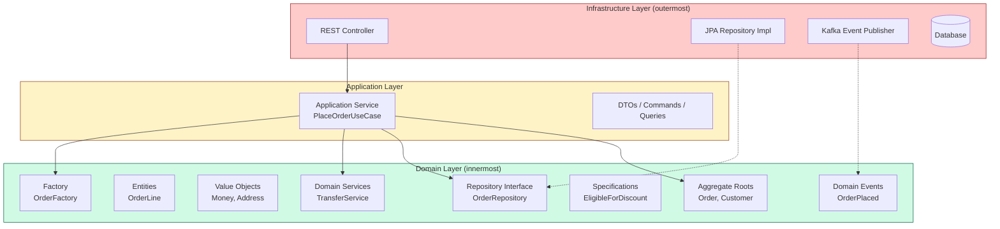
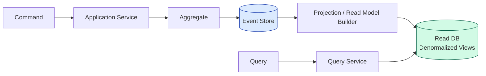

# Domain-Driven Design: In Practice

## Table of Contents
- [DDD + Microservices](#ddd--microservices)
- [DDD + Clean Architecture](#ddd--clean-architecture)
- [DDD + Event Sourcing](#ddd--event-sourcing)
- [Common Mistakes](#common-mistakes)
- [When to Use DDD / When NOT to](#when-to-use-ddd--when-not-to)
- [Real-World DDD at Scale](#real-world-ddd-at-scale)
- [Interview Questions with Answers](#interview-questions-with-answers)

---

## DDD + Microservices

### The Central Principle

> **Bounded Context = Service Boundary.**
>
> A microservice should own exactly one bounded context. It has its own database,
> its own ubiquitous language, and its own deployment lifecycle.

This is the most important practical application of strategic DDD. Without it, teams
end up with distributed monoliths -- services that are deployed independently but cannot
change independently because they share data models.

### E-Commerce: Bounded Contexts Mapped to Services



### Key Integration Patterns

| Pattern | How It Works in Microservices |
|---------|------------------------------|
| **Domain Events** | Async messages via Kafka/RabbitMQ between services |
| **Anti-Corruption Layer** | Adapter in each service that translates external models |
| **Open Host Service** | Public gRPC/REST API with versioned schema |
| **Published Language** | Protobuf/Avro schemas in a shared schema registry |
| **Saga Pattern** | Coordinates multi-service transactions using domain events |

### Database-per-Service Enforces Aggregate Boundaries

```
WRONG (shared database):
  Order Service  ----+
                     +--> [Shared PostgreSQL] <-- breaks context boundaries
  Billing Service ---+

RIGHT (database per service):
  Order Service   --> [Order DB]      -- owns its aggregates
  Billing Service --> [Billing DB]    -- owns its aggregates
  Integration via domain events (OrderPlaced -> CreateInvoice)
```

### Saga: Cross-Service Transaction via Events

When a use case spans multiple bounded contexts (e.g., placing an order involves
inventory, payment, and shipping), use the **Saga pattern** instead of distributed
transactions.



---

## DDD + Clean Architecture

### Where Tactical Patterns Live in the Layers



### Layer Mapping Table

| DDD Pattern | Clean Architecture Layer | Depends On |
|-------------|------------------------|------------|
| Entity, Value Object | Domain | Nothing (pure business logic) |
| Aggregate Root | Domain | Entities, Value Objects |
| Domain Service | Domain | Aggregates, Value Objects |
| Domain Event | Domain | Nothing (immutable data) |
| Specification | Domain | Aggregates |
| Repository (interface) | Domain | Aggregate Root (parameter type) |
| Factory | Domain | Aggregate Root, Value Objects |
| Application Service | Application | Domain layer (interfaces) |
| Repository (implementation) | Infrastructure | Domain interface + ORM/driver |
| Controller | Infrastructure | Application Service |
| Event Publisher | Infrastructure | Domain Events |

### The Dependency Rule

Arrows point **inward**. The domain layer has zero dependencies on infrastructure. This
means you can:
- Unit test domain logic with no database, no HTTP, no message broker.
- Swap PostgreSQL for MongoDB without touching domain code.
- Replace REST with gRPC without touching business rules.

```java
// Domain layer -- zero imports from Spring, JPA, Kafka
package com.example.order.domain;

public class Order {
    // Pure Java. No @Entity, no @Column, no framework annotations.
}

public interface OrderRepository {
    // Pure Java interface. No Spring, no JPA.
    void save(Order order);
    Optional<Order> findById(OrderId id);
}
```

```java
// Infrastructure layer -- implements domain interface with framework tools
package com.example.order.infrastructure.persistence;

import com.example.order.domain.OrderRepository;  // depends on domain
import javax.persistence.*;                         // framework dependency

@Repository
public class JpaOrderRepository implements OrderRepository {
    // JPA, SQL, mapping -- all hidden here
}
```

---

## DDD + Event Sourcing

### The Core Idea

Instead of storing the **current state** of an aggregate, store the **sequence of domain
events** that produced that state. Current state is reconstructed by replaying events.

```
Traditional:  Order table row = { id: 1, status: SHIPPED, total: $150 }

Event Sourced: Event stream for Order #1:
  1. OrderCreated     { customerId: 42, timestamp: ... }
  2. LineAdded        { product: "Widget", qty: 3, price: $50 }
  3. OrderConfirmed   { timestamp: ... }
  4. PaymentReceived  { amount: $150, method: CREDIT_CARD }
  5. OrderShipped     { trackingNumber: "1Z999..." }
```

### How Aggregates Work with Event Sourcing

```java
public class Order extends EventSourcedAggregate {

    private OrderId id;
    private OrderStatus status;
    private Money totalAmount;

    // --- Command handler: validates and emits events ---

    public void confirm() {
        if (status != OrderStatus.DRAFT) {
            throw new DomainException("Cannot confirm non-draft order");
        }
        // Emit event instead of mutating state directly
        emit(new OrderConfirmed(id, Instant.now()));
    }

    // --- Event applier: mutates state from event (no validation) ---

    private void apply(OrderConfirmed event) {
        this.status = OrderStatus.CONFIRMED;
    }

    private void apply(LineAdded event) {
        this.totalAmount = this.totalAmount.add(event.lineTotal());
    }

    // --- Reconstruct from event history ---

    public static Order rehydrate(List<DomainEvent> history) {
        Order order = new Order();
        history.forEach(order::applyEvent);
        return order;
    }
}
```

### CQRS + Event Sourcing + DDD



**Write side**: Commands go to aggregates, which emit events stored in the event store.
**Read side**: Projections consume events and build denormalized read models optimized
for specific queries.

### Benefits of Event Sourcing with DDD

| Benefit | Explanation |
|---------|-------------|
| Complete audit trail | Every state change is recorded as an event |
| Temporal queries | "What was the order state at 3pm yesterday?" -- replay events up to that point |
| Debug production issues | Replay the exact event sequence that caused a bug |
| Enable new read models | Add a new projection that consumes the existing event stream |
| Natural fit with DDD | Domain events are already first-class in your model |

---

## Common Mistakes

### 1. Anemic Domain Model

The **most common anti-pattern** in projects that claim to use DDD. Entities have only
getters and setters -- all behavior lives in service classes.

```java
// ANEMIC -- Entity is a data bag, no behavior
public class Order {
    private OrderId id;
    private OrderStatus status;
    private List<OrderLine> lines;

    // Only getters and setters -- no domain logic
    public OrderStatus getStatus() { return status; }
    public void setStatus(OrderStatus status) { this.status = status; }
    public List<OrderLine> getLines() { return lines; }
}

// All logic in a "service" -- this is procedural, not object-oriented
public class OrderService {
    public void confirmOrder(Order order) {
        if (order.getLines().isEmpty()) {
            throw new RuntimeException("Cannot confirm empty order");
        }
        order.setStatus(OrderStatus.CONFIRMED);  // Bypasses invariant protection
    }
}
```

```java
// RICH DOMAIN MODEL -- behavior lives on the entity
public class Order {
    private OrderId id;
    private OrderStatus status;
    private List<OrderLine> lines;

    public void confirm() {
        if (lines.isEmpty()) {
            throw new DomainException("Cannot confirm empty order");
        }
        this.status = OrderStatus.CONFIRMED;
        registerEvent(new OrderConfirmed(id, Instant.now()));
    }

    // No public setStatus() -- state transitions are controlled
    // No public getLines() returning mutable list -- return unmodifiable view
    public List<OrderLine> getLines() {
        return Collections.unmodifiableList(lines);
    }
}
```

### 2. Too-Large Aggregates

```
WRONG: Order aggregate contains Customer, Product, Warehouse, ShipmentRoute
  - Loading an Order pulls half the database into memory
  - Updating a Customer address locks the Order
  - Two users editing different parts cause contention

RIGHT: Order references CustomerId, ProductId (IDs only)
  - Order aggregate contains only OrderLines, Money, ShippingAddress
  - Small, focused, fast to load
  - Minimal locking contention
```

### 3. Ignoring Ubiquitous Language

```java
// BAD -- tech jargon that means nothing to domain experts
public class DataProcessor {
    public void handlePayload(Map<String, Object> payload) {
        EntityWrapper wrapper = EntityMapper.transform(payload);
        PersistenceManager.persist(wrapper);
    }
}

// GOOD -- code reads like the domain expert speaks
public class OrderFulfillment {
    public void shipOrder(OrderId orderId, ShippingCarrier carrier) {
        Order order = orderRepository.findById(orderId);
        Shipment shipment = order.prepareForShipping(carrier);
        shipmentRepository.save(shipment);
    }
}
```

### 4. Applying DDD to Simple CRUD

If your application is a thin layer over a database with no complex business rules,
DDD adds ceremony without value. A simple Spring Data repository with `@Entity`
annotations is perfectly fine.

```
Signs DDD is overkill:
  - Business rules fit in a few if-statements
  - No domain expert to collaborate with
  - The "domain" is just CRUD on 3-5 tables
  - Single team, single context, no integration complexity
```

### 5. Shared Database Between Bounded Contexts

This silently couples contexts together. When the Order service modifies the schema,
the Billing service breaks. The fix: each bounded context owns its data, and integration
happens through domain events or APIs.

---

## When to Use DDD / When NOT to

### Use DDD When

| Signal | Why DDD Helps |
|--------|---------------|
| Complex business rules | Tactical patterns organize and enforce rules |
| Multiple bounded contexts | Strategic patterns define clean boundaries |
| Domain experts available | Ubiquitous language aligns code with reality |
| Large teams (5+ developers) | Bounded contexts enable team autonomy |
| Long-lived system (years) | Domain model evolves gracefully |
| Business processes span departments | Context maps clarify integration |

### Do NOT Use DDD When

| Signal | Better Alternative |
|--------|-------------------|
| Simple CRUD application | Active Record or plain MVC |
| No domain complexity (just data in/out) | Transaction Script |
| Small team (1-3 developers) | Keep it simple -- refactor toward DDD if complexity grows |
| Purely technical domain (log aggregation, ETL) | Pipeline architecture |
| Proof of concept / prototype | Speed over structure |
| No access to domain experts | You will model the wrong thing |

### The Complexity Curve

```
     ^
     |  DDD pays off here
     |         .-----------
     |        /
Cost |       /   DDD overhead
     |      /    worth it
     |     /
     |    / <-- Break-even point
     |   /
     |  /  Simple approach
     | /   cheaper here
     |/________________>
       Low           High
       Domain Complexity
```

---

## Real-World DDD at Scale

### Uber: Domain-Oriented Microservice Architecture (DOMA)

Uber evolved from a monolith to thousands of microservices, then recognized the need
for structure. Their DOMA approach applies DDD strategic patterns at scale:

- **Domains** = bounded contexts with a clear owner team.
- **Layers**: each domain exposes a **Gateway API** (Open Host Service) and hides
  internal services behind it.
- **Extensions**: domains can be extended by other domains without modifying the core.

```
Before DOMA: 2,200 microservices, spaghetti dependencies
After DOMA:  Services grouped into ~50 domains with gateway APIs
Result:      Reduced cross-team coordination, clearer ownership
```

### Shopify: Modular Monolith with Bounded Contexts

Shopify did not decompose into microservices. Instead, they applied DDD strategic
patterns to their Ruby on Rails monolith:

- Each bounded context is a **Ruby module** with explicit boundaries.
- Contexts communicate through **domain events** (even within the monolith).
- Teams own specific contexts with clear API contracts.
- This approach gives them the **organizational benefits** of DDD without the
  operational complexity of microservices.

### Netflix: Domain-Driven Microservices

Netflix organizes services around business domains:

- **Studio domain**: content production, scheduling, talent management.
- **Streaming domain**: encoding, CDN, playback.
- **Member domain**: profiles, preferences, billing.

Each domain has its own bounded context, ubiquitous language, and data ownership.
Cross-domain integration uses asynchronous events via their internal message bus.

### Key Lesson from All Three

DDD strategic patterns (bounded contexts, context maps, ubiquitous language) are
valuable regardless of whether you deploy as microservices or a monolith. The
architectural style is secondary to getting the boundaries right.

---

## Interview Questions with Answers

### Q1: What is the difference between a Bounded Context and a Microservice?

**Answer:** A bounded context is a **linguistic and modeling boundary** -- a sphere within
which a domain model and its ubiquitous language are consistent. A microservice is a
**deployment unit** -- an independently deployable service. They often align (one bounded
context per microservice), but a bounded context can be implemented as multiple
microservices or as a module within a monolith. The bounded context is about **model
consistency**; the microservice is about **deployment independence**.

### Q2: How do you decide aggregate boundaries?

**Answer:** Follow these guidelines:
1. **Identify invariants** -- what must be consistent in a single transaction? Those things
   belong in one aggregate.
2. **Keep aggregates small** -- include only what is needed for invariant enforcement.
3. **Reference other aggregates by ID** -- never embed another aggregate root.
4. **One aggregate per transaction** -- if a use case spans aggregates, use domain events
   and eventual consistency.
5. **Favor eventual consistency** -- ask domain experts, "Can this be slightly out of date
   for a few seconds?" Often the answer is yes.

### Q3: When would you choose Event Sourcing over a traditional CRUD approach?

**Answer:** Event Sourcing is appropriate when:
- **Audit requirements** demand a complete history (finance, healthcare, compliance).
- **Temporal queries** are needed ("What was the account balance last Tuesday?").
- **Event-driven architecture** is already in place -- event sourcing is a natural fit.
- **Complex state transitions** make it hard to reverse-engineer what happened from
  current state alone.

Avoid Event Sourcing when: the domain is simple CRUD, the team lacks experience with it,
or events are hard to version (frequent schema changes).

### Q4: How does DDD help prevent a distributed monolith?

**Answer:** A distributed monolith occurs when microservices cannot change independently --
usually because they share a database, share data models, or require lock-step deployments.
DDD prevents this by:
1. **Bounded contexts** ensure each service has its own model and language.
2. **Database-per-context** eliminates shared schema coupling.
3. **Anti-Corruption Layers** protect each context from upstream changes.
4. **Domain events** replace synchronous cross-service calls with asynchronous messaging.
5. **Context maps** make integration explicit and intentional, not accidental.

### Q5: What is the Anemic Domain Model and why is it an anti-pattern?

**Answer:** An Anemic Domain Model has entities that are pure data containers (getters and
setters only) with all business logic in service classes. It is an anti-pattern because:
- It **scatters domain logic** across services instead of encapsulating it on the entity.
- It **violates the Tell-Don't-Ask principle** -- services ask for data, make decisions,
  then set data back, instead of telling the entity to perform a behavior.
- It **loses invariant protection** -- any code can call `setStatus()` and put the entity
  in an invalid state.
- The fix: move behavior onto entities. `order.confirm()` instead of
  `orderService.confirmOrder(order)`.

### Q6: Explain the Anti-Corruption Layer with a real-world example.

**Answer:** An ACL is a translation layer that protects your clean domain model from an
external system's messy model. Example: your e-commerce system integrates with a legacy
ERP for inventory. The ERP returns XML with cryptic field names:

```xml
<INV_REC><ITM_CD>SKU-123</ITM_CD><QOH>42</QOH><WH_LOC>A3-R7</WH_LOC></INV_REC>
```

The ACL translates this into your domain model:

```java
public class ErpInventoryAdapter implements InventoryPort {
    public StockLevel getStockLevel(ProductId productId) {
        ErpResponse raw = erpClient.queryInventory(productId.sku());
        return new StockLevel(
            productId,
            raw.getQuantityOnHand(),                                 // QOH -> quantityOnHand
            WarehouseLocation.parse(raw.getWarehouseLocation())      // WH_LOC -> WarehouseLocation VO
        );
    }
}
```

If the ERP changes its XML schema, only the ACL adapter changes. Your domain model is
untouched.

### Q7: How do you handle a use case that spans multiple aggregates?

**Answer:** Three approaches, from most preferred to least:
1. **Domain events + eventual consistency** (preferred): the first aggregate emits an event,
   a handler updates the second aggregate in a separate transaction.
2. **Domain service**: if both aggregates must be in the same transaction (same bounded
   context), a domain service coordinates them.
3. **Saga pattern**: if aggregates are in different bounded contexts (services), orchestrate
   with a saga using compensating transactions on failure.

Never load two aggregate roots and modify them in the same transaction across bounded
contexts.

### Q8: You are designing an e-commerce platform. Walk through how you would apply DDD.

**Answer (structured approach):**

**Step 1 -- Identify subdomains:**
- Core: Product recommendation engine, dynamic pricing
- Supporting: Inventory management, order fulfillment, customer reviews
- Generic: Auth (Auth0), payments (Stripe), email (SendGrid)

**Step 2 -- Define bounded contexts via Event Storming:**
- ProductCatalog context: ProductAdded, ProductUpdated, CategoryCreated
- Pricing context: PriceCalculated, DiscountApplied, PromotionActivated
- Order context: OrderPlaced, OrderConfirmed, OrderCancelled
- Inventory context: StockReserved, StockReplenished, StockDepleted
- Shipping context: ShipmentCreated, ShipmentDispatched, ShipmentDelivered

**Step 3 -- Map context relationships:**
- Pricing -> Order: Shared Kernel (Money value object)
- Order -> Inventory: Customer-Supplier (OrderPlaced triggers stock reservation)
- Order -> Shipping: Customer-Supplier (OrderConfirmed triggers shipment creation)
- Shipping -> Payments: ACL (protect from Stripe's model changes)
- All -> Auth: Conformist (use Auth0's token format as-is)

**Step 4 -- Define aggregates inside each context:**
- Order context: `Order` (root) with `OrderLine` (child entity), `Money` (VO)
- Inventory context: `StockItem` (root) with `Reservation` (child entity)
- Shipping context: `Shipment` (root) with `TrackingEvent` (child entity)

**Step 5 -- Align services to teams:**
- Order Team owns Order context and Pricing context (closely related)
- Fulfillment Team owns Inventory and Shipping contexts
- Platform Team owns generic domains (Auth, Payments, Email)

### Q9: What is the difference between a Domain Service and an Application Service?

**Answer:**

| Aspect | Domain Service | Application Service |
|--------|---------------|-------------------|
| Contains business logic? | Yes | No -- only orchestration |
| Named in ubiquitous language? | Yes ("transfer funds") | No ("handle transfer request") |
| Depends on infrastructure? | No | Yes (repos, event bus, transactions) |
| Stateless? | Yes | Yes |
| Example | `TransferService.transfer(from, to, amount)` | `TransferUseCase.execute(command)` |

The application service calls the domain service, wraps it in a transaction, loads
aggregates from repositories, and publishes resulting events.

### Q10: How would you migrate a monolith to DDD-based microservices?

**Answer (phased approach):**

1. **Phase 1 -- Identify bounded contexts** in the existing monolith using Event Storming.
   Draw lines around code that shares ubiquitous language.

2. **Phase 2 -- Modular monolith** (Strangler Fig). Enforce module boundaries within the
   monolith: separate packages, no cross-module database queries, communication through
   in-process domain events.

3. **Phase 3 -- Extract one context** at a time. Start with the one that has the clearest
   boundary and the most independent data. Build an ACL between the extracted service and
   the monolith.

4. **Phase 4 -- Repeat**. Extract the next context. Replace in-process events with async
   messages (Kafka). Each extraction should be independently deployable.

5. **Phase 5 -- Decommission the monolith** once all contexts are extracted.

Key: never do a big-bang rewrite. Extract incrementally, validate at each step.
