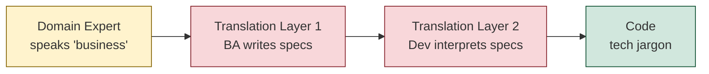
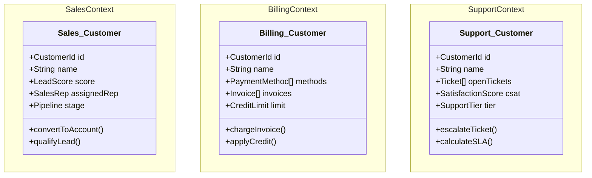
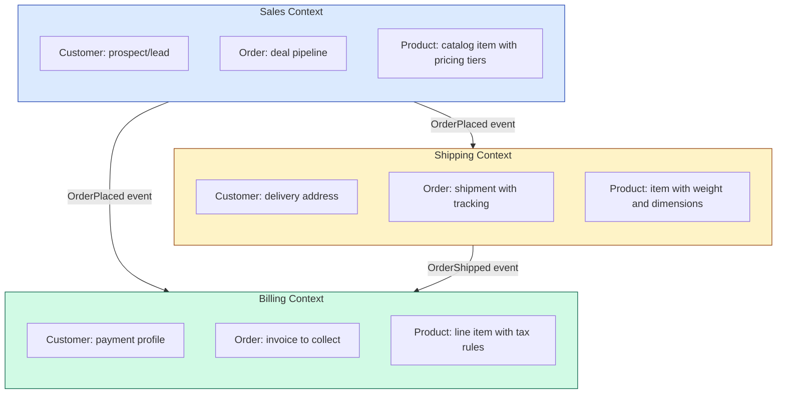
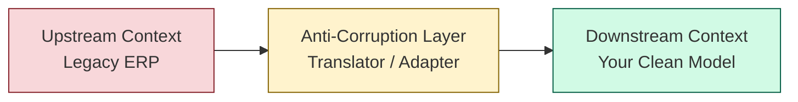
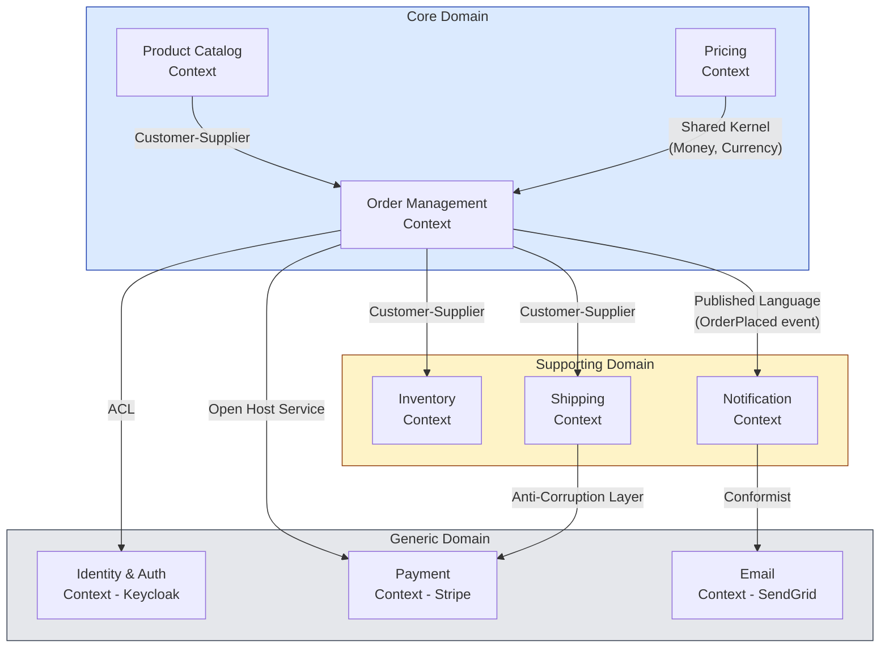
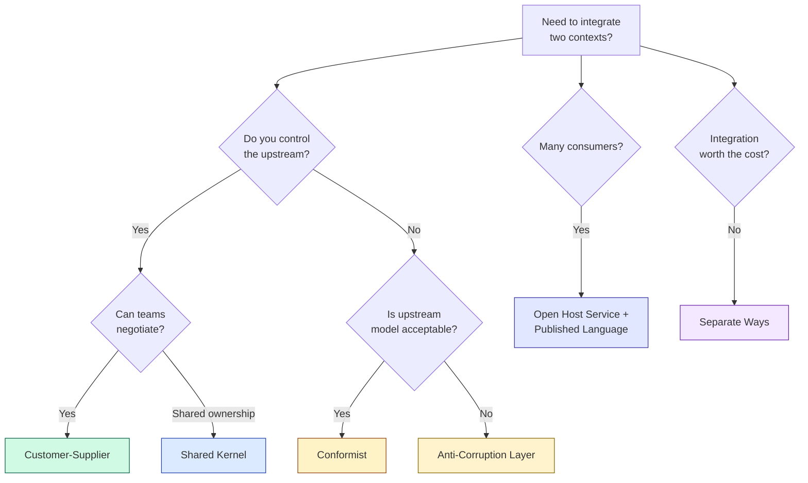
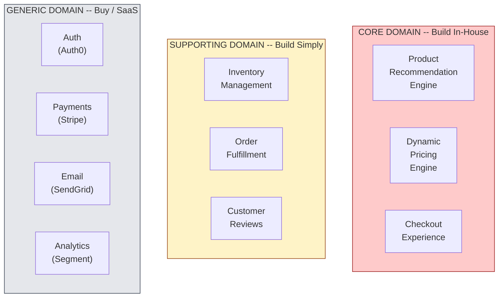

# Domain-Driven Design: Strategic Patterns

## Table of Contents
- [What is DDD](#what-is-ddd)
- [Ubiquitous Language](#ubiquitous-language)
- [Bounded Context](#bounded-context)
- [Context Map](#context-map)
- [Subdomain Types](#subdomain-types)
- [Event Storming](#event-storming)
- [Strategic Design Decision Framework](#strategic-design-decision-framework)

---

## What is DDD

Domain-Driven Design is an **approach to software development** that centers the design and
architecture of a system around its **business domain** -- the real-world problem space the
software exists to solve. Introduced by Eric Evans in his 2003 book, DDD argues that the
primary complexity in most enterprise software is not technical but **domain complexity**:
the intricate rules, processes, and language of the business itself.

### Core Premise

> "The heart of software is its ability to solve domain-related problems for its user."
> -- Eric Evans

DDD provides two complementary toolkits:

| Level | Focus | Artifacts |
|-------|-------|-----------|
| **Strategic Design** | System-wide decomposition, team boundaries, context relationships | Bounded Contexts, Context Maps, Subdomains |
| **Tactical Design** | Implementation patterns inside a single bounded context | Entities, Value Objects, Aggregates, Repositories |

### Why DDD Matters in System Design Interviews

1. It gives you a **principled way to decompose** a monolith into microservices.
2. It surfaces **integration complexity** early -- before writing code.
3. It forces alignment between **code structure and business reality**, making systems
   easier to reason about and evolve.

---

## Ubiquitous Language

### Definition

Ubiquitous Language is a **shared, rigorous vocabulary** that is jointly developed by
developers and domain experts and used consistently in:
- Conversations and meetings
- Code (class names, method names, module names)
- Documentation, tests, and API contracts

### Why It Matters

Without ubiquitous language, translation errors creep in at every handoff:

```
Domain Expert says:  "When a claim is adjudicated..."
Developer hears:     "When a request is processed..."
Code says:           processRequest(Request req)
```

Three different terms for the same concept. Six months later, nobody knows which code
handles claim adjudication.

### The Translation Tax



Every translation layer introduces **information loss and distortion**. Ubiquitous
Language eliminates the intermediate layers.

### The "Order" Problem -- Same Word, Different Meanings

| Context | What "Order" Means | Key Attributes |
|---------|-------------------|----------------|
| **Sales** | A deal a sales rep is pursuing | lead source, discount approval, commission |
| **Fulfillment** | A package to pick, pack, and ship | warehouse location, shipping method, weight |
| **Billing** | An invoice to collect payment for | payment method, tax calculation, due date |
| **Returns** | An item being sent back | return reason, refund amount, restocking fee |

This is not a naming bug -- it reflects genuinely different **mental models** in each
part of the business. DDD embraces this by giving each context its own model.

### How to Build Ubiquitous Language

1. **Event Storming workshops** (covered below) to discover domain events and commands.
2. **Glossary wall**: a physical or digital board where every term is defined explicitly.
3. **Code reviews against language**: reject PRs where code names diverge from the glossary.
4. **Refactor toward language**: when the business refines a term, rename in code immediately.

---

## Bounded Context

### Definition

A Bounded Context is an **explicit boundary** within which a particular domain model
is defined and applicable. Inside the boundary, every term has one precise meaning.
Outside the boundary, the same term may mean something entirely different.

### The Key Insight

> A Bounded Context is NOT a module, NOT a microservice, NOT a database schema. It is a
> **linguistic boundary**. However, it very often aligns with service and team boundaries
> because different teams speak different dialects of the business language.

### Customer in Three Bounded Contexts



Notice: all three have `CustomerId` and `name` but **completely different behavior and
attributes**. Forcing these into a single `Customer` class creates a God Object that
couples Sales, Billing, and Support together.

### Bounded Context Boundaries in Practice



### Rules for Drawing Boundaries

| Signal | Implication |
|--------|-------------|
| Different teams own different parts | Likely different bounded contexts |
| Same term, different meaning | Definitely different bounded contexts |
| Same term, same meaning, shared lifecycle | Probably same bounded context |
| High coupling between two areas | Consider merging or introducing a shared kernel |
| Data that changes at different rates | Separate contexts with eventual consistency |

---

## Context Map

### Definition

A Context Map documents how bounded contexts **relate to and integrate with** each other.
It is the strategic-level architecture diagram of a DDD system.

### Relationship Patterns

#### 1. Shared Kernel

Two contexts share a **small, explicitly defined** subset of the domain model. Both teams
must agree on changes to the shared code.

```
Use when: two closely aligned teams need a common core (e.g., Money value object).
Risk:     tight coupling -- changes require coordination.
```

#### 2. Customer-Supplier (Upstream-Downstream)

The upstream context **produces** data or events; the downstream context **consumes** them.
The upstream team can prioritize downstream needs in their backlog.

```
Use when: one team provides data another depends on, and they can negotiate the interface.
Example:  Order context (upstream) feeds Shipping context (downstream).
```

#### 3. Conformist

The downstream context **conforms entirely** to the upstream's model. No negotiation --
you take what you get.

```
Use when: you integrate with a system you cannot influence (e.g., a large ERP).
Risk:     upstream changes break your model.
```

#### 4. Anti-Corruption Layer (ACL)

The downstream context builds a **translation layer** that converts the upstream's model
into its own domain model. This protects the downstream from upstream changes.

```
Use when: integrating with legacy systems, third-party APIs, or contexts with
          a different modeling philosophy.
Example:  Your clean Order model vs a legacy ERP's XML message format.
```



#### 5. Open Host Service + Published Language

A context exposes a **well-defined API** (Open Host Service) using a **shared schema**
(Published Language -- e.g., JSON Schema, protobuf, OpenAPI).

```
Use when: many consumers need to integrate, so you publish a stable, versioned API.
Example:  Payment Gateway exposing REST + OpenAPI spec consumed by 10 contexts.
```

#### 6. Separate Ways

Two contexts have **no integration** at all. They solve their own problems independently.

```
Use when: the cost of integration exceeds the benefit.
Example:  HR system and IoT sensor system in the same company.
```

### Context Map for an E-Commerce System



### Choosing the Right Relationship Pattern



---

## Subdomain Types

Every business can be decomposed into subdomains -- areas of business capability. DDD
classifies them into three types that determine **investment strategy**.

### Core Domain

The part of the business that provides **competitive advantage**. This is what makes the
company unique and is the primary reason customers choose it.

```
Strategy:    Build in-house with your best engineers.
Investment:  Highest -- this is where DDD tactical patterns pay off most.
Examples:
  - Uber: ride matching and surge pricing algorithms
  - Netflix: recommendation engine and content delivery
  - Shopify: merchant storefront and checkout experience
```

### Supporting Domain

Necessary for the business to function but **not a differentiator**. No competitor wins
or loses because of how well they handle this area.

```
Strategy:    Build simply, possibly outsource, avoid over-engineering.
Investment:  Moderate -- keep it working, but don't gold-plate.
Examples:
  - Uber: driver onboarding and background checks
  - Netflix: internal content metadata management
  - Shopify: merchant support ticket system
```

### Generic Domain

Problems that have been **solved many times** across industries. There is no business
value in building these from scratch.

```
Strategy:    Buy SaaS, use open-source, or adopt a standard solution.
Investment:  Minimal -- integrate, don't build.
Examples:
  - Authentication: Auth0, Keycloak, AWS Cognito
  - Payments: Stripe, Adyen, Braintree
  - Email: SendGrid, SES, Mailgun
  - Monitoring: Datadog, New Relic, Prometheus
```

### Classification Matrix

| Criterion | Core | Supporting | Generic |
|-----------|------|-----------|---------|
| Competitive advantage? | Yes | No | No |
| Business-specific? | Highly | Somewhat | No |
| Build vs Buy? | Build | Build simply / outsource | Buy / SaaS |
| Best engineers? | Yes | Average | N/A |
| DDD tactical patterns? | Absolutely | Maybe | No |
| Change frequency | High | Low-Medium | Very Low |

### Subdomain Map -- E-Commerce Example



---

## Event Storming

### Definition

Event Storming is a **collaborative workshop technique** invented by Alberto Brandolini
that brings developers and domain experts together to discover and model a business domain
by exploring **domain events** -- things that happen in the business.

### Why Event Storming

| Traditional Approach | Event Storming |
|---------------------|----------------|
| Analysts write specs alone | Everyone in the room together |
| Focus on data/entities first | Focus on behavior/events first |
| Weeks of document review | Hours of sticky notes |
| Developers see specs after the fact | Developers discover domain with experts |

### The Color Coding System

| Color | Element | Description | Example |
|-------|---------|-------------|---------|
| **Orange** | Domain Event | Something that happened (past tense) | OrderPlaced |
| **Blue** | Command | An action that triggers events | PlaceOrder |
| **Yellow** | Aggregate | The entity that processes the command | Order |
| **Pink/Red** | External System | System outside our domain | PaymentGateway |
| **Lilac/Purple** | Policy / Process | Automated reaction to an event | "When OrderPlaced, then ReserveInventory" |
| **Green** | Read Model | Data needed to make a decision | ProductAvailabilityView |
| **White** | Hot Spot | Unresolved question or conflict | "What happens on partial payment?" |

### Event Storming Flow

```mermaid
flowchart LR
    subgraph Step1["Step 1: Chaotic Exploration"]
        E1["OrderPlaced"]
        E2["PaymentReceived"]
        E3["ItemShipped"]
        E4["RefundRequested"]
    end

    subgraph Step2["Step 2: Timeline"]
        direction LR
        T1["OrderPlaced"] --> T2["PaymentReceived"]
        T2 --> T3["InventoryReserved"]
        T3 --> T4["ItemShipped"]
    end

    subgraph Step3["Step 3: Commands + Aggregates"]
        direction LR
        CMD1["PlaceOrder<br/>(Blue)"] --> AGG1["Order<br/>(Yellow)"]
        AGG1 --> EVT1["OrderPlaced<br/>(Orange)"]
    end

    subgraph Step4["Step 4: Bounded Contexts"]
        direction TB
        BC1["Order Context"]
        BC2["Inventory Context"]
        BC3["Shipping Context"]
    end

    Step1 --> Step2 --> Step3 --> Step4

    style Step1 fill:#fed7aa,stroke:#c2410c
    style Step2 fill:#fef3c7,stroke:#92400e
    style Step3 fill:#dbeafe,stroke:#1e40af
    style Step4 fill:#d1fae5,stroke:#065f46
```



### Detailed Example: Order Checkout Flow

```mermaid
flowchart LR
    CMD1["PlaceOrder<br/>COMMAND"] --> AGG1["Order<br/>AGGREGATE"]
    AGG1 --> EVT1["OrderPlaced<br/>EVENT"]

    EVT1 --> POL1["Reserve<br/>Inventory<br/>POLICY"]
    POL1 --> CMD2["ReserveStock<br/>COMMAND"]
    CMD2 --> AGG2["Inventory<br/>AGGREGATE"]
    AGG2 --> EVT2["StockReserved<br/>EVENT"]

    EVT1 --> POL2["Charge<br/>Payment<br/>POLICY"]
    POL2 --> CMD3["ChargeCard<br/>COMMAND"]
    CMD3 --> EXT1["Payment<br/>Gateway<br/>EXTERNAL"]
    EXT1 --> EVT3["PaymentReceived<br/>EVENT"]

    EVT2 --> POL3["Ship When<br/>Paid + Reserved<br/>POLICY"]
    EVT3 --> POL3
    POL3 --> CMD4["ShipOrder<br/>COMMAND"]
    CMD4 --> AGG3["Shipment<br/>AGGREGATE"]
    AGG3 --> EVT4["OrderShipped<br/>EVENT"]

    style CMD1 fill:#93c5fd,stroke:#1e40af
    style CMD2 fill:#93c5fd,stroke:#1e40af
    style CMD3 fill:#93c5fd,stroke:#1e40af
    style CMD4 fill:#93c5fd,stroke:#1e40af
    style AGG1 fill:#fde68a,stroke:#92400e
    style AGG2 fill:#fde68a,stroke:#92400e
    style AGG3 fill:#fde68a,stroke:#92400e
    style EVT1 fill:#fdba74,stroke:#c2410c
    style EVT2 fill:#fdba74,stroke:#c2410c
    style EVT3 fill:#fdba74,stroke:#c2410c
    style EVT4 fill:#fdba74,stroke:#c2410c
    style EXT1 fill:#fda4af,stroke:#9f1239
    style POL1 fill:#d8b4fe,stroke:#6b21a8
    style POL2 fill:#d8b4fe,stroke:#6b21a8
    style POL3 fill:#d8b4fe,stroke:#6b21a8
```



### Running an Event Storming Workshop -- Practical Checklist

**Before:**
1. Book a large room with a long wall (or use Miro/FigJam for remote).
2. Invite: domain experts, developers, product managers, QA.
3. Buy sticky notes in all six colors.
4. Time-box to 2-4 hours maximum.

**During:**
1. **Big Picture** (30 min): everyone writes orange domain events. Stick them on the wall in
   rough chronological order. No discussion yet -- just discovery.
2. **Enforce Timeline** (20 min): sort events left-to-right. Find duplicates and gaps.
3. **Add Commands** (20 min): for each event, add the blue command that triggers it.
4. **Add Aggregates** (15 min): group commands/events under yellow aggregates.
5. **Add Policies** (15 min): identify automated reactions with lilac sticky notes.
6. **Mark Hot Spots** (10 min): flag unresolved questions with white sticky notes.
7. **Draw Context Boundaries** (20 min): draw lines around clusters of aggregates that
   share language and meaning. These are your bounded contexts.

**After:**
1. Photograph the wall. Digitize into a Context Map.
2. Write up the glossary of discovered ubiquitous language per context.
3. Prioritize hot spots for follow-up design sessions.

---

## Strategic Design Decision Framework

### Step-by-Step Approach for Interviews

When asked to design a system in an interview, use this DDD-informed framework:

```
1. Identify the subdomains:
   - What is the core domain? (Where does the business compete?)
   - What are the supporting domains?
   - What is generic? (Auth, payments, email, monitoring)

2. Define bounded contexts:
   - Do an informal event storming: list major domain events
   - Group events by language/meaning
   - Draw boundaries around coherent groups

3. Map context relationships:
   - Which context produces events? Which consumes?
   - Where do you need ACLs? (Legacy, third-party)
   - Where can you use Open Host Service? (Internal platform APIs)

4. Choose communication style:
   - Synchronous (API calls) for queries needing immediate answers
   - Asynchronous (events) for commands that can be eventually consistent

5. Align to teams:
   - One team per bounded context (inverse Conway maneuver)
   - Core domain gets the strongest team
```

### Anti-Patterns to Avoid

| Anti-Pattern | Problem | Fix |
|-------------|---------|-----|
| **God Context** | One context that owns everything | Split by subdomain |
| **Shared Database** | Multiple contexts reading/writing same tables | Database-per-context |
| **Language Leak** | Using Sales terms in Shipping code | Enforce ubiquitous language per context |
| **Over-Splitting** | 50 microservices for a startup | Start with fewer, split when language diverges |
| **Ignoring Core Domain** | Spending equal effort on generic subdomains | Invest engineering capital proportionally |

---

## Key Takeaways

1. **Strategic DDD is more important than tactical DDD.** Getting boundaries right matters
   more than getting aggregates right. Wrong boundaries create distributed monoliths.

2. **Ubiquitous Language is the foundation.** If your code says `processRequest` but the
   business says "adjudicate claim," you have already lost.

3. **Bounded Contexts are not microservices.** A bounded context may be implemented as one
   microservice, several microservices, or a module within a monolith.

4. **Context Maps reveal integration complexity.** Draw them before writing code. An ACL
   between your system and a legacy ERP is worth more than a month of debugging.

5. **Classify subdomains before investing.** Do not gold-plate inventory management if
   your competitive advantage is recommendation algorithms.
