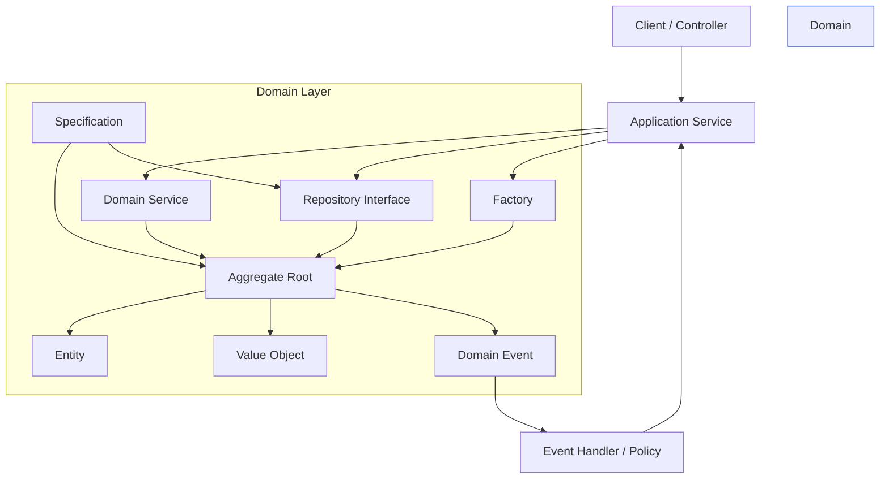
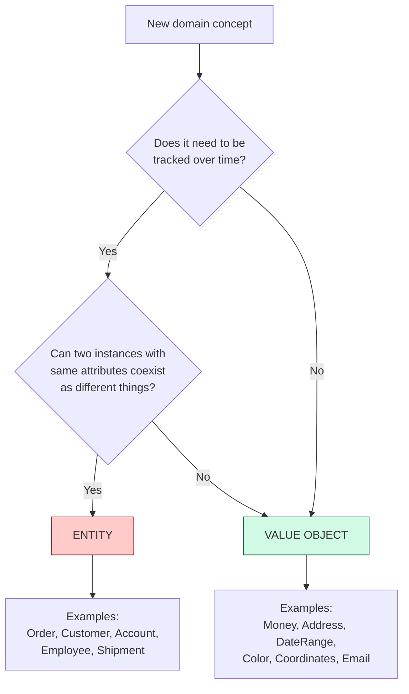
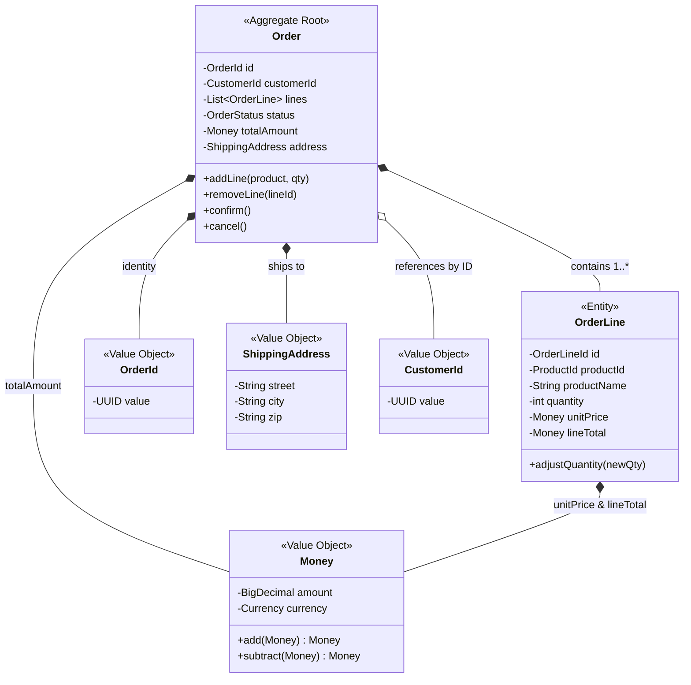
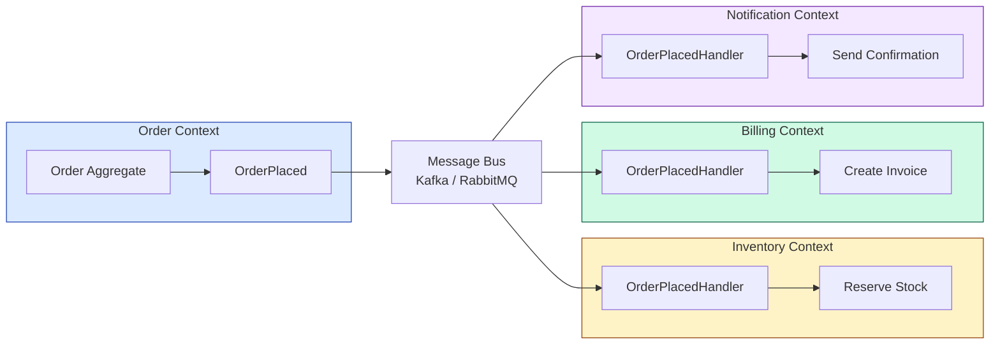
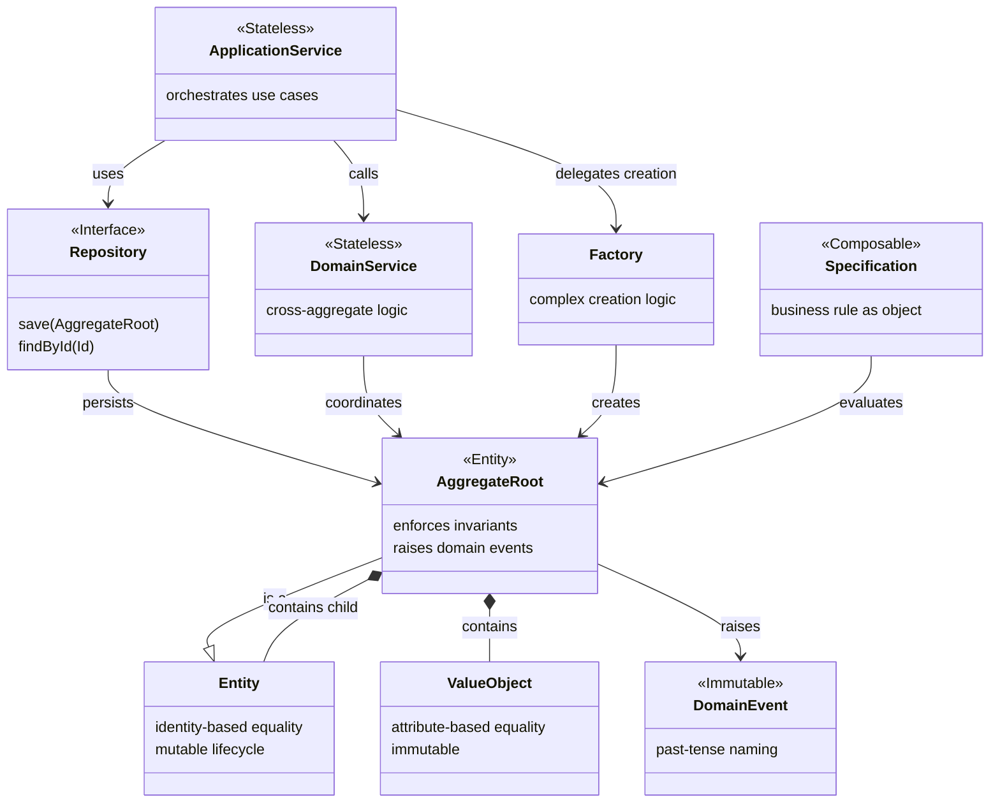

# Domain-Driven Design: Tactical Patterns

## Table of Contents
- [Overview: How Tactical Patterns Fit Together](#overview-how-tactical-patterns-fit-together)
- [Entity](#1-entity)
- [Value Object](#2-value-object)
- [Aggregate](#3-aggregate)
- [Repository](#4-repository)
- [Domain Service](#5-domain-service)
- [Application Service](#6-application-service)
- [Factory](#7-factory)
- [Domain Event](#8-domain-event)
- [Specification](#9-specification)
- [Pattern Relationship Map](#pattern-relationship-map)

---

## Overview: How Tactical Patterns Fit Together

Tactical patterns are the **building blocks inside a single bounded context**. They enforce
business invariants, express domain logic in code, and keep the domain model clean.



---

## 1. Entity

### What

An Entity is a domain object defined by its **identity**, not its attributes. Two entities
are equal if and only if they have the same ID, regardless of whether their other fields
differ.

### When to Use

- The object has a **lifecycle** (it is created, changes over time, may be archived/deleted).
- The object must be **tracked across time** -- even if every attribute changes, it is still
  "the same thing."
- The object has **business behavior** (methods that enforce invariants).

### Key Properties

| Property | Entity | vs Value Object |
|----------|--------|-----------------|
| Identity | Has a unique ID | No identity |
| Equality | By ID | By all attributes |
| Mutability | Mutable (state changes over lifecycle) | Immutable |
| Persistence | Own row in DB, own lifecycle | Embedded or serialized |

### Example: Order Entity

An `Order` with `orderId = "ORD-123"` is the same order whether it is in state PENDING,
CONFIRMED, or SHIPPED. The identity persists across state transitions.

```java
public class Order {

    private final OrderId id;          // Identity -- never changes
    private CustomerId customerId;     // Reference to another aggregate by ID
    private List<OrderLine> lines;     // Child entities within this aggregate
    private OrderStatus status;        // Mutable state
    private Money totalAmount;         // Value object

    public Order(OrderId id, CustomerId customerId) {
        this.id = Objects.requireNonNull(id);
        this.customerId = Objects.requireNonNull(customerId);
        this.lines = new ArrayList<>();
        this.status = OrderStatus.DRAFT;
        this.totalAmount = Money.ZERO_USD;
    }

    // --- Business behavior lives ON the entity ---

    public void addLine(Product product, int quantity) {
        if (status != OrderStatus.DRAFT) {
            throw new IllegalStateException("Cannot modify a non-draft order");
        }
        OrderLine line = new OrderLine(OrderLineId.generate(), product, quantity);
        this.lines.add(line);
        recalculateTotal();
    }

    public void confirm() {
        if (lines.isEmpty()) {
            throw new DomainException("Cannot confirm an empty order");
        }
        this.status = OrderStatus.CONFIRMED;
        // Register a domain event
        registerEvent(new OrderConfirmed(this.id, Instant.now()));
    }

    // --- Identity-based equality ---

    @Override
    public boolean equals(Object o) {
        if (this == o) return true;
        if (!(o instanceof Order other)) return false;
        return id.equals(other.id);   // ONLY compare by ID
    }

    @Override
    public int hashCode() {
        return id.hashCode();          // ONLY hash by ID
    }

    private void recalculateTotal() {
        this.totalAmount = lines.stream()
            .map(OrderLine::lineTotal)
            .reduce(Money.ZERO_USD, Money::add);
    }
}
```

### Critical Rule: Equals/HashCode by ID Only

```java
// WRONG -- compares all fields like a Value Object
@Override
public boolean equals(Object o) {
    return Objects.equals(id, other.id)
        && Objects.equals(status, other.status)
        && Objects.equals(lines, other.lines);
}

// RIGHT -- Entity equality is identity-based
@Override
public boolean equals(Object o) {
    if (!(o instanceof Order other)) return false;
    return id.equals(other.id);
}
```

---

## 2. Value Object

### What

A Value Object is defined by its **attributes**, not an identity. Two value objects with
the same attributes are interchangeable. They are **immutable** -- once created, they never
change.

### When to Use

- The object describes a **characteristic or measurement**: money, weight, address, date range.
- You only care about **what** the object is, not **which** specific instance it is.
- The object has no lifecycle -- `Money(100, USD)` is `Money(100, USD)` forever.

### Why Immutability Matters

| Benefit | Explanation |
|---------|-------------|
| **Thread safety** | No synchronization needed -- the object can never be in an inconsistent state |
| **No side effects** | Passing a value object to a method cannot corrupt the caller's state |
| **Shareability** | Multiple entities can reference the same value object instance safely |
| **Hashability** | Safe to use as Map keys and Set members since hash never changes |
| **Simplicity** | No defensive copying needed |

### Example: Money Value Object

```java
// Java 17+ record -- immutable by default, equals/hashCode by all fields
public record Money(BigDecimal amount, Currency currency) {

    public static final Money ZERO_USD = new Money(BigDecimal.ZERO, Currency.USD);

    // --- Compact constructor for validation ---
    public Money {
        Objects.requireNonNull(amount, "amount must not be null");
        Objects.requireNonNull(currency, "currency must not be null");
        if (amount.scale() > 2) {
            throw new IllegalArgumentException("Money cannot have more than 2 decimal places");
        }
    }

    // --- Operations return NEW instances (immutability) ---

    public Money add(Money other) {
        assertSameCurrency(other);
        return new Money(this.amount.add(other.amount), this.currency);
    }

    public Money subtract(Money other) {
        assertSameCurrency(other);
        return new Money(this.amount.subtract(other.amount), this.currency);
    }

    public Money multiply(int factor) {
        return new Money(this.amount.multiply(BigDecimal.valueOf(factor)), this.currency);
    }

    public boolean isGreaterThan(Money other) {
        assertSameCurrency(other);
        return this.amount.compareTo(other.amount) > 0;
    }

    private void assertSameCurrency(Money other) {
        if (!this.currency.equals(other.currency)) {
            throw new DomainException(
                "Cannot operate on different currencies: " + currency + " vs " + other.currency
            );
        }
    }

    // equals() and hashCode() auto-generated by record -- compares ALL fields
}
```

### Example: Address Value Object

```java
public record Address(
    String street,
    String city,
    String state,
    String zipCode,
    String country
) {
    public Address {
        if (zipCode == null || !zipCode.matches("\\d{5}(-\\d{4})?")) {
            throw new IllegalArgumentException("Invalid US zip code: " + zipCode);
        }
    }

    // Value objects can contain domain logic
    public boolean isSameRegion(Address other) {
        return this.state.equals(other.state) && this.country.equals(other.country);
    }
}
```

### Entity vs Value Object Decision Guide



---

## 3. Aggregate

### What

An Aggregate is a **cluster of Entities and Value Objects** treated as a single unit for
data changes. It defines a **consistency boundary** -- all invariants within the aggregate
are enforced in a single transaction.

The **Aggregate Root** is the single Entity through which all external access to the
aggregate must pass.

### The Three Rules of Aggregates

| Rule | Why |
|------|-----|
| **1. Modify only through the Aggregate Root** | The root enforces all invariants. Bypassing it allows invalid state. |
| **2. One transaction per aggregate** | If you need to update two aggregates atomically, reconsider your boundaries. Use eventual consistency with domain events instead. |
| **3. Reference other aggregates by ID only** | Prevents loading entire object graphs. Enables separate scaling and deployment. |

### Example: Order Aggregate



Note: `CustomerId` is a **reference by ID** (open diamond), not a contained entity.
The `Customer` aggregate lives elsewhere.

### Aggregate Code Example

```java
public class Order {   // <-- Aggregate Root

    private final OrderId id;
    private CustomerId customerId;            // Reference by ID to another aggregate
    private final List<OrderLine> lines;      // Contained entities
    private OrderStatus status;
    private Money totalAmount;
    private ShippingAddress address;           // Contained value object
    private final List<DomainEvent> events;   // Pending domain events

    // --- All mutations go through the root ---

    public void addLine(ProductId productId, String name, Money unitPrice, int quantity) {
        guardDraftStatus();
        guardMaxLines(20);

        OrderLine line = new OrderLine(
            OrderLineId.generate(), productId, name, unitPrice, quantity
        );
        this.lines.add(line);
        recalculateTotal();
    }

    public void removeLine(OrderLineId lineId) {
        guardDraftStatus();
        boolean removed = lines.removeIf(l -> l.getId().equals(lineId));
        if (!removed) {
            throw new DomainException("Line not found: " + lineId);
        }
        recalculateTotal();
    }

    public void confirm() {
        if (lines.isEmpty()) {
            throw new DomainException("Cannot confirm empty order");
        }
        if (totalAmount.isGreaterThan(Money.of(10_000, Currency.USD))) {
            throw new DomainException("Orders above $10,000 require manual approval");
        }
        this.status = OrderStatus.CONFIRMED;
        events.add(new OrderConfirmed(id, customerId, totalAmount, Instant.now()));
    }

    // --- Invariant guards ---

    private void guardDraftStatus() {
        if (status != OrderStatus.DRAFT) {
            throw new DomainException("Order is not in DRAFT status");
        }
    }

    private void guardMaxLines(int max) {
        if (lines.size() >= max) {
            throw new DomainException("Order cannot have more than " + max + " lines");
        }
    }

    // External code CANNOT modify OrderLine directly -- must go through Order
}
```

### Aggregate Sizing: Small is Beautiful

```
TOO LARGE:
  Order contains -> Customer contains -> Address[] contains -> Country
  Problem: loading an Order loads the entire customer graph.
           Updating an address locks the order.

JUST RIGHT:
  Order contains -> OrderLine[] (entities), Money (VO), ShippingAddress (VO)
  Order references -> CustomerId (ID only)
  Problem: none. Clean boundary.
```

---

## 4. Repository

### What

A Repository provides a **collection-like interface** for storing and retrieving aggregates.
It hides persistence details (SQL, NoSQL, file system) behind a domain-friendly interface.

### Key Rules

| Rule | Reason |
|------|--------|
| One repository per aggregate root | You never persist child entities independently |
| Interface lives in the domain layer | Domain code depends on the abstraction, not the implementation |
| Implementation lives in infrastructure | JDBC, JPA, MongoDB driver -- all infrastructure concerns |
| Returns and accepts aggregate roots | Not raw database rows or DTOs |

### Example: OrderRepository

```java
// --- Domain layer: interface ---

public interface OrderRepository {

    void save(Order order);

    Optional<Order> findById(OrderId id);

    List<Order> findByCustomer(CustomerId customerId);

    List<Order> findPendingOlderThan(Duration age);

    void delete(OrderId id);

    // Note: NO SQL, NO JPA annotations, NO database concepts here
}
```

```java
// --- Infrastructure layer: JPA implementation ---

@Repository
public class JpaOrderRepository implements OrderRepository {

    private final EntityManager em;

    public JpaOrderRepository(EntityManager em) {
        this.em = em;
    }

    @Override
    public void save(Order order) {
        em.merge(toJpaEntity(order));   // Map domain -> JPA entity
    }

    @Override
    public Optional<Order> findById(OrderId id) {
        OrderJpaEntity jpa = em.find(OrderJpaEntity.class, id.value());
        return Optional.ofNullable(jpa).map(this::toDomain);
    }

    @Override
    public List<Order> findByCustomer(CustomerId customerId) {
        return em.createQuery(
                "SELECT o FROM OrderJpaEntity o WHERE o.customerId = :cid",
                OrderJpaEntity.class
            )
            .setParameter("cid", customerId.value())
            .getResultStream()
            .map(this::toDomain)
            .toList();
    }

    // --- Mapping methods ---

    private Order toDomain(OrderJpaEntity jpa) { /* ... */ }
    private OrderJpaEntity toJpaEntity(Order domain) { /* ... */ }
}
```

### Repository vs DAO

| Concern | Repository (DDD) | DAO (traditional) |
|---------|-------------------|-------------------|
| Operates on | Aggregate roots | Any table/entity |
| Returns | Domain objects | DTOs or raw rows |
| Interface location | Domain layer | Data access layer |
| Granularity | One per aggregate | One per table |
| Semantics | Collection-like (add, remove, find) | CRUD (create, read, update, delete) |

---

## 5. Domain Service

### What

A Domain Service encapsulates **business logic that does not naturally belong to any
single entity or value object**. It typically coordinates multiple aggregates or applies
cross-cutting domain rules.

### When to Use

- The operation involves **multiple aggregates** and does not belong to either.
- The logic is a **domain concept** (named in ubiquitous language) but is stateless.
- Putting the logic on one entity would create an awkward dependency on another entity.

### Key Properties

| Property | Domain Service | vs Application Service |
|----------|---------------|----------------------|
| Contains domain logic? | Yes | No |
| Stateless? | Yes | Yes |
| Named in ubiquitous language? | Yes ("transfer funds") | No ("orchestrate use case") |
| Depends on domain objects? | Yes | Yes |
| Depends on infrastructure? | No | Yes (repositories, message bus) |

### Example: Fund Transfer Domain Service

```java
public class TransferService {   // Stateless domain service

    /**
     * Transfers money between two accounts.
     * This logic belongs to neither Account -- it is a domain operation
     * that spans two aggregates.
     */
    public TransferResult transfer(Account from, Account to, Money amount) {
        // Domain rule: cannot transfer negative amounts
        if (amount.isNegativeOrZero()) {
            throw new DomainException("Transfer amount must be positive");
        }

        // Domain rule: cannot transfer between same account
        if (from.getId().equals(to.getId())) {
            throw new DomainException("Cannot transfer to the same account");
        }

        // Domain rule: sufficient funds
        if (!from.hasSufficientBalance(amount)) {
            return TransferResult.insufficientFunds(from.getId(), amount);
        }

        // Domain rule: daily transfer limit
        if (from.wouldExceedDailyLimit(amount)) {
            return TransferResult.dailyLimitExceeded(from.getId());
        }

        from.debit(amount);
        to.credit(amount);

        return TransferResult.success(from.getId(), to.getId(), amount);
    }
}
```

### Domain Service vs Putting Logic on an Entity

```java
// BAD -- Account.transferTo creates a dependency: Account knows about another Account
public class Account {
    public void transferTo(Account other, Money amount) { /* ... */ }
}

// GOOD -- TransferService coordinates two independent Account aggregates
public class TransferService {
    public TransferResult transfer(Account from, Account to, Money amount) { /* ... */ }
}
```

---

## 6. Application Service

### What

An Application Service **orchestrates use cases** by coordinating domain objects,
repositories, and infrastructure services. It contains **no domain logic** -- only workflow
coordination, transaction management, and authorization checks.

### When to Use

- You need to implement a **use case** (e.g., "place an order").
- You need to coordinate **repository calls, domain service calls, and event publishing**.
- You need **transaction boundaries**.

### Example: PlaceOrderUseCase

```java
@Service
@Transactional
public class PlaceOrderUseCase {

    private final OrderRepository orderRepo;
    private final CustomerRepository customerRepo;
    private final InventoryService inventoryService;        // Domain service
    private final EventPublisher eventPublisher;            // Infrastructure

    public PlaceOrderUseCase(
            OrderRepository orderRepo,
            CustomerRepository customerRepo,
            InventoryService inventoryService,
            EventPublisher eventPublisher) {
        this.orderRepo = orderRepo;
        this.customerRepo = customerRepo;
        this.inventoryService = inventoryService;
        this.eventPublisher = eventPublisher;
    }

    public OrderConfirmation execute(PlaceOrderCommand command) {
        // 1. Load aggregates via repositories
        Customer customer = customerRepo.findById(command.customerId())
            .orElseThrow(() -> new NotFoundException("Customer not found"));

        // 2. Create aggregate via factory or constructor
        Order order = Order.create(customer.getId(), command.shippingAddress());

        // 3. Execute domain logic ON the aggregate
        for (var item : command.items()) {
            order.addLine(item.productId(), item.name(), item.unitPrice(), item.quantity());
        }

        // 4. Use domain service for cross-aggregate logic
        inventoryService.reserveStock(order.getLines());

        // 5. More domain logic
        order.confirm();

        // 6. Persist via repository
        orderRepo.save(order);

        // 7. Publish domain events
        order.getDomainEvents().forEach(eventPublisher::publish);

        // 8. Return result (DTO, not domain object)
        return new OrderConfirmation(order.getId(), order.getStatus(), order.getTotalAmount());
    }
}
```

### Application Service Rules

```
DO:
  - Orchestrate use case workflow
  - Begin/commit transactions
  - Call repositories to load and save aggregates
  - Call domain services for cross-aggregate logic
  - Publish domain events to the message bus
  - Map between DTOs and domain objects
  - Enforce authorization (who can perform this action?)

DON'T:
  - Contain if/else business rules (that belongs in entities or domain services)
  - Directly manipulate entity fields (call entity methods instead)
  - Query the database directly (use repositories)
  - Know about HTTP, JSON, SQL (that is infrastructure)
```

---

## 7. Factory

### What

A Factory encapsulates **complex object creation** logic. When constructing an aggregate
requires validation, orchestration, or transformation that would clutter the constructor,
a Factory absorbs that complexity.

### When to Use

- The aggregate constructor would need **more than 3-4 parameters**.
- Creation involves **validating external data** (e.g., parsing a CSV import).
- Creation involves **cross-referencing** with other aggregates or services.
- Multiple creation paths exist (create from scratch vs reconstruct from persistence).

### Example: Order Factory

```java
public class OrderFactory {

    private final PricingService pricingService;
    private final TaxCalculator taxCalculator;

    public OrderFactory(PricingService pricingService, TaxCalculator taxCalculator) {
        this.pricingService = pricingService;
        this.taxCalculator = taxCalculator;
    }

    /**
     * Creates an Order from a shopping cart, applying pricing rules and tax.
     */
    public Order createFromCart(Cart cart, CustomerId customerId, ShippingAddress address) {
        Order order = new Order(OrderId.generate(), customerId);

        for (CartItem item : cart.getItems()) {
            // Complex pricing logic: bulk discounts, promotions, customer tier
            Money unitPrice = pricingService.calculatePrice(item.productId(), customerId);
            order.addLine(item.productId(), item.name(), unitPrice, item.quantity());
        }

        // Tax calculation depends on shipping address
        Money tax = taxCalculator.calculate(order.getTotalAmount(), address);
        order.applyTax(tax);
        order.setShippingAddress(address);

        return order;
    }

    /**
     * Reconstitutes an Order from persistence data (used by repository).
     * Bypasses validation because data is already validated.
     */
    public Order reconstitute(OrderSnapshot snapshot) {
        return new Order(
            snapshot.id(),
            snapshot.customerId(),
            snapshot.lines(),
            snapshot.status(),
            snapshot.totalAmount(),
            snapshot.address()
        );
    }
}
```

### Factory Method on the Aggregate Root

Sometimes the factory is a static method on the aggregate itself:

```java
public class Order {

    // Factory method -- simpler alternative to a separate Factory class
    public static Order createDraft(CustomerId customerId, ShippingAddress address) {
        return new Order(OrderId.generate(), customerId, address, OrderStatus.DRAFT);
    }

    // Private constructor -- forces use of factory methods
    private Order(OrderId id, CustomerId customerId, ShippingAddress address, OrderStatus status) {
        this.id = id;
        this.customerId = customerId;
        this.address = address;
        this.status = status;
        this.lines = new ArrayList<>();
        this.totalAmount = Money.ZERO_USD;
    }
}
```

---

## 8. Domain Event

### What

A Domain Event is an **immutable record of something significant that happened** in the
domain. It is named in **past tense** because it describes a fact that has already occurred.

### When to Use

- An aggregate state change should **trigger reactions** in other aggregates or contexts.
- You need **loose coupling** between different parts of the system.
- You need an **audit trail** of what happened and when.
- You want to enable **Event Sourcing** (aggregate state derived from event history).

### Naming Convention

```
Pattern:    [Subject][PastTenseVerb]
Examples:   OrderPlaced, PaymentReceived, InventoryReserved,
            ShipmentDispatched, AccountSuspended, RefundIssued
```

### Example: Domain Event Classes

```java
// Base interface
public interface DomainEvent {
    Instant occurredOn();
    String eventType();
}

// Concrete event -- immutable record
public record OrderPlaced(
    OrderId orderId,
    CustomerId customerId,
    Money totalAmount,
    List<OrderLineSnapshot> lines,
    Instant occurredOn
) implements DomainEvent {

    public String eventType() {
        return "order.placed";
    }
}

public record PaymentReceived(
    PaymentId paymentId,
    OrderId orderId,
    Money amount,
    PaymentMethod method,
    Instant occurredOn
) implements DomainEvent {

    public String eventType() {
        return "payment.received";
    }
}
```

### Raising Events from an Aggregate

```java
public abstract class AggregateRoot {

    private final List<DomainEvent> domainEvents = new ArrayList<>();

    protected void registerEvent(DomainEvent event) {
        domainEvents.add(event);
    }

    public List<DomainEvent> getDomainEvents() {
        return Collections.unmodifiableList(domainEvents);
    }

    public void clearEvents() {
        domainEvents.clear();
    }
}

public class Order extends AggregateRoot {

    public void confirm() {
        // ... validation ...
        this.status = OrderStatus.CONFIRMED;
        registerEvent(new OrderPlaced(id, customerId, totalAmount, snapshotLines(), Instant.now()));
    }
}
```

### Event Flow Across Bounded Contexts



---

## 9. Specification

### What

A Specification encapsulates a **business rule** as a first-class object. Specifications
can be **composed** using boolean operators (and, or, not) to build complex eligibility
or filtering criteria.

### When to Use

- A business rule needs to be **reused** in multiple places (validation, querying, filtering).
- Rules are **composed** dynamically: "VIP customer AND order above $100."
- You want to **name** the rule in ubiquitous language.

### Example: Specification Pattern

```java
// Generic specification interface
@FunctionalInterface
public interface Specification<T> {

    boolean isSatisfiedBy(T candidate);

    default Specification<T> and(Specification<T> other) {
        return candidate -> this.isSatisfiedBy(candidate) && other.isSatisfiedBy(candidate);
    }

    default Specification<T> or(Specification<T> other) {
        return candidate -> this.isSatisfiedBy(candidate) || other.isSatisfiedBy(candidate);
    }

    default Specification<T> not() {
        return candidate -> !this.isSatisfiedBy(candidate);
    }
}
```

### Concrete Specifications

```java
public class VipCustomer implements Specification<Customer> {
    @Override
    public boolean isSatisfiedBy(Customer customer) {
        return customer.getTier() == CustomerTier.VIP
            && customer.getAccountAge().toYears() >= 1;
    }
}

public class OrderAboveThreshold implements Specification<Order> {
    private final Money threshold;

    public OrderAboveThreshold(Money threshold) {
        this.threshold = threshold;
    }

    @Override
    public boolean isSatisfiedBy(Order order) {
        return order.getTotalAmount().isGreaterThan(threshold);
    }
}

public class EligibleForFreeShipping implements Specification<Order> {
    @Override
    public boolean isSatisfiedBy(Order order) {
        return order.getTotalAmount().isGreaterThan(Money.of(50, Currency.USD))
            && order.getShippingAddress().isDomestic();
    }
}
```

### Composing Specifications

```java
// Business rule: eligible for discount if VIP AND order > $100
//                OR if it's a holiday promotion
Specification<Order> eligibleForDiscount =
    new OrderFromVipCustomer()
        .and(new OrderAboveThreshold(Money.of(100, Currency.USD)))
        .or(new HolidayPromotionActive());

// Use in domain logic
if (eligibleForDiscount.isSatisfiedBy(order)) {
    order.applyDiscount(Discount.percentage(15));
}

// Use in repository queries (translate specification to SQL predicate)
List<Order> discountOrders = orderRepo.findAll(eligibleForDiscount);
```

### Specification for Repository Queries

```java
public interface OrderRepository {
    List<Order> findAll(Specification<Order> spec);
}

// Infrastructure implementation translates to SQL
public class JpaOrderRepository implements OrderRepository {
    @Override
    public List<Order> findAll(Specification<Order> spec) {
        // Option 1: load all and filter in memory (small datasets)
        return findAllOrders().stream()
            .filter(spec::isSatisfiedBy)
            .toList();

        // Option 2: translate spec to JPA Criteria API (large datasets)
        // This requires a visitor pattern or spec-to-predicate mapper
    }
}
```

---

## Pattern Relationship Map



### Quick Reference: When to Use Each Pattern

| Pattern | Use When | Do NOT Use When |
|---------|----------|-----------------|
| **Entity** | Object has identity and lifecycle | Object is a measurement or descriptor |
| **Value Object** | Object is defined by attributes, no identity needed | Object needs to be tracked individually |
| **Aggregate** | Group of objects must be consistent together | Objects change independently |
| **Repository** | You need to persist/retrieve aggregates | You are querying read models (use CQRS read side) |
| **Domain Service** | Logic spans multiple aggregates | Logic belongs on a single entity |
| **Application Service** | Orchestrating a use case end-to-end | Implementing business rules |
| **Factory** | Construction is complex or has multiple paths | Simple `new Entity(id)` suffices |
| **Domain Event** | State change should notify other parts of the system | Internal state change with no external impact |
| **Specification** | Business rule is reused, composed, or needs a name | One-off validation in a single method |
