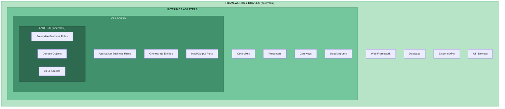
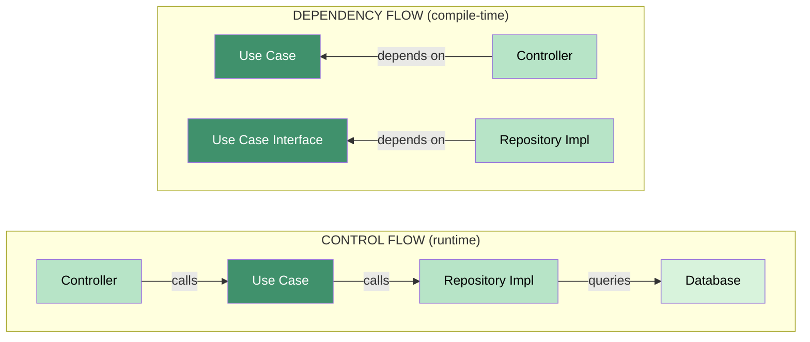
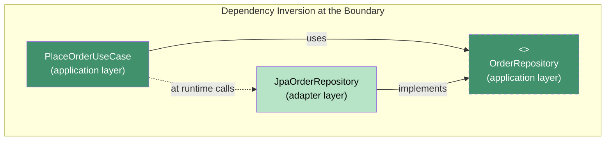
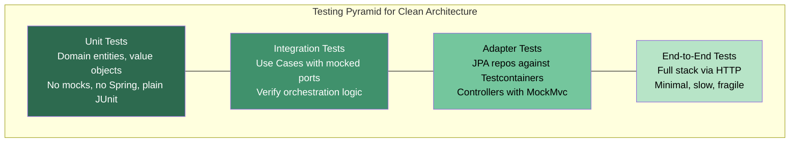

# Clean Architecture (Robert C. Martin)

## Core Philosophy

Clean Architecture, introduced by Robert C. Martin ("Uncle Bob") in 2012 and formalized in
his 2017 book, synthesizes ideas from Hexagonal Architecture, Onion Architecture, and DCI
into a single prescriptive model. The overriding goal: **separate policy from detail**.

Policy = the business rules that make your system valuable.
Detail = the mechanisms that deliver those rules (databases, frameworks, UI).

The architecture makes one non-negotiable demand:

> **The Dependency Rule**: Source code dependencies must point INWARD only.
> Nothing in an inner circle can know anything at all about something in an outer circle.

This single constraint produces systems that are testable, framework-independent,
UI-independent, and database-independent.

---

## The Four Concentric Circles



### Layer 1 -- Entities (Innermost)

Entities encapsulate **enterprise-wide business rules**. They are the most general, most
stable abstractions in the system. An Entity can be an object with methods or a set of data
structures and functions -- the form does not matter; what matters is that the business rules
are independent of everything external.

```java
// domain/entity/Order.java
public class Order {
    private final OrderId id;
    private final CustomerId customerId;
    private final List<LineItem> items;
    private OrderStatus status;
    private final Money totalAmount;

    public Order(OrderId id, CustomerId customerId, List<LineItem> items) {
        if (items == null || items.isEmpty()) {
            throw new DomainException("Order must have at least one item");
        }
        this.id = id;
        this.customerId = customerId;
        this.items = List.copyOf(items);
        this.status = OrderStatus.CREATED;
        this.totalAmount = calculateTotal(items);
    }

    /**
     * Pure domain logic -- no framework dependency, no database call.
     * This method knows nothing about HTTP, JPA, or Spring.
     */
    public void confirm() {
        if (this.status != OrderStatus.CREATED) {
            throw new DomainException("Only created orders can be confirmed");
        }
        this.status = OrderStatus.CONFIRMED;
    }

    public void cancel() {
        if (this.status == OrderStatus.SHIPPED) {
            throw new DomainException("Cannot cancel a shipped order");
        }
        this.status = OrderStatus.CANCELLED;
    }

    private Money calculateTotal(List<LineItem> items) {
        return items.stream()
            .map(LineItem::subtotal)
            .reduce(Money.ZERO, Money::add);
    }
}
```

Key characteristics of Entities:
- No annotations from frameworks (`@Entity`, `@Table` do NOT belong here)
- No imports from outer layers
- Can be tested with plain JUnit -- no Spring context, no database

### Layer 2 -- Use Cases (Application Business Rules)

Use Cases contain **application-specific** business rules. They orchestrate the flow of data
to and from Entities, directing them to use their enterprise-wide rules to achieve a goal.

```java
// application/usecase/PlaceOrderUseCase.java
public class PlaceOrderUseCase {

    private final OrderRepository orderRepository;       // OUTPUT PORT
    private final PaymentGateway paymentGateway;         // OUTPUT PORT
    private final InventoryChecker inventoryChecker;     // OUTPUT PORT

    public PlaceOrderUseCase(
            OrderRepository orderRepository,
            PaymentGateway paymentGateway,
            InventoryChecker inventoryChecker) {
        this.orderRepository = orderRepository;
        this.paymentGateway = paymentGateway;
        this.inventoryChecker = inventoryChecker;
    }

    /**
     * Orchestrates entities and driven ports.
     * This is the APPLICATION rule: "to place an order, check inventory,
     * charge payment, then persist."
     */
    public OrderConfirmation execute(PlaceOrderCommand command) {
        // 1. Build domain entity
        Order order = OrderFactory.create(
            command.customerId(),
            command.items()
        );

        // 2. Check inventory (driven port)
        if (!inventoryChecker.allAvailable(order.getItems())) {
            throw new InsufficientInventoryException(order.getId());
        }

        // 3. Charge payment (driven port)
        PaymentResult payment = paymentGateway.charge(
            command.paymentMethod(),
            order.getTotalAmount()
        );

        if (!payment.isSuccessful()) {
            throw new PaymentFailedException(payment.reason());
        }

        // 4. Confirm the order (domain logic)
        order.confirm();

        // 5. Persist (driven port)
        orderRepository.save(order);

        return new OrderConfirmation(order.getId(), order.getStatus());
    }
}
```

Use Cases define **Input Ports** (the interface they expose to driving adapters) and depend
on **Output Ports** (interfaces that driven adapters implement).

### Layer 3 -- Interface Adapters

Adapters **convert data** between the format most convenient for use cases / entities and the
format most convenient for external agencies (DB, web, etc.).

| Role            | Examples                                  |
| --------------- | ----------------------------------------- |
| Controllers     | REST controllers, gRPC handlers, CLI      |
| Presenters      | JSON serializers, view models, formatters |
| Gateways        | ORM repositories, API clients, caches     |
| Data Mappers    | JPA entity <--> domain entity converters  |

```java
// adapter/in/rest/OrderController.java
@RestController
@RequestMapping("/api/orders")
public class OrderController {

    private final PlaceOrderUseCase placeOrderUseCase;

    public OrderController(PlaceOrderUseCase placeOrderUseCase) {
        this.placeOrderUseCase = placeOrderUseCase;
    }

    @PostMapping
    public ResponseEntity<OrderResponse> placeOrder(
            @RequestBody PlaceOrderRequest request) {

        // Convert INWARD: HTTP request --> use case command
        PlaceOrderCommand command = request.toCommand();

        // Invoke the use case
        OrderConfirmation confirmation = placeOrderUseCase.execute(command);

        // Convert OUTWARD: use case result --> HTTP response
        return ResponseEntity
            .status(HttpStatus.CREATED)
            .body(OrderResponse.from(confirmation));
    }
}
```

### Layer 4 -- Frameworks and Drivers (Outermost)

This is where **all the details live**: Spring Boot, PostgreSQL, React, Kafka, Redis.
Code in this layer is glue -- configuration, wiring, and framework-specific boilerplate.

```java
// adapter/out/persistence/JpaOrderRepository.java
@Repository
public class JpaOrderRepository implements OrderRepository {

    private final SpringDataOrderRepo springRepo;
    private final OrderPersistenceMapper mapper;

    @Override
    public void save(Order order) {
        OrderJpaEntity jpaEntity = mapper.toJpa(order);
        springRepo.save(jpaEntity);
    }

    @Override
    public Optional<Order> findById(OrderId id) {
        return springRepo.findById(id.value())
            .map(mapper::toDomain);
    }
}
```

Notice: `OrderRepository` (the interface) lives in the **application** layer.
`JpaOrderRepository` (the implementation) lives in the **adapter** layer.
The dependency arrow points inward: adapter --> application.

---

## Dependency Flow vs Control Flow

This is the single most misunderstood aspect of Clean Architecture.



**Control flow** goes outward: Controller --> Use Case --> Repository Impl --> Database.
**Dependency flow** points inward: Controller depends on Use Case; Repository Impl depends
on Use Case's interface (the port).

The trick is **Dependency Inversion Principle (DIP)** at the boundary between Use Cases and
the outer layer:

```
Use Case layer defines:    interface OrderRepository { void save(Order o); }
Adapter layer implements:  class JpaOrderRepository implements OrderRepository { ... }
```

At runtime, the Use Case calls the concrete JpaOrderRepository. But at compile time, the
Use Case knows only the interface. This is how the control flow goes outward while
dependencies point inward.



---

## Screaming Architecture

> "Your architecture should scream the use case, not the framework."
> -- Robert C. Martin

Bad (screams "Spring MVC"):
```
src/main/java/com/app/
├── controllers/
├── services/
├── repositories/
├── models/
└── config/
```

Good (screams "this is an ordering system"):
```
src/main/java/com/app/
├── order/
│   ├── domain/
│   │   ├── Order.java
│   │   ├── OrderId.java
│   │   ├── LineItem.java
│   │   ├── OrderStatus.java
│   │   └── Money.java
│   ├── application/
│   │   ├── port/
│   │   │   ├── in/
│   │   │   │   └── PlaceOrderUseCase.java
│   │   │   └── out/
│   │   │       ├── OrderRepository.java
│   │   │       └── PaymentGateway.java
│   │   └── service/
│   │       └── PlaceOrderService.java        <-- implements PlaceOrderUseCase
│   ├── adapter/
│   │   ├── in/
│   │   │   └── rest/
│   │   │       ├── OrderController.java
│   │   │       ├── PlaceOrderRequest.java
│   │   │       └── OrderResponse.java
│   │   └── out/
│   │       ├── persistence/
│   │       │   ├── JpaOrderRepository.java   <-- implements OrderRepository
│   │       │   ├── OrderJpaEntity.java
│   │       │   └── OrderPersistenceMapper.java
│   │       └── payment/
│   │           └── StripePaymentGateway.java  <-- implements PaymentGateway
│   └── config/
│       └── OrderBeanConfiguration.java
├── inventory/
│   ├── domain/
│   ├── application/
│   ├── adapter/
│   └── config/
└── shared/
    └── kernel/
        ├── DomainException.java
        └── AggregateRoot.java
```

Each top-level package is a **bounded context** (DDD term). Inside each bounded context,
the Clean Architecture layers appear. A new developer opens the project and immediately
sees: "This system handles orders, inventory, and shared kernel."

---

## Complete Dependency Wiring (Spring Boot)

```java
// order/config/OrderBeanConfiguration.java
@Configuration
public class OrderBeanConfiguration {

    @Bean
    public PlaceOrderUseCase placeOrderUseCase(
            OrderRepository orderRepository,
            PaymentGateway paymentGateway,
            InventoryChecker inventoryChecker) {

        // Pure constructor injection -- no @Autowired on domain code
        return new PlaceOrderService(
            orderRepository,
            paymentGateway,
            inventoryChecker
        );
    }
}
```

The domain and application layers have **zero Spring imports**. Spring only appears in the
adapter and config layers. If you later switch to Quarkus or Micronaut, you rewrite the
config and adapter layers; domain and application layers remain untouched.

---

## Testing Strategy



### Unit testing entities (no framework, no mocks)

```java
@Test
void confirmingACreatedOrder_setsStatusToConfirmed() {
    Order order = new Order(
        OrderId.generate(),
        new CustomerId("C-1"),
        List.of(new LineItem("SKU-1", 2, Money.of(10)))
    );

    order.confirm();

    assertEquals(OrderStatus.CONFIRMED, order.getStatus());
}

@Test
void confirmingAnAlreadyConfirmedOrder_throwsDomainException() {
    Order order = createConfirmedOrder();

    assertThrows(DomainException.class, order::confirm);
}
```

### Integration testing use cases (mocked ports)

```java
@Test
void placeOrder_chargesPaymentAndPersists() {
    // Arrange -- mock the ports
    OrderRepository repo = mock(OrderRepository.class);
    PaymentGateway payments = mock(PaymentGateway.class);
    InventoryChecker inventory = mock(InventoryChecker.class);

    when(inventory.allAvailable(any())).thenReturn(true);
    when(payments.charge(any(), any()))
        .thenReturn(PaymentResult.success("txn-123"));

    PlaceOrderUseCase useCase = new PlaceOrderService(repo, payments, inventory);

    // Act
    OrderConfirmation result = useCase.execute(aPlaceOrderCommand());

    // Assert
    assertEquals(OrderStatus.CONFIRMED, result.status());
    verify(repo).save(argThat(o -> o.getStatus() == OrderStatus.CONFIRMED));
    verify(payments).charge(any(), any());
}
```

---

## Benefits and Costs

### Benefits

| Benefit                  | Explanation                                                    |
| ------------------------ | -------------------------------------------------------------- |
| **Testable**             | Inner layers tested without framework, DB, or network          |
| **Framework-independent**| Replace Spring with Quarkus -- domain + app layers untouched   |
| **UI-independent**       | Swap REST for gRPC or CLI -- only adapters change              |
| **DB-independent**       | Switch Postgres to Mongo -- implement a new adapter            |
| **Deferrable decisions** | Pick your DB or framework later; domain comes first            |
| **Parallel development** | Teams work on adapters independently once ports are defined    |
| **Longevity**            | Core business logic survives technology churn                  |

### Costs

| Cost                     | Explanation                                                    |
| ------------------------ | -------------------------------------------------------------- |
| **More files**           | Each port, adapter, mapper, DTO adds a file                    |
| **More indirection**     | Call chain: Controller --> Use Case --> Port --> Adapter        |
| **Learning curve**       | Team must understand DIP, ports, adapters, mapping             |
| **Boilerplate mapping**  | Domain <--> JPA entity <--> DTO conversions are tedious        |
| **Premature for CRUD**   | Simple apps gain little from four layers of abstraction        |
| **Over-engineering risk**| Zealous application to trivial services wastes effort          |

---

## The Dependency Rule -- Formal Statement

1. Source code in an **inner** circle must not mention the name of anything in an **outer**
   circle. This includes classes, functions, variables, data formats, or any named software
   entity.

2. Data formats that cross boundaries should be simple data structures (DTOs, value objects)
   -- not framework-specific objects. A JPA entity must never leak inward.

3. When something in an inner circle needs to call something in an outer circle, it must do
   so through **Dependency Inversion**: the inner circle defines an interface; the outer
   circle provides the implementation.

Violations to watch for:
- Domain entity annotated with `@Entity`, `@Table`, `@Column` (JPA leaking inward)
- Use Case importing `HttpServletRequest` (web framework leaking inward)
- Use Case returning `ResponseEntity` (Spring leaking inward)
- Domain model using `JsonProperty` (serialization leaking inward)

---

## Mapping Between Boundaries

Three strategies for crossing boundaries:

### 1. Two-Way Mapping (recommended for complex systems)

Each layer has its own model. Dedicated mappers convert between them.

```
HTTP Request DTO  <-->  Use Case Command  <-->  Domain Entity  <-->  JPA Entity
```

Pro: Each layer is fully decoupled.
Con: Most files, most boilerplate (MapStruct helps).

### 2. One-Way Mapping (pragmatic middle ground)

Domain model is shared with use cases. Only outer boundaries have dedicated DTOs.

```
HTTP Request DTO  <-->  Domain Entity  <-->  JPA Entity
```

Pro: Less mapping code.
Con: Use cases exposed to domain model changes.

### 3. No Mapping (acceptable for simple CRUD)

Single model used everywhere. Fast to build, but couples everything.

```
JPA Entity used as domain model and returned in REST response
```

Pro: Minimal code.
Con: One change ripples everywhere. Testing requires framework context.

---

## Key Takeaways

1. **Dependencies point inward.** Always. No exceptions.
2. **Inner layers define interfaces. Outer layers implement them.** This is DIP in action.
3. **Screaming Architecture**: package by feature, not by layer.
4. **Control flow and dependency flow are different.** At runtime, outer calls inner calls
   outer. At compile time, outer depends on inner only.
5. **The framework is a detail.** It belongs in the outermost circle.
6. **The database is a detail.** It belongs in the outermost circle.
7. **Start with the domain.** Write entities and use cases first. Defer framework decisions.
8. **Apply pragmatically.** Not every system needs four layers. Know when the cost exceeds
   the benefit.
