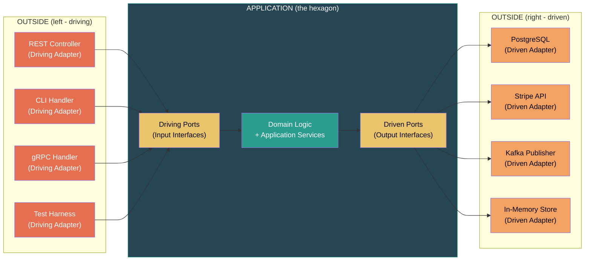
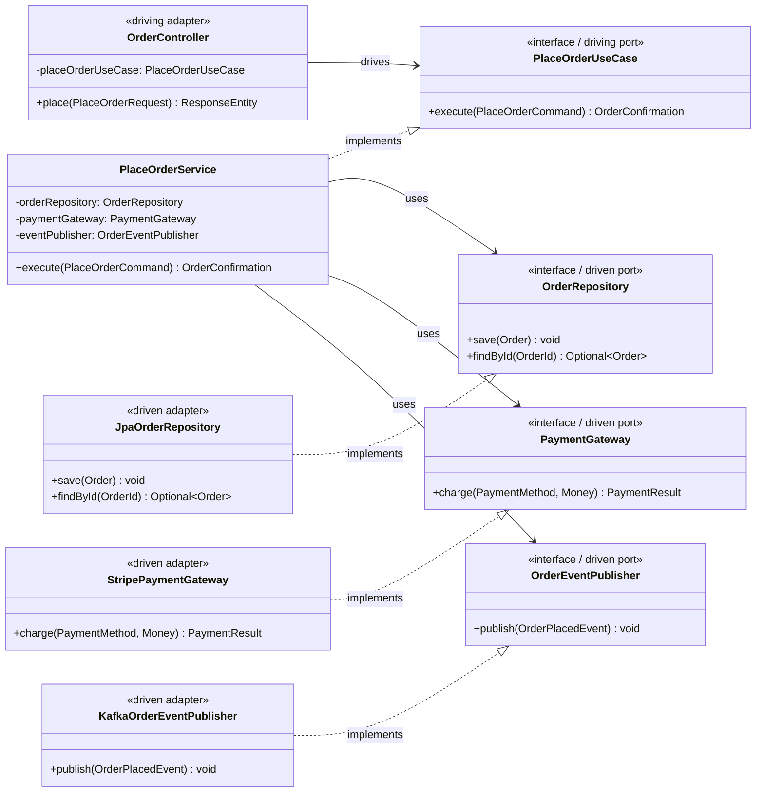
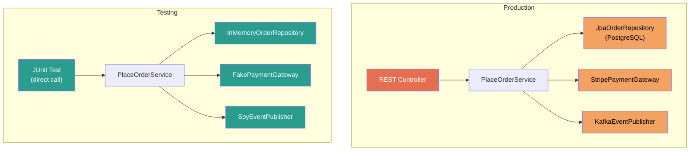

# Hexagonal Architecture (Ports and Adapters)

## Origin and Core Idea

Alistair Cockburn introduced Hexagonal Architecture (also called Ports and Adapters) in
2005. The motivation was simple: **applications should be equally drivable by users, programs,
automated tests, or batch scripts, and should be developable and testable in isolation from
its eventual runtime devices and databases.**

The mental model: your application is a **hexagon**. Each face of the hexagon has **ports**
(interfaces). External systems connect to these ports through **adapters** (implementations).
The hexagonal shape is arbitrary -- it simply provides enough "sides" to represent the
different external actors and makes the inside/outside distinction visually clear.

---

## The Hexagonal Model



---

## Ports: The Application's API

Ports are **interfaces defined by the application**. They specify how the application wants
to be used (driving ports) and what capabilities it needs from the outside world (driven
ports).

### Primary / Driving Ports (Input)

Driving ports define what the application **can do**. They are the use cases, the commands,
the queries. External actors call these ports to drive the application.

```java
// application/port/in/PlaceOrderUseCase.java
public interface PlaceOrderUseCase {
    OrderConfirmation execute(PlaceOrderCommand command);
}

// application/port/in/GetOrderQuery.java
public interface GetOrderQuery {
    OrderDetails execute(OrderId orderId);
}

// application/port/in/CancelOrderUseCase.java
public interface CancelOrderUseCase {
    void execute(OrderId orderId);
}
```

### Secondary / Driven Ports (Output)

Driven ports define what the application **needs**. They are the dependencies that the
application requires from the external world -- persistence, payment, messaging, etc.

```java
// application/port/out/OrderRepository.java
public interface OrderRepository {
    void save(Order order);
    Optional<Order> findById(OrderId id);
    List<Order> findByCustomer(CustomerId customerId);
}

// application/port/out/PaymentGateway.java
public interface PaymentGateway {
    PaymentResult charge(PaymentMethod method, Money amount);
    void refund(TransactionId transactionId);
}

// application/port/out/OrderEventPublisher.java
public interface OrderEventPublisher {
    void publish(OrderPlacedEvent event);
}
```

**Critical distinction**: Driving ports belong to the application. Driving adapters depend on
them. Driven ports also belong to the application. Driven adapters implement them. In both
cases, the application defines the contract and the outside world conforms.

---

## Adapters: Connecting the Outside World

Adapters are **implementations** that bridge the gap between ports and external systems.

### Primary / Driving Adapters (Input)

Driving adapters translate external input into calls on driving ports.

```java
// adapter/in/rest/OrderController.java
@RestController
@RequestMapping("/api/orders")
public class OrderController {

    private final PlaceOrderUseCase placeOrderUseCase;
    private final GetOrderQuery getOrderQuery;
    private final CancelOrderUseCase cancelOrderUseCase;

    public OrderController(
            PlaceOrderUseCase placeOrderUseCase,
            GetOrderQuery getOrderQuery,
            CancelOrderUseCase cancelOrderUseCase) {
        this.placeOrderUseCase = placeOrderUseCase;
        this.getOrderQuery = getOrderQuery;
        this.cancelOrderUseCase = cancelOrderUseCase;
    }

    @PostMapping
    public ResponseEntity<OrderResponse> place(@RequestBody PlaceOrderRequest req) {
        PlaceOrderCommand cmd = new PlaceOrderCommand(
            req.customerId(), req.items(), req.paymentMethod()
        );
        OrderConfirmation result = placeOrderUseCase.execute(cmd);
        return ResponseEntity.status(201).body(OrderResponse.from(result));
    }

    @GetMapping("/{id}")
    public OrderDetailResponse get(@PathVariable String id) {
        return OrderDetailResponse.from(
            getOrderQuery.execute(new OrderId(id))
        );
    }

    @DeleteMapping("/{id}")
    @ResponseStatus(HttpStatus.NO_CONTENT)
    public void cancel(@PathVariable String id) {
        cancelOrderUseCase.execute(new OrderId(id));
    }
}
```

```java
// adapter/in/cli/OrderCli.java
public class OrderCli {

    private final PlaceOrderUseCase placeOrderUseCase;

    public void run(String[] args) {
        PlaceOrderCommand cmd = parseArgs(args);
        OrderConfirmation result = placeOrderUseCase.execute(cmd);
        System.out.println("Order placed: " + result.orderId());
    }
}
```

The same use case is driven by REST, CLI, gRPC, tests -- zero changes to application code.

### Secondary / Driven Adapters (Output)

Driven adapters implement driven ports, connecting the application to external infrastructure.

```java
// adapter/out/persistence/JpaOrderRepository.java
@Repository
public class JpaOrderRepository implements OrderRepository {

    private final SpringDataOrderJpaRepository jpaRepo;
    private final OrderPersistenceMapper mapper;

    public JpaOrderRepository(
            SpringDataOrderJpaRepository jpaRepo,
            OrderPersistenceMapper mapper) {
        this.jpaRepo = jpaRepo;
        this.mapper = mapper;
    }

    @Override
    public void save(Order order) {
        jpaRepo.save(mapper.toJpaEntity(order));
    }

    @Override
    public Optional<Order> findById(OrderId id) {
        return jpaRepo.findById(id.value()).map(mapper::toDomain);
    }

    @Override
    public List<Order> findByCustomer(CustomerId customerId) {
        return jpaRepo.findByCustomerId(customerId.value())
            .stream()
            .map(mapper::toDomain)
            .toList();
    }
}
```

```java
// adapter/out/payment/StripePaymentGateway.java
public class StripePaymentGateway implements PaymentGateway {

    private final StripeClient stripeClient;

    @Override
    public PaymentResult charge(PaymentMethod method, Money amount) {
        try {
            Charge charge = stripeClient.charges().create(
                ChargeCreateParams.builder()
                    .setAmount(amount.toCents())
                    .setCurrency("usd")
                    .setSource(method.token())
                    .build()
            );
            return PaymentResult.success(new TransactionId(charge.getId()));
        } catch (StripeException e) {
            return PaymentResult.failure(e.getMessage());
        }
    }

    @Override
    public void refund(TransactionId transactionId) {
        stripeClient.refunds().create(
            RefundCreateParams.builder()
                .setCharge(transactionId.value())
                .build()
        );
    }
}
```

```java
// adapter/out/messaging/KafkaOrderEventPublisher.java
public class KafkaOrderEventPublisher implements OrderEventPublisher {

    private final KafkaTemplate<String, String> kafkaTemplate;
    private final ObjectMapper objectMapper;

    @Override
    public void publish(OrderPlacedEvent event) {
        String payload = objectMapper.writeValueAsString(event);
        kafkaTemplate.send("order.placed", event.orderId().value(), payload);
    }
}
```

---

## Class Diagram: Full Port-Adapter Wiring



---

## Project Structure

```
com.app.order/
├── domain/
│   ├── Order.java                          # Aggregate root
│   ├── OrderId.java                        # Value object
│   ├── LineItem.java                       # Value object
│   ├── OrderStatus.java                    # Enum
│   └── Money.java                          # Value object
├── application/
│   ├── port/
│   │   ├── in/
│   │   │   ├── PlaceOrderUseCase.java      # Driving port
│   │   │   ├── GetOrderQuery.java          # Driving port
│   │   │   └── CancelOrderUseCase.java     # Driving port
│   │   └── out/
│   │       ├── OrderRepository.java        # Driven port
│   │       ├── PaymentGateway.java         # Driven port
│   │       └── OrderEventPublisher.java    # Driven port
│   └── service/
│       ├── PlaceOrderService.java          # Implements driving port
│       ├── GetOrderService.java
│       └── CancelOrderService.java
├── adapter/
│   ├── in/
│   │   ├── rest/
│   │   │   ├── OrderController.java        # Driving adapter
│   │   │   ├── PlaceOrderRequest.java      # Inbound DTO
│   │   │   └── OrderResponse.java          # Outbound DTO
│   │   ├── grpc/
│   │   │   └── OrderGrpcService.java       # Driving adapter
│   │   └── cli/
│   │       └── OrderCli.java               # Driving adapter
│   └── out/
│       ├── persistence/
│       │   ├── JpaOrderRepository.java     # Driven adapter
│       │   ├── OrderJpaEntity.java         # JPA model
│       │   └── OrderPersistenceMapper.java # Domain <--> JPA mapper
│       ├── payment/
│       │   └── StripePaymentGateway.java   # Driven adapter
│       └── messaging/
│           └── KafkaOrderEventPublisher.java  # Driven adapter
└── config/
    └── OrderConfiguration.java             # Wiring
```

---

## Testing Advantage: Adapter Swapping

The killer feature of Hexagonal Architecture is **test isolation through adapter swapping**.



```java
// Test adapter: in-memory repository
public class InMemoryOrderRepository implements OrderRepository {
    private final Map<OrderId, Order> store = new ConcurrentHashMap<>();

    @Override
    public void save(Order order) {
        store.put(order.getId(), order);
    }

    @Override
    public Optional<Order> findById(OrderId id) {
        return Optional.ofNullable(store.get(id));
    }

    @Override
    public List<Order> findByCustomer(CustomerId customerId) {
        return store.values().stream()
            .filter(o -> o.getCustomerId().equals(customerId))
            .toList();
    }

    // Test helpers
    public int count() { return store.size(); }
    public void clear() { store.clear(); }
}
```

```java
// Test adapter: fake payment gateway
public class FakePaymentGateway implements PaymentGateway {
    private boolean shouldSucceed = true;
    private final List<PaymentRequest> recorded = new ArrayList<>();

    public void willFail() { this.shouldSucceed = false; }

    @Override
    public PaymentResult charge(PaymentMethod method, Money amount) {
        recorded.add(new PaymentRequest(method, amount));
        return shouldSucceed
            ? PaymentResult.success(TransactionId.generate())
            : PaymentResult.failure("Declined");
    }

    @Override
    public void refund(TransactionId txnId) { /* no-op for tests */ }

    // Test helpers
    public List<PaymentRequest> getRecordedPayments() { return recorded; }
}
```

Now tests run in milliseconds, need no Docker, no network, no external service:

```java
@Test
void orderIsPersistedAfterSuccessfulPayment() {
    var repo = new InMemoryOrderRepository();
    var payments = new FakePaymentGateway();
    var events = new SpyEventPublisher();
    var useCase = new PlaceOrderService(repo, payments, events);

    useCase.execute(aPlaceOrderCommand());

    assertEquals(1, repo.count());
    assertEquals(1, events.publishedEvents().size());
}

@Test
void orderIsNotPersistedWhenPaymentFails() {
    var repo = new InMemoryOrderRepository();
    var payments = new FakePaymentGateway();
    payments.willFail();
    var events = new SpyEventPublisher();
    var useCase = new PlaceOrderService(repo, payments, events);

    assertThrows(PaymentFailedException.class,
        () -> useCase.execute(aPlaceOrderCommand()));

    assertEquals(0, repo.count());
    assertEquals(0, events.publishedEvents().size());
}
```

---

## Hexagonal vs Traditional Layered Architecture

| Criterion                     | Traditional Layered           | Hexagonal                                   |
| ----------------------------- | ----------------------------- | ------------------------------------------- |
| **Dependency direction**      | Top-down (UI --> Service --> DB) | Outside-in (adapters depend on application) |
| **Domain purity**             | Domain often coupled to DB    | Domain is isolated, framework-free          |
| **Testability**               | Requires DB/framework for tests | Swap adapters for fakes -- instant tests   |
| **Multiple entry points**     | Difficult to add CLI/gRPC     | Add a new driving adapter, done             |
| **Switching databases**       | Massive refactor              | Implement a new driven adapter              |
| **Code organization**         | By technical layer            | By domain concept + ports/adapters          |
| **Learning curve**            | Low -- most devs know it      | Moderate -- ports/adapters are new concepts |
| **Boilerplate**               | Minimal                       | More files: ports + adapters + mappers      |
| **Suitable for CRUD**         | Excellent                     | Overkill                                    |
| **Suitable for complex domain** | Breaks down over time       | Designed for this                            |
| **Framework coupling**        | High (annotations everywhere) | Low (framework only in adapters)            |
| **Boundary enforcement**      | Convention-based              | Structural -- compiler enforces via interfaces |

---

## Symmetry: The Hidden Insight

Cockburn's original insight was **symmetry**: the application should not know whether it is
being driven by a user through a GUI or by a test harness through an API. Similarly, it
should not know whether it is persisting to a real database or an in-memory map.

This symmetry manifests architecturally:

```
Left side (driving):          Right side (driven):
  REST adapter                  Postgres adapter
  CLI adapter                   In-Memory adapter
  gRPC adapter                  Stripe adapter
  Test adapter                  Fake adapter

Both sides:
  - connect through PORTS (interfaces owned by the application)
  - are ADAPTERS (implementations owned by the outside)
  - can be SWAPPED without changing application code
```

The hexagon is symmetric. There is no "top" or "bottom" as in layered architecture. Every
external dependency -- whether it drives the application or is driven by it -- connects
through the same pattern: port + adapter.

---

## Common Mistakes

1. **Defining ports in the adapter layer**: Ports must live inside the application.
   The application owns its own API.

2. **Letting domain objects leak outward**: REST controllers should not return domain
   entities directly. Use DTOs/response objects as boundary contracts.

3. **Skipping ports for "simple" adapters**: Even if you have only one adapter today,
   define the port. The interface makes the boundary explicit and testable.

4. **Confusing driving and driven**: If the application initiates the call, the target
   is a driven port. If the external world initiates the call, the entry point is a
   driving port.

5. **Framework annotations on ports**: Ports are plain Java interfaces. No `@Repository`,
   no `@Service`, no `@Component`. Those annotations belong on the adapters.

---

## Key Takeaways

1. The application is a hexagon. All external systems connect through **ports and adapters**.
2. **Driving ports** (left side): how the outside world uses the application.
3. **Driven ports** (right side): what the application needs from the outside world.
4. **Adapters** implement ports. They are interchangeable. This is the testing superpower.
5. The application defines all interfaces. It never conforms to external APIs directly.
6. The hexagonal shape is a metaphor for **symmetry** -- driving and driven sides follow
   the same structural pattern.
7. Best suited for systems with **complex domain logic** and **multiple entry points or
   external dependencies** that may change over time.
