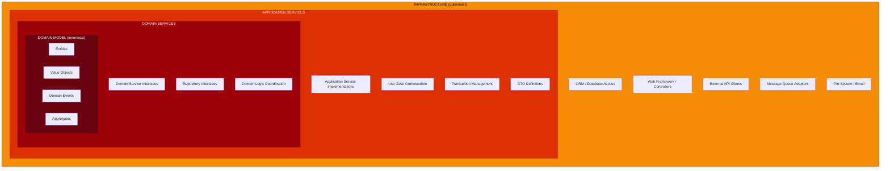
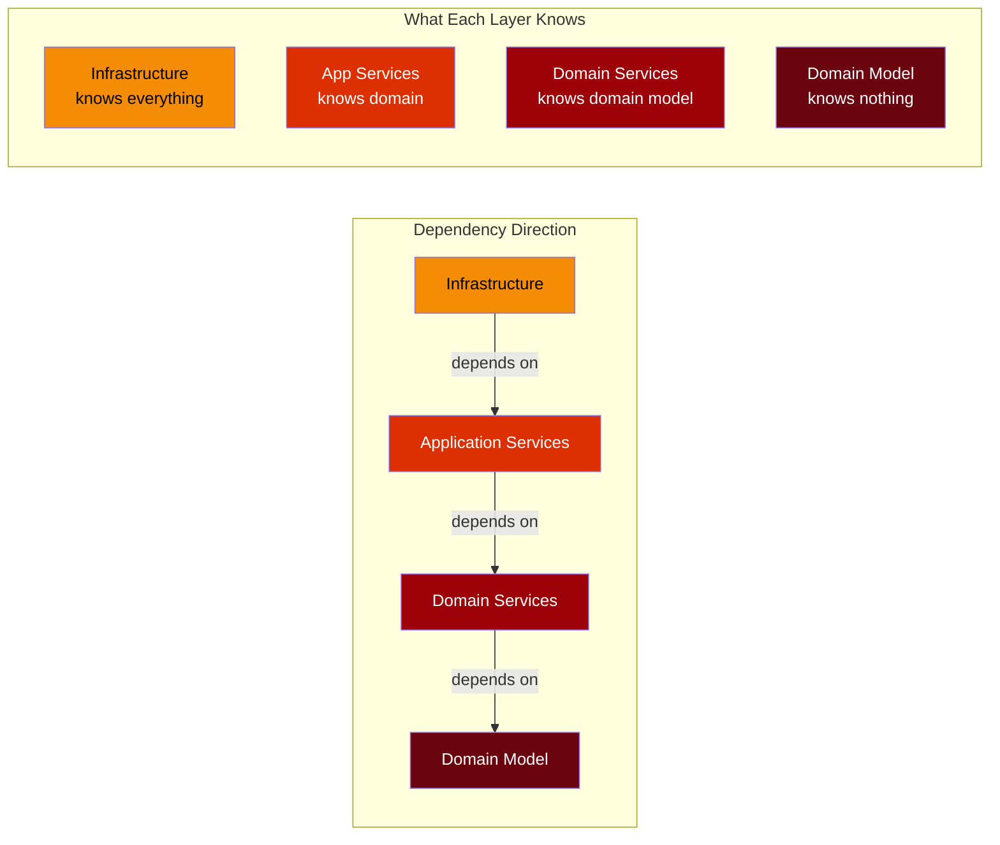
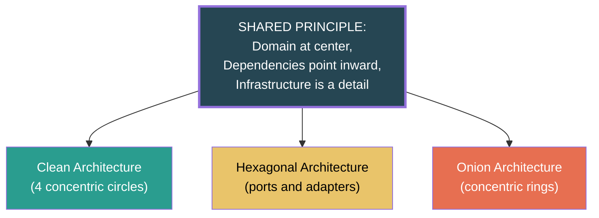
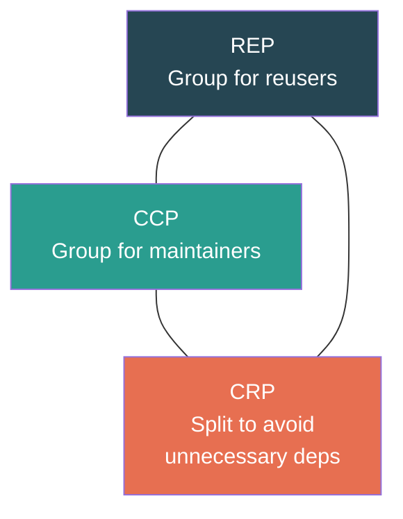
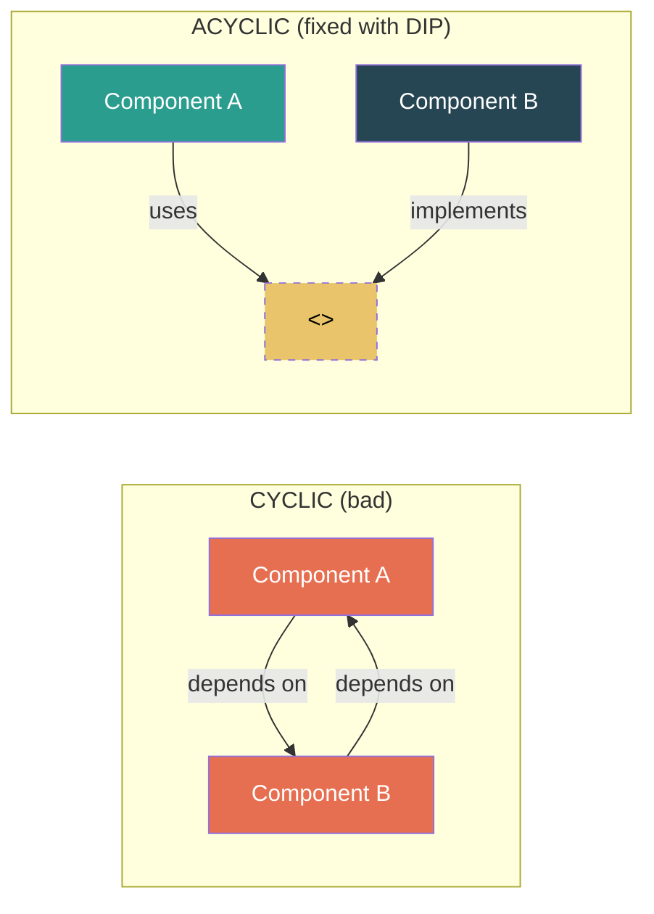

# Onion Architecture and Comparative Analysis

## Part 1: Onion Architecture (Jeffrey Palermo)

### Origin

Jeffrey Palermo introduced Onion Architecture in 2008 as a response to the traditional
layered architecture's tendency to couple business logic to infrastructure. The core idea:
**all coupling is toward the center.** The domain model is at the center, and all dependencies
point inward.

### The Concentric Layers



### Layer-by-Layer Breakdown

#### Layer 1: Domain Model (Innermost)

The purest expression of business concepts. No dependencies on anything -- not even on
other layers of the onion. This is where entities, value objects, aggregates, and domain
events live.

```java
// domain/model/Account.java
public class Account {
    private final AccountId id;
    private final CustomerId owner;
    private Money balance;
    private AccountStatus status;

    public Account(AccountId id, CustomerId owner, Money initialDeposit) {
        if (initialDeposit.isLessThan(Money.of(100))) {
            throw new MinimumDepositException("Minimum deposit is $100");
        }
        this.id = id;
        this.owner = owner;
        this.balance = initialDeposit;
        this.status = AccountStatus.ACTIVE;
    }

    public void deposit(Money amount) {
        requireActive();
        this.balance = this.balance.add(amount);
    }

    public void withdraw(Money amount) {
        requireActive();
        if (amount.isGreaterThan(this.balance)) {
            throw new InsufficientFundsException(this.id, amount, this.balance);
        }
        this.balance = this.balance.subtract(amount);
    }

    public void freeze() {
        this.status = AccountStatus.FROZEN;
    }

    private void requireActive() {
        if (this.status != AccountStatus.ACTIVE) {
            throw new AccountNotActiveException(this.id);
        }
    }
}
```

#### Layer 2: Domain Services

Interfaces and domain service logic that coordinate multiple entities or express business
rules that do not naturally belong to a single entity. Repository interfaces live here.

```java
// domain/service/TransferService.java
public class TransferService {

    /**
     * Pure domain logic: transfer between accounts.
     * No infrastructure awareness -- takes the accounts directly.
     */
    public TransferResult transfer(Account source, Account target, Money amount) {
        source.withdraw(amount);
        target.deposit(amount);
        return new TransferResult(source.getId(), target.getId(), amount);
    }
}

// domain/repository/AccountRepository.java
public interface AccountRepository {
    void save(Account account);
    Optional<Account> findById(AccountId id);
}
```

#### Layer 3: Application Services

Orchestrate domain objects and domain services. Handle transactions, call repository
interfaces, coordinate the workflow of a use case. This is equivalent to the Use Case
layer in Clean Architecture.

```java
// application/TransferMoneyService.java
public class TransferMoneyService {

    private final AccountRepository accountRepository;
    private final TransferService transferService;
    private final AuditLog auditLog;

    public TransferMoneyService(
            AccountRepository accountRepository,
            TransferService transferService,
            AuditLog auditLog) {
        this.accountRepository = accountRepository;
        this.transferService = transferService;
        this.auditLog = auditLog;
    }

    @Transactional
    public TransferResult execute(TransferCommand command) {
        Account source = accountRepository.findById(command.sourceAccountId())
            .orElseThrow(() -> new AccountNotFoundException(command.sourceAccountId()));

        Account target = accountRepository.findById(command.targetAccountId())
            .orElseThrow(() -> new AccountNotFoundException(command.targetAccountId()));

        TransferResult result = transferService.transfer(
            source, target, command.amount()
        );

        accountRepository.save(source);
        accountRepository.save(target);

        auditLog.record(new TransferAuditEntry(
            command.sourceAccountId(),
            command.targetAccountId(),
            command.amount()
        ));

        return result;
    }
}
```

#### Layer 4: Infrastructure (Outermost)

All implementations of interfaces defined in inner layers. Database access, web controllers,
external API clients, message queues, file system -- everything that is a "detail."

```java
// infrastructure/persistence/JpaAccountRepository.java
@Repository
public class JpaAccountRepository implements AccountRepository {

    private final SpringDataAccountRepo springRepo;
    private final AccountMapper mapper;

    @Override
    public void save(Account account) {
        springRepo.save(mapper.toJpa(account));
    }

    @Override
    public Optional<Account> findById(AccountId id) {
        return springRepo.findById(id.value()).map(mapper::toDomain);
    }
}

// infrastructure/web/TransferController.java
@RestController
@RequestMapping("/api/transfers")
public class TransferController {

    private final TransferMoneyService transferService;

    @PostMapping
    public ResponseEntity<TransferResponse> transfer(
            @RequestBody TransferRequest request) {
        TransferCommand cmd = new TransferCommand(
            new AccountId(request.sourceId()),
            new AccountId(request.targetId()),
            Money.of(request.amount())
        );
        TransferResult result = transferService.execute(cmd);
        return ResponseEntity.ok(TransferResponse.from(result));
    }
}
```

### Onion Architecture Dependency Flow



---

## Part 2: The Grand Comparison

### Clean vs Hexagonal vs Onion vs Traditional Layered

| # | Criterion                   | Traditional Layered        | Onion Architecture          | Hexagonal (Ports & Adapters) | Clean Architecture            |
|---|----------------------------|---------------------------|----------------------------|-----------------------------|-----------------------------|
| 1 | **Introduced by**          | Convention / N-tier        | Jeffrey Palermo (2008)     | Alistair Cockburn (2005)    | Robert C. Martin (2012)     |
| 2 | **Core metaphor**          | Stacked layers             | Concentric onion rings     | Hexagon with ports/adapters | Concentric circles          |
| 3 | **Dependency direction**   | Top-down                   | Inward                     | Outside-in                  | Inward                      |
| 4 | **Number of layers**       | 3 (Presentation, Business, Data) | 4 (Domain Model, Domain Services, App Services, Infra) | 3 zones (Driving, Application, Driven) | 4 (Entities, Use Cases, Adapters, Frameworks) |
| 5 | **Domain isolation**       | Weak -- often coupled to DB | Strong -- center of onion  | Strong -- inside the hexagon | Strong -- innermost circle |
| 6 | **Port/Adapter concept**   | No                         | Implicit (interfaces)      | Explicit and named          | Implicit (interfaces at boundaries) |
| 7 | **Driving vs Driven**      | Not distinguished          | Not distinguished          | Explicitly distinguished    | Not explicitly named        |
| 8 | **Dependency Inversion**   | Not required               | Required at all boundaries | Required at all boundaries  | Required (The Dependency Rule) |
| 9 | **Testability**            | Low (needs DB/framework)   | High (mock inner interfaces) | Highest (swap adapters)   | High (mock outer layers)    |
| 10| **Framework coupling**     | High                       | Low (infra is outermost)   | Low (adapters are external) | Low (frameworks are details) |
| 11| **Multiple entry points**  | Difficult                  | Moderate                   | Native (driving adapters)   | Supported via adapter layer |
| 12| **DB changeability**       | Hard                       | Easy (new infra impl)      | Easy (new driven adapter)   | Easy (new adapter)          |
| 13| **Learning curve**         | Low                        | Moderate                   | Moderate-High               | High                        |
| 14| **Boilerplate**            | Minimal                    | Moderate                   | Moderate-High               | High                        |
| 15| **Best suited for**        | Simple CRUD, prototypes    | Complex domain with DDD    | Multiple UIs or infra swaps | Enterprise systems, long-lived projects |

### The Shared Core Principle

Despite different metaphors, all three modern architectures agree on one fundamental idea:



**Dependency Inversion** is the mechanism. **Domain centrality** is the goal. The three
architectures are variations on the same theme, not competing alternatives.

---

## Part 3: Practical Implementation

### Mapping to Frameworks

#### Spring Boot (Java)

```
src/main/java/com/app/
├── domain/                        # Entities, VOs, domain services, repo interfaces
│   ├── model/
│   │   ├── Order.java
│   │   └── Money.java
│   ├── service/
│   │   └── PricingService.java
│   └── repository/
│       └── OrderRepository.java   # INTERFACE only
├── application/                   # Use cases / application services
│   ├── PlaceOrderService.java
│   ├── PlaceOrderCommand.java
│   └── OrderConfirmation.java
├── infrastructure/                # All framework + external code
│   ├── web/
│   │   └── OrderController.java
│   ├── persistence/
│   │   ├── JpaOrderRepository.java
│   │   └── OrderJpaEntity.java
│   ├── messaging/
│   │   └── KafkaPublisher.java
│   └── config/
│       └── BeanConfig.java
```

#### Express / Node.js (TypeScript)

```
src/
├── domain/
│   ├── model/
│   │   ├── Order.ts
│   │   └── Money.ts
│   ├── service/
│   │   └── PricingService.ts
│   └── port/
│       ├── OrderRepository.ts      # Interface
│       └── PaymentGateway.ts       # Interface
├── application/
│   ├── PlaceOrderUseCase.ts
│   ├── PlaceOrderCommand.ts
│   └── OrderConfirmation.ts
├── infrastructure/
│   ├── web/
│   │   ├── orderRouter.ts          # Express router
│   │   └── orderDto.ts
│   ├── persistence/
│   │   ├── PrismaOrderRepository.ts
│   │   └── orderMapper.ts
│   ├── payment/
│   │   └── StripePaymentGateway.ts
│   └── config/
│       └── container.ts             # DI container (tsyringe / inversify)
```

```typescript
// domain/port/OrderRepository.ts
export interface OrderRepository {
    save(order: Order): Promise<void>;
    findById(id: OrderId): Promise<Order | null>;
}

// infrastructure/persistence/PrismaOrderRepository.ts
export class PrismaOrderRepository implements OrderRepository {
    constructor(private prisma: PrismaClient) {}

    async save(order: Order): Promise<void> {
        await this.prisma.order.upsert({
            where: { id: order.id.value },
            create: OrderMapper.toPrisma(order),
            update: OrderMapper.toPrisma(order),
        });
    }

    async findById(id: OrderId): Promise<Order | null> {
        const row = await this.prisma.order.findUnique({
            where: { id: id.value },
        });
        return row ? OrderMapper.toDomain(row) : null;
    }
}
```

#### Django (Python)

```
app/
├── domain/
│   ├── model/
│   │   ├── order.py                # Pure Python classes (NOT Django models)
│   │   └── money.py
│   ├── service/
│   │   └── pricing_service.py
│   └── port/
│       ├── order_repository.py     # ABC (Abstract Base Class)
│       └── payment_gateway.py
├── application/
│   ├── place_order_use_case.py
│   └── dto.py
├── infrastructure/
│   ├── django_models/
│   │   └── order_model.py          # Django ORM model (the detail)
│   ├── repositories/
│   │   └── django_order_repo.py    # Implements the port
│   ├── views/
│   │   └── order_views.py          # DRF views
│   └── config/
│       └── container.py            # dependency-injector wiring
```

### Where to Put Cross-Cutting Concerns

| Concern             | Where it belongs                                                   |
| ------------------- | ------------------------------------------------------------------ |
| **Validation**      | Domain validation in entities/VOs; input format validation in adapters |
| **Error handling**  | Domain exceptions in domain layer; translation to HTTP codes in adapter layer |
| **Logging**         | Infrastructure concern -- inject a logger interface if needed in application layer; never in domain |
| **Transactions**    | Application service layer (annotated or programmatic); domain must not know about transactions |
| **Authorization**   | Application service layer or a dedicated middleware/adapter; domain may contain authorization rules as domain logic |
| **Caching**         | Infrastructure layer -- implement as a decorating adapter around a driven port |
| **Retry/Circuit breaker** | Infrastructure layer -- wrap driven adapters with resilience4j or similar |

---

## Part 4: Component Cohesion Principles

Robert C. Martin defines three principles that govern which classes belong in the same
component (package, module, library).

### REP: Reuse/Release Equivalence Principle

> The granule of reuse is the granule of release.

Classes and modules that are reused together must be released together. If you extract a
shared library, all classes in it must be versioned and released as a unit. Do not force
users to depend on classes they do not use.

**Practical impact**: If your `domain` module contains both `Order` and `User` aggregates
but consumers only use `Order`, split them into separate modules.

### CCP: Common Closure Principle (SRP for components)

> Gather together the classes that change for the same reasons and at the same times.
> Separate those classes that change at different times for different reasons.

**Practical impact**: Put `OrderController` and `OrderRequest` in the same package -- they
change together when the API changes. Keep `Order` (entity) separate -- it changes when
business rules change.

### CRP: Common Reuse Principle (ISP for components)

> Do not force users of a component to depend on things they do not need.

If a class is not tightly bound to others in a component, it should not be in that
component. Depending on a component means depending on ALL of it.

**Practical impact**: Do not put utility classes in your domain module. A consumer importing
your domain should not be forced to transitively depend on Apache Commons.

### The Tension Triangle



These three principles are in tension. Satisfying REP and CCP leads to large components
(too many unnecessary dependencies -- violates CRP). Satisfying CCP and CRP leads to many
small components (hard to reuse as units -- violates REP). Good architects balance the three
based on the project's maturity and needs.

---

## Part 5: Component Coupling Principles

### ADP: Acyclic Dependencies Principle

> There must be no cycles in the component dependency graph.

If A depends on B and B depends on A, you have a cycle. This makes independent development,
testing, and release impossible.

**Breaking cycles**:
1. **Dependency Inversion**: A depends on an interface that B implements, breaking the
   direct dependency from B to A.
2. **Extract a new component**: Pull the shared dependency into C, so both A and B
   depend on C.



### SDP: Stable Dependencies Principle

> Depend in the direction of stability.

A component that is hard to change (stable) should not depend on a component that is easy
to change (volatile). Stability is measured by the ratio of incoming to outgoing dependencies:

```
Instability = Fan-out / (Fan-in + Fan-out)
    0 = maximally stable (many dependents, no dependencies)
    1 = maximally unstable (no dependents, many dependencies)
```

Your domain layer should be maximally stable (I = 0). Your adapter layer should be
unstable (I close to 1). Dependencies should flow from unstable to stable.

### SAP: Stable Abstractions Principle

> A component should be as abstract as it is stable.

Stable components should consist primarily of interfaces and abstract classes so they can
be extended without modification. Unstable components should be concrete -- they are the
implementations that change.

**Plotting the Main Sequence**:

```
Abstractness (A) vs Instability (I)

A=1 |  Zone of      /
    |  Uselessness /
    |            /  <-- Main Sequence (ideal: A + I = 1)
    |          /
    |        /
A=0 |------/  Zone of Pain
    I=0         I=1
```

- **Zone of Pain** (concrete + stable): hard to change but must change -- painful.
  Example: a concrete database utility everyone depends on.
- **Zone of Uselessness** (abstract + unstable): nobody depends on it -- dead code.
- **Main Sequence** (A + I = 1): the sweet spot. Stable components are abstract; unstable
  components are concrete.

---

## Part 6: When to Use These Architectures

### Use Clean / Hexagonal / Onion When:

- **Complex domain logic**: The business rules are the hard part, not the plumbing
- **Long-lived project**: Expected to live and evolve for 5+ years
- **Multiple entry points**: REST API today, gRPC tomorrow, CLI for batch processing
- **Framework might change**: Moving from Spring to Quarkus, Express to Fastify
- **High testability required**: Financial systems, healthcare, regulatory compliance
- **Multiple teams**: Different teams own different adapters or bounded contexts
- **Domain-Driven Design**: You are already investing in DDD; these architectures complement it

### Do NOT Use When:

- **Simple CRUD**: If the app is mostly database in/out with minimal logic, layered is fine
- **Prototypes / MVPs**: Speed to market matters more than architectural purity
- **Small scripts or tools**: A 500-line CLI tool does not need four layers of abstraction
- **Throwaway code**: If it will be discarded in 3 months, do not invest in ports and adapters
- **Solo developer, small scope**: The overhead may exceed the benefit
- **Data pipeline / ETL**: These have different architectural concerns (flow, not layers)

---

## Part 7: Anti-Patterns

### 1. Leaking Domain

The domain entity has JPA annotations, Jackson annotations, or Spring annotations.

```java
// BAD: domain entity leaks infrastructure
@Entity
@Table(name = "orders")
public class Order {
    @Id @GeneratedValue
    private Long id;

    @Column(name = "status")
    @JsonProperty("order_status")     // Jackson in domain!
    private String status;
}
```

Fix: Domain entity is a plain Java class. Create a separate `OrderJpaEntity` in the
persistence adapter with its own annotations and a mapper between them.

### 2. Framework Coupling

The use case layer imports Spring, Express, Django, or any framework.

```java
// BAD: use case coupled to Spring
@Service
public class PlaceOrderService {
    @Autowired
    private JpaOrderRepository repo;   // Concrete class, not interface!

    public ResponseEntity<Order> placeOrder(HttpServletRequest request) {
        // HTTP details in business logic!
    }
}
```

Fix: Use case depends only on interfaces (ports). No `@Service`, no `@Autowired`, no
`ResponseEntity`, no `HttpServletRequest`.

### 3. Anemic Architecture

You have the folder structure but the domain entities are just data containers. All logic
lives in application services. You have Clean Architecture's cost but none of its benefit.

```java
// BAD: anemic entity -- just getters/setters
public class Order {
    private String status;
    public String getStatus() { return status; }
    public void setStatus(String s) { this.status = s; }
}

// BAD: all logic in service
public class OrderService {
    public void confirmOrder(Order order) {
        if (!order.getStatus().equals("CREATED")) throw ...;
        order.setStatus("CONFIRMED");
    }
}
```

Fix: Move `confirm()` into the `Order` entity. The entity enforces its own invariants.

### 4. Circular Dependencies Between Modules

The `order` module depends on `inventory` and `inventory` depends on `order`. This violates
ADP and creates a tangled mess.

Fix: Extract shared types into a `shared-kernel` module, or use domain events for
cross-boundary communication.

### 5. Over-Abstraction

Every class has an interface. Every method is behind a port. The indirection makes code
unreadable and navigation impossible.

Fix: Create abstractions only at **architectural boundaries** -- where the application meets
the outside world. Internal collaborations within a layer can use concrete classes.

---

## Part 8: Real-World Adoption

| Company / System          | Architecture                                      | Notes                                     |
| ------------------------- | ------------------------------------------------- | ----------------------------------------- |
| **Netflix**               | Hexagonal                                         | Microservices with swappable adapters for resilience testing |
| **Spotify**               | Clean Architecture (mobile)                       | Android/iOS apps use clean arch for testability |
| **Banking systems**       | Onion / Clean                                     | Regulatory compliance demands isolated domain logic |
| **UK Government (GDS)**   | Hexagonal                                         | Multiple frontends (web, API) driving same core |
| **Zalando**               | Hexagonal + DDD                                   | Large-scale e-commerce with bounded contexts |
| **German automotive**     | Clean Architecture                                | Long-lived embedded systems with changing hardware interfaces |

---

## Part 9: Interview Questions and Answers

**Q1: What is the Dependency Rule in Clean Architecture?**

Source code dependencies must point inward only. An inner circle must never reference
anything in an outer circle -- no class name, no function, no variable, no data format.
When an inner layer needs to call an outer layer, it defines an interface (port) that the
outer layer implements. This is Dependency Inversion applied at the architectural level.

**Q2: Explain the difference between a port and an adapter.**

A port is an interface defined by the application. It declares what the application can do
(driving port) or what it needs (driven port). An adapter is a concrete implementation that
connects a port to an external system. Example: `OrderRepository` is a driven port;
`JpaOrderRepository` is an adapter. The adapter depends on the port, not the other way
around.

**Q3: How do Clean, Hexagonal, and Onion architectures differ?**

They share the same fundamental principle -- domain at center, dependencies inward,
infrastructure as a detail. They differ in metaphor and emphasis. Clean Architecture
prescribes four concentric circles with named layers. Hexagonal Architecture uses the
ports-and-adapters metaphor and explicitly distinguishes driving vs driven sides.
Onion Architecture uses concentric rings and separates domain services from application
services. In practice, a well-built system following any of the three will look very
similar.

**Q4: Why should the domain layer not have framework annotations?**

Framework annotations create a compile-time dependency from domain to framework. This
violates the Dependency Rule (framework is outermost, domain is innermost). It also means
domain entities cannot be tested without loading the framework, cannot be reused in a
different framework, and must change when the framework changes.

**Q5: When would you NOT use Clean Architecture?**

Simple CRUD applications, prototypes, scripts, throwaway code, or systems where business
logic is trivial. The architectural overhead (ports, adapters, mappers, DTOs) is only
justified when the domain logic is complex enough to benefit from isolation.

**Q6: What is the Stable Dependencies Principle?**

Depend in the direction of stability. A component with many dependents (high fan-in) is
hard to change -- it is stable. A component with many dependencies (high fan-out) is easy
to change -- it is unstable. You should depend from unstable toward stable. Your domain
module should be stable (many things depend on it, it depends on nothing). Your adapter
module should be unstable (it depends on the domain, nothing depends on it).

**Q7: How do you handle cross-cutting concerns like logging and transactions?**

Logging: infrastructure concern. If application services need to log, inject a `Logger`
interface defined in the application layer; implement it in infrastructure. Never put
logging in domain entities. Transactions: application service layer. The `@Transactional`
annotation or programmatic transaction wraps the use case orchestration. Domain entities
must not know about transactions.

**Q8: What is the difference between dependency flow and control flow in Clean Architecture?**

Control flow describes the runtime call path: Controller calls Use Case, Use Case calls
Repository Implementation, Repository Implementation queries Database -- flowing outward.
Dependency flow describes compile-time source code references: Controller depends on Use
Case (inward), Repository Implementation depends on Use Case's interface (inward). The two
flows go in opposite directions at the boundary between Use Cases and Infrastructure,
enabled by Dependency Inversion.

**Q9: How does hexagonal architecture enable testing?**

By defining all external dependencies as ports (interfaces), the architecture lets you
swap real adapters for test doubles -- in-memory repositories, fake payment gateways, spy
event publishers. Tests call driving ports directly (no HTTP server needed) and verify
behavior through driven port fakes. This eliminates the need for Docker, network access,
or framework context during unit and integration tests.

**Q10: What are the Component Coupling Principles and why do they matter?**

Three principles: (1) ADP -- no cycles in the dependency graph, so components can be
built, tested, and released independently. (2) SDP -- depend toward stability, so volatile
components do not destabilize stable ones. (3) SAP -- stable components should be abstract
(interfaces), so they can be extended without modification. Together, these principles
ensure a codebase that can evolve without cascading changes.

---

## Summary Diagram: How All Three Map to the Same Idea


All arrows point inward. All outer layers depend on inner layers. All three are the same
idea wearing different hats.
