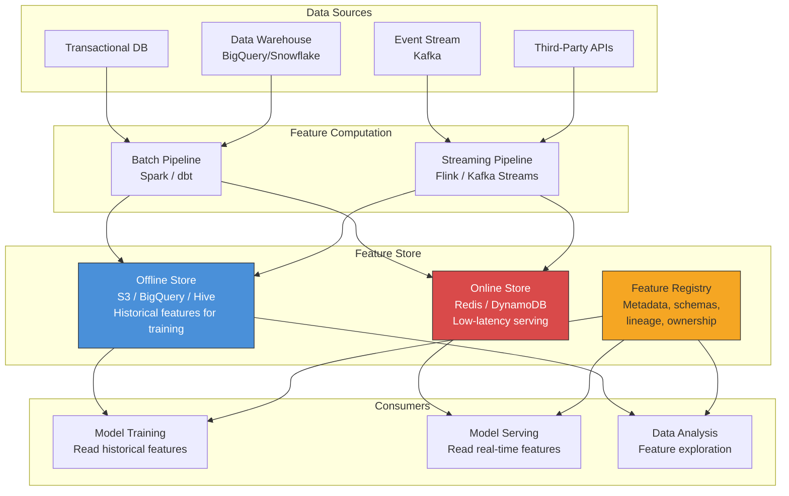

# Feature Stores

## What Is a Feature Store?

A feature store is a centralized repository for storing, managing, and serving
ML features. It acts as the data layer between raw data sources and ML models,
ensuring that features are consistent, reusable, and correctly served in both
training and inference.

```
Without a Feature Store:
  
  Data Scientist A:  raw_data → Jupyter notebook → custom feature code → model A
  Data Scientist B:  raw_data → different notebook → same features (different code) → model B
  ML Engineer:       raw_data → yet another implementation → production serving
  
  Result: 3 implementations of the same feature, subtle differences, bugs

With a Feature Store:
  
  Feature Engineer:  raw_data → feature pipeline → Feature Store (single source of truth)
  Data Scientist A:  Feature Store → model A training
  Data Scientist B:  Feature Store → model B training
  ML Engineer:       Feature Store → production serving
  
  Result: One definition, consistent everywhere
```

---

## The Training-Serving Skew Problem

The single most important reason feature stores exist.

```
Training-Serving Skew:
  Features computed DIFFERENTLY during training vs. serving,
  causing model performance degradation in production.

Example — "Average order value in last 7 days":

  Training (offline, batch):
    SELECT AVG(order_value)
    FROM orders
    WHERE user_id = ? AND order_date BETWEEN (label_date - 7) AND label_date
    → Uses SQL on data warehouse, computes exactly

  Serving (online, real-time):
    redis.get(f"user:{user_id}:avg_order_7d")
    → Pre-computed value, might be stale by hours
    → Different rounding, different null handling
    → Might include today's orders (data leakage!)

Consequences:
  - Model accuracy drops 5-15% in production vs. offline evaluation
  - Extremely hard to debug ("model worked great offline!")
  - Silent failures: no errors, just degraded predictions
```

Feature stores solve this by ensuring the same feature transformation code
produces features for both training and serving.

---

## Architecture Overview



---

## Online Store

The online store serves features at low latency for real-time model inference.

```
Requirements:
  - Latency: p99 < 5ms for feature lookup
  - Throughput: 100K+ reads per second
  - Freshness: features updated within seconds to minutes
  - Availability: 99.99% uptime (models depend on it)

Storage backends:
  +------------------+------------+-----------+------------------+
  | Backend          | Latency    | Scale     | Best For         |
  +------------------+------------+-----------+------------------+
  | Redis            | < 1ms      | TB scale  | Most use cases   |
  | DynamoDB         | < 5ms      | Unlimited | AWS-native, high |
  |                  |            |           | availability     |
  | Bigtable         | < 5ms      | PB scale  | GCP, wide rows   |
  | Cassandra        | < 10ms     | PB scale  | Multi-region     |
  +------------------+------------+-----------+------------------+

Data model (key-value):
  Key: (entity_type, entity_id, feature_group)
  Value: {feature_name: value, feature_name: value, ...}

  Example:
    Key:   ("user", "user_123", "purchase_features")
    Value: {
      "avg_order_value_7d": 45.50,
      "total_orders_30d": 12,
      "last_order_category": "electronics",
      "updated_at": "2026-04-07T10:30:00Z"
    }
```

### Online Store Access Pattern

```python
# Typical feature serving flow
class FeatureServer:
    def __init__(self):
        self.redis = Redis(host="feature-store.internal", port=6379)
    
    def get_features(self, user_id: str, feature_names: list[str]) -> dict:
        """Retrieve features for real-time inference. p99 < 5ms."""
        key = f"user:{user_id}:features"
        values = self.redis.hmget(key, feature_names)
        return dict(zip(feature_names, values))
    
    def get_batch_features(self, user_ids: list[str], feature_names: list[str]) -> list[dict]:
        """Pipeline multiple lookups for batch serving."""
        pipe = self.redis.pipeline()
        for uid in user_ids:
            pipe.hmget(f"user:{uid}:features", feature_names)
        results = pipe.execute()
        return [dict(zip(feature_names, vals)) for vals in results]

# Usage at inference time
features = feature_server.get_features("user_123", [
    "avg_order_value_7d",
    "total_orders_30d",
    "favorite_category_embedding"
])
prediction = model.predict(features)
```

---

## Offline Store

The offline store holds historical feature values for model training and
batch analysis.

```
Requirements:
  - Storage: petabytes of historical feature data
  - Query: efficient time-range queries and joins
  - Cost: low cost per GB (cold storage acceptable)
  - Correctness: point-in-time accurate feature retrieval

Storage backends:
  +------------------+------------------+--------------------------------+
  | Backend          | Query Engine     | Best For                       |
  +------------------+------------------+--------------------------------+
  | S3 + Parquet     | Spark / Athena   | Cost-effective, Parquet is     |
  |                  |                  | columnar and efficient         |
  +------------------+------------------+--------------------------------+
  | BigQuery         | Native SQL       | GCP ecosystem, serverless      |
  +------------------+------------------+--------------------------------+
  | Snowflake        | Native SQL       | Multi-cloud, data sharing      |
  +------------------+------------------+--------------------------------+
  | Delta Lake       | Spark            | ACID transactions, versioning  |
  +------------------+------------------+--------------------------------+

Schema (time-series of features):
  +-----------+---------------------+-------------------+------------------+
  | entity_id | event_timestamp     | avg_order_7d      | total_orders_30d |
  +-----------+---------------------+-------------------+------------------+
  | user_123  | 2026-01-01 00:00:00 | 42.00             | 8                |
  | user_123  | 2026-01-02 00:00:00 | 43.50             | 9                |
  | user_123  | 2026-01-03 00:00:00 | 41.20             | 9                |
  | user_456  | 2026-01-01 00:00:00 | 120.00            | 3                |
  +-----------+---------------------+-------------------+------------------+
```

---

## Feature Computation Pipelines

### Batch Features (Spark / dbt)

```python
# Spark batch feature pipeline — runs nightly
from pyspark.sql import SparkSession, functions as F, Window

spark = SparkSession.builder.appName("feature_pipeline").getOrCreate()

orders = spark.read.parquet("s3://data-lake/orders/")

# Define 7-day rolling window
window_7d = Window.partitionBy("user_id") \
    .orderBy("order_date") \
    .rangeBetween(-7 * 86400, 0)  # 7 days in seconds

user_features = orders.withColumn(
    "avg_order_value_7d", F.avg("order_value").over(window_7d)
).withColumn(
    "total_orders_7d", F.count("order_id").over(window_7d)
).withColumn(
    "max_order_value_7d", F.max("order_value").over(window_7d)
)

# Write to offline store (S3/Parquet)
user_features.write.mode("append").parquet("s3://feature-store/user_features/")

# Materialize latest values to online store (Redis)
latest_features = user_features.groupBy("user_id").agg(
    F.last("avg_order_value_7d").alias("avg_order_value_7d"),
    F.last("total_orders_7d").alias("total_orders_7d"),
)
write_to_redis(latest_features)  # custom sink
```

### Streaming Features (Flink / Kafka Streams)

```python
# Flink streaming feature computation
# Updates online store within seconds of new events

# Pseudocode for Flink pipeline
class OrderFeatureFunction(ProcessWindowFunction):
    def process(self, key, context, elements):
        """Sliding window: 7-day window, updated every minute."""
        user_id = key
        order_values = [e.order_value for e in elements]
        
        features = {
            "avg_order_value_7d": sum(order_values) / len(order_values),
            "total_orders_7d": len(order_values),
            "max_order_value_7d": max(order_values),
        }
        
        # Write to online store immediately
        redis_client.hmset(f"user:{user_id}:features", features)
        
        # Also write to offline store for training data consistency
        write_to_s3(user_id, context.window.end, features)

# Pipeline definition
env = StreamExecutionEnvironment.get_execution_environment()
orders = env.add_source(KafkaSource("order-events"))

orders \
    .key_by(lambda e: e.user_id) \
    .window(SlidingEventTimeWindows.of(Time.days(7), Time.minutes(1))) \
    .process(OrderFeatureFunction())
```

### Batch vs. Streaming Feature Comparison

```
+------------------+------------------------+---------------------------+
| Aspect           | Batch                  | Streaming                 |
+------------------+------------------------+---------------------------+
| Freshness        | Hours (daily/hourly)   | Seconds to minutes        |
| Complexity       | Simple SQL/Spark       | Windowing, state mgmt     |
| Cost             | Lower (periodic)       | Higher (always running)   |
| Use case         | Historical aggregates  | Real-time signals         |
| Example features | avg_spend_last_30d     | items_viewed_this_session |
| Failure mode     | Stale features         | Dropped events, backlog   |
+------------------+------------------------+---------------------------+

Rule of thumb:
  - If the feature changes hourly or slower → batch
  - If the feature changes per-session or faster → streaming
  - Many systems use BOTH: batch for slow features + streaming for fast features
```

---

## Feature Engineering Patterns

### Common Transformations

```
1. Aggregations (time-windowed):
   - count, sum, avg, min, max, std over 1h, 1d, 7d, 30d windows
   - Example: "total_clicks_last_24h", "avg_order_value_7d"

2. Ratios and Rates:
   - click_through_rate = clicks / impressions
   - conversion_rate = purchases / visits
   - cancel_rate_7d = cancellations_7d / orders_7d

3. Recency Features:
   - hours_since_last_order
   - days_since_last_login
   - seconds_since_last_click

4. Categorical Encoding:
   - One-hot: category → [0, 0, 1, 0, 0]
   - Frequency: category → count of occurrences
   - Target encoding: category → mean of target variable

5. Embedding Features:
   - Text → BERT/sentence-transformer embedding (768-dim vector)
   - Images → ResNet/CLIP embedding (512-dim vector)
   - User history → sequence model embedding

6. Cross Features:
   - user_category_affinity = user embedding · category embedding
   - time_location_interaction = hour_of_day × is_weekend × city
```

---

## Point-in-Time Correctness

The most subtle and critical requirement for feature stores.

```
Problem — Data Leakage:

  Training example: "Did user_123 purchase on 2026-01-15?"
  Feature needed: "avg_order_value_7d as of 2026-01-15"
  
  WRONG: Query latest features (includes data AFTER Jan 15)
    SELECT avg_order_value_7d FROM features WHERE user_id = 'user_123'
    → This might use orders from Jan 16, 17, 18 (future data!)
    → Model sees the future during training, fails in production
  
  CORRECT: Query features AS OF Jan 15
    SELECT avg_order_value_7d 
    FROM features 
    WHERE user_id = 'user_123' 
      AND event_timestamp <= '2026-01-15'
    ORDER BY event_timestamp DESC
    LIMIT 1
    → Uses only data available at prediction time

Visual timeline:
  
  Jan 8  Jan 9  Jan 10 ... Jan 14  Jan 15  Jan 16  Jan 17
  |------|------|----------|-------|--------|-------|------|
  ←── 7-day window for Jan 15 ──→  |
                            features │ label
                            computed │ (purchase?)
                            here     │
                                     
  Only orders from Jan 8-14 should be used for the feature.
  Any order on Jan 15 or later is DATA LEAKAGE.
```

### Point-in-Time Join

```python
# Correct point-in-time join for training data
def point_in_time_join(labels_df, features_df):
    """
    For each label row, find the most recent feature values
    that were available BEFORE the label timestamp.
    """
    # Sort features by timestamp
    features_df = features_df.sort_values("event_timestamp")
    
    result = []
    for _, label_row in labels_df.iterrows():
        entity_id = label_row["entity_id"]
        label_time = label_row["label_timestamp"]
        
        # Get features BEFORE label timestamp
        available_features = features_df[
            (features_df["entity_id"] == entity_id) &
            (features_df["event_timestamp"] <= label_time)
        ]
        
        if len(available_features) > 0:
            latest_features = available_features.iloc[-1]
            merged = {**label_row.to_dict(), **latest_features.to_dict()}
            result.append(merged)
    
    return pd.DataFrame(result)

# Feast handles this automatically:
# training_data = store.get_historical_features(
#     entity_df=labels_with_timestamps,
#     features=["user_features:avg_order_7d", "user_features:total_orders_30d"]
# )
```

---

## Technology Landscape

### Feast (Open Source Feature Store)

```python
# feast_repo/feature_definitions.py
from feast import Entity, Feature, FeatureView, FileSource, ValueType
from datetime import timedelta

# Define entity
user = Entity(
    name="user_id",
    value_type=ValueType.STRING,
    description="Unique user identifier"
)

# Define data source
user_features_source = FileSource(
    path="s3://data-lake/user_features.parquet",
    event_timestamp_column="event_timestamp",
    created_timestamp_column="created_at",
)

# Define feature view
user_purchase_features = FeatureView(
    name="user_purchase_features",
    entities=["user_id"],
    ttl=timedelta(days=1),  # features expire after 1 day
    features=[
        Feature(name="avg_order_value_7d", dtype=ValueType.FLOAT),
        Feature(name="total_orders_30d", dtype=ValueType.INT64),
        Feature(name="favorite_category", dtype=ValueType.STRING),
        Feature(name="days_since_last_order", dtype=ValueType.FLOAT),
    ],
    online=True,   # materialize to online store
    source=user_features_source,
)
```

```bash
# Feast CLI workflow
feast apply                    # Register feature definitions
feast materialize-incremental  # Push latest features to online store

# In training code:
# training_df = store.get_historical_features(entity_df, feature_refs)

# In serving code:
# features = store.get_online_features(entity_rows, feature_refs)
```

### Technology Comparison

```
+---------------------+----------+------------------+----------------------------+
| Feature Store       | Type     | Online Store     | Key Differentiator         |
+---------------------+----------+------------------+----------------------------+
| Feast               | OSS      | Redis, DynamoDB  | Open source, flexible,     |
|                     |          | SQLite           | large community            |
+---------------------+----------+------------------+----------------------------+
| Tecton              | Managed  | DynamoDB         | Real-time feature eng,     |
|                     |          |                  | stream processing built-in |
+---------------------+----------+------------------+----------------------------+
| Hopsworks           | OSS/Mgd  | RonDB (MySQL     | End-to-end ML platform,    |
|                     |          | NDB Cluster)     | strong data versioning     |
+---------------------+----------+------------------+----------------------------+
| AWS SageMaker FS    | Managed  | DynamoDB         | Deep AWS integration,      |
|                     |          |                  | auto-scaling               |
+---------------------+----------+------------------+----------------------------+
| Vertex AI FS        | Managed  | Bigtable         | GCP-native, BigQuery       |
| (Google)            |          |                  | integration                |
+---------------------+----------+------------------+----------------------------+
| Databricks FS       | Managed  | Delta Lake       | Unity Catalog integration, |
|                     |          |                  | Spark-native               |
+---------------------+----------+------------------+----------------------------+
```

---

## Real-World Feature Store Deployments

### Uber Michelangelo

```
Uber's ML platform (2017+) — one of the first feature stores at scale.

Scale:
  - 10,000+ features across hundreds of models
  - Features used by: ETA prediction, surge pricing, fraud detection,
    driver matching, restaurant ranking

Architecture:
  - Offline: Hive data warehouse for historical features
  - Online: Cassandra for real-time feature serving
  - Computation: Spark (batch) + Flink (streaming)
  
  Key features served:
    - "avg_trip_time_last_30d" (batch, updated nightly)
    - "driver_trips_completed_today" (streaming, real-time)
    - "surge_multiplier_current_zone" (streaming, sub-second)

Lessons learned:
  - Feature discovery is critical (engineers couldn't find existing features)
  - Built a feature catalog with search, lineage, and ownership
  - Feature quality monitoring prevents silent failures
  - Backfill capability needed when adding features to existing models
```

### Spotify Feature Platform

```
Spotify's feature infrastructure serves multiple ML systems:
  - Music recommendations (Discover Weekly, Daily Mix)
  - Podcast recommendations
  - Search ranking
  - Ad targeting

Key design decisions:
  - Built on GCP (BigQuery offline, Bigtable online)
  - Feature definitions as code (version-controlled, reviewed)
  - Automatic backfill: when a new feature is defined,
    automatically compute historical values
  - Feature monitoring: automated drift detection,
    alerting when feature distributions shift

Scale:
  - 1000s of features
  - Billions of feature reads per day (online)
  - PB of historical feature data (offline)
```

### DoorDash Feature Store

```
DoorDash built a custom feature store for delivery optimization:

Use cases:
  - ETA prediction: estimated delivery time
  - Store ranking: which restaurants to show
  - Fraud detection: flagging suspicious orders
  - Dynamic pricing: surge pricing

Feature computation challenges:
  - Real-time features: "current_queue_length_at_restaurant"
    → Must be fresh (within 30 seconds)
    → Computed from live order stream via Flink

  - Near-real-time: "avg_delivery_time_last_2h_for_restaurant"
    → Updated every few minutes
    → Aggregation over recent delivery completions

  - Batch: "restaurant_avg_rating_30d"
    → Updated nightly
    → Computed from ratings data warehouse

Architecture:
  Online store: Redis Cluster (sub-ms reads)
  Offline store: Snowflake (historical queries for training)
  Streaming: Apache Flink for real-time feature computation
  Batch: Apache Spark for nightly aggregations
```

---

## Feature Store Anti-Patterns

```
1. Feature Store as Data Warehouse
   WRONG: Dumping all data into the feature store
   RIGHT: Only store transformed, model-ready features

2. Ignoring Point-in-Time
   WRONG: Always reading latest feature values for training
   RIGHT: Use point-in-time joins to prevent data leakage

3. No Feature Monitoring
   WRONG: Assume features are always correct
   RIGHT: Monitor feature distributions, freshness, and null rates

4. Copy-Paste Features
   WRONG: Each team defines their own "user_age" feature
   RIGHT: Single canonical definition, shared across teams

5. No Feature Documentation
   WRONG: Feature named "f_42" with no description
   RIGHT: Clear name, description, owner, and lineage

6. Online/Offline Code Divergence
   WRONG: Separate codebases for batch and serving feature computation
   RIGHT: Single feature definition that generates both batch and online code
```

---

## Feature Store Design Interview Considerations

```
When asked "Design a Feature Store" in an interview:

1. Start with WHY:
   - Training-serving skew is the core problem
   - Feature reuse across teams saves engineering time
   - Point-in-time correctness prevents data leakage

2. Dual-store architecture:
   - Online (Redis/DynamoDB): low-latency serving
   - Offline (S3/warehouse): historical training data
   - Registry: metadata, schemas, ownership

3. Feature computation:
   - Batch: Spark/dbt for historical aggregations
   - Streaming: Flink/Kafka Streams for real-time
   - Same transformation code for both

4. Key APIs:
   - get_online_features(entity_keys, feature_names) → dict
   - get_historical_features(entity_df_with_timestamps, feature_names) → DataFrame
   - materialize(feature_view, start_date, end_date)

5. Scale numbers to mention:
   - Online reads: p99 < 5ms, 100K+ QPS
   - Offline store: PBs of historical data
   - Feature freshness: seconds (streaming) to hours (batch)

6. Governance:
   - Feature versioning and deprecation policy
   - Access control (PII features restricted)
   - Lineage tracking (which raw data produces which features)
   - Quality monitoring (distribution drift, null rates, freshness SLAs)
```
