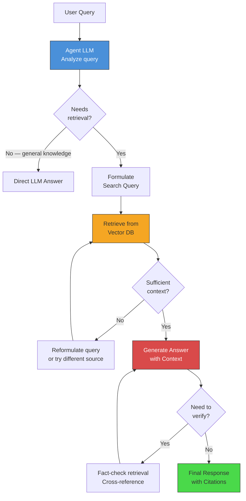

# LLM Serving and RAG (Retrieval-Augmented Generation)

## LLM Serving Challenges

Large Language Models present unique serving challenges that differ fundamentally
from traditional ML model serving.

### The Scale Problem

```
Model Size (weights only, FP16):
  GPT-2:       1.5B params =    3 GB
  LLaMA-7B:      7B params =   14 GB
  LLaMA-70B:    70B params =  140 GB
  GPT-3:       175B params =  350 GB
  GPT-4:      ~1.8T params = ~3.6 TB (estimated, MoE)

GPU Memory (VRAM):
  NVIDIA A100:   80 GB
  NVIDIA H100:   80 GB
  NVIDIA A10G:   24 GB (common cloud GPU)
  Apple M2 Max:  96 GB (unified memory, but slower)

The math does not work:
  GPT-3 (350 GB) CANNOT fit on a single A100 (80 GB).
  Even LLaMA-70B (140 GB) needs 2+ A100s just for weights.
  
  But it gets worse — during inference you also need memory for:
  - KV Cache: grows linearly with sequence length and batch size
  - Activations: intermediate computation buffers
  
  For LLaMA-70B with batch_size=8, context_length=4096:
    Weights:   140 GB
    KV Cache:  ~40 GB  (depends on num_layers, num_heads, head_dim)
    Overhead:  ~20 GB
    Total:     ~200 GB → needs 3x A100 80GB GPUs
```

### The Latency Problem

```
Autoregressive generation is fundamentally sequential:
  
  Token 1 → Token 2 → Token 3 → ... → Token N
  
  Each token depends on ALL previous tokens.
  Cannot parallelize the generation of a single sequence.

Time to generate 500 tokens on A100 (LLaMA-70B):
  - Prefill (process input prompt):     ~200ms for 1000 input tokens
  - Decode (generate output tokens):    ~25ms per token × 500 = 12.5 seconds
  - Total: ~12.7 seconds for one response

The bottleneck:
  - Prefill is compute-bound (matrix multiplications, parallelizable)
  - Decode is memory-bandwidth-bound (loading weights for one token at a time)
  - GPU utilization during decode: often < 10% of theoretical FLOPS
```

---

## Serving Optimizations

### KV Cache

```
Problem: Without caching, generating token N requires recomputing
attention over ALL previous N-1 tokens.

Without KV Cache (naive):
  Generate token 1: process [prompt]                    → compute attention for all
  Generate token 2: process [prompt, token_1]           → RECOMPUTE all attention
  Generate token 3: process [prompt, token_1, token_2]  → RECOMPUTE everything again
  
  Cost: O(N^2) in sequence length — each new token reprocesses everything.

With KV Cache:
  Generate token 1: compute K1, V1 → cache them → output token 1
  Generate token 2: compute K2, V2 → cache them → attend to [K1,K2], [V1,V2]
  Generate token 3: compute K3, V3 → cache them → attend to [K1,K2,K3], [V1,V2,V3]
  
  Cost: O(N) per token — only compute attention for the new token
        against cached K,V from all previous tokens.

Memory cost of KV Cache:
  Per token per layer: 2 × num_heads × head_dim × sizeof(dtype)
  For LLaMA-70B (80 layers, 64 heads, dim 128, FP16):
    Per token: 2 × 80 × 64 × 128 × 2 bytes = 2.6 MB
    For 4096 tokens: 2.6 MB × 4096 = 10.5 GB per sequence
    For batch of 8: 84 GB just for KV cache
```

### Continuous Batching (vLLM)

```
Problem with static batching:
  Request A: "Translate this paragraph"    → generates 50 tokens
  Request B: "Write a 500-word essay"      → generates 500 tokens
  
  Static batch: must wait for LONGEST request to finish
  GPU sits idle after Request A finishes (wasting 90% of time for A's slot)

  Timeline (static batching):
    GPU slot 1: |===A (50 tokens)===|--------idle---------|
    GPU slot 2: |===B (500 tokens)==============================|
                                    ↑ A finishes, slot wasted

Continuous batching (iteration-level scheduling):
  - After EACH decode step, check for completed and new requests
  - Immediately slot in new requests when others complete
  - GPU never has idle slots

  Timeline (continuous batching):
    GPU slot 1: |===A===|===C===|===D===|===E===|===F===|
    GPU slot 2: |===B (500 tokens)==============================|
                        ↑ A done, C immediately starts

Result: 2-5x higher throughput (more requests per second per GPU)
```

### PagedAttention (vLLM)

```
Problem: KV cache memory is allocated contiguously per request.
  - Must pre-allocate for max sequence length
  - Cannot share memory between requests
  - Massive fragmentation and waste

  Request A (actual: 200 tokens, allocated: 2048):
    [used: 200 tokens][wasted: 1848 tokens of GPU memory]

PagedAttention (inspired by OS virtual memory):
  - KV cache stored in fixed-size "pages" (blocks of tokens)
  - Pages allocated on demand, not pre-allocated
  - Physical pages can be non-contiguous
  - Pages can be shared across requests (e.g., shared system prompt)

  Page table for Request A:
    Logical page 0 → Physical page 7
    Logical page 1 → Physical page 12
    Logical page 2 → Physical page 3   (allocated when needed)

  Shared prefix ("You are a helpful assistant..."):
    Request A page 0 ─→ Physical page 7 ←─ Request B page 0
    (Same physical memory, read-only, copy-on-write for divergence)

Memory savings: 60-80% reduction in KV cache memory waste
  → Can serve 2-4x more concurrent requests
```

### Speculative Decoding

```
Problem: Large model generates one token at a time (slow).
Idea: Use a small, fast model to "guess" multiple tokens ahead,
      then verify the guesses with the large model in parallel.

Algorithm:
  1. Small model (e.g., 1B params) generates K draft tokens quickly
     Draft: [token_A, token_B, token_C, token_D]  (4 tokens in ~4ms)
  
  2. Large model (e.g., 70B params) verifies ALL K+1 positions in ONE forward pass
     Verify: position 1 → accept token_A ✓
             position 2 → accept token_B ✓
             position 3 → REJECT token_C ✗ (large model would have said token_X)
             → Accept tokens A, B; use token_X at position 3
  
  3. Result: generated 3 tokens in time of 1 large model forward pass + 1 small model pass
     vs. 3 large model forward passes without speculation

Speedup: 2-3x for well-matched draft/target model pairs
Key insight: Verification is parallel (just a forward pass), generation is sequential
```

### Parallelism Strategies for LLMs

```
Tensor Parallelism (TP):
  Split individual layers across GPUs.
  
  Linear layer W (shape: 4096 × 4096):
    GPU 0: W[:, :2048]     (left half of columns)
    GPU 1: W[:, 2048:]     (right half of columns)
  
  Each GPU computes partial result, then AllReduce to combine.
  Best for: within a single node (high-bandwidth NVLink between GPUs)

Pipeline Parallelism (PP):
  Split model layers sequentially across GPUs.
  
  GPU 0: Layers 0-19     → forward → send activations →
  GPU 1: Layers 20-39    → forward → send activations →
  GPU 2: Layers 40-59    → forward → send activations →
  GPU 3: Layers 60-79    → forward → output
  
  With micro-batching to keep all GPUs busy.
  Best for: across nodes (lower bandwidth interconnect)

Combined (3D Parallelism):
  Data Parallelism × Tensor Parallelism × Pipeline Parallelism
  
  Example: 64 GPUs for serving LLaMA-70B
    PP = 2 (split model into 2 pipeline stages)
    TP = 4 (each stage split across 4 GPUs)
    DP = 8 (8 replicas for throughput)
    Total: 2 × 4 × 8 = 64 GPUs
```

### Quantization for LLMs

```
FP16 → INT8 → INT4: Trade precision for speed and memory.

  LLaMA-70B:
    FP16:  140 GB → 2x A100 minimum
    INT8:   70 GB → fits on 1x A100
    INT4:   35 GB → fits on 1x A100 with room for KV cache

Techniques:
  GPTQ: Post-training quantization, layer-by-layer
    - Uses small calibration dataset
    - INT4 with minimal accuracy loss
    - Static quantization (weights only)
  
  AWQ (Activation-Aware Weight Quantization):
    - Preserves salient weights at higher precision
    - Observation: 1% of weights are critical, protect them
    - Better accuracy than GPTQ at same bit width
  
  GGML/GGUF (llama.cpp):
    - CPU-optimized quantization formats
    - Q4_0, Q4_1, Q5_0, Q5_1, Q8_0 variants
    - Enables LLM inference on consumer hardware

Accuracy impact (LLaMA-70B on benchmarks):
  FP16:  baseline (100%)
  INT8:  ~99.5% of FP16 quality
  INT4:  ~97-99% of FP16 quality (model-dependent)
  INT3:  ~93-95% — noticeable degradation
```

---

## RAG (Retrieval-Augmented Generation)

### Why RAG?

```
LLM Limitations:
  1. Hallucination: Generates plausible but incorrect facts
     "The Eiffel Tower was built in 1872" (actually 1889)
  
  2. Knowledge cutoff: Training data has a fixed date
     "Who won the 2026 World Cup?" → "I don't have information after my cutoff"
  
  3. No private data: Cannot access company-internal documents
     "What is our Q3 revenue?" → Cannot answer without retrieval
  
  4. No source attribution: Cannot cite where information came from
     Users cannot verify or trust the answer

RAG solves all four:
  1. Ground answers in retrieved documents (less hallucination)
  2. Retrieve from up-to-date knowledge base (no cutoff)
  3. Connect to private document stores (enterprise search)
  4. Cite source documents (verifiable answers)
```

### RAG Architecture

```mermaid
graph TD
    subgraph Indexing Pipeline — Offline
        A[Documents<br/>PDFs, web pages,<br/>internal docs] --> B[Chunking<br/>Split into passages]
        B --> C[Embedding Model<br/>text → dense vector]
        C --> D[Vector Database<br/>Store embeddings + text]
    end

    subgraph Query Pipeline — Online
        E[User Query] --> F[Query Embedding<br/>Same embedding model]
        F --> G[Vector Search<br/>Top-K similar chunks]
        G --> H[Retrieved Chunks<br/>K relevant passages]
        H --> I[Prompt Construction<br/>Query + Retrieved Context]
        I --> J[LLM Generation<br/>Answer grounded in context]
        J --> K[Response with<br/>Source Citations]
    end

    D --> G

    style A fill:#e8e8e8,stroke:#333
    style D fill:#4a90d9,stroke:#333,color:#fff
    style G fill:#f5a623,stroke:#333
    style J fill:#d94a4a,stroke:#333,color:#fff
    style K fill:#4ad94a,stroke:#333
```

### Embedding Models

```
Convert text into dense vector representations for similarity search.

Models:
  +---------------------------+-----------+---------------------------+
  | Model                     | Dimension | Notes                     |
  +---------------------------+-----------+---------------------------+
  | OpenAI text-embedding-3   | 256-3072  | Best quality, API-based   |
  | Cohere embed-v3           | 1024      | Multilingual, compression |
  | BGE-large (BAAI)          | 1024      | Open source, strong perf  |
  | E5-large-v2 (Microsoft)   | 1024      | Open source, instruction  |
  | all-MiniLM-L6-v2          | 384       | Fast, lightweight         |
  | GTE-large (Alibaba)       | 1024      | Open source, multilingual |
  | Nomic-embed-text          | 768       | Open, long context (8192) |
  +---------------------------+-----------+---------------------------+

Key properties:
  - Semantic similarity: similar meanings → close vectors
    "How do I reset my password?" ≈ "I forgot my login credentials"
  - Asymmetric: query embedding and document embedding may use
    different instructions (query: "search_query: ...", doc: "search_document: ...")
```

```python
# Generating embeddings with sentence-transformers
from sentence_transformers import SentenceTransformer

model = SentenceTransformer("BAAI/bge-large-en-v1.5")

# Embed documents (offline, during indexing)
documents = [
    "The Eiffel Tower was completed in 1889 for the World's Fair.",
    "Machine learning is a subset of artificial intelligence.",
    "Python was created by Guido van Rossum in 1991.",
]
doc_embeddings = model.encode(documents, normalize_embeddings=True)

# Embed query (online, at query time)
query = "When was the Eiffel Tower built?"
query_embedding = model.encode(query, normalize_embeddings=True)

# Cosine similarity (dot product since normalized)
import numpy as np
similarities = doc_embeddings @ query_embedding
# → [0.87, 0.12, 0.08] — first document is most relevant
```

### Vector Databases

```
Purpose: Store millions/billions of vectors, enable fast similarity search.

Comparison:
  +------------------+--------+----------------+----------------------------+
  | Database         | Type   | Scale          | Key Features               |
  +------------------+--------+----------------+----------------------------+
  | Pinecone         | Managed| Billions       | Serverless, metadata       |
  |                  |        |                | filtering, hybrid search   |
  +------------------+--------+----------------+----------------------------+
  | Milvus           | OSS    | Billions       | GPU-accelerated, multiple  |
  |                  |        |                | index types, cloud/self    |
  +------------------+--------+----------------+----------------------------+
  | Weaviate         | OSS    | Billions       | GraphQL API, modules       |
  |                  |        |                | for vectorization          |
  +------------------+--------+----------------+----------------------------+
  | Chroma           | OSS    | Millions       | Simple API, great for      |
  |                  |        |                | prototyping and dev        |
  +------------------+--------+----------------+----------------------------+
  | pgvector         | PG ext | Millions       | PostgreSQL extension,      |
  |                  |        |                | familiar SQL + vectors     |
  +------------------+--------+----------------+----------------------------+
  | Qdrant           | OSS    | Billions       | Rust-based, fast,          |
  |                  |        |                | advanced filtering         |
  +------------------+--------+----------------+----------------------------+
  | FAISS (Meta)     | Library| Billions       | Research-grade, many       |
  |                  |        |                | index types, GPU support   |
  +------------------+--------+----------------+----------------------------+

Index types:
  - HNSW (Hierarchical Navigable Small World):
    Best quality, O(log N) search, memory-intensive
    Used by most vector DBs as default
  
  - IVF (Inverted File Index):
    Partition space into clusters, search nearest clusters
    Good balance of speed/memory/quality
  
  - PQ (Product Quantization):
    Compress vectors for memory savings (10-50x)
    Slight quality loss, great for billion-scale
```

### Chunking Strategies

```
Documents must be split into chunks for embedding and retrieval.
Chunk size and strategy dramatically affect RAG quality.

1. Fixed-Size Chunking:
   - Split every N characters/tokens (e.g., 512 tokens)
   - With overlap (e.g., 50 token overlap)
   - Simple but breaks mid-sentence/mid-paragraph
   
   "The Eiffel Tower was completed | in 1889. It stands 330 meters | tall in Paris, France."
                                    ↑ bad split

2. Recursive Character Splitting (LangChain default):
   - Try splitting by: paragraph → sentence → word → character
   - Prefer natural boundaries
   - Most commonly used in practice
   
   Split hierarchy: "\n\n" → "\n" → ". " → " " → ""

3. Semantic Chunking:
   - Embed each sentence
   - Group consecutive sentences with high similarity
   - Split where similarity drops (topic change)
   
   Sentence embeddings: [0.9, 0.85, 0.88, 0.3, 0.7, 0.72]
                                           ↑ topic change → split here

4. Document-Structure-Aware:
   - Use document structure: headers, sections, tables
   - Markdown: split at ## headers
   - HTML: split at semantic tags
   - PDF: use layout analysis

Chunk size guidelines:
  - Too small (100 tokens): loses context, retrieves fragments
  - Too large (2000 tokens): dilutes relevance, wastes context window
  - Sweet spot: 256-512 tokens with 50-100 token overlap
  - Experiment: optimal size is domain and use-case dependent
```

```python
# Recursive character splitter with LangChain
from langchain.text_splitter import RecursiveCharacterTextSplitter

splitter = RecursiveCharacterTextSplitter(
    chunk_size=512,
    chunk_overlap=50,
    separators=["\n\n", "\n", ". ", " ", ""],
    length_function=len,
)

chunks = splitter.split_text(document_text)
# Each chunk: ~512 chars, split at natural boundaries, 50-char overlap
```

### Retrieval Strategies

```
1. Dense Retrieval (Embedding Similarity):
   Query → embedding → cosine similarity against document embeddings
   
   Pros: Captures semantic meaning ("car" matches "automobile")
   Cons: May miss exact keyword matches, computationally expensive
   
2. Sparse Retrieval (BM25):
   Query → term frequency analysis → BM25 scoring
   
   BM25 score(q, d) = Σ IDF(qi) × (f(qi,d) × (k1+1)) / (f(qi,d) + k1×(1-b+b×|d|/avgdl))
   
   Pros: Exact keyword matching, fast, no ML model needed
   Cons: Misses synonyms and paraphrases
   
3. Hybrid Retrieval (Best of Both):
   Run BOTH dense and sparse, then combine results.
   
   Combination method — Reciprocal Rank Fusion (RRF):
     RRF_score(d) = Σ 1 / (k + rank_i(d))
     
     Where rank_i(d) is the rank of document d in retrieval method i
     k is a constant (typically 60)
   
   Example:
     Dense results:  [doc_A (rank 1), doc_B (rank 2), doc_C (rank 3)]
     Sparse results: [doc_B (rank 1), doc_D (rank 2), doc_A (rank 3)]
     
     RRF(doc_A) = 1/(60+1) + 1/(60+3) = 0.0164 + 0.0159 = 0.0323
     RRF(doc_B) = 1/(60+2) + 1/(60+1) = 0.0161 + 0.0164 = 0.0325  ← highest
     RRF(doc_C) = 1/(60+3) + 0         = 0.0159
     RRF(doc_D) = 0         + 1/(60+2) = 0.0161
     
     Final ranking: [doc_B, doc_A, doc_D, doc_C]
```

### Re-Ranking

```
Problem: Initial retrieval (bi-encoder) is fast but imprecise.
Solution: Re-rank top-K results with a cross-encoder for better precision.

Bi-Encoder (retrieval, fast):
  Encode query and document SEPARATELY
  Score = dot_product(query_emb, doc_emb)
  Speed: embed once, compare millions in ms
  Quality: good but not great

Cross-Encoder (re-ranking, precise):
  Encode query AND document TOGETHER
  Score = model([query; document])  → single relevance score
  Speed: slow (must run model for each query-doc pair)
  Quality: much better than bi-encoder (sees full interaction)

Pipeline:
  1. Bi-encoder retrieves top-100 from millions (fast)
  2. Cross-encoder re-ranks top-100 → select top-5 (precise)

  1M documents → [Bi-encoder: 10ms] → 100 docs → [Cross-encoder: 200ms] → 5 docs
```

```python
# Re-ranking with a cross-encoder
from sentence_transformers import CrossEncoder

reranker = CrossEncoder("cross-encoder/ms-marco-MiniLM-L-12-v2")

query = "What causes climate change?"
# Initial retrieval results (from vector search)
candidates = [
    "Climate change is primarily caused by greenhouse gas emissions...",
    "The weather in Paris is mild in spring...",
    "CO2 levels have risen 50% since pre-industrial times...",
    "Climate scientists use models to predict temperature changes...",
]

# Cross-encoder re-ranking
pairs = [[query, doc] for doc in candidates]
scores = reranker.predict(pairs)
# scores → [0.95, 0.02, 0.88, 0.45]

# Re-ranked order: [doc_0, doc_2, doc_3, doc_1]
ranked = sorted(zip(scores, candidates), reverse=True)
```

### RAG Prompt Construction

```python
def build_rag_prompt(query: str, retrieved_chunks: list[str]) -> str:
    """Construct a prompt that grounds the LLM in retrieved context."""
    
    context = "\n\n---\n\n".join(
        f"[Source {i+1}]: {chunk}" for i, chunk in enumerate(retrieved_chunks)
    )
    
    prompt = f"""Answer the question based ONLY on the provided context.
If the context does not contain enough information, say "I don't have enough information to answer."
Always cite which source(s) you used.

Context:
{context}

Question: {query}

Answer:"""
    
    return prompt

# Example usage
chunks = retrieve_top_k(query="What is our refund policy?", k=5)
prompt = build_rag_prompt("What is our refund policy?", chunks)
response = llm.generate(prompt)
# → "Based on [Source 2], the refund policy allows returns within 30 days..."
```

### Evaluation: RAGAS Framework

```
RAGAS (Retrieval-Augmented Generation Assessment) provides metrics
for evaluating each component of a RAG system.

Metrics:
  1. Faithfulness (0-1):
     Does the answer use ONLY information from the retrieved context?
     High = no hallucination beyond retrieved documents
     
     Answer: "The policy allows 30-day returns"
     Context contains: "Returns accepted within 30 days"
     Faithfulness: 1.0 ✓

  2. Answer Relevance (0-1):
     Is the answer relevant to the question asked?
     Generated question from answer should match original question.
     
     Question: "What is our refund policy?"
     Answer: "The sky is blue."
     Relevance: 0.0 ✗

  3. Context Precision (0-1):
     Are the retrieved chunks actually relevant to the question?
     Were the relevant chunks ranked higher?
     
     Retrieved: [relevant, irrelevant, relevant, irrelevant, relevant]
     Precision: high (relevant chunks in top positions)

  4. Context Recall (0-1):
     Does the retrieved context contain all information needed to answer?
     Compare retrieved context against ground-truth answer.
     
     Ground truth mentions 3 facts; retrieved context contains 2 of them
     Recall: 0.67
```

```python
# RAGAS evaluation example
from ragas import evaluate
from ragas.metrics import faithfulness, answer_relevancy, context_precision, context_recall
from datasets import Dataset

eval_data = Dataset.from_dict({
    "question": ["What is our refund policy?", "How do I contact support?"],
    "answer": ["Returns within 30 days...", "Email support@company.com..."],
    "contexts": [
        ["Returns accepted within 30 days of purchase..."],
        ["Contact us at support@company.com or call 1-800-..."],
    ],
    "ground_truth": [
        "30-day return policy for unused items",
        "Email support@company.com or call 1-800-555-0123",
    ],
})

results = evaluate(
    dataset=eval_data,
    metrics=[faithfulness, answer_relevancy, context_precision, context_recall],
)
# results → {faithfulness: 0.92, answer_relevancy: 0.88, context_precision: 0.85, context_recall: 0.90}
```

---

## Agentic RAG

Standard RAG follows a fixed pipeline: retrieve then generate. Agentic RAG
adds an LLM-driven decision layer that can reason about when and how to retrieve.



```
Agentic capabilities:
  1. Query routing: decide WHICH knowledge base to search
     "What is our revenue?" → search financial DB
     "How do I use the API?" → search technical docs
  
  2. Query decomposition: break complex questions into sub-queries
     "Compare our Q1 and Q2 revenue" →
       Sub-query 1: "Q1 revenue figures"
       Sub-query 2: "Q2 revenue figures"
       Then: synthesize comparison
  
  3. Multi-hop reasoning: chain multiple retrievals
     "Who manages the team that built our recommendation system?" →
       Step 1: Retrieve "who built the recommendation system" → Team X
       Step 2: Retrieve "who manages Team X" → Person Y
  
  4. Self-reflection: evaluate if retrieved context is sufficient
     Retrieved context doesn't answer the question →
       Reformulate query with different keywords
       Try a different document collection
       Ask user for clarification
  
  5. Tool use: call APIs, run code, query databases beyond vector search
     "What is the current stock price of AAPL?" →
       Tool: call stock_price_api("AAPL") → $185.42
```

---

## Real-World RAG Systems

### ChatGPT (with Browse / File Upload)

```
ChatGPT's retrieval capabilities:
  - Browse: real-time web search for current information
  - File upload: RAG over user-uploaded documents
  - Code Interpreter: execute code for data analysis

Architecture (simplified):
  1. Query analysis: does this need retrieval?
  2. If yes: formulate search query → Bing search or file search
  3. Retrieve top results
  4. Generate response grounded in retrieved content
  5. Cite sources inline
```

### Perplexity

```
Search-first approach: always retrieves, then generates.

Architecture:
  1. User query → search multiple sources (web, academic, news)
  2. Retrieve and parse top results
  3. LLM synthesizes answer with inline citations [1][2][3]
  4. Display source links for verification

Key design decisions:
  - Always search (unlike ChatGPT which decides per query)
  - Multiple retrieval sources for comprehensive answers
  - Streaming response with citations appearing as generated
  - Follow-up questions to refine search
```

### Enterprise Search (Internal Knowledge Base)

```
Common architecture for enterprise RAG:

  Data sources:
    - Confluence/Notion pages
    - Slack messages
    - Google Drive / SharePoint documents
    - JIRA tickets
    - Code repositories

  Indexing pipeline:
    1. Connectors pull documents from each source
    2. Parse + clean (extract text from PDFs, HTML, etc.)
    3. Chunk with source-aware splitting
    4. Embed and store in vector DB
    5. Incremental sync (only re-index changed documents)

  Query pipeline:
    1. User asks question in chat interface
    2. Hybrid retrieval (dense + sparse)
    3. Access control filter (user can only see authorized docs)
    4. Re-rank with cross-encoder
    5. LLM generates answer with source links
    6. User clicks source to verify in original system

  Challenges:
    - Access control: respect document permissions
    - Freshness: keep index in sync with source systems
    - Multi-modal: handle images, tables, code in documents
    - Quality: measure and improve retrieval/generation quality
```

---

## Interview Questions and Answers

### Q1: "Design a RAG system for customer support"

```
Requirements clarification:
  - 10K support documents (FAQ, troubleshooting guides, product docs)
  - 1000 queries per hour
  - Latency: < 3 seconds end-to-end
  - Must not hallucinate (high faithfulness required)
  - Need source citations for agent verification

Architecture:
  Indexing:
    - Chunk documents at ~400 tokens with 50-token overlap
    - Use document-structure-aware splitting (preserve headers/sections)
    - Embed with BGE-large or OpenAI text-embedding-3-small
    - Store in Pinecone or pgvector (10K docs, modest scale)
    - Metadata: document_type, product_name, last_updated

  Retrieval:
    - Hybrid search (dense + BM25) with RRF fusion
    - Top-20 initial retrieval
    - Cross-encoder re-ranking to top-5
    - Metadata filtering: match product from query to document product

  Generation:
    - GPT-4 or Claude with structured prompt
    - Emphasize: answer ONLY from context, cite sources, say "I don't know"
    - Temperature 0 for factual consistency
    - Output: answer + confidence score + source links

  Guardrails:
    - If no relevant chunks found (max similarity < threshold) → route to human
    - If LLM response contains information not in context → flag for review
    - Feedback loop: agents rate answer quality → improve retrieval
```

### Q2: "How would you reduce LLM serving costs by 5x?"

```
Cost optimization strategies (composable, cumulative):

  1. Quantization: FP16 → INT4 (2-3x memory savings)
     → Serve LLaMA-70B on 2 GPUs instead of 4
     → Cost: ~2x savings on GPU cost

  2. KV Cache optimization + PagedAttention (vLLM):
     → Serve 3-4x more concurrent users per GPU
     → Higher utilization = lower cost per request

  3. Caching common responses:
     → Cache embedding + LLM responses for repeated queries
     → 20-40% of queries in support are duplicates
     → Semantic cache: hash of similar queries → cached response

  4. Smaller model where possible:
     → Route simple queries to 7B model, complex to 70B
     → 80% of queries might be handled by small model
     → Cost: ~4x cheaper per token for 7B vs 70B

  5. Batch requests:
     → Continuous batching maximizes GPU utilization
     → Off-peak: batch non-urgent requests

  Combined: 2x (quant) × 1.5x (caching) × 2x (routing) = 6x savings
```

### Q3: "How do you evaluate and improve RAG quality?"

```
Evaluation framework:

  1. Component-level metrics:
     Retrieval:
       - Recall@K: are the right documents retrieved?
       - MRR: is the best document ranked first?
       - Measure with labeled query-document relevance pairs
     
     Generation:
       - Faithfulness: does answer stick to context? (RAGAS)
       - Relevance: does answer address the question? (RAGAS)
       - Completeness: does answer cover all aspects?
       - Human evaluation: domain experts rate answers

  2. End-to-end metrics:
     - Accuracy on QA benchmark (domain-specific)
     - User satisfaction (thumbs up/down, CSAT)
     - Escalation rate (how often users need human help)

  3. Improvement strategies:
     Retrieval:
       - Better chunking (semantic vs fixed-size)
       - Fine-tune embedding model on domain data
       - Add metadata filtering
       - Hybrid retrieval (dense + sparse)
       - Re-ranking with cross-encoder
     
     Generation:
       - Prompt engineering (few-shot examples, format instructions)
       - Fine-tune LLM on domain QA pairs
       - Add guardrails (faithfulness check, confidence thresholds)
       - Agentic retrieval for complex multi-step questions

  4. Continuous improvement:
     - Log all queries, retrieved docs, and generated answers
     - Human annotators label a sample for quality
     - Use labels to find failure modes → targeted improvements
     - A/B test each improvement against baseline
```
