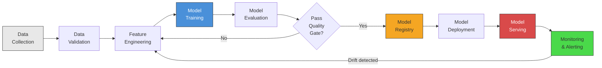
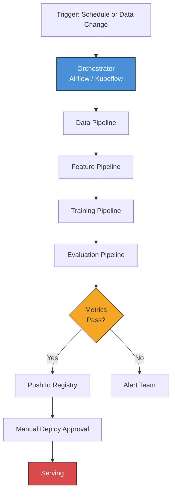
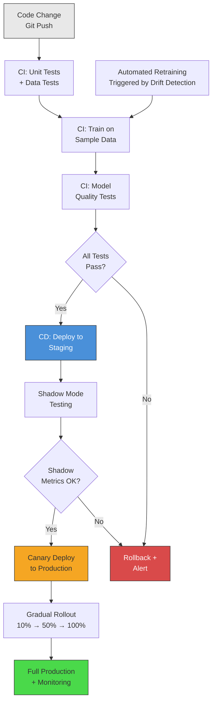
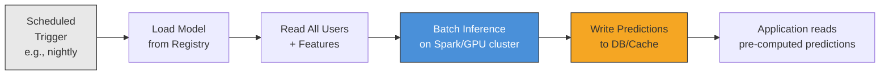
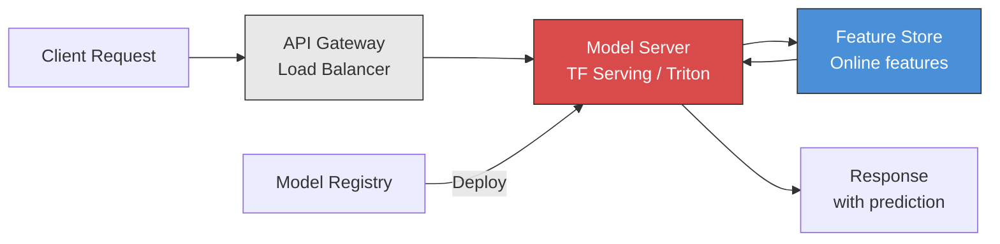
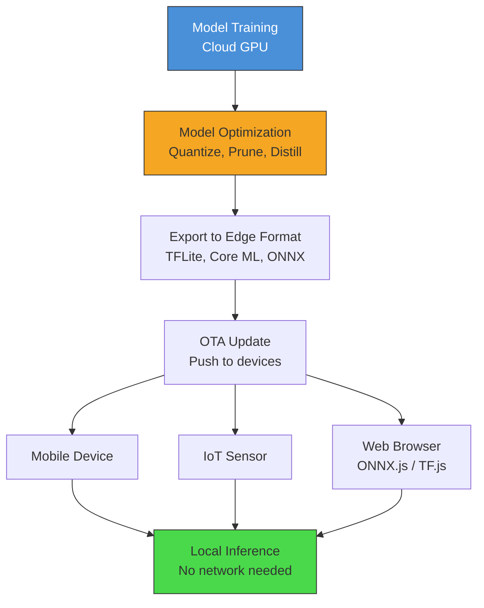
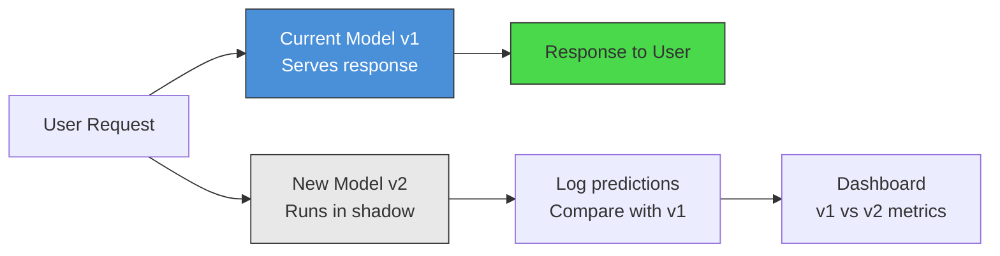

# ML Pipelines and Model Serving

## The End-to-End ML Pipeline

Building a production ML system involves far more than training a model.
Google's famous observation: **only ~5% of a production ML system is the model
code itself.** The rest is data pipelines, serving infrastructure, monitoring,
and operational tooling.



### Pipeline Components in Detail

```
1. Data Collection
   - Ingest from databases, event streams, APIs, files
   - Data versioning (DVC, LakeFS, Delta Lake)
   - Schema validation at ingestion

2. Data Validation
   - Statistical tests: distribution shifts, null rate changes
   - Schema checks: data types, ranges, cardinalities
   - Tools: Great Expectations, TensorFlow Data Validation (TFDV)

3. Feature Engineering
   - Transformations, aggregations, embeddings
   - Feature store integration (see feature-stores.md)
   - Reproducible feature computation code

4. Model Training
   - Algorithm selection, hyperparameter tuning
   - Distributed training for large models
   - Experiment tracking (MLflow, W&B)

5. Model Evaluation
   - Offline metrics: accuracy, AUC, F1, RMSE
   - Fairness evaluation: bias across demographic groups
   - Comparison against baseline and current production model

6. Model Registry
   - Version models with metadata (metrics, params, lineage)
   - Approval workflow (staging → production)
   - Artifact storage (model weights, configs)

7. Deployment
   - Containerize model serving code
   - Deploy to serving infrastructure
   - Rollout strategy (canary, shadow, A/B)

8. Monitoring
   - Input data drift, prediction drift
   - Latency, throughput, error rates
   - Business metric correlation
```

---

## MLOps Maturity Levels

Google's MLOps maturity model describes three levels of automation for ML systems.

### Level 0: Manual Process

```
+-----------+     +-----------+     +-----------+     +-----------+
| Data      | --> | Jupyter   | --> | Export    | --> | Manual    |
| scientist |     | notebook  |     | model     |     | deploy    |
| explores  |     | trains    |     | artifact  |     | to server |
+-----------+     +-----------+     +-----------+     +-----------+

Characteristics:
  - Training is a manual, interactive process
  - No pipeline automation
  - Model deployed rarely (quarterly or less)
  - No monitoring beyond basic health checks
  - Disconnect between data scientists and engineers

Typical at:
  - Early-stage startups
  - Companies just beginning ML adoption
  - Proof-of-concept / research projects
```

### Level 1: ML Pipeline Automation



```
Characteristics:
  - Automated training pipeline (Airflow, Kubeflow, Vertex Pipelines)
  - Continuous training on new data (daily/weekly retraining)
  - Experiment tracking with MLflow or Weights & Biases
  - Model registry for versioning
  - Manual deployment step (human approves model promotion)
  - Basic monitoring (accuracy drift alerts)

Typical at:
  - Companies with established ML teams
  - Multiple models in production
```

### Level 2: CI/CD for ML



```
Characteristics:
  - Full CI/CD pipeline for ML code AND model artifacts
  - Automated testing: unit tests, integration tests, model quality gates
  - Automated deployment with rollback capability
  - A/B testing and canary deployments
  - Comprehensive monitoring with automated retraining triggers
  - Feature store integration
  - Infrastructure as code (Terraform, Pulumi)

Typical at:
  - Large tech companies (Google, Netflix, Uber)
  - Companies with mature ML platform teams
```

---

## Model Training at Scale

### Distributed Training

When a single GPU cannot handle the model size or data volume.

```
Data Parallelism:
  - Same model replicated on N GPUs
  - Each GPU processes 1/N of the data batch
  - Gradients synchronized across GPUs after each step
  - Use when: model fits on one GPU, but training is slow

  GPU 0: model_copy_0(batch_0) → gradients_0 ─┐
  GPU 1: model_copy_1(batch_1) → gradients_1 ──┼→ AllReduce → averaged_gradients → update all copies
  GPU 2: model_copy_2(batch_2) → gradients_2 ──┤
  GPU 3: model_copy_3(batch_3) → gradients_3 ─┘

  Frameworks: PyTorch DDP, Horovod, TF MirroredStrategy
  Scaling: near-linear speedup up to ~64 GPUs (communication bottleneck after)

Model Parallelism:
  - Model split across multiple GPUs
  - Each GPU holds a portion of the model
  - Use when: model does NOT fit on one GPU (LLMs, large vision models)

  Tensor Parallelism: split individual layers across GPUs
    Layer matrix [4096 x 4096] → split columns: GPU0 gets [:, :2048], GPU1 gets [:, 2048:]
    
  Pipeline Parallelism: split layers sequentially across GPUs
    GPU 0: layers 0-11  → activations → GPU 1: layers 12-23 → activations → GPU 2: layers 24-35
    With micro-batching to keep all GPUs busy

  Frameworks: DeepSpeed (ZeRO), Megatron-LM, FSDP (PyTorch)
```

```python
# PyTorch Distributed Data Parallel (DDP) example
import torch
import torch.distributed as dist
from torch.nn.parallel import DistributedDataParallel as DDP

def train(rank, world_size):
    # Initialize process group
    dist.init_process_group("nccl", rank=rank, world_size=world_size)
    
    # Create model and wrap with DDP
    model = MyModel().to(rank)
    model = DDP(model, device_ids=[rank])
    
    # Each worker gets a different slice of data
    sampler = DistributedSampler(dataset, num_replicas=world_size, rank=rank)
    dataloader = DataLoader(dataset, sampler=sampler, batch_size=32)
    
    optimizer = torch.optim.Adam(model.parameters(), lr=1e-3)
    
    for epoch in range(num_epochs):
        sampler.set_epoch(epoch)  # shuffle differently each epoch
        for batch in dataloader:
            loss = model(batch)
            loss.backward()        # DDP handles gradient sync automatically
            optimizer.step()
            optimizer.zero_grad()
    
    dist.destroy_process_group()

# Launch: torchrun --nproc_per_node=4 train.py
```

### Experiment Tracking

```
MLflow Example:

import mlflow

mlflow.set_experiment("recommendation_model_v2")

with mlflow.start_run():
    # Log parameters
    mlflow.log_params({
        "learning_rate": 0.001,
        "batch_size": 256,
        "embedding_dim": 128,
        "num_layers": 3,
    })
    
    # Train model
    model = train_model(params)
    
    # Log metrics
    mlflow.log_metrics({
        "train_auc": 0.892,
        "val_auc": 0.878,
        "val_ndcg@10": 0.312,
        "train_loss": 0.234,
    })
    
    # Log model artifact
    mlflow.pytorch.log_model(model, "model")
    
    # Log additional artifacts
    mlflow.log_artifact("feature_importance.png")
    mlflow.log_artifact("confusion_matrix.png")
```

### Hyperparameter Tuning

```
Grid Search:
  - Exhaustive: try every combination
  - params = {lr: [0.01, 0.001], layers: [2, 3, 4]}
  - Total trials: 2 x 3 = 6
  - Good for: small search spaces
  - Bad for: exponential growth with dimensions

Random Search (Bergstra & Bengio, 2012):
  - Sample randomly from parameter distributions
  - Surprisingly effective: finds good configs in fewer trials
  - Why: most hyperparameters have low effective dimensionality
  - Good for: moderate search spaces, first exploration

Bayesian Optimization (Optuna, Ray Tune):
  - Build surrogate model of objective function
  - Use acquisition function to choose next trial
  - Learns from previous trials to focus on promising regions
  - Good for: expensive training runs, complex search spaces
```

```python
# Optuna example: Bayesian hyperparameter optimization
import optuna

def objective(trial):
    lr = trial.suggest_float("learning_rate", 1e-5, 1e-2, log=True)
    layers = trial.suggest_int("num_layers", 1, 5)
    hidden_dim = trial.suggest_categorical("hidden_dim", [64, 128, 256, 512])
    dropout = trial.suggest_float("dropout", 0.0, 0.5)
    
    model = build_model(lr, layers, hidden_dim, dropout)
    val_auc = train_and_evaluate(model)
    return val_auc

study = optuna.create_study(direction="maximize")
study.optimize(objective, n_trials=100)

print(f"Best AUC: {study.best_value}")
print(f"Best params: {study.best_params}")
```

---

## Model Serving Patterns

### Pattern 1: Batch Prediction

Pre-compute predictions for all users/items on a schedule.



```
When to use:
  - Predictions don't change with real-time context
  - High throughput needed, latency is not critical
  - Examples: nightly email recommendations, weekly reports, risk scoring

Advantages:
  - Simple infrastructure (just a batch job)
  - Efficient GPU utilization (large batches)
  - No serving latency concerns
  - Can use complex, slow models

Disadvantages:
  - Stale predictions (hours to a day old)
  - Wasteful if many predictions never used
  - Cannot incorporate real-time signals
  - Storage costs for all predictions

Scale example:
  50M users × 100 predictions each = 5B predictions
  At 1ms/prediction on GPU = ~83 minutes on single A100
  Parallelized across 8 GPUs = ~10 minutes
```

### Pattern 2: Real-Time Prediction (Online Serving)

Model runs behind an API, generating predictions on-demand.



```
When to use:
  - Predictions depend on real-time context
  - Low latency required (< 100ms)
  - Examples: fraud detection, search ranking, dynamic pricing

Advantages:
  - Fresh predictions using latest context
  - No wasted computation (predict only when needed)
  - Can incorporate real-time features

Disadvantages:
  - Requires always-on serving infrastructure
  - Latency constraints limit model complexity
  - Need to handle traffic spikes (auto-scaling)
  - Feature serving adds latency

Latency budget (100ms total):
  Network + deserialization:  10ms
  Feature lookup:             15ms
  Model inference:            30ms
  Post-processing:            10ms
  Network + serialization:    10ms
  Buffer:                     25ms
```

```python
# FastAPI model serving example
from fastapi import FastAPI
import numpy as np

app = FastAPI()
model = load_model("models/fraud_detector_v3.onnx")
feature_store = FeatureStoreClient()

@app.post("/predict")
async def predict(request: PredictionRequest):
    # Fetch features from online store
    features = await feature_store.get_online_features(
        entity_key=request.user_id,
        feature_names=[
            "avg_transaction_amount_7d",
            "transaction_count_24h",
            "device_fingerprint_embedding",
            "location_risk_score",
        ]
    )
    
    # Add real-time request features
    features.update({
        "transaction_amount": request.amount,
        "merchant_category": request.merchant_category,
        "hour_of_day": datetime.now().hour,
    })
    
    # Run inference
    input_tensor = preprocess(features)
    fraud_score = model.predict(input_tensor)
    
    return {"fraud_probability": float(fraud_score), "decision": "block" if fraud_score > 0.85 else "allow"}
```

### Pattern 3: Embedded Model (Edge Inference)

Model runs directly on the client device (mobile, IoT, browser).



```
When to use:
  - Offline capability required
  - Ultra-low latency (< 10ms)
  - Privacy-sensitive data (stay on device)
  - Examples: keyboard predictions, face detection, voice commands

Advantages:
  - No network latency
  - Works offline
  - Privacy preserved (data stays on device)
  - Scales infinitely (each device runs own model)

Disadvantages:
  - Severe model size constraints (10-100MB on mobile)
  - Limited compute (no GPU on most mobile devices)
  - Hard to update (OTA model updates)
  - Device fragmentation (different hardware capabilities)

Size constraints:
  Mobile app model budget: 10-50MB
  IoT device: 1-10MB
  Browser (WASM): 5-20MB
```

### Serving Pattern Comparison

```
+------------------+------------+-----------+-------------+-------------------+
| Pattern          | Latency    | Freshness | Complexity  | Best For          |
+------------------+------------+-----------+-------------+-------------------+
| Batch            | N/A (pre-  | Stale     | Low         | Recommendations,  |
|                  | computed)  | (hours)   |             | scoring reports   |
+------------------+------------+-----------+-------------+-------------------+
| Real-Time        | 10-200ms   | Real-time | Medium      | Fraud, search,    |
|                  |            |           |             | dynamic pricing   |
+------------------+------------+-----------+-------------+-------------------+
| Embedded         | 1-10ms     | Per update| High        | On-device ML,     |
|                  |            |           |             | offline inference  |
+------------------+------------+-----------+-------------+-------------------+
| Hybrid (batch +  | Varies     | Best of   | Highest     | Most production   |
| real-time)       |            | both      |             | systems           |
+------------------+------------+-----------+-------------+-------------------+
```

---

## Model Deployment Strategies

### Shadow Mode



```
How it works:
  - New model receives ALL production traffic
  - But its predictions are NOT served to users
  - Only current model's predictions are served
  - New model's predictions logged for offline comparison

When to use:
  - High-risk deployments (medical, financial)
  - Validating model in production before any user exposure
  - Checking for latency, errors, and edge cases

Duration: typically 1-2 weeks
Metric comparison: accuracy, latency p50/p95/p99, error rate, feature coverage
```

### A/B Testing

```
How it works:
  - Split traffic: X% to model A, Y% to model B
  - Measure business metrics for each group
  - Statistical significance testing to declare winner

                                  ┌──→ Model A (control) ──→ Group A users
  User Request → Traffic Router ──┤
                                  └──→ Model B (treatment) ──→ Group B users

Key considerations:
  - Sample size calculator: need enough users for significance
  - Metric selection: engagement, conversion, long-term retention
  - Duration: typically 1-4 weeks
  - Novelty effects: new model might win initially due to novelty
  - Network effects: user A's experience depends on user B's group
    (especially in marketplace/social products)

Statistical rigor:
  - p-value < 0.05 (or stricter: < 0.01)
  - Effect size is practical, not just statistically significant
  - Check for Simpson's paradox (segment-level vs aggregate results)
  - Multiple comparison correction (Bonferroni) for many metrics
```

### Canary Deployment

```
How it works:
  - Route small % of traffic to new model (1% → 5% → 25% → 100%)
  - Monitor for errors, latency spikes, metric degradation
  - Automatically rollback if anomalies detected
  - Gradually increase traffic if all looks good

Timeline:
  Hour 0:  Deploy to 1% of traffic
  Hour 1:  Check error rates, latency → OK → increase to 5%
  Hour 4:  Check business metrics → OK → increase to 25%
  Hour 24: Check all metrics thoroughly → OK → increase to 100%
  
  At ANY point: anomaly detected → automatic rollback to 0%

Rollback triggers:
  - Error rate > 2x baseline
  - p99 latency > 1.5x baseline
  - Business metric drops > 5%
  - Data quality alerts (null features, schema violations)
```

### Multi-Armed Bandit Deployment

```
How it works:
  - Multiple model variants deployed simultaneously
  - Traffic allocation updated dynamically based on performance
  - Better-performing models get more traffic over time
  - Minimizes "regret" (users served by inferior model)

  Day 1:  Model A: 33%  Model B: 33%  Model C: 33%
  Day 3:  Model A: 50%  Model B: 30%  Model C: 20%  (A performing best)
  Day 7:  Model A: 70%  Model B: 20%  Model C: 10%
  Day 14: Model A: 90%  Model B: 7%   Model C: 3%

Algorithms:
  - Thompson Sampling: Bayesian, samples from posterior
  - UCB: Frequentist, adds exploration bonus
  - Epsilon-greedy: Simple, fixed exploration rate

Advantage over A/B test:
  - Converges faster (less total regret)
  - Handles more than 2 variants naturally
  - Adapts to non-stationary performance (seasonal changes)

Disadvantage:
  - Harder to compute statistical significance
  - More complex infrastructure
```

---

## Model Monitoring

### Data Drift

```
What: Input feature distributions change over time.

Example:
  Training data (2025): avg user age = 28, 70% mobile
  Production (2026):    avg user age = 35, 50% mobile  ← DRIFT!
  
  Model was optimized for young mobile users, now serving
  a different population → predictions may be inaccurate.

Detection methods:
  - Population Stability Index (PSI):
    PSI = Σ (actual% - expected%) × ln(actual% / expected%)
    PSI > 0.2 → significant drift, investigate
  
  - Kolmogorov-Smirnov test: statistical test for distribution difference
  - Jensen-Shannon Divergence: symmetric KL divergence
  - Feature monitoring dashboards with alerting thresholds

Response:
  - Mild drift (PSI 0.1-0.2): schedule retraining
  - Severe drift (PSI > 0.25): trigger immediate retraining
  - Catastrophic drift: roll back to previous model + investigate root cause
```

### Concept Drift

```
What: The relationship between features and target changes.

Example — Fraud Detection:
  2025: Fraudsters used stolen credit cards for high-value electronics
  2026: Fraudsters now use cards for small recurring subscriptions
  
  Features haven't changed, but what "fraud looks like" has changed.
  Model trained on 2025 patterns misses 2026 fraud patterns.

Types:
  - Sudden drift: regime change (e.g., new regulation)
  - Gradual drift: slow evolution (e.g., changing user behavior)
  - Recurring drift: seasonal patterns (e.g., holiday shopping)
  - Incremental drift: slow, monotonic change

Detection:
  - Monitor prediction accuracy over time (requires ground truth)
  - Track prediction distribution shifts (output drift)
  - Page-Hinkley test or ADWIN for streaming drift detection

Response:
  - Continuous retraining with recent data window
  - Online learning (update model with each new labeled example)
  - Ensemble with time-weighted models (recent models weighted more)
```

### Performance Monitoring Dashboard

```
+------------------------------------------------------------------+
|                    MODEL MONITORING DASHBOARD                      |
+------------------------------------------------------------------+
|                                                                    |
|  Model Health                    Latency (p50 / p95 / p99)        |
|  ┌──────────────────┐           ┌──────────────────────────┐      |
|  │ Status: HEALTHY  │           │ p50:  12ms               │      |
|  │ Uptime: 99.98%   │           │ p95:  45ms               │      |
|  │ Version: v3.2.1  │           │ p99:  120ms              │      |
|  │ Last train: 6h   │           │ Threshold: 200ms ✓       │      |
|  └──────────────────┘           └──────────────────────────┘      |
|                                                                    |
|  Prediction Quality              Data Quality                      |
|  ┌──────────────────┐           ┌──────────────────────────┐      |
|  │ AUC (7d avg):    │           │ Feature null rate: 0.2%  │      |
|  │   0.871 ✓        │           │ Feature drift PSI: 0.08  │      |
|  │ AUC (24h):       │           │ Schema violations: 0     │      |
|  │   0.865 ✓        │           │ Stale features: 0        │      |
|  │ Alert if < 0.83  │           │ Alert if PSI > 0.2       │      |
|  └──────────────────┘           └──────────────────────────┘      |
|                                                                    |
|  Traffic                         Business Impact                   |
|  ┌──────────────────┐           ┌──────────────────────────┐      |
|  │ QPS: 12,450      │           │ CTR: 4.2% (target 4.0%) │      |
|  │ Error rate: 0.01%│           │ Conversion: 2.1%         │      |
|  │ GPU util: 72%    │           │ Revenue impact: +$12K/d  │      |
|  └──────────────────┘           └──────────────────────────┘      |
+------------------------------------------------------------------+
```

---

## Model Optimization for Serving

### Quantization

```
Reduce model size and increase inference speed by using lower-precision numbers.

  FP32 (full precision):  4 bytes per parameter  → 400MB for 100M params
  FP16 (half precision):  2 bytes per parameter  → 200MB for 100M params
  INT8 (8-bit integer):   1 byte per parameter   → 100MB for 100M params
  INT4 (4-bit integer):   0.5 bytes per param    →  50MB for 100M params

Types:
  Post-training quantization (PTQ):
    - Quantize after training, no retraining needed
    - May lose 1-3% accuracy
    - Fastest to apply
  
  Quantization-aware training (QAT):
    - Simulate quantization during training
    - Model learns to be robust to quantization
    - Better accuracy than PTQ, but requires retraining
```

```python
# PyTorch dynamic quantization example
import torch

# Original model: 400MB, inference 50ms
model = torch.load("model_fp32.pt")

# Quantize to INT8: 100MB, inference 20ms
quantized_model = torch.quantization.quantize_dynamic(
    model,
    {torch.nn.Linear},  # quantize linear layers
    dtype=torch.qint8
)

torch.save(quantized_model, "model_int8.pt")
```

### Pruning

```
Remove redundant parameters (weights near zero) from the model.

  Unstructured pruning: zero out individual weights
    Before: [0.5, -0.01, 0.8, 0.002, -0.3] → After: [0.5, 0, 0.8, 0, -0.3]
    → Sparse matrix, needs sparse libraries for speedup
  
  Structured pruning: remove entire neurons/channels/attention heads
    Before: 256 neurons → After: 192 neurons (25% pruned)
    → Directly smaller model, standard libraries work

Typical results:
  - 50-90% of weights can be pruned with < 1% accuracy loss
  - Requires fine-tuning after pruning to recover accuracy
  - Iterative: prune a little → fine-tune → repeat
```

### Knowledge Distillation

```
Train a small "student" model to mimic a large "teacher" model.

  Teacher (large):  BERT-Large, 340M params, 95% accuracy, 50ms inference
  Student (small):  DistilBERT, 66M params, 93% accuracy, 15ms inference

How it works:
  1. Train teacher model on labeled data
  2. Run teacher on training data → get soft predictions (probabilities)
  3. Train student on BOTH:
     - Hard labels (ground truth)
     - Soft labels (teacher's probability distributions)
  
  Loss = α * CrossEntropy(student, hard_labels) 
       + (1-α) * KL_Divergence(student_probs, teacher_probs)

  The soft labels carry more information than hard labels:
    Hard label:  [0, 0, 1, 0]  (just "it's class 3")
    Soft label:  [0.05, 0.1, 0.75, 0.1]  (class 3, but somewhat like class 2 and 4)

Real-world examples:
  - DistilBERT (Hugging Face): 60% smaller, 97% of BERT accuracy
  - TinyBERT: even smaller student for edge deployment
  - MobileNet as student of EfficientNet for mobile vision
```

### ONNX (Open Neural Network Exchange)

```
Universal model format for interoperability across frameworks.

  Train in PyTorch → Export to ONNX → Serve with ONNX Runtime (any platform)
  Train in TF      → Export to ONNX → Serve with ONNX Runtime

Benefits:
  - Framework-agnostic serving (train in PyTorch, serve without PyTorch)
  - ONNX Runtime: optimized inference engine with graph optimizations
  - Cross-platform: CPU, GPU, mobile, browser (ONNX.js)
  - Typically 2-3x faster than native PyTorch inference
```

```python
# Export PyTorch model to ONNX
import torch

model = load_trained_model()
dummy_input = torch.randn(1, 3, 224, 224)

torch.onnx.export(
    model,
    dummy_input,
    "model.onnx",
    input_names=["input"],
    output_names=["output"],
    dynamic_axes={"input": {0: "batch_size"}, "output": {0: "batch_size"}},
    opset_version=17,
)

# Serve with ONNX Runtime
import onnxruntime as ort

session = ort.InferenceSession("model.onnx", providers=["CUDAExecutionProvider"])
result = session.run(None, {"input": input_data})
```

---

## Serving Technologies

```
+-------------------+------------------+-------------------------------------+
| Technology        | Supported Models | Key Features                        |
+-------------------+------------------+-------------------------------------+
| TF Serving        | TensorFlow,      | gRPC + REST, batching, GPU support, |
|                   | Keras            | version management, Google-backed   |
+-------------------+------------------+-------------------------------------+
| TorchServe        | PyTorch          | REST + gRPC, model archiving,       |
|                   |                  | metrics, multi-model, AWS-backed    |
+-------------------+------------------+-------------------------------------+
| Triton (NVIDIA)   | TF, PyTorch,     | Multi-framework, dynamic batching,  |
|                   | ONNX, TensorRT   | ensemble pipelines, GPU optimized   |
+-------------------+------------------+-------------------------------------+
| Seldon Core       | Any (container)  | Kubernetes-native, A/B testing,     |
|                   |                  | canary, monitoring, explainability  |
+-------------------+------------------+-------------------------------------+
| BentoML           | Any              | Python-first, easy packaging,       |
|                   |                  | adaptive batching, cloud deploy     |
+-------------------+------------------+-------------------------------------+
| Ray Serve         | Any              | Scalable, composable, integrates    |
|                   |                  | with Ray ecosystem, Python API      |
+-------------------+------------------+-------------------------------------+
| vLLM              | LLMs             | PagedAttention, continuous batching |
|                   |                  | high throughput for LLM serving     |
+-------------------+------------------+-------------------------------------+
```

### Triton Inference Server Example

```python
# Triton model configuration (config.pbtxt)
"""
name: "recommendation_model"
platform: "onnxruntime_onnx"
max_batch_size: 64

input [
  {
    name: "user_features"
    data_type: TYPE_FP32
    dims: [128]
  },
  {
    name: "item_features"
    data_type: TYPE_FP32
    dims: [64]
  }
]

output [
  {
    name: "relevance_score"
    data_type: TYPE_FP32
    dims: [1]
  }
]

dynamic_batching {
  preferred_batch_size: [16, 32, 64]
  max_queue_delay_microseconds: 5000
}

instance_group [
  { count: 2, kind: KIND_GPU, gpus: [0] }
]
"""

# Client code
import tritonclient.grpc as grpcclient

client = grpcclient.InferenceServerClient("localhost:8001")

# Prepare inputs
user_input = grpcclient.InferInput("user_features", [1, 128], "FP32")
user_input.set_data_from_numpy(user_features_array)

item_input = grpcclient.InferInput("item_features", [1, 64], "FP32")
item_input.set_data_from_numpy(item_features_array)

# Run inference
result = client.infer("recommendation_model", [user_input, item_input])
score = result.as_numpy("relevance_score")
```

---

## Interview Tips: ML Pipeline Design

```
When asked "How would you productionize this model?":

1. Training pipeline:
   - Automated retraining schedule (daily/weekly)
   - Experiment tracking (MLflow / W&B)
   - Data validation before training (Great Expectations)
   - Model quality gates (must beat baseline)

2. Serving strategy:
   - Choose pattern: batch vs real-time vs hybrid
   - Justify latency requirements
   - Feature serving from feature store

3. Deployment strategy:
   - Shadow → canary → gradual rollout
   - Automated rollback on metric degradation
   - A/B testing for business metric validation

4. Monitoring:
   - Data drift detection (PSI, KS-test)
   - Model performance tracking (requires ground truth)
   - Latency and throughput SLOs
   - Alerting and automated retraining triggers

5. Scale considerations:
   - Horizontal scaling for serving (auto-scale on QPS)
   - GPU optimization (batching, quantization)
   - Cost optimization (right-size instances, spot GPUs for training)
```
