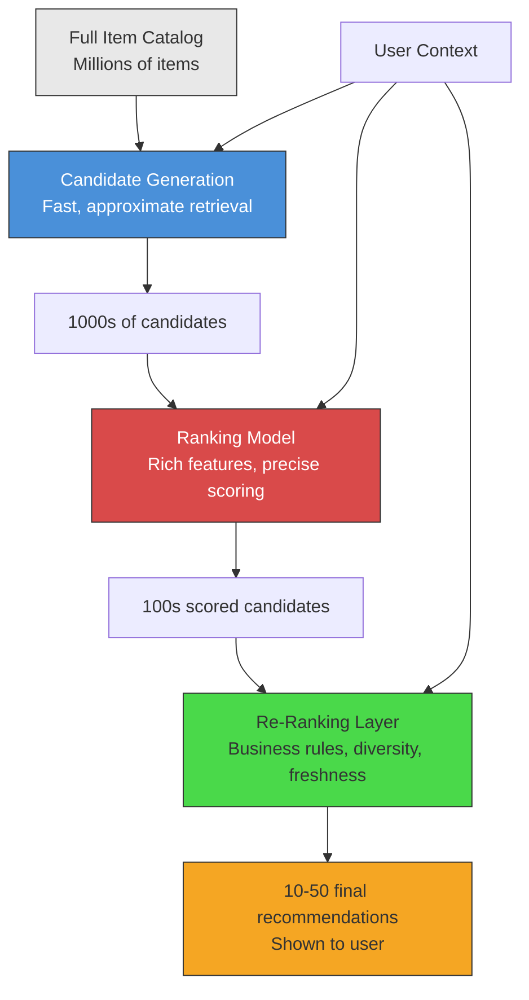
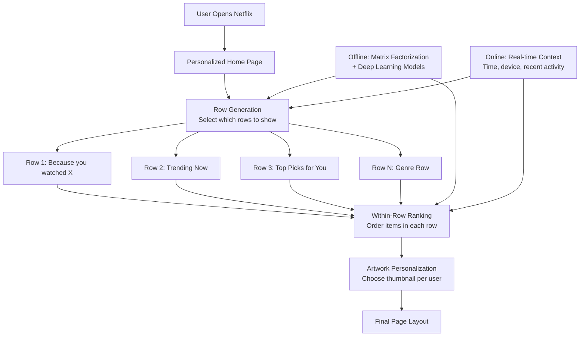
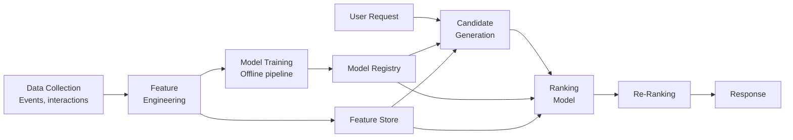

# Recommendation Systems

## Why Recommendations Matter

Recommendation systems are among the most impactful ML applications in production
today. They drive engagement, revenue, and user satisfaction across virtually every
major internet platform.

**Staggering impact numbers:**

| Company | Metric |
|---------|--------|
| Netflix | 80% of content watched comes from recommendations |
| YouTube | 70% of watch time driven by recommendation algorithm |
| Amazon | 35% of revenue attributed to "customers who bought this" |
| Spotify | Discover Weekly has 40M+ active users weekly |
| Uber Eats | Restaurant ranking directly controls order conversion |

The recommendation problem: given a user U and a catalog of items I, predict which
items the user will find most relevant, and rank them accordingly.

```
Formally:
  f(user, item) → relevance_score

Where we want to maximize:
  - Click-through rate (CTR)
  - Conversion rate
  - Watch time / listen time
  - User satisfaction (long-term)
```

---

## Content-Based Filtering

Content-based filtering recommends items similar to what a user has previously liked,
based on item features.

### How It Works

```
User Profile Construction:
  1. Extract features from items user has interacted with
  2. Build a user preference vector (weighted average of item features)
  3. Score new items by similarity to user preference vector

Example — Movie Recommendations:
  Item features: [genre, director, actors, keywords, year]
  
  User watched: "Inception" → [sci-fi=1, thriller=0.8, Nolan=1, DiCaprio=1]
                 "Interstellar" → [sci-fi=1, drama=0.6, Nolan=1, McConaughey=1]
  
  User profile: [sci-fi=1.0, thriller=0.4, drama=0.3, Nolan=1.0, ...]
  
  Score("Tenet"): similarity(user_profile, tenet_features) = 0.85  → recommend
  Score("Titanic"): similarity(user_profile, titanic_features) = 0.3 → skip
```

### TF-IDF for Content Features

```python
from sklearn.feature_extraction.text import TfidfVectorizer
from sklearn.metrics.pairwise import cosine_similarity

# Item descriptions
descriptions = [
    "action sci-fi space exploration thriller",   # Interstellar
    "action sci-fi dream heist thriller",          # Inception
    "romantic drama historical ship disaster",     # Titanic
    "sci-fi time inversion spy thriller",          # Tenet
]

vectorizer = TfidfVectorizer()
tfidf_matrix = vectorizer.fit_transform(descriptions)

# Similarity between Inception (idx 1) and all others
similarities = cosine_similarity(tfidf_matrix[1], tfidf_matrix)
# → [0.67, 1.0, 0.0, 0.72]  — Tenet is most similar after itself
```

### Pros and Cons

```
+---------------------------------------------+----------------------------------------------+
|                   PROS                      |                    CONS                       |
+---------------------------------------------+----------------------------------------------+
| No cold-start for new items (have features) | Limited discovery (filter bubble)             |
| Transparent: can explain "because you liked" | Requires good feature engineering             |
| Works with single user (no need for crowd)  | Cannot capture complex taste patterns         |
| No popularity bias                          | Misses serendipitous recommendations          |
+---------------------------------------------+----------------------------------------------+
```

---

## Collaborative Filtering

Collaborative filtering recommends items based on the behavior of similar users
or similar items, without needing item features.

Core insight: **users who agreed in the past will agree in the future.**

### User-User Collaborative Filtering

Find users similar to the target user, then recommend what those similar users liked.

```
User-Item Interaction Matrix:

              Movie A   Movie B   Movie C   Movie D   Movie E
  User 1:       5         3         4         ?         1
  User 2:       4         ?         5         3         2
  User 3:       ?         2         ?         5         4
  User 4:       5         3         4         4         ?    ← similar to User 1

Steps:
  1. Compute similarity between User 1 and all other users
     sim(U1, U4) = cosine([5,3,4,_,1], [5,3,4,4,_]) = 0.98  ← very similar
  2. User 4 rated Movie D = 4
  3. Predict User 1's rating for Movie D ≈ 4
```

**Problem:** Doesn't scale. Computing similarity across millions of users is O(n^2).

### Item-Item Collaborative Filtering (Amazon's Approach)

Find items similar to what the user already likes, based on co-occurrence patterns.

```
Key insight (Amazon, 2003):
  Item-item similarities are more STABLE than user-user similarities.
  Users change preferences; item relationships are durable.

Algorithm:
  1. For each item pair, compute similarity based on users who rated both
  2. For a target user, look at items they liked
  3. Find items most similar to their liked items
  4. Recommend highest-scoring similar items

  sim(item_i, item_j) = cosine(rating_vector_i, rating_vector_j)
  
  prediction(user, item) = Σ sim(item, liked_item) * rating(liked_item)
                           / Σ |sim(item, liked_item)|
```

**Why Amazon chose Item-Item:**
- Pre-computable: item similarity matrix computed offline
- Scales better: catalog size << user count
- More stable: item profiles change slowly
- Explainable: "Customers who bought X also bought Y"

### Matrix Factorization

Decompose the sparse user-item matrix into low-rank latent factor matrices.

```
R ≈ U × V^T

Where:
  R = user-item rating matrix (m users × n items)
  U = user latent factors (m × k)   — k latent dimensions
  V = item latent factors (n × k)

  Predicted rating: r̂(u,i) = u_u · v_i = Σ(u_u_k * v_i_k)

Latent factors capture hidden patterns:
  User factors might encode: [likes_action, prefers_long, enjoys_complex_plot]
  Item factors might encode: [is_action, is_long, has_complex_plot]
```

#### SVD (Singular Value Decomposition)

```python
import numpy as np
from scipy.sparse.linalg import svds

# User-item rating matrix (sparse)
ratings_matrix = np.array([
    [5, 3, 0, 1],
    [4, 0, 0, 1],
    [1, 1, 0, 5],
    [0, 1, 5, 4],
])

# Decompose into k=2 latent factors
U, sigma, Vt = svds(ratings_matrix.astype(float), k=2)

# Reconstruct predictions
sigma_diag = np.diag(sigma)
predicted_ratings = U @ sigma_diag @ Vt
# Fill in the zeros (missing ratings) with predictions
```

#### ALS (Alternating Least Squares)

```
Optimization problem:
  min Σ (r_ui - u_u · v_i)^2 + λ(||u_u||^2 + ||v_i||^2)
   U,V  (u,i)∈observed

ALS approach:
  1. Fix V, solve for U (linear regression per user)
  2. Fix U, solve for V (linear regression per item)
  3. Repeat until convergence

Why ALS over SGD:
  - Easily parallelizable (each user/item independent when other is fixed)
  - Works well with implicit feedback (clicks, views vs. explicit ratings)
  - Used by Spotify for large-scale music recommendations
```

---

## Deep Learning Approaches

### Two-Tower Model

Separate neural networks for users and items, trained to produce embeddings
whose dot product predicts relevance.

```
                    Query (User)                     Candidate (Item)
                        |                                  |
                  +-----------+                      +-----------+
                  | User ID   |                      | Item ID   |
                  | Age       |                      | Category  |
                  | History   |                      | Title     |
                  | Context   |                      | Features  |
                  +-----------+                      +-----------+
                        |                                  |
                  +-----------+                      +-----------+
                  | Dense     |                      | Dense     |
                  | Layers    |                      | Layers    |
                  | (User     |                      | (Item     |
                  |  Tower)   |                      |  Tower)   |
                  +-----------+                      +-----------+
                        |                                  |
                  [user_embedding]                  [item_embedding]
                        |                                  |
                        +--------→ dot product ←-----------+
                                       |
                                  relevance score
```

**Key advantage:** Item embeddings can be pre-computed and indexed in ANN
(Approximate Nearest Neighbor) for sub-millisecond retrieval at serving time.

```python
import tensorflow as tf

# User tower
user_input = tf.keras.Input(shape=(user_feature_dim,))
x = tf.keras.layers.Dense(256, activation='relu')(user_input)
x = tf.keras.layers.Dense(128, activation='relu')(x)
user_embedding = tf.keras.layers.Dense(64)(x)  # final embedding
user_tower = tf.keras.Model(user_input, user_embedding)

# Item tower
item_input = tf.keras.Input(shape=(item_feature_dim,))
y = tf.keras.layers.Dense(256, activation='relu')(item_input)
y = tf.keras.layers.Dense(128, activation='relu')(y)
item_embedding = tf.keras.layers.Dense(64)(y)  # final embedding
item_tower = tf.keras.Model(item_input, item_embedding)

# Training: maximize dot product for positive pairs,
# minimize for negative pairs (in-batch negatives)
score = tf.reduce_sum(user_embedding * item_embedding, axis=-1)
loss = tf.nn.sigmoid_cross_entropy_with_logits(labels, score)
```

### Wide & Deep Model (Google, 2016)

Combines memorization (wide/linear) with generalization (deep neural network).

```
Wide Component (Memorization):
  - Cross-product features: "user_installed_app=Netflix AND impression_app=Hulu"
  - Memorizes specific feature interactions from training data
  - Good for: frequent, well-represented patterns

Deep Component (Generalization):
  - Dense embeddings → multi-layer neural network
  - Generalizes to unseen feature combinations
  - Good for: rare combinations, diverse recommendations

Combined:
  P(Y=1|x) = σ(w_wide · [x, φ(x)] + w_deep · a_final + bias)
```

Used by Google Play Store to rank app recommendations, achieving significant
improvement in app acquisitions vs. wide-only or deep-only models.

### Neural Collaborative Filtering (NCF)

Replaces the dot product in matrix factorization with a neural network that
can learn non-linear user-item interactions.

```python
# GMF (Generalized Matrix Factorization) + MLP combined
user_emb = Embedding(num_users, emb_dim)(user_input)
item_emb = Embedding(num_items, emb_dim)(item_input)

# GMF path: element-wise product (generalizes MF)
gmf_output = Multiply()([user_emb, item_emb])

# MLP path: concatenate then deep layers
mlp_input = Concatenate()([user_emb, item_emb])
mlp_output = Dense(128, activation='relu')(mlp_input)
mlp_output = Dense(64, activation='relu')(mlp_output)

# Combine both paths
combined = Concatenate()([gmf_output, mlp_output])
output = Dense(1, activation='sigmoid')(combined)
```

---

## Hybrid Approaches

Real production systems combine multiple approaches.

```
Hybrid Strategy Matrix:

  Approach              | What it combines                   | Example
  ----------------------|------------------------------------|-----------------------
  Weighted Hybrid       | Blend scores from multiple models  | Netflix Prize winner
  Switching Hybrid      | Choose model based on context      | New user → content-based
  Cascade Hybrid        | One model filters, another ranks   | CF generates, DL ranks
  Feature Augmentation  | One model's output feeds another   | CF embeddings → DL model
  Meta-learner          | Learn which model to trust when    | Stacking ensemble
```

Netflix Prize (2009) winning solution combined 107 different models including
matrix factorization, RBMs, k-NN, and regression models via stacked
generalization (blending).

---

## The Recommendation Pipeline

Production recommendation systems follow a multi-stage funnel architecture.



### Stage 1: Candidate Generation

Retrieve ~1000 candidates from millions in < 10ms.

```
Techniques:
  1. ANN Search (Approximate Nearest Neighbor):
     - Pre-compute item embeddings (from Two-Tower model)
     - Index with HNSW, ScaNN, or FAISS
     - Query: user embedding → top-K nearest items
     - Latency: ~1-5ms for millions of items

  2. Multiple Retrieval Paths (YouTube):
     - Path A: ANN on user-embedding similarity
     - Path B: Popular items in user's geography
     - Path C: Items from user's subscriptions
     - Path D: Items similar to recently watched
     - Merge all candidates, deduplicate

  3. Inverted Index (for sparse features):
     - genre:action → [item_1, item_5, item_99, ...]
     - Fast retrieval by category/tag matching
```

### Stage 2: Ranking

Score ~1000 candidates with a rich model, output top ~100.

```
Ranking Model Features:
  User features:      [age, country, watch_history_embedding, ...]
  Item features:      [category, freshness, popularity, creator_embedding, ...]
  Cross features:     [user_watched_similar, time_since_last_interaction, ...]
  Context features:   [time_of_day, device, session_length, ...]

Model Architecture:
  - Typically a deep neural network (MLP, DeepFM, DCN)
  - Trained on click/engagement labels
  - Multi-task: predicts CTR, watch_time, like_probability simultaneously
  - Objective: weighted combination of task predictions
    final_score = w1*P(click) + w2*E[watch_time] + w3*P(like) - w4*P(dislike)
```

### Stage 3: Re-Ranking

Apply business rules and diversity constraints to final list.

```
Re-ranking considerations:
  - Diversity: don't show 10 action movies in a row (MMR algorithm)
  - Freshness: boost recently released content
  - Business rules: promote original content, honor contracts
  - Fairness: ensure exposure across content creators
  - Deduplication: remove near-duplicates
  - User fatigue: suppress items shown too many times

Example — Maximal Marginal Relevance (MMR):
  MMR(i) = λ * Relevance(i) - (1-λ) * max_j∈Selected Similarity(i, j)
  
  Balances relevance with diversity by penalizing items too similar
  to already-selected items.
```

---

## Cold Start Problem

The most persistent challenge in recommendation systems.

### New User Cold Start

```
Problem: No interaction history to base recommendations on.

Solutions (progressive):
  1. Popularity-based: Show globally popular items
     → Everyone sees the same "Top 10" list initially
  
  2. Demographic-based: Use age, location, language
     → "Popular in your country" or "Trending for your age group"
  
  3. Onboarding quiz: Ask preferences explicitly
     → Netflix: "Rate these movies" during signup
     → Spotify: "Pick 3 artists you like"
  
  4. Contextual signals: Device, time, referral source
     → Mobile user at 8am → news/podcasts
     → Desktop user at 8pm → long-form video
  
  5. Bandit exploration: Explore-exploit with new users
     → Show diverse items, quickly learn from feedback
     → Thompson Sampling or UCB algorithms

Transition curve:
  New user → popularity → demographic → early interactions → full personalization
  Day 0       Day 1         Day 3           Day 7              Day 30+
```

### New Item Cold Start

```
Problem: No user interactions exist for a new item.

Solutions:
  1. Content-based features: Use item metadata to place in embedding space
     → A new sci-fi movie with actor X gets recommended to sci-fi/actor-X fans
  
  2. Exploration budget: Allocate a % of recommendations to new items
     → Show new item to random sample, collect feedback quickly
  
  3. Creator-based: Recommend based on content creator's previous items
     → New video by popular YouTuber → recommend to their subscribers
  
  4. Transfer learning: Use pre-trained embeddings from descriptions/images
     → BERT embedding of item description → place in item embedding space
```

---

## A/B Testing Recommendations

### Interleaving

```
Traditional A/B Test:
  Group A (50% users) → Algorithm 1
  Group B (50% users) → Algorithm 2
  Problem: Need weeks + millions of users for statistical significance

Interleaving (Netflix):
  All users → See interleaved results from BOTH algorithms
  Track which algorithm's items get more engagement
  
  Example (Team Draft Interleaving):
    Algo A ranking: [a1, a2, a3, a4, a5]
    Algo B ranking: [b1, b2, b3, b4, b5]
    
    Interleaved:    [a1, b1, a2, b2, a3]  (alternating picks)
    
    User clicks on positions 1, 3, 5 → Algo A wins (3 clicks vs 2)
  
  Advantage: 100x more sensitive than traditional A/B test
             Detects smaller differences with fewer users
```

### Multi-Armed Bandit

```
Instead of fixed 50/50 split:
  - Start with equal traffic to all variants
  - Dynamically shift traffic toward the winning variant
  - Balance exploration (try all) vs exploitation (favor best)

Algorithms:
  - Epsilon-greedy: 90% best, 10% random
  - Thompson Sampling: Bayesian posterior sampling
  - UCB (Upper Confidence Bound): optimism under uncertainty

Advantage over A/B:
  - Less regret (fewer users see worse algorithm)
  - Faster convergence to best variant
  - Handles non-stationary environments (seasonal changes)
```

---

## Real-World Systems Deep Dives

### Netflix Recommendation Architecture



Netflix key innovations:
- **Personalized artwork:** Same movie, different thumbnails per user
  (romance fan sees romantic scene; action fan sees action scene)
- **Row-level optimization:** Which categories of rows to show
- **Page-level optimization:** How many rows, items per row

### YouTube Recommendation (2016 Paper + Evolution)

```
Two-stage architecture:

Stage 1 — Candidate Generation (Deep Neural Network):
  Input: User watch history (as embeddings), search history, demographics
  Output: ~100s video candidates from corpus of billions
  Model: Deep NN producing user embedding → ANN retrieval

Stage 2 — Ranking (Wide & Deep):
  Input: Rich features (video age, channel, user-video cross features)
  Output: Expected watch time per video
  Key insight: Optimize for watch TIME, not just click probability
    → Prevents clickbait from dominating

Evolution (2020s):
  - Multi-task learning: watch time + satisfaction + long-term engagement
  - Reinforcement learning: optimize for session-level engagement
  - Responsible AI: reduce harmful content recommendations
```

### Spotify Discover Weekly

```
How it works:
  1. Matrix Factorization on 100B+ play events
     → User taste vectors + song taste vectors (ALS, ~40 latent factors)
  
  2. NLP on playlists:
     → Treat playlists as "sentences" and songs as "words"
     → Word2Vec → song embeddings (song2vec)
     → Songs that appear in similar playlists get similar embeddings
  
  3. Audio features (CNN on spectrograms):
     → Handles cold-start for new songs with no play history
     → Genre, tempo, mood extracted from raw audio
  
  4. Combine all three signals:
     → Collaborative (who listens to what) +
       Content (what songs sound like) +
       NLP (what playlists songs appear in)
  
  5. Generate 30 songs per user every Monday
     → Filter out songs user has already heard
     → Ensure diversity across genres/moods
```

### Uber Eats Restaurant Ranking

```
Objective: Rank restaurants to maximize order probability AND user satisfaction

Features:
  - User: past orders, cuisine preferences, dietary restrictions, location
  - Restaurant: ratings, delivery time estimate, distance, price range
  - Context: time of day, day of week, weather, promotions
  - Real-time: current wait time, driver availability, surge pricing

Multi-objective optimization:
  score = w1 * P(order) + w2 * P(good_rating) + w3 * estimated_delivery_speed
          - w4 * P(cancellation)

Unique challenges:
  - Two-sided marketplace (balance user satisfaction + restaurant fairness)
  - Delivery logistics (a great restaurant 45 min away may rank lower)
  - Real-time supply: restaurant capacity changes minute by minute
```

---

## Interview Walkthrough: "Design a Recommendation System"

### Step 1: Clarify Requirements

```
Questions to ask:
  - What are we recommending? (products, content, restaurants, people)
  - Scale: How many users? How many items?
  - Latency requirements? (100ms for feeds, 500ms for search)
  - What signals do we have? (explicit ratings, implicit clicks/views)
  - Cold start handling? (new users per day, new items per day)
  - Business objectives? (engagement, revenue, diversity)
```

### Step 2: High-Level Design



### Step 3: Deep Dive Components

```
Candidate Generation:
  - Two-Tower model trained on user-item interactions
  - User embedding + FAISS index of item embeddings
  - Multiple retrieval channels merged

Ranking:
  - Deep model with user features, item features, cross features
  - Multi-task: P(click), E[engagement_time], P(conversion)
  - Trained on recent 30 days of data, retrained daily

Re-Ranking:
  - Diversity: MMR to ensure variety
  - Freshness: time-decay boost for new items
  - Business: boost promoted items, filter blocked content

Feature Store:
  - Offline: user history aggregations, item statistics
  - Online: real-time features (items viewed in current session)

Monitoring:
  - Model metrics: AUC, NDCG, precision@K
  - Business metrics: CTR, conversion rate, revenue per session
  - Data quality: feature distribution drift detection
```

### Step 4: Scale and Optimize

```
Scale considerations:
  - 100M users, 10M items → candidate generation must be sub-10ms
  - ANN index: HNSW with 10M 128-dim vectors ≈ 5GB memory
  - Ranking model: batch GPU inference, ~1ms per candidate
  - Feature store: Redis cluster for online features (p99 < 5ms)
  
Latency budget (total 200ms):
  Feature lookup:           20ms
  Candidate generation:     10ms
  Ranking (1000 candidates): 50ms
  Re-ranking:               10ms
  Network + serialization:  30ms
  Buffer:                   80ms
```

---

## Key Metrics and Evaluation

```
Offline Metrics:
  - Precision@K: fraction of top-K recommendations that are relevant
  - Recall@K: fraction of relevant items captured in top-K
  - NDCG: normalized discounted cumulative gain (position-aware)
  - MAP: mean average precision
  - AUC-ROC: ranking quality for binary relevance

Online Metrics:
  - CTR: click-through rate on recommendations
  - Engagement: time spent, items consumed
  - Conversion: purchases, subscriptions
  - Diversity: how varied are recommendations (intra-list diversity)
  - Coverage: % of catalog that gets recommended
  - Novelty: how "new" are recommendations to users

Offline ≠ Online:
  A model with higher offline NDCG may not win online A/B test
  because offline metrics don't capture:
    - Position bias (users click top items regardless)
    - Feedback loops (model sees its own outputs as training data)
    - Novelty and exploration value
```

---

## Summary: Choosing the Right Approach

```
+---------------------+---------------------------+-----------------------------+
| Approach            | Best When                 | Watch Out For               |
+---------------------+---------------------------+-----------------------------+
| Content-Based       | Rich item features,       | Filter bubble, limited      |
|                     | cold-start items          | discovery                   |
+---------------------+---------------------------+-----------------------------+
| Collaborative (CF)  | Dense interaction data,   | Cold start, popularity      |
|                     | no item features needed   | bias, sparsity              |
+---------------------+---------------------------+-----------------------------+
| Matrix Factorization| Large sparse matrices,    | Linear interactions only,   |
|                     | implicit feedback         | static embeddings           |
+---------------------+---------------------------+-----------------------------+
| Two-Tower           | Large-scale retrieval,    | Simple dot-product may      |
|                     | need fast serving         | miss complex interactions   |
+---------------------+---------------------------+-----------------------------+
| Wide & Deep         | Mix of memorization +     | Feature engineering for     |
|                     | generalization needed     | wide component is manual    |
+---------------------+---------------------------+-----------------------------+
| Hybrid              | Production systems at     | Complexity, harder to       |
|                     | scale                     | debug and maintain          |
+---------------------+---------------------------+-----------------------------+
```
