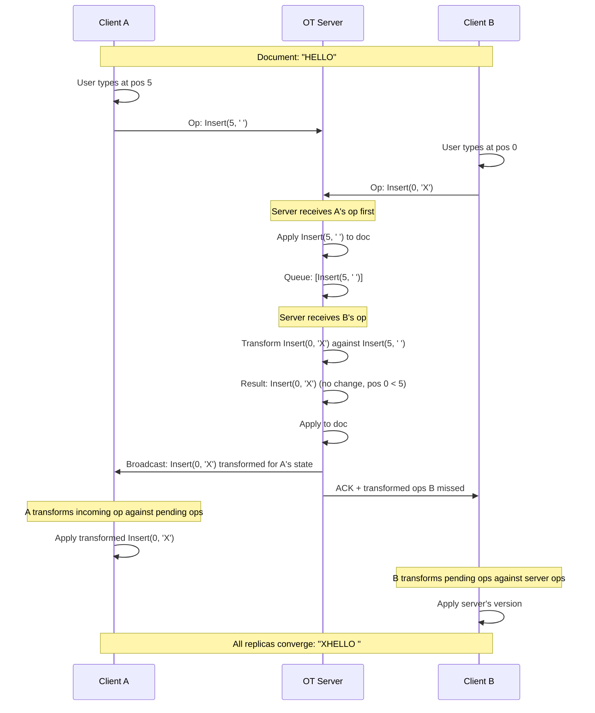
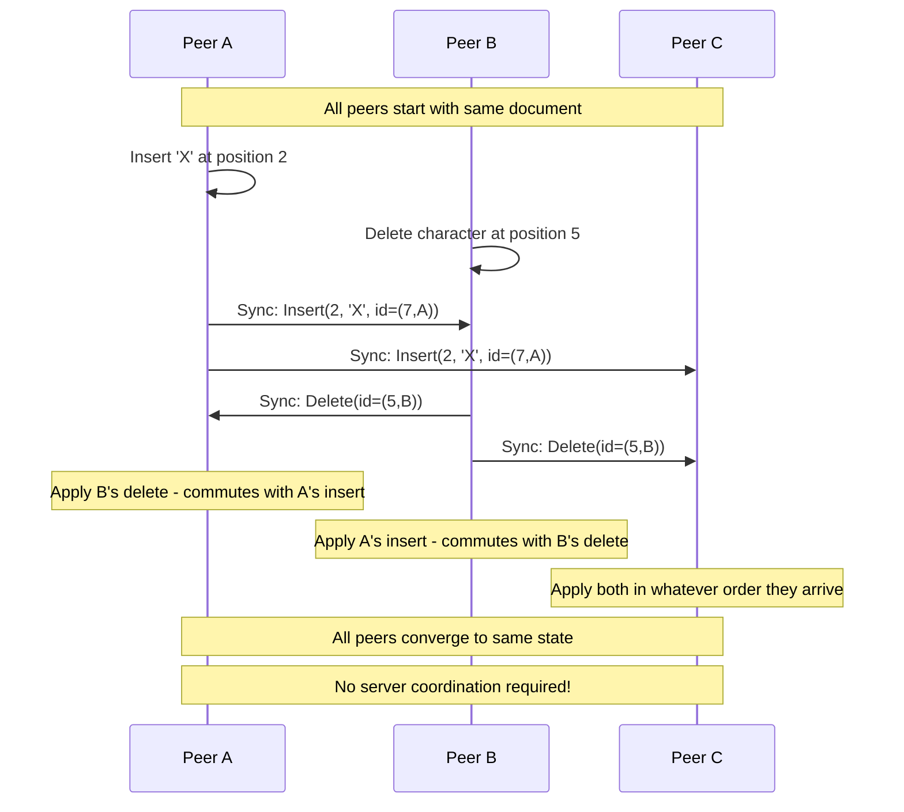
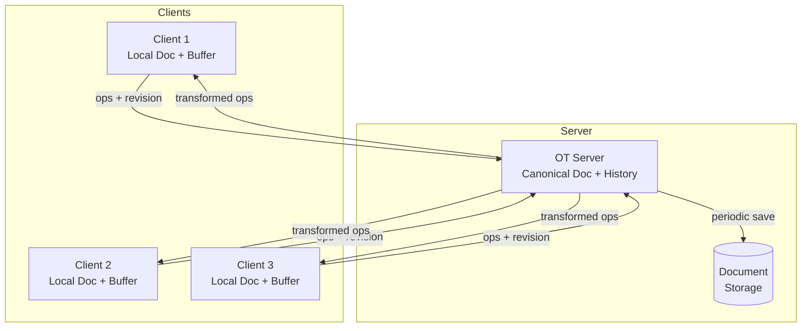
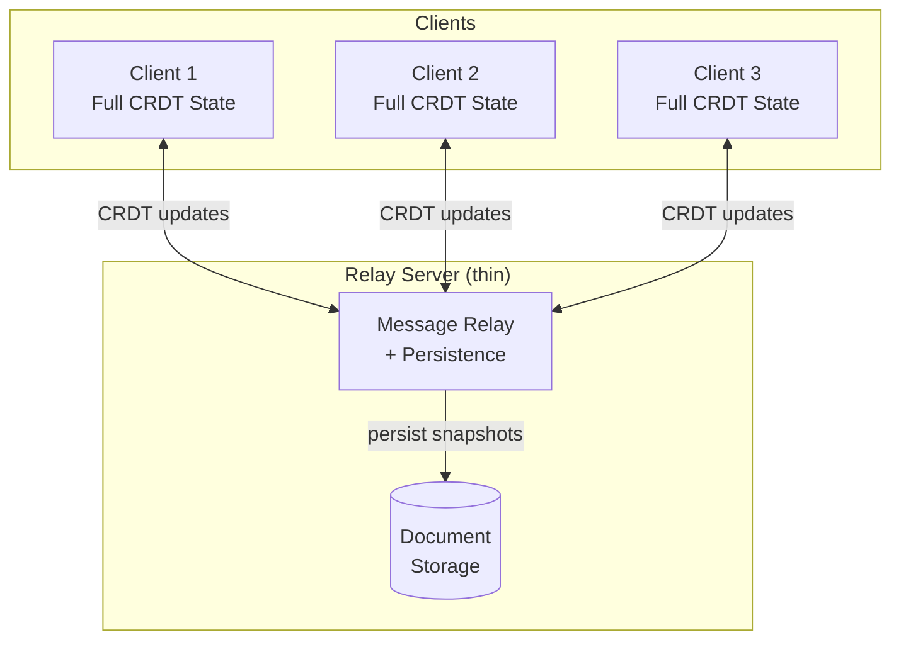
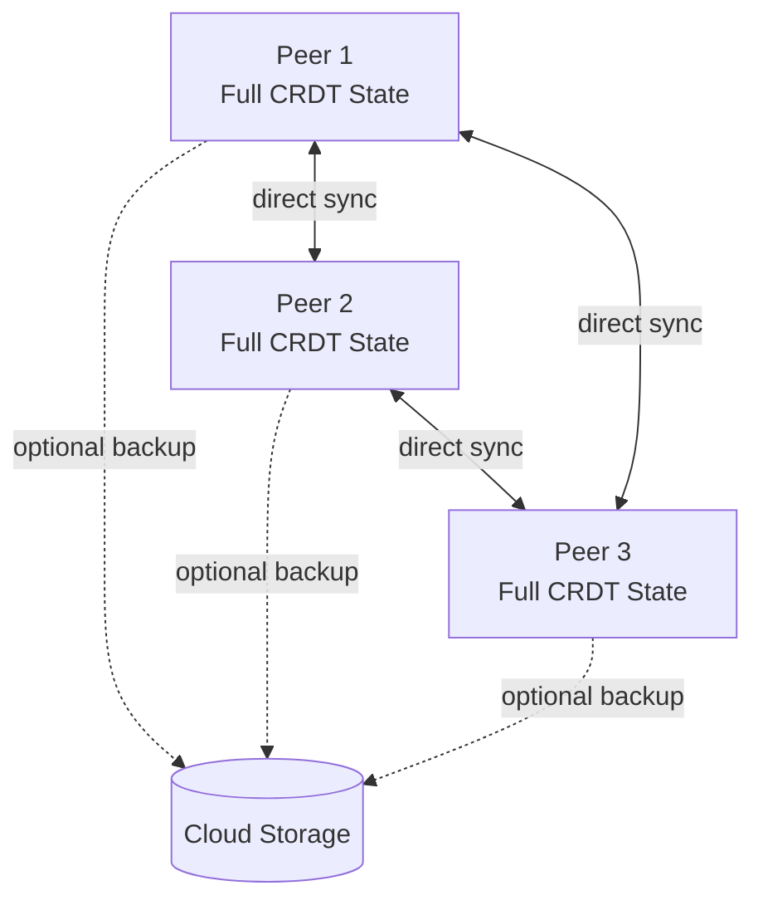
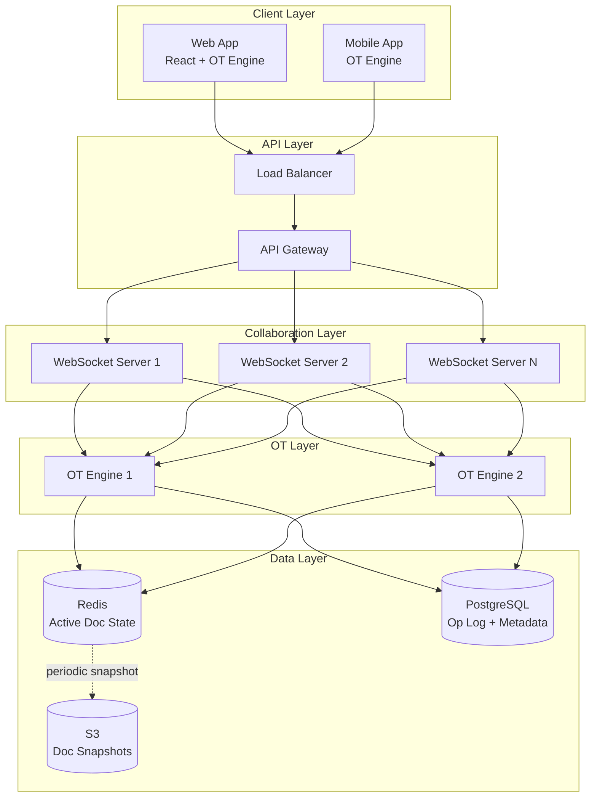

# Real-Time Collaborative Editing

## The Problem That Defines an Era

Real-time collaborative editing is the challenge of letting multiple users modify the
same shared document simultaneously while maintaining a consistent view for everyone.
This is the foundation of Google Docs, Figma, Notion, and dozens of other tools that
define modern knowledge work.

The naive approach -- "just lock the section being edited" -- fails immediately. It
serializes human creativity. The breakthrough insight: let everyone edit freely and
resolve conflicts automatically, invisibly, in real time.

Two families of algorithms dominate this space: **Operational Transformation (OT)** and
**Conflict-free Replicated Data Types (CRDTs)**. Understanding both is essential for any
system design interview involving collaborative features.

---

## The Core Challenge: Convergence

When two users edit the same document concurrently, their local copies diverge. The
system must guarantee **convergence** -- all replicas must eventually reach the same
state, regardless of the order operations are received.

```
User A (New York)              Server              User B (London)
     |                           |                      |
     |-- Insert 'X' at pos 2 -->|                      |
     |                           |<-- Delete pos 1 ----|
     |                           |                      |
     |    Both operations conflict: positions shift!    |
     |                           |                      |
     |    Without transformation, documents diverge     |
```

**Three properties every collaborative system must maintain:**
1. **Convergence** -- all replicas reach the same final state
2. **Intention preservation** -- the effect of each operation matches the user's intent
3. **Causality preservation** -- if op A happened before op B, all replicas see A before B

---

## Operational Transformation (OT)

### How Google Docs Actually Works

OT was invented at Xerox PARC in 1989 and became the backbone of Google Wave (2009),
then Google Docs. The core idea: when concurrent operations conflict, **transform** one
operation against the other so both can be applied and the document converges.

### The Transform Function

The heart of OT is the transform function:

```
T(op1, op2) -> (op1', op2')

Where:
- op1, op2 are concurrent operations
- op1' is op1 transformed against op2
- op2' is op2 transformed against op1

Guarantee: apply(apply(doc, op1), op2') == apply(apply(doc, op2), op1')
```

This means: whether you apply op1 first then the transformed op2, or op2 first then the
transformed op1, you get the same document. This is the **convergence guarantee**.

### Step-by-Step Example: Two Users Typing

Starting document: `"ABCD"` (positions 0,1,2,3)

**User A**: Insert 'X' at position 1 -> `Insert(1, 'X')`
**User B**: Insert 'Y' at position 3 -> `Insert(3, 'Y')`

Both operations are generated concurrently (neither has seen the other).

```
Initial document: A B C D
                   0 1 2 3

User A's intent: A X B C D    (insert X between A and B)
User B's intent: A B C Y D    (insert Y between C and D)

Expected result:  A X B C Y D  (both insertions preserved)
```

**Without transformation (WRONG):**
1. Apply A's op: Insert(1, 'X') -> `"AXBCD"`
2. Apply B's op: Insert(3, 'Y') -> `"AXBYCD"` -- WRONG! Y is between B and C, not C and D

**With transformation (CORRECT):**
1. Apply A's op: Insert(1, 'X') -> `"AXBCD"`
2. Transform B's op against A's op:
   - A inserted at position 1, which is before B's position 3
   - So B's position shifts right by 1: Insert(3, 'Y') -> Insert(4, 'Y')
3. Apply transformed B's op: Insert(4, 'Y') -> `"AXBCYD"` -- CORRECT!

### Transform Rules for Text Operations

```
Transform(Insert(p1, c1), Insert(p2, c2)):
  if p1 < p2:   return (Insert(p1, c1), Insert(p2+1, c2))
  if p1 > p2:   return (Insert(p1+1, c1), Insert(p2, c2))
  if p1 == p2:  break tie by user ID (lower ID goes first)

Transform(Insert(p1, c1), Delete(p2)):
  if p1 <= p2:  return (Insert(p1, c1), Delete(p2+1))
  if p1 > p2:   return (Insert(p1-1, c1), Delete(p2))

Transform(Delete(p1), Delete(p2)):
  if p1 < p2:   return (Delete(p1), Delete(p2-1))
  if p1 > p2:   return (Delete(p1-1), Delete(p2))
  if p1 == p2:  return (NoOp, NoOp)  -- both deleted same char
```

### OT Architecture: Centralized Server

OT requires a **central server** that establishes a total order of operations. This is
the key architectural constraint.



### The Server's Role in OT

The OT server maintains the **canonical document state** and a **revision number**:

```
Server State:
  document: "current content..."
  revision: 42
  history: [op1, op2, ..., op42]  -- all applied operations

When client sends (op, client_revision):
  1. Find all server ops since client_revision
  2. Transform client op against each server op sequentially
  3. Apply transformed op to server document
  4. Increment revision
  5. Broadcast transformed op to all other clients
  6. ACK client with new revision number
```

**Why centralization matters**: OT's transform function is notoriously difficult to make
work correctly in a decentralized setting. The number of transformation paths grows
combinatorially, and proving convergence for all paths is extremely hard. Google spent
years debugging OT in Wave/Docs.

### OT Complexity and Pitfalls

OT has a dark side. The academic literature contains dozens of published OT algorithms,
and many of them have been proven incorrect years after publication. The problem is
**transformation path divergence** -- when three or more operations are concurrent, the
order of transformations matters, and many algorithms fail to account for all orderings.

```
The "OT puzzle" with 3 concurrent operations:

     op1
    /    \
  op2    op3
  / \   / \
op3  ? op2  ?

Both paths must yield the same result.
For N concurrent ops, there are N! paths.
```

This is why Google's Jupiter OT system uses a server-centric approach that limits
concurrency to a client-server model (not peer-to-peer), drastically reducing the
number of transformation paths.

---

## CRDTs (Conflict-free Replicated Data Types)

### A Different Philosophy

CRDTs take a fundamentally different approach: design the data structure itself so that
all concurrent operations commute -- they can be applied in any order and always
converge. No transformation needed. No central server required.

**The key insight**: if the merge function is commutative, associative, and idempotent,
replicas always converge regardless of message ordering or duplication.

```
Commutativity:  merge(A, B) == merge(B, A)
Associativity:  merge(merge(A, B), C) == merge(A, merge(B, C))
Idempotency:    merge(A, A) == A
```

### How Figma Uses CRDTs

Figma uses CRDTs for its real-time design collaboration. Each design element (rectangle,
text, frame) is a CRDT that can be modified independently. When two users move the same
rectangle, the last write wins (by timestamp), which is the natural expectation for
design tools.

Figma's approach:
1. Each object has a unique ID assigned at creation
2. Each property change is timestamped with a Lamport clock
3. Conflicts resolve by last-writer-wins (LWW) on each property
4. Structural changes (reparenting, reordering) use a specialized tree CRDT

### CRDT Types for Collaborative Editing

**G-Counter (Grow-only Counter)**:
```
Each replica maintains its own counter.
Merge = take max of each replica's counter.
Total = sum of all replica counters.

Replica A: {A: 3, B: 0}  -- A has seen 3 increments
Replica B: {A: 1, B: 2}  -- B has seen 2 increments
Merge:     {A: 3, B: 2}  -- total = 5
```

**LWW-Register (Last Writer Wins Register)**:
```
Each write carries a timestamp.
Merge = keep the value with the highest timestamp.
Used by Figma for object properties.

Replica A: {value: "red",  ts: 10}
Replica B: {value: "blue", ts: 12}
Merge:     {value: "blue", ts: 12}  -- B's write was later
```

**RGA (Replicated Growable Array)** -- for text editing:
```
Each character has a unique ID: (timestamp, replicaID)
Characters are linked in a doubly-linked list
Insert: create new node, place after reference node
Delete: mark node as tombstone (don't remove)

Document: H -> E -> L -> L -> O
IDs:     (1,A) (2,A) (3,A) (4,A) (5,A)

User A inserts 'X' after position 2: 
  X gets ID (6,A), linked after (2,A)
  H -> E -> X -> L -> L -> O

User B inserts 'Y' after position 2 (concurrently):
  Y gets ID (6,B), linked after (2,A)

Merge: both X and Y go after E. 
  Tie-break by ID: (6,A) vs (6,B)
  If A < B: H -> E -> X -> Y -> L -> L -> O
```

### Popular CRDT Libraries

**Yjs** (JavaScript):
- Most popular CRDT library for web applications
- Uses a YATA (Yet Another Transformation Approach) CRDT for text
- Supports rich text, maps, arrays, XML
- Used by: Evernote, AFFiNE, several Notion-like apps
- Efficient encoding: ~1.5 bytes per character on average

**Automerge**:
- Academic-quality CRDT library by Martin Kleppmann (Cambridge)
- Supports JSON-like documents with nested maps/lists/text
- Strong history tracking -- full edit history preserved
- Used by: Ink & Switch research projects, Muse app

**Diamond Types** (Rust):
- High-performance CRDT focused on text editing
- Created by Joseph Gentle (ex-Google Wave team)
- Benchmarks show 100x faster than Yjs for some operations

### P2P Sync Without Server



### CRDT Metadata Overhead

CRDTs come with a cost: **metadata**. Every character in a CRDT text document carries:
- A unique identifier (timestamp + replicaID)
- Pointers to adjacent characters
- Tombstones for deleted characters

```
A 10,000-character document might require:

  Plain text:     ~10 KB
  OT (server):    ~10 KB + operation log
  CRDT:           ~30-80 KB (depending on implementation)
  
With tombstones from heavy editing:
  CRDT:           ~100-500 KB (deleted chars still stored)
```

Modern CRDT libraries (Yjs, Diamond Types) use aggressive compression techniques to
reduce this overhead, but it remains a fundamental tradeoff.

---

## OT vs CRDTs: Comprehensive Comparison

| Criteria | OT | CRDTs |
|---|---|---|
| **Server requirement** | Centralized server required | No server needed (P2P possible) |
| **Consistency model** | Strong (server-ordered) | Eventual (convergence guaranteed) |
| **Implementation complexity** | Very high (transform correctness is notoriously hard) | High (data structure design), moderate (using library) |
| **Latency** | Server round-trip required for confirmation | Instant local apply, async sync |
| **Offline support** | Poor -- operations queue and may conflict heavily | Excellent -- merge whenever reconnected |
| **Memory overhead** | Low (only operation log on server) | High (unique IDs, tombstones per element) |
| **Undo/Redo** | Complex (inverse operations must be transformed) | Complex (need to invert CRDT operations) |
| **Scaling users** | Bottleneck at server (can shard by document) | Scales naturally (P2P) |
| **Correctness proofs** | Historically difficult (many published algorithms broken) | Mathematically proven (algebraic properties) |
| **Network topology** | Client-server only | Client-server, P2P, mesh, hybrid |
| **Garbage collection** | Simple (server can compact history) | Hard (tombstones require coordination to remove) |
| **Industry adoption** | Google Docs, Microsoft Office Online | Figma, Apple Notes, Linear, Notion (partial) |

**When to choose OT:**
- You already have a centralized architecture
- Document size is large and memory overhead matters
- You need strong consistency (all users see same state immediately after server confirms)

**When to choose CRDTs:**
- Offline-first applications
- P2P or decentralized architecture
- You want mathematical correctness guarantees
- Using a mature library (Yjs, Automerge) rather than building from scratch

---

## Awareness Features

Collaborative editing is more than merging text. Users need to **see each other** --
where others are editing, what they have selected, and who is currently active.

### Cursor Positions (Carets)

Each user's cursor position must be broadcast to all other users in real time:

```
Awareness Message:
{
  user_id: "alice",
  cursor: {
    anchor: { line: 12, column: 5 },
    head: { line: 12, column: 5 }
  },
  selection: null,
  color: "#FF6B6B",
  name: "Alice",
  avatar: "https://..."
}
```

**Challenge**: cursor positions are invalidated by edits. If Alice's cursor is at
position 10 and Bob inserts text at position 5, Alice's cursor must shift to position 11.
This is the same transformation problem as OT, applied to cursors.

### Selection Highlighting

When a user selects text, all other users see a colored highlight:

```
Selection ranges are represented as:
{
  anchor: position where selection started,
  head: position where selection ends,
  user_color: distinct color per user
}
```

### Presence Indicators

Show who is currently viewing/editing the document:

```
Presence States:
  - ACTIVE:   user is typing or moving cursor (green dot)
  - VIEWING:  user has document open but idle (yellow dot)
  - AWAY:     user's tab is not focused (gray dot)
  - OFFLINE:  user has left (remove after timeout)
```

### Implementation with Yjs Awareness Protocol

```
Yjs provides a built-in awareness protocol:

1. Each client maintains an awareness state (cursor, selection, name, color)
2. State is broadcast to all peers every 30 seconds (heartbeat)
3. On state change (cursor move, selection change), immediately broadcast
4. If no update received from a peer for 30s, mark as disconnected
5. States are NOT persisted -- they are ephemeral
```

---

## Undo/Redo in Collaborative Environments

Undo in a single-user editor is trivial: pop the last operation from a stack and invert
it. In a collaborative editor, this breaks immediately.

### The Problem

```
Timeline:
  t1: Alice inserts "Hello"
  t2: Bob inserts "World" after "Hello"
  t3: Alice presses Undo

What should happen?
  Option A: Undo Alice's last op -> Remove "Hello" -> "World" (breaks Bob's context)
  Option B: Undo the global last op -> Remove "World" (undoes Bob's work!)
  Option C: Undo only Alice's last op, preserving Bob's work -> "World"
```

The correct answer is **Option C: per-user undo**. Alice's undo should only affect
Alice's operations, and it must be correct even though Bob's operations intervened.

### Per-User Undo Implementation

```
Each user maintains their own undo stack:

Alice's stack: [Insert(0, "Hello")]
Bob's stack:   [Insert(5, "World")]

When Alice undoes:
  1. Pop Insert(0, "Hello") from Alice's stack
  2. Create inverse: Delete(0, 5)  -- delete 5 chars at position 0
  3. Transform the inverse against all operations that happened after it
     (Bob's Insert was at position 5, but if we delete positions 0-4,
      Bob's text shifts to position 0)
  4. Apply the transformed inverse
  
Result: "World" -- Alice's text removed, Bob's preserved, position adjusted
```

### Undo/Redo with OT

```
Undo Stack per user: [op1, op2, op3, ...]

To undo op_n:
  1. Compute inverse: inv(op_n)
  2. Transform inv(op_n) against all operations that happened after op_n:
     inv' = T(T(T(inv(op_n), op_{n+1}), op_{n+2}), ..., op_latest)
  3. Apply inv' to the document
  4. Push (op_n, inv') to redo stack
```

### Undo/Redo with CRDTs

CRDTs handle undo differently. Since operations are commutative, you cannot simply
"reverse" an operation without breaking the CRDT guarantees. Two approaches:

1. **Tombstone revival**: For delete undo, mark the tombstone as alive again
2. **State snapshots**: Store periodic snapshots, restore to a previous snapshot
   (but this undoes ALL users' changes, not just yours)
3. **Selective undo via inverse CRDTs**: Compute the CRDT-level inverse of a user's
   operations, which is an active area of research

---

## Collaborative Architecture Patterns

### Pattern 1: Client-Server OT (Google Docs)



**Google Docs specifics:**
- Batches rapid keystrokes into compound operations (e.g., "insert 'Hello'" not 5 inserts)
- Uses WebSocket for real-time op transmission
- Falls back to HTTP long-polling if WebSocket unavailable
- Documents are auto-saved every few seconds
- Server shards by document ID

### Pattern 2: CRDT with Relay Server (Figma)



**Figma specifics:**
- Server is a thin relay -- does not transform operations
- Clients are responsible for merging (CRDT merge is deterministic)
- Uses a custom CRDT optimized for design tool operations
- Multiplayer cursor/selection via separate awareness channel
- Server persists CRDT state periodically for durability

### Pattern 3: P2P with CRDTs (Experimental)



Used by some offline-first apps and experimental projects. No server required for
synchronization, but optional cloud backup for persistence.

---

## Real-World Systems Deep Dive

### Google Docs (OT)
- **Algorithm**: Jupiter OT (proprietary variant)
- **Transport**: WebSocket with HTTP fallback
- **Granularity**: Rich text operations (insert, delete, format, style)
- **Server**: Centralized OT server per document, sharded across fleet
- **Storage**: Operation log + periodic snapshots in Spanner
- **Latency**: ~100-300ms round-trip for operation confirmation
- **Max concurrent users**: Tested to 200+ per document

### Figma (CRDTs)
- **Algorithm**: Custom LWW-Register CRDT per object property + tree CRDT for hierarchy
- **Transport**: WebSocket
- **Granularity**: Per-property updates on design objects
- **Server**: Thin relay server, multiplexes document rooms
- **Storage**: CRDT state snapshots in PostgreSQL + S3
- **Latency**: Instant local apply, ~50-100ms for propagation
- **Insight**: Design tools map well to CRDTs because objects have independent properties

### Apple Notes (CRDTs)
- **Algorithm**: Custom CRDT (details sparse, but confirmed in WWDC talks)
- **Transport**: iCloud sync (not real-time WebSocket)
- **Offline**: Full offline support -- merge on reconnect
- **Insight**: CRDTs chosen specifically for offline-first sync across Apple devices

### VS Code Live Share
- **Algorithm**: OT-based (centralized host model)
- **Transport**: Azure Relay service
- **Architecture**: Host machine is the source of truth, guests see transformed view
- **Features**: Shared terminals, debugging sessions, server ports -- not just text

### Notion
- **Algorithm**: Hybrid approach -- block-level CRDTs with property-level LWW
- **Transport**: WebSocket for real-time, HTTP for initial load
- **Granularity**: Each "block" (paragraph, heading, table) is a CRDT
- **Insight**: Block granularity reduces conflict surface -- two users rarely edit the
  same block simultaneously

---

## Interview Walkthrough: "Design Google Docs"

### Step 1: Clarify Requirements

**Functional:**
- Multiple users edit the same document in real time
- Rich text (bold, italic, headings, lists, tables)
- See other users' cursors and selections
- Undo/redo per user
- Version history

**Non-functional:**
- Low latency (<200ms for operation propagation)
- Strong eventual consistency
- Support 100+ concurrent editors per document
- 99.99% availability

### Step 2: High-Level Architecture



### Step 3: Key Design Decisions

1. **One OT engine per document**: Partition documents across OT engines. Use consistent
   hashing on document_id to route all editors of a document to the same OT engine.

2. **WebSocket for real-time**: Each client maintains a persistent WebSocket connection.
   The WebSocket server routes ops to the correct OT engine.

3. **Operation batching**: Client batches rapid keystrokes (e.g., typing "Hello" sends
   one operation, not five). This reduces server load and network traffic.

4. **Persistence strategy**:
   - Redis: current document state + recent op buffer (hot path)
   - PostgreSQL: full operation log (audit trail, version history)
   - S3: periodic document snapshots (cold storage, disaster recovery)

5. **Scaling**: Each OT engine handles ~1000 documents. For millions of documents, run
   thousands of OT engines. Documents are independent -- no cross-document coordination.

### Step 4: Handling Edge Cases

- **Late joiner**: Fetch latest snapshot from Redis, then replay ops since snapshot
- **Disconnection**: Buffer ops locally, replay on reconnect, transform against missed ops
- **Large documents**: Split into sections, each with its own OT stream
- **Conflicting formatting**: Last-write-wins for formatting (bold on vs off)
- **Version history**: Snapshot every N ops or every T seconds, allow rollback

---

## Key Takeaways for Interviews

1. **OT requires a central server** -- this is its fundamental constraint and strength
2. **CRDTs enable P2P** -- no server needed, but metadata overhead is real
3. **Google Docs uses OT, Figma uses CRDTs** -- know why each chose differently
4. **Undo must be per-user** -- global undo in collaborative editing is wrong
5. **Awareness (cursors, presence) is a separate channel** -- ephemeral, not persisted
6. **Partition by document** -- documents are independent, scale horizontally
7. **CRDTs are winning the modern adoption war** -- Yjs and Automerge make CRDTs
   accessible, while OT remains hard to implement correctly from scratch
8. **The real complexity is in the details** -- rich text, tables, embedded objects,
   concurrent formatting are all harder than plain text insert/delete
