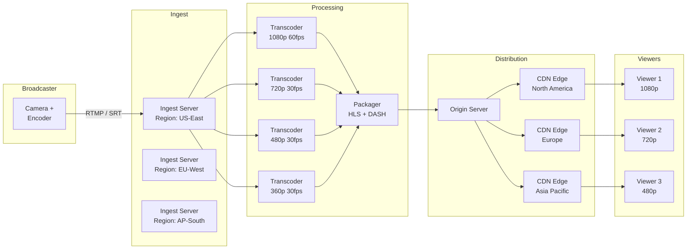
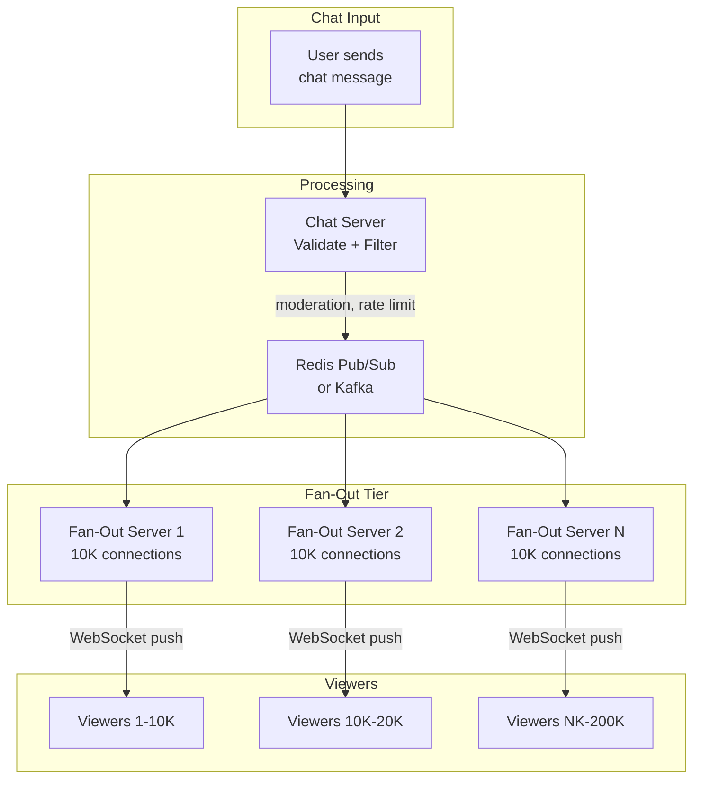
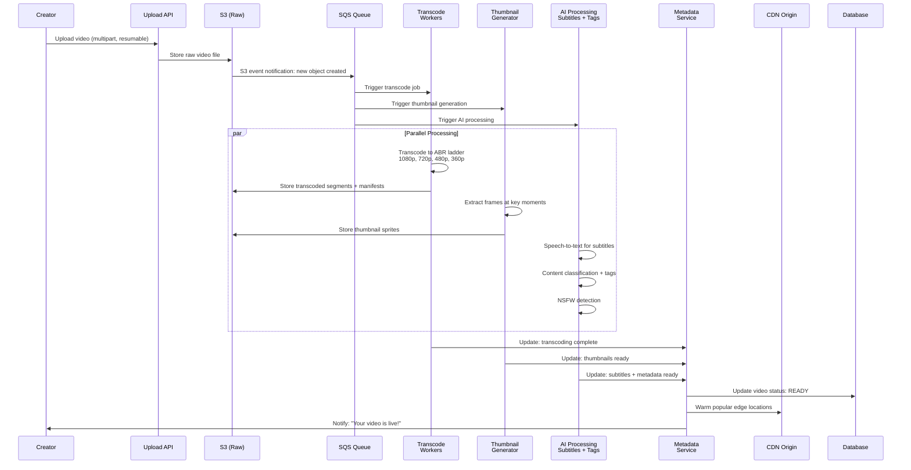
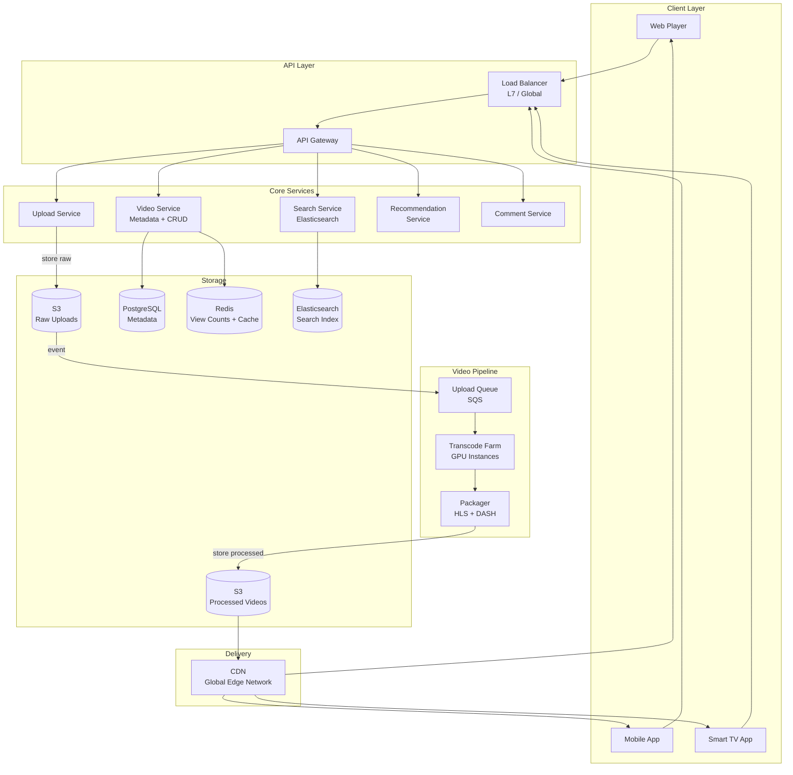

# Live Streaming and Video Systems

## The Pipeline That Powers Modern Video

Video streaming -- both live and on-demand -- accounts for over 65% of global internet
traffic. Understanding the architecture behind YouTube, Twitch, Netflix, and Discord
is essential for system design interviews. The problems are distinct: live streaming
demands low latency, while VOD demands efficient storage and delivery at massive scale.

This guide covers both, along with the real-time communication layer (WebRTC) used by
Discord, Zoom, and Google Meet.

---

## Live Video Streaming Architecture

### The Five-Stage Pipeline

Every live streaming system follows the same fundamental pipeline, from the broadcaster's
camera to the viewer's screen:

```
Camera -> Ingest -> Transcode -> Package -> Distribute -> Playback

Stage 1: INGEST      Receive raw video from broadcaster
Stage 2: TRANSCODE   Convert to multiple quality levels
Stage 3: PACKAGE     Segment into chunks for streaming protocol
Stage 4: DISTRIBUTE  Push to CDN edge servers worldwide
Stage 5: PLAYBACK    Adaptive bitrate player selects best quality
```



### Stage 1: Ingest

The broadcaster sends their video stream to the platform's ingest servers.

**Protocols:**
| Protocol | Latency | Reliability | Adoption |
|---|---|---|---|
| **RTMP** | 1-3s | Good (TCP) | Legacy but dominant (OBS, Twitch, YouTube) |
| **SRT** | 0.5-2s | Excellent (ARQ over UDP) | Growing (Haivision, Twitch) |
| **WebRTC** | <0.5s | Good (DTLS/SRTP) | Real-time use cases (Discord, Zoom) |
| **RTSP** | 1-2s | Good (TCP/UDP) | IP cameras, surveillance |

**RTMP is still king for live streaming ingest** despite being a 2002-era Flash protocol.
Why? Every streaming software (OBS, Streamlabs, XSplit) supports it. The broadcaster
sends an RTMP URL + stream key:

```
RTMP URL:  rtmp://live.twitch.tv/app
Stream Key: live_abc123xyz789

The broadcaster's encoder (OBS) connects via TCP to the ingest server,
performs an RTMP handshake, and begins streaming H.264/H.265 video + AAC audio.
```

**Ingest server responsibilities:**
1. Authenticate stream key (is this user allowed to broadcast?)
2. Validate stream parameters (resolution, bitrate, codec)
3. Forward raw stream to transcoding pipeline
4. Record raw stream to storage (for VOD replay)
5. Health monitoring: detect dropped frames, bitrate fluctuations

**Ingest server placement:**
```
Deploy ingest servers in every major region:
  - Broadcaster in New York -> US-East ingest
  - Broadcaster in Berlin -> EU-West ingest
  - Broadcaster in Tokyo -> AP-Northeast ingest

Selection: DNS-based geolocation or anycast routing
Redundancy: primary + backup ingest per region
```

---

### Stage 2: Transcode

Transcoding converts the broadcaster's single stream into multiple quality levels
(renditions) for adaptive bitrate streaming.

**Typical ABR ladder (Adaptive Bitrate):**
```
Rendition    Resolution    Bitrate     FPS    Target
1080p        1920x1080     6 Mbps      60     Desktop, fast connection
720p         1280x720      3 Mbps      30     Tablet, good connection
480p         854x480       1.5 Mbps    30     Mobile, average connection
360p         640x360       800 Kbps    30     Mobile, poor connection
160p         284x160       300 Kbps    30     Audio-only fallback, minimal data

Audio: AAC 128kbps stereo for all renditions
```

**Why transcode?**
- Broadcaster sends 1080p60 at 8 Mbps
- Viewer on 3G mobile has 500 Kbps bandwidth
- Without transcoding: buffering, unwatchable
- With transcoding: viewer gets 360p smoothly

**Transcoding infrastructure:**
```
Hardware: GPU-accelerated (NVIDIA T4/A10G instances)
  - 1 GPU can transcode 4-8 simultaneous streams
  - CPU-only: 1 stream per 8-16 cores (10x more expensive)

Cloud services:
  - AWS MediaLive: managed live transcoding
  - AWS MediaConvert: VOD transcoding
  - GCP Transcoder API
  - Self-hosted: FFmpeg on GPU instances

Cost: Transcoding is the most expensive part of live streaming
  - $0.05-0.10 per hour per rendition
  - 5 renditions = $0.25-0.50 per broadcast hour
```

---

### Stage 3: Package

Packaging segments the transcoded video into small chunks and generates manifest files
for streaming protocols.

**HLS (HTTP Live Streaming) -- Apple's protocol, industry standard:**
```
Segment duration: 6 seconds (standard) or 2 seconds (low-latency)
Manifest: .m3u8 playlist file

master.m3u8 (master playlist):
  #EXTM3U
  #EXT-X-STREAM-INF:BANDWIDTH=6000000,RESOLUTION=1920x1080
  1080p/playlist.m3u8
  #EXT-X-STREAM-INF:BANDWIDTH=3000000,RESOLUTION=1280x720
  720p/playlist.m3u8
  #EXT-X-STREAM-INF:BANDWIDTH=1500000,RESOLUTION=854x480
  480p/playlist.m3u8

1080p/playlist.m3u8 (media playlist):
  #EXTM3U
  #EXT-X-TARGETDURATION:6
  #EXT-X-MEDIA-SEQUENCE:142
  #EXTINF:6.0,
  segment_142.ts
  #EXTINF:6.0,
  segment_143.ts
  #EXTINF:6.0,
  segment_144.ts
```

**DASH (Dynamic Adaptive Streaming over HTTP) -- MPEG standard:**
```
Segment duration: 2-6 seconds
Manifest: .mpd (Media Presentation Description) XML file
Segment format: .m4s (fragmented MP4)

More flexible than HLS but less universally supported.
```

**CMAF (Common Media Application Format) -- unified approach:**
```
Goal: single segment format that works for both HLS and DASH
Format: fragmented MP4 (fMP4) chunks
Benefit: encode once, serve to both HLS and DASH players
Adoption: growing rapidly, supported by major CDNs
```

**Comparison:**
| Feature | HLS | DASH | CMAF |
|---|---|---|---|
| **Creator** | Apple | MPEG/ISO | MPEG + Apple + Microsoft |
| **Manifest** | .m3u8 | .mpd (XML) | Compatible with both |
| **Segment format** | .ts or .fmp4 | .m4s (fMP4) | .fmp4 (unified) |
| **DRM** | FairPlay | Widevine, PlayReady | All three |
| **Browser support** | Universal (Safari native) | Chrome, Firefox, Edge | Depends on wrapper |
| **Low-latency** | LL-HLS (Apple) | LL-DASH | LL-CMAF |
| **iOS support** | Native | Requires JS player | Via HLS wrapper |
| **Industry trend** | Dominant for delivery | Dominant for standards | Convergence target |

---

### Stage 4: Distribute via CDN

CDN edge servers cache video segments close to viewers, reducing latency and origin
server load.

```
Origin server generates segments:
  segment_100.ts (6 seconds of video)
  segment_101.ts
  segment_102.ts ...

CDN pull model:
  1. Viewer in Tokyo requests segment_100.ts
  2. Tokyo edge server: cache miss
  3. Tokyo edge -> Origin server: fetch segment_100.ts
  4. Origin responds with segment
  5. Tokyo edge caches segment (TTL: 10 seconds for live)
  6. Tokyo edge serves to viewer
  7. Next viewer in Tokyo: cache HIT (instant)

CDN push model (for popular streams):
  1. Origin proactively pushes new segments to all edge POPs
  2. Every viewer gets cache hit immediately
  3. Used for streams with >10K concurrent viewers
```

**CDN for live vs VOD:**
```
Live streaming CDN:
  - Short TTLs (segment duration or less)
  - Must support low-latency segment delivery
  - Origin shield to reduce origin load
  - Segment expiry: old segments evicted quickly
  
VOD CDN:
  - Long TTLs (hours to days)
  - Full video pre-cached at popular edges
  - Range requests for seeking
  - Much higher cache hit ratio (same content served repeatedly)
```

---

### Stage 5: Adaptive Bitrate Playback

The player dynamically selects the best quality based on current network conditions.

```
ABR Algorithm (simplified):

  every segment_download:
    measured_bandwidth = segment_size / download_time
    buffer_level = seconds of video in player buffer
    
    if buffer_level < 5 seconds:
      switch DOWN immediately (prevent stall)
    else if measured_bandwidth > current_bitrate * 1.5:
      switch UP one level (conservative upgrade)
    else if measured_bandwidth < current_bitrate * 0.8:
      switch DOWN one level (prevent stall)
    else:
      stay at current level
      
    // Hysteresis: require sustained improvement before switching up
    // Prevents rapid oscillation between quality levels
```

**Popular ABR players:**
- **hls.js**: Open-source HLS player for web (used by Twitch)
- **dash.js**: DASH reference player
- **Shaka Player**: Google's open-source player (HLS + DASH)
- **ExoPlayer**: Android (supports HLS, DASH, SmoothStreaming)
- **AVPlayer**: iOS native (HLS only)

---

## Latency Spectrum

Different use cases tolerate different latency levels. This is the most important
tradeoff in live streaming architecture.

```
Latency                Use Case                    Technology
<200ms                 Video conferencing           WebRTC
<1 second              Live auctions, sports bets   WebRTC / WHEP
2-5 seconds            Esports, interactive live     LL-HLS, LL-DASH, LL-CMAF
5-15 seconds           Standard live streaming       Tuned HLS/DASH
15-30 seconds          Default HLS                   Standard HLS (3 segments)
30-60+ seconds         Poorly configured live        HLS with long segments
```

| Category | Latency | How | Tradeoff |
|---|---|---|---|
| **Traditional Live** | 30-60s | HLS with 10s segments, 3-segment buffer | Maximum reliability, poor interactivity |
| **Reduced Latency** | 10-20s | HLS with 4s segments, 2-segment buffer | Good reliability, limited interactivity |
| **Low-Latency Live** | 2-5s | LL-HLS (partial segments), CMAF chunked | Good interactivity, some quality tradeoff |
| **Real-Time** | <1s | WebRTC (DTLS/SRTP, no segments) | Full interactivity, limited scale (1000s) |
| **Ultra Low-Latency** | <200ms | WebRTC with optimized network path | Video calling quality, very limited scale |

**How Low-Latency HLS (LL-HLS) works:**
```
Standard HLS:
  Client waits for full 6-second segment -> downloads -> plays
  Minimum latency: 3 segments = 18 seconds

LL-HLS:
  Segments split into "parts" (~200ms each)
  Client requests parts as they are produced (HTTP chunked transfer)
  Minimum latency: ~2-3 seconds
  
  Key features:
  - Partial segments (EXT-X-PART)
  - Blocking playlist reload (server holds response until new part ready)
  - Rendition reports (avoid redundant playlist fetches)
```

---

## Live Chat Alongside Video

Every live stream needs a chat. Twitch chat, YouTube Live chat, Instagram Live comments
-- these are real-time messaging systems with unique fan-out challenges.

**Architecture:**
```
Live chat room = 1 WebSocket "room" per stream

Challenges at scale:
  - Twitch stream with 200K viewers = 200K WebSocket connections in one room
  - Chat rate: 1000+ messages per second for popular streams
  - Each message must be broadcast to ALL 200K viewers
  - That's 200K * 1000 = 200M messages per second fan-out
  
Solution: hierarchical fan-out

  Chat message from user ->
    Chat server (1) ->
      Fan-out tier (20 servers, each handling 10K connections) ->
        200K viewers

  Each fan-out server maintains ~10K WebSocket connections
  Chat server publishes to all fan-out servers via pub/sub
  Fan-out servers broadcast to their connected viewers
```



**Chat features:**
- **Rate limiting**: Max 1 message per second per user (Twitch: 20 messages per 30 seconds)
- **Moderation**: AutoMod (ML-based), banned words, moderator tools
- **Emotes**: Custom emotes (Twitch), stickers, reactions
- **Slow mode**: Enforce N-second delay between messages per user
- **Sub-only mode**: Only subscribers can chat
- **Chat replay**: Store messages with timestamps for VOD replay

---

## VOD (Video on Demand) Architecture

VOD is the flip side of live streaming: pre-recorded content uploaded, processed, and
served on demand. Netflix, YouTube (non-live), Disney+ all use this model.

### Upload and Processing Pipeline



**Upload handling:**
```
Resumable uploads are essential:
  - Large files (4K video = gigabytes)
  - Unreliable creator connections
  - Protocol: TUS (open protocol) or Google's resumable upload protocol
  
Flow:
  1. Client: POST /uploads -> server returns upload_id
  2. Client: PATCH /uploads/{id} with chunk (5MB at a time)
  3. Server: append chunk to S3 multipart upload
  4. If connection drops: client resumes from last acknowledged byte
  5. Client: POST /uploads/{id}/complete -> finalize upload
```

**Transcoding at scale:**
```
YouTube processes 500+ hours of video uploaded every minute.

Strategy:
  1. Queue-based: each upload triggers a transcode job in SQS/Kafka
  2. Workers: auto-scaling group of GPU instances
  3. Parallel: each rendition transcoded independently
  4. Chunked: split long videos into 5-minute chunks, transcode in parallel, stitch
  
Time:
  1-hour 1080p video:
    Sequential: ~30 minutes (1 GPU)
    Chunked parallel: ~5 minutes (12 GPUs processing chunks)
    
  Cost per video:
    ~$0.015 per minute of output video (AWS MediaConvert pricing)
    1-hour video * 5 renditions = ~$4.50
```

---

## DRM (Digital Rights Management)

Premium content (Netflix, Disney+, HBO) requires DRM to prevent piracy. Three DRM
systems dominate, each tied to a platform ecosystem:

| DRM System | Owner | Platforms | Security Levels |
|---|---|---|---|
| **Widevine** | Google | Chrome, Android, Smart TVs, Chromecast | L1 (hardware), L2, L3 (software) |
| **FairPlay** | Apple | Safari, iOS, tvOS, macOS | Hardware-backed on Apple silicon |
| **PlayReady** | Microsoft | Edge, Windows, Xbox, Smart TVs | SL150 (software), SL2000, SL3000 (hardware) |

**DRM flow:**
```
1. Client requests video manifest (HLS/DASH)
2. Manifest indicates content is encrypted (CENC or SAMPLE-AES)
3. Client requests license from DRM license server:
   - Sends device certificate proving hardware security level
   - Sends content ID
4. License server validates:
   - User has valid subscription
   - Device meets security requirements
   - Geographic restrictions (geo-blocking)
5. License server returns decryption key (time-limited)
6. Client decrypts and plays video in protected pipeline
   (hardware-backed: video never exposed to software)
```

**Multi-DRM strategy:**
```
To support all platforms, content providers encrypt once using CENC
(Common Encryption) and serve licenses from all three DRM systems:

  Browser      DRM         How
  Chrome       Widevine    EME API -> Widevine CDM
  Safari       FairPlay    Native HLS -> FairPlay Streaming
  Edge         PlayReady   EME API -> PlayReady CDM
  Firefox      Widevine    EME API -> Widevine CDM
  iOS          FairPlay    AVPlayer -> FairPlay Streaming
  Android      Widevine    ExoPlayer -> Widevine CDM
  
Services: BuyDRM, PallyCon, Axinom (multi-DRM license servers)
```

---

## Real-World Systems Deep Dive

### YouTube Live
- **Ingest**: RTMP (primary) + HLS push (backup)
- **Transcoding**: Custom hardware (TPU-adjacent ASICs) + software fallback
- **Delivery**: Google's private CDN (edge nodes in 100+ countries)
- **Latency**: Standard (~15s), Low-latency (~3-5s), Ultra-low (~1-2s experimental)
- **Scale**: Millions of concurrent live streams, billions of daily views (VOD + live)
- **Chat**: Custom real-time system, supports Super Chat (paid messages)
- **VOD**: Every live stream automatically becomes a VOD after ending

### Twitch
- **Ingest**: RTMP + SRT to regional ingest servers
- **Transcoding**: Partners/Affiliates get transcoding; others get "source quality only"
- **Delivery**: AWS CloudFront + custom CDN partnerships
- **Latency**: Normal (~5-10s), Low-latency (~2-3s default)
- **Scale**: 2.5M+ average concurrent viewers, 9M+ active streamers per month
- **Chat**: IRC-based protocol (upgraded), custom emote system (BTTV, 7TV)
- **Unique**: "Squad Streaming" (4 streams in one view), Clips, Channel Points

### Netflix (VOD)
- **Transcoding**: Per-title encoding -- ML determines optimal bitrate ladder per video
  (animation needs less bitrate than action sequences)
- **Delivery**: Open Connect (custom CDN, hardware in 1000+ ISP locations worldwide)
- **Encoding**: VMAF (perceptual quality metric) to optimize quality vs bitrate
- **Pre-positioning**: Predict what will be popular, pre-cache on edge servers
- **Device profiles**: Different encoding ladders for phone vs TV vs laptop
- **Scale**: 280M+ subscribers, 15%+ of global internet traffic

### Discord (Real-Time Audio/Video)
- **Protocol**: WebRTC for audio/video (no HLS/DASH -- too slow)
- **Architecture**: SFU (Selective Forwarding Unit) for group calls
  - Each participant sends one stream to the SFU
  - SFU forwards relevant streams to each participant
  - No mixing/transcoding on server (saves CPU, maintains low latency)
- **Scale**: 150 users in a voice channel, 25 video streams simultaneously
- **Audio**: Opus codec at 64 Kbps, with noise suppression (Krisp integration)
- **Go Live**: Screen sharing uses WebRTC for small audiences, HLS for larger ones
- **Latency**: <200ms for voice, <500ms for video

---

## WebRTC: The Real-Time Protocol

WebRTC deserves special attention because it is the only technology that achieves
sub-second video latency at scale.

**Architecture patterns:**

```
1:1 (Peer-to-Peer):
  User A <---WebRTC---> User B
  Used by: FaceTime, WhatsApp calls
  
1:Many with SFU:
  User A ---> SFU ---> User B
                  ---> User C
                  ---> User D
  Used by: Discord, Google Meet, Zoom
  
1:Many with MCU (Multipoint Control Unit):
  User A ---> MCU ---> Mixed stream ---> User B
  User B --->                       ---> User C
  User C --->
  Used by: Legacy conferencing systems
  MCU mixes all streams into one (expensive server-side)
```

**SFU vs MCU:**
| Aspect | SFU | MCU |
|---|---|---|
| **Server CPU** | Low (just forwarding) | Very high (mixing/transcoding) |
| **Client bandwidth** | Higher (receives N streams) | Lower (receives 1 mixed stream) |
| **Latency** | Lower (no processing) | Higher (mixing adds delay) |
| **Flexibility** | High (client chooses layout) | Low (server dictates layout) |
| **Scale** | Better (linear cost) | Worse (quadratic processing) |
| **Industry trend** | Dominant (Discord, Meet, Zoom) | Legacy |

---

## Interview Walkthrough: "Design YouTube"

### Step 1: Clarify Requirements

**Functional:**
- Upload videos (up to 12 hours, any resolution)
- Watch videos with adaptive quality
- Search and discover videos
- Like, comment, subscribe
- Live streaming (bonus)

**Non-functional:**
- 1B+ daily active users
- 500+ hours uploaded per minute
- Smooth playback globally (99.99% availability)
- Fast upload processing (<10 minutes for a 10-minute video)
- Low-latency search results

### Step 2: High-Level Architecture



### Step 3: Video Upload Flow (Detailed)

```
1. Client initiates resumable upload
   POST /api/videos/upload/init
   Response: { upload_url: "https://upload.youtube.example/v/abc123", upload_id: "abc123" }

2. Client uploads chunks (5MB each)
   PUT https://upload.youtube.example/v/abc123
   Content-Range: bytes 0-5242879/104857600
   
3. Upload service stores to S3 (multipart upload)
   
4. Client completes upload
   POST /api/videos/upload/abc123/complete
   Body: { title, description, tags, thumbnail, privacy }
   
5. S3 event triggers processing pipeline:
   a. Virus/malware scan
   b. Copyright detection (Content ID / fingerprinting)
   c. NSFW/safety classification
   d. Transcode to ABR ladder (1080p, 720p, 480p, 360p, 240p)
   e. Generate thumbnails (8 candidates, creator picks 1)
   f. Extract audio for subtitles (speech-to-text)
   g. Build search index entry
   
6. Video status: PROCESSING -> READY
   Notify creator: "Your video is live!"
```

### Step 4: Video Playback Flow

```
1. Client requests video page
   GET /api/videos/dQw4w9WgXcQ
   Response: { title, description, manifest_url, thumbnail_url, view_count, ... }
   
2. Client fetches manifest from CDN
   GET https://cdn.youtube.example/v/dQw4w9WgXcQ/master.m3u8
   Response: playlist with all quality levels
   
3. Player selects initial quality based on detected bandwidth
   GET https://cdn.youtube.example/v/dQw4w9WgXcQ/720p/segment_0.ts
   
4. Player continuously adapts quality:
   - Bandwidth increases -> switch to 1080p
   - Bandwidth drops -> switch to 480p
   - Buffer runs low -> emergency switch to lowest quality
   
5. View counting:
   - Client sends "view" event after 30 seconds of playback
   - Redis INCR for real-time count (approximate)
   - Kafka event for exact count (deduplicated, written to DB hourly)
```

### Step 5: Key Design Decisions

**1. Storage estimates:**
```
500 hours uploaded per minute:
  Raw: 500 hours * 60 min * ~100MB/min = ~3TB per minute = ~4.3PB per day
  After transcode (5 renditions): ~2x raw = ~8.6PB per day
  After encoding optimization: ~4-5PB per day
  
  Annual: ~1.5-2 Exabytes
  
  This is why YouTube/Google builds custom storage infrastructure.
```

**2. CDN strategy:**
```
Popular videos (top 10%): pre-cached at all edge locations
  - Represent 90% of views
  - Warm cache on upload completion
  
Long-tail videos (bottom 90%): origin-pull on demand
  - May only be viewed 10 times total
  - Not worth pre-caching everywhere
  - Origin in 3 regions, CDN pulls on cache miss
```

**3. View counting at scale:**
```
Challenge: 100M+ views per hour across all videos
  
Naive: UPDATE videos SET view_count = view_count + 1
  -> Database crushed by write volume
  
Solution: multi-tier counting
  Tier 1: Redis INCR (real-time, approximate, in-memory)
  Tier 2: Kafka aggregate (exact, deduplicated, 5-minute windows)
  Tier 3: Database write (batch, hourly)
  
Display: show Redis count (fast but approximate)
Analytics: use Kafka/DB count (exact but delayed)
```

**4. Recommendation/Search:**
```
Search: Elasticsearch cluster
  - Index: video title, description, tags, auto-generated captions
  - Ranking: relevance + freshness + engagement signals
  
Recommendations: ML pipeline
  - Candidate generation: collaborative filtering (users who watched X also watched Y)
  - Ranking: neural network scores candidates by predicted watch time
  - Features: user history, video metadata, context (time of day, device)
  - Served from a feature store (Redis/Cassandra) for low latency
```

---

## Key Takeaways for Interviews

1. **The 5-stage live pipeline is universal**: Ingest -> Transcode -> Package -> CDN -> Play
2. **RTMP for ingest, HLS for delivery** -- different protocols for different stages
3. **Adaptive bitrate is non-negotiable** -- users have wildly different bandwidth
4. **Latency is a spectrum, not a binary** -- know which technology matches which latency
5. **Transcoding is the most expensive operation** -- GPU acceleration is essential
6. **CDN is what makes global scale possible** -- cache popular content at the edge
7. **Live chat fan-out is its own scaling problem** -- hierarchical fan-out for 100K+ rooms
8. **VOD pipeline is async** -- upload triggers a processing pipeline (transcode, thumbnails,
   subtitles, safety classification)
9. **DRM requires three systems** to cover all platforms (Widevine + FairPlay + PlayReady)
10. **WebRTC for real-time (<1s)**, HLS/DASH for everything else
11. **View counting uses multi-tier aggregation** -- Redis (fast) -> Kafka (exact) -> DB
12. **YouTube's scale is extraordinary** -- 500+ hours per minute, exabytes of storage,
    custom CDN, custom hardware -- mention this in interviews to show awareness of scale
