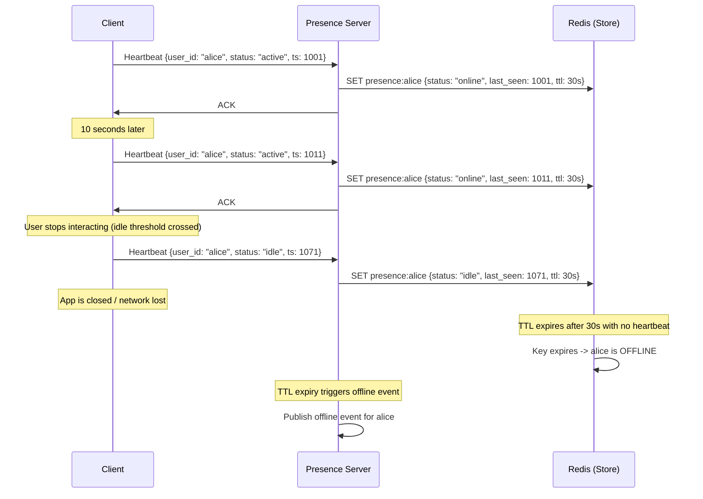
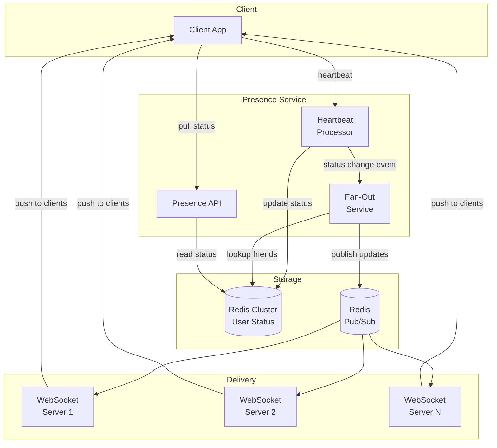
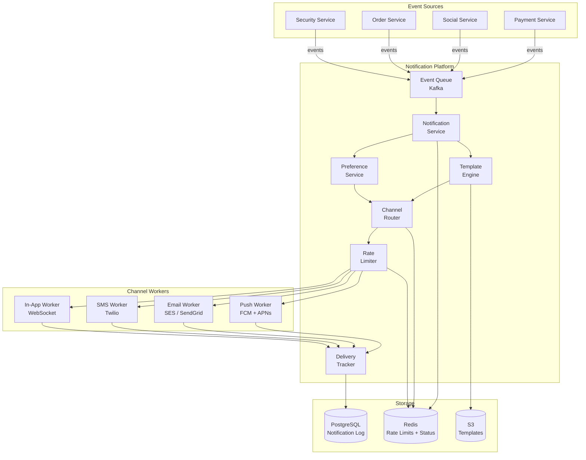
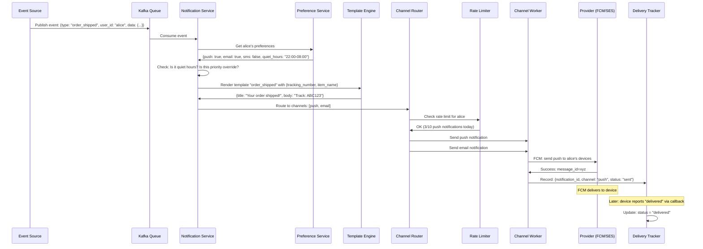
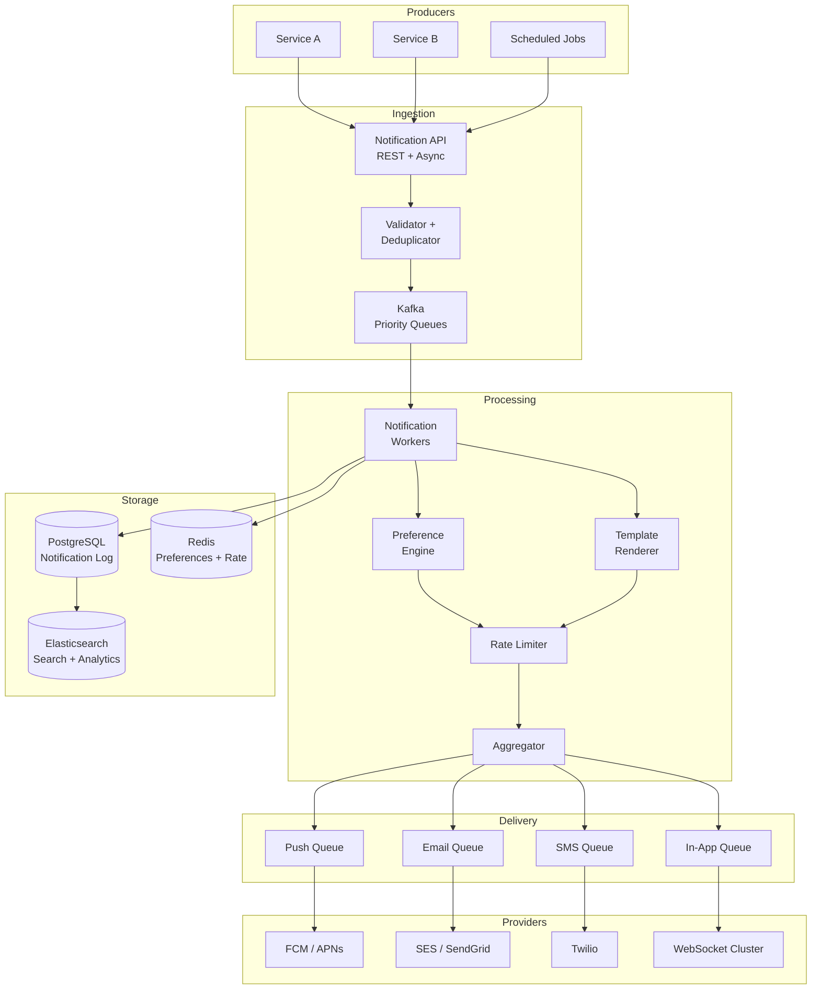

# Presence Systems and Notification Architecture

## Part 1: Presence Systems

### The Problem: Who Is Online Right Now?

Presence systems answer a deceptively simple question: "Is this user online?" At the
scale of WhatsApp (2B+ users), Slack (millions of concurrent users), or Discord
(hundreds of millions of users), this becomes one of the hardest real-time problems
in system design.

The core challenge: **maintaining accurate, real-time status for millions of users,
propagated to millions of interested observers, with sub-second latency.**

---

### Presence States

Every presence system operates on a state machine:

```
                    heartbeat received
         +------------------------------------+
         |                                    |
         v          no activity for T1        |
     +--------+   ----------------------> +------+
     | ONLINE |                           | IDLE |
     +--------+   <---------------------- +------+
         |          activity detected         |
         |                                    |
         |  no heartbeat                      | no heartbeat
         |  for T2                            | for T2
         |                                    |
         v                                    v
     +---------+                          +---------+
     | OFFLINE |  <---------------------- | OFFLINE |
     +---------+                          +---------+
```

**State definitions:**
- **Online**: Client has sent a heartbeat within the last T1 seconds AND user has interacted
  with the app (keypress, mouse move, touch) within the last T1 seconds
- **Idle**: Client is sending heartbeats (app is open) but no user interaction for T1 seconds
  (user stepped away from keyboard, phone screen locked but app running)
- **Offline**: No heartbeat received for T2 seconds (app closed, network lost, device off)

**Typical thresholds:**
```
T1 (idle threshold):    60-120 seconds of no interaction
T2 (offline threshold): 30-60 seconds of no heartbeat
```

---

### Heartbeat Approach

The fundamental mechanism for presence detection: clients send periodic signals to the
server proving they are alive.



**Heartbeat payload:**
```json
{
  "user_id": "alice",
  "status": "active",
  "timestamp": 1711929600,
  "device": "mobile",
  "client_version": "4.2.1",
  "capabilities": ["typing", "voice", "video"]
}
```

**Heartbeat interval tradeoffs:**
```
Interval    Accuracy     Server Load      Battery Impact
5 seconds   Excellent    Very High        Significant
10 seconds  Good         High             Moderate
30 seconds  Acceptable   Moderate         Low
60 seconds  Poor         Low              Minimal

Industry standard: 10-30 seconds depending on platform
  WhatsApp: ~10s
  Slack:    ~30s
  Discord:  ~30-45s (with WebSocket, so effectively continuous)
```

---

### Fan-Out: Notifying Interested Users

When Alice comes online, who needs to know? Her friends, her team members, people in
her chat rooms. This is the **fan-out problem**.

**Approach 1: Fan-out on change (push)**
```
When Alice goes ONLINE:
  1. Look up Alice's contacts: [Bob, Carol, Dave, ..., 500 friends]
  2. For each contact who is ONLINE:
     a. Send presence update via their WebSocket connection
  3. Total messages sent: up to 500

Problem: Celebrity user with 100K friends goes online -> 100K messages instantly
```

**Approach 2: Fan-out on read (pull)**
```
When Bob opens a chat with Alice:
  1. Bob queries: GET presence:alice
  2. Server returns: {status: "online", last_seen: 1711929600}
  3. Bob subscribes to future changes for Alice

Problem: Stale data until Bob explicitly checks
```

**Approach 3: Hybrid (what WhatsApp/Slack do)**
```
- Small friend lists (<500): fan-out on change (push)
- Large friend lists (>500): fan-out on read (pull) + subscribe
- Active conversations: always push (high priority)
- Contact list view: pull on demand with short cache
```



---

### Scaling Presence to Millions of Users

**Challenge**: 100M concurrent users, each with ~200 contacts, status changes every few
minutes. This generates billions of presence events per hour.

**Strategy 1: Partition by user_id**
```
Hash(user_id) -> partition number

Partition 0: users A-F   -> Redis node 0
Partition 1: users G-L   -> Redis node 1
...
Partition N: users U-Z   -> Redis node N

Each partition handles ~100M/N users
Cross-partition queries: needed when Alice (partition 0) checks Bob (partition 3)
  -> Route to Bob's partition
```

**Strategy 2: In-memory store (Redis)**
```
Key:   presence:{user_id}
Value: {status, last_seen, device, server_id}
TTL:   30 seconds (auto-expire -> offline)

Memory per user: ~200 bytes
100M users: ~20 GB -> fits in a Redis cluster easily

Operations:
  SET with TTL: O(1)
  GET: O(1)
  Subscribe: O(1) per subscription
```

**Strategy 3: Pub/Sub for cross-server updates**
```
User Alice is connected to WebSocket Server 3.
User Bob is connected to WebSocket Server 7.
Alice goes online -> how does Server 7 know to notify Bob?

Solution: Redis Pub/Sub (or Kafka for durability)

Channel per user: presence:changes:bob
When Alice goes online:
  1. Fan-out service checks Bob is Alice's contact
  2. Publish to channel: presence:changes:bob
  3. Server 7 subscribes to presence:changes:bob
  4. Server 7 pushes to Bob's WebSocket

Problem: 100M channels is expensive in Redis Pub/Sub
Solution: Shard channels by user partition, use consistent hashing
```

---

### WhatsApp vs Facebook Approach

**WhatsApp: Simple and conservative**
- Last seen timestamp: "last seen today at 2:15 PM"
- Binary status: online or show last seen time
- No "typing" status in contact list (only in active chat)
- Heartbeat-based with long intervals
- Privacy controls: who can see your last seen
- Optimized for mobile: minimal battery drain

**Facebook/Messenger: Rich and aggressive**
- Active Now (green dot) / Recently Active / Offline
- Activity status on profiles
- "Active on Messenger" vs "Active on Facebook" (cross-platform)
- Aggressive push: broadcasts to all friends immediately
- Richer signals: location data, device type
- Higher server cost but more engagement-driving

**Slack: Workspace-scoped**
- Green dot (active), "Z" (DND), clock (away), empty (offline)
- Custom status messages ("In a meeting until 3 PM")
- Workspace-scoped: your status is per-workspace, not global
- Automatic away after 10 minutes of inactivity
- Scheduled DND (quiet hours)
- Integration-driven: Slack can set your status based on Google Calendar

---

### Presence Edge Cases

**Graceful disconnect vs crash:**
```
Graceful: Client sends "going offline" message -> immediate status update
Crash:    Client vanishes -> must wait for heartbeat TTL to expire (30s stale)

Solution: WebSocket close event as early signal
  - TCP FIN received -> immediately mark as offline
  - No FIN (crash/network) -> fall back to heartbeat TTL
```

**Multiple devices:**
```
Alice has: phone (active) + laptop (idle) + tablet (offline)
What status to show? ONLINE (use most-active device)

Rule: status = max(device_statuses)
  where online > idle > offline

When last active device goes offline -> user goes offline
```

**Network flapping:**
```
User's connection drops for 5 seconds, reconnects.
Without protection: ONLINE -> OFFLINE -> ONLINE (friends see flicker)

Solution: Grace period
  - Don't publish OFFLINE until grace period (15-30s) expires
  - If user reconnects within grace period, no status change published
  - Reduces noise significantly
```

---

## Part 2: Notification Systems

### Multi-Channel Notification Architecture

Modern applications deliver notifications through multiple channels. The system must
route each notification to the right channel(s) based on urgency, user preferences,
and delivery context.

**Channels:**
| Channel | Provider | Latency | Cost | Reach | Rich Content |
|---|---|---|---|---|---|
| **Push (Mobile)** | FCM (Android), APNs (iOS) | 1-5 seconds | Free (mostly) | App installed | Limited |
| **Push (Web)** | Web Push API / FCM | 1-5 seconds | Free | Browser permission | Limited |
| **Email** | SES, SendGrid, Postmark | Seconds-minutes | $0.0001/email | Universal | Rich HTML |
| **SMS** | Twilio, Vonage, SNS | 1-30 seconds | $0.0075/SMS | Universal | 160 chars |
| **In-App** | WebSocket | <1 second | Free | App open | Rich |
| **Webhook** | Custom | 1-5 seconds | Free | Developer | Full payload |

### End-to-End Architecture



### Notification Processing Pipeline



---

### Priority Handling

Not all notifications are equal. A payment failure is urgent. A new follower is
informational. A weekly digest is background noise.

```
Priority Levels:
  
  CRITICAL (P0): Deliver immediately, all channels, override quiet hours
    Examples: Account security alert, payment failure, fraud detected
    Channels: Push + SMS + Email (all simultaneously)
    Rate limit: Exempt
    
  HIGH (P1): Deliver immediately, preferred channels
    Examples: Direct message, order update, meeting starting
    Channels: Push + In-App
    Rate limit: Relaxed (20/hour)
    
  NORMAL (P2): Deliver when convenient, may batch
    Examples: New follower, post liked, comment reply
    Channels: Push or In-App
    Rate limit: Standard (10/hour)
    
  LOW (P3): Batch and deliver during optimal times
    Examples: Weekly digest, feature announcement, re-engagement
    Channels: Email only, batched daily/weekly
    Rate limit: Strict (1/day)
```

**Implementation:**
```
// Priority queue per channel
Kafka topics:
  notifications.critical  -> 32 partitions, 100 consumers
  notifications.high      -> 16 partitions, 50 consumers
  notifications.normal    -> 8 partitions, 20 consumers
  notifications.low       -> 4 partitions, 5 consumers

Critical notifications get 10x the processing capacity.
```

---

### Template Engine

Notifications need to be rendered for different channels and locales from a single
template definition.

```
Template: "order_shipped"
Version: 3
Locale: en-US

push:
  title: "Your order is on its way!"
  body: "{{item_name}} shipped via {{carrier}}. Track: {{tracking_number}}"
  icon: "shipping_icon"
  action_url: "/orders/{{order_id}}/tracking"

email:
  subject: "Order #{{order_id}} has shipped"
  html_template: "s3://templates/order_shipped/v3/en-US.html"
  text_fallback: "Your order {{order_id}} shipped. Track at: {{tracking_url}}"

sms:
  body: "Your {{item_name}} shipped! Track: {{short_url}}"

in_app:
  title: "Order Shipped"
  body: "{{item_name}} is on its way"
  type: "order_update"
  payload: { order_id: "{{order_id}}", tracking: "{{tracking_number}}" }
```

**Merge process:**
```
1. Fetch template by (event_type, version, locale)
2. Fall back: en-US -> en -> default if locale not found
3. Merge data into placeholders: {{variable}} -> value
4. Channel-specific rendering:
   - Push: plain text, max 256 chars
   - Email: full HTML with inline CSS
   - SMS: plain text, max 160 chars (or multi-part)
   - In-App: structured JSON payload
5. Validate output (no unresolved {{placeholders}})
```

---

### Delivery Tracking

Every notification must be tracked through its lifecycle:

```
Notification Lifecycle:
  
  CREATED      -> Event received, notification record created
  QUEUED       -> Placed in channel queue for delivery
  SENT         -> Handed off to provider (FCM/SES/Twilio)
  DELIVERED    -> Provider confirmed delivery to device/inbox
  READ         -> User opened/viewed the notification
  CLICKED      -> User tapped/clicked the notification
  FAILED       -> Delivery failed (will retry)
  DROPPED      -> Rate limited, user opted out, or max retries exceeded

Tracking table:
  notification_id | user_id | channel | status   | provider_msg_id | created_at | updated_at
  notif_001       | alice   | push    | DELIVERED| fcm_abc123      | 10:00:00   | 10:00:03
  notif_001       | alice   | email   | SENT     | ses_xyz789      | 10:00:00   | 10:00:01
```

**Delivery confirmation sources:**
- **FCM**: Delivery receipt via Firebase Cloud Messaging callback
- **APNs**: HTTP/2 response indicates accepted/rejected
- **Email**: SES webhooks for delivered/bounced/complained
- **SMS**: Twilio status callbacks
- **In-App**: WebSocket ACK from client

---

### Retry with Exponential Backoff

```
Retry Strategy for Failed Deliveries:

  Attempt 1: Immediate
  Attempt 2: Wait 1 second
  Attempt 3: Wait 2 seconds
  Attempt 4: Wait 4 seconds
  Attempt 5: Wait 8 seconds
  Attempt 6: Wait 16 seconds (max backoff)
  
  After 6 failures: Move to Dead Letter Queue (DLQ)
  
Formula: delay = min(base * 2^(attempt-1), max_delay) + jitter

Jitter: Add random 0-1s to prevent thundering herd
  
Channel-specific retry limits:
  Push:    3 retries (device may be unreachable)
  Email:   5 retries (transient SMTP errors common)
  SMS:     2 retries (expensive, fail fast)
  In-App:  1 retry (user online or not)
  
Fallback chain: if push fails after retries -> try email
```

---

### User Preferences and Controls

```json
{
  "user_id": "alice",
  "global": {
    "quiet_hours": { "start": "22:00", "end": "08:00", "timezone": "US/Pacific" },
    "email_frequency": "instant",
    "marketing_opt_in": false
  },
  "channels": {
    "push": { "enabled": true, "devices": ["device_abc", "device_xyz"] },
    "email": { "enabled": true, "address": "alice@example.com" },
    "sms": { "enabled": false },
    "in_app": { "enabled": true }
  },
  "categories": {
    "direct_messages": { "push": true, "email": false, "sms": false },
    "mentions": { "push": true, "email": true, "sms": false },
    "marketing": { "push": false, "email": false, "sms": false },
    "security": { "push": true, "email": true, "sms": true },
    "order_updates": { "push": true, "email": true, "sms": false }
  }
}
```

**Preference resolution order:**
```
1. Is user opted out of this category entirely? -> DROP
2. Is it quiet hours AND notification is not CRITICAL? -> DEFER to morning
3. Is this channel enabled for this category? -> Route to enabled channels
4. Has user exceeded rate limit for this channel? -> THROTTLE (batch for later)
5. Does user have a valid device/address for this channel? -> SEND or SKIP
```

---

### Rate Limiting Per User

**Why**: Notification fatigue is real. Instagram could send 50 notifications per hour
to a popular user. Without rate limiting, users disable notifications entirely.

```
Rate Limits (per user, per channel):

  Push notifications:
    - Max 10 per hour (normal priority)
    - Max 50 per day
    - Critical: exempt
    
  Email:
    - Max 3 per hour
    - Max 10 per day
    - Digest: batch remaining into daily summary
    
  SMS:
    - Max 1 per hour (expensive + intrusive)
    - Max 5 per day
    - Only security + critical order updates
    
  In-App:
    - No hard limit (user controls by scrolling)
    - But aggregate: "Alice and 23 others liked your post"
```

**Aggregation**: When rate limit is hit, aggregate similar notifications:
```
Instead of:
  "Bob liked your post"
  "Carol liked your post"
  "Dave liked your post"
  ...
  
Aggregate to:
  "Bob, Carol, Dave, and 47 others liked your post"
```

**Implementation with Redis:**
```
Key:   ratelimit:{user_id}:{channel}:{window}
Value: count
TTL:   window duration

INCR ratelimit:alice:push:hourly
If count > 10: throttle
TTL: 3600 seconds (1 hour)
```

---

### Real-World Notification Systems

**Uber (trip updates)**:
- Critical path: trip request -> driver assigned -> arriving -> trip started -> trip ended
- Push + in-app for every stage
- SMS fallback for driver arrival (high-value moment)
- Real-time location updates via WebSocket (not traditional notification)
- Driver and rider get different notification templates for same event

**Slack (mentions and messages)**:
- Desktop: native push via OS notification API
- Mobile: FCM/APNs
- Aggressive batching: if you receive 10 messages in 30 seconds, Slack sends 1 push
- Thread-aware: notifications for thread replies go to thread participants only
- DND/scheduled: honors user-set quiet hours
- "Mark as read" on one device silences notification on all devices

**Instagram (engagement)**:
- Heavy aggregation: "user1, user2, and 48 others liked your photo"
- Algorithmically ranked: not all likes trigger notifications
- Re-engagement: "You have unseen notifications" after 24h of inactivity
- A/B tested: notification copy is constantly optimized for engagement

---

## Interview Walkthrough: "Design a Notification System"

### Step 1: Clarify Requirements

**Functional:**
- Support push, email, SMS, in-app channels
- Templates with variable substitution
- User preferences (channel, category, quiet hours)
- Delivery tracking (sent, delivered, read)
- Priority levels with different handling

**Non-functional:**
- 100M+ notifications per day
- Critical notifications delivered within 5 seconds
- Normal notifications within 30 seconds
- 99.9% delivery success rate (for non-opted-out users)
- At-least-once delivery (better to duplicate than miss)

**Scale estimation:**
```
100M notifications/day
= ~1,200/second average
= ~5,000/second peak (2-4x average)

Per notification: ~2KB payload
Daily data: 100M * 2KB = 200GB
Storage for 30 days: ~6TB
```

### Step 2: High-Level Design



### Step 3: Key Design Decisions

**1. Kafka for event ingestion:**
- Separate topics by priority: `notif.critical`, `notif.high`, `notif.normal`, `notif.low`
- Critical topic gets 10x consumer count
- At-least-once semantics with idempotency keys for deduplication

**2. Deduplication:**
- Each notification has an idempotency_key = hash(event_type + user_id + event_data)
- Check Redis SET before processing: `SADD dedup:{key}` with 24h TTL
- Prevents duplicate notifications from retry storms

**3. User preferences in Redis:**
- Cache preferences with 5-minute TTL
- Write-through on preference changes
- Fall back to database if Redis miss

**4. Template versioning:**
- Templates stored in S3, cached in memory
- Version pinning: event carries template_version to prevent mid-rollout inconsistency
- A/B testing: route users to different template variants

**5. Delivery guarantees:**
- At-least-once for all channels
- Idempotency at provider level (FCM collapse_key, SES message dedup)
- DLQ for persistent failures, with alerting

### Step 4: Scaling Considerations

```
At 100M notifications/day:

Kafka:
  - 4 topics x 16 partitions = 64 partitions
  - ~5K messages/second peak
  - 3-day retention: ~600GB

Workers:
  - 50 notification workers (horizontally scalable)
  - Each processes ~100 notifications/second
  
Redis:
  - Preferences: 100M users x 500 bytes = 50GB (sharded cluster)
  - Rate limits: 100M keys x 100 bytes = 10GB
  
PostgreSQL:
  - Notification log: 200GB/day, partition by date
  - Retain 30 days hot, archive to S3 after
  
Push providers:
  - FCM: 500K/second limit (batched)
  - APNs: connection pooling (1000 concurrent connections)
  
Email:
  - SES: 50K/second (request limit increase)
  - Warm up sending reputation gradually
```

---

## Key Takeaways for Interviews

1. **Presence is a write-heavy, read-heavy system** -- Redis with TTL is the industry
   standard for storing ephemeral presence state
2. **Heartbeats with TTL** solve offline detection without explicit "going offline" signals
3. **Fan-out strategy is the key scaling decision** -- push for small lists, pull for large
4. **Grace periods prevent status flapping** on unstable connections
5. **Notification priority determines everything** -- queue depth, retry count, channel selection
6. **Rate limiting per user prevents notification fatigue** -- aggregate when throttled
7. **At-least-once delivery with deduplication** is the standard guarantee
8. **Template engine separates content from delivery logic** -- enables A/B testing, i18n
9. **Delivery tracking closes the loop** -- know if notifications actually reach users
10. **User preferences are a first-class concern** -- quiet hours, channel preferences,
    category opt-outs are not afterthoughts
