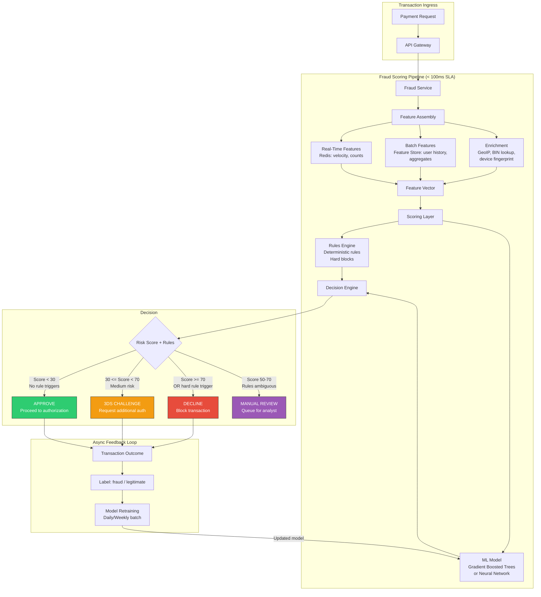
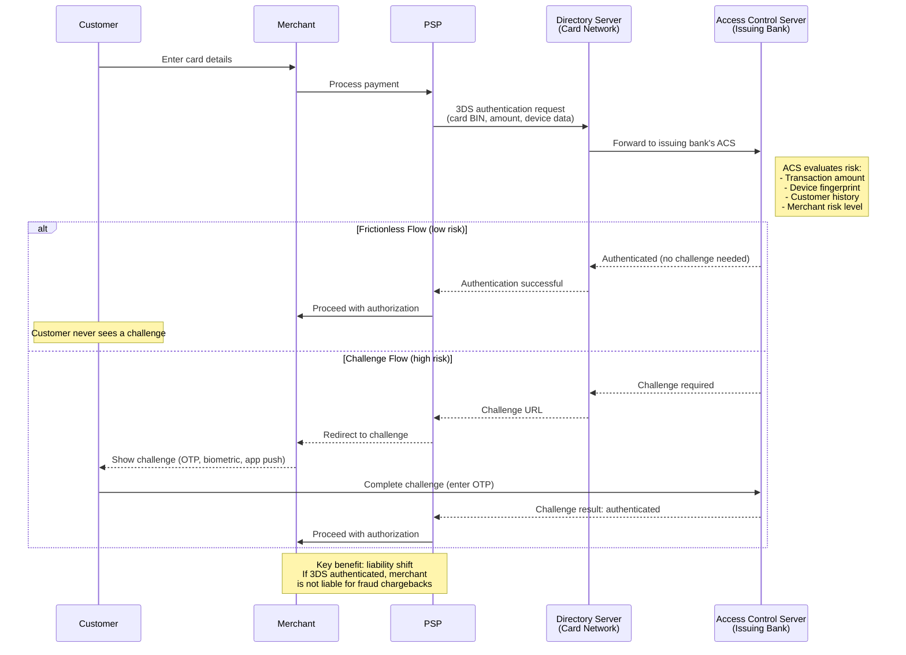
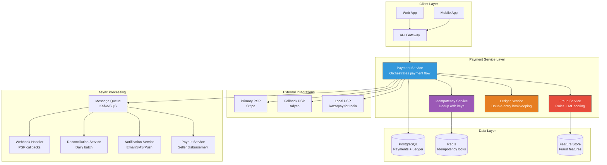
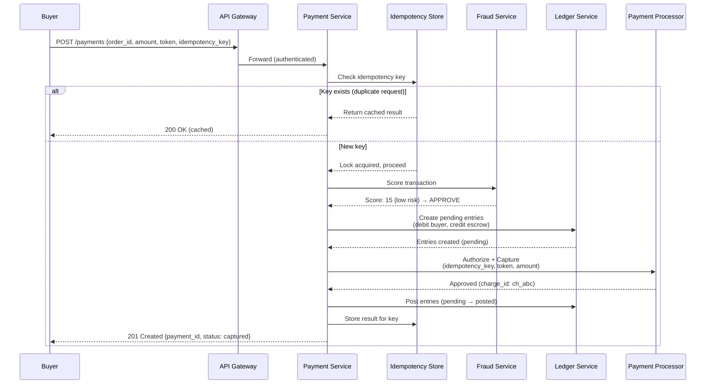

# Fraud Detection and Compliance in Payment Systems

## Table of Contents
- [Fraud Detection](#fraud-detection)
- [3D Secure (3DS)](#3d-secure-3ds)
- [Compliance Landscape](#compliance-landscape)
- [Payment System Design Interview Walkthrough](#payment-system-design-interview-walkthrough)
- [Real-World Payment Architectures](#real-world-payment-architectures)

---

## Fraud Detection

Payment fraud costs the global economy over $30 billion annually. Every payment system
must balance two competing goals: block fraudulent transactions and avoid blocking
legitimate ones. A false positive (blocking a good customer) directly costs revenue
and erodes trust.

### Rule-Based Fraud Detection

Rule engines are the first layer of defense. They're fast, explainable, and easy to
update. Every payment system starts here.

Common rules:

| Rule Category | Example Rule | Action |
|---------------|-------------|--------|
| **Velocity** | > 5 transactions in 1 minute from same card | Block + review |
| **Velocity** | > 3 different cards used from same IP in 10 minutes | Block |
| **Amount** | Single transaction > $5,000 (for new account) | Hold for review |
| **Amount** | Transaction 10x higher than user's average | Flag for review |
| **Geo-mismatch** | Card issued in US, transaction IP in Nigeria | High risk score |
| **Geo-velocity** | Transactions in New York and London 30 minutes apart | Block |
| **Device** | Known proxy/VPN/Tor exit node | Increase risk score |
| **Card testing** | Multiple small transactions ($0.50-$1.00) in rapid succession | Block immediately |
| **BIN mismatch** | Card BIN country differs from shipping country | Flag for review |

```python
class RuleEngine:
    """
    Synchronous rule engine that runs before every payment authorization.
    
    Rules are evaluated in priority order. Each rule produces a risk
    signal. The aggregate score determines the action.
    """
    
    def evaluate(self, transaction: dict, context: dict) -> RuleResult:
        signals = []
        
        # Rule 1: Velocity check
        recent_count = self.redis.get(
            f"velocity:{transaction['card_fingerprint']}:1min"
        )
        if recent_count and int(recent_count) > 5:
            signals.append(RiskSignal(
                rule="velocity_1min",
                severity="high",
                score=80,
                reason=f"{recent_count} transactions in last minute"
            ))
        
        # Rule 2: Amount anomaly
        avg_amount = self.get_user_average_amount(transaction['customer_id'])
        if avg_amount and transaction['amount'] > avg_amount * 10:
            signals.append(RiskSignal(
                rule="amount_anomaly",
                severity="medium",
                score=50,
                reason=f"Amount {transaction['amount']} is 10x average {avg_amount}"
            ))
        
        # Rule 3: Geo-mismatch
        card_country = self.bin_lookup(transaction['card_bin'])
        ip_country = self.geoip_lookup(transaction['ip_address'])
        if card_country != ip_country:
            signals.append(RiskSignal(
                rule="geo_mismatch",
                severity="medium",
                score=40,
                reason=f"Card country {card_country} != IP country {ip_country}"
            ))
        
        # Rule 4: Known fraudulent patterns
        if self.is_known_bad_device(context.get('device_fingerprint')):
            signals.append(RiskSignal(
                rule="bad_device",
                severity="critical",
                score=95,
                reason="Device fingerprint matches known fraud device"
            ))
        
        # Rule 5: Card testing pattern
        if self._detect_card_testing(transaction):
            signals.append(RiskSignal(
                rule="card_testing",
                severity="critical",
                score=90,
                reason="Pattern consistent with stolen card testing"
            ))
        
        # Aggregate score
        total_score = min(100, sum(s.score for s in signals))
        
        # Decision thresholds
        if total_score >= 80:
            return RuleResult(action="BLOCK", score=total_score, signals=signals)
        elif total_score >= 50:
            return RuleResult(action="REVIEW", score=total_score, signals=signals)
        else:
            return RuleResult(action="ALLOW", score=total_score, signals=signals)
    
    def _detect_card_testing(self, txn) -> bool:
        """
        Card testing: fraudsters test stolen cards with small charges.
        Pattern: many small transactions ($0.50-$2.00) in rapid succession,
        often with sequential card numbers or different cards from same IP.
        """
        recent_small = self.redis.get(
            f"small_txn:{txn['ip_address']}:10min"
        )
        return recent_small and int(recent_small) > 3 and txn['amount'] < 200
```

### ML-Based Fraud Detection

Machine learning models catch patterns that rules miss: subtle behavioral changes,
complex feature interactions, and evolving fraud tactics.

Feature engineering (the most important part):

```python
class FraudFeatureStore:
    """
    Real-time + batch features for fraud scoring.
    
    Feature categories:
    1. Transaction features (amount, currency, merchant category)
    2. User behavioral features (avg spend, time-of-day patterns)
    3. Device features (fingerprint, OS, browser)
    4. Velocity features (counts over time windows)
    5. Graph features (connections between entities)
    """
    
    def compute_features(self, transaction: dict) -> dict:
        customer_id = transaction['customer_id']
        card_fp = transaction['card_fingerprint']
        
        return {
            # Transaction features
            "amount_cents": transaction['amount'],
            "is_international": transaction['card_country'] != transaction['merchant_country'],
            "merchant_category_code": transaction['mcc'],
            "is_digital_goods": transaction['mcc'] in [5815, 5816, 5817, 5818],
            
            # User behavioral features (pre-computed, stored in feature store)
            "user_avg_amount_30d": self.feature_store.get(f"{customer_id}:avg_amount_30d"),
            "user_txn_count_30d": self.feature_store.get(f"{customer_id}:txn_count_30d"),
            "user_distinct_merchants_30d": self.feature_store.get(f"{customer_id}:distinct_merchants_30d"),
            "user_max_amount_ever": self.feature_store.get(f"{customer_id}:max_amount"),
            "amount_zscore": self._compute_zscore(transaction['amount'], customer_id),
            
            # Time features
            "hour_of_day": transaction['timestamp'].hour,
            "is_weekend": transaction['timestamp'].weekday() >= 5,
            "minutes_since_last_txn": self._minutes_since_last(customer_id),
            
            # Device features
            "device_age_days": self._device_age(transaction['device_fingerprint']),
            "device_txn_count": self.feature_store.get(f"device:{transaction['device_fingerprint']}:count"),
            "is_new_device": self._is_new_device(customer_id, transaction['device_fingerprint']),
            
            # Velocity features (real-time from Redis)
            "card_txn_count_1min": self.redis.get(f"vel:{card_fp}:1min") or 0,
            "card_txn_count_1hr": self.redis.get(f"vel:{card_fp}:1hr") or 0,
            "card_txn_count_24hr": self.redis.get(f"vel:{card_fp}:24hr") or 0,
            "ip_distinct_cards_1hr": self.redis.get(f"ip_cards:{transaction['ip']}:1hr") or 0,
            
            # Graph features
            "shared_device_fraud_rate": self._device_fraud_rate(transaction['device_fingerprint']),
            "email_domain_fraud_rate": self._email_domain_fraud_rate(transaction.get('email')),
        }
```

### Real-Time Scoring Architecture



### The False Positive Problem

Every fraud system faces this tradeoff:

```
Aggressive fraud blocking:
  - Low fraud losses ($)
  - High false positive rate (legitimate customers blocked)
  - Revenue loss from blocked good transactions
  - Customer churn from bad experience

Lenient fraud blocking:
  - Higher fraud losses ($)
  - Low false positive rate
  - More revenue from approved transactions
  - Better customer experience

The math:
  If your fraud rate is 0.1% and your false positive rate is 2%:
  For every 10,000 transactions:
    - 10 are fraudulent (0.1%)
    - You block 8 of them (80% detection rate) → Save $X
    - You also block 200 legitimate transactions (2%) → Lose $20X
    
  The cost of false positives often EXCEEDS the cost of fraud.
  This is why fraud scoring must be precision-optimized, not recall-optimized.
```

Strategies to reduce false positives:
1. Use 3DS as a middle ground (challenge instead of block)
2. Allow customers to verify identity for flagged transactions
3. Different thresholds per merchant category (luxury goods vs digital downloads)
4. Whitelist returning customers with established purchase history
5. Continuous model retraining with false positive feedback

---

## 3D Secure (3DS)

3D Secure adds an additional authentication step for risky online card transactions.
The "3 domains" are: merchant domain, issuer domain, and interoperability domain (card network).

### 3DS 2.0 Flow



Why 3DS matters for system design:
- **Liability shift**: if a 3DS-authenticated transaction turns out to be fraud,
  the issuing bank (not the merchant) absorbs the loss
- **PSD2 compliance**: Strong Customer Authentication (SCA) in the EU requires
  3DS or equivalent for most transactions
- **Conversion impact**: frictionless flow (3DS 2.0) maintains good UX; the old
  3DS 1.0 with its redirect-heavy flow caused 20-30% checkout abandonment

---

## Compliance Landscape

### PCI DSS (Payment Card Industry Data Security Standard)

Already covered in detail in payment-fundamentals.md. The key architectural implication:
minimize your PCI scope through tokenization. Let your PSP handle raw card data.

### PSD2 and Strong Customer Authentication (EU)

PSD2 (Payment Services Directive 2) is an EU regulation that requires Strong Customer
Authentication (SCA) for most electronic payments.

SCA requires at least 2 of 3 factors:
1. **Something you know** (password, PIN)
2. **Something you have** (phone, hardware token)
3. **Something you are** (fingerprint, face recognition)

Exemptions (transactions that do NOT require SCA):
- Low-value transactions (< EUR 30, up to cumulative EUR 100)
- Recurring payments (after initial SCA)
- Trusted beneficiaries (customer whitelists a merchant)
- Merchant-initiated transactions
- Low-risk transactions (based on acquirer's fraud rate)

Implementation: 3DS 2.0 satisfies SCA requirements. Your payment integration must
support requesting SCA exemptions and handling challenges.

```python
class SCAExemptionEngine:
    """Determine if a transaction qualifies for an SCA exemption under PSD2."""
    
    def evaluate_exemption(self, transaction: dict) -> str:
        """
        Returns the recommended exemption type, or 'none' if SCA is required.
        
        The acquirer requests the exemption; the issuer decides whether to grant it.
        """
        amount = transaction['amount']
        currency = transaction['currency']
        
        # Exemption 1: Low-value transaction
        if currency == 'EUR' and amount < 3000:  # 30 EUR in cents
            cumulative = self.get_cumulative_exempt_amount(
                transaction['card_fingerprint']
            )
            if cumulative + amount < 10000:  # Under EUR 100 cumulative
                return "low_value"
        
        # Exemption 2: Trusted beneficiary
        if self.is_trusted_merchant(
            transaction['customer_id'],
            transaction['merchant_id']
        ):
            return "trusted_beneficiary"
        
        # Exemption 3: Recurring payment (same amount, same merchant)
        if self.is_recurring(transaction):
            return "recurring"
        
        # Exemption 4: Transaction Risk Analysis (TRA)
        # Acquirer's overall fraud rate must be below threshold
        acquirer_fraud_rate = self.get_acquirer_fraud_rate()
        if amount < 50000 and acquirer_fraud_rate < 0.0013:  # < 0.13%
            return "transaction_risk_analysis"
        
        # No exemption applies -- SCA required
        return "none"
```

### KYC (Know Your Customer)

KYC is required for onboarding merchants and, in some cases, for high-value
transactions. It verifies that customers and merchants are who they claim to be.

KYC levels:

| Level | Required For | Verification |
|-------|-------------|--------------|
| **Simplified** | Low-risk, low-value accounts | Name + email + phone |
| **Standard** | Most accounts | Government ID + proof of address |
| **Enhanced** | High-risk accounts, politically exposed persons (PEPs) | Source of funds, in-person verification |

Implementation: integrate with identity verification providers (Jumio, Onfido, Veriff)
via API. Store verification results and expiry dates. Re-verify periodically for
high-risk accounts.

### AML (Anti-Money Laundering)

AML monitoring detects patterns consistent with money laundering:
- **Structuring (smurfing)**: breaking large transactions into smaller ones to avoid reporting thresholds
- **Layering**: rapid movement of funds between multiple accounts
- **Round-tripping**: sending money internationally and receiving it back through a different channel

```python
class AMLMonitor:
    """
    Asynchronous AML monitoring on transaction streams.
    
    NOT in the critical payment path (too slow). Runs as a
    near-real-time stream processor on completed transactions.
    """
    
    STRUCTURING_THRESHOLD = 1000000  # $10,000 in cents (CTR reporting threshold)
    
    def monitor_transaction(self, txn: dict):
        customer_id = txn['customer_id']
        
        # Check 1: Structuring detection
        # Multiple transactions just below the reporting threshold
        recent_txns = self.get_recent_transactions(customer_id, hours=24)
        just_below = [t for t in recent_txns 
                      if self.STRUCTURING_THRESHOLD * 0.8 < t['amount'] < self.STRUCTURING_THRESHOLD]
        if len(just_below) >= 2:
            self.file_suspicious_activity_report(
                customer_id=customer_id,
                reason="Possible structuring: multiple transactions near CTR threshold",
                transactions=just_below
            )
        
        # Check 2: Cumulative threshold
        total_24h = sum(t['amount'] for t in recent_txns)
        if total_24h >= self.STRUCTURING_THRESHOLD:
            self.file_currency_transaction_report(
                customer_id=customer_id,
                total_amount=total_24h,
                transactions=recent_txns
            )
        
        # Check 3: Unusual pattern for this customer
        if self._is_anomalous_pattern(customer_id, recent_txns):
            self.flag_for_review(customer_id, "Unusual transaction pattern")
    
    def _is_anomalous_pattern(self, customer_id, txns) -> bool:
        """Check for patterns inconsistent with customer's profile."""
        profile = self.get_customer_profile(customer_id)
        
        # New account with high volume
        if profile.account_age_days < 30 and len(txns) > 20:
            return True
        
        # Sudden spike in transaction volume
        avg_daily = profile.avg_daily_transaction_count
        if avg_daily > 0 and len(txns) > avg_daily * 5:
            return True
        
        # International transactions from previously domestic-only account
        international = [t for t in txns if t.get('is_international')]
        if not profile.has_international_history and len(international) > 0:
            return True
        
        return False
```

### SOX (Sarbanes-Oxley Act)

Applies to publicly traded companies. Requires internal controls over financial
reporting. For payment systems, this means:

- Audit trails for all financial transactions (double-entry ledger provides this)
- Access controls: who can modify payment configurations, issue refunds, etc.
- Segregation of duties: the person who creates a payout cannot approve it
- Change management: all code changes to payment systems must be reviewed and approved
- Retention: financial records must be retained for 7 years

---

## Payment System Design Interview Walkthrough

### The Question

"Design a payment system for an e-commerce marketplace."

### Step 1: Requirements Gathering

Functional requirements:
- Accept payments from buyers (credit/debit cards, bank transfers)
- Hold funds in escrow until order fulfillment
- Pay out to sellers after delivery confirmation
- Handle refunds and disputes
- Support multiple currencies

Non-functional requirements:
- Never charge a customer twice (idempotency)
- 99.99% availability for payment processing
- Sub-2-second payment authorization latency
- PCI DSS compliant
- Audit trail for every dollar movement

### Step 2: High-Level Architecture



### Step 3: Deep Dive -- Payment Flow



### Step 4: Common Follow-Up Questions

**Q: How do you handle multi-PSP routing?**

A: Payment orchestration layer that routes based on: (1) cost -- different PSPs have
different rates per card network/region, (2) availability -- if primary PSP is down,
failover to backup, (3) geography -- use local PSPs in markets where they have better
authorization rates (Razorpay in India, iDEAL in Netherlands), (4) card type -- some
PSPs have better Amex rates than others. The routing decision is made before the
authorization call, based on rules + real-time PSP health monitoring.

**Q: How do escrow and seller payouts work in a marketplace?**

A: When a buyer pays, funds move to an escrow (platform) account in the ledger, not
directly to the seller. When the order is delivered and confirmed: (1) debit escrow
account, (2) credit seller account (minus platform commission), (3) credit platform
revenue account (commission). Payouts to sellers happen on a schedule (daily, weekly)
via bank transfer, not per-transaction.

**Q: How do you scale the ledger?**

A: The ledger is the hardest component to scale because it requires strong consistency
(debits must equal credits). Strategies: (1) partition by account_id (each account's
entries are on the same shard), (2) use a serializable isolation level for balance
calculations, (3) separate the write path (append entries) from the read path
(balance queries) using CQRS, (4) pre-compute account balances in a materialized
view updated by a CDC stream from the ledger table.

**Q: What if the PSP is down during peak traffic?**

A: (1) Automatic failover to the backup PSP (the payment orchestration layer handles
this). (2) The idempotency key is PSP-agnostic -- if the primary PSP times out and we
failover, we use a new PSP-specific idempotency key but track both under the same
payment intent. (3) Circuit breaker pattern: if the primary PSP error rate exceeds a
threshold (e.g., 5% errors in 1 minute), stop sending traffic to it and route 100% to
the backup. (4) Periodically probe the primary PSP to detect recovery.

**Q: How do you handle partial captures (e.g., split shipments)?**

A: The authorization is for the full amount. Each shipment triggers a partial capture
for the items in that shipment. The sum of all partial captures must not exceed the
original authorization amount. Uncaptured portions are automatically released back to
the customer when the authorization expires (or the merchant explicitly voids the
remainder). The ledger records each partial capture as a separate transaction linked
to the original payment intent.

---

## Real-World Payment Architectures

### Stripe

Core architecture principles:
- **Payment Intents API**: state machine that tracks a payment from creation to completion
- **Idempotency keys**: mandatory for all mutating API calls
- **Atomic phases**: each phase of payment processing is an atomic, retryable unit
- **Ruby on Rails monolith** (historically) with services extracted for scale
- **Distributed database**: custom-built on top of MongoDB (now migrating to a more relational model)
- **Webhook-first**: merchants are notified of state changes via webhooks, not polling

Key design decisions:
- Tokenization-first: merchants never handle raw card data (PCI scope reduction)
- Two-step payments by default (authorize, then capture)
- Built-in fraud detection (Stripe Radar) using ML on their network-wide transaction data
- Connect platform for marketplace payments (handles escrow, split payments, 1099 reporting)

### Square

Architecture focus areas:
- **Unified commerce**: same system for in-store (hardware POS) and online payments
- **Hardware-software integration**: Square Reader, Square Terminal, Square Register
- **Offline mode**: POS devices can accept payments offline with store-and-forward
- **Real-time risk**: sub-50ms fraud scoring using a custom ML pipeline
- **Cash App integration**: P2P payments feed into the merchant payment ecosystem

### Razorpay (India)

Built for the Indian payment landscape:
- **UPI-first**: native integration with India's real-time payment infrastructure
- **Multi-method**: cards, UPI, netbanking, wallets (Paytm, PhonePe), EMI, BNPL
- **Route**: payment orchestration that routes to the cheapest/most reliable gateway
- **Settlements**: handles India's complex settlement rules (T+2 for most methods)
- **Compliance**: RBI (Reserve Bank of India) regulations, data localization requirements

### PayPal

Architecture characteristics:
- **Two-sided network**: both buyers and sellers have PayPal accounts (wallet model)
- **Balance accounts**: PayPal holds customer funds (acts as a bank in many jurisdictions)
- **Buyer protection**: dispute resolution built into the platform
- **Legacy architecture**: built on C++ and Java, massive scale (billions of transactions/year)
- **Braintree subsidiary**: modern PSP stack (powers Uber, Airbnb, etc.)

### Architecture Comparison Table

| Aspect | Stripe | Square | Razorpay | PayPal |
|--------|--------|--------|----------|--------|
| Primary market | Global (US-centric) | US, expanding | India | Global |
| Architecture style | API-first, webhooks | Hardware + software | Multi-gateway orchestration | Two-sided wallet |
| Card data handling | Tokenization (Elements) | Hardware encryption | Tokenization | Vault (account-based) |
| Fraud detection | Radar (ML on network data) | Custom ML pipeline | ML + rules | Buyer/seller reputation |
| Settlement model | T+2, rolling payouts | T+1 to T+2 | T+2 to T+3 (India) | Instant (to PayPal balance) |
| Key strength | Developer experience | Unified commerce | Local payment methods | Network effects |
| Idempotency | Mandatory keys on all writes | Per-transaction dedup | Mandatory keys | Request-ID based |

---

## Interview Cheat Sheet: Fraud and Compliance

### Key Talking Points

**Q: How would you design a fraud detection system for payments?**

A: Two layers running in series. Layer 1: a synchronous rules engine (velocity checks,
amount thresholds, geo-mismatch) that runs before every authorization -- this catches
obvious fraud in < 10ms. Layer 2: an ML model (gradient-boosted trees or neural network)
that scores transaction risk based on features from a feature store (user history,
device fingerprint, real-time velocity counters). The combined score determines the
action: approve, challenge via 3DS, send to manual review, or decline. Critical:
optimize for precision over recall, because false positives cost more than fraud in
most businesses. Feed back outcomes (chargebacks, confirmed fraud, false positives)
into model retraining.

**Q: What compliance regulations affect payment system design?**

A: Five major ones: (1) PCI DSS -- how you handle card data; mitigate with tokenization
to reduce scope to SAQ A. (2) PSD2/SCA -- EU regulation requiring two-factor auth for
payments; implement via 3DS 2.0 with exemption engine. (3) KYC -- identity verification
for merchants and high-value transactions. (4) AML -- transaction monitoring to detect
money laundering patterns; runs asynchronously on transaction streams, not in the critical
path. (5) SOX -- audit trails and access controls for financial reporting; double-entry
ledger provides this.

**Q: What is the liability shift in 3D Secure?**

A: Without 3DS, the merchant is liable for fraud chargebacks. With 3DS authentication,
liability shifts to the issuing bank. This means if a 3DS-authenticated transaction
turns out to be fraudulent, the issuing bank absorbs the loss, not the merchant. This
is a major financial incentive for merchants to implement 3DS, despite the potential
conversion impact. 3DS 2.0 mitigates the conversion problem with its frictionless flow
(risk-based authentication that challenges only high-risk transactions).

**Q: How do you balance fraud prevention with customer experience?**

A: Never block silently. Use a tiered response: (1) low risk -- approve instantly,
(2) medium risk -- use 3DS challenge (customer proves identity without losing the sale),
(3) high risk -- decline but show clear message with alternative payment option,
(4) post-transaction -- even if approved, flag for async review and contact customer
if fraud is confirmed later. Additionally, build trust signals over time: returning
customers with clean history get lower friction. New customers or unusual patterns
get more scrutiny. The goal is a dynamic threshold, not a static one.
