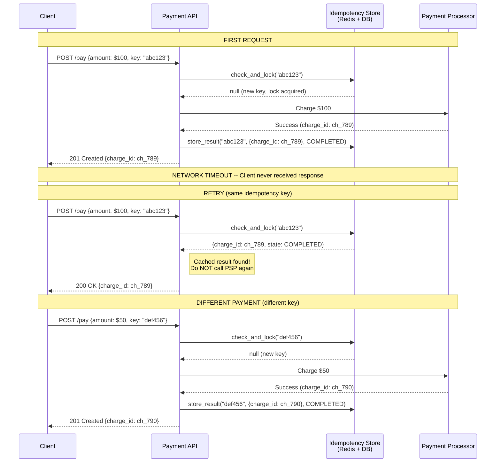
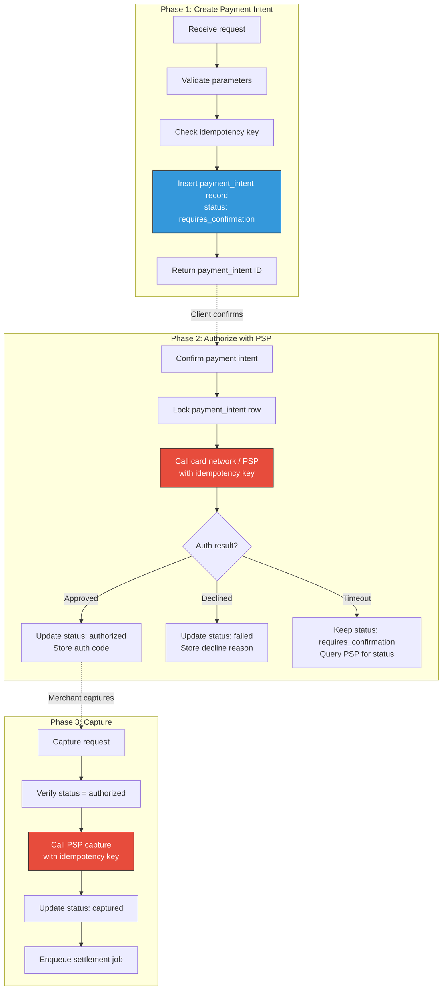
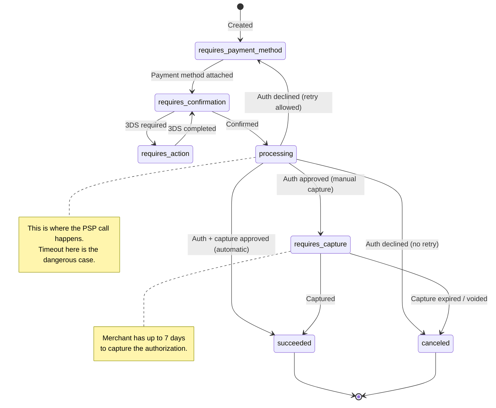
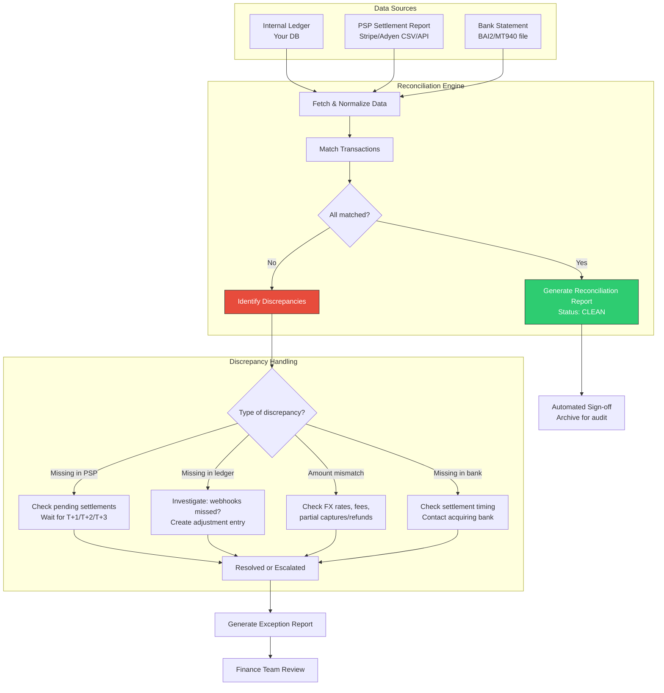
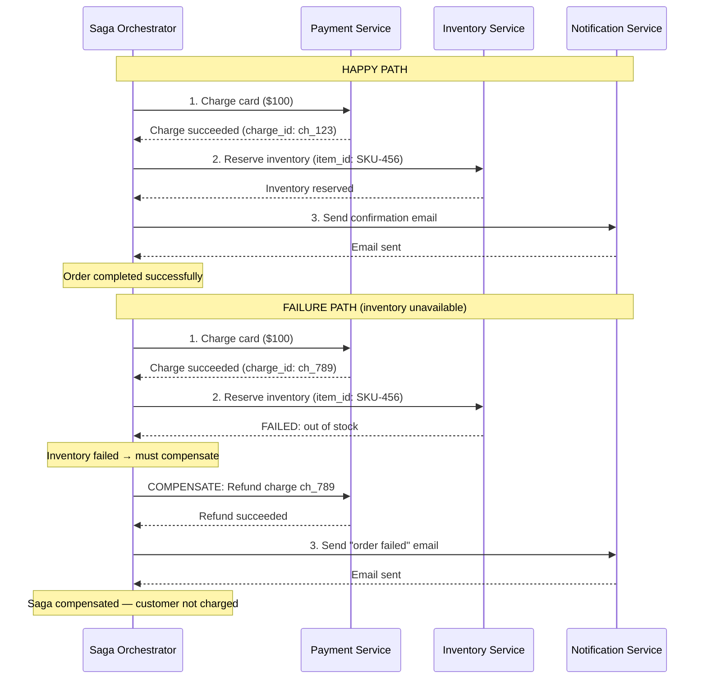

# Idempotency and Reliability in Payment Systems

## Table of Contents
- [The Cardinal Rule: Never Charge a Customer Twice](#the-cardinal-rule-never-charge-a-customer-twice)
- [Idempotency in Payments](#idempotency-in-payments)
- [Stripe's Approach: Atomic Phases](#stripes-approach-atomic-phases)
- [Double-Entry Bookkeeping](#double-entry-bookkeeping)
- [Reconciliation](#reconciliation)
- [Handling Failures](#handling-failures)
- [Exactly-Once Payment Semantics](#exactly-once-payment-semantics)

---

## The Cardinal Rule: Never Charge a Customer Twice

In any distributed system, exactly-once delivery is theoretically impossible
(see the Two Generals Problem). Yet payment systems must achieve exactly-once
*payment* semantics. Charging a customer twice is the single worst failure mode:

- Customer loses trust immediately
- Refund processing costs time and money
- Regulatory exposure (especially in the EU under PSD2)
- Chargeback risk increases
- Reputational damage at scale

The opposite failure -- failing to charge when we should have -- is also bad but
recoverable: we can retry. A double charge requires active reversal and erodes trust.

**The hierarchy of payment failures (worst to best):**
1. Double charge (catastrophic -- customer harmed)
2. Charge succeeds but internal state says failed (money taken, order not fulfilled)
3. Charge fails but internal state says succeeded (order fulfilled, no payment)
4. Both fail consistently (annoying but safe -- customer retries)
5. Both succeed consistently (the goal)

Every design decision in payment reliability aims to prevent case #1 and #2.

---

## Idempotency in Payments

### What Is Idempotency?

An operation is idempotent if performing it multiple times produces the same result
as performing it once. For payments:

```
First request:   POST /charges {amount: 100, key: "abc"} → 201 Created, charge_id: ch_123
Retry request:   POST /charges {amount: 100, key: "abc"} → 200 OK,      charge_id: ch_123 (same!)
Different req:   POST /charges {amount: 100, key: "xyz"} → 201 Created, charge_id: ch_456 (new!)
```

The second call with the same key returns the cached result. It does NOT create a
second charge.

### Idempotency Key Design

The client generates a unique key for each distinct payment intent. The server uses
this key to deduplicate.

```python
import uuid
import hashlib
from datetime import datetime, timedelta
from enum import Enum

class IdempotencyKeyState(Enum):
    STARTED = "started"       # Request received, processing begun
    COMPLETED = "completed"   # Request finished successfully
    ERRORED = "errored"       # Request failed with a permanent error (don't retry)

class IdempotencyStore:
    """
    Stores idempotency key → result mappings.
    
    Key design decisions:
    1. Keys expire after 24-72 hours (configurable)
    2. Keys are scoped to (api_key, idempotency_key) to prevent cross-customer collisions
    3. Locked during processing to prevent concurrent duplicate requests
    """
    
    def __init__(self, redis_client, db_client):
        self.redis = redis_client  # Fast lock acquisition
        self.db = db_client        # Durable result storage
    
    def check_and_lock(self, api_key: str, idempotency_key: str) -> dict | None:
        """
        Check if this key was seen before. If not, acquire a lock.
        
        Returns:
            None if key is new (lock acquired, proceed with processing)
            dict with cached result if key was seen before
        """
        composite_key = f"idempotency:{api_key}:{idempotency_key}"
        
        # Step 1: Try to acquire a distributed lock (prevents concurrent duplicates)
        lock_acquired = self.redis.set(
            f"lock:{composite_key}",
            value="locked",
            nx=True,      # Only set if not exists
            ex=30         # Lock expires in 30 seconds (timeout protection)
        )
        
        if not lock_acquired:
            # Another request with this key is currently being processed
            # Options: wait and return result, or return 409 Conflict
            raise ConcurrentRequestError(
                "A request with this idempotency key is currently being processed"
            )
        
        # Step 2: Check if we have a stored result for this key
        stored = self.db.get_idempotency_result(composite_key)
        
        if stored is not None:
            # Key was used before -- return the cached result
            self.redis.delete(f"lock:{composite_key}")  # Release lock
            return stored
        
        # Step 3: New key, lock acquired -- caller should proceed with processing
        return None
    
    def store_result(self, api_key: str, idempotency_key: str, result: dict, state: IdempotencyKeyState):
        """Store the result for this idempotency key."""
        composite_key = f"idempotency:{api_key}:{idempotency_key}"
        
        self.db.store_idempotency_result(
            key=composite_key,
            result=result,
            state=state.value,
            created_at=datetime.utcnow(),
            expires_at=datetime.utcnow() + timedelta(hours=24)
        )
        
        # Release the lock
        self.redis.delete(f"lock:{composite_key}")
    
    def cleanup_expired(self):
        """Periodic job to remove expired idempotency records."""
        self.db.delete_expired_idempotency_records(before=datetime.utcnow())
```

### Client-Side Key Generation

```python
# Approach 1: UUID (simple, universally unique)
idempotency_key = str(uuid.uuid4())
# "f47ac10b-58cc-4372-a567-0e02b2c3d479"

# Approach 2: Deterministic from business context (better for retries)
# If the client crashes and restarts, it generates the same key
idempotency_key = hashlib.sha256(
    f"{order_id}:{customer_id}:{amount}:{currency}".encode()
).hexdigest()
# "a1b2c3d4..." -- same inputs always produce same key

# Approach 3: Stripe's recommendation -- UUID per payment intent
# Create payment intent once, use its ID for all subsequent operations
payment_intent = stripe.PaymentIntent.create(
    amount=2000,
    currency="usd",
    idempotency_key="order_12345_payment"  # Unique per order
)
```

### Idempotent Payment Flow



### Idempotency Key Database Schema

```sql
CREATE TABLE idempotency_keys (
    id              UUID PRIMARY KEY DEFAULT gen_random_uuid(),
    api_key_id      UUID NOT NULL,            -- Which API key (merchant) sent this
    idempotency_key VARCHAR(255) NOT NULL,     -- Client-provided key
    
    state           VARCHAR(20) NOT NULL       -- 'started', 'completed', 'errored'
                    CHECK (state IN ('started', 'completed', 'errored')),
    
    -- Request fingerprint (to detect misuse: same key, different request body)
    request_method  VARCHAR(10) NOT NULL,
    request_path    VARCHAR(500) NOT NULL,
    request_body_hash VARCHAR(64) NOT NULL,    -- SHA-256 of request body
    
    -- Cached response
    response_code   INT,
    response_body   JSONB,
    
    -- Lifecycle
    locked_at       TIMESTAMP,
    created_at      TIMESTAMP NOT NULL DEFAULT NOW(),
    expires_at      TIMESTAMP NOT NULL,
    
    UNIQUE (api_key_id, idempotency_key)
);

CREATE INDEX idx_idempotency_expiry ON idempotency_keys(expires_at)
    WHERE state != 'started';
```

**Critical edge case**: same idempotency key, different request body. This is a client
bug. The server should return 422 Unprocessable Entity:

```python
if stored.request_body_hash != hash(current_request.body):
    raise ValueError(
        "Idempotency key reuse with different parameters. "
        "Each unique payment must use a unique idempotency key."
    )
```

---

## Stripe's Approach: Atomic Phases

Stripe's engineering blog describes their approach to reliable payment processing
using "atomic phases." Each phase is an atomic, idempotent unit of work that can
be safely retried.

### The Three Phases



### Why Atomic Phases Work

Each phase follows this pattern:

```python
class AtomicPhase:
    """
    Each phase:
    1. Has its own idempotency key
    2. Is wrapped in a database transaction
    3. Writes to an outbox table within the same transaction
    4. External calls happen AFTER the DB commit (with their own idempotency)
    """
    
    def execute_phase(self, payment_intent_id: str, phase: str, idempotency_key: str):
        # Check if this phase was already completed
        existing = self.db.get_phase_result(payment_intent_id, phase)
        if existing and existing.state == "completed":
            return existing.result  # Idempotent: return cached result
        
        with self.db.transaction() as txn:
            # Lock the payment intent row (prevents concurrent phase execution)
            pi = txn.select_for_update("payment_intents", id=payment_intent_id)
            
            # Validate preconditions
            self.validate_phase_preconditions(pi, phase)
            
            # Perform the phase work
            result = self.do_phase_work(pi, phase, idempotency_key)
            
            # Update payment intent status
            txn.update("payment_intents",
                id=payment_intent_id,
                status=result.new_status,
                updated_at=datetime.utcnow()
            )
            
            # Write to outbox (for async processing, webhooks, etc.)
            txn.insert("outbox", {
                "event_type": f"payment_intent.{result.new_status}",
                "payload": result.to_dict(),
                "created_at": datetime.utcnow()
            })
            
            # Store phase completion (for idempotency)
            txn.insert("phase_results", {
                "payment_intent_id": payment_intent_id,
                "phase": phase,
                "idempotency_key": idempotency_key,
                "state": "completed",
                "result": result.to_dict()
            })
            
            # COMMIT -- all of the above is atomic
        
        return result
```

### Stripe's Payment Intent State Machine



---

## Double-Entry Bookkeeping

### The Fundamental Principle

Every financial transaction involves at least two entries: a debit to one account
and a credit to another. The total debits must always equal the total credits.
This is not optional for payment systems -- it is a regulatory requirement and the
foundation of financial auditing.

### Why Double-Entry in Software?

1. **Audit trail**: every dollar is traceable from source to destination
2. **Reconciliation**: if debits do not equal credits, something is wrong -- catch it immediately
3. **Regulatory compliance**: SOX, PCI, banking regulations require it
4. **Debugging**: when money "disappears," double-entry tells you exactly where it went
5. **Consistency**: the ledger is the single source of truth, not scattered tables

### Example: Customer Pays Merchant $100

```
Transaction: Customer purchases item for $100
Transaction ID: txn_abc123

Entry 1 (Debit):   Customer Liability Account   -$100.00
Entry 2 (Credit):  Merchant Revenue Account      +$100.00

After PSP takes 2.9% + $0.30 fee:

Entry 3 (Debit):   Merchant Revenue Account      -$3.20
Entry 4 (Credit):  PSP Fee Revenue Account        +$3.20

Net result:
  Customer:   -$100.00
  Merchant:   +$96.80
  PSP Fees:   +$3.20
  Total:      $0.00 ✓ (balanced)
```

### Ledger Schema

```sql
-- Accounts represent entities that hold or owe money
CREATE TABLE accounts (
    id              UUID PRIMARY KEY DEFAULT gen_random_uuid(),
    account_type    VARCHAR(20) NOT NULL 
                    CHECK (account_type IN ('asset', 'liability', 'revenue', 'expense', 'equity')),
    owner_type      VARCHAR(20) NOT NULL,  -- 'customer', 'merchant', 'platform', 'bank'
    owner_id        UUID NOT NULL,
    currency        CHAR(3) NOT NULL,
    name            VARCHAR(100),
    created_at      TIMESTAMP DEFAULT NOW(),
    
    UNIQUE (owner_type, owner_id, currency, account_type)
);

-- Every financial movement is a ledger entry
CREATE TABLE ledger_entries (
    entry_id        UUID PRIMARY KEY DEFAULT gen_random_uuid(),
    transaction_id  UUID NOT NULL,          -- Groups related entries
    account_id      UUID NOT NULL REFERENCES accounts(id),
    
    entry_type      VARCHAR(6) NOT NULL CHECK (entry_type IN ('debit', 'credit')),
    amount          BIGINT NOT NULL CHECK (amount > 0),  -- Always positive, type determines direction
    currency        CHAR(3) NOT NULL,
    
    description     VARCHAR(500),
    metadata        JSONB,                  -- Flexible: PSP reference, order ID, etc.
    
    created_at      TIMESTAMP NOT NULL DEFAULT NOW(),
    posted_at       TIMESTAMP,              -- When the entry was finalized (NULL = pending)
    
    -- Immutability: entries are NEVER updated or deleted
    -- Corrections are made by creating reversal entries
    CONSTRAINT positive_amount CHECK (amount > 0)
);

CREATE INDEX idx_ledger_transaction ON ledger_entries(transaction_id);
CREATE INDEX idx_ledger_account ON ledger_entries(account_id, created_at);

-- Transactions group related entries (must balance)
CREATE TABLE transactions (
    id              UUID PRIMARY KEY DEFAULT gen_random_uuid(),
    transaction_type VARCHAR(50) NOT NULL,  -- 'payment', 'refund', 'payout', 'fee', 'adjustment'
    reference_type  VARCHAR(50),            -- 'order', 'subscription', 'invoice'
    reference_id    VARCHAR(100),           -- External reference
    
    idempotency_key VARCHAR(255) UNIQUE,    -- Prevent duplicate transactions
    
    status          VARCHAR(20) NOT NULL DEFAULT 'pending'
                    CHECK (status IN ('pending', 'posted', 'voided')),
    
    created_at      TIMESTAMP DEFAULT NOW(),
    posted_at       TIMESTAMP
);

-- CRITICAL CONSTRAINT: every posted transaction must balance
-- This is enforced by application code and verified by reconciliation
-- (Cannot easily enforce with SQL constraint, so we verify programmatically)
```

### Ledger Service Implementation

```python
class LedgerService:
    """
    Core double-entry ledger service.
    
    Invariant: for every transaction, SUM(debits) = SUM(credits).
    This invariant is checked at write time and verified during reconciliation.
    """
    
    def record_payment(
        self,
        customer_account_id: str,
        merchant_account_id: str,
        platform_fee_account_id: str,
        amount: int,                    # Total amount in smallest currency unit
        fee_amount: int,                # Platform/PSP fee
        currency: str,
        payment_reference: str,
        idempotency_key: str
    ):
        """
        Record a customer-to-merchant payment with platform fee.
        
        Creates three entries:
        1. Debit customer (money leaves customer)
        2. Credit merchant (money arrives to merchant, minus fee)
        3. Credit platform fee account (fee portion)
        """
        merchant_amount = amount - fee_amount
        
        with self.db.transaction() as txn:
            # Check idempotency
            existing = txn.query(
                "SELECT id FROM transactions WHERE idempotency_key = %s",
                [idempotency_key]
            )
            if existing:
                return existing[0]['id']  # Already processed
            
            # Create the transaction record
            txn_id = txn.insert("transactions", {
                "transaction_type": "payment",
                "reference_type": "payment",
                "reference_id": payment_reference,
                "idempotency_key": idempotency_key,
                "status": "posted",
                "posted_at": datetime.utcnow()
            })
            
            # Entry 1: Debit customer account (money leaves)
            txn.insert("ledger_entries", {
                "transaction_id": txn_id,
                "account_id": customer_account_id,
                "entry_type": "debit",
                "amount": amount,
                "currency": currency,
                "description": f"Payment for {payment_reference}"
            })
            
            # Entry 2: Credit merchant account (money arrives, minus fee)
            txn.insert("ledger_entries", {
                "transaction_id": txn_id,
                "account_id": merchant_account_id,
                "entry_type": "credit",
                "amount": merchant_amount,
                "currency": currency,
                "description": f"Revenue from {payment_reference}"
            })
            
            # Entry 3: Credit platform fee account
            txn.insert("ledger_entries", {
                "transaction_id": txn_id,
                "account_id": platform_fee_account_id,
                "entry_type": "credit",
                "amount": fee_amount,
                "currency": currency,
                "description": f"Fee from {payment_reference}"
            })
            
            # VERIFY BALANCE before committing
            self._verify_transaction_balance(txn, txn_id)
            
            # COMMIT
        
        return txn_id
    
    def _verify_transaction_balance(self, txn, transaction_id):
        """Verify that debits = credits for this transaction. Fail-fast if not."""
        result = txn.query("""
            SELECT 
                SUM(CASE WHEN entry_type = 'debit' THEN amount ELSE 0 END) as total_debits,
                SUM(CASE WHEN entry_type = 'credit' THEN amount ELSE 0 END) as total_credits
            FROM ledger_entries
            WHERE transaction_id = %s
        """, [transaction_id])
        
        if result[0]['total_debits'] != result[0]['total_credits']:
            raise LedgerImbalanceError(
                f"Transaction {transaction_id} is unbalanced: "
                f"debits={result[0]['total_debits']}, "
                f"credits={result[0]['total_credits']}"
            )
    
    def get_account_balance(self, account_id: str) -> int:
        """
        Calculate current balance for an account.
        
        Balance = SUM(credits) - SUM(debits) for liability/revenue accounts
        Balance = SUM(debits) - SUM(credits) for asset/expense accounts
        """
        result = self.db.query("""
            SELECT 
                a.account_type,
                COALESCE(SUM(CASE WHEN le.entry_type = 'debit' THEN le.amount ELSE 0 END), 0) as total_debits,
                COALESCE(SUM(CASE WHEN le.entry_type = 'credit' THEN le.amount ELSE 0 END), 0) as total_credits
            FROM accounts a
            LEFT JOIN ledger_entries le ON le.account_id = a.id
            WHERE a.id = %s AND le.posted_at IS NOT NULL
            GROUP BY a.account_type
        """, [account_id])
        
        if not result:
            return 0
        
        row = result[0]
        if row['account_type'] in ('asset', 'expense'):
            return row['total_debits'] - row['total_credits']
        else:  # liability, revenue, equity
            return row['total_credits'] - row['total_debits']
```

### Ledger Immutability

Ledger entries are NEVER updated or deleted. This is a core accounting principle.

To correct an error, you create a reversal entry:

```python
def reverse_transaction(self, original_txn_id: str, reason: str):
    """
    Reverse a transaction by creating opposite entries.
    Original entries remain in the ledger for audit trail.
    """
    original_entries = self.db.query(
        "SELECT * FROM ledger_entries WHERE transaction_id = %s",
        [original_txn_id]
    )
    
    with self.db.transaction() as txn:
        reversal_txn_id = txn.insert("transactions", {
            "transaction_type": "reversal",
            "reference_type": "transaction",
            "reference_id": original_txn_id,
            "status": "posted",
            "posted_at": datetime.utcnow()
        })
        
        for entry in original_entries:
            # Flip debit <-> credit
            reversed_type = "credit" if entry['entry_type'] == "debit" else "debit"
            
            txn.insert("ledger_entries", {
                "transaction_id": reversal_txn_id,
                "account_id": entry['account_id'],
                "entry_type": reversed_type,
                "amount": entry['amount'],
                "currency": entry['currency'],
                "description": f"Reversal: {reason}"
            })
        
        self._verify_transaction_balance(txn, reversal_txn_id)
    
    return reversal_txn_id
```

---

## Reconciliation

### What Is Reconciliation?

Reconciliation is the process of comparing two sets of records to ensure they agree.
In payments, this typically means matching your internal ledger against your PSP's
records and your bank statements.

Three-way reconciliation:
1. **Internal ledger** (your double-entry records)
2. **PSP records** (Stripe dashboard, settlement reports)
3. **Bank statements** (actual money in your bank account)

All three must agree. If they don't, something went wrong and must be investigated.

### Daily Reconciliation Flow



### Reconciliation Implementation

```python
from dataclasses import dataclass
from enum import Enum
from typing import Optional

class MatchStatus(Enum):
    MATCHED = "matched"
    MISSING_IN_PSP = "missing_in_psp"
    MISSING_IN_LEDGER = "missing_in_ledger"
    AMOUNT_MISMATCH = "amount_mismatch"
    STATUS_MISMATCH = "status_mismatch"
    MISSING_IN_BANK = "missing_in_bank"

@dataclass
class ReconciliationResult:
    payment_id: str
    ledger_amount: Optional[int]
    psp_amount: Optional[int]
    bank_amount: Optional[int]
    status: MatchStatus
    discrepancy_amount: Optional[int]
    notes: str

class ReconciliationService:
    """
    Daily reconciliation between internal ledger, PSP, and bank.
    
    Run as a daily batch job, typically at T+1 (one day after transactions).
    """
    
    AMOUNT_TOLERANCE_CENTS = 1  # Allow 1 cent rounding difference
    
    def reconcile_day(self, date: str) -> list[ReconciliationResult]:
        """Reconcile all transactions for a given date."""
        
        # Step 1: Fetch records from all three sources
        ledger_records = self.fetch_ledger_records(date)
        psp_records = self.fetch_psp_settlement_report(date)
        bank_records = self.fetch_bank_statement(date)
        
        # Step 2: Index by payment reference for O(1) lookup
        psp_by_ref = {r['reference']: r for r in psp_records}
        bank_by_ref = {r['reference']: r for r in bank_records}
        all_refs = set(
            [r['reference'] for r in ledger_records] +
            list(psp_by_ref.keys()) +
            list(bank_by_ref.keys())
        )
        
        results = []
        
        for ref in all_refs:
            ledger = next((r for r in ledger_records if r['reference'] == ref), None)
            psp = psp_by_ref.get(ref)
            bank = bank_by_ref.get(ref)
            
            result = self._match_transaction(ref, ledger, psp, bank)
            results.append(result)
        
        # Step 3: Generate summary
        matched = sum(1 for r in results if r.status == MatchStatus.MATCHED)
        mismatched = len(results) - matched
        
        self.store_reconciliation_report(date, results)
        
        if mismatched > 0:
            self.alert_finance_team(date, mismatched, results)
        
        return results
    
    def _match_transaction(self, ref, ledger, psp, bank) -> ReconciliationResult:
        """Match a single transaction across all three sources."""
        
        if ledger and not psp:
            return ReconciliationResult(
                payment_id=ref,
                ledger_amount=ledger['amount'],
                psp_amount=None,
                bank_amount=bank['amount'] if bank else None,
                status=MatchStatus.MISSING_IN_PSP,
                discrepancy_amount=ledger['amount'],
                notes="Transaction in ledger but not in PSP settlement. "
                      "Check if settlement is pending (T+2/T+3)."
            )
        
        if psp and not ledger:
            return ReconciliationResult(
                payment_id=ref,
                ledger_amount=None,
                psp_amount=psp['amount'],
                bank_amount=bank['amount'] if bank else None,
                status=MatchStatus.MISSING_IN_LEDGER,
                discrepancy_amount=psp['amount'],
                notes="Transaction in PSP but not in ledger. "
                      "Possible missed webhook. Create adjustment entry."
            )
        
        if ledger and psp:
            # Both exist -- check amounts
            amount_diff = abs(ledger['amount'] - psp['amount'])
            
            if amount_diff > self.AMOUNT_TOLERANCE_CENTS:
                return ReconciliationResult(
                    payment_id=ref,
                    ledger_amount=ledger['amount'],
                    psp_amount=psp['amount'],
                    bank_amount=bank['amount'] if bank else None,
                    status=MatchStatus.AMOUNT_MISMATCH,
                    discrepancy_amount=amount_diff,
                    notes=f"Amount differs by {amount_diff} cents. "
                          f"Check for FX differences, partial refunds, or fee changes."
                )
            
            if not bank:
                return ReconciliationResult(
                    payment_id=ref,
                    ledger_amount=ledger['amount'],
                    psp_amount=psp['amount'],
                    bank_amount=None,
                    status=MatchStatus.MISSING_IN_BANK,
                    discrepancy_amount=ledger['amount'],
                    notes="Ledger and PSP match but bank deposit not found. "
                          "May be in next batch settlement."
                )
            
            return ReconciliationResult(
                payment_id=ref,
                ledger_amount=ledger['amount'],
                psp_amount=psp['amount'],
                bank_amount=bank['amount'],
                status=MatchStatus.MATCHED,
                discrepancy_amount=0,
                notes="All three sources match."
            )
        
        # Neither ledger nor PSP -- only in bank (very unusual)
        return ReconciliationResult(
            payment_id=ref,
            ledger_amount=None,
            psp_amount=None,
            bank_amount=bank['amount'] if bank else 0,
            status=MatchStatus.MISSING_IN_LEDGER,
            discrepancy_amount=bank['amount'] if bank else 0,
            notes="Transaction only in bank statement. Investigate source."
        )
```

---

## Handling Failures

### Failure Taxonomy

```
Payment failures:
├── Client-side
│   ├── Invalid card data (wrong CVV, expired) → Decline, ask user to fix
│   ├── Insufficient funds → Decline, suggest another card
│   └── 3DS authentication failed → Decline, retry auth
│
├── Network / Infrastructure
│   ├── Timeout to PSP → DANGEROUS: payment status unknown
│   ├── PSP returns 500 → Retry with idempotency key
│   ├── Database failure → Retry with idempotency key
│   └── Message queue failure → Outbox pattern rescues this
│
└── Business logic
    ├── Fraud decline → Do not retry automatically
    ├── Velocity limit → Back off, retry later
    └── Currency not supported → Fail, notify merchant
```

### The Timeout Problem (Most Dangerous Failure)

When a payment API call times out, you do NOT know if the charge succeeded or not.
Retrying blindly could double-charge. Not retrying could lose the payment.

```python
class PaymentService:
    def charge_with_timeout_handling(
        self,
        payment_intent_id: str,
        amount: int,
        idempotency_key: str
    ):
        """
        Handle the most dangerous failure: PSP timeout.
        
        Strategy:
        1. Call PSP with idempotency key
        2. If timeout: query PSP for the payment status
        3. Never retry without checking status first
        """
        try:
            result = self.psp_client.charge(
                amount=amount,
                idempotency_key=idempotency_key,
                timeout_ms=5000  # 5 second timeout
            )
            return self._handle_psp_response(payment_intent_id, result)
            
        except TimeoutError:
            # DANGER ZONE: we don't know if the charge went through
            # DO NOT RETRY BLINDLY
            
            # Step 1: Mark internal status as "unknown"
            self.db.update("payment_intents",
                id=payment_intent_id,
                status="processing",  # Not failed, not succeeded
                last_error="PSP timeout",
                updated_at=datetime.utcnow()
            )
            
            # Step 2: Query PSP for the actual status
            return self._resolve_unknown_payment(payment_intent_id, idempotency_key)
        
        except ConnectionError:
            # Network failure before request was sent (safe to retry)
            # The idempotency key protects against double-charge even if we're wrong
            return self._retry_with_backoff(payment_intent_id, amount, idempotency_key)
    
    def _resolve_unknown_payment(self, payment_intent_id: str, idempotency_key: str):
        """Query PSP to determine the actual status of a timed-out payment."""
        
        max_attempts = 5
        for attempt in range(max_attempts):
            time.sleep(2 ** attempt)  # Exponential backoff: 1s, 2s, 4s, 8s, 16s
            
            try:
                status = self.psp_client.get_charge_status(
                    idempotency_key=idempotency_key
                )
                
                if status == "succeeded":
                    self.db.update("payment_intents",
                        id=payment_intent_id,
                        status="authorized",
                        updated_at=datetime.utcnow()
                    )
                    return {"status": "authorized"}
                
                elif status == "failed":
                    self.db.update("payment_intents",
                        id=payment_intent_id,
                        status="failed",
                        updated_at=datetime.utcnow()
                    )
                    return {"status": "failed"}
                
                elif status == "not_found":
                    # PSP never received the request -- safe to retry
                    return self._retry_with_backoff(
                        payment_intent_id, amount, idempotency_key
                    )
                
                else:  # "processing"
                    continue  # Keep polling
                    
            except Exception:
                continue  # Keep trying to reach PSP
        
        # After all attempts, escalate to manual review
        self.alert_ops_team(payment_intent_id, "Unable to resolve payment status")
        return {"status": "requires_manual_review"}
```

### Saga Pattern for Multi-Step Payments

When a payment involves multiple steps (charge card, reserve inventory, send confirmation),
a failure mid-way requires compensating actions.



---

## Exactly-Once Payment Semantics

True exactly-once is impossible in distributed systems, but we can achieve
**effectively exactly-once** through the combination of three mechanisms:

### The Three Pillars

```
Exactly-once payment = Idempotency + Outbox Pattern + Reconciliation

1. IDEMPOTENCY
   Prevents double-charging on retries
   Key: client-generated unique key per payment intent

2. OUTBOX PATTERN
   Prevents lost events when DB commits but message queue fails
   Key: write event to outbox table in the SAME transaction as the state change

3. RECONCILIATION
   Catches anything that slipped through the cracks
   Key: daily comparison of ledger vs PSP vs bank
```

### Outbox Pattern in Detail

The problem: you update the database (payment status = "captured") and then publish
an event to a message queue ("payment.captured"). If the DB commit succeeds but
the queue publish fails, your system is in an inconsistent state.

Solution: write the event to an outbox table within the same DB transaction. A
separate process reads the outbox and publishes to the queue.

```python
class PaymentServiceWithOutbox:
    def capture_payment(self, payment_intent_id: str, idempotency_key: str):
        """
        Capture a payment with the outbox pattern.
        
        The outbox entry is written in the SAME transaction as the
        payment status update. This guarantees that if the payment
        status is updated, the event WILL be published (eventually).
        """
        with self.db.transaction() as txn:
            # Update payment status
            pi = txn.select_for_update("payment_intents", id=payment_intent_id)
            assert pi.status == "authorized", f"Cannot capture: status is {pi.status}"
            
            txn.update("payment_intents",
                id=payment_intent_id,
                status="captured",
                captured_at=datetime.utcnow()
            )
            
            # Write ledger entries
            txn.insert("ledger_entries", {
                "transaction_id": payment_intent_id,
                "account_id": pi.customer_account_id,
                "entry_type": "debit",
                "amount": pi.amount,
                "currency": pi.currency
            })
            txn.insert("ledger_entries", {
                "transaction_id": payment_intent_id,
                "account_id": pi.merchant_account_id,
                "entry_type": "credit",
                "amount": pi.amount - pi.fee_amount,
                "currency": pi.currency
            })
            
            # OUTBOX: write event in the same transaction
            txn.insert("outbox_events", {
                "id": str(uuid.uuid4()),
                "event_type": "payment.captured",
                "aggregate_type": "payment_intent",
                "aggregate_id": payment_intent_id,
                "payload": json.dumps({
                    "payment_intent_id": payment_intent_id,
                    "amount": pi.amount,
                    "currency": pi.currency,
                    "merchant_id": pi.merchant_id
                }),
                "created_at": datetime.utcnow(),
                "published_at": None  # Will be set by the outbox publisher
            })
            
            # COMMIT: all three (status update, ledger, outbox) are atomic

class OutboxPublisher:
    """
    Separate process that reads unpublished outbox events and
    publishes them to the message queue.
    
    Runs on a polling interval (e.g., every 100ms) or uses
    database change data capture (CDC) for lower latency.
    """
    
    def poll_and_publish(self):
        """Fetch unpublished events and publish to message queue."""
        events = self.db.query("""
            SELECT * FROM outbox_events
            WHERE published_at IS NULL
            ORDER BY created_at ASC
            LIMIT 100
            FOR UPDATE SKIP LOCKED
        """)
        
        for event in events:
            try:
                self.message_queue.publish(
                    topic=event['event_type'],
                    message=event['payload'],
                    deduplication_id=event['id']  # Message queue deduplication
                )
                
                self.db.update("outbox_events",
                    id=event['id'],
                    published_at=datetime.utcnow()
                )
            except Exception as e:
                # Will be retried on next poll
                logging.error(f"Failed to publish event {event['id']}: {e}")
```

### Outbox Table Schema

```sql
CREATE TABLE outbox_events (
    id              UUID PRIMARY KEY,
    event_type      VARCHAR(100) NOT NULL,    -- 'payment.captured', 'refund.created'
    aggregate_type  VARCHAR(50) NOT NULL,     -- 'payment_intent', 'refund'
    aggregate_id    VARCHAR(100) NOT NULL,    -- ID of the entity that changed
    payload         JSONB NOT NULL,           -- Event data
    created_at      TIMESTAMP NOT NULL,
    published_at    TIMESTAMP,                -- NULL = not yet published
    
    -- For ordering and deduplication
    sequence_num    BIGSERIAL
);

CREATE INDEX idx_outbox_unpublished ON outbox_events(created_at)
    WHERE published_at IS NULL;

-- Cleanup: delete published events older than 7 days
-- (They served their purpose; ledger has the permanent record)
```

---

## Interview Cheat Sheet: Reliability

### Key Talking Points

**Q: How do you prevent double-charging a customer?**

A: Three layers. (1) Idempotency keys: the client sends a unique key per payment intent;
the server caches key-to-result mappings and returns the cached result on retries.
(2) Database-level uniqueness constraints on the idempotency key column. (3) Reconciliation
as a safety net -- daily comparison of our ledger against the PSP's settlement report
catches anything the first two layers missed.

**Q: What happens if your payment API call to the PSP times out?**

A: This is the most dangerous failure. We never retry blindly because we don't know
if the charge went through. Instead: (1) mark the payment as "processing" internally,
(2) query the PSP using the idempotency key to determine the actual status, (3) if the
PSP says "not found," the request never arrived and we can safely retry, (4) if the PSP
says "succeeded" or "failed," we update our records accordingly, (5) if we can't reach
the PSP at all, we escalate to manual review.

**Q: Why use double-entry bookkeeping instead of a simple transactions table?**

A: Double-entry gives us an automatic consistency check: debits must equal credits for
every transaction. If they don't, we know immediately that something is wrong. A simple
transactions table can silently lose or duplicate money without any built-in detection.
Double-entry also provides a complete audit trail required by regulations (SOX, PCI)
and makes reconciliation straightforward.

**Q: How does the outbox pattern help in payments?**

A: It solves the dual-write problem. When we capture a payment, we need to both update
the database and publish an event. If the DB update succeeds but the event publish fails,
downstream systems never learn about the payment. The outbox pattern writes the event to
a table in the same DB transaction as the state change, guaranteeing atomicity. A
separate publisher process reads the outbox and publishes to the message queue. If the
publisher crashes, it picks up where it left off on restart.
