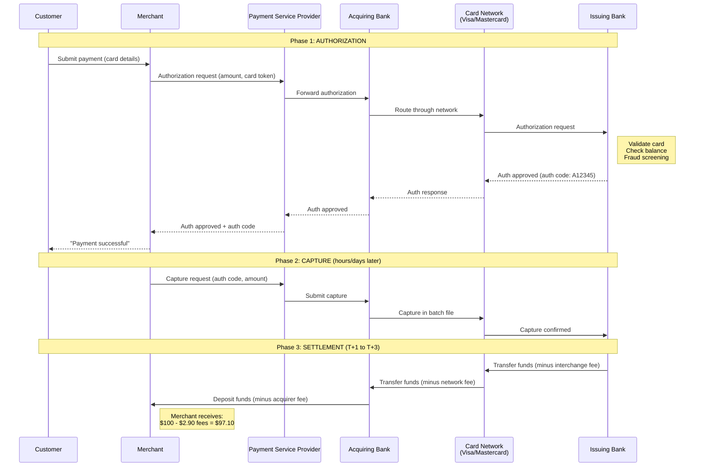
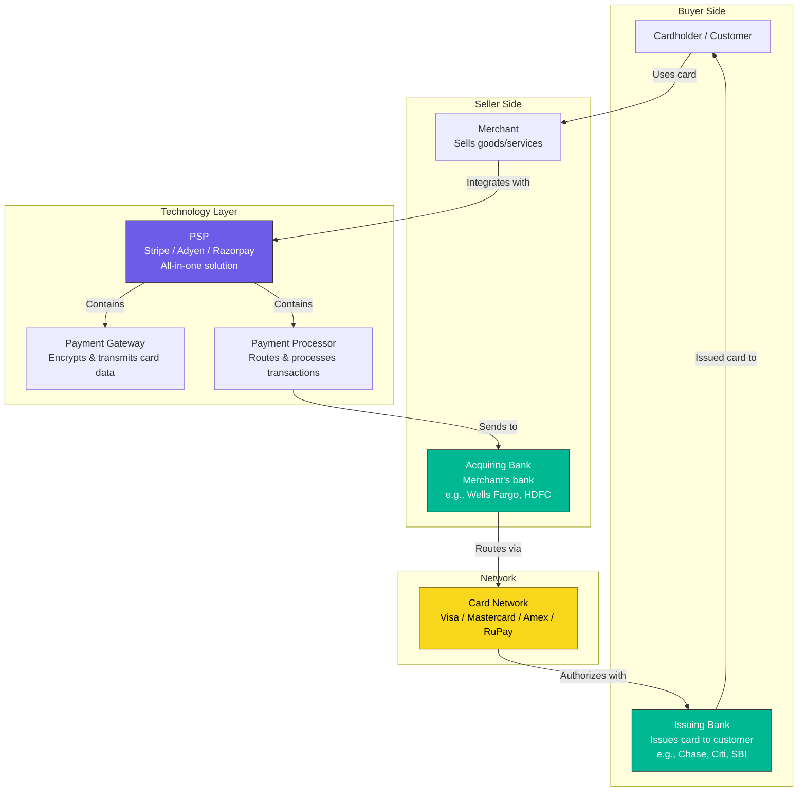
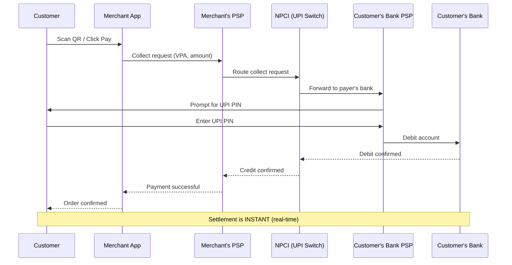
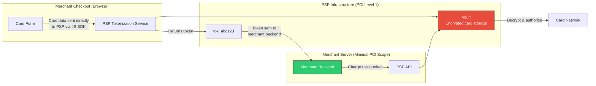
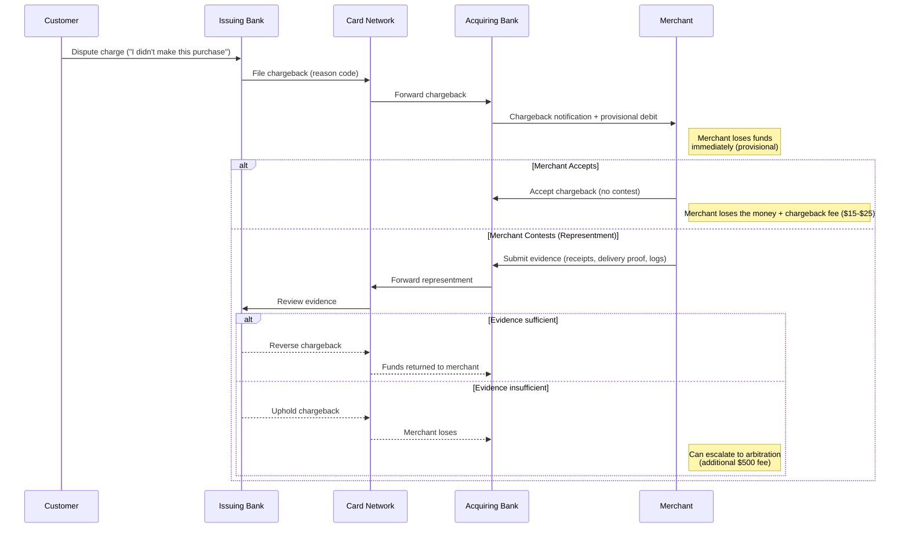

# Payment Systems Fundamentals

## Table of Contents
- [Payment Flow: Authorization, Capture, Settlement](#payment-flow-authorization-capture-settlement)
- [Key Players in a Card Transaction](#key-players-in-a-card-transaction)
- [Payment Gateway vs Payment Processor vs PSP](#payment-gateway-vs-payment-processor-vs-psp)
- [Payment Methods](#payment-methods)
- [PCI DSS Compliance](#pci-dss-compliance)
- [Recurring Payments](#recurring-payments)
- [Refunds and Chargebacks](#refunds-and-chargebacks)
- [Multi-Currency Payments](#multi-currency-payments)

---

## Payment Flow: Authorization, Capture, Settlement

Every card payment passes through three distinct phases. Understanding these phases
is the foundation for designing any payment system.

### Phase 1: Authorization

Authorization **verifies** the card and **reserves** funds on the cardholder's account.
No money actually moves yet.

What happens during authorization:
1. Merchant sends card details + amount to their Payment Service Provider (PSP)
2. PSP forwards the request through the card network to the issuing bank
3. Issuing bank checks: Is the card valid? Is there sufficient balance? Does fraud screening pass?
4. Issuing bank returns an authorization code (approved) or a decline code
5. The authorized amount is "held" -- it reduces available balance but is not yet charged

Key points:
- Authorization does NOT transfer money
- Authorizations expire (typically 5-7 days for online, 30 days for hotels/car rentals)
- The hold reduces the cardholder's available credit/balance
- An authorization can be voided before capture (no charge to the customer)

### Phase 2: Capture

Capture is when the merchant says "actually charge this card." It converts the
authorization hold into a real charge.

Two capture models:
- **Auth + Capture (two-step)**: Authorize first, capture later (e-commerce ships goods, then captures)
- **Auth-capture (one-step)**: Authorize and capture simultaneously (in-store purchases, digital goods)

When merchants delay capture:
- E-commerce: authorize at checkout, capture when order ships
- Hotels: authorize at check-in, capture at checkout (amount may change)
- Marketplaces: authorize when buyer commits, capture when seller fulfills

### Phase 3: Settlement

Settlement is the actual transfer of funds between banks. This happens in batch,
typically overnight.

Timeline:
- **T+0**: Transaction day (auth + capture)
- **T+1 to T+3**: Settlement window (funds transfer between banks)
- Acquiring bank receives funds from issuing bank via the card network
- Acquiring bank deposits funds (minus fees) into merchant's account

Fee flow during settlement:
- Interchange fee: paid by acquiring bank to issuing bank (~1.5-3%)
- Assessment fee: paid to card network (Visa/Mastercard) (~0.13-0.15%)
- Acquirer markup: acquiring bank's fee to the merchant

### Full Payment Flow Diagram



---

## Key Players in a Card Transaction

### The Five-Party Model



### Role of Each Player

| Player | Role | Examples |
|--------|------|----------|
| **Cardholder** | Person making the payment | You, buying on Amazon |
| **Merchant** | Business accepting the payment | Amazon, Uber, local shop |
| **Acquiring Bank** | Merchant's bank; receives funds on merchant's behalf | Wells Fargo, Worldpay, HDFC |
| **Card Network** | Routes transactions between acquiring and issuing banks | Visa, Mastercard, Amex, RuPay |
| **Issuing Bank** | Cardholder's bank; issued the card, approves/declines | Chase, Citi, SBI, ICICI |
| **PSP** | Technology layer connecting merchants to the payment ecosystem | Stripe, Adyen, Razorpay, Square |

### Money Flow vs Data Flow

Data flow (milliseconds): Merchant -> PSP -> Acquiring Bank -> Card Network -> Issuing Bank (and back)

Money flow (days): Issuing Bank -> Card Network -> Acquiring Bank -> Merchant (via settlement)

These are fundamentally different timelines. Data moves in real time. Money moves
in batch over days.

---

## Payment Gateway vs Payment Processor vs PSP

These terms are often confused. Here is the precise distinction:

### Payment Gateway

The **front door** -- encrypts and securely transmits payment data from the merchant
to the processor.

Responsibilities:
- Encrypt card data (TLS + tokenization)
- Transmit authorization requests
- Return authorization responses to the merchant
- Handle 3D Secure authentication
- Provide a checkout UI (hosted payment page or embedded form)

Analogy: a payment gateway is like a POS terminal for online transactions.

### Payment Processor

The **routing engine** -- processes the transaction by communicating with acquiring banks
and card networks.

Responsibilities:
- Route transactions to the correct card network
- Handle batch settlement
- Manage transaction lifecycle (auth, capture, void, refund)
- Report to the acquiring bank

### PSP (Payment Service Provider)

The **all-in-one solution** -- combines gateway + processor + merchant account +
additional services.

A PSP like Stripe provides:
- Payment gateway (Stripe.js, Checkout)
- Payment processing (routing, settlement)
- Merchant account (funds held by Stripe until payout)
- Fraud detection (Stripe Radar)
- Subscription management (Stripe Billing)
- Multi-currency support
- Reporting and analytics

```
Traditional Setup:
  Merchant → Payment Gateway → Payment Processor → Acquiring Bank → Network

PSP Setup:
  Merchant → PSP (gateway + processor + merchant account) → Network
```

### When to Use What

| Scenario | Choice | Why |
|----------|--------|-----|
| Startup / SMB | PSP (Stripe, Square) | Fast integration, no bank relationships needed |
| Enterprise (high volume) | Gateway + Processor + Own acquiring | Lower fees, more control |
| Multi-PSP strategy | Payment orchestration layer | Route to cheapest/most reliable PSP per transaction |

---

## Payment Methods

### Credit and Debit Cards

The dominant online payment method globally (except in markets where local methods dominate).

```python
# Card number anatomy (Luhn algorithm validation)
# 4532 0150 0000 1234
# │    │              │
# │    │              └── Check digit (Luhn)
# │    └── Issuer-assigned account number
# └── BIN (Bank Identification Number): identifies issuing bank + card type

def luhn_check(card_number: str) -> bool:
    """Validate card number using the Luhn algorithm."""
    digits = [int(d) for d in card_number.replace(" ", "")]
    checksum = 0
    reverse_digits = digits[::-1]
    for i, digit in enumerate(reverse_digits):
        if i % 2 == 1:
            digit *= 2
            if digit > 9:
                digit -= 9
        checksum += digit
    return checksum % 10 == 0
```

Card-present (CP) vs Card-not-present (CNP):
- CP: physical card swiped/tapped at terminal (lower fraud risk, lower fees)
- CNP: online or phone transactions (higher fraud risk, higher fees)

### UPI (Unified Payments Interface) -- India

Real-time bank-to-bank transfer system built by NPCI (National Payments Corporation of India).

Key characteristics:
- Instant settlement (unlike cards which take T+1 to T+3)
- Near-zero merchant fees (government subsidized)
- Works via VPA (Virtual Payment Address): user@bankname
- P2P and P2M (person-to-merchant) transfers
- Two-factor auth: device binding + UPI PIN
- Processes 10+ billion transactions/month



### Bank Transfers (ACH, SEPA, Wire)

| Method | Region | Speed | Cost | Use Case |
|--------|--------|-------|------|----------|
| **ACH** | US | 1-3 business days (same-day available) | $0.20-$1.50 | Payroll, bill pay, subscriptions |
| **SEPA** | EU | 1 business day (instant available) | ~EUR 0.20 | Cross-border EU payments |
| **Wire** | Global | Same day / next day | $15-$50 | Large B2B payments, international |
| **SWIFT** | Global | 1-5 business days | $25-$50+ | International bank-to-bank |

### Digital Wallets

Apple Pay, Google Pay, PayPal, Alipay, WeChat Pay.

Architecture pattern: wallets tokenize the underlying payment method and add a
device-specific authentication layer.

```
Apple Pay flow:
  Card on file → Apple tokenizes → Device-specific token (DPAN)
  At checkout: DPAN + biometric auth → PSP → Card network → Issuing bank
  
  Key benefit: actual card number never transmitted to merchant
```

### BNPL (Buy Now, Pay Later)

Klarna, Affirm, Afterpay, Pay Later by major banks.

Model: BNPL provider pays the merchant immediately (minus fees ~3-6%), then collects
installments from the customer over 4-12 weeks.

Risk: BNPL provider assumes credit risk, not the merchant.

---

## PCI DSS Compliance

PCI DSS (Payment Card Industry Data Security Standard) is mandatory for any entity
that stores, processes, or transmits cardholder data.

### The 12 PCI DSS Requirements

| # | Requirement | Summary |
|---|-------------|---------|
| 1 | Install and maintain network security controls | Firewalls, network segmentation |
| 2 | Apply secure configurations to all system components | No default passwords, harden systems |
| 3 | Protect stored account data | Encrypt stored card data, mask PAN in display |
| 4 | Protect cardholder data in transit | TLS 1.2+ for all transmissions |
| 5 | Protect all systems against malware | Anti-malware on all systems |
| 6 | Develop and maintain secure systems and software | Secure SDLC, patch management |
| 7 | Restrict access to system components by business need | Role-based access control |
| 8 | Identify users and authenticate access | MFA, strong passwords |
| 9 | Restrict physical access to cardholder data | Physical security controls |
| 10 | Log and monitor all access to system components | Audit trails, SIEM |
| 11 | Test security regularly | Vulnerability scans, penetration tests |
| 12 | Support information security with organizational policies | Security policies, incident response |

### SAQ Types (Self-Assessment Questionnaires)

SAQ type depends on how the merchant handles card data:

| SAQ Type | Who | Card Data Handling |
|----------|-----|-------------------|
| **SAQ A** | E-commerce, fully outsourced | Card data never touches merchant servers (Stripe Checkout, hosted payment page) |
| **SAQ A-EP** | E-commerce, partial outsource | Merchant website controls payment page but card data goes directly to PSP (Stripe.js / Elements) |
| **SAQ D** | Full handling | Merchant directly processes/stores card data (maximum compliance burden) |

### Tokenization to Reduce PCI Scope

Tokenization replaces sensitive card data with a non-sensitive token. This is the
single most impactful strategy to reduce PCI compliance burden.

```python
# WITHOUT tokenization (SAQ D - maximum PCI scope)
# Card data flows through and is stored on merchant servers
payment_request = {
    "card_number": "4532015000001234",  # PAN stored on merchant server!
    "expiry": "12/27",
    "cvv": "123"
}

# WITH tokenization (SAQ A or A-EP - minimal PCI scope)
# Card data goes directly to PSP; merchant only sees a token
payment_request = {
    "token": "tok_1MqP5dLkdIwHu7ix",  # Non-sensitive, useless if stolen
    "amount": 10000,                     # Amount in cents
    "currency": "usd"
}
```



Result: the merchant server never sees actual card data. PCI scope drops from
SAQ D (300+ controls) to SAQ A (22 controls).

---

## Recurring Payments

### Subscription Billing Architecture

```python
class SubscriptionManager:
    """
    Core subscription billing engine.
    
    Responsibilities:
    - Track subscription lifecycle (trial -> active -> past_due -> canceled)
    - Generate invoices on billing cycles
    - Trigger payment attempts
    - Handle failed payments (retry + dunning)
    """
    
    RETRY_SCHEDULE = [
        1,    # Retry 1: 1 day after failure
        3,    # Retry 2: 3 days after failure  
        5,    # Retry 3: 5 days after failure
        7,    # Retry 4: 7 days after failure (final)
    ]
    
    def process_billing_cycle(self, subscription):
        """Called by cron job on the subscription's billing date."""
        invoice = self.create_invoice(subscription)
        
        payment_result = self.attempt_payment(
            customer_id=subscription.customer_id,
            payment_method_token=subscription.default_payment_method,
            amount=invoice.total,
            currency=invoice.currency,
            idempotency_key=f"inv_{invoice.id}_attempt_1"
        )
        
        if payment_result.success:
            invoice.mark_paid()
            subscription.advance_billing_period()
        else:
            invoice.mark_failed()
            subscription.status = "past_due"
            self.schedule_retry(subscription, invoice, attempt=1)
    
    def schedule_retry(self, subscription, invoice, attempt):
        """Schedule the next retry based on the retry schedule."""
        if attempt >= len(self.RETRY_SCHEDULE):
            # All retries exhausted
            subscription.status = "canceled"
            self.send_cancellation_notice(subscription)
            return
        
        retry_delay_days = self.RETRY_SCHEDULE[attempt]
        retry_at = datetime.utcnow() + timedelta(days=retry_delay_days)
        
        # Enqueue retry job
        self.job_queue.enqueue(
            job_type="retry_payment",
            scheduled_at=retry_at,
            payload={
                "subscription_id": subscription.id,
                "invoice_id": invoice.id,
                "attempt": attempt + 1,
                "idempotency_key": f"inv_{invoice.id}_attempt_{attempt + 1}"
            }
        )
```

### Dunning Management

Dunning is the process of communicating with customers about failed payments and
recovering revenue.

```
Day 0:  Payment fails → Status: past_due
        → Send email: "Your payment failed, please update card"
        → In-app banner: "Action required: update payment method"

Day 1:  Retry #1 (smart retry at different time of day)
        → If succeeds: status → active, remove banner
        → If fails: send SMS reminder

Day 3:  Retry #2
        → Send email: "Your subscription will be suspended in 4 days"

Day 5:  Retry #3
        → Send email: "Final notice -- update payment to avoid cancellation"
        → Restrict access to premium features

Day 7:  Retry #4 (final)
        → If fails: cancel subscription
        → Send email: "Subscription canceled. Click here to resubscribe"
        → Retain data for 30 days (grace period for win-back)
```

Smart retry optimization:
- Retry at a different time of day (the original time may be when the account is empty)
- Retry on different days (avoid weekends when banks may batch-process differently)
- Update card details automatically via card network updater services (Visa Account Updater, Mastercard ABU)
- Machine learning to pick optimal retry timing per customer

---

## Refunds and Chargebacks

### Refund Types

```python
class RefundService:
    def full_refund(self, payment_id: str, reason: str) -> Refund:
        """
        Reverse the entire captured amount.
        The original charge must be in 'captured' state.
        """
        payment = self.get_payment(payment_id)
        assert payment.status == "captured"
        
        refund = self.psp_client.refund(
            charge_id=payment.psp_charge_id,
            amount=payment.amount,  # Full amount
            idempotency_key=f"refund_{payment_id}_full"
        )
        
        # Double-entry ledger: reverse the original transaction
        self.ledger.record(
            debit_account=payment.merchant_account_id,   # Merchant gives back
            credit_account=payment.customer_account_id,   # Customer receives
            amount=payment.amount,
            transaction_type="REFUND",
            reference_id=payment_id
        )
        
        return refund

    def partial_refund(self, payment_id: str, amount: int, reason: str) -> Refund:
        """
        Refund a portion of the captured amount.
        Sum of all partial refunds must not exceed original amount.
        """
        payment = self.get_payment(payment_id)
        total_refunded = self.get_total_refunded(payment_id)
        
        assert amount + total_refunded <= payment.amount, \
            "Total refunds exceed original charge"
        
        refund = self.psp_client.refund(
            charge_id=payment.psp_charge_id,
            amount=amount,
            idempotency_key=f"refund_{payment_id}_partial_{total_refunded + amount}"
        )
        
        self.ledger.record(
            debit_account=payment.merchant_account_id,
            credit_account=payment.customer_account_id,
            amount=amount,
            transaction_type="PARTIAL_REFUND",
            reference_id=payment_id
        )
        
        return refund
```

### Chargeback Process

A chargeback is a forced reversal initiated by the cardholder's bank. This is
fundamentally different from a refund (which the merchant initiates).



Chargeback reason codes (Visa):
- 10.4: Fraud -- card-absent environment
- 13.1: Merchandise/services not received
- 13.3: Not as described
- 11.1: Card recovery bulletin (stolen card)

Chargeback rate threshold: if a merchant exceeds 1% chargeback rate, card networks
place them in monitoring programs with higher fees and potential termination.

---

## Multi-Currency Payments

### Exchange Rate Models

```python
class MultiCurrencyPayment:
    """
    Three key concepts:
    1. Presentment currency: what the customer sees (their local currency)
    2. Settlement currency: what the merchant receives (merchant's preferred currency)
    3. Processing currency: what the card network uses internally (usually USD)
    """
    
    def create_payment(
        self,
        amount: int,               # Amount in presentment currency smallest unit
        presentment_currency: str,  # e.g., "EUR"
        settlement_currency: str,   # e.g., "USD"
    ):
        # Option 1: Dynamic Currency Conversion (DCC)
        # Show the customer their local currency equivalent at checkout
        # Higher margin but better UX for international customers
        
        # Option 2: Multi-Currency Pricing (MCP)
        # Merchant sets prices in each currency explicitly
        # No FX risk at transaction time, but requires price management
        
        fx_rate = self.fx_service.get_rate(
            from_currency=presentment_currency,
            to_currency=settlement_currency,
            rate_type="mid_market"  # or "buy" / "sell"
        )
        
        settlement_amount = int(amount * fx_rate)
        
        return Payment(
            presentment_amount=amount,
            presentment_currency=presentment_currency,
            settlement_amount=settlement_amount,
            settlement_currency=settlement_currency,
            fx_rate=fx_rate,
            fx_rate_locked_at=datetime.utcnow(),
            fx_rate_valid_until=datetime.utcnow() + timedelta(minutes=15)
        )
```

### FX Risk Management

Sources of FX risk in payments:
1. **Rate movement between authorization and settlement** (1-3 days gap)
2. **Refunds at different rates**: customer paid EUR 100 = USD 110, but refund at current rate EUR 100 = USD 108 (merchant loses $2)
3. **Multi-currency reconciliation**: matching records across different currencies

Mitigation strategies:
- Lock exchange rates at authorization time (absorb difference or charge FX fee)
- Use hedging instruments for large volumes
- Settle in local currency to avoid FX entirely (requires local acquiring in each market)
- Build FX reserves to absorb rate fluctuations on refunds

### Multi-Currency Settlement Table Design

```sql
CREATE TABLE payments (
    id                    UUID PRIMARY KEY,
    merchant_id           UUID NOT NULL,
    
    -- What the customer paid
    presentment_amount    BIGINT NOT NULL,       -- Amount in smallest unit (cents)
    presentment_currency  CHAR(3) NOT NULL,      -- ISO 4217 (EUR, USD, INR)
    
    -- What the merchant receives
    settlement_amount     BIGINT NOT NULL,
    settlement_currency   CHAR(3) NOT NULL,
    
    -- FX details
    fx_rate               DECIMAL(18, 8),        -- Precise rate
    fx_rate_source        VARCHAR(50),           -- "mid_market", "visa_rate", etc.
    fx_rate_locked_at     TIMESTAMP,
    fx_markup_bps         INT,                   -- Markup in basis points
    
    -- Transaction metadata
    status                VARCHAR(20) NOT NULL,  -- authorized, captured, settled, refunded
    auth_code             VARCHAR(20),
    psp_reference         VARCHAR(100),
    created_at            TIMESTAMP DEFAULT NOW(),
    captured_at           TIMESTAMP,
    settled_at            TIMESTAMP,
    
    CONSTRAINT valid_currency CHECK (presentment_currency ~ '^[A-Z]{3}$')
);

CREATE INDEX idx_payments_merchant_status ON payments(merchant_id, status);
CREATE INDEX idx_payments_settlement ON payments(settled_at) WHERE status = 'captured';
```

---

## Interview Cheat Sheet: Payment Fundamentals

### Common Questions and Key Answers

**Q: Walk me through what happens when I tap my card at a coffee shop.**

A: (1) Terminal reads card chip/NFC, sends encrypted card data + amount to the merchant's
acquirer via the payment processor. (2) Acquirer routes through the card network (Visa/MC)
to your issuing bank. (3) Issuing bank checks: valid card, sufficient funds, fraud rules.
(4) Returns auth code in ~200ms. (5) For in-store, auth and capture happen simultaneously.
(6) Settlement happens overnight in batch -- actual funds move T+1 to T+3.

**Q: Why does authorization happen separately from capture?**

A: Because the final charge amount may differ from the initial authorization. Hotels
authorize at check-in but capture at checkout (with minibar charges). E-commerce
authorizes at order but captures at shipment (partial shipments = partial captures).
This two-phase model protects both merchant and customer.

**Q: How do payment fees work?**

A: On a $100 transaction with 2.9% + $0.30 (typical Stripe pricing):
- Customer pays: $100
- Merchant receives: $97.10 ($100 - $2.90 - $0.30 = $96.80 to be precise)
- Fee breakdown: interchange (~1.8% to issuing bank) + network fee (~0.15% to Visa/MC)
  + acquirer/PSP markup (~0.95% to Stripe)

**Q: What is the difference between a void and a refund?**

A: A void cancels an authorization before capture -- no money ever moved, so no fees.
A refund reverses a captured charge -- money must flow back, and the merchant typically
still pays the original processing fee (Stripe does return the fee; most processors do not).

---

## Key Metrics for Payment Systems

| Metric | Target | Why It Matters |
|--------|--------|----------------|
| Authorization rate | > 95% | Revenue directly tied to successful auths |
| Capture rate | > 98% of auths | Uncaptured auths = lost revenue |
| Settlement success | > 99.9% | Failures here mean accounting nightmares |
| Average processing latency | < 2 seconds | Customer experience |
| Chargeback rate | < 1% | Above 1% triggers monitoring programs |
| False decline rate | < 5% | Each false decline = lost customer |
| Payment page conversion | > 70% | Drop-offs at checkout = revenue loss |
| Retry success rate | > 30% | Recovered revenue from failed subscriptions |
