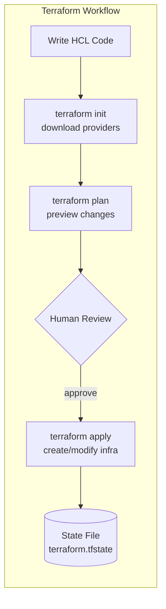
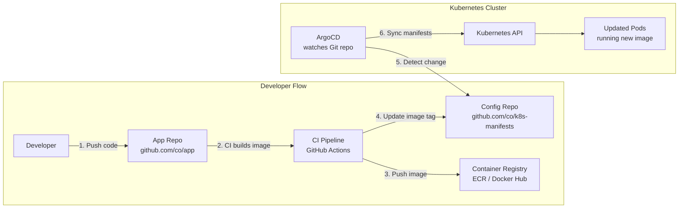
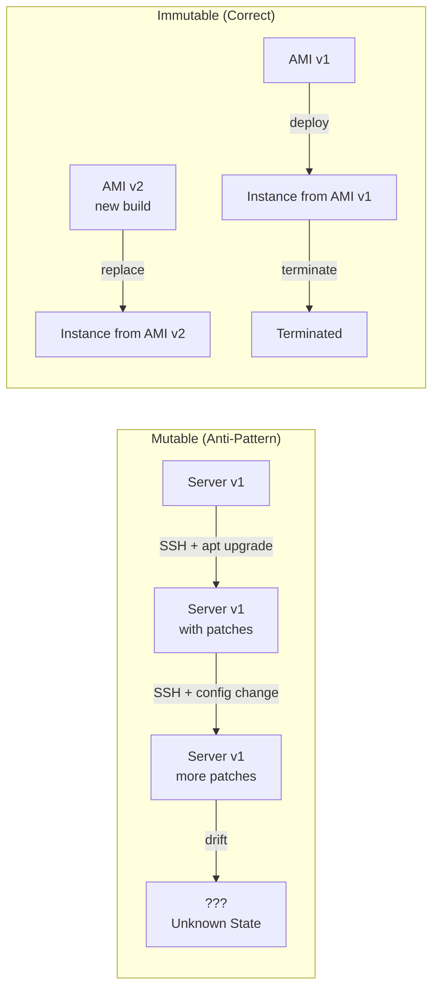
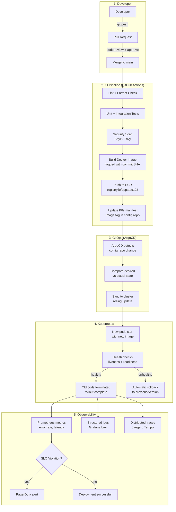

# Infrastructure as Code (IaC) and GitOps

## What Is Infrastructure as Code?

Infrastructure as Code (IaC) is the practice of managing and provisioning infrastructure
through **machine-readable definition files** rather than manual configuration. Infrastructure
is declared, versioned, reviewed, and deployed like application code.

**Core principle:** If it is not in code, it does not exist. If it cannot be reproduced from
code alone, it is not infrastructure as code.

### Why IaC Matters

| Without IaC | With IaC |
|------------|----------|
| "Click here, then here, then type this..." | `terraform apply` |
| "Who changed the firewall rule?" | `git log` |
| "Can we rebuild this environment?" | "Yes, in 15 minutes." |
| Staging and production drift apart silently | Identical by definition |
| One person holds all the knowledge | Knowledge is in the repo |

**Four pillars:**
1. **Reproducibility** -- recreate any environment from scratch
2. **Version control** -- full audit trail of every change
3. **Automation** -- no manual steps, no human error
4. **Consistency** -- dev, staging, and production are structurally identical

---

## Terraform

The most widely adopted open-source IaC tool. Uses **HCL** (HashiCorp Configuration Language)
to define infrastructure across any cloud provider.

### Core Concepts



### HCL Syntax: Providers, Resources, Data Sources

```hcl
# providers.tf -- declare which clouds/services to manage
terraform {
  required_version = ">= 1.7"
  required_providers {
    aws = {
      source  = "hashicorp/aws"
      version = "~> 5.0"
    }
  }
  
  # Remote state -- shared, locked, versioned
  backend "s3" {
    bucket         = "mycompany-terraform-state"
    key            = "production/order-service/terraform.tfstate"
    region         = "us-east-1"
    dynamodb_table = "terraform-locks"    # DynamoDB for state locking
    encrypt        = true
  }
}

provider "aws" {
  region = var.aws_region
  
  default_tags {
    tags = {
      ManagedBy   = "terraform"
      Environment = var.environment
      Team        = "platform"
    }
  }
}
```

```hcl
# variables.tf
variable "environment" {
  type        = string
  description = "Deployment environment"
  validation {
    condition     = contains(["dev", "staging", "production"], var.environment)
    error_message = "Environment must be dev, staging, or production."
  }
}

variable "aws_region" {
  type    = string
  default = "us-east-1"
}

variable "db_instance_class" {
  type    = string
  default = "db.r6g.large"
}
```

### Full Example: VPC + EC2 + RDS

```hcl
# networking.tf -- VPC with public and private subnets
resource "aws_vpc" "main" {
  cidr_block           = "10.0.0.0/16"
  enable_dns_hostnames = true
  
  tags = { Name = "${var.environment}-vpc" }
}

resource "aws_subnet" "public" {
  count             = 2
  vpc_id            = aws_vpc.main.id
  cidr_block        = "10.0.${count.index + 1}.0/24"
  availability_zone = data.aws_availability_zones.available.names[count.index]
  
  map_public_ip_on_launch = true
  tags = { Name = "${var.environment}-public-${count.index + 1}" }
}

resource "aws_subnet" "private" {
  count             = 2
  vpc_id            = aws_vpc.main.id
  cidr_block        = "10.0.${count.index + 10}.0/24"
  availability_zone = data.aws_availability_zones.available.names[count.index]
  
  tags = { Name = "${var.environment}-private-${count.index + 1}" }
}

resource "aws_internet_gateway" "main" {
  vpc_id = aws_vpc.main.id
}

resource "aws_nat_gateway" "main" {
  allocation_id = aws_eip.nat.id
  subnet_id     = aws_subnet.public[0].id
}

resource "aws_eip" "nat" {
  domain = "vpc"
}

data "aws_availability_zones" "available" {
  state = "available"
}

# compute.tf -- EC2 instance in public subnet
resource "aws_instance" "app" {
  ami                    = data.aws_ami.amazon_linux.id
  instance_type          = "t3.medium"
  subnet_id              = aws_subnet.public[0].id
  vpc_security_group_ids = [aws_security_group.app.id]
  
  user_data = <<-EOF
    #!/bin/bash
    yum update -y
    yum install -y docker
    systemctl start docker
    docker run -d -p 80:8080 ${var.app_image}
  EOF
  
  tags = { Name = "${var.environment}-app" }
}

data "aws_ami" "amazon_linux" {
  most_recent = true
  owners      = ["amazon"]
  filter {
    name   = "name"
    values = ["al2023-ami-*-x86_64"]
  }
}

resource "aws_security_group" "app" {
  vpc_id = aws_vpc.main.id
  
  ingress {
    from_port   = 80
    to_port     = 80
    protocol    = "tcp"
    cidr_blocks = ["0.0.0.0/0"]
  }
  
  egress {
    from_port   = 0
    to_port     = 0
    protocol    = "-1"
    cidr_blocks = ["0.0.0.0/0"]
  }
}

# database.tf -- RDS PostgreSQL in private subnet
resource "aws_db_subnet_group" "main" {
  name       = "${var.environment}-db-subnet"
  subnet_ids = aws_subnet.private[*].id
}

resource "aws_db_instance" "postgres" {
  identifier     = "${var.environment}-orders-db"
  engine         = "postgres"
  engine_version = "16.2"
  instance_class = var.db_instance_class
  
  allocated_storage     = 100
  max_allocated_storage = 500          # autoscaling
  storage_type          = "gp3"
  storage_encrypted     = true
  
  db_name  = "orders"
  username = "dbadmin"
  password = var.db_password           # from Secrets Manager in practice
  
  db_subnet_group_name   = aws_db_subnet_group.main.name
  vpc_security_group_ids = [aws_security_group.db.id]
  
  multi_az            = var.environment == "production"
  skip_final_snapshot = var.environment != "production"
  
  backup_retention_period = 7
  backup_window          = "03:00-04:00"
  maintenance_window     = "Mon:04:00-Mon:05:00"
}

resource "aws_security_group" "db" {
  vpc_id = aws_vpc.main.id
  
  ingress {
    from_port       = 5432
    to_port         = 5432
    protocol        = "tcp"
    security_groups = [aws_security_group.app.id]    # only app can reach DB
  }
}

# outputs.tf
output "app_public_ip" {
  value = aws_instance.app.public_ip
}

output "db_endpoint" {
  value     = aws_db_instance.postgres.endpoint
  sensitive = true
}
```

### State Management

Terraform state tracks the mapping between your HCL and real cloud resources.

| Aspect | Local State | Remote State (S3 + DynamoDB) |
|--------|------------|------------------------------|
| **Storage** | `terraform.tfstate` on disk | S3 bucket, versioned |
| **Collaboration** | Single developer only | Team-wide |
| **Locking** | None | DynamoDB prevents concurrent applies |
| **Backup** | Manual | S3 versioning + lifecycle policies |
| **Security** | Secrets in plaintext on disk | Encrypted at rest, IAM-controlled |

### Modules: Reusable Infrastructure Components

```hcl
# modules/vpc/main.tf -- reusable VPC module
variable "cidr_block" { type = string }
variable "environment" { type = string }
variable "az_count" { type = number, default = 2 }

resource "aws_vpc" "this" {
  cidr_block = var.cidr_block
  tags       = { Name = "${var.environment}-vpc" }
}
# ... subnets, gateways, route tables ...

output "vpc_id" { value = aws_vpc.this.id }
output "private_subnet_ids" { value = aws_subnet.private[*].id }

# Usage in root module
module "vpc" {
  source      = "./modules/vpc"
  cidr_block  = "10.0.0.0/16"
  environment = "production"
  az_count    = 3
}

module "database" {
  source     = "./modules/rds"
  subnet_ids = module.vpc.private_subnet_ids    # output from VPC module
  vpc_id     = module.vpc.vpc_id
}
```

---

## CloudFormation (AWS-Native)

AWS-native IaC using YAML or JSON templates. Tightly integrated with AWS services.

```yaml
AWSTemplateFormatVersion: '2010-09-09'
Description: Order Service Infrastructure

Parameters:
  Environment:
    Type: String
    AllowedValues: [dev, staging, production]
  DBInstanceClass:
    Type: String
    Default: db.r6g.large

Resources:
  VPC:
    Type: AWS::EC2::VPC
    Properties:
      CidrBlock: 10.0.0.0/16
      EnableDnsHostnames: true
      Tags:
        - Key: Name
          Value: !Sub "${Environment}-vpc"

  Database:
    Type: AWS::RDS::DBInstance
    Properties:
      DBInstanceIdentifier: !Sub "${Environment}-orders-db"
      Engine: postgres
      EngineVersion: "16.2"
      DBInstanceClass: !Ref DBInstanceClass
      AllocatedStorage: 100
      MasterUsername: dbadmin
      MasterUserPassword: !Ref DBPassword
      MultiAZ: !If [IsProduction, true, false]

Conditions:
  IsProduction: !Equals [!Ref Environment, production]

Outputs:
  DatabaseEndpoint:
    Value: !GetAtt Database.Endpoint.Address
```

**Drift detection:** CloudFormation can detect when someone manually changes a resource
outside of the template and report the differences.

---

## Pulumi: Real Programming Languages

Pulumi lets you define infrastructure using **TypeScript, Python, Go, or C#** instead of a
domain-specific language.

```typescript
// TypeScript example -- same VPC + RDS as Terraform example
import * as aws from "@pulumi/aws";

const vpc = new aws.ec2.Vpc("main-vpc", {
    cidrBlock: "10.0.0.0/16",
    enableDnsHostnames: true,
});

const privateSubnets = [0, 1].map(i =>
    new aws.ec2.Subnet(`private-${i}`, {
        vpcId: vpc.id,
        cidrBlock: `10.0.${i + 10}.0/24`,
        availabilityZone: aws.getAvailabilityZones().then(azs => azs.names[i]),
    })
);

const db = new aws.rds.Instance("orders-db", {
    engine: "postgres",
    engineVersion: "16.2",
    instanceClass: "db.r6g.large",
    allocatedStorage: 100,
    dbName: "orders",
    username: "dbadmin",
    password: config.requireSecret("dbPassword"),  // encrypted in state
    dbSubnetGroupName: subnetGroup.name,
});

export const dbEndpoint = db.endpoint;
```

**Key advantage:** Use loops, conditionals, type checking, unit tests, and IDE autocompletion
natively. No DSL to learn.

---

## Comparison: Terraform vs CloudFormation vs Pulumi

| Aspect | Terraform | CloudFormation | Pulumi |
|--------|-----------|---------------|--------|
| **Language** | HCL (domain-specific) | YAML/JSON | TypeScript, Python, Go, C# |
| **Cloud Support** | Multi-cloud (AWS, GCP, Azure, K8s, Datadog, ...) | AWS only | Multi-cloud |
| **State** | Self-managed (S3, Terraform Cloud) | AWS-managed | Pulumi Cloud or self-managed |
| **Drift Detection** | `terraform plan` (manual) | Built-in, automatic | `pulumi preview` |
| **Learning Curve** | Medium (new DSL) | Medium (verbose YAML) | Low if you know the language |
| **Ecosystem** | Largest provider ecosystem | Deep AWS integration | Growing rapidly |
| **Testing** | Terratest (Go), `tftest` | TaskCat, cfn-lint | Standard unit test frameworks |
| **Best For** | Multi-cloud, large teams | AWS-only shops | Teams that prefer real code |
| **Rollback** | Manual (revert code + apply) | Automatic stack rollback | Manual (revert code + up) |
| **Cost** | Free (OSS), paid cloud | Free | Free (OSS), paid cloud |

---

## GitOps

### Principle: Git as the Single Source of Truth

GitOps extends IaC to **runtime state**. The entire system -- infrastructure AND application
deployments -- is declared in Git. An automated agent continuously reconciles the cluster
to match the Git-declared state.

**Push-based (traditional CI/CD):** CI pipeline pushes changes to the cluster.
**Pull-based (GitOps):** An agent inside the cluster pulls desired state from Git.

### ArgoCD: Declarative GitOps for Kubernetes



```yaml
# ArgoCD Application definition
apiVersion: argoproj.io/v1alpha1
kind: Application
metadata:
  name: order-service
  namespace: argocd
spec:
  project: default
  source:
    repoURL: https://github.com/mycompany/k8s-manifests
    targetRevision: main
    path: apps/order-service/overlays/production
  destination:
    server: https://kubernetes.default.svc
    namespace: production
  syncPolicy:
    automated:
      prune: true              # delete resources removed from Git
      selfHeal: true           # revert manual cluster changes
    syncOptions:
    - CreateNamespace=true
    retry:
      limit: 3
      backoff:
        duration: 5s
        maxDuration: 3m
        factor: 2
```

### Flux: Pull-Based GitOps

Alternative to ArgoCD. Flux is a set of controllers installed in the cluster that watch
Git repositories and reconcile state.

```yaml
# Flux GitRepository source
apiVersion: source.toolkit.fluxcd.io/v1
kind: GitRepository
metadata:
  name: k8s-manifests
  namespace: flux-system
spec:
  interval: 1m
  url: https://github.com/mycompany/k8s-manifests
  ref:
    branch: main
---
# Flux Kustomization -- applies manifests from the repo
apiVersion: kustomize.toolkit.fluxcd.io/v1
kind: Kustomization
metadata:
  name: order-service
  namespace: flux-system
spec:
  interval: 5m
  sourceRef:
    kind: GitRepository
    name: k8s-manifests
  path: ./apps/order-service/production
  prune: true
  healthChecks:
  - apiVersion: apps/v1
    kind: Deployment
    name: order-service
    namespace: production
```

### GitOps Workflow

```
1. Developer pushes code change
2. CI pipeline builds and tests
3. CI builds container image, pushes to registry
4. CI updates image tag in config repo (via automated PR or direct commit)
5. ArgoCD / Flux detects config repo change
6. Agent compares desired state (Git) vs actual state (cluster)
7. Agent applies diff to cluster
8. Health checks verify the new state
9. If unhealthy, automatic rollback to previous Git commit
```

### ArgoCD vs Flux

| Aspect | ArgoCD | Flux |
|--------|--------|------|
| **UI** | Rich web UI with app visualization | CLI-focused, optional Weave GitOps UI |
| **Multi-cluster** | Built-in, manages many clusters | Requires per-cluster installation |
| **RBAC** | Fine-grained, OIDC integration | Kubernetes-native RBAC |
| **Helm support** | Native Helm chart rendering | HelmRelease controller |
| **Architecture** | Centralized controller | Distributed controllers (GitOps Toolkit) |
| **Best for** | Platform teams managing many clusters | Teams wanting lightweight, modular GitOps |

---

## Immutable Infrastructure

### Principle: Replace, Never Patch

Instead of SSHing into a server and running `apt upgrade`, you **build a new image** with
the update and **replace the old instance entirely**.



**Implementations:**
- **Container images:** Docker images are immutable. New version = new image, never patch a running container.
- **VM images:** Packer builds AMIs. New version = new AMI, launch + terminate old instances.
- **Serverless:** Every Lambda deployment is a new immutable package.

**Benefits:**
- Every instance is identical -- no configuration drift
- Rollback = redeploy the previous image
- Security patches are guaranteed to reach every instance (no "this server was missed")

---

## Real-World Deployment Pipeline

End-to-end pipeline from developer commit to production deployment:



### Pipeline in GitHub Actions

```yaml
name: Deploy Order Service

on:
  push:
    branches: [main]
    paths:
      - 'services/order-service/**'

env:
  IMAGE: 012345678901.dkr.ecr.us-east-1.amazonaws.com/order-service

jobs:
  build-and-deploy:
    runs-on: ubuntu-latest
    steps:
    - uses: actions/checkout@v4

    - name: Run tests
      run: |
        cd services/order-service
        go test ./... -race -coverprofile=coverage.out

    - name: Security scan
      uses: aquasecurity/trivy-action@master
      with:
        scan-type: fs
        scan-ref: services/order-service

    - name: Build and push image
      run: |
        aws ecr get-login-password | docker login --username AWS --password-stdin $IMAGE
        docker build -t $IMAGE:${{ github.sha }} services/order-service/
        docker push $IMAGE:${{ github.sha }}

    - name: Update K8s manifests
      run: |
        git clone https://github.com/mycompany/k8s-manifests.git
        cd k8s-manifests
        # Update image tag in kustomization.yaml
        kustomize edit set image order-service=$IMAGE:${{ github.sha }}
        git add .
        git commit -m "deploy: order-service ${{ github.sha }}"
        git push
      # ArgoCD automatically detects this change and syncs to cluster
```

---

## IaC Best Practices

1. **State is sacred.** Use remote state with locking. Never manually edit state files.
2. **Modularize early.** Extract reusable modules for VPC, EKS, RDS, etc.
3. **Use workspaces or directories** to separate environments, not branches.
4. **Pin provider versions.** Avoid surprise breaking changes on `terraform init`.
5. **Run `plan` in CI.** Post the plan output as a PR comment for review.
6. **Separate application and infrastructure repos.** Different change cadences.
7. **Tag everything.** Every resource should have `ManagedBy=terraform`, `Environment`, `Team`.
8. **Use policy-as-code.** OPA/Conftest or Sentinel to enforce guardrails on plans.
9. **Limit blast radius.** Small state files per service, not one giant monolith state.
10. **Immutable artifacts.** Never patch running infrastructure; rebuild and replace.

---

## Interview Cheat Sheet

**"Why Terraform over CloudFormation?"**
> Terraform is **multi-cloud** -- one tool for AWS, GCP, Azure, Kubernetes, Datadog, and
> hundreds of other providers. CloudFormation is AWS-only. If you are exclusively on AWS and
> want automatic rollback on stack failure, CloudFormation is reasonable. For everything
> else, Terraform's ecosystem is larger and more portable.

**"What is GitOps and why does it matter?"**
> GitOps means Git is the single source of truth for both infrastructure and application
> state. An agent (ArgoCD/Flux) inside the cluster continuously reconciles actual state to
> match Git. Benefits: full audit trail via git log, easy rollback via git revert, no direct
> cluster access needed for deployments, and drift is automatically corrected.

**"Explain immutable infrastructure."**
> Instead of patching running servers (mutable), you build a new image with the changes
> and replace the old instances entirely. This eliminates configuration drift, makes rollback
> trivial (redeploy old image), and guarantees every instance is identical. Docker containers
> are the purest form of immutable infrastructure.
