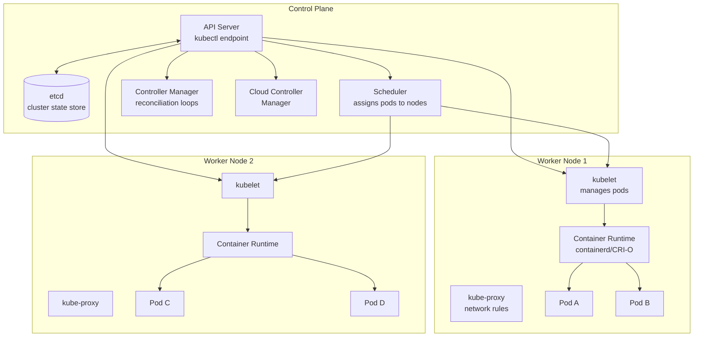
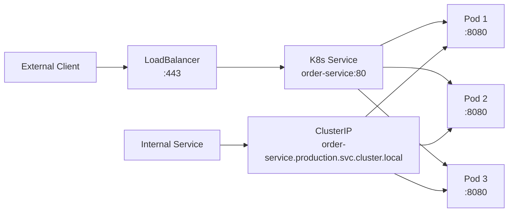
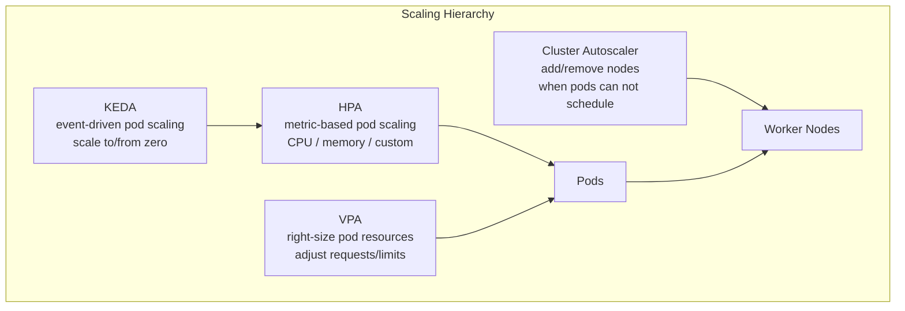
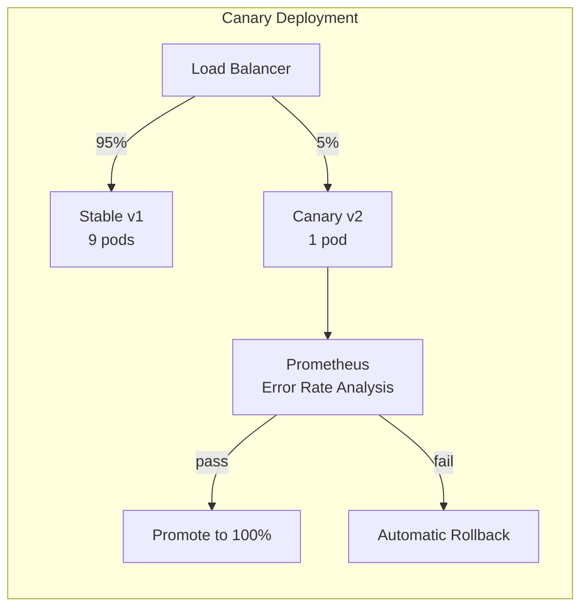
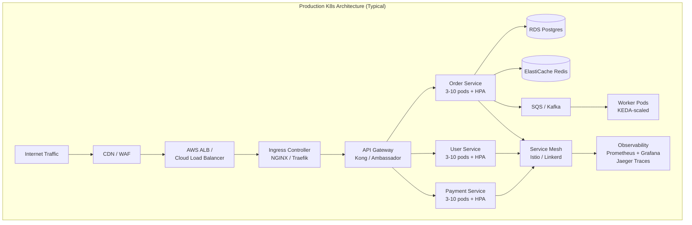

# Kubernetes: Container Orchestration

## What Is Kubernetes?

Kubernetes (K8s) is a **container orchestration platform** that automates the deployment,
scaling, and management of containerized applications. Originally designed by Google (based
on their internal Borg system), it is now maintained by the CNCF and is the de facto
standard for running production workloads.

**Core promise:** You declare the **desired state** of your system; Kubernetes continuously
reconciles **actual state** to match it.

---

## Architecture



### Control Plane Components

| Component | Role |
|-----------|------|
| **API Server** | Front door to the cluster. All commands (`kubectl`, controllers, kubelet) go through it. RESTful, the only component that talks to etcd. |
| **etcd** | Distributed key-value store. Holds ALL cluster state: pod specs, secrets, config, service endpoints. Raft consensus for HA. |
| **Scheduler** | Watches for unscheduled pods, scores nodes based on resources/affinity/taints, assigns pod to best node. |
| **Controller Manager** | Runs reconciliation loops: Deployment controller, ReplicaSet controller, Job controller, etc. Detects drift from desired state and corrects it. |
| **Cloud Controller Manager** | Integrates with cloud APIs: provisions load balancers, manages node lifecycle, attaches volumes. |

### Worker Node Components

| Component | Role |
|-----------|------|
| **kubelet** | Agent on each node. Receives pod specs from API Server, ensures containers are running and healthy. |
| **kube-proxy** | Maintains iptables / IPVS rules for Service routing. Routes traffic to correct pod. |
| **Container Runtime** | Runs containers. containerd and CRI-O are the standard runtimes (Docker is deprecated as runtime). |

---

## Core Abstractions

### Pod: Smallest Deployable Unit

A pod is one or more containers that share **network namespace** (same IP, same localhost)
and **storage volumes**. Almost always one container per pod in practice.

```yaml
apiVersion: v1
kind: Pod
metadata:
  name: web-server
  labels:
    app: web
    version: v2
spec:
  containers:
  - name: app
    image: myapp:1.4.2
    ports:
    - containerPort: 8080
    resources:
      requests:
        cpu: 100m
        memory: 128Mi
      limits:
        cpu: 500m
        memory: 256Mi
  - name: log-sidecar            # sidecar pattern -- shares pod network
    image: fluent-bit:2.1
    volumeMounts:
    - name: shared-logs
      mountPath: /var/log/app
  volumes:
  - name: shared-logs
    emptyDir: {}
```

**Key concepts:**
- Pods are **ephemeral** -- they get an IP when created, lose it when destroyed
- Never create pods directly -- always use a Deployment or higher-level controller
- Multi-container pods use patterns: **sidecar**, **ambassador**, **init container**

---

### Deployment: Declarative Pod Management

A Deployment manages a **ReplicaSet** which manages **Pods**. It handles rolling updates,
rollbacks, and desired replica count.

```yaml
apiVersion: apps/v1
kind: Deployment
metadata:
  name: order-service
  namespace: production
spec:
  replicas: 3
  selector:
    matchLabels:
      app: order-service
  strategy:
    type: RollingUpdate
    rollingUpdate:
      maxSurge: 1           # create 1 extra pod during update
      maxUnavailable: 0     # never go below desired count
  template:
    metadata:
      labels:
        app: order-service
        version: v2.1.0
    spec:
      containers:
      - name: app
        image: registry.io/order-service:v2.1.0
        ports:
        - containerPort: 8080
        envFrom:
        - configMapRef:
            name: order-config
        - secretRef:
            name: order-secrets
        readinessProbe:
          httpGet:
            path: /healthz
            port: 8080
          initialDelaySeconds: 5
          periodSeconds: 10
        livenessProbe:
          httpGet:
            path: /healthz
            port: 8080
          initialDelaySeconds: 15
          periodSeconds: 20
        resources:
          requests:
            cpu: 250m
            memory: 256Mi
          limits:
            cpu: "1"
            memory: 512Mi
```

**Rollback:**
```bash
kubectl rollout undo deployment/order-service              # previous version
kubectl rollout undo deployment/order-service --to-revision=3  # specific revision
kubectl rollout status deployment/order-service            # watch progress
kubectl rollout history deployment/order-service           # view history
```

---

### Service: Stable Network Endpoint

Pods get random IPs that change on restart. A **Service** provides a stable DNS name and
load-balances traffic across matching pods.

```yaml
# ClusterIP: internal traffic only (default)
apiVersion: v1
kind: Service
metadata:
  name: order-service          # accessible as order-service.production.svc.cluster.local
  namespace: production
spec:
  type: ClusterIP
  selector:
    app: order-service         # routes to pods with this label
  ports:
  - port: 80                   # service port
    targetPort: 8080           # container port
---
# NodePort: expose on every node's IP at a static port (30000-32767)
apiVersion: v1
kind: Service
metadata:
  name: order-service-nodeport
spec:
  type: NodePort
  selector:
    app: order-service
  ports:
  - port: 80
    targetPort: 8080
    nodePort: 30080
---
# LoadBalancer: provisions cloud load balancer (AWS ALB/NLB, GCP LB)
apiVersion: v1
kind: Service
metadata:
  name: order-service-lb
spec:
  type: LoadBalancer
  selector:
    app: order-service
  ports:
  - port: 443
    targetPort: 8080
```



---

### Ingress: HTTP Routing and TLS Termination

An Ingress is an **API object** that manages external HTTP/HTTPS access to services.
It requires an **Ingress Controller** (NGINX, Traefik, AWS ALB) to implement the rules.

```yaml
apiVersion: networking.k8s.io/v1
kind: Ingress
metadata:
  name: api-ingress
  annotations:
    nginx.ingress.kubernetes.io/ssl-redirect: "true"
    cert-manager.io/cluster-issuer: letsencrypt-prod
spec:
  tls:
  - hosts:
    - api.mycompany.com
    secretName: api-tls-cert
  rules:
  - host: api.mycompany.com
    http:
      paths:
      - path: /orders
        pathType: Prefix
        backend:
          service:
            name: order-service
            port:
              number: 80
      - path: /users
        pathType: Prefix
        backend:
          service:
            name: user-service
            port:
              number: 80
      - path: /payments
        pathType: Prefix
        backend:
          service:
            name: payment-service
            port:
              number: 80
```

---

### ConfigMap and Secret: Externalized Configuration

```yaml
# ConfigMap: non-sensitive configuration
apiVersion: v1
kind: ConfigMap
metadata:
  name: order-config
data:
  LOG_LEVEL: "info"
  MAX_RETRIES: "3"
  FEATURE_NEW_CHECKOUT: "true"
  application.yaml: |
    server:
      port: 8080
    spring:
      profiles:
        active: production
---
# Secret: sensitive data (base64 encoded at rest, can use encryption at rest)
apiVersion: v1
kind: Secret
metadata:
  name: order-secrets
type: Opaque
data:
  DATABASE_URL: cG9zdGdyZXM6Ly91c2VyOnBhc3NAZGIuaW50ZXJuYWw6NTQzMi9vcmRlcnM=
  STRIPE_API_KEY: c2tfbGl2ZV9hYmMxMjM0NTY=
```

**Usage in pods:**
```yaml
# As environment variables
envFrom:
- configMapRef:
    name: order-config
- secretRef:
    name: order-secrets

# As mounted files
volumeMounts:
- name: config-volume
  mountPath: /etc/config
volumes:
- name: config-volume
  configMap:
    name: order-config
```

---

### PersistentVolume and PersistentVolumeClaim: Storage

```yaml
# PersistentVolumeClaim -- request storage (K8s provisions it via StorageClass)
apiVersion: v1
kind: PersistentVolumeClaim
metadata:
  name: postgres-data
spec:
  accessModes:
  - ReadWriteOnce
  storageClassName: gp3           # AWS EBS gp3 volumes
  resources:
    requests:
      storage: 100Gi
---
# StatefulSet using the PVC
apiVersion: apps/v1
kind: StatefulSet
metadata:
  name: postgres
spec:
  serviceName: postgres
  replicas: 3
  selector:
    matchLabels:
      app: postgres
  template:
    spec:
      containers:
      - name: postgres
        image: postgres:16
        volumeMounts:
        - name: data
          mountPath: /var/lib/postgresql/data
  volumeClaimTemplates:          # each replica gets its own PVC
  - metadata:
      name: data
    spec:
      accessModes: ["ReadWriteOnce"]
      storageClassName: gp3
      resources:
        requests:
          storage: 100Gi
```

---

### Namespace: Resource Isolation

```yaml
apiVersion: v1
kind: Namespace
metadata:
  name: team-payments
---
# ResourceQuota: limit total resources per namespace
apiVersion: v1
kind: ResourceQuota
metadata:
  name: team-quota
  namespace: team-payments
spec:
  hard:
    requests.cpu: "20"
    requests.memory: 40Gi
    limits.cpu: "40"
    limits.memory: 80Gi
    pods: "100"
```

---

## Scaling

### Horizontal Pod Autoscaler (HPA)

Scales the number of pod replicas based on CPU, memory, or custom metrics.

```yaml
apiVersion: autoscaling/v2
kind: HorizontalPodAutoscaler
metadata:
  name: order-service-hpa
spec:
  scaleTargetRef:
    apiVersion: apps/v1
    kind: Deployment
    name: order-service
  minReplicas: 3
  maxReplicas: 50
  metrics:
  - type: Resource
    resource:
      name: cpu
      target:
        type: Utilization
        averageUtilization: 70      # scale up when average CPU > 70%
  - type: Resource
    resource:
      name: memory
      target:
        type: Utilization
        averageUtilization: 80
  - type: Pods
    pods:
      metric:
        name: requests_per_second    # custom metric from Prometheus
      target:
        type: AverageValue
        averageValue: "1000"
  behavior:
    scaleUp:
      stabilizationWindowSeconds: 60
      policies:
      - type: Pods
        value: 4
        periodSeconds: 60           # add max 4 pods per minute
    scaleDown:
      stabilizationWindowSeconds: 300   # wait 5 min before scaling down
```

### Vertical Pod Autoscaler (VPA)

Adjusts CPU and memory **requests and limits** for individual pods. Useful when you do not
know the right resource allocation upfront.

```yaml
apiVersion: autoscaling.k8s.io/v1
kind: VerticalPodAutoscaler
metadata:
  name: order-service-vpa
spec:
  targetRef:
    apiVersion: apps/v1
    kind: Deployment
    name: order-service
  updatePolicy:
    updateMode: "Auto"       # Auto restarts pods with new sizes
  resourcePolicy:
    containerPolicies:
    - containerName: app
      minAllowed:
        cpu: 100m
        memory: 128Mi
      maxAllowed:
        cpu: "4"
        memory: 4Gi
```

**Important:** Do not use HPA and VPA on the same metric (e.g., both scaling on CPU). HPA
scales **out** (more pods), VPA scales **up** (bigger pods).

### KEDA: Event-Driven Autoscaling

Scales pods based on **external event sources**: Kafka consumer lag, SQS queue depth,
Prometheus metrics, cron schedules, and 60+ scalers.

```yaml
apiVersion: keda.sh/v1alpha1
kind: ScaledObject
metadata:
  name: order-processor
spec:
  scaleTargetRef:
    name: order-processor
  pollingInterval: 15
  cooldownPeriod: 300
  minReplicaCount: 0              # scale to zero when idle
  maxReplicaCount: 100
  triggers:
  - type: kafka
    metadata:
      bootstrapServers: kafka.internal:9092
      consumerGroup: order-processors
      topic: orders
      lagThreshold: "50"          # scale up when lag > 50
  - type: aws-sqs-queue
    metadata:
      queueURL: https://sqs.us-east-1.amazonaws.com/123456789/orders
      queueLength: "10"           # 10 messages per pod
```

### Cluster Autoscaler

Adds or removes **worker nodes** from the cluster based on pod scheduling demands.



---

## Networking

### Pod-to-Pod Communication

Every pod gets a unique IP. All pods can communicate with all other pods **without NAT**
(flat network). This is implemented by CNI plugins (Calico, Cilium, Flannel).

### Service Discovery via DNS

Kubernetes runs an internal DNS server (CoreDNS). Services are reachable by name:

```
# Within same namespace
curl http://order-service:80

# Cross-namespace
curl http://order-service.production.svc.cluster.local:80

# Format: <service>.<namespace>.svc.cluster.local
```

### Network Policies

Restrict which pods can communicate. **Default: all pods can talk to all pods.**

```yaml
apiVersion: networking.k8s.io/v1
kind: NetworkPolicy
metadata:
  name: order-service-policy
  namespace: production
spec:
  podSelector:
    matchLabels:
      app: order-service
  policyTypes:
  - Ingress
  - Egress
  ingress:
  - from:
    - podSelector:
        matchLabels:
          app: api-gateway          # only API gateway can reach order-service
    ports:
    - port: 8080
  egress:
  - to:
    - podSelector:
        matchLabels:
          app: postgres             # order-service can reach postgres
    ports:
    - port: 5432
  - to:
    - namespaceSelector:
        matchLabels:
          name: kube-system         # allow DNS resolution
    ports:
    - port: 53
      protocol: UDP
```

---

## Deployment Strategies

### Rolling Update (Default)

```yaml
strategy:
  type: RollingUpdate
  rollingUpdate:
    maxSurge: 25%           # 25% extra pods during rollout
    maxUnavailable: 25%     # 25% of pods can be unavailable
```

### Blue-Green Deployment

Two full environments. Switch traffic instantly by updating the Service selector.

```yaml
# Blue (current) -- app: order-service, version: blue
# Green (new)    -- app: order-service, version: green

# Service currently points to blue
apiVersion: v1
kind: Service
metadata:
  name: order-service
spec:
  selector:
    app: order-service
    version: blue           # change to "green" to cut over
  ports:
  - port: 80
    targetPort: 8080
```

### Canary Deployment (with Argo Rollouts)

Gradually shift traffic from old to new version with automated analysis.

```yaml
apiVersion: argoproj.io/v1alpha1
kind: Rollout
metadata:
  name: order-service
spec:
  replicas: 10
  strategy:
    canary:
      steps:
      - setWeight: 5               # 5% traffic to canary
      - pause: { duration: 5m }    # observe for 5 minutes
      - analysis:
          templates:
          - templateName: success-rate
          args:
          - name: service-name
            value: order-service
      - setWeight: 25              # 25% traffic
      - pause: { duration: 10m }
      - setWeight: 50              # 50% traffic
      - pause: { duration: 10m }
      - setWeight: 100             # full rollout
      canaryService: order-service-canary
      stableService: order-service-stable
```



---

## Health Checks: Probes

```yaml
spec:
  containers:
  - name: app
    image: myapp:v2
    
    # STARTUP PROBE: allow slow-starting containers
    # Disables liveness/readiness until it succeeds
    startupProbe:
      httpGet:
        path: /healthz
        port: 8080
      failureThreshold: 30        # 30 * 10s = 5 minutes to start
      periodSeconds: 10
    
    # LIVENESS PROBE: is the container alive?
    # Failure -> kubelet RESTARTS the container
    livenessProbe:
      httpGet:
        path: /healthz
        port: 8080
      initialDelaySeconds: 0      # startup probe handles initial delay
      periodSeconds: 15
      failureThreshold: 3
      timeoutSeconds: 5
    
    # READINESS PROBE: can it handle traffic?
    # Failure -> removed from Service endpoints (no restart)
    readinessProbe:
      httpGet:
        path: /ready
        port: 8080
      periodSeconds: 5
      failureThreshold: 3
      timeoutSeconds: 3
```

| Probe | Failure Action | Use Case |
|-------|---------------|----------|
| **Startup** | Block liveness/readiness checks | Apps with slow initialization (ML models, large caches) |
| **Liveness** | Restart container | Detect deadlocks, unrecoverable states |
| **Readiness** | Remove from Service endpoints | Temporary overload, dependency down, warming up |

---

## Resource Management

### Requests vs Limits

```yaml
resources:
  requests:          # GUARANTEED resources -- used for scheduling
    cpu: 250m        # 0.25 CPU cores
    memory: 256Mi
  limits:            # MAXIMUM resources -- enforced at runtime
    cpu: "1"         # 1 full CPU core
    memory: 512Mi    # OOMKilled if exceeded
```

### QoS Classes

Kubernetes assigns a QoS class based on how requests and limits are set:

| QoS Class | Condition | Eviction Priority |
|-----------|-----------|-------------------|
| **Guaranteed** | requests == limits for all containers | Last to be evicted |
| **Burstable** | requests < limits (or only requests set) | Middle priority |
| **BestEffort** | No requests or limits set | First to be evicted |

**Production best practice:** Always set requests. Set limits for memory (prevents OOM).
CPU limits are debated -- they cause throttling which increases latency.

---

## Helm: Kubernetes Package Manager

Helm packages Kubernetes manifests into **charts** with templated values.

```yaml
# values.yaml -- environment-specific configuration
replicaCount: 3
image:
  repository: registry.io/order-service
  tag: v2.1.0
resources:
  requests:
    cpu: 250m
    memory: 256Mi
ingress:
  enabled: true
  host: api.mycompany.com

# values-staging.yaml -- override for staging
replicaCount: 1
image:
  tag: latest
ingress:
  host: api.staging.mycompany.com
```

```yaml
# templates/deployment.yaml -- templated manifest
apiVersion: apps/v1
kind: Deployment
metadata:
  name: {{ .Release.Name }}
spec:
  replicas: {{ .Values.replicaCount }}
  template:
    spec:
      containers:
      - name: app
        image: "{{ .Values.image.repository }}:{{ .Values.image.tag }}"
        resources:
          {{- toYaml .Values.resources | nindent 10 }}
```

```bash
# Commands
helm install order-service ./chart -f values-prod.yaml
helm upgrade order-service ./chart -f values-prod.yaml --set image.tag=v2.2.0
helm rollback order-service 1
helm list --all-namespaces
```

---

## Operators: Custom Controllers for Stateful Apps

An Operator extends Kubernetes with **custom resources** and a controller that manages the
lifecycle of complex, stateful applications.

```yaml
# Custom Resource: PostgreSQL cluster managed by an Operator
apiVersion: postgres-operator.crunchydata.com/v1beta1
kind: PostgresCluster
metadata:
  name: orders-db
spec:
  postgresVersion: 16
  instances:
  - name: primary
    replicas: 3
    dataVolumeClaimSpec:
      accessModes: ["ReadWriteOnce"]
      resources:
        requests:
          storage: 100Gi
  backups:
    pgbackrest:
      repos:
      - name: repo1
        s3:
          bucket: mycompany-pg-backups
          region: us-east-1
        schedules:
          full: "0 1 * * 0"       # weekly full backup
          incremental: "0 1 * * *" # daily incremental
```

The Operator handles: provisioning, replication, failover, backups, version upgrades --
tasks that would otherwise require manual DBA intervention.

**Popular Operators:** Prometheus Operator, Strimzi (Kafka), Redis Operator, Elasticsearch
Operator, CloudNativePG.

---

## Real-World: How Companies Use Kubernetes

### Uber

- Runs **thousands of microservices** on multiple K8s clusters
- Custom scheduler for latency-sensitive workloads
- Multi-cluster federation across regions for disaster recovery
- KEDA-like autoscaling for async trip processing workers

### Spotify

- Migrated from self-managed infrastructure to GKE (Google Kubernetes Engine)
- **Backstage** (open-source developer portal) built to manage K8s services
- Each team owns their namespace with ResourceQuotas
- Canary deployments with automated rollback based on error rate SLOs

### Airbnb

- Runs on Kubernetes on AWS (EKS)
- Custom admission controllers enforce security policies
- OneTouch deployment system: developers merge PR and K8s handles the rest
- Service mesh (Envoy/Istio) for inter-service mTLS and traffic management



---

## Quick Reference: kubectl Commands

```bash
# Cluster info
kubectl cluster-info
kubectl get nodes -o wide

# Workloads
kubectl get pods -n production
kubectl describe pod <name>
kubectl logs <pod> -f --tail=100
kubectl exec -it <pod> -- /bin/sh

# Deployments
kubectl apply -f deployment.yaml
kubectl rollout status deployment/<name>
kubectl rollout undo deployment/<name>
kubectl scale deployment/<name> --replicas=5

# Debugging
kubectl get events --sort-by='.lastTimestamp'
kubectl top pods                          # requires metrics-server
kubectl describe node <name>             # see resource pressure
kubectl get pods --field-selector=status.phase=Failed
```

---

## Interview Cheat Sheet

**"Explain Kubernetes architecture in 60 seconds."**
> The **control plane** (API Server, etcd, Scheduler, Controller Manager) manages desired
> state. **Worker nodes** (kubelet, kube-proxy, container runtime) run pods. You declare what
> you want in YAML, submit to the API Server, and controllers reconcile reality to match.

**"What happens when you run `kubectl apply -f deployment.yaml`?"**
> 1. kubectl sends the Deployment spec to the API Server
> 2. API Server validates it and persists to etcd
> 3. Deployment controller creates/updates a ReplicaSet
> 4. ReplicaSet controller creates Pods
> 5. Scheduler assigns each pod to a node
> 6. kubelet on each node pulls the image and starts the container
> 7. kube-proxy updates iptables rules for Service routing

**"When should you NOT use Kubernetes?"**
> Small teams with a few services -- the operational overhead is not justified. Serverless
> (Lambda) is simpler for event-driven workloads. Managed PaaS (Heroku, Cloud Run) is better
> when you do not need fine-grained control. K8s shines when you have 10+ services, need
> custom scaling, or require multi-cloud portability.
