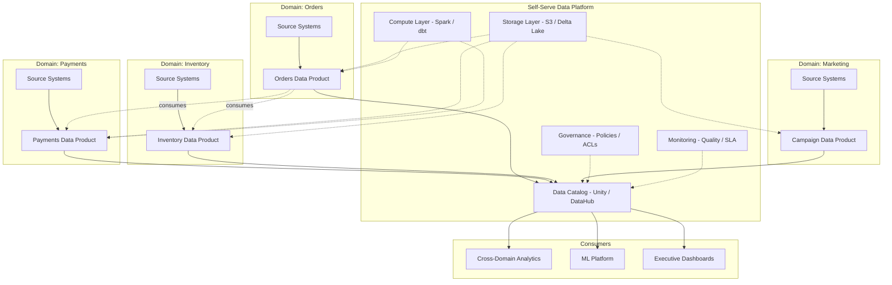
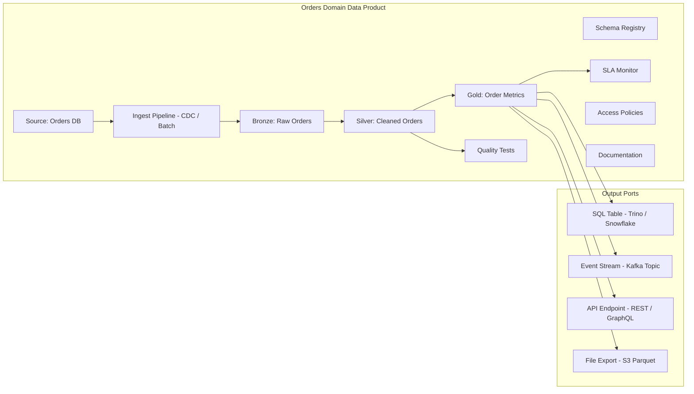
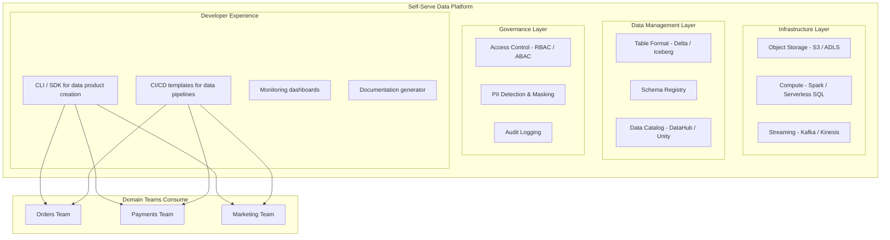
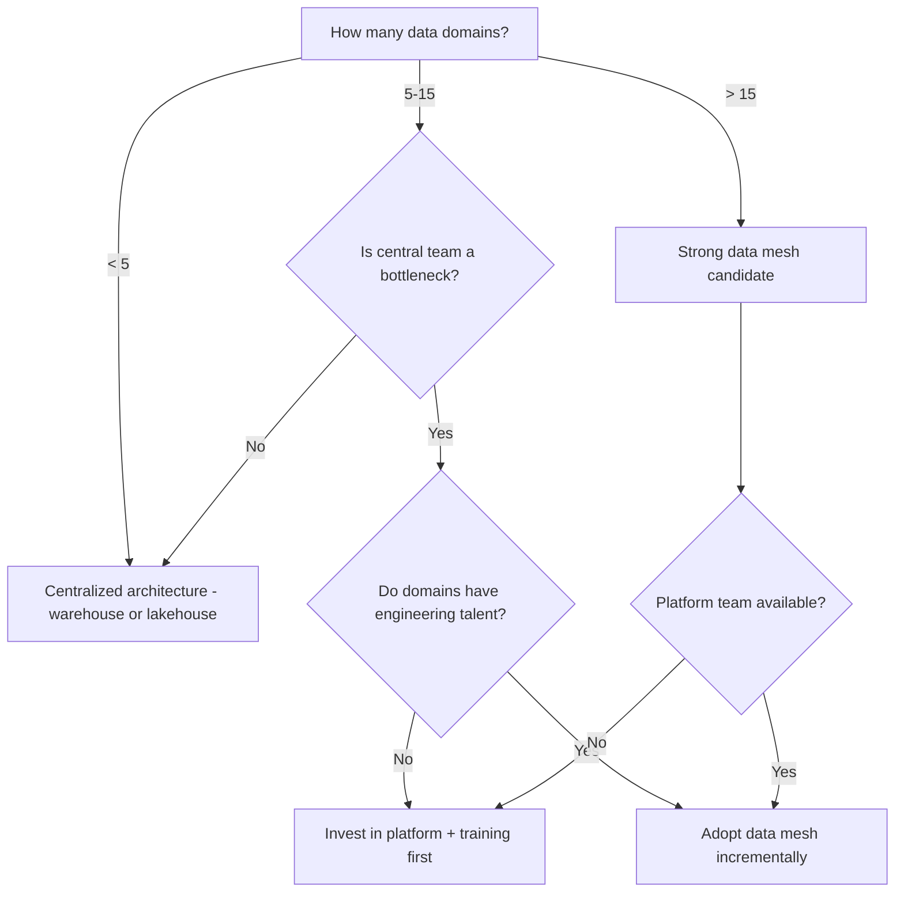

# Data Mesh

## Table of Contents
- [What Is Data Mesh?](#what-is-data-mesh)
- [The Four Principles](#the-four-principles)
- [Data Mesh Architecture](#data-mesh-architecture)
- [Data Products](#data-products)
- [Self-Serve Data Platform](#self-serve-data-platform)
- [Federated Computational Governance](#federated-computational-governance)
- [Data Mesh vs Data Lake vs Data Warehouse](#data-mesh-vs-data-lake-vs-data-warehouse)
- [Challenges and Pitfalls](#challenges-and-pitfalls)
- [Real-World Implementations](#real-world-implementations)
- [When to Use Data Mesh](#when-to-use-data-mesh)
- [Interview Questions](#interview-questions)

---

## What Is Data Mesh?

Data Mesh is a **decentralized data architecture** proposed by Zhamak Dehghani (ThoughtWorks, 2019). It treats data as a product owned by domain teams rather than a shared resource managed by a central data team.

### The Problem It Solves

In centralized architectures (data lake, data warehouse), a single data engineering team becomes the bottleneck:

```
Traditional Centralized Model:
  - 50 domain teams produce data
  - 1 data engineering team must ingest, clean, model, and serve ALL of it
  - Result: 6-month backlog, stale data, frustrated stakeholders
```

Data Mesh inverts the ownership model: each domain team that generates data also owns its transformation and publication as a data product.

### Core Idea

```
CENTRALIZED:  Domains --> Raw Data --> Central Team --> Warehouse --> Consumers
DATA MESH:    Domain A owns + publishes Data Product A ----+
              Domain B owns + publishes Data Product B ----|---> Consumers
              Domain C owns + publishes Data Product C ----+
```

---

## The Four Principles

### 1. Domain-Oriented Data Ownership

Each business domain (payments, orders, inventory, marketing) owns the full lifecycle of its analytical data: ingestion, transformation, quality, and serving.

**Key shift:** Data engineers are embedded in domain teams, not centralized. The payments team does not hand off raw payment data to a central team; they produce a curated `payments` data product that others consume.

```
Before Data Mesh:
  Payments Team --> raw events --> Central Data Team --> payments_fact table

After Data Mesh:
  Payments Team --> raw events --> Payments Team builds + owns payments data product
```

### 2. Data as a Product

Each domain publishes its data following product thinking:

| Product Attribute | Data Equivalent |
|-------------------|-----------------|
| **Discoverable** | Registered in a data catalog with description and tags |
| **Addressable** | Unique identifier/URI (e.g., `payments.transactions.v2`) |
| **Trustworthy** | SLA for freshness, completeness, accuracy |
| **Self-describing** | Schema, documentation, example queries |
| **Interoperable** | Standard formats (Parquet, Avro), standard access (SQL, API) |
| **Secure** | Access control, PII classification, encryption |
| **Versioned** | Breaking changes require a new version; old versions deprecated gracefully |

### 3. Self-Serve Data Platform

A platform team provides infrastructure abstractions so domain teams can build data products without becoming infrastructure experts.

The platform provides:
- Storage provisioning (create a Delta Lake table with one command)
- Compute provisioning (spin up a Spark cluster or dbt environment)
- Data catalog registration
- Schema registry
- Monitoring and alerting
- Access control and compliance automation

### 4. Federated Computational Governance

Global standards are defined centrally but enforced automatically by the platform. Domain teams have local autonomy within those guardrails.

| Centrally Defined | Locally Owned |
|-------------------|---------------|
| Naming conventions | Domain-specific business logic |
| PII classification rules | Which columns contain PII |
| SLA thresholds | How to meet the SLA |
| Interoperability standards (format, protocol) | Internal data modeling choices |
| Access policy framework | Who gets access to their data products |

---

## Data Mesh Architecture

### High-Level Domain Interaction



### Domain Data Product Internal Architecture



---

## Data Products

A data product is the atomic unit of data architecture in a mesh. It is a self-contained deliverable with clear ownership, contracts, and quality guarantees.

### Data Product Specification

```yaml
# data-product.yaml -- metadata for the Orders data product
apiVersion: datamesh/v1
kind: DataProduct
metadata:
  name: orders.transactions
  version: "2.1"
  domain: orders
  owner: orders-team@company.com
  tags: ["revenue", "transactions", "core"]

spec:
  description: |
    Curated order transactions with customer and product enrichment.
    Updated every 15 minutes via CDC from the orders OLTP database.

  schema:
    format: delta
    location: s3://mesh/orders/transactions/v2/
    columns:
      - name: order_id
        type: BIGINT
        description: Unique order identifier
        pii: false
      - name: customer_id
        type: BIGINT
        description: FK to customers domain
        pii: false
      - name: customer_email
        type: STRING
        description: Customer email (masked for non-privileged consumers)
        pii: true
      - name: order_date
        type: DATE
        description: Date the order was placed
      - name: total_amount
        type: DECIMAL(12,2)
        description: Total order value after discounts
      - name: status
        type: STRING
        description: "PENDING | COMPLETED | CANCELLED | REFUNDED"

  sla:
    freshness: "15 minutes"
    completeness: "99.9%"
    availability: "99.95%"
    latency_p99: "< 5 seconds for queries under 1M rows"

  access:
    default_policy: deny
    roles:
      - role: analytics-read
        permissions: [SELECT]
        columns: [order_id, customer_id, order_date, total_amount, status]
      - role: marketing-read
        permissions: [SELECT]
        columns: [order_id, customer_id, order_date, total_amount, status]
        note: "customer_email excluded due to PII"
      - role: orders-admin
        permissions: [SELECT, INSERT, UPDATE]
        columns: ALL

  output_ports:
    - type: sql
      engine: trino
      catalog: mesh
      schema: orders
      table: transactions_v2
    - type: kafka
      topic: orders.transactions.v2
      format: avro
    - type: s3
      path: s3://mesh/orders/transactions/v2/
      format: parquet
      partitioned_by: [order_date]

  quality:
    tests:
      - column: order_id
        check: unique
      - column: order_id
        check: not_null
      - column: total_amount
        check: "> 0"
      - column: status
        check: in_set
        values: [PENDING, COMPLETED, CANCELLED, REFUNDED]
    monitoring:
      tool: monte_carlo
      alert_channel: "#orders-data-alerts"

  lineage:
    sources:
      - orders-oltp.public.orders (CDC via Debezium)
      - orders-oltp.public.order_items (CDC via Debezium)
      - customers.profiles.v1 (cross-domain dependency)
```

---

## Self-Serve Data Platform

The platform team builds infrastructure that domain teams consume as a service. The goal is to minimize the time and skill needed for a domain team to go from raw data to published data product.

### What the Platform Provides



### Platform Interaction Example

```bash
# Domain team creates a new data product using platform CLI
mesh init data-product \
  --domain orders \
  --name transactions \
  --version 2 \
  --format delta \
  --partitioned-by order_date

# Platform provisions:
# - S3 bucket path: s3://mesh/orders/transactions/v2/
# - Delta table registered in Unity Catalog
# - Schema registry entry
# - Monitoring dashboard
# - CI/CD pipeline template
# - Access policy skeleton

# Domain team deploys their pipeline
mesh deploy --env production

# Platform automatically:
# - Registers in data catalog
# - Applies governance policies
# - Starts SLA monitoring
# - Enables data quality checks
```

---

## Federated Computational Governance

Governance in a mesh is not a central team reviewing every change. Instead, the platform encodes policies as automated checks.

### How It Works

| Aspect | Central (Platform Team) | Local (Domain Team) |
|--------|------------------------|---------------------|
| **Define** PII classification rules | X | |
| **Tag** columns as PII | | X |
| **Enforce** PII masking at query time | X (automated) | |
| **Define** naming conventions | X | |
| **Apply** naming conventions | | X |
| **Validate** naming on CI/CD | X (automated) | |
| **Define** SLA thresholds | X | |
| **Monitor** SLA compliance | X (automated) | |
| **Fix** SLA breaches | | X |

### Policy-as-Code Example

```python
# governance/policies/pii_policy.py
# Runs automatically on every data product deployment

def validate_pii_compliance(data_product_spec):
    """Ensure all PII columns have masking configured."""
    violations = []
    for column in data_product_spec["schema"]["columns"]:
        if column.get("pii") is True:
            # Check that no public-facing output port exposes raw PII
            for port in data_product_spec["output_ports"]:
                if port.get("pii_masking") is None:
                    violations.append(
                        f"Column '{column['name']}' is PII but output port "
                        f"'{port['type']}' has no masking configured."
                    )
    return violations
```

---

## Data Mesh vs Data Lake vs Data Warehouse

| Criteria | Data Warehouse | Data Lake | Data Mesh |
|----------|---------------|-----------|-----------|
| **Architecture** | Centralized | Centralized | Decentralized |
| **Data ownership** | Central data team | Central data team | Domain teams |
| **Governance** | Central, manual | Weak or absent | Federated, automated |
| **Scaling bottleneck** | Central team capacity | Central team capacity | Platform maturity |
| **Data format** | Structured (SQL) | Any format | Any format (with contracts) |
| **Time to new data product** | Weeks-months (backlog) | Weeks (ingestion) | Days (domain self-serve) |
| **Cross-domain queries** | Easy (single warehouse) | Moderate (catalog needed) | Harder (federated queries) |
| **Organizational fit** | Small-medium data teams | Medium teams, ML-heavy | Large orgs, many domains |
| **Technology** | Snowflake, BigQuery | S3 + Spark | Platform + domain toolchains |
| **Primary risk** | Bottleneck on central team | Data swamp | Organizational complexity |

---

## Challenges and Pitfalls

### 1. Organizational Change Is the Hardest Part

Data mesh is primarily an organizational pattern, not a technology pattern. It requires domain teams to take ownership of data, which means:
- Hiring data engineers into product teams (or training existing engineers)
- Changing incentive structures so domain teams are measured on data product quality
- Product managers must prioritize data product work alongside features

### 2. Data Duplication

When multiple domains model similar concepts (e.g., "customer"), there is a risk of inconsistent definitions. Mitigation: designate a canonical "customer" data product owned by one domain, and have others reference it.

### 3. Cross-Domain Queries Are Harder

In a centralized warehouse, joining orders with payments is trivial -- both are in the same database. In a mesh, data products may live in different storage systems. Solutions:
- Federated query engines (Trino, Starburst, Databricks Unity Catalog)
- Materialized cross-domain views maintained by a shared analytics domain
- Event-driven denormalization (each domain enriches its data with needed foreign data)

### 4. Platform Team Must Be World-Class

The self-serve platform is the linchpin. If it is unreliable, slow, or hard to use, domain teams will build their own infrastructure, creating chaos.

### 5. Governance Drift

Without strong automated enforcement, domains drift from standards over time. Every governance rule must be encoded as a CI/CD check or runtime policy, not a wiki page.

### 6. Discovery and Interoperability

With dozens of domains publishing data products, finding the right data becomes critical. The data catalog must be excellent, with search, lineage, and usage analytics.

---

## Real-World Implementations

### Zalando

Europe's largest online fashion platform adopted data mesh in 2020.
- **Scale:** 200+ domain teams, thousands of data products
- **Platform:** Built on AWS (S3, Glue, Athena, Lake Formation)
- **Key learning:** Started with a small number of pilot domains and expanded gradually; platform maturity was critical before scaling adoption

### Netflix

Netflix does not use the "data mesh" label but embodies many of its principles.
- **Domain ownership:** Each team (content, streaming, payments) owns their data pipelines
- **Shared platform:** Internal data platform provides storage (S3/Iceberg), compute (Spark), and catalog (Metacat)
- **Data products:** Published as Iceberg tables with documented schemas and SLAs

### ThoughtWorks

As the organization where Zhamak Dehghani developed the concept, ThoughtWorks has consulted on dozens of data mesh implementations.
- **Common pattern:** Start with 2-3 high-value domains, build the platform incrementally, iterate on governance

### JPMorgan Chase

Adopted data mesh principles for regulatory reporting.
- **Motivation:** Regulatory data was spread across hundreds of systems with no clear ownership
- **Approach:** Each business line (investment banking, retail, asset management) owns its regulatory data products
- **Governance:** Federated policies for data lineage, PII, and retention

---

## When to Use Data Mesh

### Strong Indicators (Use Data Mesh)

- Organization has **10+ distinct data domains** producing analytical data
- Central data team is a **bottleneck** with a months-long backlog
- Domain teams already have **engineering talent** capable of owning pipelines
- Data ownership is **unclear** -- nobody knows who is responsible for data quality
- Organization is adopting **microservices** and wants data architecture to match
- Regulatory requirements demand **clear data lineage** and ownership per domain

### Counter-Indicators (Do NOT Use Data Mesh)

- **Small team** (< 20 engineers total) -- overhead of mesh exceeds its value
- **Single domain** -- no decomposition needed
- **Simple analytics** -- a centralized warehouse with dbt handles it fine
- **No platform team** -- building the self-serve platform requires significant investment
- **Immature data culture** -- teams are not ready to own data quality
- **Low data literacy** -- domain teams lack SQL/pipeline skills and cannot be trained quickly

### Decision Matrix



---

## Interview Questions

### Q1: Explain data mesh in one paragraph to a non-technical executive.

**Answer:** Data mesh is an organizational approach to managing data at scale. Instead of funneling all company data through a single central team that becomes a bottleneck, each business domain (payments, orders, marketing) takes ownership of producing and maintaining its own high-quality data. A shared technology platform makes this easy, and company-wide standards ensure data from different domains works well together. The result is faster time to insight because domain experts -- who understand the data best -- are the ones preparing it for analysis.

### Q2: What is the difference between a "data product" and a "dataset"?

**Answer:** A dataset is a file or table -- it has no inherent quality guarantees, documentation, or ownership. A data product is a dataset wrapped in product discipline: it has an owner, an SLA (freshness, completeness, availability), documentation, a versioned schema, access controls, quality tests, and discoverability through a catalog. The same underlying data becomes a product when it is treated as something that serves consumers, with accountability for its quality.

### Q3: How do you handle cross-domain joins in a data mesh?

**Answer:** Three approaches: (1) **Federated query engine** -- tools like Trino or Databricks Unity Catalog can query across data products in different storage systems, though performance may be lower than a single warehouse. (2) **Consumer-side aggregation domain** -- create a dedicated analytics domain that consumes multiple data products and builds cross-domain views (e.g., a "customer 360" domain that joins orders, payments, and support data). (3) **Event-driven enrichment** -- domains consume relevant events from other domains and denormalize the data they need into their own data product, trading some duplication for query simplicity and performance.

### Q4: A VP of Engineering asks: "We have 8 engineers, 3 data sources, and a Snowflake warehouse. Should we adopt data mesh?" How do you respond?

**Answer:** No. Data mesh introduces organizational and infrastructure overhead that is justified only at scale. With 8 engineers and 3 data sources, a centralized approach (Fivetran into Snowflake, dbt for transformations, one analyst/engineer owning the pipeline) is simpler, faster, and cheaper. Data mesh starts making sense when you have 10+ domains, a central data team that is a bottleneck, and enough engineering talent in domain teams to own their data. Adopting mesh prematurely would create unnecessary complexity and slow the team down.

### Q5: How does data mesh relate to microservices architecture?

**Answer:** Data mesh applies the same decomposition principles that microservices apply to application architecture. In microservices, each service owns its operational data (database-per-service). Data mesh extends this to analytical data: each domain owns not just its transactional database but also the analytical data products derived from it. The alignment is natural -- the team that builds the orders microservice already understands orders data intimately, so they are the best team to produce the orders analytics data product. The self-serve data platform in a mesh is analogous to the internal developer platform (IDP) in a microservices architecture.

### Q6: What happens when a data mesh data product has a breaking schema change?

**Answer:** The data product must follow semantic versioning. A breaking change (removing a column, changing a type) requires publishing a new version (e.g., `orders.transactions.v3`) while keeping the old version (`v2`) running for a deprecation period. During that period, consumers migrate to the new version. The platform enforces this by: (1) running compatibility checks on schema changes during CI/CD (using the schema registry), (2) alerting downstream consumers when a new version is published, (3) automatically deprecating old versions after the announced sunset date. This is the same contract pattern used in API versioning for microservices.

### Q7: How do you measure the success of a data mesh adoption?

**Answer:** Five metrics: (1) **Time to data product** -- how long it takes a domain team to go from raw data to published, documented data product (target: days, not months). (2) **Data product usage** -- how many consumers are actively querying each data product (healthy mesh has broad cross-domain consumption). (3) **SLA compliance** -- percentage of data products meeting their freshness, completeness, and availability SLAs. (4) **Central team bottleneck reduction** -- measure the backlog size of the central/platform team; it should shrink. (5) **Data quality incidents** -- the rate of data quality issues reported by consumers; this should decrease as domain experts own their data.
