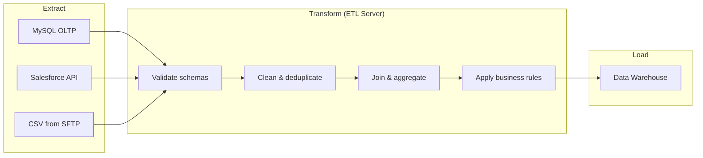
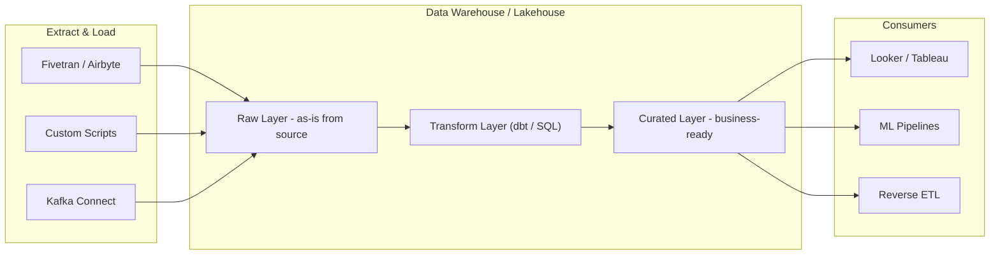
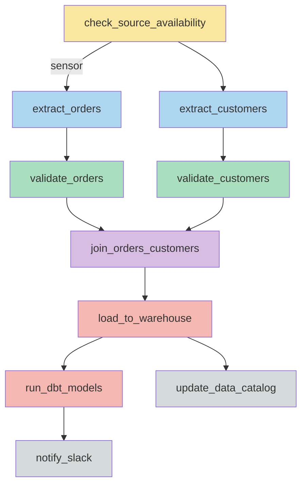
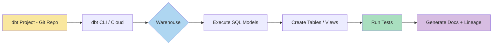
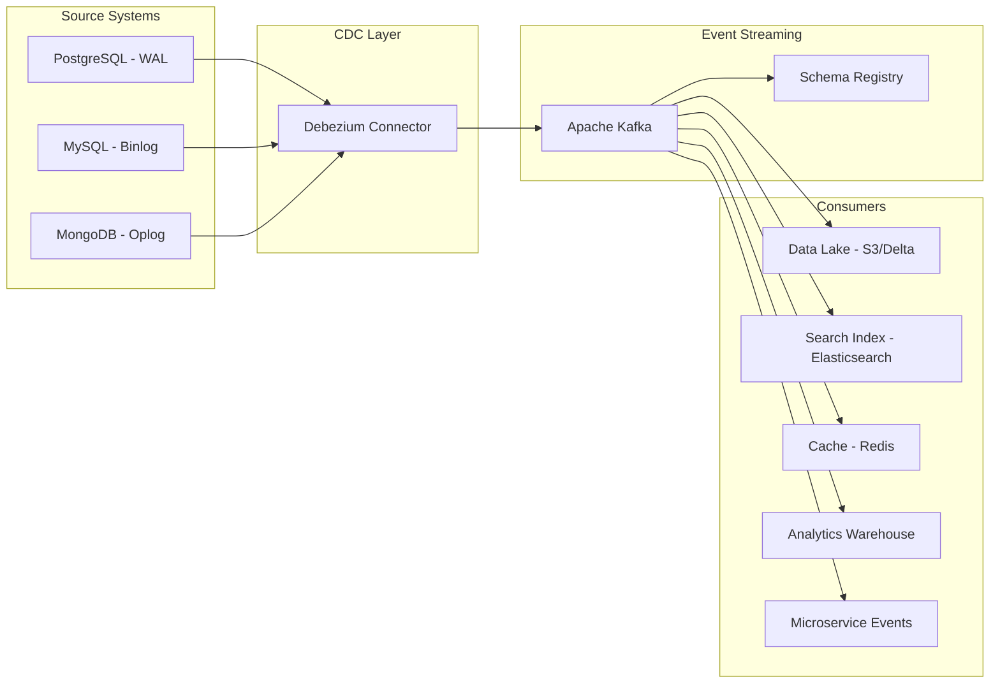
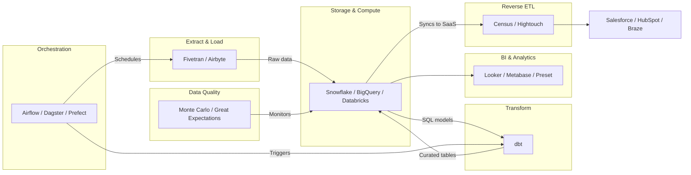

# ETL, ELT, and Data Pipelines

## Table of Contents
- [ETL: Extract, Transform, Load](#etl-extract-transform-load)
- [ELT: Extract, Load, Transform](#elt-extract-load-transform)
- [ETL vs ELT Comparison](#etl-vs-elt-comparison)
- [Apache Airflow](#apache-airflow)
- [dbt: Data Build Tool](#dbt-data-build-tool)
- [CDC: Change Data Capture](#cdc-change-data-capture)
- [Data Quality](#data-quality)
- [Modern Data Stack](#modern-data-stack)
- [Interview Questions](#interview-questions)

---

## ETL: Extract, Transform, Load

The traditional approach: data is extracted from sources, transformed in an intermediate processing layer, and then loaded into the target warehouse in its final form.

### Architecture



### Key Characteristics

| Aspect | Detail |
|--------|--------|
| **Where transformation happens** | On a dedicated ETL server or Spark cluster, before the warehouse |
| **Data in warehouse** | Already clean, structured, aggregated |
| **Raw data preserved?** | Typically no -- only transformed data lands in the warehouse |
| **Compute cost** | Paid for external ETL infrastructure |
| **Latency** | Higher -- batch-oriented, runs on schedule (hourly/daily) |

### Traditional ETL Tools

| Tool | Type | Notes |
|------|------|-------|
| **Apache Airflow** | Orchestrator | DAG-based scheduling, not a transformation engine itself |
| **Informatica** | Enterprise ETL | GUI-based, heavy enterprise adoption |
| **Talend** | Open-source ETL | Java-based, visual pipeline builder |
| **SSIS** | Microsoft ETL | SQL Server Integration Services, tight SQL Server integration |
| **Apache Spark** | Processing engine | Distributed transforms at scale |

### ETL Example: Spark Pipeline

```python
from pyspark.sql import SparkSession
from pyspark.sql.functions import col, upper, trim, when

spark = SparkSession.builder.appName("etl_orders").getOrCreate()

# EXTRACT: Read from source
raw_orders = spark.read.jdbc(
    url="jdbc:mysql://oltp-db:3306/production",
    table="orders",
    properties={"user": "etl_user", "password": "***"}
)

# TRANSFORM: Clean and enrich
transformed = (
    raw_orders
    .dropDuplicates(["order_id"])
    .filter(col("total_amount") > 0)
    .withColumn("status", upper(trim(col("status"))))
    .withColumn("order_size",
        when(col("total_amount") > 500, "large")
        .when(col("total_amount") > 100, "medium")
        .otherwise("small")
    )
)

# LOAD: Write to warehouse
transformed.write \
    .mode("append") \
    .format("parquet") \
    .saveAsTable("warehouse.cleaned_orders")
```

---

## ELT: Extract, Load, Transform

The modern approach: data is extracted from sources and loaded raw into the warehouse or lakehouse first, then transformed in-place using the warehouse's own compute engine.

### Architecture



### Why ELT Is Winning

1. **Warehouse compute is cheap and elastic.** Snowflake, BigQuery, and Redshift can scale compute independently. Transforming 1TB in BigQuery costs ~$5.
2. **Raw data is preserved.** If business logic changes, you re-transform from raw data instead of re-extracting from source systems.
3. **SQL-native transforms.** Analysts who know SQL can own transformations (via dbt) without needing Spark or Java skills.
4. **Faster iteration.** Change a dbt model, run `dbt build`, and the new table materializes in minutes.
5. **Separation of concerns.** Ingestion tools (Fivetran, Airbyte) handle extraction; dbt handles transformation. Each does one thing well.

### ELT Tools

| Tool | Role | Notes |
|------|------|-------|
| **Fivetran** | Managed extraction + load | 300+ connectors, zero maintenance |
| **Airbyte** | Open-source extraction + load | Self-hosted or cloud, growing connector catalog |
| **dbt** | SQL transformation | Version-controlled models, tests, documentation |
| **Snowflake SQL** | In-warehouse transform | Tasks, streams, stored procedures |
| **BigQuery SQL** | In-warehouse transform | Scheduled queries, BQML for ML |

---

## ETL vs ELT Comparison

| Criteria | ETL | ELT |
|----------|-----|-----|
| **Transform location** | External server / Spark cluster | Inside the warehouse |
| **Raw data preserved?** | Usually no | Yes (loaded first, then transformed) |
| **Compute cost model** | Pay for ETL infrastructure | Pay for warehouse compute |
| **Latency** | Higher (batch on schedule) | Lower (transform on demand) |
| **Flexibility** | Low -- must re-extract to change logic | High -- re-transform from raw layer |
| **Skill required** | Data engineers (Python, Spark, Java) | Analysts (SQL, dbt) |
| **Data volume sweet spot** | Any volume | Large volumes (leverages warehouse MPP) |
| **Schema changes** | Expensive -- pipeline rewrites | Cheap -- change SQL model |
| **Testing** | Custom test frameworks | Built into dbt (schema tests, data tests) |
| **Auditability** | Requires custom logging | Raw data always available for re-processing |
| **Modern stack fit** | Legacy / on-premises | Cloud-native |
| **Examples** | Informatica + Oracle DW | Fivetran + Snowflake + dbt |

---

## Apache Airflow

Apache Airflow is a workflow orchestration platform that programmatically defines, schedules, and monitors data pipelines as **Directed Acyclic Graphs (DAGs)**.

### Core Concepts

| Concept | Description |
|---------|-------------|
| **DAG** | A collection of tasks with dependency relationships, no cycles allowed |
| **Task** | A single unit of work (run a script, execute SQL, call an API) |
| **Operator** | Template for a task type (PythonOperator, BashOperator, etc.) |
| **Sensor** | Special operator that waits for a condition before proceeding |
| **Hook** | Connection interface to external systems (PostgresHook, S3Hook) |
| **XCom** | Cross-communication: pass small data between tasks |
| **Executor** | How tasks run (LocalExecutor, CeleryExecutor, KubernetesExecutor) |
| **Data Interval** | The time period a DAG run covers (not when it runs, but what data it processes) |

### DAG Task Dependencies



### Code Example: Complete DAG

```python
from datetime import datetime, timedelta
from airflow import DAG
from airflow.operators.python import PythonOperator
from airflow.operators.bash import BashOperator
from airflow.providers.postgres.operators.postgres import PostgresOperator
from airflow.sensors.s3_key_sensor import S3KeySensor
from airflow.utils.task_group import TaskGroup

default_args = {
    "owner": "data-engineering",
    "depends_on_past": False,
    "email_on_failure": True,
    "email": ["data-alerts@company.com"],
    "retries": 2,
    "retry_delay": timedelta(minutes=5),
}

with DAG(
    dag_id="daily_sales_pipeline",
    default_args=default_args,
    description="Extract, validate, and load daily sales data",
    schedule="0 6 * * *",          # Run at 06:00 UTC daily
    start_date=datetime(2025, 1, 1),
    catchup=False,                  # Don't backfill missed runs
    max_active_runs=1,              # Only one run at a time
    tags=["sales", "production"],
) as dag:

    # SENSOR: Wait for source file to appear on S3
    wait_for_file = S3KeySensor(
        task_id="wait_for_sales_file",
        bucket_name="raw-data-landing",
        bucket_key="sales/{{ ds }}/sales_export.csv",
        aws_conn_id="aws_default",
        poke_interval=300,          # Check every 5 minutes
        timeout=3600,               # Fail after 1 hour
        mode="reschedule",          # Free up worker slot while waiting
    )

    # EXTRACT: Copy raw file to processing area
    def extract_sales(**context):
        """Download and validate raw sales file."""
        from airflow.providers.amazon.aws.hooks.s3 import S3Hook
        import pandas as pd

        ds = context["ds"]
        s3 = S3Hook(aws_conn_id="aws_default")
        local_path = f"/tmp/sales_{ds}.csv"

        s3.download_file(
            key=f"sales/{ds}/sales_export.csv",
            bucket_name="raw-data-landing",
            local_path=local_path,
        )

        # Basic validation
        df = pd.read_csv(local_path)
        row_count = len(df)
        if row_count == 0:
            raise ValueError(f"Empty sales file for {ds}")

        context["ti"].xcom_push(key="row_count", value=row_count)
        return local_path

    extract = PythonOperator(
        task_id="extract_sales",
        python_callable=extract_sales,
    )

    # TRANSFORM: SQL-based cleaning in staging schema
    clean_data = PostgresOperator(
        task_id="clean_sales_data",
        postgres_conn_id="warehouse",
        sql="""
            INSERT INTO staging.cleaned_sales
            SELECT DISTINCT
                CAST(order_id AS BIGINT),
                CAST(order_date AS DATE),
                CAST(amount AS DECIMAL(12,2)),
                UPPER(TRIM(status))
            FROM staging.raw_sales
            WHERE order_id IS NOT NULL
              AND amount > 0
              AND order_date = '{{ ds }}';
        """,
    )

    # LOAD: Move to production schema
    load_to_prod = PostgresOperator(
        task_id="load_to_production",
        postgres_conn_id="warehouse",
        sql="""
            INSERT INTO production.fact_sales
            SELECT * FROM staging.cleaned_sales
            WHERE order_date = '{{ ds }}'
            ON CONFLICT (order_id) DO UPDATE
            SET amount = EXCLUDED.amount,
                status = EXCLUDED.status;
        """,
    )

    # POST-LOAD: Run dbt and notify
    run_dbt = BashOperator(
        task_id="run_dbt_models",
        bash_command="cd /opt/dbt/project && dbt run --select tag:sales",
    )

    notify = BashOperator(
        task_id="notify_completion",
        bash_command=(
            'curl -X POST "$SLACK_WEBHOOK" '
            '-d \'{"text": "Sales pipeline complete for {{ ds }}"}\''
        ),
    )

    # DEFINE DEPENDENCIES
    wait_for_file >> extract >> clean_data >> load_to_prod >> run_dbt >> notify
```

### Key Airflow Patterns

| Pattern | Description |
|---------|-------------|
| **Idempotency** | Running the same DAG run twice produces the same result (use `ON CONFLICT`, partition overwrites) |
| **Data interval** | `{{ ds }}` is the start of the data interval, not the execution time |
| **Reschedule mode** | Sensors free up worker slots while waiting, unlike `poke` mode |
| **Task groups** | Organize related tasks visually without SubDAGs |
| **Dynamic tasks** | Generate tasks from config/database at DAG parse time |

---

## dbt: Data Build Tool

dbt is a SQL-first transformation framework that brings software engineering practices (version control, testing, documentation, CI/CD) to analytics.

### How dbt Works



### Core Concepts

**Models:** SQL SELECT statements that dbt materializes as tables or views.

```sql
-- models/staging/stg_orders.sql
-- Materializes as a view by default
{{ config(materialized='view') }}

SELECT
    id              AS order_id,
    user_id         AS customer_id,
    created_at      AS order_date,
    status,
    amount          AS total_amount
FROM {{ source('raw', 'orders') }}
WHERE id IS NOT NULL
```

**ref() Macro:** Declares dependencies between models. dbt builds a DAG from these references.

```sql
-- models/marts/fct_revenue.sql
{{ config(materialized='table') }}

SELECT
    o.order_date,
    c.customer_segment,
    p.product_category,
    SUM(o.total_amount)                 AS gross_revenue,
    COUNT(DISTINCT o.order_id)          AS order_count,
    SUM(o.total_amount) / COUNT(DISTINCT o.order_id) AS avg_order_value
FROM {{ ref('stg_orders') }} o
JOIN {{ ref('stg_customers') }} c ON o.customer_id = c.customer_id
JOIN {{ ref('stg_order_items') }} oi ON o.order_id = oi.order_id
JOIN {{ ref('stg_products') }} p ON oi.product_id = p.product_id
WHERE o.status = 'COMPLETED'
GROUP BY 1, 2, 3
```

**Incremental Models:** Process only new/changed rows instead of full table rebuilds.

```sql
-- models/marts/fct_events.sql
{{ config(
    materialized='incremental',
    unique_key='event_id',
    incremental_strategy='merge'
) }}

SELECT
    event_id,
    user_id,
    event_type,
    event_timestamp,
    properties
FROM {{ ref('stg_events') }}


    -- On incremental runs, only process events after the max existing timestamp
    WHERE event_timestamp > (SELECT MAX(event_timestamp) FROM {{ this }})

```

**Tests:** Validate data quality as part of the pipeline.

```yaml
# models/staging/schema.yml
version: 2

models:
  - name: stg_orders
    description: "Cleaned orders from raw source"
    columns:
      - name: order_id
        description: "Primary key"
        tests:
          - unique
          - not_null
      - name: status
        tests:
          - accepted_values:
              values: ['PENDING', 'COMPLETED', 'CANCELLED', 'REFUNDED']
      - name: total_amount
        tests:
          - not_null
          - dbt_utils.expression_is_true:
              expression: "> 0"
      - name: customer_id
        tests:
          - relationships:
              to: ref('stg_customers')
              field: customer_id
```

### dbt Commands

```bash
dbt run                          # Build all models
dbt run --select fct_revenue     # Build one model + its upstream dependencies
dbt test                         # Run all tests
dbt build                        # run + test in dependency order
dbt docs generate && dbt docs serve  # Generate and serve documentation site
dbt source freshness             # Check if source data is stale
```

---

## CDC: Change Data Capture

CDC captures row-level changes (INSERT, UPDATE, DELETE) from a source database and streams them to downstream systems, enabling near-real-time data replication without bulk extracts.

### How Debezium Works

Debezium reads the database's internal change log (MySQL binlog, PostgreSQL WAL, MongoDB oplog) and publishes each change as an event to Kafka.

### Architecture



### Debezium Change Event Structure

```json
{
  "before": {
    "order_id": 1001,
    "status": "PENDING",
    "amount": 299.99
  },
  "after": {
    "order_id": 1001,
    "status": "SHIPPED",
    "amount": 299.99
  },
  "source": {
    "connector": "postgresql",
    "db": "production",
    "table": "orders",
    "lsn": 234881124,
    "ts_ms": 1710500000000
  },
  "op": "u",
  "ts_ms": 1710500000123
}
```

- `op`: Operation type -- `c` (create), `u` (update), `d` (delete), `r` (read/snapshot)
- `before`: Row state before the change (null for inserts)
- `after`: Row state after the change (null for deletes)

### CDC Use Cases

| Use Case | Pattern |
|----------|---------|
| **Database replication** | Sync OLTP to warehouse without impacting source performance |
| **Cache invalidation** | Update Redis/Memcached when source data changes |
| **Search indexing** | Keep Elasticsearch in sync with source tables |
| **Event sourcing** | Derive event streams from existing databases |
| **Microservice sync** | Propagate changes across service boundaries |

### CDC Processing with Spark Structured Streaming

```python
# Read CDC events from Kafka
cdc_stream = (
    spark.readStream
    .format("kafka")
    .option("kafka.bootstrap.servers", "kafka:9092")
    .option("subscribe", "dbserver.public.orders")
    .load()
)

# Parse Debezium envelope and apply to Delta table
from pyspark.sql.functions import from_json, col
from pyspark.sql.types import StructType, StringType, LongType, DoubleType

payload_schema = StructType() \
    .add("before", StructType().add("order_id", LongType()).add("status", StringType())) \
    .add("after", StructType().add("order_id", LongType()).add("status", StringType()).add("amount", DoubleType())) \
    .add("op", StringType())

parsed = (
    cdc_stream
    .select(from_json(col("value").cast("string"), payload_schema).alias("data"))
    .select("data.after.*", "data.op")
)

# Write as MERGE into Delta Lake
def upsert_to_delta(batch_df, batch_id):
    from delta.tables import DeltaTable
    delta_table = DeltaTable.forPath(spark, "s3://lakehouse/orders")
    delta_table.alias("target").merge(
        batch_df.alias("source"),
        "target.order_id = source.order_id"
    ).whenMatchedUpdateAll() \
     .whenNotMatchedInsertAll() \
     .execute()

parsed.writeStream \
    .foreachBatch(upsert_to_delta) \
    .outputMode("update") \
    .option("checkpointLocation", "s3://checkpoints/orders_cdc") \
    .start()
```

---

## Data Quality

Data quality ensures that data is accurate, complete, consistent, and timely throughout the pipeline.

### Quality Dimensions

| Dimension | Check | Example |
|-----------|-------|---------|
| **Completeness** | Null rate per column | `order_id` should be 0% null |
| **Uniqueness** | Duplicate detection | `order_id` should be unique |
| **Validity** | Value range / format | `status` must be in known set |
| **Consistency** | Cross-table checks | Every `order.customer_id` exists in `customers` |
| **Freshness** | Data recency | Source table updated within last 4 hours |
| **Volume** | Row count anomalies | Today's count within 2 standard deviations of last 30 days |

### Tools Comparison

| Tool | Type | Approach |
|------|------|----------|
| **dbt tests** | Built into dbt | YAML-defined schema tests, custom SQL tests |
| **Great Expectations** | Standalone Python | Expectation suites, data docs, checkpoint-based validation |
| **Monte Carlo** | SaaS | ML-based anomaly detection, automated monitoring |
| **Soda** | Open-source + SaaS | YAML-based checks, integrated with Airflow |
| **Elementary** | dbt package | Anomaly detection inside dbt, Slack alerts |

### Great Expectations Example

```python
import great_expectations as gx

context = gx.get_context()

# Define expectations for the orders table
validator = context.sources.pandas_default.read_csv(
    "s3://lakehouse/silver/orders/2025-03-15.parquet"
)

validator.expect_column_values_to_not_be_null("order_id")
validator.expect_column_values_to_be_unique("order_id")
validator.expect_column_values_to_be_in_set(
    "status", ["PENDING", "COMPLETED", "CANCELLED", "REFUNDED"]
)
validator.expect_column_values_to_be_between("total_amount", min_value=0.01, max_value=1_000_000)
validator.expect_column_pair_values_a_to_be_greater_than_b(
    "shipped_date", "order_date", or_equal=True, ignore_row_if="either_value_is_missing"
)
validator.expect_table_row_count_to_be_between(min_value=1000, max_value=500_000)

results = validator.validate()
if not results.success:
    raise ValueError(f"Data quality check failed: {results.statistics}")
```

---

## Modern Data Stack

The modern data stack is a set of cloud-native, best-of-breed tools that each handle one layer of the data pipeline, connected via APIs and standard formats.

### Architecture



### Stack Layers Explained

| Layer | Function | Tools | Why Separate |
|-------|----------|-------|-------------|
| **Extract & Load** | Pull data from sources into warehouse | Fivetran, Airbyte, Stitch | Connector maintenance is a full-time job; let specialists handle it |
| **Storage & Compute** | Store and query data | Snowflake, BigQuery, Databricks | MPP engines with elastic compute |
| **Transform** | Business logic as SQL models | dbt | Version-controlled, testable, documentable |
| **BI & Analytics** | Dashboards and exploration | Looker, Metabase, Preset | Self-serve analytics for business users |
| **Orchestration** | Schedule and monitor pipelines | Airflow, Dagster, Prefect | Ensure tasks run in order, handle failures |
| **Data Quality** | Detect anomalies and enforce rules | Monte Carlo, Great Expectations | Catch issues before they reach dashboards |
| **Reverse ETL** | Push warehouse data back to SaaS tools | Census, Hightouch | Activate data in tools teams already use |

### End-to-End Flow Example

```
1. Fivetran syncs Stripe payments to Snowflake raw schema every 15 min
2. Airflow triggers dbt at 06:00 UTC
3. dbt builds staging models (stg_payments, stg_customers)
4. dbt builds mart models (fct_revenue, dim_customers)
5. dbt runs tests (unique, not_null, freshness)
6. Monte Carlo detects if row counts deviate from baseline
7. Looker dashboards refresh from curated tables
8. Census syncs customer segments back to HubSpot for marketing
```

---

## Interview Questions

### Q1: When would you choose ETL over ELT?

**Answer:** ETL is preferred when: (1) the target system has limited compute capacity and cannot handle heavy transformations (e.g., legacy on-prem databases), (2) data must be heavily scrubbed or masked for compliance before it can land in the warehouse (PII stripping before load), (3) the transformation requires logic that is difficult to express in SQL (complex ML feature engineering, image processing, NLP). In most modern cloud scenarios, ELT is the default because warehouse compute is elastic and raw data preservation is valuable.

### Q2: How do you make an Airflow DAG idempotent?

**Answer:** Idempotency means running the same DAG run multiple times produces identical results. Techniques: (1) Use partition overwrites instead of appends -- write to `year=2025/month=03/day=15` and overwrite if re-run. (2) Use MERGE/UPSERT (INSERT ON CONFLICT) instead of INSERT for loading. (3) Use the data interval (`{{ ds }}`) to scope all reads and writes to a specific time window. (4) Avoid side effects that cannot be reversed (e.g., sending emails on every retry -- gate notifications behind success checks). (5) Use task-level retries with exponential backoff so transient failures self-heal without duplicating data.

### Q3: Explain dbt incremental models. When would you NOT use them?

**Answer:** Incremental models process only new/changed rows by comparing against a high-water mark (e.g., `WHERE event_timestamp > max(existing_timestamp)`). This avoids full table scans on every run. You would NOT use incremental models when: (1) the source data is small enough that full rebuilds are fast and simple, (2) late-arriving data can update historical rows (incremental would miss these without a lookback window), (3) the transformation logic requires the full dataset (e.g., percentile calculations across all rows). A common pattern is to use a lookback window (`WHERE event_timestamp > max(existing) - INTERVAL 3 DAYS`) to catch late arrivals.

### Q4: What is the difference between Debezium CDC and batch extraction?

**Answer:** Batch extraction runs on a schedule (e.g., hourly), queries the source database with a filter (e.g., `WHERE updated_at > last_run`), and bulk-loads the results. This has three problems: (1) it puts load on the source OLTP database during extraction, (2) it misses deletes unless soft deletes are used, (3) latency is at least the batch interval. Debezium CDC reads the database's internal change log (binlog/WAL), so it (1) has zero impact on source query performance, (2) captures all operations including deletes, (3) achieves sub-second latency. The tradeoff is operational complexity -- running Kafka and Debezium connectors requires infrastructure expertise.

### Q5: Design a pipeline for a company that needs real-time fraud detection on payment data while also building daily analytics dashboards.

**Answer:** This requires a lambda-style architecture with two paths. **Real-time path:** Source payment database emits changes via Debezium into Kafka. A Flink or Spark Structured Streaming job consumes the CDC stream, enriches it with feature data from a low-latency store (Redis or DynamoDB), runs the ML fraud model, and writes predictions to an action service that can block suspicious transactions. **Batch path:** The same Kafka stream is also consumed by a sink connector that writes Parquet files to S3/Delta Lake (Bronze layer). An Airflow-orchestrated dbt pipeline transforms Bronze into Silver (cleaned payments) and Gold (daily revenue, fraud rate metrics). Looker reads from Gold tables. The key architectural decision is using Kafka as the single source of truth that feeds both paths, ensuring consistency.
