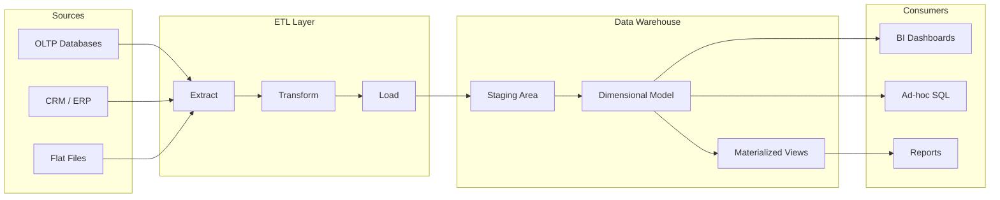
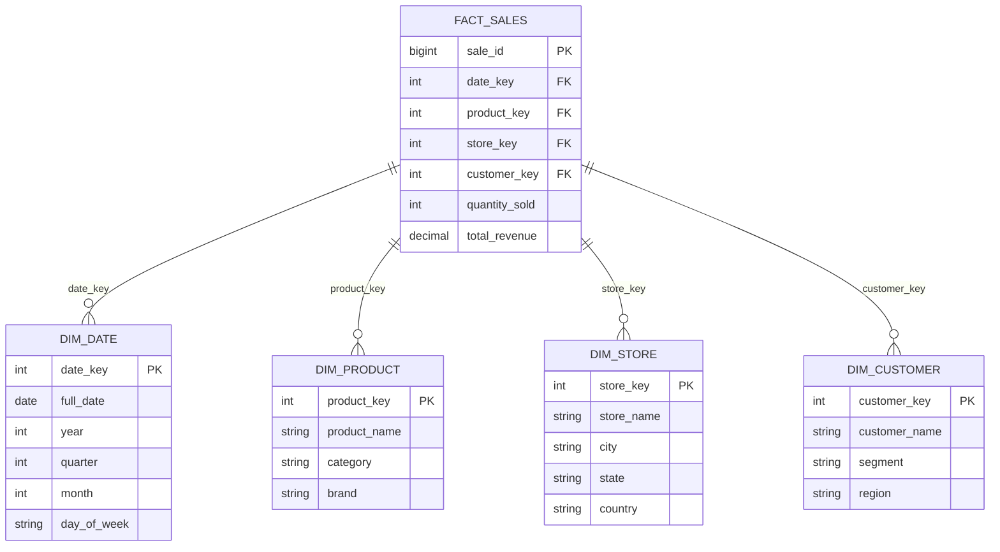
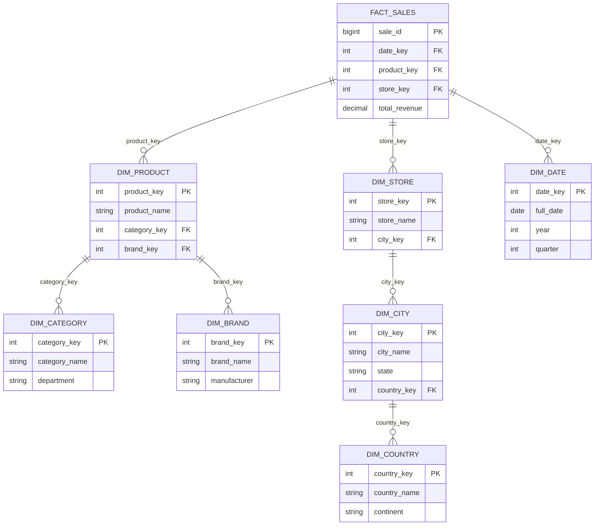
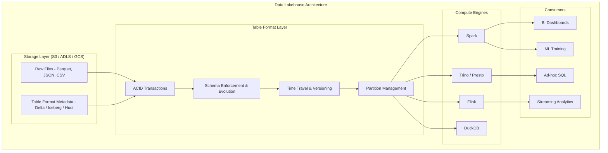
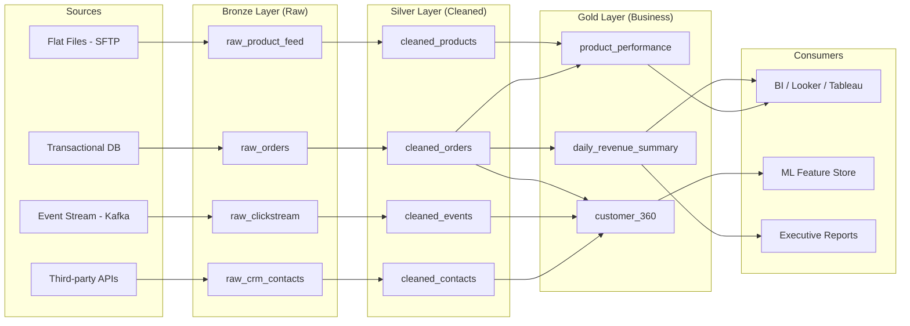
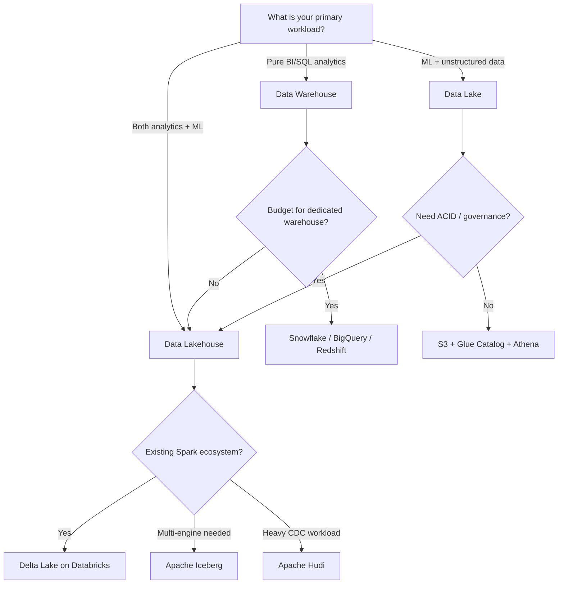

# Data Warehouse vs Data Lake vs Data Lakehouse

## Table of Contents
- [Data Warehouse](#data-warehouse)
- [Star Schema vs Snowflake Schema](#star-schema-vs-snowflake-schema)
- [Columnar Storage Deep Dive](#columnar-storage-deep-dive)
- [Data Lake](#data-lake)
- [Data Lakehouse](#data-lakehouse)
- [Delta Lake](#delta-lake)
- [Apache Iceberg](#apache-iceberg)
- [Medallion Architecture](#medallion-architecture)
- [Warehouse vs Lake vs Lakehouse Comparison](#warehouse-vs-lake-vs-lakehouse-comparison)
- [Interview Questions](#interview-questions)

---

## Data Warehouse

A **data warehouse** is a centralized repository of structured data, optimized for analytical queries (OLAP). Data is cleaned, transformed, and loaded with a predefined schema before it can be queried.

### Core Properties

| Property | Description |
|----------|-------------|
| **Schema-on-Write** | Schema must be defined before data is loaded |
| **Structured Data** | Relational tables with enforced types and constraints |
| **Optimized for Analytics** | Columnar storage, materialized views, query optimization |
| **ETL-dependent** | Data passes through Extract-Transform-Load before arrival |
| **Historical** | Stores historical snapshots for trend analysis |

### Architecture



### Key Technologies

| Technology | Vendor | Differentiator |
|-----------|--------|----------------|
| **Snowflake** | Snowflake Inc. | Separate compute/storage, auto-scaling, zero-copy clones |
| **BigQuery** | Google Cloud | Serverless, slot-based pricing, built-in ML (BQML) |
| **Redshift** | AWS | Tight S3 integration, Spectrum for external tables |
| **ClickHouse** | Open-source | Blazing fast OLAP, MergeTree engine, real-time inserts |
| **Synapse** | Microsoft Azure | Integrated with Azure ecosystem, dedicated + serverless pools |

### Fact Tables and Dimension Tables

**Fact tables** store measurable business events (transactions, clicks, orders). They contain foreign keys to dimension tables plus numeric measures.

**Dimension tables** store descriptive context (who, what, where, when). They enable slicing and filtering of facts.

```sql
-- Fact table: each row is a sale event
CREATE TABLE fact_sales (
    sale_id        BIGINT PRIMARY KEY,
    date_key       INT REFERENCES dim_date(date_key),
    product_key    INT REFERENCES dim_product(product_key),
    store_key      INT REFERENCES dim_store(store_key),
    customer_key   INT REFERENCES dim_customer(customer_key),
    quantity_sold  INT,
    unit_price     DECIMAL(10, 2),
    discount       DECIMAL(5, 2),
    total_revenue  DECIMAL(12, 2)
);

-- Dimension table: descriptive attributes for products
CREATE TABLE dim_product (
    product_key    INT PRIMARY KEY,
    product_name   VARCHAR(200),
    category       VARCHAR(100),
    subcategory    VARCHAR(100),
    brand          VARCHAR(100),
    unit_cost      DECIMAL(10, 2)
);

-- Analytical query: revenue by category and quarter
SELECT
    p.category,
    d.quarter,
    SUM(f.total_revenue) AS quarterly_revenue,
    COUNT(DISTINCT f.customer_key) AS unique_customers
FROM fact_sales f
JOIN dim_product p ON f.product_key = p.product_key
JOIN dim_date d ON f.date_key = d.date_key
WHERE d.year = 2025
GROUP BY p.category, d.quarter
ORDER BY d.quarter, quarterly_revenue DESC;
```

---

## Star Schema vs Snowflake Schema

### Star Schema

The fact table sits at the center, with denormalized dimension tables radiating outward like a star. Each dimension is a single table.



**Advantages:** Simpler queries (fewer joins), faster reads, easier for BI tools to consume.

**Disadvantage:** Data redundancy in dimension tables (e.g., "Electronics" repeated in every product row).

### Snowflake Schema

Dimension tables are normalized into sub-dimensions, reducing redundancy at the cost of more joins.



### Star vs Snowflake Comparison

| Criteria | Star Schema | Snowflake Schema |
|----------|-------------|------------------|
| Normalization | Denormalized dimensions | Normalized dimensions |
| Query complexity | Fewer joins, simpler SQL | More joins, complex SQL |
| Query performance | Faster (fewer joins) | Slower (more joins) |
| Storage efficiency | More redundancy | Less redundancy |
| ETL complexity | Simpler loads | More complex loads |
| BI tool compatibility | Excellent | Moderate |
| Maintenance | Easier | Harder |
| **When to use** | Most OLAP workloads | When storage cost or data integrity is critical |

> **Industry reality:** Star schema dominates in practice. Modern warehouses have cheap storage and expensive compute, so minimizing joins matters more than minimizing redundancy.

---

## Columnar Storage Deep Dive

### Why Analytical Queries Benefit from Columnar Storage

Traditional row-oriented databases (PostgreSQL, MySQL) store all columns of a row together on disk. Columnar databases (Redshift, BigQuery, ClickHouse) store each column separately.

```
ROW STORAGE (OLTP):
  Row 1: [id=1, name="Alice", city="NYC", revenue=500]
  Row 2: [id=2, name="Bob",   city="LA",  revenue=300]
  Row 3: [id=3, name="Carol", city="NYC", revenue=700]

COLUMNAR STORAGE (OLAP):
  id column:      [1, 2, 3]
  name column:    ["Alice", "Bob", "Carol"]
  city column:    ["NYC", "LA", "NYC"]
  revenue column: [500, 300, 700]
```

### Benefits for Analytics

1. **Read only needed columns:** `SELECT SUM(revenue) FROM sales` reads only the revenue column, skipping name, city, etc. On a table with 50 columns, this can be 50x less I/O.
2. **Better compression:** Same-type values compress dramatically. A column of city names might compress 10:1 with dictionary encoding.
3. **Vectorized execution:** CPUs process arrays of same-type values with SIMD instructions far faster than heterogeneous row tuples.
4. **Predicate pushdown:** Filters like `WHERE city = 'NYC'` are applied at the storage layer, skipping entire column chunks via min/max metadata.

### Compression Techniques in Columnar Stores

| Technique | How it works | Best for |
|-----------|-------------|----------|
| **Dictionary encoding** | Map repeated values to integers | Low-cardinality strings (city, country) |
| **Run-length encoding** | Store value + count of consecutive repeats | Sorted columns |
| **Delta encoding** | Store difference from previous value | Timestamps, sequential IDs |
| **Bit-packing** | Use minimum bits needed for value range | Small integers |

---

## Data Lake

A **data lake** is a centralized repository that stores data in its raw, native format at any scale. Unlike a warehouse, data does not need a predefined schema.

### Core Properties

| Property | Description |
|----------|-------------|
| **Schema-on-Read** | Schema is applied when data is read, not when stored |
| **Any format** | JSON, Parquet, Avro, CSV, images, logs, video |
| **Cheap storage** | Object storage (S3, GCS, ADLS) at ~$0.023/GB/month |
| **Massive scale** | Petabytes of data without upfront capacity planning |
| **Decoupled compute** | Query engines (Spark, Presto, Athena) run separately from storage |

### Storage Technologies

| Storage | Cloud | Key Feature |
|---------|-------|-------------|
| **Amazon S3** | AWS | De facto standard, extensive ecosystem |
| **Azure Data Lake Storage (ADLS)** | Azure | Hierarchical namespace, fine-grained ACLs |
| **Google Cloud Storage (GCS)** | GCP | Tight integration with BigQuery and Dataproc |
| **MinIO** | On-prem | S3-compatible, self-hosted |

### File Formats

| Format | Type | Schema | Splittable | Compression | Best For |
|--------|------|--------|-----------|-------------|----------|
| **Parquet** | Columnar | Embedded | Yes | Snappy, ZSTD | Analytics, large scans |
| **Avro** | Row-based | Embedded | Yes | Deflate, Snappy | Streaming, schema evolution |
| **ORC** | Columnar | Embedded | Yes | ZLIB, Snappy | Hive workloads |
| **JSON** | Row-based | None | Line-delimited | Gzip | APIs, logs |
| **CSV** | Row-based | None | Yes | Gzip | Legacy, interchange |

### The "Data Swamp" Problem

Without governance, a data lake degrades into a **data swamp**:

- **No catalog:** Nobody knows what data exists or where it lives
- **No schema enforcement:** Corrupt or malformed files silently accumulate
- **No access control:** Sensitive data (PII) mixed with public data
- **No lineage:** Cannot trace where data came from or how it was transformed
- **Stale data:** Files from abandoned projects never cleaned up

**Prevention strategies:**
1. Enforce a data catalog (AWS Glue Catalog, Apache Hive Metastore)
2. Standardize on Parquet/Avro over raw CSV/JSON
3. Implement folder naming conventions: `s3://lake/domain/entity/year=YYYY/month=MM/`
4. Apply IAM policies and column-level encryption
5. Automate data quality checks on ingest

---

## Data Lakehouse

A **data lakehouse** combines the low-cost, flexible storage of a data lake with the data management features of a data warehouse (ACID transactions, schema enforcement, time travel).

### Architecture



### Key Technologies

| Technology | Backing | Key Differentiator |
|-----------|---------|-------------------|
| **Delta Lake** | Databricks | Largest ecosystem, OPTIMIZE + Z-ordering, deep Spark integration |
| **Apache Iceberg** | Netflix (now Apache) | Hidden partitioning, partition evolution, multi-engine support |
| **Apache Hudi** | Uber (now Apache) | Upserts and incremental processing, record-level indexing |

---

## Delta Lake

Delta Lake adds a transactional metadata layer on top of Parquet files in object storage.

### How It Works

Every write operation creates a new entry in the `_delta_log/` directory (a JSON-based transaction log). Readers consult this log to determine the current state of the table.

```
s3://warehouse/sales/
  _delta_log/
    00000000000000000000.json   -- initial table creation
    00000000000000000001.json   -- first INSERT
    00000000000000000002.json   -- UPDATE operation
    00000000000000000010.checkpoint.parquet  -- checkpoint every 10 commits
  year=2024/
    part-00000-abc123.parquet
    part-00001-def456.parquet
  year=2025/
    part-00000-ghi789.parquet
```

### Key Features

**ACID Transactions:**
```sql
-- Concurrent writers are serialized via optimistic concurrency control
INSERT INTO delta.sales VALUES (1001, '2025-03-15', 299.99);

-- MERGE for upserts (CDC pattern)
MERGE INTO delta.sales AS target
USING staging_sales AS source
ON target.sale_id = source.sale_id
WHEN MATCHED THEN UPDATE SET *
WHEN NOT MATCHED THEN INSERT *;
```

**Time Travel:**
```sql
-- Query the table as it existed at a specific version
SELECT * FROM delta.sales VERSION AS OF 5;

-- Query the table as it existed at a specific timestamp
SELECT * FROM delta.sales TIMESTAMP AS OF '2025-01-15 10:00:00';

-- Restore a table to a previous version (undo bad writes)
RESTORE TABLE delta.sales TO VERSION AS OF 5;
```

**OPTIMIZE and Z-Ordering:**
```sql
-- Compact small files into larger ones (solves the small file problem)
OPTIMIZE delta.sales;

-- Z-order: co-locate related data for multi-dimensional range queries
OPTIMIZE delta.sales ZORDER BY (date, product_id);
-- Now queries filtering on date AND product_id skip most files
```

---

## Apache Iceberg

Iceberg is an open table format with standout features around partitioning and schema evolution.

### Hidden Partitioning

Unlike Hive-style partitioning where users must know the partition column and format, Iceberg partitions are transparent to queries.

```sql
-- Define partition transforms at table creation
CREATE TABLE orders (
    order_id    BIGINT,
    order_ts    TIMESTAMP,
    customer_id BIGINT,
    amount      DECIMAL(10, 2)
) USING iceberg
PARTITIONED BY (days(order_ts), bucket(16, customer_id));

-- Queries never reference partitions directly -- Iceberg applies them automatically
SELECT * FROM orders WHERE order_ts > '2025-01-01';
-- Iceberg prunes partitions based on days(order_ts) transform internally
```

### Partition Evolution

Change the partitioning strategy without rewriting existing data.

```sql
-- Original: partitioned by day
ALTER TABLE orders REPLACE PARTITION FIELD days(order_ts) WITH hours(order_ts);
-- New data uses hourly partitions; old data keeps daily partitions
-- Queries still work seamlessly across both schemes
```

### Schema Evolution

```sql
-- Add columns (existing data reads NULL for new columns)
ALTER TABLE orders ADD COLUMNS (
    shipping_method STRING,
    discount DECIMAL(5, 2)
);

-- Rename columns (uses column IDs, not names -- no data rewrite)
ALTER TABLE orders RENAME COLUMN amount TO total_amount;

-- Reorder columns
ALTER TABLE orders ALTER COLUMN discount AFTER total_amount;
```

---

## Medallion Architecture

The medallion (multi-hop) architecture organizes data in a lakehouse into three progressive quality layers.

### Layer Definitions

| Layer | Purpose | Data Quality | Schema | Typical Format |
|-------|---------|-------------|--------|---------------|
| **Bronze** | Raw ingestion, as-is from source | Untouched, may have duplicates/nulls | Schema-on-read or minimal | JSON, CSV, Parquet |
| **Silver** | Cleaned, validated, deduplicated | Enforced types, nulls handled, deduped | Schema enforced | Delta/Iceberg Parquet |
| **Gold** | Business-level aggregations | Curated, SLA-backed | Star/snowflake schema | Delta/Iceberg Parquet |

### Pipeline Flow



### Transformations at Each Layer

```sql
-- BRONZE: Raw ingest, preserve everything
CREATE TABLE bronze.raw_orders AS
SELECT
    *,
    current_timestamp() AS _ingested_at,
    input_file_name()   AS _source_file
FROM read_json('s3://landing/orders/2025-03-15/*.json');

-- SILVER: Clean, deduplicate, enforce types
CREATE OR REPLACE TABLE silver.cleaned_orders AS
WITH deduped AS (
    SELECT *,
        ROW_NUMBER() OVER (PARTITION BY order_id ORDER BY _ingested_at DESC) AS rn
    FROM bronze.raw_orders
)
SELECT
    CAST(order_id AS BIGINT)          AS order_id,
    CAST(customer_id AS BIGINT)       AS customer_id,
    CAST(order_date AS DATE)          AS order_date,
    CAST(total_amount AS DECIMAL(12,2)) AS total_amount,
    UPPER(TRIM(status))               AS status,
    _ingested_at
FROM deduped
WHERE rn = 1
  AND order_id IS NOT NULL
  AND total_amount > 0;

-- GOLD: Business aggregation
CREATE OR REPLACE TABLE gold.daily_revenue AS
SELECT
    order_date,
    COUNT(DISTINCT order_id)    AS total_orders,
    COUNT(DISTINCT customer_id) AS unique_customers,
    SUM(total_amount)           AS gross_revenue,
    AVG(total_amount)           AS avg_order_value
FROM silver.cleaned_orders
WHERE status != 'CANCELLED'
GROUP BY order_date;
```

---

## Warehouse vs Lake vs Lakehouse Comparison

| Criteria | Data Warehouse | Data Lake | Data Lakehouse |
|----------|---------------|-----------|----------------|
| **Data format** | Structured only | Any (structured, semi, unstructured) | Any (with schema enforcement option) |
| **Schema** | Schema-on-write | Schema-on-read | Schema-on-write + schema-on-read |
| **ACID transactions** | Yes (built-in) | No | Yes (via Delta/Iceberg/Hudi) |
| **Storage cost** | High ($5-23/TB/mo) | Low ($0.02/GB/mo) | Low (object storage) |
| **Query performance** | Excellent (optimized engine) | Variable (depends on format/engine) | Good to excellent (optimizations available) |
| **Data governance** | Strong (built-in) | Weak (must be added) | Strong (table format provides it) |
| **Time travel** | Limited (some vendors) | None | Yes (version history) |
| **ML workload support** | Poor (must export data) | Excellent (direct file access) | Excellent (direct file access + SQL) |
| **Real-time ingestion** | Micro-batch (minutes) | Streaming possible | Streaming with ACID |
| **Vendor lock-in** | High (proprietary formats) | Low (open formats) | Low (open table formats) |

### Decision Framework



---

## Interview Questions

### Q1: Why do modern data teams prefer the lakehouse over a traditional warehouse?

**Answer:** The lakehouse eliminates the "two-tier" problem where organizations maintain both a lake (for ML/raw data) and a warehouse (for BI). This duplication creates data consistency issues, higher costs, and complex ETL pipelines to keep both in sync. A lakehouse stores data once in open formats on cheap object storage and provides warehouse features (ACID, schema, performance) via table formats like Delta Lake or Iceberg. This reduces cost, simplifies architecture, and enables both SQL analytics and ML on the same data.

### Q2: When would you still choose a pure data warehouse over a lakehouse?

**Answer:** When the organization has purely structured data, a small-to-medium data team with strong SQL skills, needs instant query performance without tuning, and values managed service simplicity over architectural flexibility. Snowflake or BigQuery can be operational in hours; a lakehouse requires more infrastructure decisions (which table format, which compute engine, how to manage metadata).

### Q3: Explain Z-ordering in Delta Lake and when you would use it.

**Answer:** Z-ordering interleaves the byte ranges of multiple columns so that data points close in multi-dimensional space are stored close on disk. This is critical when queries frequently filter on two or more columns simultaneously (e.g., `WHERE date = '2025-01-15' AND region = 'US'`). Without Z-ordering, data is clustered by at most one column (the partition key). Z-ordering enables data skipping across multiple filter dimensions, dramatically reducing the amount of data read. The tradeoff is that OPTIMIZE + ZORDER is an expensive write operation that should run during off-peak hours.

### Q4: What is partition evolution in Iceberg, and why is it a significant improvement over Hive partitioning?

**Answer:** In Hive-style partitioning, changing the partition scheme (e.g., from daily to hourly) requires rewriting all historical data. Iceberg's partition evolution allows changing the scheme going forward without touching existing data. New data uses the new partition layout, and Iceberg's metadata tracks which partition spec applies to which data files. Queries spanning both old and new data work transparently because the query planner consults the metadata to prune correctly regardless of the underlying partition strategy.

### Q5: How do you prevent a data lake from becoming a data swamp?

**Answer:** Five practices: (1) Enforce a metadata catalog (Glue, Hive Metastore, or Unity Catalog) so every dataset is discoverable with descriptions and owners. (2) Standardize on columnar formats (Parquet) over raw text formats. (3) Implement automated data quality checks on every ingest (schema validation, null checks, freshness alerts). (4) Apply lifecycle policies that archive or delete stale data. (5) Use IAM and table-level ACLs to control who can read/write each dataset, especially for PII.
