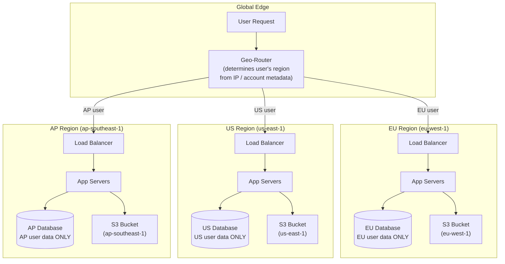
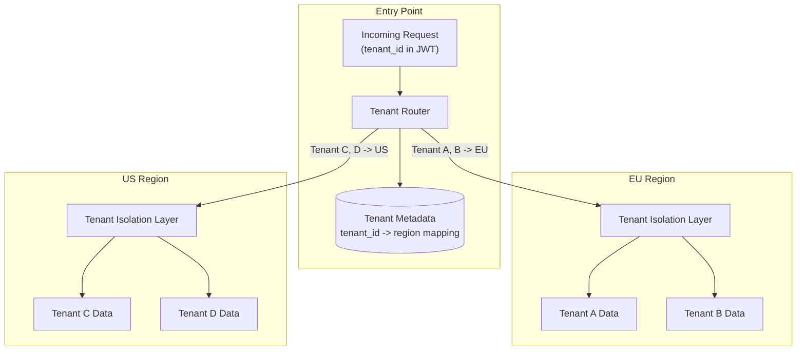

# Data Residency and Compliance in Multi-Region Systems

## Why Data Residency Matters for System Design

A multi-region system does not just need to be fast and reliable -- it must
obey the law. Governments increasingly mandate where citizen data can
physically reside, how it can be processed, and who can access it. Violating
these rules carries severe consequences: GDPR fines can reach 4% of global
annual revenue (or EUR 20 million, whichever is higher).

For system designers, compliance is not an afterthought bolted onto an
architecture. It is a **constraint that shapes the architecture from day one**,
affecting database placement, replication topology, access controls, and even
how you write log statements.

---

## GDPR (General Data Protection Regulation) -- EU

The most impactful data regulation in the world. GDPR applies to any
organization that processes personal data of EU residents, regardless of where
the organization is headquartered.

### Core Requirements for System Design

| Requirement | System Design Implication |
|-------------|--------------------------|
| **Data residency** | Personal data of EU residents must be stored in the EU (or countries with adequacy decisions: UK, Japan, etc.) |
| **Right to erasure (Article 17)** | Must be able to delete ALL of a user's personal data on request, across ALL systems (DB, caches, backups, logs, analytics) |
| **Right to portability (Article 20)** | Must export a user's data in a machine-readable format |
| **Data minimization** | Only collect and store data that is necessary for the stated purpose |
| **Purpose limitation** | Data collected for one purpose cannot be used for another without consent |
| **Data processing agreements** | Any third-party processor (AWS, analytics vendor) needs a signed DPA |
| **Breach notification** | Must notify authorities within 72 hours of discovering a data breach |
| **Privacy by design** | Data protection must be built into systems from the start, not added later |

### Right to Erasure: The Technical Challenge

```
  User requests deletion. Where does their data live?

  1. Primary database: user table, order history, preferences
  2. Database replicas: 3 replicas in EU, 1 cross-region read replica
  3. Caches: Redis user session, ElastiCache profile cache
  4. Message queues: pending notification with user data
  5. Search index: Elasticsearch user profile document
  6. Analytics pipeline: Kafka events containing user_id
  7. Data warehouse: Redshift/BigQuery tables with user activity
  8. Backups: database snapshots containing user records
  9. Logs: application logs with user_id in request traces
  10. CDN: cached API responses with user data
  11. Third-party services: email provider, analytics, support system

  GDPR requires deletion from ALL of these. Missing one is a violation.
```

**Architectural pattern for erasure:**

```
  Crypto-Shredding:
  1. Each user's personal data is encrypted with a per-user key
  2. The key is stored in a key management service (KMS)
  3. To "delete" a user: delete their encryption key
  4. All their data across ALL systems becomes unreadable
  5. Even if backups contain the data, it is effectively deleted

  Benefits:
  - Works even for immutable stores (backups, append-only logs)
  - Single operation (delete key) vs hunting data across 11+ systems
  - Auditable: key deletion is logged

  Limitation:
  - Must encrypt at the user level from the start (cannot retrofit easily)
  - Key management complexity
  - Some data (aggregated analytics) may not be per-user encrypted
```

### GDPR Data Transfer Mechanisms

When data must cross borders (EU to US, for example), GDPR requires a legal
basis:

| Mechanism | Status | Notes |
|-----------|--------|-------|
| **Adequacy decision** | Active for select countries | UK, Japan, South Korea, etc. -- data flows freely |
| **Standard Contractual Clauses (SCCs)** | Primary mechanism post-Schrems II | Contractual agreement between data exporter and importer |
| **Binding Corporate Rules (BCRs)** | For intra-company transfers | Expensive to set up, approved by EU authority |
| **EU-US Data Privacy Framework** | Active (replaced Privacy Shield) | US companies self-certify; could face legal challenges |

---

## Data Residency by Region

### Global Map of Key Regulations

| Region/Country | Regulation | Key Requirement |
|---------------|-----------|-----------------|
| **EU/EEA** | GDPR | Personal data stays in EU (or adequate countries) |
| **United Kingdom** | UK GDPR | Mirrors EU GDPR post-Brexit, separate adequacy decisions |
| **China** | PIPL + Cybersecurity Law | Personal data of Chinese citizens stored on servers in China. Cross-border transfer requires security assessment |
| **Russia** | Federal Law 242-FZ | Personal data of Russian citizens stored on servers physically in Russia |
| **India** | DPDP Act 2023 | Sensitive personal data requires at least one copy in India. Government can restrict transfers to specific countries |
| **Brazil** | LGPD | Similar to GDPR. Data can transfer if adequate protection exists |
| **Australia** | Privacy Act 1988 | No strict localization, but transferor remains liable |
| **Japan** | APPI | Adequate for EU transfers. Requires consent for transfer to non-adequate countries |
| **South Korea** | PIPA | Consent required for cross-border transfers. Adequate for EU |
| **Canada** | PIPEDA | Adequate for EU. No strict localization but organizations remain accountable |
| **Saudi Arabia** | PDPL | Personal data should be stored in Saudi Arabia; transfer requires adequacy or safeguards |
| **Indonesia** | PDP Law | Personal data must be accessible from Indonesia; cross-border transfer with safeguards |

### Why This Matters for Architecture

```
  Scenario: You are building a global SaaS product.

  A customer in Germany signs up.
    -> Their data MUST be stored in an EU data center.
    -> Replicating to us-east-1 for performance? Not without SCCs.

  A customer in China signs up.
    -> Their data MUST be stored on servers in China.
    -> You cannot use your existing AWS eu-west-1 or us-east-1 regions.
    -> You likely need a separate deployment (AWS China via Sinnet/NWCD).

  A customer in Russia signs up.
    -> Their data MUST be on servers physically in Russia.
    -> AWS does not have a Russia region.
    -> You need a local provider (Yandex Cloud, SberCloud) or co-location.

  Result: "just replicate everywhere" is not legal. Your replication topology
  is constrained by law.
```

---

## Architecture Patterns for Compliance

### Pattern 1: Region-Locked Data Stores

The most straightforward approach: each region has its own data store, and user
data never leaves its home region.



```
  Rules:
  - EU user data is stored ONLY in eu-west-1
  - No cross-region replication of personal data
  - Each region is a compliance boundary
  - Global data (product catalog, configs) CAN replicate everywhere
  - User data (PII, preferences, history) is region-locked

  Trade-offs:
  + Full compliance by construction
  + Simple to audit (data is either in the region or it is not)
  - No cross-region DR for user data (must use intra-region HA)
  - Cross-region features (e.g., user in EU messages user in US)
    require careful design
  - An EU user traveling in Asia has higher latency (routed to EU)
```

### Pattern 2: Data Masking for Cross-Region Analytics

You need global analytics (total revenue, user counts by country) but personal
data cannot leave its region.

```
  Approach: Aggregate and anonymize BEFORE cross-region transfer

  Step 1: Each region computes local aggregates
    EU region: { total_users: 1.2M, revenue: EUR 5.3M, ... }
    US region: { total_users: 800K, revenue: USD 4.1M, ... }

  Step 2: Only aggregated (non-personal) data is sent to global analytics
    No individual user records cross the border

  Step 3: If per-user analytics are needed cross-region:
    - Replace user_id with a pseudonymized token
    - Strip all PII (name, email, IP address)
    - Apply k-anonymity (ensure each record matches k+ individuals)
    - Apply differential privacy (add calibrated noise)

  Example: You want to analyze purchase patterns globally
    WRONG: Send raw order records (user_id, email, items, address) to US
    RIGHT: Send anonymized records (region, product_category, price_bucket)
```

### Pattern 3: Encryption with Region-Specific Keys

Even if data must traverse a region (e.g., during backups or processing),
it can be protected with keys that only exist in the home region.

```
  Implementation:
  1. EU KMS key (eu-west-1): encrypts all EU user data at rest and in transit
  2. US KMS key (us-east-1): encrypts all US user data
  3. Cross-region backup: encrypted EU data is backed up to another EU AZ
     (key never leaves EU)
  4. If data must temporarily pass through a non-EU system:
     - Data remains encrypted with EU KMS key
     - The non-EU system cannot decrypt it (no key access)
     - Processing happens only in the EU region

  AWS KMS: keys are regional by default. A KMS key in eu-west-1
  cannot be used in us-east-1. This is a feature for compliance.
```

---

## Multi-Tenant Multi-Region: Tenant Isolation + Region Routing

SaaS platforms face the combined challenge of isolating tenant data AND
placing it in the correct region.



### Tenant Isolation Strategies

| Strategy | Isolation Level | Cost | Compliance Strength |
|----------|---------------|------|-------------------|
| **Separate databases per tenant** | Strongest | Highest | Best -- physical separation |
| **Separate schemas per tenant** | Strong | Medium | Good -- logical separation |
| **Row-level security (tenant_id column)** | Moderate | Lowest | Acceptable with proper enforcement |
| **Separate clusters per region** | Strongest per region | Highest | Best -- no cross-region leakage |

```
  Best practice for compliance-sensitive SaaS:

  1. Tenant metadata store (global, replicated):
     - tenant_id -> home_region mapping
     - tenant_id -> compliance requirements (GDPR, HIPAA, etc.)
     - tenant_id -> data encryption key reference

  2. Request routing:
     - Extract tenant_id from auth token
     - Look up home_region
     - If request arrived at wrong region: proxy to correct region
     - Never store tenant data outside their designated region

  3. Audit trail:
     - Log every data access with tenant_id and region
     - Immutable audit logs stored in the tenant's home region
     - Regular compliance audit reports
```

---

## Industry-Specific Compliance

### HIPAA (Health Insurance Portability and Accountability Act -- US)

```
  Applies to: Protected Health Information (PHI) -- any health data
  that can identify an individual.

  Multi-region implications:
  - PHI must be encrypted at rest and in transit (AES-256, TLS 1.2+)
  - BAA (Business Associate Agreement) required with cloud provider
    (AWS, GCP, Azure all offer HIPAA BAAs)
  - Access logging: every access to PHI must be logged and auditable
  - Backup encryption: backups containing PHI must be encrypted
  - Cross-region: PHI can move between US regions with BAA in place,
    but international transfer requires additional safeguards

  AWS HIPAA architecture:
  - Use HIPAA-eligible services only (not all AWS services are eligible)
  - Encrypt everything with KMS (customer-managed keys)
  - VPC with no public subnets for PHI data stores
  - CloudTrail + GuardDuty for access monitoring
  - Dedicated HIPAA account in AWS Organizations
```

### PCI-DSS (Payment Card Industry Data Security Standard)

```
  Applies to: Cardholder data (card numbers, CVV, expiration dates)

  Multi-region implications:
  - Cardholder data must be encrypted at rest (AES-256)
  - PAN (Primary Account Number) must never be stored in plaintext
  - Network segmentation: cardholder data environment (CDE) isolated
  - Minimize data retention: do not store CVV/CVC after authorization
  - Cross-region: cardholder data can move if both regions meet PCI-DSS
    requirements and network segmentation is maintained

  Architecture pattern:
  - Tokenization service: replace card numbers with tokens
  - Only the tokenization service (in a locked-down CDE) has real card data
  - All other services use tokens -- PCI scope dramatically reduced
  - CDE runs in a dedicated VPC with strict security groups
  - Regular penetration testing of CDE required
```

### SOC 2 (Service Organization Control 2)

```
  Applies to: Service providers storing customer data

  Multi-region implications:
  - SOC 2 is about controls, not specific technical requirements
  - Trust principles: Security, Availability, Processing Integrity,
    Confidentiality, Privacy
  - Multi-region architecture must document controls for each region:
    - Who has access? (IAM policies, least privilege)
    - How is data protected? (encryption, network isolation)
    - How is availability maintained? (DR strategy, SLAs)
    - How are changes controlled? (change management, audit logs)
  - Annual audit by external auditor
  - Customer-facing SOC 2 Type II report demonstrates compliance

  Key for multi-region:
  - Every region must meet the same control standards
  - Audit logs must be centralized or consistently formatted
  - Access controls must be uniform across regions
  - DR procedures must be documented and tested
```

---

## Compliance Architecture Checklist

| Area | Requirement | Implementation |
|------|-------------|----------------|
| **Data placement** | User data in correct region | Geo-router + region-locked data stores |
| **Encryption at rest** | All personal data encrypted | KMS with region-specific keys |
| **Encryption in transit** | TLS for all data movement | TLS 1.2+ everywhere, mTLS for internal services |
| **Access control** | Least privilege, audited | IAM policies, role-based access, no shared credentials |
| **Right to erasure** | Delete all user data on request | Crypto-shredding or comprehensive deletion pipeline |
| **Data portability** | Export user data | API endpoint that exports user data as JSON/CSV |
| **Breach notification** | Alert within 72 hours (GDPR) | Automated detection (GuardDuty), incident runbook |
| **Audit logging** | All data access logged | CloudTrail, application-level audit logs, immutable storage |
| **Backup compliance** | Backups in correct region | S3 same-region backup, encrypted, retention policies |
| **Third-party agreements** | DPAs with all processors | Legal review of every vendor that touches personal data |
| **Data minimization** | Only collect what is needed | Schema reviews, periodic data audit, TTL on old data |
| **Consent management** | Track and respect user consent | Consent service storing per-user permission records |

---

## Interview Questions and Answers

**Q: How would you design a multi-region system that complies with GDPR?**

A: I would start with these constraints:
1. **Region-locked data stores**: EU users' personal data stored exclusively in
   an EU region (e.g., eu-west-1). No cross-region replication of personal data.
2. **Geo-routing**: DNS + application-level routing ensures EU users hit EU
   infrastructure. User's home region is stored in account metadata.
3. **Encryption**: Per-region KMS keys so data physically cannot be decrypted
   outside its region.
4. **Right to erasure**: Implement crypto-shredding. Each user's data is
   encrypted with a per-user key. Deleting the key renders all their data
   unreadable across all systems (DB, backups, logs).
5. **Global data separation**: Product catalog and configs replicate globally
   (not personal data). Analytics use anonymized aggregates only.
6. **Audit logging**: All access to personal data is logged in the user's
   home region with immutable storage.

**Q: A customer in Germany wants their data deleted. How do you ensure complete
erasure across a distributed system?**

A: The comprehensive approach:
1. **Immediate**: Delete from primary database, invalidate caches, remove from
   search indices.
2. **Async pipeline**: Publish a "user-deleted" event that triggers cleanup in
   analytics pipelines, data warehouses, third-party services, and message
   queues.
3. **Backups**: Use crypto-shredding -- delete the user's encryption key so
   their data in backups is unreadable. Alternatively, mark for exclusion from
   future backup restores.
4. **Verification**: Run a data discovery scan (automated) to confirm no
   remnants exist. Generate a deletion certificate for the user.
5. **Timeline**: GDPR allows up to 30 days. Aim for 72 hours for primary
   systems, 30 days for backup systems.

**Q: How would you handle a user who signs up in the EU, then permanently
moves to the US?**

A: This requires a region migration:
1. User requests region change (or it is detected via settings update).
2. Export all their data from EU region.
3. Import into US region.
4. Update tenant/user metadata to point to US region.
5. Delete data from EU region (they are no longer an EU resident, but verify
   legal obligation period has passed).
6. Update routing so future requests go to US.
Important: during migration, the user might experience a brief read-only
period to prevent split-brain.

**Q: Can you use a global database like DynamoDB Global Tables and still be
GDPR-compliant?**

A: Not directly for personal data. DynamoDB Global Tables replicate to ALL
configured regions automatically -- you cannot selectively replicate by row.
An EU user's data would replicate to us-east-1, violating residency
requirements. Solutions:
1. Do not add non-EU regions to tables containing EU personal data.
2. Use separate tables per region (defeats the "Global Table" purpose).
3. Use DynamoDB Global Tables only for non-personal data (product catalog,
   config). Use region-locked standard tables for personal data.
4. Consider CockroachDB REGIONAL BY ROW, which lets you pin specific rows to
   specific regions while maintaining a single logical table.
