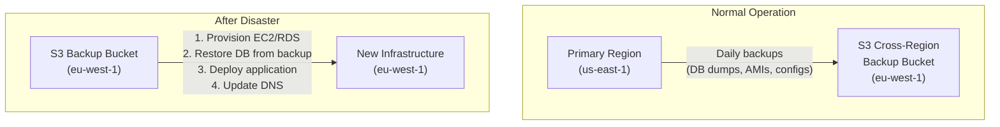
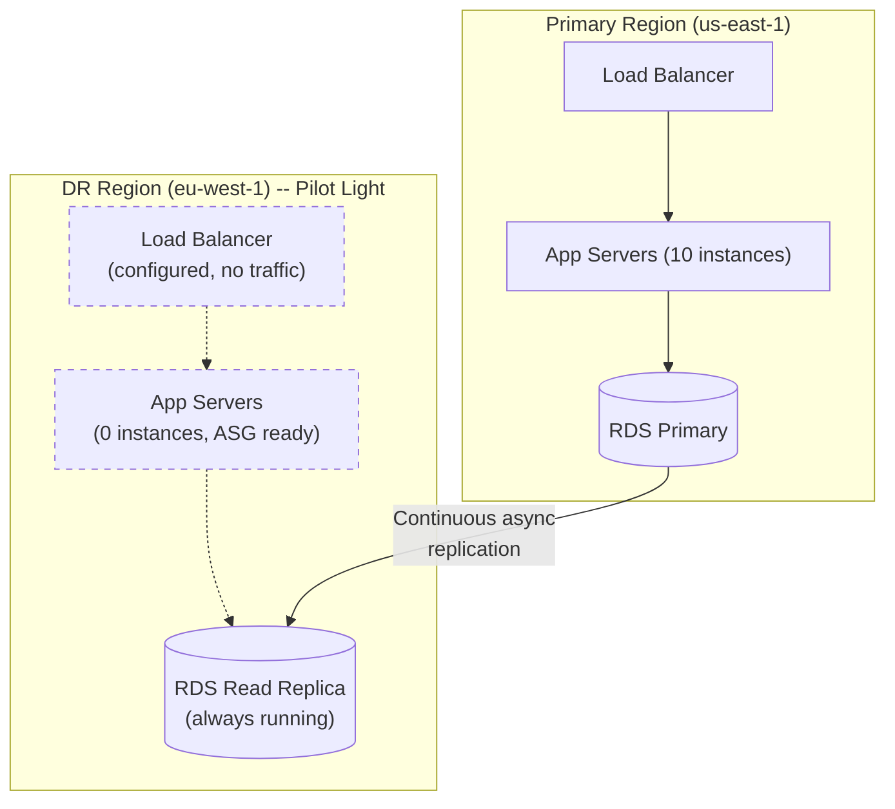
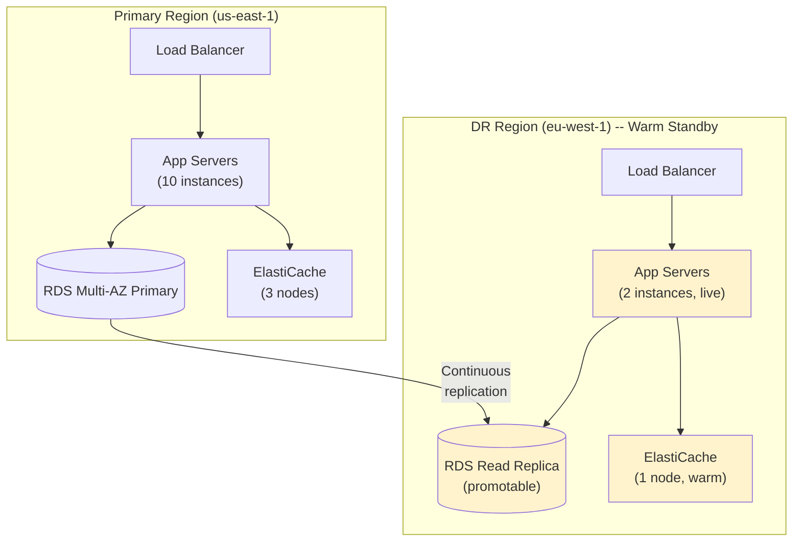
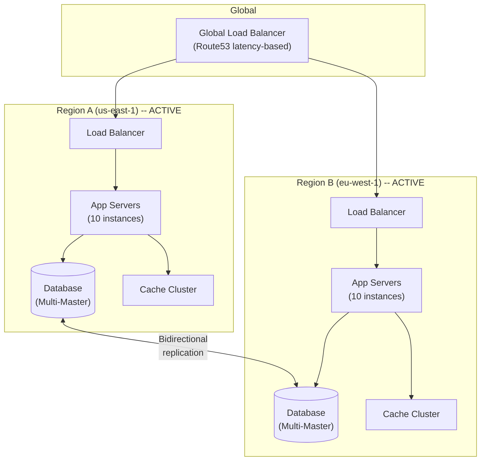
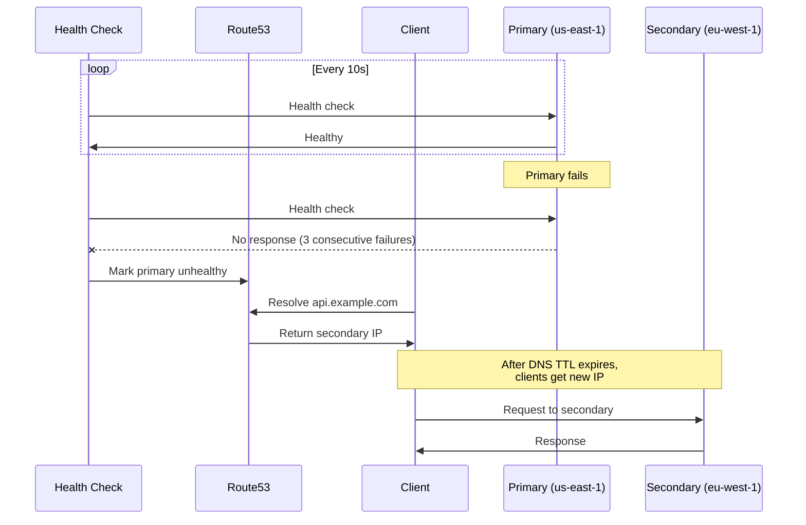
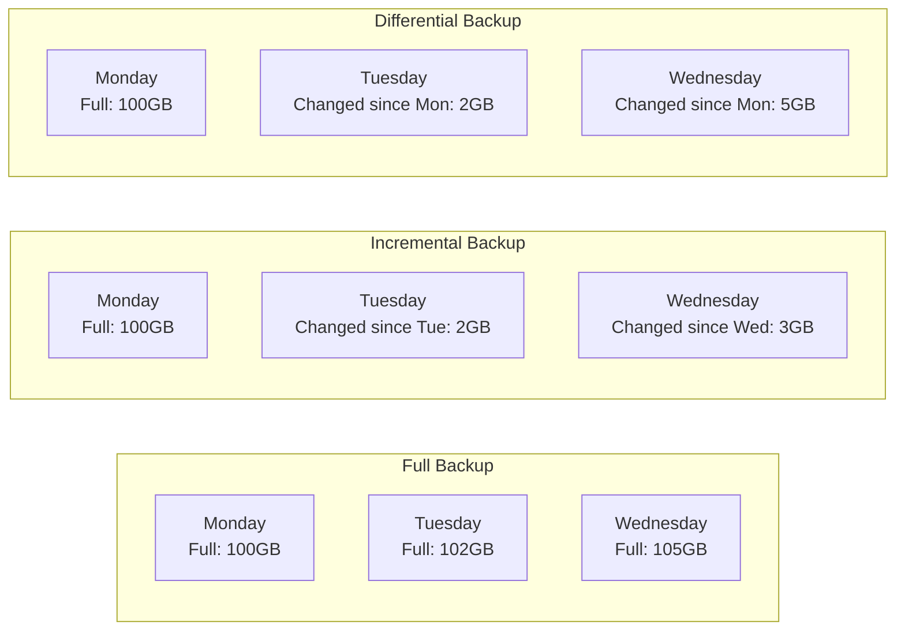

# Disaster Recovery for Multi-Region Systems

## The Two Metrics That Define Every DR Strategy

Every disaster recovery conversation starts with two numbers. Get these wrong
and you either overspend on infrastructure or lose data when it matters most.

### RTO -- Recovery Time Objective

**How quickly must we recover?**

RTO is the maximum acceptable duration of downtime after a disaster. It is
measured from the moment the failure occurs to the moment the system is fully
operational again.

```
  Failure occurs          System recovered
       |                        |
       |<------- RTO ---------->|
       |                        |
  Example: RTO = 15 minutes means the business accepts
  up to 15 minutes of downtime per disaster event.

  If actual recovery takes 45 minutes and RTO is 15 minutes,
  the DR strategy has FAILED its SLA.
```

### RPO -- Recovery Point Objective

**How much data loss is acceptable?**

RPO is the maximum acceptable amount of data loss measured in time. It
determines how far back in time your recovery point can be.

```
  Last backup     Failure occurs
       |                |
       |<---- RPO ----->|
       |                |
  Example: RPO = 1 hour means you can tolerate losing
  up to 1 hour of data written before the failure.

  If your last backup was 4 hours ago and RPO is 1 hour,
  the backup strategy has FAILED its SLA.
```

### RTO vs RPO: The Cost Trade-off

```
  Lower RTO/RPO = higher cost

  RPO = 24 hours  ->  daily backups, cheapest storage         $
  RPO = 1 hour    ->  frequent snapshots, moderate storage    $$
  RPO = 1 minute  ->  continuous replication                  $$$
  RPO = 0         ->  synchronous multi-region replication    $$$$

  RTO = 24 hours  ->  manual restore from backups             $
  RTO = 1 hour    ->  pre-staged infrastructure, scripted     $$
  RTO = 5 minutes ->  warm standby, automated failover        $$$
  RTO = 0         ->  active-active, instant reroute          $$$$
```

---

## DR Strategies: From Cheap to Bulletproof

### Strategy 1: Backup and Restore

The simplest and cheapest DR approach. Back up data regularly, and when
disaster strikes, provision new infrastructure and restore from backups.



| Metric | Value |
|--------|-------|
| **RTO** | Hours (provision + restore + deploy + verify) |
| **RPO** | Hours (last backup interval) |
| **Cost** | $ (only pay for backup storage during normal ops) |
| **Automation** | Requires Infrastructure-as-Code (Terraform/CloudFormation) |

**When to use:** Non-critical systems, development environments, systems where
hours of downtime are tolerable.

### Strategy 2: Pilot Light

A minimal version of the production environment runs continuously in the DR
region. Core infrastructure (database replicas, network config) is always on,
but application servers are off or minimal.



**Failover process:**
```
  1. Detect primary region failure (health checks, alarms)
  2. Promote RDS read replica to standalone primary (~2-5 min)
  3. Scale up ASG to launch application instances (~3-8 min)
  4. Verify application health
  5. Switch DNS / Global LB to DR region
  Total: ~10-30 minutes
```

| Metric | Value |
|--------|-------|
| **RTO** | 10-30 minutes (promotion + scaling + DNS) |
| **RPO** | Seconds to minutes (continuous replication lag) |
| **Cost** | $$ (DB replica always running, minimal compute) |
| **Automation** | ASG launch templates, scripted promotion, DNS automation |

**When to use:** Business-critical systems that can tolerate 10-30 minutes of
downtime but need near-zero data loss.

### Strategy 3: Warm Standby

A scaled-down but fully functional copy of production runs in the DR region.
It can serve traffic immediately (at reduced capacity) and scales up to full
capacity during failover.



**Failover process:**
```
  1. Detect primary region failure
  2. Promote DB replica to primary (~2-5 min)
  3. Scale up app servers from 2 to 10 instances (~2-5 min)
  4. Scale up cache cluster
  5. Switch traffic via DNS / Global LB
  6. DR region absorbs full load
  Total: ~5-15 minutes (app already running, just needs scaling)
```

| Metric | Value |
|--------|-------|
| **RTO** | Seconds to minutes (already serving, needs scale-up) |
| **RPO** | Seconds (continuous replication) |
| **Cost** | $$$ (reduced but real compute running 24/7) |
| **Automation** | Automated health checks, scaling policies, DNS failover |

### Strategy 4: Multi-Site Active-Active

Both regions run full production workloads simultaneously. There is no
"failover" -- when one region fails, the other absorbs its traffic
transparently.



| Metric | Value |
|--------|-------|
| **RTO** | Near-zero (traffic reroutes automatically) |
| **RPO** | Near-zero (data exists in both regions) |
| **Cost** | $$$$ (two full production deployments) |
| **Complexity** | Highest (conflict resolution, bidirectional replication) |

### Strategy Comparison Table

| Strategy | RTO | RPO | Cost | Complexity |
|----------|-----|-----|------|-----------|
| **Backup & Restore** | Hours | Hours | $ | Low |
| **Pilot Light** | 10-30 min | Seconds | $$ | Medium |
| **Warm Standby** | Seconds-Minutes | Seconds | $$$ | Medium-High |
| **Multi-Site Active-Active** | ~Zero | ~Zero | $$$$ | Highest |

---

## Failover Mechanisms

### DNS Failover



**Limitation:** DNS TTL. If TTL is 60 seconds, clients may continue hitting
the failed primary for up to 60 seconds after the DNS change. Some resolvers
cache aggressively beyond TTL.

**Mitigation:** Set low TTLs (15-60s) proactively, accept the additional DNS
query overhead. Use short TTLs for the failover record specifically.

### Load Balancer Failover

Faster than DNS because there is no TTL propagation delay.

```
  Global Load Balancer (e.g., AWS Global Accelerator, Cloudflare LB):
  1. Maintains persistent connections to backend regions
  2. Runs health checks every 5-10 seconds
  3. On failure detection: reroutes new connections to healthy region
  4. Existing connections to failed region: RST and client reconnects

  Timeline:
    T=0:   Primary fails
    T=10s: Health check detects failure (2 consecutive misses)
    T=11s: GLB updates routing table
    T=11s: New requests route to healthy region
    T=12s: Existing connections timeout and reconnect

  Total failover: ~10-15 seconds (vs. 60+ seconds for DNS)
```

### Application-Level Failover

Most granular control, handled within the application layer:

```
  Service Mesh failover (Istio/Envoy):
  1. Service A calls Service B
  2. Envoy sidecar detects Service B is unhealthy in local region
  3. Envoy automatically routes to Service B in the DR region
  4. Transparent to Service A -- it sees a normal response

  Benefits:
  - Per-service failover (not all-or-nothing)
  - Retry with cross-region fallback
  - Circuit breaker prevents cascading failures
  - Traffic splitting: 90% local, 10% remote for canary testing
```

### Failover Mechanism Comparison

| Mechanism | Failover Speed | Granularity | Complexity |
|-----------|---------------|-------------|-----------|
| **DNS** | 30-120 seconds | Entire domain | Low |
| **Global LB** | 10-15 seconds | Per endpoint | Medium |
| **Application/Mesh** | 1-5 seconds | Per service/request | High |

---

## Failover Testing

An untested DR plan is not a plan -- it is a hope.

### DR Drills

```
  Scheduled DR Drill Process:

  1. ANNOUNCE: Schedule the drill, notify stakeholders
  2. SIMULATE: Trigger a simulated regional failure
     - Block all traffic to primary region
     - Do NOT actually shut down primary (you want to restore quickly)
  3. OBSERVE: Monitor automatic failover
     - Did health checks detect the failure?
     - Did traffic reroute to DR region?
     - Did the DR region handle the load?
     - What was the actual RTO? Actual RPO?
  4. MEASURE: Record metrics
     - Time to detect, time to failover, error rate during transition
  5. RESTORE: Return traffic to primary
  6. RETRO: Document what worked, what broke, action items

  Frequency: At minimum quarterly. Netflix does it weekly.
```

### Chaos Engineering for DR

```
  Netflix Chaos Monkey / Chaos Kong:
  - Chaos Monkey: randomly kills individual instances (daily)
  - Chaos Kong: simulates entire region failure (periodic)

  AWS Fault Injection Simulator (FIS):
  - Inject faults: terminate instances, throttle APIs, blackhole network
  - Target specific resources or entire AZs
  - Run as experiments with stop conditions (auto-rollback if too much damage)

  Gremlin:
  - Commercial chaos engineering platform
  - CPU/memory/disk/network attacks
  - Zone and region failure simulation
  - Observability integration (halt if SLO breached)
```

### GameDay Checklist

| Step | Action | Verified? |
|------|--------|-----------|
| 1 | Confirm DR region infrastructure is provisioned | |
| 2 | Verify database replication lag is within RPO | |
| 3 | Confirm DNS/GLB failover configuration | |
| 4 | Test health check endpoints | |
| 5 | Simulate primary failure | |
| 6 | Measure actual RTO | |
| 7 | Verify data integrity in DR region | |
| 8 | Test write operations in DR region | |
| 9 | Restore primary and verify failback | |
| 10 | Document findings and action items | |

---

## Data Backup Strategies

### Backup Types



| Type | Storage Cost | Restore Speed | Restore Complexity |
|------|-------------|---------------|-------------------|
| **Full** | Highest (full copy each time) | Fastest (single restore) | Simplest |
| **Incremental** | Lowest (only changes since last backup) | Slowest (chain of increments) | Most complex |
| **Differential** | Medium (changes since last full) | Medium (full + one diff) | Medium |

### Cross-Region Backup Replication

```
  Strategy: 3-2-1 Rule adapted for cloud

  3 copies of data:
    - Primary database in us-east-1
    - Replica in us-east-1 (Multi-AZ)
    - Cross-region backup in eu-west-1

  2 different storage types:
    - EBS volumes (attached to DB instances)
    - S3 (for backup archives)

  1 copy offsite (different region):
    - S3 Cross-Region Replication to eu-west-1
    - Encrypted at rest with region-specific KMS keys

  AWS Implementation:
    - RDS automated backups: enable cross-region backup replication
    - S3 CRR (Cross-Region Replication): automatic, near-real-time
    - EBS snapshots: copy to DR region on schedule
```

### Point-in-Time Recovery (PITR)

```
  How PITR works (RDS / Aurora):
  1. RDS takes automated snapshots (daily)
  2. RDS continuously streams transaction logs (WAL) to S3
  3. To recover to a specific point:
     a. Restore from the most recent snapshot BEFORE the target time
     b. Replay WAL logs up to the exact target time
     c. Result: database state as of any second in the retention window

  Example:
    Retention window: 35 days
    Bad migration ran at: 2024-03-15 14:30:00 UTC
    Recover to: 2024-03-15 14:29:59 UTC

    RDS restores snapshot from 2024-03-15 00:00:00
    Replays WAL logs through 14:29:59
    New DB instance has pre-migration state

  DynamoDB PITR:
    - Continuous backups, restore to any second in last 35 days
    - No performance impact (backups from stream, not table)
    - Restores to a new table (not in-place)
```

---

## Disaster Recovery Runbook

A runbook must be written so that an on-call engineer at 3 AM, stressed and
tired, can follow it without ambiguity.

### Template: Regional Failover Runbook

```
  REGIONAL FAILOVER RUNBOOK
  =========================
  Last tested: [DATE]
  Estimated RTO: 15 minutes
  Estimated RPO: < 30 seconds

  TRIGGER CONDITIONS:
  - Primary region health checks failing > 5 minutes
  - Multiple AZs in primary region showing failures
  - AWS status page confirms regional degradation

  STEP 1: CONFIRM THE OUTAGE (2 min)
  [ ] Check AWS status page: https://status.aws.amazon.com
  [ ] Verify from OUTSIDE the failing region (use DR region VPN)
  [ ] Confirm it is a regional outage, not a single-service issue
  [ ] Notify incident commander on Slack #incidents

  STEP 2: INITIATE FAILOVER (5 min)
  [ ] Run: aws rds promote-read-replica --db-instance-identifier dr-replica
  [ ] Verify DB promotion: aws rds describe-db-instances --db-instance-identifier dr-replica
  [ ] Verify replication status shows "standalone"
  [ ] Run: terraform apply -var="active_region=eu-west-1" -auto-approve
  [ ] Verify ASG instances are InService: aws autoscaling describe-auto-scaling-groups

  STEP 3: VERIFY DR REGION (3 min)
  [ ] Hit health check endpoint: curl https://dr-region-lb.example.com/health
  [ ] Run smoke tests: ./scripts/smoke-test.sh --region eu-west-1
  [ ] Check error rates in Datadog dashboard: [LINK]
  [ ] Verify database connectivity from app servers

  STEP 4: SWITCH TRAFFIC (5 min)
  [ ] Update Route53: aws route53 change-resource-record-sets --hosted-zone-id Z123
      --change-batch file://failover-dns.json
  [ ] If using Global Accelerator: update endpoint group weights
  [ ] Monitor traffic shift in CloudWatch: [DASHBOARD LINK]
  [ ] Verify 0 traffic hitting primary region

  STEP 5: POST-FAILOVER (ongoing)
  [ ] Monitor error rates for 30 minutes
  [ ] Notify stakeholders of successful failover
  [ ] Begin incident postmortem document
  [ ] Plan failback when primary region recovers

  ROLLBACK:
  If DR region is also failing, escalate to VP Engineering.
  Do NOT attempt to fail back to a partially recovered primary.
```

---

## Real-World DR Events

### AWS us-east-1 S3 Outage (2017)

```
  What happened:
  - An engineer ran a command to remove a small number of S3 servers
  - A typo caused far more servers to be removed than intended
  - S3 subsystem went down, cascading to Lambda, SQS, and dozens of services
  - us-east-1 was degraded for ~4 hours

  Impact:
  - Sites depending on S3 (images, static assets) showed broken pages
  - Services using Lambda, SQS, or DynamoDB in us-east-1 failed
  - The AWS status page itself was hosted on S3 and went down

  Lessons:
  1. The status page should not depend on the service it monitors
  2. Single-region architectures have a single point of failure
  3. Even AWS internal tooling lacked sufficient safeguards
  4. Companies with multi-region DR (Netflix, etc.) were barely affected
```

### Netflix: Surviving Region Outages

```
  How Netflix handles regional failures:

  1. Zuul (API Gateway) continuously health-checks all three regions
  2. If a region fails, Zuul stops routing traffic there
  3. EVCache (distributed cache) has cross-region replication
     - When traffic shifts, the receiving region's cache is already warm
  4. Cassandra uses multi-datacenter replication
     - Data is already present in surviving regions
  5. Stateless services scale automatically to absorb shifted traffic

  Key practice: Region evacuation drills
  - Weekly, Netflix drains all traffic from one region
  - Validates that the other two regions can handle full load
  - Discovers issues proactively (capacity, cache hit rates, timeouts)

  Result: When a real outage hits, it is just another Tuesday.
```

### GitHub Universe Outage (2018)

```
  What happened:
  - Network partition between us-east data center and its MySQL replicas
  - Primary failed over to replica with 40 seconds of replication lag
  - 40 seconds of writes were lost from the original primary
  - Restoring those writes took ~24 hours of careful reconciliation

  Lessons:
  1. Async replication means RPO > 0 -- those 40 seconds mattered
  2. Automated failover is dangerous if it doesn't check replication lag
  3. Data reconciliation after a split-brain is extremely painful
  4. GitHub moved to more sophisticated replication and failover logic
```

---

## Interview Questions and Answers

**Q: Design a disaster recovery strategy for an e-commerce platform with
99.99% availability SLA.**

A: 99.99% allows 52.6 minutes of downtime per year. This rules out Backup &
Restore (hours of RTO). I would implement:
- **Warm Standby** in a second region with continuous DB replication.
- RTO target: 5 minutes (automated failover with Global Accelerator).
- RPO target: < 5 seconds (async replication with monitored lag).
- Quarterly DR drills to validate.
- For the most critical path (checkout), consider active-active to achieve
  near-zero RTO for that specific flow.

**Q: What is the difference between RTO and RPO? Give an example where they
matter differently.**

A: RTO is about time to recover (downtime tolerance). RPO is about data loss
tolerance. A blog platform might accept RTO of 1 hour (readers can wait) but
RPO of 0 (losing authors' unpublished drafts is unacceptable). A stock trading
platform needs both near zero: every second of downtime loses trades, and every
lost transaction is a financial liability.

**Q: You discover your DR region's database is 2 hours behind the primary.
What do you do?**

A: This is a critical finding because our RPO is likely much less than 2 hours.
Immediate steps:
1. Check replication status: is it actively catching up, or broken?
2. If broken: fix replication immediately, this is a P1 incident.
3. If just slow: investigate throughput bottleneck (network, IOPS, CPU).
4. Alert on replication lag exceeding RPO threshold going forward.
5. Consider if this means our RPO assumption is invalid for capacity planning.

**Q: Why not just use active-active everywhere and eliminate DR concerns?**

A: Active-active is not a free lunch. It requires conflict resolution for
concurrent writes, bidirectional replication, and careful application design.
It doubles infrastructure cost. For many systems, a well-tested warm standby
provides sufficient DR at a fraction of the cost and complexity.
