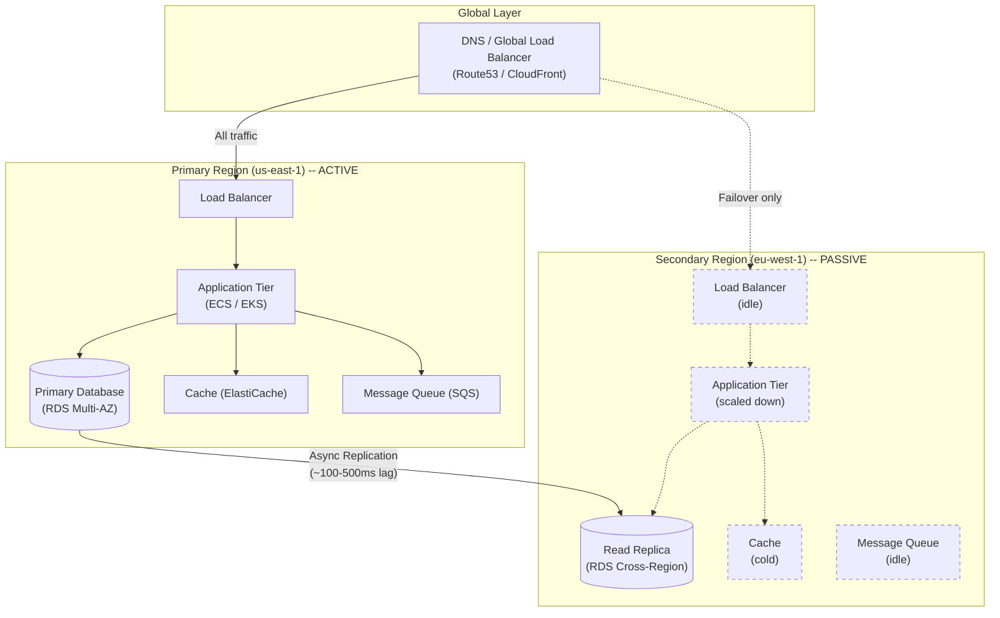
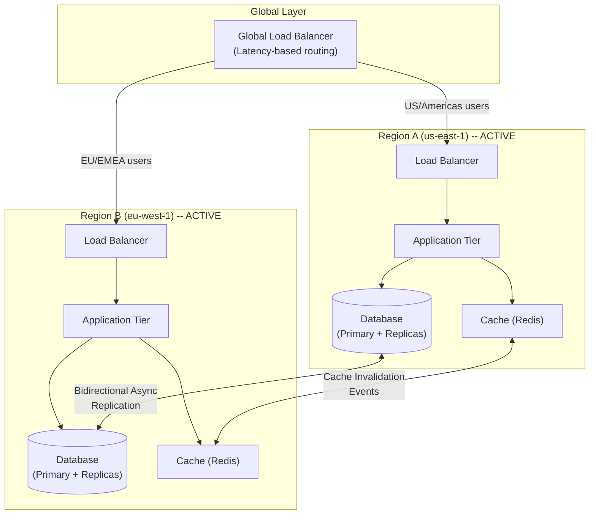
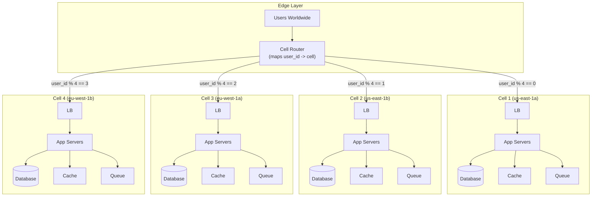
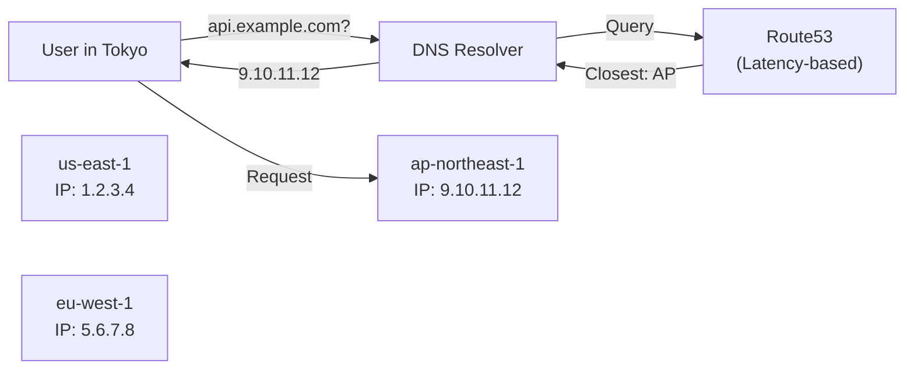
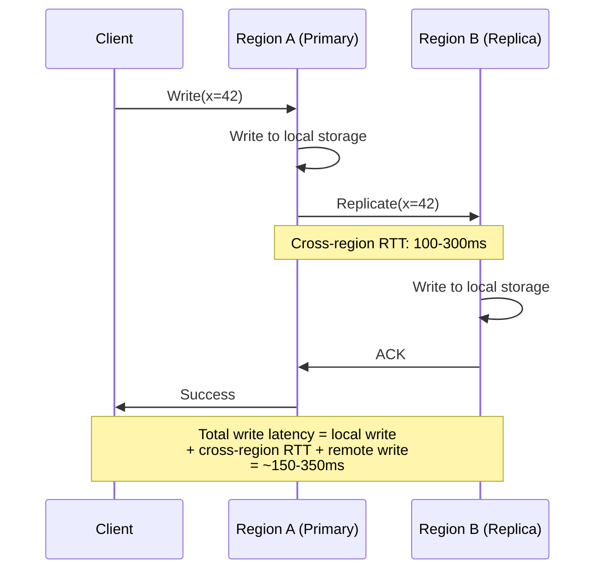
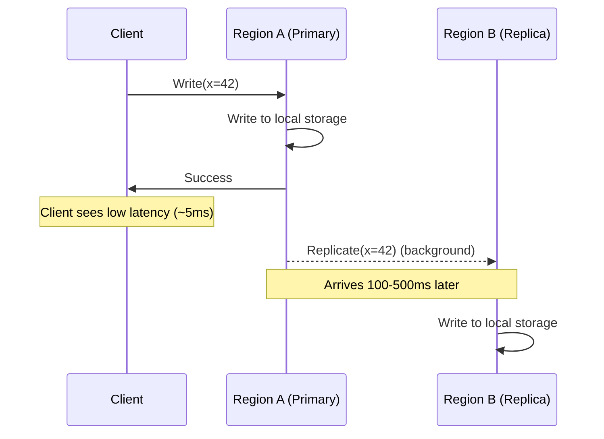
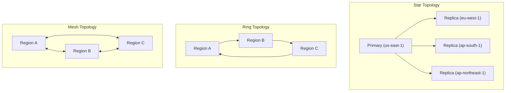
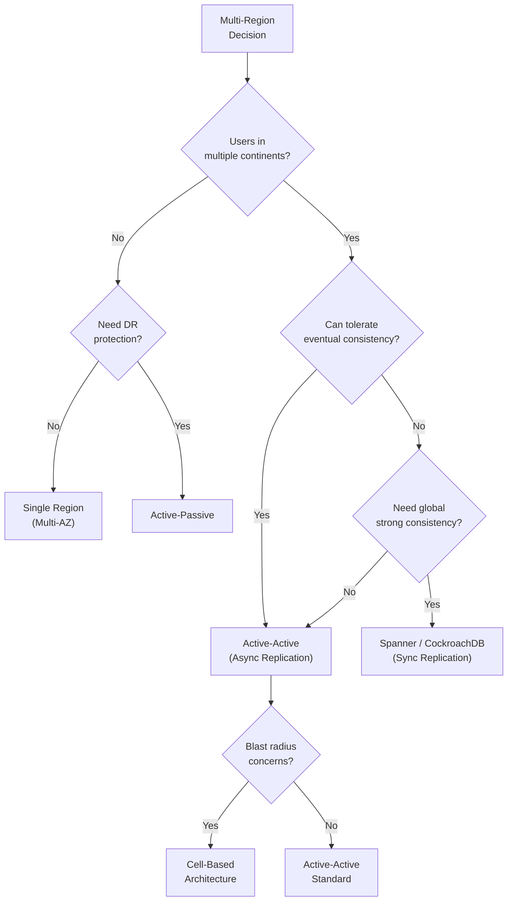

# Multi-Region / Global System Design

## Why Go Multi-Region?

Every significant production system eventually faces the question: "Should we
run in more than one region?" The answer hinges on three drivers that each
demand fundamentally different architectural responses.

### The Three Drivers

| Driver | Problem | Example |
|--------|---------|---------|
| **Latency** | Users far from the datacenter see slow responses | A US-East app serving users in Singapore at 250ms+ RTT |
| **Availability** | A single-region outage takes the entire system offline | The 2017 AWS us-east-1 S3 outage cascaded across hundreds of services |
| **Compliance** | Laws mandate that certain data stays within geographic boundaries | GDPR requires EU personal data to remain in the EU (or approved countries) |

### Latency: Speed of Light is the Bottleneck

No amount of code optimization overcomes physics. Light in fiber travels at
roughly 200 km/ms. Round-trip times between major regions:

```
  US-East  <-->  US-West:    ~60-80 ms RTT
  US-East  <-->  EU-West:    ~80-120 ms RTT
  US-East  <-->  AP-South:   ~200-280 ms RTT
  US-East  <-->  AP-Southeast: ~220-300 ms RTT
  EU-West  <-->  AP-South:   ~120-160 ms RTT
```

For a single API call needing 3 sequential DB queries, a user in Singapore
hitting a US-East backend pays 3 x 250ms = 750ms just in network latency,
before any processing. Deploying a regional backend near the user collapses
this to 3 x 5ms = 15ms.

### Availability: Regions Fail

AWS has had notable regional outages:
- **2017**: us-east-1 S3 outage -- cascaded to Lambda, SQS, and hundreds of
  dependent services across the internet.
- **2020**: us-east-1 Kinesis outage -- took out CloudWatch, Lambda, and other
  services for hours.
- **2021**: us-east-1 networking outage -- affected DynamoDB, EC2, and Connect.

A single-region architecture makes the entire business dependent on one
provider's one datacenter cluster. Multi-region turns a total outage into a
partial degradation.

### Compliance: Data Has a Passport

Regulations increasingly dictate where data can physically reside:
- **GDPR** (EU): personal data of EU residents must stay in the EU (or
  countries with adequacy decisions).
- **China's PIPL**: personal data of Chinese citizens must be stored in China.
- **India's DPDP**: sensitive personal data requires at least one copy in India.
- **Russia's Data Localization Law**: personal data of Russian citizens must be
  stored on servers physically located in Russia.

See [data-residency-and-compliance.md](./data-residency-and-compliance.md) for
deep coverage of compliance architectures.

---

## Architecture Pattern 1: Active-Passive

The simplest multi-region pattern. One region (primary/active) handles all
traffic. A second region (passive/standby) receives replicated data and stands
ready to take over if the primary fails.

### How It Works

1. All user traffic routes to the **primary region**.
2. Data is **asynchronously replicated** to the passive region.
3. The passive region runs infrastructure (DB replicas, app instances) but
   receives no user traffic under normal operation.
4. On primary failure, a **failover** process promotes the passive region to
   active status and redirects traffic.

### Architecture Diagram



### Failover Process

```
  Normal Operation:
    DNS ──> Primary Region (active)
    Passive Region receives async replication, sits idle

  Primary Failure Detected:
    1. Health checks fail (Route53 health check, custom monitoring)
    2. Automated or manual decision to failover
    3. Promote passive DB replica to primary (RDS: promote read replica)
    4. Warm up caches (or accept cold-cache penalty)
    5. Update DNS / Global LB to route traffic to new active region
    6. New active region begins serving traffic

  Recovery:
    1. Original primary region comes back online
    2. Re-establish replication (new primary -> old primary as new passive)
    3. Optionally fail back to original region
```

### RTO and RPO

| Metric | Definition | Active-Passive Typical Values |
|--------|-----------|-------------------------------|
| **RTO** (Recovery Time Objective) | Maximum acceptable downtime | 5-30 minutes (DNS TTL + promotion + warmup) |
| **RPO** (Recovery Point Objective) | Maximum acceptable data loss | Seconds to minutes (async replication lag) |

The RPO is bounded by replication lag. If the primary crashes with 30 seconds
of unreplicated writes, those 30 seconds of data are lost.

### Pros and Cons

| Pros | Cons |
|------|------|
| Simpler to implement and reason about | Passive region resources are wasted during normal operation |
| No write-write conflict resolution needed | Failover is not instant -- minutes of downtime |
| Lower cost than active-active (passive can be scaled down) | RPO > 0 -- some data loss on failover |
| Single source of truth for writes | All users hit one region -- no latency benefit for distant users |
| Easier compliance (data flows one direction) | Manual intervention often needed for failover decision |

### When to Use Active-Passive

- Your user base is concentrated in one geography.
- You need DR protection but not global low latency.
- Budget constrains running two full-scale regions.
- You want simplicity over maximum availability.

---

## Architecture Pattern 2: Active-Active

Both regions serve live traffic simultaneously. Users are routed to the
nearest region. Both regions accept reads AND writes, and data replicates
bidirectionally between them.

### How It Works

1. A **geo-router** (DNS-based or Global LB) directs users to the closest region.
2. Each region has a full application stack and database that accepts writes.
3. **Bidirectional async replication** keeps data synchronized.
4. **Conflict resolution** handles cases where both regions write to the same data
   concurrently.

### Architecture Diagram



### The Write Conflict Problem

Active-active's central challenge: what happens when Region A and Region B
both write to the same record before replication catches up?

```
  Timeline:

  T=0:   User record {id: 42, email: "old@mail.com"} exists in both regions
  T=1:   Region A: UPDATE email = "alice@new.com"  (US user changes email)
  T=2:   Region B: UPDATE email = "alice@other.com" (support agent changes email)
  T=3:   Replication delivers both changes to both regions
  T=3:   CONFLICT -- which email wins?
```

### Conflict Resolution Strategies

| Strategy | How It Works | Trade-off |
|----------|-------------|-----------|
| **Last-Writer-Wins (LWW)** | Highest timestamp wins | Simple but silently drops writes |
| **Region Priority** | Designated "home region" for each record wins | Predictable but inflexible |
| **Application-Level Merge** | Custom logic merges both changes | Most correct but complex |
| **CRDTs** | Data structures that auto-merge without conflicts | Limited data types supported |

**CRDTs** (Conflict-free Replicated Data Types) deserve special attention for
multi-region systems. A G-Counter, for example, lets each region maintain its
own counter that can only increment, and the global count is the sum of all
regional counters -- no conflicts possible by construction.

See [conflict-resolution.md](../../02-core-system-design/02-replication-partitioning/conflict-resolution.md)
for deep coverage of LWW, vector clocks, and CRDT implementations.

### Reducing Conflict Surface Area

Smart data partitioning dramatically reduces conflicts:

```
  Strategy: "Owner Region" pattern

  - Each user has a "home region" (based on signup location or explicit choice)
  - Writes to a user's data are routed to their home region
  - Reads can be served from any region (eventual consistency acceptable)
  - Cross-region writes only happen for truly global operations

  Result: 95%+ of writes go to one region per record, conflicts are rare.
```

### Pros and Cons

| Pros | Cons |
|------|------|
| Lower latency for all users globally | Write-write conflict resolution is complex |
| Full utilization of all regions (no wasted standby) | Bidirectional replication adds operational overhead |
| Near-zero RTO (traffic reroutes immediately on failure) | Eventual consistency -- stale reads possible |
| Better user experience worldwide | Higher cost (two full-scale deployments) |
| No single point of failure | Cache coherence across regions is hard |

### When to Use Active-Active

- User base is globally distributed.
- Low latency is a business requirement (real-time apps, trading).
- Near-zero downtime is required (SLA > 99.99%).
- You can tolerate eventual consistency for most operations.
- Your team can handle conflict resolution complexity.

---

## Architecture Pattern 3: Cell-Based Architecture

Pioneered and widely adopted at Amazon, cell-based architecture takes isolation
further. Instead of "regions," the system is partitioned into independent
**cells**, each serving a subset of users.

### Core Concept

A **cell** is a fully self-contained deployment (compute, storage, queues,
caches) that handles a fixed subset of users. A **cell router** at the edge
maps users to their assigned cell.

```
  Key Insight: The blast radius of ANY failure is limited to one cell.

  If Cell-3 suffers a database corruption, a bad deployment, or a
  cascading failure, only the users assigned to Cell-3 are affected.
  Cell-1, Cell-2, Cell-4... continue operating normally.

  Traditional multi-region: a bad deployment goes to ALL users in a region.
  Cell-based: a bad deployment goes to ONE cell's users.
```

### Architecture Diagram



### Cell Router Design

The cell router is the only shared component, so it must be extremely simple,
fast, and reliable.

```
  Cell Router Requirements:
  1. Stateless: mapping is computed, not stored
  2. Deterministic: same user_id always maps to same cell
  3. Low latency: adds < 1ms to request path
  4. Highly available: deployed at edge, globally replicated

  Mapping Strategies:
  - Hash-based:  cell = hash(user_id) % num_cells
  - Range-based: user_id 1-1M -> Cell 1, 1M-2M -> Cell 2
  - Lookup table: small config file mapping user -> cell (for flexibility)
  - Hybrid: hash for default, lookup table for overrides (VIP users, migrations)
```

### Cell Sizing and Operations

| Aspect | Recommendation |
|--------|---------------|
| Cell size | Small enough that losing one is acceptable (e.g., 5% of users) |
| Number of cells | Enough for blast radius control (typically 10-20+) |
| Deployment | Cells deploy independently, canary one cell at a time |
| Scaling | Add new cells, migrate users, rather than scaling existing cells |
| Cross-cell operations | Avoid if possible; use async events for cross-cell data needs |

### Pros and Cons

| Pros | Cons |
|------|------|
| Minimal blast radius for any failure | Operational complexity of managing many independent deployments |
| Safe deployments (canary one cell at a time) | Cross-cell operations require special handling |
| Natural scaling (add more cells) | Cell router is a critical dependency |
| Failure in one cell does not cascade | User migration between cells requires careful data movement |
| Easier capacity planning per cell | Higher infrastructure overhead |

---

## Geo-Routing: Getting Users to the Right Region

Before multi-region architecture matters, you need to route users to the
correct region. Three primary mechanisms exist, each at a different network layer.

### DNS-Based Routing



**Route53 Routing Policies:**

| Policy | Behavior | Use Case |
|--------|----------|----------|
| **Latency-based** | Routes to region with lowest measured latency | General multi-region |
| **Geolocation** | Routes based on user's geographic location | Compliance (EU users -> EU) |
| **Geoproximity** | Routes based on proximity with adjustable bias | Gradual traffic shifting |
| **Weighted** | Distributes traffic by configured percentages | Canary deployments |
| **Failover** | Routes to primary, falls back to secondary | Active-passive DR |

**DNS Limitation:** TTL caching. When you change DNS records, clients and
intermediate resolvers cache the old answer for up to TTL seconds. A 60-second
TTL means up to 60 seconds of stale routing after a change. Some resolvers
ignore TTL entirely.

### Anycast Routing

```
  Traditional (Unicast):
    Each server has a unique IP.
    DNS returns the IP of the "right" server.
    Routing decision happens at DNS layer.

  Anycast:
    Multiple servers in different regions share the SAME IP address.
    BGP routing automatically sends packets to the nearest server.
    Routing decision happens at network layer -- no DNS TTL issues.

  Example: Cloudflare uses Anycast for their entire CDN.
    User in Paris and user in Tokyo both resolve to 104.16.123.96.
    BGP routes Paris user to the Paris PoP, Tokyo user to the Tokyo PoP.
```

**Anycast pros:** instant failover (BGP reconverges in seconds), no DNS TTL
issues. **Anycast cons:** works best for stateless/UDP protocols; TCP
connection migration on route changes is problematic.

### Application-Level Routing

For finer-grained control, routing decisions happen inside the application:

```
  API Gateway receives request:
    1. Extract user_id from auth token
    2. Look up user's home region in metadata store
    3. If current region == home region: serve locally
    4. If current region != home region: proxy to home region

  This enables:
    - Per-user region assignment (not just geographic proximity)
    - "Follow the sun" routing for support teams
    - Compliance-aware routing (EU user always routes to EU)
    - Cell-based routing (user_id -> specific cell)
```

---

## Data Replication Across Regions

The hardest problem in multi-region systems: keeping data consistent across
regions separated by 100-300ms of network latency.

### Replication Modes Compared

| Mode | Consistency | Write Latency | Data Loss Risk | Use Case |
|------|------------|---------------|----------------|----------|
| **Synchronous** | Strong | High (cross-region RTT added to every write) | None | Financial transactions |
| **Asynchronous** | Eventual | Low (write returns immediately) | Possible (replication lag) | Most user-facing data |
| **Semi-synchronous** | Regional strong, global eventual | Medium | Minimal | Balanced approach |

### Synchronous Replication



Every write pays the cross-region RTT penalty. For a 100ms RTT, writes take
at minimum 100ms longer. For 3 regions with synchronous replication, the write
latency is bounded by the slowest region.

### Asynchronous Replication



Writes return immediately. Replication happens in the background. The risk:
if Region A fails before replication completes, those writes are lost. This
is the RPO cost of async replication.

### Semi-Synchronous Replication

A pragmatic middle ground used by many production systems:

```
  Semi-Sync Strategy:

  Within a region: synchronous replication to at least one local replica
    -> Protects against single-node failure with no latency penalty

  Across regions: asynchronous replication
    -> No cross-region latency penalty on writes
    -> Eventual consistency globally

  Result:
    - Local failures: zero data loss (sync local replica)
    - Regional failures: seconds of data loss (async cross-region lag)
    - Write latency: low (only local sync cost)
```

### Replication Topologies



| Topology | Pros | Cons |
|----------|------|------|
| **Star** | Simple, single primary, no conflicts | Single point of failure, distant regions have higher lag |
| **Ring** | Each node replicates to one peer | Long replication chains, single break halts the ring |
| **Mesh** | Full redundancy, lowest overall lag | Most complex, highest bandwidth, conflict resolution required |

---

## Global Databases: Purpose-Built for Multi-Region

### DynamoDB Global Tables

```
  Architecture:
  - Multi-region, multi-active table replicas
  - Fully managed by AWS -- no manual replication setup
  - Async replication (typically < 1 second cross-region)
  - Last-writer-wins conflict resolution (based on timestamps)

  How it works:
  1. Create a table in us-east-1
  2. Add replicas in eu-west-1 and ap-northeast-1
  3. Writes to ANY replica are automatically replicated to all others
  4. Reads from local replica for low latency

  Consistency:
  - Eventual consistency by default (reads might see stale data)
  - Strong consistency available within a single region
  - Cross-region: always eventually consistent

  Limitations:
  - LWW conflict resolution only (no custom merge logic)
  - Cross-region strongly consistent reads not supported
  - Replication lag means short windows of inconsistency
```

### Google Cloud Spanner

```
  Architecture:
  - Globally distributed, strongly consistent relational database
  - Uses TrueTime (GPS + atomic clocks) for global ordering
  - Synchronous replication across regions

  How TrueTime enables global consistency:
  1. Each Spanner node has access to GPS receivers and atomic clocks
  2. TrueTime provides a bounded uncertainty interval [earliest, latest]
  3. Transactions wait out the uncertainty interval before committing
  4. This guarantees that transaction T2 starting after T1 commits
     will see T1's writes -- globally, across all regions

  Consistency:
  - External consistency (stronger than linearizability)
  - Every read, anywhere in the world, sees a consistent snapshot
  - Price: write latency includes the TrueTime wait + cross-region sync

  Performance:
  - Single-region writes: ~5-10ms
  - Multi-region writes: ~100-300ms (cross-region sync cost)
  - Reads: low latency from local replica (with staleness bound)
```

### CockroachDB Multi-Region

```
  Architecture:
  - Distributed SQL database with Raft consensus per range
  - Each table range has a leaseholder (preferred read/write node)
  - Multi-region configurations control where leaseholders live

  Region Configurations:
  1. REGIONAL BY ROW: each row pinned to a specific region
     - Row for EU user stored and served from EU region
     - Local reads and writes for home-region data

  2. GLOBAL: table replicated everywhere, optimized for reads
     - Reads are fast (served locally) but writes are slow (global consensus)
     - Good for reference data (country codes, config)

  3. REGIONAL BY TABLE: entire table pinned to one region
     - Simple, good for region-specific data

  Consistency:
  - Serializable isolation by default
  - No conflicts to resolve -- Raft consensus prevents them
  - Write latency varies by configuration (local vs. global)
```

### Comparison Matrix

| Feature | DynamoDB Global Tables | Spanner | CockroachDB |
|---------|----------------------|---------|-------------|
| **Consistency** | Eventual (cross-region) | External (global) | Serializable |
| **Conflict Resolution** | LWW | None needed (sync) | None needed (consensus) |
| **Write Latency** | Low (async) | High (sync) | Varies by config |
| **Read Latency** | Low (local replica) | Low (local read) | Low (leaseholder) |
| **Data Model** | Key-Value / Document | Relational (SQL) | Relational (SQL) |
| **Managed** | Fully (AWS) | Fully (GCP) | Self-hosted or Cloud |
| **Cost** | Per-request pricing | Per-node-hour | Per-node |
| **Best For** | High throughput, flexible schema | Global transactions | SQL + multi-region |

---

## Putting It All Together: Decision Framework

### Choosing Your Architecture



### Architecture Selection Matrix

| Requirement | Active-Passive | Active-Active | Cell-Based | Spanner/CRDB |
|-------------|---------------|---------------|------------|-------------|
| RTO near zero | No | Yes | Yes | Yes |
| RPO = zero | No | Possible | Possible | Yes |
| Global low latency | No | Yes | Yes | Reads yes, writes no |
| Blast radius control | No | No | Yes | No |
| Operational simplicity | Best | Medium | Complex | Medium (managed) |
| Cost | $ | $$$ | $$$$ | $$$$ |

---

## Real-World Examples

### Netflix: Active-Active Multi-Region

```
  Netflix runs active-active across 3 AWS regions:
    - us-east-1 (N. Virginia)
    - us-west-2 (Oregon)
    - eu-west-1 (Ireland)

  Key design decisions:
  1. Zuul (API Gateway) routes users to nearest region
  2. EVCache (memcached-based) replicates across regions
  3. Cassandra with multi-datacenter replication for persistence
  4. Writes go to local region, replicate async to others
  5. Regularly runs "region evacuation" drills
     (drain all traffic from one region to test failover)

  Conflict handling:
  - Most data is idempotent (viewing history, preferences)
  - LWW is acceptable for user preferences
  - Critical data (billing) routes to a designated region
```

### Shopify: Cell-Based Architecture

```
  Shopify organizes merchants into "pods" (cells):
  - Each pod is a complete, independent Shopify instance
  - Pod has its own database, cache, job queue, app servers
  - A merchant is assigned to exactly one pod
  - Flash sales on one merchant's store cannot affect other merchants

  Benefits observed:
  - Black Friday traffic for a massive merchant stays in their pod
  - Database schema migrations can be rolled out pod-by-pod
  - A bug in one pod does not crash the platform
```

### Slack: Regional Isolation

```
  Slack uses region-based isolation:
  - Each workspace is assigned to a region
  - All workspace data (messages, files, channels) lives in that region
  - Cross-workspace interactions route through the home region
  - GovSlack: entirely separate deployment for government compliance
```

---

## Interview Tips

### Common Questions

**Q: How would you design a system that works across multiple regions?**

Framework for answering:
1. Clarify requirements: what's the read/write ratio? Consistency needs?
2. Choose architecture pattern based on requirements.
3. Design data replication strategy.
4. Address conflict resolution if active-active.
5. Explain failover mechanism.
6. Discuss monitoring and operational considerations.

**Q: How does Netflix/Amazon handle multi-region?**

Netflix: Active-active with eventual consistency, EVCache for cross-region
caching, Cassandra for multi-region persistence. Amazon: Cell-based
architecture to limit blast radius, each cell is independent.

**Q: What is the CAP theorem implication for multi-region?**

During a network partition between regions (which WILL happen), you must
choose: block writes until regions reconnect (CP) or allow writes in both
regions and resolve conflicts later (AP). Most multi-region systems choose
AP with eventual consistency.

**Q: How would you handle the case where two users edit the same document
in different regions?**

Options ranked by complexity:
1. Route all edits to one region (avoid the problem)
2. LWW -- simple but lossy
3. Operational transforms (Google Docs approach)
4. CRDTs -- mathematically guaranteed to converge without conflicts
