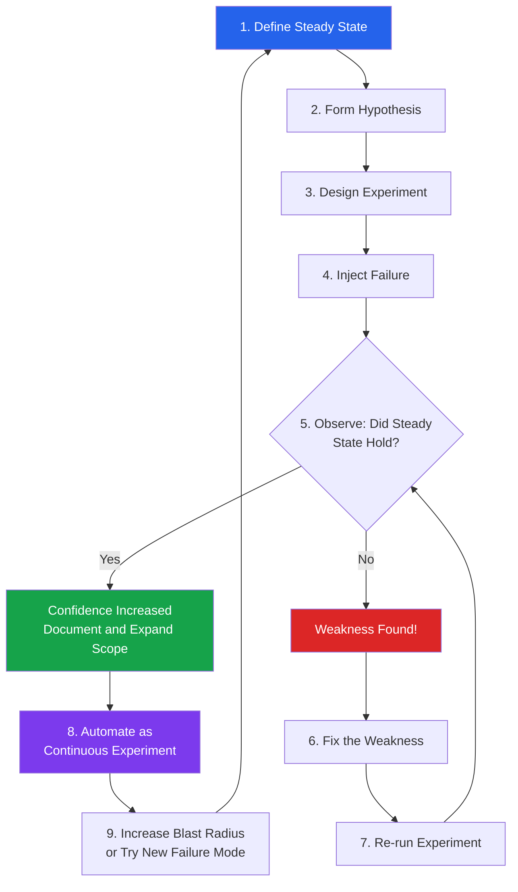
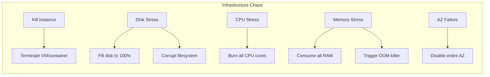
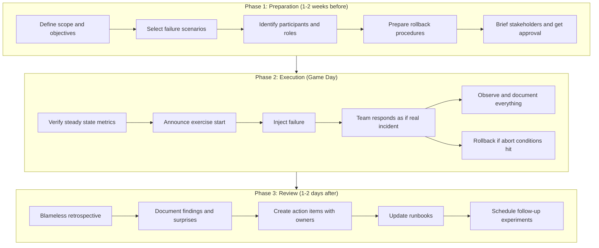
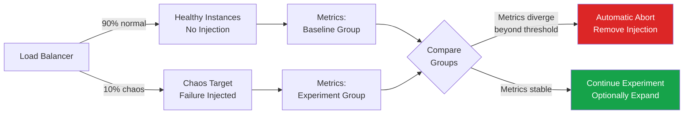

# Chaos Engineering: Principles and Practice

## What Is Chaos Engineering?

Chaos Engineering is the discipline of **deliberately injecting failures into a system
to discover weaknesses before they cause real outages**. It is not random destruction;
it is disciplined, hypothesis-driven experimentation on distributed systems.

The core premise: **if you do not actively test failure modes, the first time you
discover them will be at 3 AM during a production incident.**

Traditional testing asks *"does this code work?"*  
Chaos Engineering asks *"does this **system** survive when things go wrong?"*

```
Traditional Testing          Chaos Engineering
─────────────────────        ─────────────────────
Unit / Integration           System-level resilience
Controlled inputs            Real-world failure events
Pass/fail assertions         Steady-state hypothesis
Pre-production               Production (ideally)
Deterministic                Stochastic / exploratory
```

---

## The Netflix Origin Story

### The Birth of Chaos Monkey (2010-2011)

When Netflix migrated from its own data center to AWS in 2008-2011, engineers
realized a fundamental truth: **cloud instances are inherently unreliable.** Any
virtual machine could disappear at any time.

Rather than hope servers would stay up, Netflix took a radical approach:

> "Let's kill servers randomly during business hours so engineers are forced
> to build systems that tolerate instance failure."

This tool became **Chaos Monkey** -- a program that randomly terminates EC2 instances
in production during working hours.

**Key insight:** By running Chaos Monkey constantly, Netflix ensured that:
1. Every service was designed to tolerate instance loss
2. Auto-scaling and failover were continuously validated
3. Engineers never wrote code that assumed a specific instance would stay alive
4. Failures happened during business hours, when people were awake to respond

### Timeline of Netflix Chaos Engineering

| Year | Milestone |
|------|-----------|
| 2008 | Netflix begins migration to AWS |
| 2010 | Chaos Monkey created internally |
| 2011 | Chaos Monkey open-sourced |
| 2012 | Simian Army announced (Latency Monkey, Conformity Monkey, etc.) |
| 2014 | Failure Injection Testing (FIT) framework built |
| 2015 | Chaos Kong exercises -- simulating entire AWS region failures |
| 2017 | ChAP (Chaos Automation Platform) automates experiments continuously |
| 2019 | Netflix publishes "Chaos Engineering" book (O'Reilly) |

---

## The Five Principles of Chaos Engineering

These principles were codified by the Netflix team and published at
**principlesofchaos.org**.

### Principle 1: Build a Hypothesis Around Steady State Behavior

Before breaking anything, define what "healthy" looks like using **measurable
metrics** -- not just "the system is up."

```
Steady State Metrics (examples):
──────────────────────────────────────────────────────
- Request success rate: >= 99.9%
- p99 latency: < 300ms
- Orders per minute: within 2 standard deviations of normal
- Error rate: < 0.1%
- Revenue per second: within expected range
- Cart abandonment rate: stable
```

**Why this matters in interviews:** Interviewers want to hear that you define
measurable SLIs/SLOs *before* running chaos experiments, not vague notions
of "the system works."

### Principle 2: Vary Real-World Events

Inject failures that **actually happen in production**, not contrived
laboratory conditions.

| Category | Real-World Events |
|----------|-------------------|
| Hardware | Server crashes, disk failures, NIC failures |
| Network | Packet loss, latency spikes, DNS failure, network partition |
| Application | Memory leaks, thread exhaustion, deadlocks |
| Dependencies | Third-party API outage, database failover, cache eviction |
| Human | Bad config push, accidental deletion, wrong deploy |
| Cloud | AZ failure, region outage, API throttling |

### Principle 3: Run Experiments in Production

Staging environments can never fully replicate production's:
- Traffic patterns and load
- Data volume and distribution
- Service interaction complexity
- Infrastructure configuration nuances

> "The system you test in staging is not the system that runs in production."

This does NOT mean reckless destruction. It means experiments with **controlled
blast radius** in the real environment.

### Principle 4: Automate Experiments to Run Continuously

A one-time experiment proves resilience at one point in time. Systems change
daily -- new deploys, new dependencies, config changes. Chaos experiments
must run **continuously** to catch regressions.

```
Manual Game Day          vs.        Continuous Chaos
──────────────────────              ──────────────────────
Quarterly at best                   Daily or hourly
High coordination cost              Automated, low overhead
Covers planned scenarios            Catches unexpected drift
Team learns intensely               System proves resilience constantly
```

### Principle 5: Minimize Blast Radius

Start small. Expand gradually. Always have abort conditions.

```
Blast Radius Progression:
──────────────────────────────────────────────────────

[Stage 1]  Single instance in staging
     |
[Stage 2]  Single instance in production
     |
[Stage 3]  Small % of production traffic (canary chaos)
     |
[Stage 4]  Full AZ failure simulation
     |
[Stage 5]  Regional failover exercise
```

---

## The Chaos Engineering Experiment Lifecycle

Every chaos experiment follows a rigorous scientific method.



### Step-by-Step Breakdown

#### Step 1: Define Steady State

Identify the **business-level metrics** that indicate the system is healthy.

```yaml
# Example: E-commerce platform steady state definition
steady_state:
  metrics:
    - name: order_success_rate
      source: prometheus
      query: "sum(rate(orders_total{status='success'}[5m])) / sum(rate(orders_total[5m]))"
      threshold: ">= 0.999"
    - name: p99_latency_ms
      source: prometheus
      query: "histogram_quantile(0.99, rate(http_request_duration_ms_bucket[5m]))"
      threshold: "<= 300"
    - name: error_rate
      source: prometheus
      query: "sum(rate(http_responses_total{code=~'5..'}[5m])) / sum(rate(http_responses_total[5m]))"
      threshold: "<= 0.001"
  evaluation_period: 5m
  warmup_period: 2m
```

#### Step 2: Form Hypothesis

State what you expect to happen in precise, falsifiable terms.

> "When we terminate 1 of 3 instances of the payment-service in us-east-1,
> the order success rate will remain above 99.9% and p99 latency will stay
> below 300ms because the load balancer will route traffic to surviving
> instances and new instances will spin up within 60 seconds."

#### Step 3: Design the Experiment

```yaml
experiment:
  name: "payment-service-instance-failure"
  description: "Verify payment service tolerates single instance loss"
  target:
    service: payment-service
    environment: production
    region: us-east-1
  injection:
    type: instance-termination
    count: 1
    selection: random
  blast_radius:
    max_instances_affected: 1
    max_traffic_affected_percent: 33
  abort_conditions:
    - metric: order_success_rate
      threshold: "< 0.995"        # 5x worse than SLO
    - metric: p99_latency_ms
      threshold: "> 1000"
    - metric: error_rate
      threshold: "> 0.01"
  duration: 15m
  rollback:
    automatic: true
    action: "scale up payment-service by 1 instance"
```

#### Step 4: Inject Failure

Execute the experiment with monitoring in place and the team aware.

#### Step 5: Observe

Compare real-time metrics against the steady state definition.

```
Timeline of a Chaos Experiment:
────────────────────────────────────────────────────────────────

 t=0      t=2m        t=3m              t=10m          t=15m
  |        |           |                  |              |
  v        v           v                  v              v
Start   Warmup     Inject           Auto-scale       End
Obs.    Complete   Failure          Replaces          Experiment
                   ├── Latency      Instance
                   │   spike?
                   ├── Errors?
                   └── Recovery
                       time?
```

#### Step 6-7: Fix and Re-run

If the hypothesis was disproved, the weakness is now a **known issue** with
real production evidence -- far more compelling than a theoretical concern.

#### Step 8-9: Automate and Expand

Once fixed and validated, add the experiment to the continuous suite and
move on to larger blast radii or new failure modes.

---

## Types of Failure Injection

### Infrastructure Failures



| Attack | What It Tests | Expected Resilience |
|--------|--------------|---------------------|
| Kill instance | Auto-scaling, load balancing | Traffic shifts, new instance launches |
| Fill disk | Log rotation, disk monitoring | Alerts fire, cleanup runs, app degrades gracefully |
| CPU stress | Throttling, autoscaling triggers | Horizontal scale-out, load shedding |
| Memory exhaustion | OOM handling, container limits | Container restart, circuit breakers trip |
| AZ failure | Multi-AZ architecture | Traffic failover to surviving AZs |

### Network Failures

| Attack | Simulation | Impact |
|--------|-----------|--------|
| Latency injection | Add 500ms-5s delay | Exposes missing timeouts, cascading slowdowns |
| Packet loss | Drop 5-50% of packets | Tests retry logic and idempotency |
| Network partition | Block traffic between services | Tests circuit breakers, fallback paths |
| DNS failure | Return NXDOMAIN or timeout | Tests DNS caching, hardcoded fallbacks |
| Bandwidth throttle | Limit to 1 Mbps | Tests behavior under constrained networks |

### Application Failures

| Attack | Simulation | What You Learn |
|--------|-----------|----------------|
| Exception injection | Force errors in specific code paths | Error handling quality |
| Thread exhaustion | Consume all threads in a pool | Bulkhead isolation effectiveness |
| Connection pool drain | Exhaust DB connection pool | Connection pool sizing, timeout config |
| Dependency failure | Block calls to downstream service | Circuit breaker behavior, fallback quality |
| Memory leak | Gradually consume memory | Monitoring sensitivity, GC behavior |

### State Failures

| Attack | Simulation | Risk Exposed |
|--------|-----------|-------------|
| Data corruption | Write invalid data to DB/cache | Validation, data integrity checks |
| Clock skew | Shift system clock forward/back | Certificate validation, token expiry, cron jobs |
| Config change | Push invalid configuration | Config validation, rollback capability |
| Cache poisoning | Insert stale/wrong cache entries | Cache invalidation correctness |
| Leader election disruption | Kill the leader node | Consensus protocol correctness, failover time |

---

## Game Days: Planned Chaos Exercises

A **Game Day** is a planned, team-wide chaos exercise where engineers
deliberately break something and practice incident response in a controlled setting.

### Game Day vs. Automated Chaos

```
Game Day                              Automated Chaos
──────────────────────────            ──────────────────────────
Human learning is the goal            System resilience is the goal
Planned, scheduled                    Continuous, automated
Entire team participates              Runs in background
Novel, complex scenarios              Repeatable known failures
Practices incident response           Validates technical controls
Quarterly cadence                     Daily/hourly cadence
```

### How to Run a Game Day



### Game Day Roles

| Role | Responsibility |
|------|---------------|
| **Game Master** | Orchestrates the exercise, decides when to escalate or abort |
| **Attacker** | Executes the failure injection |
| **Responders** | Engineers who detect, diagnose, and mitigate (practice incident response) |
| **Observers** | Watch and document team behavior, communication gaps, tool gaps |
| **Safety Officer** | Monitors blast radius, triggers abort if thresholds are breached |

### Game Day Communication Template

```
PRE-GAME ANNOUNCEMENT:
────────────────────────────────────────────────────────
Subject: [GAME DAY] Chaos Exercise - Payment Service Resilience
Date: Thursday, 2PM-4PM EST
Scope: Payment service in us-east-1 production
Blast Radius: Max 10% of payment traffic affected
Abort Condition: Order success rate drops below 99.5%
Safety Officer: @jane-smith
Game Master: @bob-jones

Customer-facing impact: None expected. Abort procedures ready.
Escalation: #incident-response Slack channel

DURING EXERCISE:
[GAME DAY IN PROGRESS] Injecting network latency to payment-db at 2:15 PM

POST-GAME:
[GAME DAY COMPLETE] Exercise concluded at 3:45 PM.
Findings will be shared in retrospective doc.
```

---

## Blast Radius Control

Blast radius control is the most critical safety mechanism in chaos engineering.
**Every experiment must have clearly defined boundaries and automatic abort.**

### Canary Chaos

Apply failures to only a small percentage of traffic, similar to canary deployments.



### Abort Conditions

Every experiment must define automatic rollback triggers.

```yaml
abort_conditions:
  # Hard abort: immediately stop experiment
  hard_abort:
    - condition: "error_rate > 5%"
      action: "immediately remove all injections"
    - condition: "revenue_per_minute drops 20% below baseline"
      action: "immediately remove all injections"
    - condition: "safety_officer triggers manual abort"
      action: "immediately remove all injections"

  # Soft abort: pause and evaluate
  soft_abort:
    - condition: "p99_latency > 2x baseline for 2 minutes"
      action: "pause injection, evaluate, decide to continue or abort"
    - condition: "error_rate > 1% for 1 minute"
      action: "pause injection, alert on-call, evaluate"

  # Time-based safety
  max_duration: 30m
  business_hours_only: true
  blackout_periods:
    - "Black Friday week"
    - "Last day of quarter"
    - "During planned maintenance windows"
```

### Progressive Blast Radius Expansion

```
Week 1: Kill 1 pod of payment-service in staging
         └── Found: no health check configured
             Fixed: added /health endpoint and readiness probe

Week 2: Kill 1 pod of payment-service in production
         └── Found: auto-scaling too slow (5 min)
             Fixed: reduced scale-up time to 30 seconds

Week 4: Kill 2 of 6 pods simultaneously
         └── Found: connection pool exhaustion under 2x load per instance
             Fixed: increased pool size, added circuit breaker

Week 8: Simulate full AZ failure
         └── Found: sticky sessions caused uneven failover
             Fixed: switched to stateless session management

Week 12: Simulate regional failover
          └── Found: DNS TTL too long (10 min)
              Fixed: reduced TTL to 60 seconds, added health-based routing
```

---

## Chaos Engineering Maturity Model

```
Level 0: Ad Hoc
  └── "We don't do chaos engineering"
  └── Failures are only discovered in real incidents

Level 1: Initial
  └── Occasional Game Days
  └── Manual failure injection in staging
  └── Basic monitoring exists

Level 2: Defined
  └── Regular Game Days (quarterly)
  └── Experiments run in production with controls
  └── Steady state metrics defined for key services
  └── Abort conditions documented

Level 3: Managed
  └── Automated chaos experiments run continuously
  └── Chaos experiments in CI/CD pipeline
  └── Experiment results feed into SLO tracking
  └── Chaos coverage tracked per service

Level 4: Optimized
  └── Chaos experiments auto-discover new failure modes
  └── ML-driven steady state detection
  └── Chaos experiments required before production deploy
  └── Organization-wide chaos culture
```

---

## Common Chaos Engineering Mistakes

| Mistake | Why It's Wrong | What to Do Instead |
|---------|---------------|-------------------|
| Running chaos without monitoring | You can't observe what you can't measure | Ensure observability stack is solid first |
| No abort conditions | Uncontrolled blast radius | Always define hard and soft abort triggers |
| Starting in production | Risk of real outage before you learn the tools | Start in staging, graduate to production |
| Only testing infrastructure | App-level failures are more common | Test all four failure categories |
| No hypothesis | Random destruction, not engineering | Always state what you expect to happen |
| Not fixing findings | Chaos without follow-through is just damage | Track fixes as production incidents |
| Only during Game Days | Resilience regresses between exercises | Automate experiments to run continuously |
| Blaming individuals | Kills the culture of learning | Always run blameless retrospectives |

---

## Chaos Engineering vs. Related Practices

```
                    Chaos Engineering
                    ├── Proactive failure discovery
                    ├── Hypothesis-driven
                    └── Production experiments
                         |
        ┌────────────────┼────────────────┐
        v                v                v
  Fault Injection    Disaster        Resilience
  Testing (FIT)      Recovery (DR)   Testing
  ├── Specific       ├── Planned     ├── Load testing
  │   failure modes  │   failover    ├── Stress testing
  ├── Automated      ├── Full site   └── Soak testing
  └── Continuous     │   failover
                     └── Annual/
                         semi-annual
```

| Practice | Scope | Frequency | Goal |
|----------|-------|-----------|------|
| Chaos Engineering | Exploratory | Continuous | Discover unknown weaknesses |
| Fault Injection Testing | Specific failures | Continuous | Validate known resilience |
| Disaster Recovery | Full site failover | Annual | Validate business continuity |
| Load Testing | Performance limits | Per release | Find capacity boundaries |
| Resilience Testing | System behavior under stress | Per release | Validate degradation handling |

---

## Interview Framing: Why Chaos Engineering Matters

When discussing system design in interviews, chaos engineering demonstrates
**mature operational thinking**:

1. **You design for failure, not just success** -- "I would run chaos experiments
   to verify this circuit breaker actually trips under real conditions"

2. **You validate assumptions** -- "Our hypothesis is that losing one database
   replica won't affect read latency; let's test that"

3. **You think in steady state** -- "The SLO is 99.9% success rate; chaos
   experiments continuously prove we meet it under failure conditions"

4. **You understand blast radius** -- "We'd start by killing one pod in staging,
   then expand to production canary before running AZ-level experiments"

> "We don't just build resilient systems -- we prove they're resilient
> through continuous chaos experimentation."
