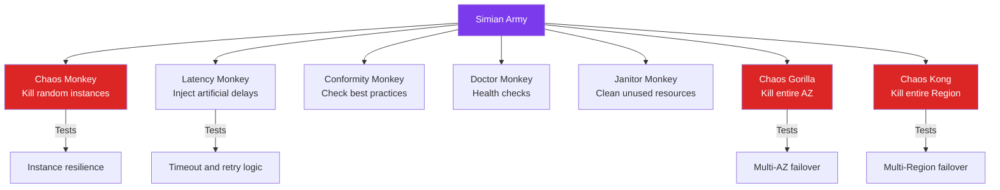
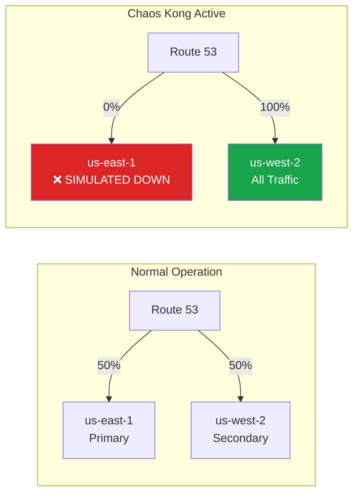
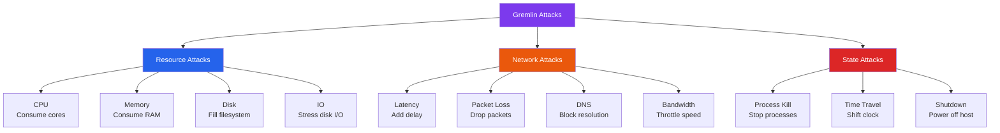
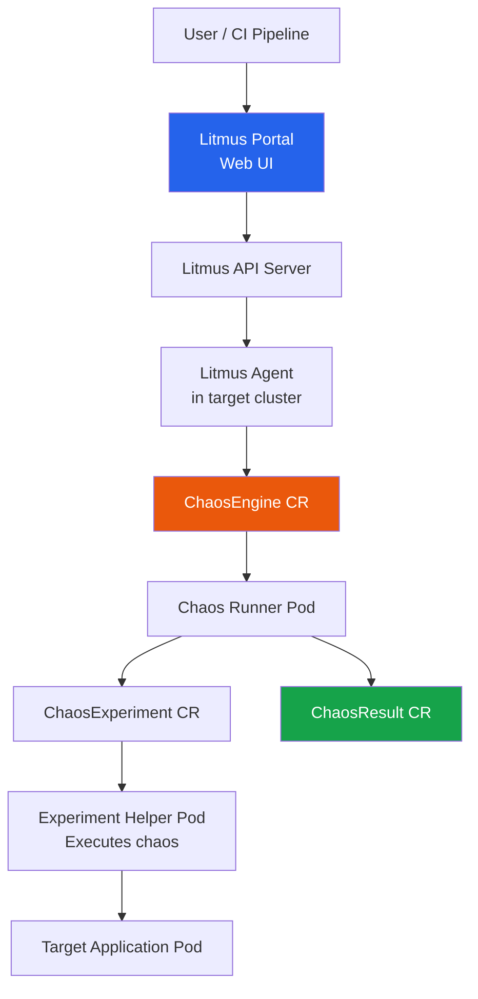
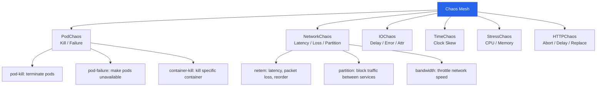
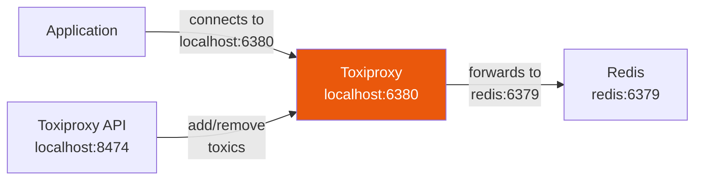
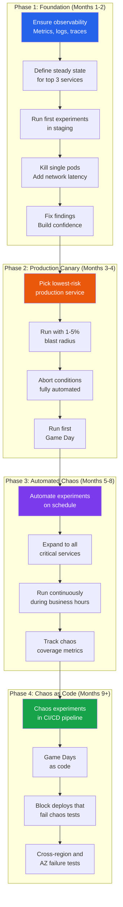
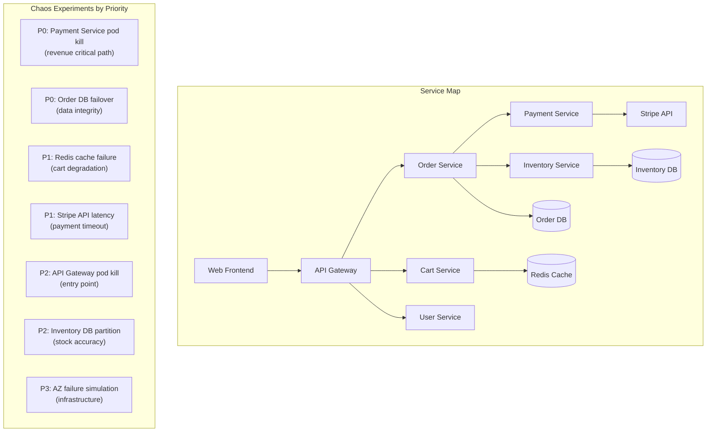

# Chaos Engineering: Tools and Implementation

## Netflix Simian Army

Netflix pioneered the concept of a "Simian Army" -- a suite of tools that each
address a different dimension of system resilience.



### Chaos Monkey

The original and most famous chaos tool. Kills **random production instances**
during business hours.

**How it works:**
1. Runs on a schedule (business hours, weekdays)
2. Selects a random Auto Scaling Group
3. Terminates a random instance in that group
4. Relies on ASG and load balancer to heal automatically

```
Chaos Monkey Decision Flow:
────────────────────────────────────────────
Is it a business day?
  └── Yes: Is it within business hours?
        └── Yes: Pick random ASG marked as "chaos-enabled"
              └── Pick random instance in that ASG
                    └── Terminate instance
                    └── Log: which instance, which service, when
  └── No: Sleep until next business day
```

**Why business hours?** Forces engineers to build resilient systems when they
are at their desks to observe and respond, rather than at 3 AM.

### Latency Monkey

Injects artificial delays into RESTful service-to-service communication.

| Mode | Latency | Purpose |
|------|---------|---------|
| Mild | +100-500ms | Test timeout configurations |
| Medium | +1-5s | Test circuit breaker thresholds |
| Extreme | +30-60s | Simulate complete dependency slowness |

**What it exposes:** Missing timeouts, cascading slowdowns, thread pool
exhaustion, and services that block on slow downstream calls.

### Conformity Monkey

Not a failure injector -- a **compliance checker** that verifies instances
follow best practices:

- Instance is part of an Auto Scaling Group
- Health checks are configured
- Instances are not running in a single AZ
- Security groups follow policy
- Required tags are present

### Doctor Monkey

Runs health checks across the fleet:
- CPU/memory utilization monitoring
- Instance responsiveness checks
- Removes unhealthy instances from service
- Alerts on persistent health issues

### Janitor Monkey

Cleans up unused resources to reduce cost and complexity:
- Detached EBS volumes
- Old AMIs and snapshots
- Unused Elastic IPs
- Empty Auto Scaling Groups
- Expired resources

### Chaos Gorilla -- AZ Failure

Simulates the failure of an **entire Availability Zone** by making all
instances in one AZ unreachable.

**What it tests:**
- Multi-AZ deployment architecture
- Load balancer AZ-aware routing
- Database failover (multi-AZ RDS)
- Cache replication across AZs

### Chaos Kong -- Region Failure

The most extreme test: simulates the failure of an **entire AWS region**.



**What it validates:**
- DNS-based regional failover (Route 53 health checks)
- Cross-region data replication lag
- Session/state management across regions
- Whether the surviving region can handle 100% of traffic

---

## Gremlin (Commercial Platform)

Gremlin is the leading commercial chaos engineering platform, founded by
former Netflix chaos engineers.

### Attack Categories



### SafeGuards: Automatic Rollback

Gremlin SafeGuards automatically halt experiments when safety conditions
are breached.

```yaml
# Gremlin SafeGuard Configuration
safeguards:
  global:
    - name: "Halt on high error rate"
      metric: error_rate
      provider: datadog
      condition: "> 5%"
      action: halt_all_attacks

    - name: "Halt on CPU threshold"
      metric: system.cpu.user
      provider: datadog
      condition: "> 95%"
      action: halt_all_attacks

  per_experiment:
    max_targets: 3
    max_concurrent_attacks: 1
    require_health_check: true
    business_hours_only: false
```

### Gremlin Scenarios

Pre-built, multi-step failure scenarios that simulate real incidents:

```yaml
# Gremlin Scenario: Dependency Outage
scenario:
  name: "Payment Gateway Outage"
  description: "Simulate Stripe being unreachable"
  steps:
    - attack: network-blackhole
      target: payment-service
      config:
        hostnames: ["api.stripe.com"]
        duration: 300s
      observe:
        - "Does circuit breaker trip within 30s?"
        - "Does fallback to backup gateway activate?"
        - "Are orders queued for retry?"
    - attack: dns-failure
      target: payment-service
      config:
        hostnames: ["api.stripe.com"]
        duration: 300s
      observe:
        - "Does DNS cache prevent immediate failure?"
        - "How long until DNS cache expires?"
```

---

## Litmus (CNCF, Kubernetes-Native)

Litmus is a **Cloud Native Computing Foundation (CNCF)** project purpose-built
for Kubernetes chaos engineering using Custom Resource Definitions (CRDs).

### Architecture



### Key CRDs

| CRD | Purpose |
|-----|---------|
| `ChaosEngine` | Binds an experiment to a target application |
| `ChaosExperiment` | Defines the chaos parameters (what to break, how) |
| `ChaosResult` | Stores experiment outcomes (pass/fail, metrics) |

### Litmus YAML Example: Pod Kill

```yaml
# ChaosEngine - binds experiment to target
apiVersion: litmuschaos.io/v1alpha1
kind: ChaosEngine
metadata:
  name: payment-chaos
  namespace: production
spec:
  appinfo:
    appns: production
    applabel: "app=payment-service"
    appkind: deployment
  engineState: active
  chaosServiceAccount: litmus-admin
  experiments:
    - name: pod-delete
      spec:
        components:
          env:
            - name: TOTAL_CHAOS_DURATION
              value: "30"
            - name: CHAOS_INTERVAL
              value: "10"
            - name: FORCE
              value: "false"
            - name: PODS_AFFECTED_PERC
              value: "50"
        probe:
          - name: "check-payment-health"
            type: httpProbe
            httpProbe/inputs:
              url: "http://payment-service.production:8080/health"
              method:
                get:
                  criteria: "=="
                  responseCode: "200"
            mode: Continuous
            runProperties:
              probeTimeout: 5
              interval: 5
              retry: 2
---
# ChaosExperiment - defines the experiment
apiVersion: litmuschaos.io/v1alpha1
kind: ChaosExperiment
metadata:
  name: pod-delete
  namespace: production
spec:
  definition:
    scope: Namespaced
    permissions:
      - apiGroups: ["", "apps"]
        resources: ["pods", "deployments"]
        verbs: ["get", "list", "delete"]
    image: litmuschaos/go-runner:latest
    args:
      - -c
      - ./experiments -name pod-delete
    command:
      - /bin/bash
    env:
      - name: TOTAL_CHAOS_DURATION
        value: "30"
      - name: CHAOS_INTERVAL
        value: "10"
```

### Litmus Network Chaos Example

```yaml
apiVersion: litmuschaos.io/v1alpha1
kind: ChaosEngine
metadata:
  name: network-chaos
  namespace: production
spec:
  appinfo:
    appns: production
    applabel: "app=order-service"
    appkind: deployment
  engineState: active
  chaosServiceAccount: litmus-admin
  experiments:
    - name: pod-network-latency
      spec:
        components:
          env:
            - name: NETWORK_INTERFACE
              value: "eth0"
            - name: NETWORK_LATENCY
              value: "500"           # 500ms added latency
            - name: TOTAL_CHAOS_DURATION
              value: "60"
            - name: DESTINATION_IPS
              value: "10.0.0.50"     # Target specific downstream service
            - name: JITTER
              value: "100"           # +/- 100ms jitter
```

---

## AWS Fault Injection Simulator (FIS)

AWS-managed chaos engineering service that integrates natively with AWS resources.

### Supported Actions

| Target | Actions |
|--------|---------|
| EC2 | Stop/terminate instances, inject API errors, stress CPU/memory |
| ECS | Stop tasks, drain container instances |
| EKS | Terminate node groups, inject pod failures |
| RDS | Failover DB instance, reboot |
| Network | Disrupt connectivity, add latency |
| AZ | Simulate AZ power outage |
| IAM | Inject API throttling errors |

### FIS Experiment Template

```json
{
  "description": "Simulate AZ failure for payment service",
  "targets": {
    "payment-instances": {
      "resourceType": "aws:ec2:instance",
      "resourceArns": [],
      "selectionMode": "ALL",
      "filters": [
        {
          "path": "Tag.Service",
          "values": ["payment-service"]
        },
        {
          "path": "Placement.AvailabilityZone",
          "values": ["us-east-1a"]
        }
      ]
    }
  },
  "actions": {
    "stop-instances": {
      "actionId": "aws:ec2:stop-instances",
      "parameters": {
        "startInstancesAfterDuration": "PT5M"
      },
      "targets": {
        "Instances": "payment-instances"
      }
    }
  },
  "stopConditions": [
    {
      "source": "aws:cloudwatch:alarm",
      "value": "arn:aws:cloudwatch:us-east-1:123456789:alarm:PaymentErrorRateHigh"
    }
  ],
  "roleArn": "arn:aws:iam::123456789:role/FISExperimentRole"
}
```

### FIS Stop Conditions

FIS integrates with CloudWatch alarms to automatically stop experiments:

```
CloudWatch Alarm: PaymentErrorRateHigh
  Metric: 5xx error rate > 1%
  Period: 1 minute
  Evaluation: 1 out of 1

When alarm triggers --> FIS automatically stops the experiment
                    --> All injected faults are rolled back
```

---

## Chaos Mesh (Kubernetes)

Chaos Mesh is an open-source chaos engineering platform for Kubernetes with
a rich web dashboard.

### Chaos Types



### Chaos Mesh YAML Examples

**Pod Kill:**
```yaml
apiVersion: chaos-mesh.org/v1alpha1
kind: PodChaos
metadata:
  name: pod-kill-payment
  namespace: chaos-testing
spec:
  action: pod-kill
  mode: one               # Kill one pod matching selector
  selector:
    namespaces:
      - production
    labelSelectors:
      app: payment-service
  duration: "60s"
  scheduler:
    cron: "@every 2h"     # Run every 2 hours
```

**Network Latency:**
```yaml
apiVersion: chaos-mesh.org/v1alpha1
kind: NetworkChaos
metadata:
  name: network-delay-payment
  namespace: chaos-testing
spec:
  action: delay
  mode: all
  selector:
    namespaces:
      - production
    labelSelectors:
      app: payment-service
  delay:
    latency: "200ms"
    jitter: "50ms"
    correlation: "25"
  direction: to
  target:
    selector:
      namespaces:
        - production
      labelSelectors:
        app: database
    mode: all
  duration: "5m"
```

**Time Chaos (Clock Skew):**
```yaml
apiVersion: chaos-mesh.org/v1alpha1
kind: TimeChaos
metadata:
  name: time-skew-auth
  namespace: chaos-testing
spec:
  mode: all
  selector:
    namespaces:
      - production
    labelSelectors:
      app: auth-service
  timeOffset: "-2h"       # Shift clock back 2 hours
  duration: "5m"
  # Tests: JWT expiration, certificate validation,
  #        rate limiter windows, cache TTLs
```

---

## Toxiproxy (Shopify)

Toxiproxy is a **TCP proxy** that sits between your application and its
dependencies to simulate network conditions. It is lightweight and ideal
for development and testing environments.

### Architecture



### Toxiproxy Configuration

```json
[
  {
    "name": "redis",
    "listen": "0.0.0.0:6380",
    "upstream": "redis:6379",
    "enabled": true
  },
  {
    "name": "postgres",
    "listen": "0.0.0.0:5433",
    "upstream": "postgres:5432",
    "enabled": true
  },
  {
    "name": "stripe-api",
    "listen": "0.0.0.0:4430",
    "upstream": "api.stripe.com:443",
    "enabled": true
  }
]
```

### Adding Toxics (Failure Injection)

```bash
# Add 500ms latency to Redis connections
toxiproxy-cli toxic add redis \
  --type latency \
  --attribute latency=500 \
  --attribute jitter=100

# Add 30% packet loss to Postgres connections
toxiproxy-cli toxic add postgres \
  --type slow_close \
  --attribute delay=1000

# Limit bandwidth to Stripe API to 10 KB/s
toxiproxy-cli toxic add stripe-api \
  --type bandwidth \
  --attribute rate=10

# Simulate connection timeout (no response)
toxiproxy-cli toxic add redis \
  --type timeout \
  --attribute timeout=5000

# Completely sever the connection
toxiproxy-cli toggle redis  # Disables the proxy entirely
```

### Available Toxics

| Toxic | Effect | Use Case |
|-------|--------|----------|
| `latency` | Add delay (ms) | Test timeout configs |
| `bandwidth` | Limit throughput (KB/s) | Test under slow networks |
| `slow_close` | Delay connection close | Test connection pool behavior |
| `timeout` | Stop all data flow | Test complete dependency failure |
| `slicer` | Slice data into small bits | Test message framing |
| `limit_data` | Close connection after N bytes | Test partial response handling |

### Toxiproxy in Integration Tests

```go
// Go example: Testing Redis resilience with Toxiproxy
func TestOrderService_RedisDown(t *testing.T) {
    // Create proxy
    proxy, _ := toxiClient.CreateProxy("redis",
        "localhost:6380", "redis:6379")

    // Add latency toxic
    proxy.AddToxic("latency", "latency", "downstream", 1, toxiproxy.Attributes{
        "latency": 2000,  // 2 second delay
    })

    // Test: order service should fall back to DB when Redis is slow
    order, err := orderService.GetOrder("order-123")
    assert.NoError(t, err)     // Should not error
    assert.NotNil(t, order)    // Should get data from DB fallback

    // Verify circuit breaker was tripped
    assert.True(t, orderService.IsCircuitOpen("redis"))

    // Clean up
    proxy.Delete()
}
```

---

## Tool Comparison

| Feature | Simian Army | Gremlin | Litmus | Chaos Mesh | AWS FIS | Toxiproxy |
|---------|-------------|---------|--------|------------|---------|-----------|
| **Type** | Open-source (archived) | Commercial SaaS | Open-source (CNCF) | Open-source | Managed AWS | Open-source |
| **Platform** | AWS-specific | Any (agent-based) | Kubernetes | Kubernetes | AWS only | Any (proxy) |
| **Instance kill** | Yes | Yes | Yes | Yes | Yes | No |
| **Network chaos** | Partial | Yes | Yes | Yes | Yes | Yes |
| **CPU/Memory stress** | No | Yes | Yes | Yes | Yes | No |
| **Time chaos** | No | Yes (time travel) | No | Yes | No | No |
| **IO chaos** | No | Yes | Yes | Yes | No | No |
| **HTTP chaos** | No | Yes | Yes | Yes | No | Partial |
| **Auto-rollback** | No | SafeGuards | Probes | Duration-based | CloudWatch alarms | Manual |
| **Dashboard** | No | Yes (SaaS) | Yes (Portal) | Yes | AWS Console | No |
| **CI/CD Integration** | Limited | API + CLI | Yes (native) | Yes | API + CLI | Yes (test code) |
| **Best for** | Historical reference | Enterprise, multi-cloud | K8s-native teams | K8s-native teams | AWS-heavy shops | Dev/test environments |
| **Learning curve** | Medium | Low | Medium | Medium | Low (AWS users) | Low |

---

## How to Start Chaos Engineering: Phased Approach

### Phase 1: Non-Production (Staging)



### Phase 1: Non-Production (Staging)

**Prerequisites before ANY chaos:**
1. Monitoring and alerting are in place (Prometheus, Datadog, etc.)
2. On-call rotation exists
3. Incident response runbooks exist for critical services
4. Auto-scaling is configured and tested

**First experiments:**
```yaml
# Start simple: kill one pod in staging
experiment: pod-kill
target: payment-service (staging)
blast_radius: 1 pod
expected: deployment recreates pod, no impact to health checks
```

### Phase 2: Production with Small Blast Radius

**Graduation criteria from Phase 1:**
- All staging experiments pass consistently
- Team is comfortable with the tools
- Abort conditions are automated and tested
- Stakeholders are informed and supportive

```yaml
# First production experiment
experiment: pod-kill
target: payment-service (production)
blast_radius: 1 of 6 pods (17%)
abort_condition: error_rate > 0.5%
time_window: Tuesday 2 PM (peak hours, team available)
communication: #chaos-engineering Slack channel
```

### Phase 3: Automated Continuous Chaos

```yaml
# Continuous chaos configuration
schedule:
  experiments:
    - name: random-pod-kill
      target: all-services-with-chaos-label
      frequency: every 4 hours
      blast_radius: 1 pod per service
      business_hours_only: true

    - name: network-latency
      target: service-mesh
      frequency: daily at 11 AM
      injection: 200ms latency between services
      duration: 10 minutes

    - name: az-failure-simulation
      target: us-east-1a
      frequency: weekly, Wednesday 2 PM
      duration: 30 minutes
      requires_game_master: true
```

### Phase 4: Chaos as Part of CI/CD

```yaml
# CI/CD Pipeline with Chaos Stage
pipeline:
  stages:
    - name: build
      steps: [compile, unit-test, lint]

    - name: deploy-staging
      steps: [deploy-to-staging, smoke-test]

    - name: chaos-validation            # Chaos gate
      steps:
        - experiment: pod-kill
          pass_criteria: "zero errors during 5-minute experiment"
        - experiment: network-latency-200ms
          pass_criteria: "p99 < 500ms during injection"
        - experiment: dependency-blackhole
          pass_criteria: "circuit breaker trips within 10s"
      on_failure: block-deploy

    - name: deploy-production
      steps: [canary-deploy, full-rollout]
      requires: chaos-validation.passed
```

---

## Real-World Chaos Engineering Practices

### Netflix

| Practice | Detail |
|----------|--------|
| **Tool** | ChAP (Chaos Automation Platform) |
| **Scope** | All microservices in production |
| **Frequency** | Continuous (automated) |
| **Scale** | Chaos Kong exercises simulate entire region failure |
| **Key finding** | Discovered that losing one region caused 2x traffic to other, exceeding capacity. Led to always-on regional over-provisioning. |

### Amazon

| Practice | Detail |
|----------|--------|
| **Tool** | Internal "GameDay" framework + FIS |
| **Scope** | All AWS services |
| **Frequency** | Regular Game Days per team |
| **Scale** | AZ and region-level failure exercises |
| **Key finding** | Discovered dependency chains where one service failure cascaded across 6 downstream services. Led to circuit breaker mandate. |

### Uber

| Practice | Detail |
|----------|--------|
| **Tool** | Internal chaos platform |
| **Scope** | All critical path services (ride matching, pricing, dispatch) |
| **Frequency** | Weekly automated experiments |
| **Key finding** | Discovered that DNS TTL settings caused 10-minute failover delays during data center switchover. Reduced TTL from 300s to 30s. |

### LinkedIn

| Practice | Detail |
|----------|--------|
| **Tool** | LinkedOut (internal chaos framework) |
| **Scope** | Service mesh between 1000+ microservices |
| **Frequency** | Continuous, part of deployment pipeline |
| **Key finding** | Found that 30% of services had no fallback when their primary dependency was down. Led to "fallback-required" policy for all services. |

---

## Interview Deep Dive: "How Would You Test Your System's Resilience?"

This is a common follow-up after presenting a system design. Here is a
structured framework for answering.

### Framework: The SHIFT Model

```
S - Steady state:  Define what "healthy" means with metrics
H - Hypothesize:   State what you expect under failure
I - Inject:        Choose the failure type and blast radius
F - Fix:           Remediate anything that breaks the hypothesis
T - Track:         Automate and monitor continuously
```

### Sample Answer

> "After designing this system, I'd validate its resilience using chaos
> engineering principles.
>
> **Steady state:** I'd define steady state as order success rate >= 99.9%,
> p99 latency < 300ms, and the error rate below 0.1%.
>
> **Hypothesis:** 'When one of three payment-service instances fails, the
> system remains in steady state because the load balancer routes to
> survivors and auto-scaling replaces the instance within 60 seconds.'
>
> **Inject:** I'd start in staging by killing one pod, then graduate to
> production with a single pod kill and automatic abort if error rate
> exceeds 0.5%.
>
> **Fix:** When the experiment reveals that our auto-scaling takes 5 minutes
> instead of 60 seconds, we'd fix the scaling policy and re-run.
>
> **Track:** Once validated, I'd automate this as a continuous experiment
> running every 4 hours during business hours, and add it to our CI/CD
> pipeline as a deployment gate."

---

## Interview Questions with Answers

### Q1: What is the difference between chaos engineering and fault injection testing?

**Answer:**
Chaos engineering is **exploratory** -- it aims to discover unknown weaknesses
through hypothesis-driven experiments. Fault injection testing is **specific** --
it validates known resilience mechanisms against predefined failure modes.

Chaos engineering asks "what happens when X fails?" without necessarily knowing
the answer. Fault injection testing says "we know X should trigger failover to
Y; let's verify it does."

In practice, fault injection testing is a subset of chaos engineering. A mature
chaos program includes both exploratory experiments and regression tests for
previously discovered weaknesses.

### Q2: Why run chaos experiments in production instead of staging?

**Answer:**
Staging environments can never perfectly replicate production because:
- Traffic patterns, volume, and user behavior are different
- Data distribution and volume differ
- Infrastructure topology may not match (fewer replicas, different instance types)
- Third-party integrations may use sandbox/mock endpoints
- Timing-dependent issues (race conditions) may only appear under production load

Production chaos with proper blast radius control (canary chaos, automated abort)
gives confidence in the **actual** system, not a simulation of it.

That said, always start with staging to learn the tools and catch obvious failures
before moving to production.

### Q3: How do you convince stakeholders that chaos engineering is worth the risk?

**Answer:**
1. **Frame it as risk reduction, not risk creation.** "We are choosing to find
   problems at 2 PM on Tuesday with controls, rather than discovering them at
   3 AM during a real outage without controls."
2. **Start with the cost of incidents.** If each outage costs $100K, finding one
   weakness through chaos engineering that prevents one outage pays for the program.
3. **Start small.** Begin with staging and low-risk services. Show findings.
4. **Show real findings.** After the first experiment reveals a real weakness,
   stakeholders see the value immediately.
5. **Point to industry leaders.** Netflix, Amazon, Google, Microsoft, and Uber all
   practice chaos engineering in production.

### Q4: What prerequisites must be in place before starting chaos engineering?

**Answer:**
1. **Observability:** You cannot learn from experiments you cannot observe. Metrics,
   logging, and distributed tracing must be in place.
2. **Monitoring and alerting:** Alerts must exist for the steady-state metrics
   so you know when the experiment causes deviation.
3. **Auto-scaling / self-healing:** The system should have basic resilience
   mechanisms (otherwise you already know what will break).
4. **Incident response:** A team and process must be ready to respond if an
   experiment goes wrong.
5. **Stakeholder buy-in:** Management, SRE, and product teams must understand
   and support the practice.

### Q5: Design a chaos engineering strategy for a microservices e-commerce platform.

**Answer:**



**Strategy:**

1. **Map critical paths:** Order flow (Web -> API -> Order -> Payment -> Stripe)
   is the highest priority because it directly impacts revenue.

2. **Priority 0 experiments (Week 1-2):**
   - Kill payment-service pods: verify circuit breaker, retry, and queue behavior
   - Trigger Order DB failover: verify zero-downtime failover, no lost orders

3. **Priority 1 experiments (Week 3-4):**
   - Blackhole Stripe API: verify fallback gateway or order queuing
   - Kill Redis: verify cart service degrades to DB reads, not errors

4. **Priority 2 experiments (Month 2):**
   - API Gateway pod kill: verify horizontal scaling and connection draining
   - Inventory DB network partition: verify stock reservation consistency

5. **Priority 3 experiments (Month 3):**
   - Full AZ failure: verify multi-AZ architecture across all services
   - Regional failover: verify DNS-based routing to secondary region

### Q6: Your chaos experiment caused a real production incident. What do you do?

**Answer:**
1. **Immediately trigger abort** -- remove all injected failures
2. **Treat it as a real incident** -- follow incident response procedure
3. **Mitigate customer impact** -- restore service, communicate status
4. **Run a blameless postmortem** -- the experiment found exactly what it was
   supposed to find (a weakness), but the blast radius control was insufficient
5. **Improve abort conditions** -- tighten thresholds so the abort triggers
   faster next time
6. **Fix the underlying weakness** -- the system should not have been that
   fragile; fix the root cause
7. **Re-run with smaller blast radius** -- validate the fix with tighter controls

> "A chaos experiment that causes an incident is not a failure of chaos
> engineering -- it is a success. It found a real weakness. The only failure
> is if we do not learn from it."

### Q7: How do you measure the ROI of chaos engineering?

**Answer:**
| Metric | How to Measure |
|--------|---------------|
| Weaknesses found | Count of issues discovered through chaos experiments |
| Mean Time to Recovery (MTTR) | Track MTTR before and after starting chaos program |
| Incident frequency | Fewer production incidents over time |
| Incident severity | Lower blast radius of real incidents |
| SLO compliance | Higher percentage of time within SLOs |
| Confidence score | Team's self-reported confidence in system resilience |
| Cost avoidance | Estimated cost of outages prevented by fixing chaos findings |

---

## Quick Reference: Chaos Engineering Checklist

```
Before Your First Experiment:
  [ ] Observability stack is in place (metrics, logs, traces)
  [ ] Steady state metrics defined for target service
  [ ] Alerting configured for steady state metrics
  [ ] Auto-scaling or self-healing is configured
  [ ] Incident response process exists
  [ ] Stakeholders informed and approve
  [ ] Rollback plan documented and tested

During the Experiment:
  [ ] Hypothesis clearly stated
  [ ] Blast radius is minimal and controlled
  [ ] Abort conditions are automated
  [ ] Team is monitoring dashboards
  [ ] Communication channel is open
  [ ] Experiment is time-boxed

After the Experiment:
  [ ] Results documented (hypothesis confirmed or disproved)
  [ ] Findings triaged and assigned owners
  [ ] Fixes validated with re-run
  [ ] Experiment added to continuous automation suite
  [ ] Retrospective held if significant findings
  [ ] Blast radius expanded for next iteration
```
