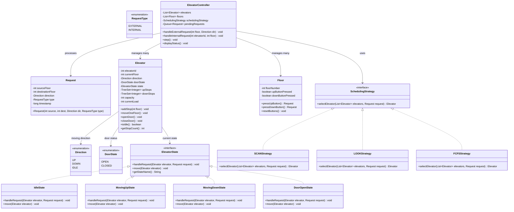

# Elevator System -- Complete Machine Coding Solution

> The #2 most asked machine coding problem at Uber India. Tests state management, scheduling
> algorithms, and multi-entity coordination.

---

## Requirements

### Functional Requirements
1. Building with N floors and M elevators
2. External requests: person on floor X presses UP or DOWN button
3. Internal requests: person inside elevator presses destination floor button
4. Scheduling algorithm decides which elevator serves which request
5. Elevator moves floor by floor, opens/closes doors
6. Display current floor and direction for each elevator

### Non-Functional Requirements (mention, don't implement)
- Thread-safe concurrent request handling
- Priority handling for emergencies
- Power failure recovery

### Confirmed Assumptions
- Elevators serve one request at a time or batch in same direction (SCAN)
- Floors numbered 1 to N (ground floor = 1)
- Door opens automatically on arrival, closes after a timeout
- No weight limit for initial implementation

---

## Class Diagram



---

## Design Patterns Used

| Pattern | Where | Why |
|---------|-------|-----|
| **State** | ElevatorState (Idle, MovingUp, MovingDown, DoorOpen) | Elevator behavior changes entirely based on its current state |
| **Strategy** | SchedulingStrategy (SCAN, LOOK, FCFS) | Swap scheduling algorithms without touching the controller |
| **Observer** | Could add: ElevatorEventListener | Notify display boards when elevator moves (mention, optional) |

---

## Full Java Implementation

### Enums

```java
public enum Direction {
    UP, DOWN, IDLE;
}

public enum DoorState {
    OPEN, CLOSED;
}

public enum RequestType {
    EXTERNAL,  // Someone on a floor pressed UP/DOWN
    INTERNAL;  // Someone inside the elevator pressed a floor button
}
```

### Request

```java
public class Request {
    private final int sourceFloor;
    private final int destinationFloor;
    private final Direction direction;
    private final RequestType type;
    private final long timestamp;

    // External request: person on floor X wants to go UP/DOWN
    public Request(int sourceFloor, Direction direction) {
        this.sourceFloor = sourceFloor;
        this.destinationFloor = -1; // unknown until they enter
        this.direction = direction;
        this.type = RequestType.EXTERNAL;
        this.timestamp = System.currentTimeMillis();
    }

    // Internal request: person inside elevator wants floor Y
    public Request(int sourceFloor, int destinationFloor) {
        this.sourceFloor = sourceFloor;
        this.destinationFloor = destinationFloor;
        this.direction = destinationFloor > sourceFloor ? Direction.UP : Direction.DOWN;
        this.type = RequestType.INTERNAL;
        this.timestamp = System.currentTimeMillis();
    }

    public int getSourceFloor() { return sourceFloor; }
    public int getDestinationFloor() { return destinationFloor; }
    public Direction getDirection() { return direction; }
    public RequestType getType() { return type; }
    public long getTimestamp() { return timestamp; }

    @Override
    public String toString() {
        if (type == RequestType.EXTERNAL) {
            return "ExtReq[floor=" + sourceFloor + ", dir=" + direction + "]";
        }
        return "IntReq[from=" + sourceFloor + ", to=" + destinationFloor + "]";
    }
}
```

### Elevator State Interface

```java
public interface ElevatorState {
    void handleRequest(Elevator elevator, Request request);
    void move(Elevator elevator);
    String getStateName();
}
```

### Concrete States

```java
public class IdleState implements ElevatorState {

    @Override
    public void handleRequest(Elevator elevator, Request request) {
        int targetFloor = (request.getType() == RequestType.EXTERNAL)
                ? request.getSourceFloor()
                : request.getDestinationFloor();

        elevator.addStop(targetFloor);

        if (targetFloor > elevator.getCurrentFloor()) {
            elevator.setDirection(Direction.UP);
            elevator.setState(new MovingUpState());
        } else if (targetFloor < elevator.getCurrentFloor()) {
            elevator.setDirection(Direction.DOWN);
            elevator.setState(new MovingDownState());
        } else {
            // Already on the requested floor
            elevator.setState(new DoorOpenState());
        }
    }

    @Override
    public void move(Elevator elevator) {
        // Idle: do nothing
    }

    @Override
    public String getStateName() { return "IDLE"; }
}

public class MovingUpState implements ElevatorState {

    @Override
    public void handleRequest(Elevator elevator, Request request) {
        int targetFloor = (request.getType() == RequestType.EXTERNAL)
                ? request.getSourceFloor()
                : request.getDestinationFloor();

        // Accept if target is above current floor and going up,
        // or queue it for later
        elevator.addStop(targetFloor);
    }

    @Override
    public void move(Elevator elevator) {
        if (elevator.hasStopAt(elevator.getCurrentFloor())) {
            elevator.removeStop(elevator.getCurrentFloor());
            elevator.setState(new DoorOpenState());
            return;
        }

        Integer nextUpStop = elevator.getNextUpStop();
        if (nextUpStop != null) {
            elevator.moveOneFloor(Direction.UP);
        } else {
            // No more up stops; check down stops or go idle
            Integer nextDownStop = elevator.getNextDownStop();
            if (nextDownStop != null) {
                elevator.setDirection(Direction.DOWN);
                elevator.setState(new MovingDownState());
            } else {
                elevator.setDirection(Direction.IDLE);
                elevator.setState(new IdleState());
            }
        }
    }

    @Override
    public String getStateName() { return "MOVING_UP"; }
}

public class MovingDownState implements ElevatorState {

    @Override
    public void handleRequest(Elevator elevator, Request request) {
        int targetFloor = (request.getType() == RequestType.EXTERNAL)
                ? request.getSourceFloor()
                : request.getDestinationFloor();

        elevator.addStop(targetFloor);
    }

    @Override
    public void move(Elevator elevator) {
        if (elevator.hasStopAt(elevator.getCurrentFloor())) {
            elevator.removeStop(elevator.getCurrentFloor());
            elevator.setState(new DoorOpenState());
            return;
        }

        Integer nextDownStop = elevator.getNextDownStop();
        if (nextDownStop != null) {
            elevator.moveOneFloor(Direction.DOWN);
        } else {
            Integer nextUpStop = elevator.getNextUpStop();
            if (nextUpStop != null) {
                elevator.setDirection(Direction.UP);
                elevator.setState(new MovingUpState());
            } else {
                elevator.setDirection(Direction.IDLE);
                elevator.setState(new IdleState());
            }
        }
    }

    @Override
    public String getStateName() { return "MOVING_DOWN"; }
}

public class DoorOpenState implements ElevatorState {

    @Override
    public void handleRequest(Elevator elevator, Request request) {
        int targetFloor = (request.getType() == RequestType.EXTERNAL)
                ? request.getSourceFloor()
                : request.getDestinationFloor();

        elevator.addStop(targetFloor);
    }

    @Override
    public void move(Elevator elevator) {
        // Close the door and determine next state
        elevator.closeDoor();

        if (elevator.getStopCount() == 0) {
            elevator.setDirection(Direction.IDLE);
            elevator.setState(new IdleState());
            return;
        }

        // Continue in the current direction if possible
        if (elevator.getDirection() == Direction.UP || elevator.getDirection() == Direction.IDLE) {
            Integer nextUp = elevator.getNextUpStop();
            if (nextUp != null) {
                elevator.setDirection(Direction.UP);
                elevator.setState(new MovingUpState());
            } else {
                elevator.setDirection(Direction.DOWN);
                elevator.setState(new MovingDownState());
            }
        } else {
            Integer nextDown = elevator.getNextDownStop();
            if (nextDown != null) {
                elevator.setDirection(Direction.DOWN);
                elevator.setState(new MovingDownState());
            } else {
                elevator.setDirection(Direction.UP);
                elevator.setState(new MovingUpState());
            }
        }
    }

    @Override
    public String getStateName() { return "DOOR_OPEN"; }
}
```

### Elevator

```java
import java.util.TreeSet;

public class Elevator {
    private final int elevatorId;
    private int currentFloor;
    private Direction direction;
    private DoorState doorState;
    private ElevatorState state;
    private final TreeSet<Integer> upStops;    // floors to visit going up
    private final TreeSet<Integer> downStops;  // floors to visit going down
    private final int minFloor;
    private final int maxFloor;

    public Elevator(int elevatorId, int minFloor, int maxFloor) {
        this.elevatorId = elevatorId;
        this.currentFloor = minFloor; // start at ground
        this.direction = Direction.IDLE;
        this.doorState = DoorState.CLOSED;
        this.state = new IdleState();
        this.upStops = new TreeSet<>();
        this.downStops = new TreeSet<>();
        this.minFloor = minFloor;
        this.maxFloor = maxFloor;
    }

    // --- State management ---

    public void handleRequest(Request request) {
        state.handleRequest(this, request);
    }

    public void step() {
        state.move(this);
    }

    // --- Stop management ---

    public void addStop(int floor) {
        if (floor < minFloor || floor > maxFloor) {
            throw new IllegalArgumentException(
                "Floor " + floor + " is outside range [" + minFloor + ", " + maxFloor + "]"
            );
        }

        if (floor > currentFloor) {
            upStops.add(floor);
        } else if (floor < currentFloor) {
            downStops.add(floor);
        }
        // If floor == currentFloor, will be handled as door open
    }

    public void removeStop(int floor) {
        upStops.remove(floor);
        downStops.remove(floor);
    }

    public boolean hasStopAt(int floor) {
        return upStops.contains(floor) || downStops.contains(floor);
    }

    public Integer getNextUpStop() {
        Integer ceiling = upStops.ceiling(currentFloor);
        return ceiling;
    }

    public Integer getNextDownStop() {
        Integer floor = downStops.floor(currentFloor);
        return floor;
    }

    public int getStopCount() {
        return upStops.size() + downStops.size();
    }

    // --- Movement ---

    public void moveOneFloor(Direction dir) {
        if (dir == Direction.UP && currentFloor < maxFloor) {
            currentFloor++;
        } else if (dir == Direction.DOWN && currentFloor > minFloor) {
            currentFloor--;
        }
        System.out.println("  Elevator " + elevatorId + " -> Floor " + currentFloor);
    }

    // --- Door ---

    public void openDoor() {
        this.doorState = DoorState.OPEN;
        System.out.println("  Elevator " + elevatorId + " [DOOR OPEN] at Floor " + currentFloor);
    }

    public void closeDoor() {
        this.doorState = DoorState.CLOSED;
    }

    // --- Getters and setters ---

    public int getElevatorId() { return elevatorId; }
    public int getCurrentFloor() { return currentFloor; }
    public Direction getDirection() { return direction; }
    public DoorState getDoorState() { return doorState; }
    public boolean isIdle() { return direction == Direction.IDLE; }

    public void setDirection(Direction direction) { this.direction = direction; }
    public void setState(ElevatorState state) {
        this.state = state;
        if (state instanceof DoorOpenState) {
            openDoor();
        }
    }

    /**
     * Calculates the "cost" of serving a request from this elevator.
     * Used by scheduling strategies to pick the best elevator.
     * Lower cost = better choice.
     */
    public int costToServe(Request request) {
        int targetFloor = (request.getType() == RequestType.EXTERNAL)
                ? request.getSourceFloor()
                : request.getDestinationFloor();

        int distance = Math.abs(currentFloor - targetFloor);

        // If idle, cost is just the distance
        if (isIdle()) {
            return distance;
        }

        // If moving toward the request in the same direction, cost is distance
        if (direction == Direction.UP && targetFloor >= currentFloor
                && request.getDirection() == Direction.UP) {
            return distance;
        }
        if (direction == Direction.DOWN && targetFloor <= currentFloor
                && request.getDirection() == Direction.DOWN) {
            return distance;
        }

        // Otherwise, elevator must finish current direction, reverse, then come back
        // High cost to discourage this assignment
        return distance + (maxFloor - minFloor);
    }

    @Override
    public String toString() {
        return "Elevator " + elevatorId + " [Floor=" + currentFloor
                + ", Dir=" + direction + ", State=" + state.getStateName()
                + ", Stops=" + getStopCount() + "]";
    }
}
```

### Floor

```java
public class Floor {
    private final int floorNumber;
    private boolean upButtonPressed;
    private boolean downButtonPressed;

    public Floor(int floorNumber) {
        this.floorNumber = floorNumber;
        this.upButtonPressed = false;
        this.downButtonPressed = false;
    }

    public Request pressUpButton() {
        this.upButtonPressed = true;
        System.out.println("Floor " + floorNumber + ": UP button pressed");
        return new Request(floorNumber, Direction.UP);
    }

    public Request pressDownButton() {
        this.downButtonPressed = true;
        System.out.println("Floor " + floorNumber + ": DOWN button pressed");
        return new Request(floorNumber, Direction.DOWN);
    }

    public void resetButtons() {
        this.upButtonPressed = false;
        this.downButtonPressed = false;
    }

    public int getFloorNumber() { return floorNumber; }
    public boolean isUpButtonPressed() { return upButtonPressed; }
    public boolean isDownButtonPressed() { return downButtonPressed; }
}
```

### Scheduling Strategy

```java
import java.util.List;

public interface SchedulingStrategy {
    Elevator selectElevator(List<Elevator> elevators, Request request);
}
```

### SCAN Strategy (Elevator Algorithm)

The SCAN algorithm serves requests in the current direction of travel before reversing.
This minimizes unnecessary direction changes.

```java
import java.util.Comparator;
import java.util.List;

/**
 * SCAN Strategy (also known as the Elevator Algorithm):
 * - Prefers elevators already moving toward the request floor in the same direction.
 * - Among idle elevators, prefers the nearest one.
 * - Uses costToServe() which penalizes elevators moving away from the request.
 */
public class SCANStrategy implements SchedulingStrategy {

    @Override
    public Elevator selectElevator(List<Elevator> elevators, Request request) {
        if (elevators == null || elevators.isEmpty()) {
            throw new IllegalStateException("No elevators available");
        }

        return elevators.stream()
                .min(Comparator.comparingInt(e -> e.costToServe(request)))
                .orElseThrow(() -> new IllegalStateException("No elevator could be selected"));
    }
}
```

### LOOK Strategy

```java
import java.util.Comparator;
import java.util.List;

/**
 * LOOK Strategy:
 * - Like SCAN but reverses direction when there are no more requests ahead
 *   (does not go all the way to the end of the shaft).
 * - Selection prefers idle elevators, then same-direction, then nearest.
 */
public class LOOKStrategy implements SchedulingStrategy {

    @Override
    public Elevator selectElevator(List<Elevator> elevators, Request request) {
        // Prefer idle elevators
        Elevator idle = elevators.stream()
                .filter(Elevator::isIdle)
                .min(Comparator.comparingInt(e -> Math.abs(e.getCurrentFloor() - request.getSourceFloor())))
                .orElse(null);

        if (idle != null) {
            return idle;
        }

        // Then prefer elevators moving in the same direction toward the floor
        return elevators.stream()
                .min(Comparator.comparingInt(e -> e.costToServe(request)))
                .orElseThrow(() -> new IllegalStateException("No elevator could be selected"));
    }
}
```

### FCFS Strategy

```java
import java.util.List;

/**
 * First Come First Served:
 * - Assigns to the first idle elevator.
 * - If none idle, assigns to the elevator with fewest stops.
 * - Simplest strategy; not optimal for throughput.
 */
public class FCFSStrategy implements SchedulingStrategy {

    @Override
    public Elevator selectElevator(List<Elevator> elevators, Request request) {
        // First idle elevator
        for (Elevator elevator : elevators) {
            if (elevator.isIdle()) {
                return elevator;
            }
        }

        // If none idle, pick the one with fewest pending stops
        Elevator bestElevator = elevators.get(0);
        for (Elevator elevator : elevators) {
            if (elevator.getStopCount() < bestElevator.getStopCount()) {
                bestElevator = elevator;
            }
        }
        return bestElevator;
    }
}
```

### Elevator Controller

```java
import java.util.*;

public class ElevatorController {
    private final List<Elevator> elevators;
    private final List<Floor> floors;
    private SchedulingStrategy schedulingStrategy;
    private final Queue<Request> pendingRequests;

    public ElevatorController(int numElevators, int numFloors) {
        this.elevators = new ArrayList<>();
        this.floors = new ArrayList<>();
        this.pendingRequests = new LinkedList<>();
        this.schedulingStrategy = new SCANStrategy();

        for (int i = 1; i <= numElevators; i++) {
            elevators.add(new Elevator(i, 1, numFloors));
        }
        for (int i = 1; i <= numFloors; i++) {
            floors.add(new Floor(i));
        }
    }

    public void setSchedulingStrategy(SchedulingStrategy strategy) {
        this.schedulingStrategy = strategy;
    }

    /**
     * Handle an external request (someone on a floor pressed UP or DOWN).
     */
    public void handleExternalRequest(int floorNumber, Direction direction) {
        if (floorNumber < 1 || floorNumber > floors.size()) {
            throw new IllegalArgumentException("Invalid floor: " + floorNumber);
        }

        Floor floor = floors.get(floorNumber - 1);
        Request request;
        if (direction == Direction.UP) {
            request = floor.pressUpButton();
        } else {
            request = floor.pressDownButton();
        }

        Elevator selected = schedulingStrategy.selectElevator(elevators, request);
        System.out.println("  -> Assigned to Elevator " + selected.getElevatorId());
        selected.handleRequest(request);
    }

    /**
     * Handle an internal request (someone inside elevator pressed a floor button).
     */
    public void handleInternalRequest(int elevatorId, int targetFloor) {
        Elevator elevator = getElevatorById(elevatorId);
        if (elevator == null) {
            throw new IllegalArgumentException("Invalid elevator ID: " + elevatorId);
        }

        Request request = new Request(elevator.getCurrentFloor(), targetFloor);
        System.out.println("Elevator " + elevatorId + ": button " + targetFloor + " pressed");
        elevator.handleRequest(request);
    }

    /**
     * Advance the simulation by one time step.
     * Each elevator processes one move.
     */
    public void step() {
        for (Elevator elevator : elevators) {
            elevator.step();
        }
    }

    /**
     * Run multiple steps to let elevators reach their destinations.
     */
    public void runSteps(int count) {
        for (int i = 0; i < count; i++) {
            System.out.println("--- Step " + (i + 1) + " ---");
            step();
            displayStatus();
        }
    }

    public void displayStatus() {
        System.out.println("Status:");
        for (Elevator elevator : elevators) {
            System.out.println("  " + elevator);
        }
    }

    private Elevator getElevatorById(int id) {
        return elevators.stream()
                .filter(e -> e.getElevatorId() == id)
                .findFirst()
                .orElse(null);
    }

    public List<Elevator> getElevators() { return elevators; }
    public List<Floor> getFloors() { return floors; }
}
```

### Main.java -- Complete Demo

```java
public class Main {
    public static void main(String[] args) {
        System.out.println("=== ELEVATOR SYSTEM DEMO ===\n");

        // Building: 3 elevators, 10 floors
        ElevatorController controller = new ElevatorController(3, 10);
        controller.setSchedulingStrategy(new SCANStrategy());

        controller.displayStatus();

        // --- Scenario 1: Person on Floor 5 presses UP ---
        System.out.println("\n--- Scenario 1: Floor 5, UP button ---");
        controller.handleExternalRequest(5, Direction.UP);

        // Simulate steps: elevator moves from Floor 1 to Floor 5
        controller.runSteps(5);

        // Person enters elevator and presses Floor 8
        System.out.println("\n--- Person enters, presses Floor 8 ---");
        controller.handleInternalRequest(1, 8);
        controller.runSteps(4);

        // --- Scenario 2: Concurrent requests ---
        System.out.println("\n--- Scenario 2: Multiple simultaneous requests ---");
        controller.handleExternalRequest(3, Direction.UP);  // Floor 3, UP
        controller.handleExternalRequest(7, Direction.DOWN); // Floor 7, DOWN
        controller.handleExternalRequest(1, Direction.UP);   // Floor 1, UP

        controller.runSteps(8);

        // --- Scenario 3: Internal request while moving ---
        System.out.println("\n--- Scenario 3: Internal request while moving ---");
        controller.handleExternalRequest(2, Direction.UP);
        controller.runSteps(2);

        // Person gets in at Floor 2, wants Floor 9
        controller.handleInternalRequest(1, 9);
        // Another person at Floor 5 wants to go up (should be picked up on the way)
        controller.handleExternalRequest(5, Direction.UP);
        controller.runSteps(8);

        // --- Scenario 4: Switch strategy to FCFS ---
        System.out.println("\n--- Scenario 4: Switch to FCFS strategy ---");
        controller.setSchedulingStrategy(new FCFSStrategy());
        controller.handleExternalRequest(10, Direction.DOWN);
        controller.handleExternalRequest(1, Direction.UP);
        controller.runSteps(10);

        System.out.println("\n=== DEMO COMPLETE ===");
    }
}
```

---

## SCAN Algorithm Explained

The SCAN algorithm (also called the "elevator algorithm") is the most important concept
in this problem. Interviewers expect you to know and explain it.

### How It Works

```
1. Elevator moves in one direction, serving all requests along the way.
2. When no more requests exist in the current direction, it reverses.
3. This minimizes total travel distance and prevents starvation.

Example: Elevator at Floor 5, going UP, stops queued at [3, 7, 9, 2]

   UP phase:   5 -> 7 -> 9 (serves 7 and 9 on the way up)
   Reverse:    Direction changes to DOWN
   DOWN phase: 9 -> 3 -> 2 (serves 3 and 2 on the way down)
```

### Why SCAN Beats FCFS

| Metric | FCFS | SCAN |
|--------|------|------|
| Total distance | High (zigzags) | Low (sweeps) |
| Starvation risk | High | Low |
| Throughput | Low | High |
| Fairness | Order-based | Direction-based |

### Implementation Detail: TreeSet

Using `TreeSet<Integer>` for stops is critical:
- `upStops.ceiling(currentFloor)` -- next stop above in O(log n)
- `downStops.floor(currentFloor)` -- next stop below in O(log n)
- Automatic sorting and deduplication

This is the kind of data structure choice that impresses interviewers.

---

## Extension Handling

### Extension 1: Add Weight Capacity

```java
// Add to Elevator class:
private final int maxWeight;   // in kg
private int currentWeight;

public boolean canAcceptPassenger(int weight) {
    return (currentWeight + weight) <= maxWeight;
}

public void addPassenger(int weight) {
    if (!canAcceptPassenger(weight)) {
        throw new ElevatorOverweightException(
            "Cannot add " + weight + "kg, current=" + currentWeight + ", max=" + maxWeight
        );
    }
    currentWeight += weight;
}

public void removePassenger(int weight) {
    currentWeight = Math.max(0, currentWeight - weight);
}
```

**What to say:** "I add maxWeight and currentWeight fields to Elevator. The DoorOpenState
checks canAcceptPassenger() before allowing new entries. The controller skips overloaded
elevators in scheduling."

### Extension 2: VIP Elevator

```java
public class VIPSchedulingStrategy implements SchedulingStrategy {
    private final int vipElevatorId;
    private final SchedulingStrategy fallbackStrategy;

    public VIPSchedulingStrategy(int vipElevatorId, SchedulingStrategy fallback) {
        this.vipElevatorId = vipElevatorId;
        this.fallbackStrategy = fallback;
    }

    @Override
    public Elevator selectElevator(List<Elevator> elevators, Request request) {
        if (request instanceof VIPRequest) {
            return elevators.stream()
                    .filter(e -> e.getElevatorId() == vipElevatorId)
                    .findFirst()
                    .orElseGet(() -> fallbackStrategy.selectElevator(elevators, request));
        }
        // Non-VIP: exclude VIP elevator from available pool
        List<Elevator> nonVIP = elevators.stream()
                .filter(e -> e.getElevatorId() != vipElevatorId)
                .collect(Collectors.toList());
        return fallbackStrategy.selectElevator(nonVIP, request);
    }
}
```

### Extension 3: Maintenance Mode

```java
// Add to Elevator:
private boolean inMaintenance;

public void enableMaintenance() {
    this.inMaintenance = true;
    // Finish current stops, then park at ground floor
    this.addStop(minFloor);
}

public boolean isInMaintenance() { return inMaintenance; }

// Modify controller to exclude maintenance elevators:
public void handleExternalRequest(int floorNumber, Direction direction) {
    List<Elevator> available = elevators.stream()
            .filter(e -> !e.isInMaintenance())
            .collect(Collectors.toList());

    if (available.isEmpty()) {
        throw new IllegalStateException("All elevators are in maintenance");
    }

    Elevator selected = schedulingStrategy.selectElevator(available, request);
    selected.handleRequest(request);
}
```

---

## Interview Tips Specific to This Problem

### The Key Insight Interviewers Want to Hear
"The elevator is a state machine. Its behavior depends entirely on its current state --
idle, moving up, moving down, or door open. The State pattern makes this explicit and
avoids complex if-else chains in a monolithic move() method."

### Must Mention
1. **TreeSet for stops** -- O(log n) ceiling/floor operations
2. **SCAN algorithm** -- explain it before coding it
3. **costToServe()** -- the metric for scheduling decisions
4. **State transitions** -- draw or verbalize the state diagram

### State Transition Summary
```
IDLE ----[request above]----> MOVING_UP
IDLE ----[request below]----> MOVING_DOWN
IDLE ----[request at floor]--> DOOR_OPEN

MOVING_UP ----[reached stop]--> DOOR_OPEN
MOVING_UP ----[no up stops]---> MOVING_DOWN (or IDLE)

MOVING_DOWN --[reached stop]--> DOOR_OPEN
MOVING_DOWN --[no down stops]-> MOVING_UP (or IDLE)

DOOR_OPEN ----[close door]----> MOVING_UP / MOVING_DOWN / IDLE
```

### Common Traps
1. **Not handling the "reverse" case** in SCAN. When an elevator going UP gets a request
   for a floor below, it must queue it in downStops for the return trip.
2. **Forgetting edge cases:** request for the current floor, request for an invalid floor,
   all elevators busy.
3. **Over-complicating the step function.** Each step should do exactly one thing: move
   one floor, or open a door. Not both.

### Timing for This Problem
- Minutes 0-5: Requirements, confirm scope
- Minutes 5-10: Draw state diagram, list patterns
- Minutes 10-15: Enums + Request + Floor
- Minutes 15-30: Elevator class with TreeSet stops
- Minutes 30-45: State classes (Idle, MovingUp, MovingDown, DoorOpen)
- Minutes 45-55: Scheduling strategies (SCAN first)
- Minutes 55-65: ElevatorController
- Minutes 65-75: Main.java demo
- Minutes 75-90: Extensions + discussion
