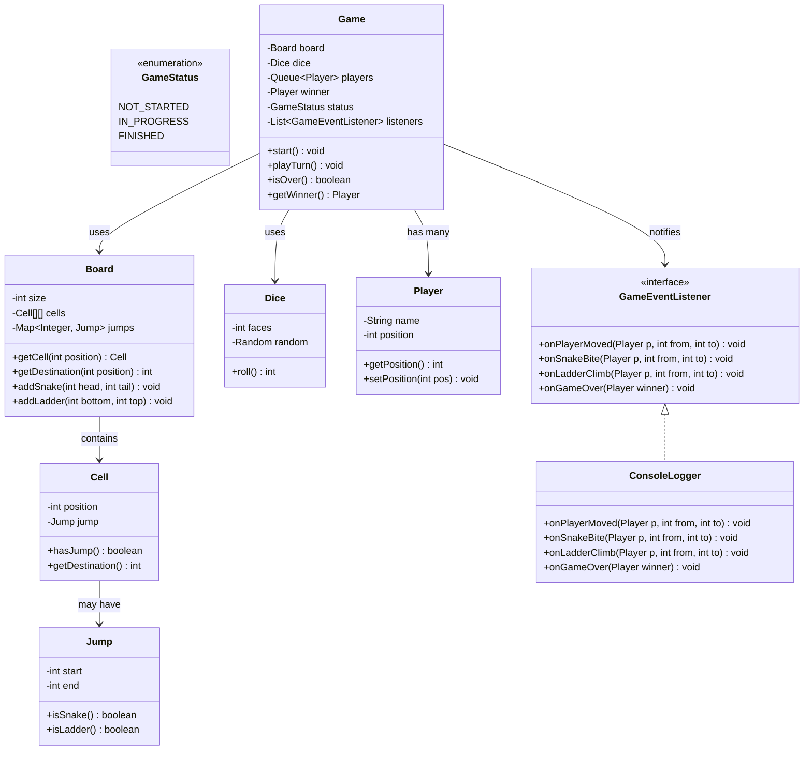
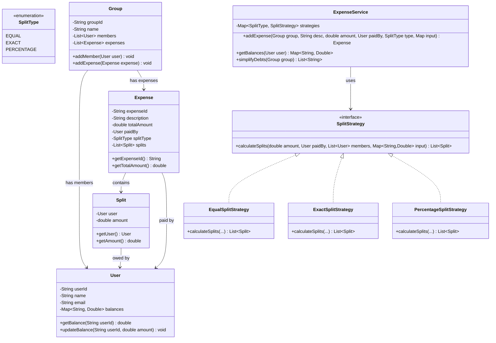
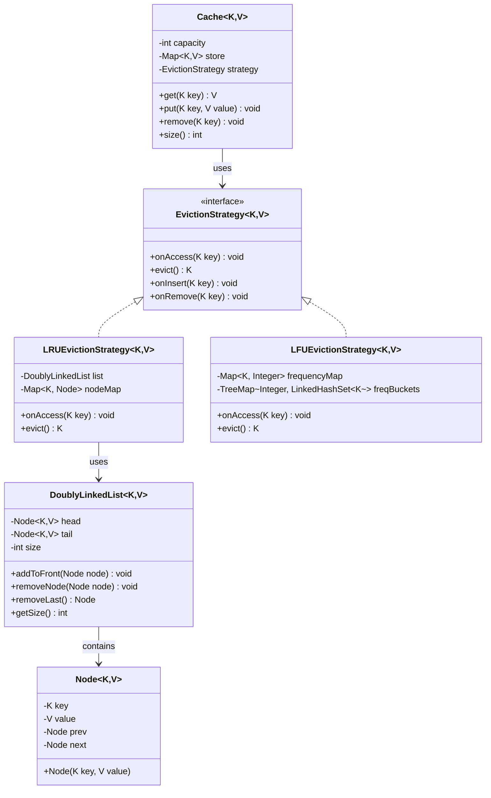
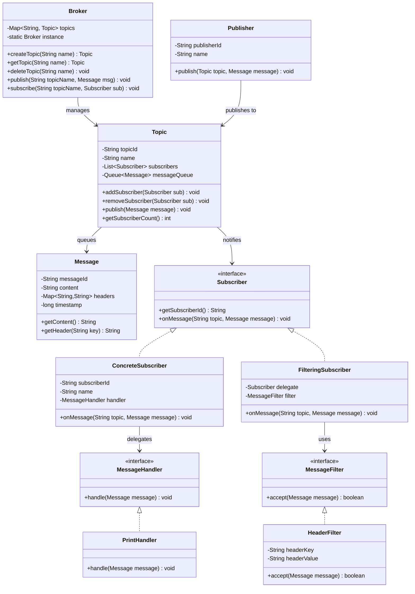
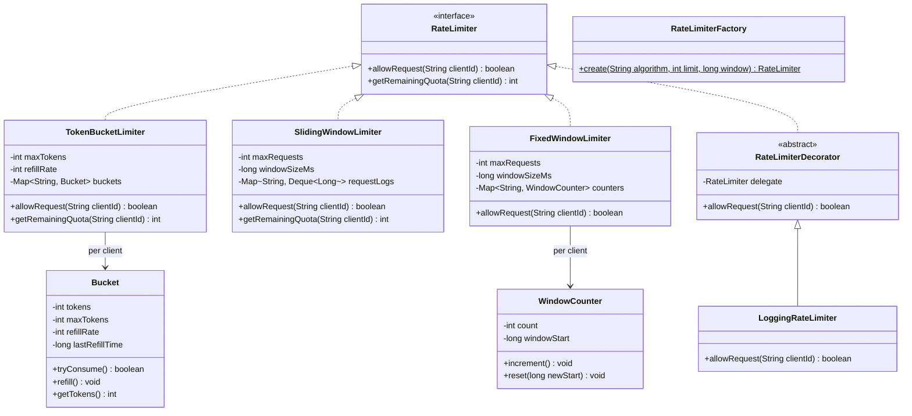
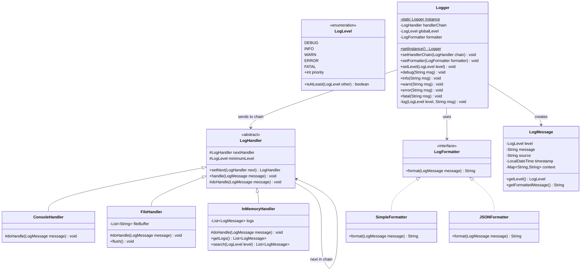

# More Machine Coding Problems -- Solution Templates

Quick-reference solution templates for six commonly asked machine coding problems.
Each includes: class diagram, key patterns, core entities, key interfaces, implementation
snippets, what the interviewer looks for, and common extensions.

---

## 1. Snake and Ladder

### Requirements
- N x N board (typically 10x10 = 100 cells)
- Multiple players take turns rolling a single die (1-6)
- Snakes: land on head, slide to tail (go backward)
- Ladders: land on bottom, climb to top (go forward)
- First player to reach or exceed cell 100 wins
- Configurable number of snakes and ladders

### Class Diagram



### Key Patterns
- **Observer:** GameEventListener for snake bite, ladder climb, player move, game over events
- **Factory:** BoardFactory to create boards with preset or random configurations

### Core Implementation

```java
public class Jump {
    private final int start;
    private final int end;

    public Jump(int start, int end) {
        this.start = start;
        this.end = end;
    }

    public boolean isSnake() { return end < start; }
    public boolean isLadder() { return end > start; }
    public int getStart() { return start; }
    public int getEnd() { return end; }
}

public class Board {
    private final int size;
    private final Map<Integer, Jump> jumps;

    public Board(int size) {
        this.size = size;
        this.jumps = new HashMap<>();
    }

    public void addSnake(int head, int tail) {
        if (tail >= head) throw new IllegalArgumentException("Snake tail must be below head");
        jumps.put(head, new Jump(head, tail));
    }

    public void addLadder(int bottom, int top) {
        if (top <= bottom) throw new IllegalArgumentException("Ladder top must be above bottom");
        jumps.put(bottom, new Jump(bottom, top));
    }

    public int getDestination(int position) {
        Jump jump = jumps.get(position);
        return (jump != null) ? jump.getEnd() : position;
    }

    public int getSize() { return size * size; }
}

public class Game {
    private final Board board;
    private final Dice dice;
    private final Queue<Player> players;
    private final List<GameEventListener> listeners;
    private Player winner;

    public Game(Board board, Dice dice, List<Player> playerList) {
        this.board = board;
        this.dice = dice;
        this.players = new LinkedList<>(playerList);
        this.listeners = new ArrayList<>();
    }

    public void addListener(GameEventListener listener) {
        listeners.add(listener);
    }

    public void play() {
        while (winner == null) {
            playTurn();
        }
        listeners.forEach(l -> l.onGameOver(winner));
    }

    private void playTurn() {
        Player current = players.poll();
        int roll = dice.roll();
        int oldPos = current.getPosition();
        int newPos = oldPos + roll;

        // Cannot exceed board size
        if (newPos > board.getSize()) {
            players.add(current); // skip turn, re-enqueue
            return;
        }

        // Check for snake or ladder
        int finalPos = board.getDestination(newPos);
        current.setPosition(finalPos);

        listeners.forEach(l -> l.onPlayerMoved(current, oldPos, finalPos));

        if (finalPos < newPos) {
            listeners.forEach(l -> l.onSnakeBite(current, newPos, finalPos));
        } else if (finalPos > newPos) {
            listeners.forEach(l -> l.onLadderClimb(current, newPos, finalPos));
        }

        if (finalPos == board.getSize()) {
            winner = current;
        } else {
            players.add(current); // re-enqueue for next turn
        }
    }

    public Player getWinner() { return winner; }
}
```

### What Interviewer Looks For
- Board does not contain game logic (SRP)
- Jump abstraction unifies snakes and ladders
- Observer pattern for game events, not embedded print statements
- Queue for turn rotation (elegant, not index tracking)

### Common Extensions
1. **Multiple dice** -- change Dice class to roll N dice, sum results
2. **Special cells** -- add PowerUp cells that give extra turns
3. **Undo last move** -- Command pattern with move history stack
4. **Multiplayer over network** -- extract GameServer, serialize moves

---

## 2. Splitwise / Expense Sharing

### Requirements
- Users can create groups
- Add expenses to groups with different split types:
  - EQUAL: split evenly among all members
  - EXACT: specify exact amount for each member
  - PERCENTAGE: specify percentage for each member
- Track who owes whom and how much
- Simplify debts (minimize transactions)

### Class Diagram



### Key Patterns
- **Strategy:** SplitStrategy for EQUAL, EXACT, PERCENTAGE calculations

### Core Implementation

```java
public class User {
    private final String userId;
    private final String name;
    // balances: userId -> amount (positive = they owe you, negative = you owe them)
    private final Map<String, Double> balances;

    public User(String userId, String name) {
        this.userId = userId;
        this.name = name;
        this.balances = new HashMap<>();
    }

    public void updateBalance(String otherUserId, double amount) {
        balances.merge(otherUserId, amount, Double::sum);
    }

    public Map<String, Double> getBalances() { return balances; }
    public String getUserId() { return userId; }
    public String getName() { return name; }
}

public interface SplitStrategy {
    List<Split> calculateSplits(double totalAmount, User paidBy,
                                 List<User> participants,
                                 Map<String, Double> exactAmounts);
    boolean validate(double totalAmount, List<User> participants,
                     Map<String, Double> input);
}

public class EqualSplitStrategy implements SplitStrategy {

    @Override
    public List<Split> calculateSplits(double totalAmount, User paidBy,
                                        List<User> participants,
                                        Map<String, Double> exactAmounts) {
        double perHead = totalAmount / participants.size();
        // Round to 2 decimal places
        perHead = Math.round(perHead * 100.0) / 100.0;

        List<Split> splits = new ArrayList<>();
        for (User user : participants) {
            splits.add(new Split(user, perHead));
        }
        return splits;
    }

    @Override
    public boolean validate(double totalAmount, List<User> participants,
                            Map<String, Double> input) {
        return participants.size() > 0;
    }
}

public class ExactSplitStrategy implements SplitStrategy {

    @Override
    public List<Split> calculateSplits(double totalAmount, User paidBy,
                                        List<User> participants,
                                        Map<String, Double> exactAmounts) {
        List<Split> splits = new ArrayList<>();
        for (User user : participants) {
            double amount = exactAmounts.getOrDefault(user.getUserId(), 0.0);
            splits.add(new Split(user, amount));
        }
        return splits;
    }

    @Override
    public boolean validate(double totalAmount, List<User> participants,
                            Map<String, Double> input) {
        double sum = input.values().stream().mapToDouble(Double::doubleValue).sum();
        return Math.abs(sum - totalAmount) < 0.01; // floating point tolerance
    }
}

public class PercentageSplitStrategy implements SplitStrategy {

    @Override
    public List<Split> calculateSplits(double totalAmount, User paidBy,
                                        List<User> participants,
                                        Map<String, Double> percentages) {
        List<Split> splits = new ArrayList<>();
        for (User user : participants) {
            double pct = percentages.getOrDefault(user.getUserId(), 0.0);
            double amount = Math.round((totalAmount * pct / 100.0) * 100.0) / 100.0;
            splits.add(new Split(user, amount));
        }
        return splits;
    }

    @Override
    public boolean validate(double totalAmount, List<User> participants,
                            Map<String, Double> input) {
        double totalPct = input.values().stream().mapToDouble(Double::doubleValue).sum();
        return Math.abs(totalPct - 100.0) < 0.01;
    }
}

// In ExpenseService, after computing splits, update balances:
public void settleBalances(User paidBy, List<Split> splits) {
    for (Split split : splits) {
        if (!split.getUser().getUserId().equals(paidBy.getUserId())) {
            double amount = split.getAmount();
            // paidBy is owed money; split user owes money
            paidBy.updateBalance(split.getUser().getUserId(), amount);
            split.getUser().updateBalance(paidBy.getUserId(), -amount);
        }
    }
}
```

### What Interviewer Looks For
- Strategy pattern for split types (not a switch in one method)
- Validation before processing (percentages sum to 100, exact amounts sum to total)
- Floating-point handling (round to 2 decimals, use tolerance for comparison)
- Balance simplification algorithm awareness (even if not fully implemented)

### Common Extensions
1. **Simplify debts** -- minimize number of transactions using a greedy algorithm
2. **Group-level summaries** -- who owes the most, total group spend
3. **Recurring expenses** -- auto-create monthly splits
4. **Multi-currency** -- add CurrencyConverter with exchange rates

---

## 3. LRU Cache

### Requirements
- Fixed capacity cache
- get(key): return value if present, else -1
- put(key, value): insert or update; evict least recently used if at capacity
- Both operations in O(1) time
- Generic types for key and value

### Class Diagram



### Key Patterns
- **Strategy:** EvictionStrategy allows swapping LRU, LFU, FIFO
- Core data structure: HashMap + DoublyLinkedList for O(1) get and evict

### Core Implementation

```java
public class Node<K, V> {
    K key;
    V value;
    Node<K, V> prev;
    Node<K, V> next;

    public Node(K key, V value) {
        this.key = key;
        this.value = value;
    }
}

public class DoublyLinkedList<K, V> {
    private final Node<K, V> head; // sentinel
    private final Node<K, V> tail; // sentinel
    private int size;

    public DoublyLinkedList() {
        head = new Node<>(null, null);
        tail = new Node<>(null, null);
        head.next = tail;
        tail.prev = head;
        size = 0;
    }

    public void addToFront(Node<K, V> node) {
        node.next = head.next;
        node.prev = head;
        head.next.prev = node;
        head.next = node;
        size++;
    }

    public void removeNode(Node<K, V> node) {
        node.prev.next = node.next;
        node.next.prev = node.prev;
        node.prev = null;
        node.next = null;
        size--;
    }

    public Node<K, V> removeLast() {
        if (size == 0) return null;
        Node<K, V> last = tail.prev;
        removeNode(last);
        return last;
    }

    public void moveToFront(Node<K, V> node) {
        removeNode(node);
        addToFront(node);
    }

    public int getSize() { return size; }
}

public class LRUCache<K, V> {
    private final int capacity;
    private final Map<K, Node<K, V>> map;
    private final DoublyLinkedList<K, V> list;

    public LRUCache(int capacity) {
        if (capacity <= 0) throw new IllegalArgumentException("Capacity must be positive");
        this.capacity = capacity;
        this.map = new HashMap<>();
        this.list = new DoublyLinkedList<>();
    }

    public V get(K key) {
        Node<K, V> node = map.get(key);
        if (node == null) return null;
        // Move to front (most recently used)
        list.moveToFront(node);
        return node.value;
    }

    public void put(K key, V value) {
        Node<K, V> existing = map.get(key);
        if (existing != null) {
            existing.value = value;
            list.moveToFront(existing);
            return;
        }

        // Evict if at capacity
        if (map.size() >= capacity) {
            Node<K, V> evicted = list.removeLast();
            if (evicted != null) {
                map.remove(evicted.key);
            }
        }

        Node<K, V> newNode = new Node<>(key, value);
        list.addToFront(newNode);
        map.put(key, newNode);
    }

    public void remove(K key) {
        Node<K, V> node = map.remove(key);
        if (node != null) {
            list.removeNode(node);
        }
    }

    public int size() { return map.size(); }
}

// Main demo
public class Main {
    public static void main(String[] args) {
        LRUCache<Integer, String> cache = new LRUCache<>(3);
        cache.put(1, "one");
        cache.put(2, "two");
        cache.put(3, "three");
        System.out.println(cache.get(1));    // "one" -- moves 1 to front
        cache.put(4, "four");                // evicts key 2 (LRU)
        System.out.println(cache.get(2));    // null -- evicted
        System.out.println(cache.get(3));    // "three"
    }
}
```

### What Interviewer Looks For
- O(1) for both get and put (HashMap + DoublyLinkedList)
- Sentinel nodes in the linked list (avoids null checks everywhere)
- Generic types (not hardcoded to Integer/String)
- Correct eviction on put when at capacity
- moveToFront on every get (the "recently used" update)

### Common Extensions
1. **LFU eviction** -- track frequency per key, evict least frequently used
2. **TTL (time-to-live)** -- expire entries after N seconds
3. **Thread-safe version** -- ReadWriteLock or ConcurrentHashMap
4. **Statistics** -- hit rate, miss rate, eviction count

---

## 4. Pub-Sub Messaging System

### Requirements
- Topics that messages are published to
- Publishers send messages to topics
- Subscribers subscribe to topics and receive messages
- Messages delivered asynchronously to all subscribers of a topic
- Support for message filtering (optional)
- Message ordering within a topic

### Class Diagram



### Key Patterns
- **Observer:** Subscriber subscribes to Topic, gets notified on new messages
- **Strategy:** MessageHandler for processing, MessageFilter for filtering
- **Singleton:** Broker as the central message bus
- **Decorator:** FilteringSubscriber wraps a Subscriber with filter logic

### Core Implementation

```java
public class Message {
    private final String messageId;
    private final String content;
    private final Map<String, String> headers;
    private final long timestamp;

    public Message(String content) {
        this.messageId = UUID.randomUUID().toString().substring(0, 8);
        this.content = content;
        this.headers = new HashMap<>();
        this.timestamp = System.currentTimeMillis();
    }

    public Message addHeader(String key, String value) {
        headers.put(key, value);
        return this; // fluent API
    }

    public String getContent() { return content; }
    public String getHeader(String key) { return headers.get(key); }
    public String getMessageId() { return messageId; }
}

public class Topic {
    private final String name;
    private final List<Subscriber> subscribers;

    public Topic(String name) {
        this.name = name;
        this.subscribers = new ArrayList<>();
    }

    public void addSubscriber(Subscriber subscriber) {
        subscribers.add(subscriber);
    }

    public void removeSubscriber(Subscriber subscriber) {
        subscribers.remove(subscriber);
    }

    public void publish(Message message) {
        for (Subscriber subscriber : subscribers) {
            // In production: this would be async
            subscriber.onMessage(name, message);
        }
    }

    public String getName() { return name; }
}

public interface Subscriber {
    String getSubscriberId();
    void onMessage(String topicName, Message message);
}

public class ConcreteSubscriber implements Subscriber {
    private final String subscriberId;
    private final String name;

    public ConcreteSubscriber(String id, String name) {
        this.subscriberId = id;
        this.name = name;
    }

    @Override
    public String getSubscriberId() { return subscriberId; }

    @Override
    public void onMessage(String topicName, Message message) {
        System.out.println("[" + name + "] Received on '" + topicName
            + "': " + message.getContent());
    }
}

public class Broker {
    private static Broker instance;
    private final Map<String, Topic> topics;

    private Broker() {
        this.topics = new HashMap<>();
    }

    public static Broker getInstance() {
        if (instance == null) {
            instance = new Broker();
        }
        return instance;
    }

    public Topic createTopic(String name) {
        topics.putIfAbsent(name, new Topic(name));
        return topics.get(name);
    }

    public void subscribe(String topicName, Subscriber subscriber) {
        Topic topic = topics.get(topicName);
        if (topic == null) throw new IllegalArgumentException("Topic not found: " + topicName);
        topic.addSubscriber(subscriber);
    }

    public void publish(String topicName, Message message) {
        Topic topic = topics.get(topicName);
        if (topic == null) throw new IllegalArgumentException("Topic not found: " + topicName);
        topic.publish(message);
    }
}
```

### What Interviewer Looks For
- Clean Observer implementation (Subscriber interface, Topic as Subject)
- Broker as the central coordination point
- Decoupling: publishers do not know about subscribers
- Message immutability (no setters after creation)
- Awareness of async delivery (mention even if synchronous implementation)

### Common Extensions
1. **Message filtering** -- subscribers receive only messages matching criteria
2. **Message replay** -- store N recent messages, deliver to new subscribers
3. **Dead letter queue** -- failed messages go to a DLQ for inspection
4. **Consumer groups** -- only one subscriber in a group gets each message

---

## 5. Rate Limiter

### Requirements
- Limit the number of requests a client can make in a time window
- Support multiple algorithms: Token Bucket, Sliding Window, Fixed Window
- Configurable per client (different limits for different API keys)
- Return allow/deny decision with remaining quota info

### Class Diagram



### Key Patterns
- **Strategy:** RateLimiter interface with multiple algorithm implementations
- **Decorator:** LoggingRateLimiter wraps any RateLimiter with logging
- **Factory:** RateLimiterFactory creates the right implementation

### Core Implementation

```java
public interface RateLimiter {
    boolean allowRequest(String clientId);
    int getRemainingQuota(String clientId);
}

// --- Token Bucket ---
public class Bucket {
    private int tokens;
    private final int maxTokens;
    private final int refillRatePerSecond;
    private long lastRefillTimestamp;

    public Bucket(int maxTokens, int refillRatePerSecond) {
        this.tokens = maxTokens;
        this.maxTokens = maxTokens;
        this.refillRatePerSecond = refillRatePerSecond;
        this.lastRefillTimestamp = System.currentTimeMillis();
    }

    public synchronized boolean tryConsume() {
        refill();
        if (tokens > 0) {
            tokens--;
            return true;
        }
        return false;
    }

    private void refill() {
        long now = System.currentTimeMillis();
        long elapsedMs = now - lastRefillTimestamp;
        int tokensToAdd = (int) (elapsedMs / 1000) * refillRatePerSecond;
        if (tokensToAdd > 0) {
            tokens = Math.min(maxTokens, tokens + tokensToAdd);
            lastRefillTimestamp = now;
        }
    }

    public int getTokens() { return tokens; }
}

public class TokenBucketLimiter implements RateLimiter {
    private final int maxTokens;
    private final int refillRate;
    private final Map<String, Bucket> buckets;

    public TokenBucketLimiter(int maxTokens, int refillRatePerSecond) {
        this.maxTokens = maxTokens;
        this.refillRate = refillRatePerSecond;
        this.buckets = new HashMap<>();
    }

    @Override
    public boolean allowRequest(String clientId) {
        buckets.putIfAbsent(clientId, new Bucket(maxTokens, refillRate));
        return buckets.get(clientId).tryConsume();
    }

    @Override
    public int getRemainingQuota(String clientId) {
        Bucket bucket = buckets.get(clientId);
        return (bucket != null) ? bucket.getTokens() : maxTokens;
    }
}

// --- Sliding Window ---
public class SlidingWindowLimiter implements RateLimiter {
    private final int maxRequests;
    private final long windowSizeMs;
    private final Map<String, Deque<Long>> requestLogs;

    public SlidingWindowLimiter(int maxRequests, long windowSizeMs) {
        this.maxRequests = maxRequests;
        this.windowSizeMs = windowSizeMs;
        this.requestLogs = new HashMap<>();
    }

    @Override
    public boolean allowRequest(String clientId) {
        long now = System.currentTimeMillis();
        requestLogs.putIfAbsent(clientId, new ArrayDeque<>());
        Deque<Long> log = requestLogs.get(clientId);

        // Remove timestamps outside the window
        while (!log.isEmpty() && (now - log.peekFirst()) > windowSizeMs) {
            log.pollFirst();
        }

        if (log.size() < maxRequests) {
            log.addLast(now);
            return true;
        }
        return false;
    }

    @Override
    public int getRemainingQuota(String clientId) {
        Deque<Long> log = requestLogs.get(clientId);
        if (log == null) return maxRequests;
        return Math.max(0, maxRequests - log.size());
    }
}

// --- Decorator: Logging ---
public class LoggingRateLimiter implements RateLimiter {
    private final RateLimiter delegate;

    public LoggingRateLimiter(RateLimiter delegate) {
        this.delegate = delegate;
    }

    @Override
    public boolean allowRequest(String clientId) {
        boolean allowed = delegate.allowRequest(clientId);
        System.out.println("[RateLimit] " + clientId + " -> "
            + (allowed ? "ALLOWED" : "DENIED")
            + " (remaining: " + delegate.getRemainingQuota(clientId) + ")");
        return allowed;
    }

    @Override
    public int getRemainingQuota(String clientId) {
        return delegate.getRemainingQuota(clientId);
    }
}
```

### What Interviewer Looks For
- Clear understanding of Token Bucket vs Sliding Window trade-offs
- Thread safety awareness (synchronized on Bucket, or mention it)
- Decorator for cross-cutting concerns (logging, metrics)
- Per-client state management (Map of clientId to state)
- Clean interface that hides algorithm details

### Common Extensions
1. **Distributed rate limiting** -- shared counter via Redis
2. **Per-endpoint limits** -- different limits for different API paths
3. **Retry-After header** -- return when the client can retry
4. **Sliding window counter hybrid** -- weighted average of current and previous window

---

## 6. Logging Framework

### Requirements
- Log messages with severity levels: DEBUG, INFO, WARN, ERROR, FATAL
- Multiple output destinations: Console, File, Database (in-memory)
- Configurable minimum log level (only log messages at or above this level)
- Timestamp and metadata on each log entry
- Singleton Logger instance
- Chain log handlers (console AND file simultaneously)

### Class Diagram



### Key Patterns
- **Singleton:** Logger -- one global logger instance
- **Chain of Responsibility:** LogHandler chain -- each handler processes and passes along
- **Strategy:** LogFormatter for different output formats (Simple, JSON)

### Core Implementation

```java
public enum LogLevel {
    DEBUG(1),
    INFO(2),
    WARN(3),
    ERROR(4),
    FATAL(5);

    private final int priority;

    LogLevel(int priority) { this.priority = priority; }

    public int getPriority() { return priority; }

    public boolean isAtLeast(LogLevel other) {
        return this.priority >= other.priority;
    }
}

public class LogMessage {
    private final LogLevel level;
    private final String message;
    private final String source;
    private final LocalDateTime timestamp;

    public LogMessage(LogLevel level, String message, String source) {
        this.level = level;
        this.message = message;
        this.source = source;
        this.timestamp = LocalDateTime.now();
    }

    public LogLevel getLevel() { return level; }
    public String getMessage() { return message; }
    public String getSource() { return source; }
    public LocalDateTime getTimestamp() { return timestamp; }
}

public interface LogFormatter {
    String format(LogMessage message);
}

public class SimpleFormatter implements LogFormatter {
    @Override
    public String format(LogMessage msg) {
        return String.format("[%s] %s [%s] %s",
            msg.getTimestamp().toString(),
            msg.getLevel(),
            msg.getSource(),
            msg.getMessage());
    }
}

public class JSONFormatter implements LogFormatter {
    @Override
    public String format(LogMessage msg) {
        return String.format(
            "{\"timestamp\":\"%s\",\"level\":\"%s\",\"source\":\"%s\",\"message\":\"%s\"}",
            msg.getTimestamp(), msg.getLevel(), msg.getSource(), msg.getMessage());
    }
}

// --- Chain of Responsibility: LogHandler ---
public abstract class LogHandler {
    protected LogHandler nextHandler;
    protected LogLevel minimumLevel;
    protected LogFormatter formatter;

    public LogHandler(LogLevel minimumLevel, LogFormatter formatter) {
        this.minimumLevel = minimumLevel;
        this.formatter = formatter;
    }

    public LogHandler setNext(LogHandler next) {
        this.nextHandler = next;
        return next; // fluent chaining
    }

    public void handle(LogMessage message) {
        if (message.getLevel().isAtLeast(minimumLevel)) {
            doHandle(message);
        }
        // Always pass to next handler in chain (each handler decides independently)
        if (nextHandler != null) {
            nextHandler.handle(message);
        }
    }

    protected abstract void doHandle(LogMessage message);
}

public class ConsoleHandler extends LogHandler {

    public ConsoleHandler(LogLevel minimumLevel, LogFormatter formatter) {
        super(minimumLevel, formatter);
    }

    @Override
    protected void doHandle(LogMessage message) {
        System.out.println(formatter.format(message));
    }
}

public class FileHandler extends LogHandler {
    private final List<String> fileBuffer; // simulated file

    public FileHandler(LogLevel minimumLevel, LogFormatter formatter) {
        super(minimumLevel, formatter);
        this.fileBuffer = new ArrayList<>();
    }

    @Override
    protected void doHandle(LogMessage message) {
        fileBuffer.add(formatter.format(message));
    }

    public List<String> getFileBuffer() { return fileBuffer; }

    public void flush() {
        System.out.println("--- File Log Contents (" + fileBuffer.size() + " entries) ---");
        fileBuffer.forEach(System.out::println);
    }
}

public class InMemoryHandler extends LogHandler {
    private final List<LogMessage> logs;

    public InMemoryHandler(LogLevel minimumLevel, LogFormatter formatter) {
        super(minimumLevel, formatter);
        this.logs = new ArrayList<>();
    }

    @Override
    protected void doHandle(LogMessage message) {
        logs.add(message);
    }

    public List<LogMessage> getLogs() { return logs; }

    public List<LogMessage> search(LogLevel level) {
        return logs.stream()
                .filter(m -> m.getLevel() == level)
                .collect(Collectors.toList());
    }
}

// --- Singleton Logger ---
public class Logger {
    private static Logger instance;
    private LogHandler handlerChain;
    private LogLevel globalLevel;
    private LogFormatter formatter;
    private String defaultSource;

    private Logger() {
        this.globalLevel = LogLevel.DEBUG;
        this.formatter = new SimpleFormatter();
        this.defaultSource = "App";

        // Default chain: console only
        this.handlerChain = new ConsoleHandler(LogLevel.DEBUG, formatter);
    }

    public static Logger getInstance() {
        if (instance == null) {
            instance = new Logger();
        }
        return instance;
    }

    public void setHandlerChain(LogHandler chain) {
        this.handlerChain = chain;
    }

    public void setLevel(LogLevel level) {
        this.globalLevel = level;
    }

    public void setFormatter(LogFormatter formatter) {
        this.formatter = formatter;
    }

    public void setDefaultSource(String source) {
        this.defaultSource = source;
    }

    private void log(LogLevel level, String message) {
        if (!level.isAtLeast(globalLevel)) return;
        LogMessage logMessage = new LogMessage(level, message, defaultSource);
        if (handlerChain != null) {
            handlerChain.handle(logMessage);
        }
    }

    public void debug(String msg) { log(LogLevel.DEBUG, msg); }
    public void info(String msg)  { log(LogLevel.INFO, msg); }
    public void warn(String msg)  { log(LogLevel.WARN, msg); }
    public void error(String msg) { log(LogLevel.ERROR, msg); }
    public void fatal(String msg) { log(LogLevel.FATAL, msg); }
}

// --- Main Demo ---
public class Main {
    public static void main(String[] args) {
        Logger logger = Logger.getInstance();

        // Setup chain: Console (all levels) -> File (WARN+) -> InMemory (ERROR+)
        LogFormatter simpleFormat = new SimpleFormatter();
        LogFormatter jsonFormat = new JSONFormatter();

        ConsoleHandler console = new ConsoleHandler(LogLevel.DEBUG, simpleFormat);
        FileHandler file = new FileHandler(LogLevel.WARN, jsonFormat);
        InMemoryHandler memory = new InMemoryHandler(LogLevel.ERROR, simpleFormat);

        console.setNext(file).setNext(memory);
        logger.setHandlerChain(console);

        // Log at various levels
        logger.debug("Application starting");
        logger.info("User logged in: user123");
        logger.warn("Disk usage above 80%");
        logger.error("Failed to connect to database");
        logger.fatal("Out of memory, shutting down");

        // Show file handler contents (only WARN+ messages)
        System.out.println();
        file.flush();

        // Show in-memory handler (only ERROR+ messages)
        System.out.println("\n--- In-Memory Error Logs ---");
        memory.getLogs().forEach(m ->
            System.out.println(m.getLevel() + ": " + m.getMessage())
        );

        // Switch to JSON formatter globally
        System.out.println("\n--- Switching to JSON formatter ---");
        logger.setHandlerChain(new ConsoleHandler(LogLevel.INFO, jsonFormat));
        logger.info("Now logging in JSON format");
        logger.error("This is a JSON error");
    }
}
```

### What Interviewer Looks For
- Singleton Logger done correctly (private constructor, static getInstance)
- Chain of Responsibility: each handler decides independently, then passes to next
- Strategy for formatting (not hardcoded format strings in handlers)
- LogLevel with priority comparison (not string comparison)
- Fluent API for chain setup (`console.setNext(file).setNext(memory)`)
- Each handler can have its own minimum level and formatter

### Common Extensions
1. **Async logging** -- handlers write to a queue, background thread flushes
2. **Log rotation** -- FileHandler rolls to a new file after N entries or N MB
3. **Structured logging** -- key-value context on LogMessage
4. **Log aggregation** -- send logs to an external service (ElasticSearch, Splunk)
5. **Caller info** -- capture class name and line number automatically
