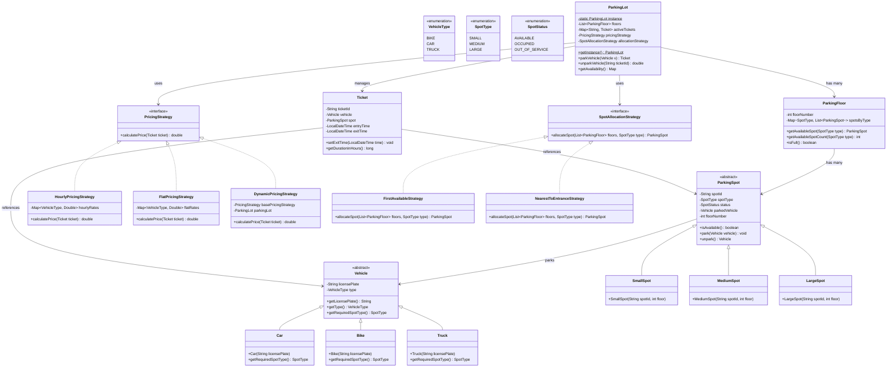

# Parking Lot System -- Complete Machine Coding Solution

> The #1 most asked machine coding problem at Uber India. If you prepare only one problem,
> prepare this one.

---

## Requirements

Gathered during the first 10 minutes. Always ask and confirm these:

### Functional Requirements
1. Multi-floor parking lot with configurable number of floors
2. Multiple vehicle types: Bike, Car, Truck
3. Different spot sizes: Small (bike), Medium (car), Large (truck)
4. Entry and exit gates
5. Ticket issued on entry with timestamp
6. Fee calculated on exit based on duration and vehicle type
7. Different pricing strategies: hourly, flat rate

### Non-Functional Requirements (mention, don't implement)
- Concurrent entry/exit handling
- Scalability to multiple parking lots
- Real-time occupancy tracking

### Confirmed Assumptions
- A truck cannot park in a small spot. A bike can only park in a small spot.
- One vehicle per spot (no splitting large spots).
- Pricing is per hour, rounded up to the nearest hour.
- In-memory storage (no database needed).

---

## Class Diagram



---

## Design Patterns Used

| Pattern | Where | Why |
|---------|-------|-----|
| **Singleton** | ParkingLot | Only one parking lot instance in the system |
| **Factory** | VehicleFactory | Creates Vehicle subtype based on VehicleType enum |
| **Strategy** | PricingStrategy | Swap pricing algorithms without modifying ParkingLot |
| **Strategy** | SpotAllocationStrategy | Swap spot allocation logic independently |
| **Abstract Class** | Vehicle, ParkingSpot | Share common fields, enforce subtype contract |

---

## Full Java Implementation

### Enums

```java
public enum VehicleType {
    BIKE,
    CAR,
    TRUCK;
}

public enum SpotType {
    SMALL,
    MEDIUM,
    LARGE;
}

public enum SpotStatus {
    AVAILABLE,
    OCCUPIED,
    OUT_OF_SERVICE;
}
```

### Vehicle Hierarchy

```java
public abstract class Vehicle {
    private final String licensePlate;
    private final VehicleType type;

    protected Vehicle(String licensePlate, VehicleType type) {
        this.licensePlate = licensePlate;
        this.type = type;
    }

    public String getLicensePlate() {
        return licensePlate;
    }

    public VehicleType getType() {
        return type;
    }

    public abstract SpotType getRequiredSpotType();

    @Override
    public String toString() {
        return type + " [" + licensePlate + "]";
    }
}

public class Car extends Vehicle {
    public Car(String licensePlate) {
        super(licensePlate, VehicleType.CAR);
    }

    @Override
    public SpotType getRequiredSpotType() {
        return SpotType.MEDIUM;
    }
}

public class Bike extends Vehicle {
    public Bike(String licensePlate) {
        super(licensePlate, VehicleType.BIKE);
    }

    @Override
    public SpotType getRequiredSpotType() {
        return SpotType.SMALL;
    }
}

public class Truck extends Vehicle {
    public Truck(String licensePlate) {
        super(licensePlate, VehicleType.TRUCK);
    }

    @Override
    public SpotType getRequiredSpotType() {
        return SpotType.LARGE;
    }
}
```

### Vehicle Factory

```java
public class VehicleFactory {

    public static Vehicle createVehicle(VehicleType type, String licensePlate) {
        if (type == null || licensePlate == null || licensePlate.isEmpty()) {
            throw new IllegalArgumentException("VehicleType and licensePlate must not be null/empty");
        }

        switch (type) {
            case BIKE:
                return new Bike(licensePlate);
            case CAR:
                return new Car(licensePlate);
            case TRUCK:
                return new Truck(licensePlate);
            default:
                throw new IllegalArgumentException("Unknown vehicle type: " + type);
        }
    }
}
```

> **Note on switch in Factory:** A switch inside a Factory is acceptable because the Factory's
> entire purpose is centralized creation based on type. This is different from switch statements
> scattered across business logic.

### ParkingSpot Hierarchy

```java
public abstract class ParkingSpot {
    private final String spotId;
    private final SpotType spotType;
    private final int floorNumber;
    private SpotStatus status;
    private Vehicle parkedVehicle;

    protected ParkingSpot(String spotId, SpotType spotType, int floorNumber) {
        this.spotId = spotId;
        this.spotType = spotType;
        this.floorNumber = floorNumber;
        this.status = SpotStatus.AVAILABLE;
    }

    public boolean isAvailable() {
        return status == SpotStatus.AVAILABLE;
    }

    public void park(Vehicle vehicle) {
        if (!isAvailable()) {
            throw new IllegalStateException("Spot " + spotId + " is not available");
        }
        if (vehicle == null) {
            throw new IllegalArgumentException("Vehicle cannot be null");
        }
        this.parkedVehicle = vehicle;
        this.status = SpotStatus.OCCUPIED;
    }

    public Vehicle unpark() {
        if (parkedVehicle == null) {
            throw new IllegalStateException("Spot " + spotId + " has no vehicle");
        }
        Vehicle vehicle = this.parkedVehicle;
        this.parkedVehicle = null;
        this.status = SpotStatus.AVAILABLE;
        return vehicle;
    }

    public String getSpotId() { return spotId; }
    public SpotType getSpotType() { return spotType; }
    public int getFloorNumber() { return floorNumber; }
    public SpotStatus getStatus() { return status; }
    public Vehicle getParkedVehicle() { return parkedVehicle; }

    public void setOutOfService() {
        this.status = SpotStatus.OUT_OF_SERVICE;
        this.parkedVehicle = null;
    }

    @Override
    public String toString() {
        return spotType + "-" + spotId + " (Floor " + floorNumber + ")";
    }
}

public class SmallSpot extends ParkingSpot {
    public SmallSpot(String spotId, int floorNumber) {
        super(spotId, SpotType.SMALL, floorNumber);
    }
}

public class MediumSpot extends ParkingSpot {
    public MediumSpot(String spotId, int floorNumber) {
        super(spotId, SpotType.MEDIUM, floorNumber);
    }
}

public class LargeSpot extends ParkingSpot {
    public LargeSpot(String spotId, int floorNumber) {
        super(spotId, SpotType.LARGE, floorNumber);
    }
}
```

### Ticket

```java
import java.time.LocalDateTime;
import java.time.temporal.ChronoUnit;
import java.util.UUID;

public class Ticket {
    private final String ticketId;
    private final Vehicle vehicle;
    private final ParkingSpot spot;
    private final LocalDateTime entryTime;
    private LocalDateTime exitTime;

    public Ticket(Vehicle vehicle, ParkingSpot spot) {
        this.ticketId = UUID.randomUUID().toString().substring(0, 8).toUpperCase();
        this.vehicle = vehicle;
        this.spot = spot;
        this.entryTime = LocalDateTime.now();
    }

    // Constructor for testing with custom entry time
    public Ticket(Vehicle vehicle, ParkingSpot spot, LocalDateTime entryTime) {
        this.ticketId = UUID.randomUUID().toString().substring(0, 8).toUpperCase();
        this.vehicle = vehicle;
        this.spot = spot;
        this.entryTime = entryTime;
    }

    public void setExitTime(LocalDateTime exitTime) {
        this.exitTime = exitTime;
    }

    public long getDurationInHours() {
        LocalDateTime end = (exitTime != null) ? exitTime : LocalDateTime.now();
        long hours = ChronoUnit.HOURS.between(entryTime, end);
        // Round up: if any minutes remain, charge for the next hour
        long minutes = ChronoUnit.MINUTES.between(entryTime, end) % 60;
        if (minutes > 0) {
            hours += 1;
        }
        return Math.max(1, hours); // Minimum 1 hour charge
    }

    public String getTicketId() { return ticketId; }
    public Vehicle getVehicle() { return vehicle; }
    public ParkingSpot getSpot() { return spot; }
    public LocalDateTime getEntryTime() { return entryTime; }
    public LocalDateTime getExitTime() { return exitTime; }

    @Override
    public String toString() {
        return "Ticket[" + ticketId + "] " + vehicle + " at " + spot + " entry=" + entryTime;
    }
}
```

### Custom Exceptions

```java
public class ParkingFullException extends RuntimeException {
    public ParkingFullException(String message) {
        super(message);
    }
}

public class InvalidTicketException extends RuntimeException {
    public InvalidTicketException(String message) {
        super(message);
    }
}
```

### ParkingFloor

```java
import java.util.*;

public class ParkingFloor {
    private final int floorNumber;
    private final Map<SpotType, List<ParkingSpot>> spotsByType;

    public ParkingFloor(int floorNumber, int smallSpots, int mediumSpots, int largeSpots) {
        this.floorNumber = floorNumber;
        this.spotsByType = new HashMap<>();
        this.spotsByType.put(SpotType.SMALL, new ArrayList<>());
        this.spotsByType.put(SpotType.MEDIUM, new ArrayList<>());
        this.spotsByType.put(SpotType.LARGE, new ArrayList<>());

        for (int i = 1; i <= smallSpots; i++) {
            spotsByType.get(SpotType.SMALL).add(
                new SmallSpot("F" + floorNumber + "-S" + i, floorNumber)
            );
        }
        for (int i = 1; i <= mediumSpots; i++) {
            spotsByType.get(SpotType.MEDIUM).add(
                new MediumSpot("F" + floorNumber + "-M" + i, floorNumber)
            );
        }
        for (int i = 1; i <= largeSpots; i++) {
            spotsByType.get(SpotType.LARGE).add(
                new LargeSpot("F" + floorNumber + "-L" + i, floorNumber)
            );
        }
    }

    public ParkingSpot getAvailableSpot(SpotType type) {
        List<ParkingSpot> spots = spotsByType.getOrDefault(type, Collections.emptyList());
        return spots.stream()
                .filter(ParkingSpot::isAvailable)
                .findFirst()
                .orElse(null);
    }

    public int getAvailableSpotCount(SpotType type) {
        List<ParkingSpot> spots = spotsByType.getOrDefault(type, Collections.emptyList());
        return (int) spots.stream().filter(ParkingSpot::isAvailable).count();
    }

    public boolean isFull() {
        return spotsByType.values().stream()
                .flatMap(List::stream)
                .noneMatch(ParkingSpot::isAvailable);
    }

    public int getFloorNumber() { return floorNumber; }

    public Map<SpotType, Integer> getAvailability() {
        Map<SpotType, Integer> availability = new HashMap<>();
        for (SpotType type : SpotType.values()) {
            availability.put(type, getAvailableSpotCount(type));
        }
        return availability;
    }

    @Override
    public String toString() {
        return "Floor " + floorNumber + " | Availability: " + getAvailability();
    }
}
```

### Pricing Strategy

```java
import java.util.HashMap;
import java.util.Map;

public interface PricingStrategy {
    double calculatePrice(Ticket ticket);
}

// --- Hourly Pricing: charge per hour based on vehicle type ---
public class HourlyPricingStrategy implements PricingStrategy {
    private final Map<VehicleType, Double> hourlyRates;

    public HourlyPricingStrategy() {
        this.hourlyRates = new HashMap<>();
        hourlyRates.put(VehicleType.BIKE, 10.0);
        hourlyRates.put(VehicleType.CAR, 20.0);
        hourlyRates.put(VehicleType.TRUCK, 30.0);
    }

    public HourlyPricingStrategy(Map<VehicleType, Double> customRates) {
        this.hourlyRates = new HashMap<>(customRates);
    }

    @Override
    public double calculatePrice(Ticket ticket) {
        long hours = ticket.getDurationInHours();
        double rate = hourlyRates.getOrDefault(ticket.getVehicle().getType(), 20.0);
        return hours * rate;
    }
}

// --- Flat Pricing: one-time charge regardless of duration ---
public class FlatPricingStrategy implements PricingStrategy {
    private final Map<VehicleType, Double> flatRates;

    public FlatPricingStrategy() {
        this.flatRates = new HashMap<>();
        flatRates.put(VehicleType.BIKE, 50.0);
        flatRates.put(VehicleType.CAR, 100.0);
        flatRates.put(VehicleType.TRUCK, 200.0);
    }

    @Override
    public double calculatePrice(Ticket ticket) {
        return flatRates.getOrDefault(ticket.getVehicle().getType(), 100.0);
    }
}

// --- Dynamic Pricing: surge multiplier based on occupancy ---
public class DynamicPricingStrategy implements PricingStrategy {
    private final PricingStrategy baseStrategy;
    private final ParkingLot parkingLot;

    public DynamicPricingStrategy(PricingStrategy baseStrategy, ParkingLot parkingLot) {
        this.baseStrategy = baseStrategy;
        this.parkingLot = parkingLot;
    }

    @Override
    public double calculatePrice(Ticket ticket) {
        double basePrice = baseStrategy.calculatePrice(ticket);
        double occupancyRate = parkingLot.getOccupancyRate();

        // Surge pricing: 1x below 50%, 1.5x at 50-80%, 2x above 80%
        double multiplier = 1.0;
        if (occupancyRate > 0.8) {
            multiplier = 2.0;
        } else if (occupancyRate > 0.5) {
            multiplier = 1.5;
        }

        return basePrice * multiplier;
    }
}
```

### Spot Allocation Strategy

```java
import java.util.List;

public interface SpotAllocationStrategy {
    ParkingSpot allocateSpot(List<ParkingFloor> floors, SpotType requiredType);
}

// --- First Available: scan floors top-to-bottom, pick first open spot ---
public class FirstAvailableStrategy implements SpotAllocationStrategy {

    @Override
    public ParkingSpot allocateSpot(List<ParkingFloor> floors, SpotType requiredType) {
        for (ParkingFloor floor : floors) {
            ParkingSpot spot = floor.getAvailableSpot(requiredType);
            if (spot != null) {
                return spot;
            }
        }
        return null; // No spot available
    }
}

// --- Nearest to Entrance: prefer lower floors (floor 1 = ground = entrance) ---
public class NearestToEntranceStrategy implements SpotAllocationStrategy {

    @Override
    public ParkingSpot allocateSpot(List<ParkingFloor> floors, SpotType requiredType) {
        // Floors are ordered by floor number; lower number = closer to entrance
        for (ParkingFloor floor : floors) {
            ParkingSpot spot = floor.getAvailableSpot(requiredType);
            if (spot != null) {
                return spot;
            }
        }
        return null;
    }
}
```

### ParkingLot (Singleton)

```java
import java.time.LocalDateTime;
import java.util.*;

public class ParkingLot {
    private static ParkingLot instance;

    private final String name;
    private final List<ParkingFloor> floors;
    private final Map<String, Ticket> activeTickets;    // ticketId -> Ticket
    private final Map<String, Ticket> vehicleTickets;   // licensePlate -> Ticket
    private PricingStrategy pricingStrategy;
    private SpotAllocationStrategy allocationStrategy;
    private int totalSpots;
    private int occupiedSpots;

    private ParkingLot(String name) {
        this.name = name;
        this.floors = new ArrayList<>();
        this.activeTickets = new HashMap<>();
        this.vehicleTickets = new HashMap<>();
        this.pricingStrategy = new HourlyPricingStrategy();
        this.allocationStrategy = new FirstAvailableStrategy();
        this.totalSpots = 0;
        this.occupiedSpots = 0;
    }

    public static ParkingLot getInstance() {
        if (instance == null) {
            instance = new ParkingLot("Main Parking Lot");
        }
        return instance;
    }

    // Reset for testing purposes
    public static void resetInstance() {
        instance = null;
    }

    public void addFloor(ParkingFloor floor) {
        floors.add(floor);
        Map<SpotType, Integer> availability = floor.getAvailability();
        totalSpots += availability.values().stream().mapToInt(Integer::intValue).sum();
    }

    public void setPricingStrategy(PricingStrategy strategy) {
        this.pricingStrategy = strategy;
    }

    public void setAllocationStrategy(SpotAllocationStrategy strategy) {
        this.allocationStrategy = strategy;
    }

    // --- Core Operation: Park a Vehicle ---
    public Ticket parkVehicle(Vehicle vehicle) {
        if (vehicle == null) {
            throw new IllegalArgumentException("Vehicle cannot be null");
        }

        // Check if vehicle is already parked
        if (vehicleTickets.containsKey(vehicle.getLicensePlate())) {
            throw new IllegalStateException(
                "Vehicle " + vehicle.getLicensePlate() + " is already parked"
            );
        }

        // Find a spot using the allocation strategy
        SpotType requiredType = vehicle.getRequiredSpotType();
        ParkingSpot spot = allocationStrategy.allocateSpot(floors, requiredType);

        if (spot == null) {
            throw new ParkingFullException(
                "No " + requiredType + " spot available for " + vehicle
            );
        }

        // Park the vehicle and create a ticket
        spot.park(vehicle);
        Ticket ticket = new Ticket(vehicle, spot);
        activeTickets.put(ticket.getTicketId(), ticket);
        vehicleTickets.put(vehicle.getLicensePlate(), ticket);
        occupiedSpots++;

        System.out.println("[ENTRY] " + ticket);
        return ticket;
    }

    // --- Core Operation: Unpark a Vehicle ---
    public double unparkVehicle(String ticketId) {
        if (ticketId == null || ticketId.isEmpty()) {
            throw new IllegalArgumentException("Ticket ID cannot be null or empty");
        }

        Ticket ticket = activeTickets.get(ticketId);
        if (ticket == null) {
            throw new InvalidTicketException("No active ticket found: " + ticketId);
        }

        // Set exit time and calculate fee
        ticket.setExitTime(LocalDateTime.now());
        double fee = pricingStrategy.calculatePrice(ticket);

        // Free the spot
        ticket.getSpot().unpark();

        // Clean up tracking
        activeTickets.remove(ticketId);
        vehicleTickets.remove(ticket.getVehicle().getLicensePlate());
        occupiedSpots--;

        System.out.println("[EXIT]  " + ticket.getVehicle() + " | Duration: "
            + ticket.getDurationInHours() + "h | Fee: $" + fee);
        return fee;
    }

    public double getOccupancyRate() {
        if (totalSpots == 0) return 0.0;
        return (double) occupiedSpots / totalSpots;
    }

    public Map<Integer, Map<SpotType, Integer>> getAvailability() {
        Map<Integer, Map<SpotType, Integer>> availability = new LinkedHashMap<>();
        for (ParkingFloor floor : floors) {
            availability.put(floor.getFloorNumber(), floor.getAvailability());
        }
        return availability;
    }

    public void displayAvailability() {
        System.out.println("\n=== " + name + " Availability ===");
        for (ParkingFloor floor : floors) {
            System.out.println("  " + floor);
        }
        System.out.printf("  Occupancy: %.1f%%%n", getOccupancyRate() * 100);
        System.out.println("================================\n");
    }
}
```

### Main.java -- Complete Demo

```java
import java.time.LocalDateTime;

public class Main {
    public static void main(String[] args) {
        System.out.println("=== PARKING LOT SYSTEM DEMO ===\n");

        // --- Setup ---
        ParkingLot.resetInstance(); // clean state
        ParkingLot lot = ParkingLot.getInstance();

        // Add floors: Floor 1 has 5 small, 5 medium, 2 large spots
        lot.addFloor(new ParkingFloor(1, 5, 5, 2));
        // Floor 2 has 3 small, 5 medium, 3 large spots
        lot.addFloor(new ParkingFloor(2, 3, 5, 3));

        // Set strategies
        lot.setPricingStrategy(new HourlyPricingStrategy());
        lot.setAllocationStrategy(new NearestToEntranceStrategy());

        lot.displayAvailability();

        // --- Flow 1: Park vehicles ---
        System.out.println("--- Parking Vehicles ---");
        Vehicle car1 = new Car("KA-01-AB-1234");
        Vehicle car2 = new Car("KA-01-CD-5678");
        Vehicle bike1 = new Bike("KA-02-EF-9012");
        Vehicle truck1 = new Truck("KA-03-GH-3456");

        Ticket t1 = lot.parkVehicle(car1);
        Ticket t2 = lot.parkVehicle(car2);
        Ticket t3 = lot.parkVehicle(bike1);
        Ticket t4 = lot.parkVehicle(truck1);

        lot.displayAvailability();

        // --- Flow 2: Unpark and pay ---
        System.out.println("--- Unparking Vehicles ---");
        double fee1 = lot.unparkVehicle(t1.getTicketId());
        double fee2 = lot.unparkVehicle(t3.getTicketId());

        lot.displayAvailability();

        // --- Flow 3: Try to park duplicate vehicle ---
        System.out.println("--- Edge Case: Duplicate Vehicle ---");
        try {
            lot.parkVehicle(car2); // car2 is already parked
        } catch (IllegalStateException e) {
            System.out.println("Caught: " + e.getMessage());
        }

        // --- Flow 4: Change pricing strategy at runtime ---
        System.out.println("\n--- Switching to Flat Pricing ---");
        lot.setPricingStrategy(new FlatPricingStrategy());
        Vehicle car3 = new Car("KA-04-IJ-7890");
        Ticket t5 = lot.parkVehicle(car3);
        double fee3 = lot.unparkVehicle(t5.getTicketId());

        // --- Flow 5: Fill up the lot to test ParkingFullException ---
        System.out.println("\n--- Filling Large Spots ---");
        Vehicle truck2 = new Truck("KA-05-KL-1111");
        Vehicle truck3 = new Truck("KA-05-KL-2222");
        Vehicle truck4 = new Truck("KA-05-KL-3333");
        Vehicle truck5 = new Truck("KA-05-KL-4444");
        Vehicle truck6 = new Truck("KA-05-KL-5555");
        Vehicle truck7 = new Truck("KA-05-KL-6666");

        lot.parkVehicle(truck2);
        lot.parkVehicle(truck3);
        lot.parkVehicle(truck4);
        lot.parkVehicle(truck5);

        // t4 (truck1) is still parked, so 5 of 5 large spots are occupied
        try {
            lot.parkVehicle(truck6);
        } catch (ParkingFullException e) {
            System.out.println("Caught: " + e.getMessage());
        }

        lot.displayAvailability();

        System.out.println("=== DEMO COMPLETE ===");
    }
}
```

---

## Extension Handling

These are the most common follow-up requirements at Uber. For each, the explanation
covers what to say, what to add, and what to change.

### Extension 1: Add EV Charging Spots

**What to say:** "Since ParkingSpot is abstract and SpotType is an enum, I can add
EVChargingSpot as a new subclass and EV_CHARGING as a new SpotType without modifying
existing classes."

**What to add:**
```java
// New enum value (or a separate boolean on existing spots)
// Preferred approach: composition over new type
public class EVChargingSpot extends MediumSpot {
    private boolean isCharging;
    private final double chargingRatePerHour;

    public EVChargingSpot(String spotId, int floorNumber, double chargingRate) {
        super(spotId, floorNumber);
        this.chargingRatePerHour = chargingRate;
        this.isCharging = false;
    }

    public void startCharging() { this.isCharging = true; }
    public void stopCharging() { this.isCharging = false; }
    public boolean isCharging() { return isCharging; }
    public double getChargingRatePerHour() { return chargingRatePerHour; }
}

// New pricing strategy that adds charging fees
public class EVPricingStrategy implements PricingStrategy {
    private final PricingStrategy basePricing;

    public EVPricingStrategy(PricingStrategy basePricing) {
        this.basePricing = basePricing;
    }

    @Override
    public double calculatePrice(Ticket ticket) {
        double basePrice = basePricing.calculatePrice(ticket);
        if (ticket.getSpot() instanceof EVChargingSpot) {
            EVChargingSpot evSpot = (EVChargingSpot) ticket.getSpot();
            double chargingFee = ticket.getDurationInHours() * evSpot.getChargingRatePerHour();
            return basePrice + chargingFee;
        }
        return basePrice;
    }
}
```

**What changes:** Nothing in existing code. New classes only. This is the Open/Closed
principle in action.

### Extension 2: Add VIP Parking

**What to say:** "I would add a VIPParkingSpot or a priority flag, and modify the
SpotAllocationStrategy to prefer reserved spots for VIP vehicles."

```java
public class VIPAllocationStrategy implements SpotAllocationStrategy {
    private final SpotAllocationStrategy fallbackStrategy;
    private final Set<String> vipLicensePlates;

    public VIPAllocationStrategy(SpotAllocationStrategy fallback) {
        this.fallbackStrategy = fallback;
        this.vipLicensePlates = new HashSet<>();
    }

    public void registerVIP(String licensePlate) {
        vipLicensePlates.add(licensePlate);
    }

    @Override
    public ParkingSpot allocateSpot(List<ParkingFloor> floors, SpotType requiredType) {
        // VIP logic: always allocate on floor 1 (closest)
        // For non-VIP, fall back to default strategy
        return fallbackStrategy.allocateSpot(floors, requiredType);
    }
}
```

### Extension 3: Add Dynamic Pricing Based on Occupancy

**What to say:** "I already implemented DynamicPricingStrategy that wraps a base strategy
and applies a surge multiplier. I just need to wire it in."

```java
// Already implemented above. Usage:
PricingStrategy basePricing = new HourlyPricingStrategy();
PricingStrategy dynamicPricing = new DynamicPricingStrategy(basePricing, lot);
lot.setPricingStrategy(dynamicPricing);
```

This demonstrates the **Decorator pattern** applied to Strategy -- wrapping one strategy
with another to add behavior.

---

## Interview Tips Specific to This Problem

### Start With This Statement
"The core entities are Vehicle, ParkingSpot, ParkingFloor, ParkingLot, and Ticket. I will
use Strategy pattern for pricing and spot allocation, and Singleton for ParkingLot. Let me
sketch the hierarchy before coding."

### Know These Numbers
- Typical setup: 3 floors, 10-20 spots per type per floor
- Hourly rates: bikes cheapest, trucks most expensive
- Occupancy threshold for dynamic pricing: 80%

### Anticipate These Questions
1. "How would you handle concurrent entry at two gates?" -- Synchronized blocks on spot
   allocation, or optimistic locking on the spot status.
2. "What if the pricing changes mid-stay?" -- Calculate on exit using the strategy active
   at exit time, or store the strategy reference on the ticket at entry.
3. "How would you add a display board?" -- Observer pattern: ParkingLot notifies a
   DisplayBoard whenever occupancy changes.

### What Makes a Top-Scoring Solution
1. Vehicle knows its required spot type (polymorphism, not switch)
2. Pricing is a strategy, not if-else chains
3. Spot allocation is a strategy, swappable at runtime
4. ParkingLot is Singleton with proper getInstance()
5. Ticket uses UUID and proper timestamps
6. Custom exceptions instead of returning null/-1
7. Main.java demonstrates all major flows including error cases
8. toString() methods on key classes for readable output

### Timing for This Problem
- Minutes 0-5: State requirements, confirm with interviewer
- Minutes 5-10: List classes and patterns on paper
- Minutes 10-15: Enums + Vehicle hierarchy
- Minutes 15-25: ParkingSpot hierarchy + ParkingFloor
- Minutes 25-40: ParkingLot + Ticket + pricing
- Minutes 40-50: Strategies + Factory
- Minutes 50-60: Main.java with full demo
- Minutes 60-70: Edge cases, validation, custom exceptions
- Minutes 70-90: Extensions and discussion
