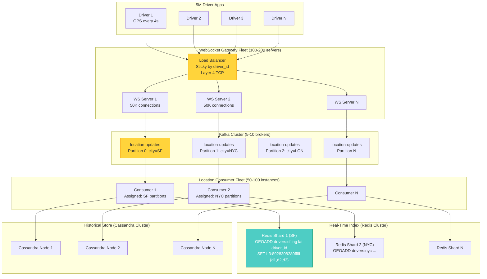
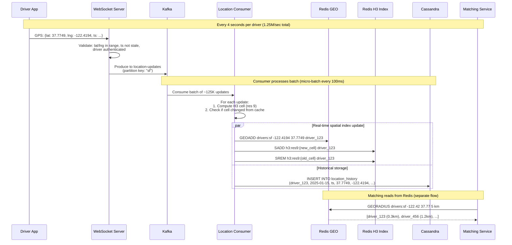
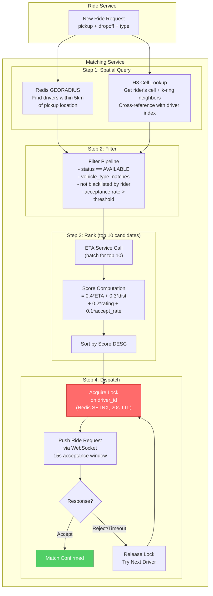
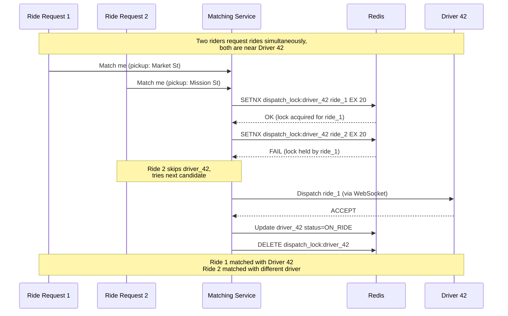
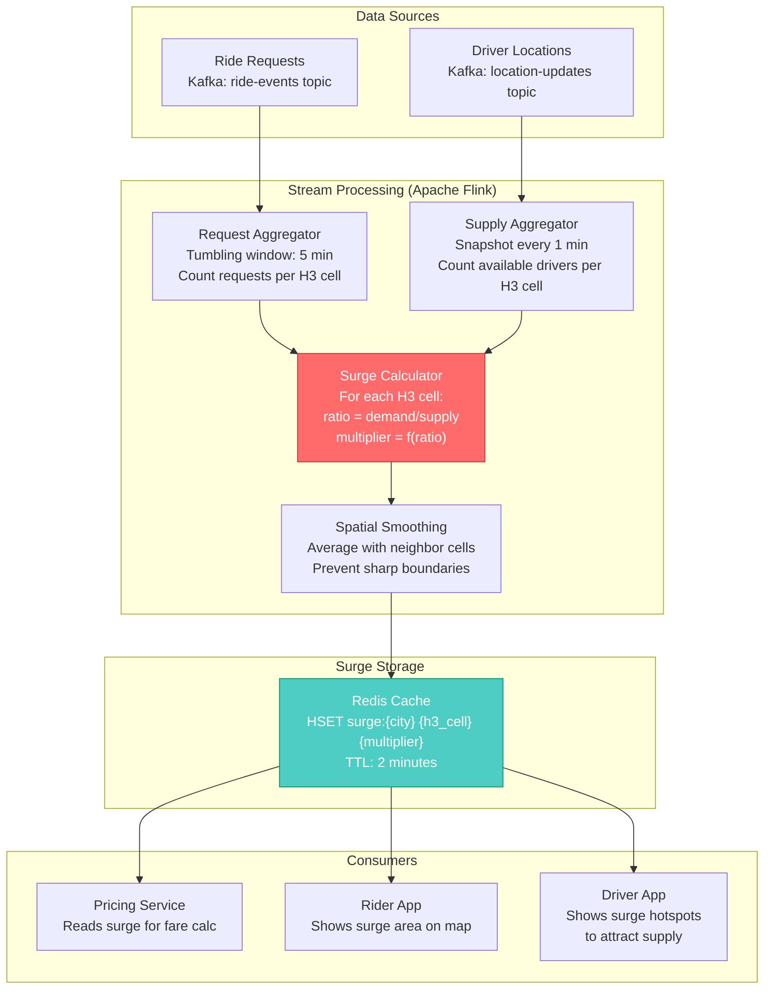
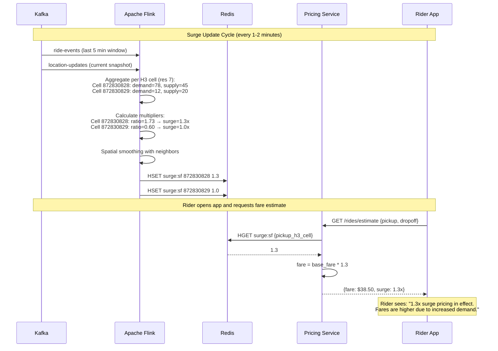

# Design Uber / Ride-Sharing Service: Deep Dive

## Table of Contents
- [1. Deep Dive #1: Driver Location Tracking at Scale](#1-deep-dive-1-driver-location-tracking-at-scale)
- [2. Deep Dive #2: Matching Algorithm](#2-deep-dive-2-matching-algorithm)
- [3. Deep Dive #3: Surge Pricing](#3-deep-dive-3-surge-pricing)
- [4. Bonus: Ride State Machine and Workflow Orchestration](#4-bonus-ride-state-machine-and-workflow-orchestration)

---

## 1. Deep Dive #1: Driver Location Tracking at Scale

### 1.1 The Problem Statement

```
5,000,000 online drivers
x 1 GPS update every 4 seconds
= 1,250,000 location updates per second

Each update: ~100 bytes (driver_id, lat, lng, heading, speed, accuracy, timestamp)
= 125 MB/sec of inbound GPS data

This must be:
  - Ingested without dropping data
  - Indexed for sub-millisecond spatial queries (matching needs this)
  - Stored for historical analytics (30-day retention)
  - All with < 2 second end-to-end latency (driver moves → rider sees on map)
```

This is the single hardest scaling challenge in the entire Uber system. Everything
else (ride requests at ~1K QPS, payments, ratings) is trivially scalable by comparison.

### 1.2 End-to-End Architecture



### 1.3 WebSocket Connection Management

**Why WebSocket, not HTTP:**

```
HTTP approach (bad):
  5M drivers x 1 request/4s = 1.25M HTTP requests/sec
  Each request: TCP handshake + TLS handshake + HTTP headers (~500 bytes overhead)
  Overhead alone: 1.25M x 500 bytes = 625 MB/sec WASTED on headers
  Plus: connection setup latency (~100ms per request)

WebSocket approach (good):
  5M persistent connections, no per-message overhead
  Each GPS update: just the 100-byte payload
  Server can also PUSH to drivers (ride requests, surge updates)
  Bidirectional on single connection
```

**Connection management details:**

```
Connection lifecycle:
  1. Driver goes online → app opens WebSocket to wss://ws.uber.com
  2. Load balancer routes to WS server (sticky by driver_id hash)
  3. Server authenticates via JWT token in upgrade request
  4. Connection established, server registers in connection registry
  5. Driver sends GPS every 4 seconds
  6. Server sends ride dispatch, status updates
  7. Heartbeat every 30s (ping/pong) to detect dead connections
  8. Driver goes offline → close frame sent, server cleans up

Server capacity:
  Each WS server: 50,000 concurrent connections
  Memory per connection: ~10 KB (socket buffer + driver metadata)
  Memory per server: 50K x 10KB = 500 MB (comfortable)
  CPU: dominated by message parsing and Kafka publishing
  
  Total servers: 5M / 50K = 100 servers (minimum)
  With 2x headroom for rolling deploys: ~200 servers

Connection registry:
  When Matching Service needs to dispatch a ride to a specific driver,
  it needs to know WHICH WebSocket server holds that driver's connection.
  
  Solution: Redis hash mapping driver_id → ws_server_id
  
  HSET ws_registry driver_123 ws_server_42
  HGET ws_registry driver_123 → ws_server_42
  
  Then: send dispatch message to ws_server_42 via internal gRPC
```

### 1.4 Kafka as the Ingestion Buffer

**Why Kafka between WebSocket and Redis:**

```
Without Kafka (direct write to Redis):
  If Redis is slow for 1 second, 1.25M updates are LOST
  No replay capability
  No way to feed multiple consumers (Redis + Cassandra + Analytics)

With Kafka:
  Kafka absorbs bursts (messages buffered on disk)
  Multiple consumer groups (each reads independently):
    - Location Consumer → Redis (real-time index)
    - History Consumer → Cassandra (time-series storage)
    - Analytics Consumer → Data Warehouse (offline analytics)
    - Surge Consumer → Flink (supply calculation for surge)
  Exactly-once semantics with transactional producers
  Replay from any offset (debugging, reprocessing)
```

**Kafka topic design:**

```
Topic: location-updates
  Partitions: one per city (or per city-region for large cities)
  Partition key: city_code (e.g., "sf", "nyc", "lon")
  
  Why city-based partitioning?
    - Matching only queries drivers in the same city
    - Each city's Redis shard only needs updates for that city
    - Consumer affinity: consumer for SF reads only SF partition
    - Prevents cross-city data shipping

  Replication factor: 3 (survive 2 broker failures)
  Retention: 24 hours (enough for replay, location history is in Cassandra)
  
  Message format (Avro):
    {
      "driver_id": "uuid",
      "city": "sf",
      "lat": 37.7749,
      "lng": -122.4194,
      "heading": 270,
      "speed": 35.5,
      "accuracy": 5.0,
      "timestamp": 1680000000000,
      "h3_cell_res9": "8928308280fffff"
    }
  
  Throughput:
    1.25M messages/sec x 100 bytes = 125 MB/sec
    Kafka can handle 200 MB/sec per broker easily
    With 5 brokers: 1000 MB/sec capacity (8x headroom)
```

### 1.5 Redis Geospatial Index (The Real-Time Brain)

**Redis GEO under the hood:**

```
Redis GEO is implemented as a sorted set (ZSET) where:
  - Each member is a driver_id
  - Each score is a 52-bit geohash encoding of lat/lng
  - GEORADIUS uses the sorted set for range scans

Commands used:
  GEOADD drivers:sf -122.4194 37.7749 driver_123
  GEOADD drivers:sf -122.4180 37.7760 driver_456
  ...
  
  GEORADIUS drivers:sf -122.4194 37.7749 5 km ASC COUNT 20
  → Returns up to 20 nearest drivers within 5km, sorted by distance
  
  GEODIST drivers:sf driver_123 driver_456 km
  → Distance between two drivers

Performance:
  GEOADD: O(log N) per insertion → at 1.25M/sec, each city shard
  handles a fraction. SF might have 100K drivers → 25K updates/sec per shard.
  Redis benchmarks: ~100K ops/sec per core. Easily handles this.
  
  GEORADIUS: O(N+log(M)) where N=elements in area, M=total elements
  For 20 nearest within 5km: < 1ms even with 500K entries
```

**H3 cell index (complementary to Redis GEO):**

```
Why H3 in addition to Redis GEO?

Redis GEO is great for "find K nearest to point" queries.
But for surge pricing and supply-demand, we need to ask:
  "How many drivers are in THIS area?"
  "How many ride requests in THIS area in the last 5 minutes?"

H3 cells provide a fixed grid that both drivers and requests map to:

  H3 resolution 7: ~5.16 km^2 per cell (good for surge pricing)
  H3 resolution 9: ~0.11 km^2 per cell (good for matching granularity)
  H3 resolution 12: ~0.0003 km^2 per cell (block-level precision)

Data structure in Redis:
  SADD h3:res9:8928308280fffff driver_123 driver_456 driver_789
  SCARD h3:res9:8928308280fffff → 3 (count of drivers in cell)
  SMEMBERS h3:res9:8928308280fffff → {driver_123, driver_456, driver_789}

When driver location updates:
  1. Compute new H3 cell: new_cell = h3.geo_to_h3(lat, lng, res=9)
  2. If cell changed from previous update:
     SREM h3:res9:{old_cell} {driver_id}
     SADD h3:res9:{new_cell} {driver_id}
  3. Most updates: driver is still in same cell (no cell change needed)
     A car at 30mph crosses an H3-res9 cell every ~30 seconds
     With updates every 4s, only ~1 in 7 updates triggers a cell change
```

### 1.6 Cassandra for Location History

```
Why Cassandra (not PostgreSQL or MongoDB)?

  Write throughput: 1.25M inserts/sec
  PostgreSQL: ~50K inserts/sec (with batching, good hardware)
  MongoDB: ~100K inserts/sec (with write concern w:1)
  Cassandra: ~500K inserts/sec per node, scales linearly with nodes
  → 3 Cassandra nodes handle 1.5M inserts/sec

  Plus:
  - Built-in TTL (expire old location data automatically)
  - No single point of failure (masterless ring topology)
  - Tunable consistency (write with CL=ONE for speed)
  - Time-series friendly partition design

Table design:
  CREATE TABLE location_history (
      driver_id   UUID,
      date        DATE,          -- daily partition bucketing
      timestamp   TIMESTAMP,     -- clustering column
      lat         DOUBLE,
      lng         DOUBLE,
      heading     SMALLINT,
      speed       FLOAT,
      accuracy    FLOAT,
      h3_cell     TEXT,
      ride_id     UUID,          -- null if not on a ride
      PRIMARY KEY ((driver_id, date), timestamp)
  ) WITH CLUSTERING ORDER BY (timestamp DESC)
    AND default_time_to_live = 2592000   -- 30 days
    AND compaction = {'class': 'TimeWindowCompactionStrategy',
                      'compaction_window_size': '1',
                      'compaction_window_unit': 'DAYS'};

Why (driver_id, date) as partition key?
  - Avoids hot partitions (one partition per driver per day)
  - Each partition: ~21,600 rows (1 update/4s x 86,400s/day)
  - Partition size: ~2.2 MB (21,600 x 100 bytes) → well under Cassandra's 100MB limit
  - Query pattern: "Get location history for driver X on date Y" → single partition read
```

### 1.7 End-to-End Sequence



### 1.8 Failure Modes and Recovery

```
Scenario: WebSocket server crashes
  - 50K drivers lose connection
  - Driver apps auto-reconnect (exponential backoff: 1s, 2s, 4s, ...)
  - Load balancer routes to healthy server
  - Redis driver entries have implicit TTL (if no update in 60s, consider offline)
  - Gap in location history: acceptable (Cassandra just has missing rows)
  - Recovery time: ~5-10 seconds for all drivers to reconnect

Scenario: Kafka broker goes down
  - Topic has replication factor 3
  - ISR (in-sync replicas) take over as leader
  - Producers reconnect to new leader (< 1 second with proper config)
  - No message loss (messages were replicated before ack)
  - Consumer group rebalances automatically

Scenario: Redis shard goes down
  - Matching queries fail for that city
  - Circuit breaker opens after 5 failures
  - Fallback: use Cassandra for recent locations (slightly stale)
  - Redis Sentinel or Cluster promotes replica within seconds
  - Location consumers rebuild index from Kafka replay (last 10 min)

Scenario: Cassandra node goes down
  - Masterless ring: other replicas serve reads/writes
  - Consistency level ONE: single replica failure has zero impact
  - Hinted handoff: writes to dead node are stored by peers
  - When node recovers: anti-entropy repair syncs missing data
```

---

## 2. Deep Dive #2: Matching Algorithm

### 2.1 The Matching Challenge

```
When a rider requests a ride, the system has < 1 second to:
  1. Find all available drivers nearby (spatial query)
  2. Rank them by multiple factors (ETA, distance, rating)
  3. Send request to best driver
  4. Handle acceptance/rejection/timeout
  5. Cascade to next driver if needed
  
  All while handling 1,150 concurrent ride requests per second (peak).
  
  Key constraint: a driver can only be dispatched to ONE rider at a time.
  Concurrent ride requests for nearby drivers must not create conflicts.
```

### 2.2 Matching Architecture



### 2.3 Step-by-Step Algorithm

```python
# Pseudocode for matching algorithm

def match_rider_to_driver(ride_request):
    pickup = ride_request.pickup  # {lat, lng}
    ride_type = ride_request.ride_type
    city = ride_request.city
    max_radius_km = 5
    max_attempts = 10
    
    # ============================================
    # STEP 1: Spatial Query - Find nearby drivers
    # ============================================
    
    # Primary: Redis GEORADIUS
    nearby_drivers = redis.georadius(
        key=f"drivers:{city}",
        lng=pickup.lng, lat=pickup.lat,
        radius=max_radius_km, unit="km",
        count=50,       # get more than we need
        sort="ASC",     # nearest first
        with_dist=True  # include distance in result
    )
    # Result: [(driver_id, distance_km), ...]
    
    # Secondary: H3 cell check (for edge cases near cell boundaries)
    rider_cell = h3.geo_to_h3(pickup.lat, pickup.lng, resolution=9)
    neighbor_cells = h3.k_ring(rider_cell, k=2)  # 2-ring = 19 cells
    
    h3_drivers = set()
    for cell in neighbor_cells:
        cell_drivers = redis.smembers(f"h3:res9:{cell}")
        h3_drivers.update(cell_drivers)
    
    # Merge: use GEORADIUS results but add any H3 drivers missed
    candidate_ids = set(d[0] for d in nearby_drivers)
    candidate_ids.update(h3_drivers)
    
    # ============================================
    # STEP 2: Filter - Remove ineligible drivers
    # ============================================
    
    candidates = []
    for driver_id in candidate_ids:
        driver = get_driver_profile(driver_id)  # cached in Redis
        
        if driver.status != "AVAILABLE":
            continue  # on a ride or offline
        if driver.vehicle_type != ride_type:
            continue  # wrong vehicle type
        if driver_id in ride_request.rider.blacklist:
            continue  # rider has blocked this driver
        if driver.acceptance_rate < 0.3:
            continue  # very low acceptance rate
        
        candidates.append(driver)
    
    if not candidates:
        # Expand radius and retry
        if max_radius_km < 10:
            return match_with_expanded_radius(ride_request, radius=10)
        else:
            return MatchResult(status="NO_DRIVERS")
    
    # ============================================
    # STEP 3: Rank - Score top candidates
    # ============================================
    
    # Limit ETA calls (expensive) to top 10 by distance
    candidates.sort(key=lambda d: d.distance_km)
    top_candidates = candidates[:10]
    
    # Batch ETA request (parallel computation)
    etas = eta_service.batch_get_eta(
        origins=[d.location for d in top_candidates],
        destination=pickup
    )
    
    for i, driver in enumerate(top_candidates):
        driver.eta_sec = etas[i]
        
        # Normalize each factor to [0, 1]
        eta_score = 1.0 - min(driver.eta_sec / 600, 1.0)   # lower ETA = higher
        dist_score = 1.0 - min(driver.distance_km / 10, 1.0)  # closer = higher
        rating_score = driver.rating / 5.0                      # higher = higher
        accept_score = driver.acceptance_rate                    # higher = higher
        
        driver.match_score = (
            0.40 * eta_score +
            0.30 * dist_score +
            0.20 * rating_score +
            0.10 * accept_score
        )
    
    # Sort by score (highest first)
    top_candidates.sort(key=lambda d: d.match_score, reverse=True)
    
    # ============================================
    # STEP 4: Dispatch - Offer ride to best driver
    # ============================================
    
    for attempt, driver in enumerate(top_candidates[:max_attempts]):
        # Distributed lock: prevent same driver from getting two rides
        lock_key = f"dispatch_lock:{driver.id}"
        locked = redis.set(lock_key, ride_request.id, nx=True, ex=20)
        
        if not locked:
            continue  # another ride is being dispatched to this driver
        
        try:
            # Send ride request via WebSocket
            response = websocket_gateway.dispatch_ride(
                driver_id=driver.id,
                ride_request=ride_request,
                timeout_sec=15
            )
            
            if response.accepted:
                # MATCH CONFIRMED
                return MatchResult(
                    status="MATCHED",
                    driver_id=driver.id,
                    eta_sec=driver.eta_sec
                )
            else:
                # Driver rejected or timed out
                redis.delete(lock_key)
                continue
                
        except DriverOfflineError:
            redis.delete(lock_key)
            # Mark driver as offline
            redis.srem(f"available_drivers:{city}", driver.id)
            continue
    
    # All attempts exhausted
    return MatchResult(status="NO_DRIVERS")
```

### 2.4 Distributed Locking for Driver Dispatch



### 2.5 Edge Cases and Solutions

```
Edge Case 1: No drivers nearby
  - Expand radius: 5km → 7km → 10km → 15km
  - After max radius, notify rider: "No drivers available"
  - Suggestion: "Try again in a few minutes" or offer scheduled ride
  - Track as unmet demand (feeds into surge pricing)

Edge Case 2: All nearby drivers reject
  - After max_attempts rejections, notify rider
  - Log rejection reasons for driver quality monitoring
  - Possible causes: destination too far, traffic too bad, known difficult area

Edge Case 3: Driver goes offline between query and dispatch
  - WebSocket dispatch throws DriverOfflineError
  - Matching releases lock, tries next driver
  - Auto-cleanup: Redis TTL removes stale driver locations

Edge Case 4: Rider cancels during matching
  - Ride Service publishes ride.cancelled event
  - Matching Service subscribes, aborts matching loop
  - If driver already accepted, notify driver of cancellation

Edge Case 5: Race condition - multiple matching instances
  - Matching Service is stateless, multiple instances run
  - Redis SETNX lock prevents two matches to same driver
  - Only the first SETNX succeeds, others fail atomically

Edge Case 6: Hotspot - event lets out (50K riders, 100 drivers)
  - Short-term: massive surge pricing (reduces demand)
  - Medium-term: broadcast surge alert to nearby drivers (increases supply)
  - Matching becomes: queueing problem (FIFO by request time)
  - Uber's approach: "batch matching" in hotspots (optimize global assignment)
```

### 2.6 Advanced: Batch Matching (Uber's Real Approach)

```
Simple matching (described above):
  Each ride request is matched independently → greedy, locally optimal

Batch matching (Uber's production system):
  Collect ride requests over a 2-second window
  Also collect available drivers in that window
  Solve: bipartite matching problem (Hungarian algorithm / min-cost flow)
  Optimize for: minimize total wait time across all riders
  
  Why batch is better:
    Greedy: Rider A gets Driver 1 (closest). Rider B, who arrived 1 second later,
    gets Driver 3 (2km away). But if we waited, we could assign Driver 1 → Rider B
    (closer to B) and Driver 2 → Rider A (still close) for lower total wait.
    
    Batch matching saves ~10-15% in average wait time.
  
  For interview: describe greedy first, mention batch as optimization.
  Batch matching is a great "how would you improve this?" discussion point.
```

---

## 3. Deep Dive #3: Surge Pricing

### 3.1 Why Surge Pricing Exists

```
Surge pricing is an economic mechanism, not just a revenue tool:

When demand > supply:
  Without surge: riders wait 30+ minutes, many give up → bad experience
  With surge:
    1. REDUCES DEMAND: price-sensitive riders wait or use alternatives
    2. INCREASES SUPPLY: drivers see higher earnings, drive toward surge areas
    3. MARKET EQUILIBRIUM: price adjusts until supply meets demand
    
Uber's data shows:
  - Surge areas attract drivers within 5-10 minutes
  - Completion rates during surge are higher than without surge
  - Net rider satisfaction improves (shorter wait > lower price for most)
```

### 3.2 Surge Pricing Architecture



### 3.3 H3 Grid for Surge

```
Uber uses H3 hexagonal grid (open-sourced by Uber):

Why hexagons (not squares)?
  - Hexagons have UNIFORM adjacency (6 neighbors, all equidistant)
  - Squares have diagonal neighbors that are farther (sqrt(2)x distance)
  - Hexagons reduce edge effects (no diagonal artifacts)
  - Better approximation of circular search areas

Resolution choices:
  H3 Resolution 7: ~5.16 km^2 per cell
    - Used for surge pricing
    - A city like SF has ~100-200 cells
    - Coarse enough for meaningful supply/demand ratios
    - Fine enough to capture neighborhood differences
    
  H3 Resolution 9: ~0.11 km^2 per cell
    - Used for driver matching spatial index
    - Much finer granularity for nearest-driver queries
    - A city like SF has ~5,000-10,000 cells

Example: San Francisco H3 cells at resolution 7

  +-------+-------+-------+
  | Cell A| Cell B| Cell C|   Each cell ~2.3km across
  | SoMa  | FiDi  | Embar |   Supply and demand tracked
  | S:45  | S:20  | S:15  |   independently per cell
  | D:78  | D:12  | D:8   |
  +---+---+---+---+---+---+   S = available drivers (supply)
      | Cell D| Cell E|         D = ride requests in 5 min (demand)
      | Mission| Castro|
      | S:30  | S:25  |
      | D:55  | D:18  |
      +-------+-------+
```

### 3.4 Surge Calculation Algorithm

```python
# Surge pricing calculation (runs every 1-2 minutes per city)

def calculate_surge_for_city(city):
    # Get all H3 cells for this city (resolution 7)
    city_cells = get_city_h3_cells(city, resolution=7)
    
    for cell in city_cells:
        # ============================================
        # Count demand: ride requests in last 5 minutes
        # ============================================
        demand = count_ride_requests(
            h3_cell=cell,
            window_minutes=5
        )
        
        # ============================================
        # Count supply: available drivers RIGHT NOW
        # ============================================
        # Get drivers in this cell + immediate neighbors
        cells_to_check = h3.k_ring(cell, k=0)  # just this cell
        supply = 0
        for c in cells_to_check:
            supply += redis.scard(f"h3:res7:{c}")  # count of available drivers
        
        # ============================================
        # Calculate surge multiplier
        # ============================================
        if supply == 0:
            if demand > 0:
                multiplier = MAX_SURGE  # 5.0x cap
            else:
                multiplier = 1.0        # no demand, no surge
        else:
            ratio = demand / supply
            multiplier = surge_function(ratio)
        
        # ============================================
        # Spatial smoothing (prevent sharp boundaries)
        # ============================================
        neighbor_multipliers = []
        for neighbor in h3.k_ring(cell, k=1):  # 6 neighbors
            nm = redis.hget(f"surge:{city}", neighbor) or 1.0
            neighbor_multipliers.append(float(nm))
        
        # Weighted average: 60% this cell, 40% average of neighbors
        if neighbor_multipliers:
            neighbor_avg = sum(neighbor_multipliers) / len(neighbor_multipliers)
            smoothed = 0.6 * multiplier + 0.4 * neighbor_avg
        else:
            smoothed = multiplier
        
        # Round to nearest 0.1x
        final_multiplier = round(max(1.0, min(smoothed, MAX_SURGE)), 1)
        
        # ============================================
        # Store in Redis cache (TTL 2 minutes)
        # ============================================
        redis.hset(f"surge:{city}", cell, final_multiplier)
        redis.expire(f"surge:{city}", 120)


def surge_function(demand_supply_ratio):
    """
    Maps demand/supply ratio to surge multiplier.
    
    Ratio | Multiplier
    ------+-----------
    0.0   | 1.0x (no surge)
    0.5   | 1.0x
    1.0   | 1.0x (balanced)
    1.5   | 1.2x
    2.0   | 1.5x
    3.0   | 2.0x
    4.0   | 2.5x
    5.0   | 3.0x
    8.0   | 4.0x
    10.0+ | 5.0x (cap)
    
    The function is NOT linear -- it ramps up slowly at first
    (small imbalances shouldn't trigger surge) and steepens
    as the imbalance grows.
    """
    if demand_supply_ratio <= 1.0:
        return 1.0
    
    # Piecewise linear or logarithmic mapping
    # Uber uses ML models in production; this is a reasonable approximation
    surge = 1.0 + 0.5 * math.log2(demand_supply_ratio)
    return min(surge, MAX_SURGE)  # cap at 5.0x
```

### 3.5 Surge Pricing Sequence Diagram



### 3.6 Surge Pricing Edge Cases

```
Edge Case 1: Surge oscillation (ping-pong effect)
  Problem: surge goes up → riders stop requesting → demand drops → surge goes down
           → riders request again → surge goes up → repeat
  Solution:
    - Use exponential moving average (EMA) instead of raw ratio
    - Surge decreases slowly (sticky surge): decrease by max 0.1x per cycle
    - This dampens oscillations

Edge Case 2: Event surge (concert/sports game ending)
  Problem: sudden demand spike, 10,000 requests in one H3 cell
  Solution:
    - Pre-compute expected surge for known events (event-based pricing)
    - Cap surge at 5x to prevent PR disasters ($400 rides)
    - Proactively notify drivers: "High demand expected at [venue] at [time]"

Edge Case 3: Surge at cell boundaries
  Problem: rider is on the border of a 3x surge cell and a 1x cell
           Moving 10 meters changes price by 3x
  Solution:
    - Spatial smoothing averages with neighbor cells
    - Use overlapping H3 cells at multiple resolutions
    - Uber's production system uses ML-based continuous pricing surface

Edge Case 4: Supply-side gaming
  Problem: drivers turn off app to create artificial scarcity → trigger surge → turn on
  Solution:
    - Track driver on/off patterns
    - Surge calculation uses 15-minute rolling supply, not instantaneous
    - Penalties for consistent pattern of gaming

Edge Case 5: New city with sparse data
  Problem: not enough data to compute meaningful supply/demand
  Solution:
    - Use larger H3 cells (resolution 5 or 6) until density increases
    - Fall back to city-wide surge if per-cell data is insufficient
    - Minimum sample size: need at least 5 requests and 3 drivers per cell
```

---

## 4. Bonus: Ride State Machine and Workflow Orchestration

### 4.1 Why a State Machine?

```
A ride goes through a series of states. Each transition:
  - Has preconditions that must be validated
  - Triggers side effects (notifications, payments, status updates)
  - Must be idempotent (network retries should not corrupt state)
  - Must be atomic (partial transitions are dangerous)

Without a formal state machine:
  - Bugs where rides get stuck in invalid states
  - Missing notifications (forgot to notify on a transition)
  - Payment charged before ride actually completed
  - Driver marked available while still on a ride

Uber uses Cadence (now Temporal) for workflow orchestration.
For the interview, describe the state machine and mention Temporal as
the production implementation.
```

### 4.2 State Transition Table

```
| Current State      | Event                  | Next State         | Side Effects                                         |
|--------------------|------------------------|--------------------|------------------------------------------------------|
| (none)             | rider.request_ride     | REQUESTED          | Save ride, lock surge, start matching                |
| REQUESTED          | matching.started       | MATCHING           | (internal state)                                     |
| MATCHING           | driver.found           | MATCHED            | Notify rider + driver, update driver status          |
| MATCHING           | no_drivers             | NO_DRIVERS         | Notify rider, offer retry                            |
| MATCHING           | rider.cancel           | CANCELLED          | Abort matching, release surge lock                   |
| NO_DRIVERS         | rider.retry            | REQUESTED          | Restart matching with expanded radius                |
| MATCHED            | driver.heading         | DRIVER_EN_ROUTE    | Stream driver location to rider, update ETA          |
| MATCHED            | rider.cancel           | CANCELLED          | Notify driver, no cancellation fee                   |
| MATCHED            | driver.cancel          | REQUESTED          | Re-enter matching, notify rider                      |
| DRIVER_EN_ROUTE    | driver.arrived         | ARRIVED            | Notify rider, start no-show timer (5 min)            |
| DRIVER_EN_ROUTE    | rider.cancel           | CANCELLED          | Cancellation fee if driver drove > 2 min             |
| DRIVER_EN_ROUTE    | driver.cancel          | REQUESTED          | Re-match, penalize driver cancel rate                |
| ARRIVED            | driver.start_ride      | IN_PROGRESS        | Start fare meter, record pickup time                 |
| ARRIVED            | rider.no_show (5 min)  | CANCELLED          | Charge rider cancellation fee, free driver           |
| IN_PROGRESS        | driver.complete_ride   | COMPLETED          | Stop fare meter, calculate fare, initiate payment    |
| COMPLETED          | payment.processing     | PAYMENT_PROCESSING | Charge rider's payment method                        |
| PAYMENT_PROCESSING | payment.success        | PAID               | Send receipt, credit driver, prompt for rating       |
| PAYMENT_PROCESSING | payment.failed         | PAYMENT_FAILED     | Retry payment, notify rider if card issue            |
| PAYMENT_FAILED     | payment.retry          | PAYMENT_PROCESSING | Retry with backoff (3 attempts)                      |
| PAID               | rating.submitted       | RATED              | Update driver/rider average ratings                  |
| PAID               | timeout (24 hours)     | CLOSED             | Auto-close, apply default 5-star if no rating        |
```

### 4.3 Temporal/Cadence Workflow (Uber's Production Approach)

```
Uber built Cadence (later open-sourced as Temporal) specifically for
ride workflow orchestration. Key benefits over a simple state machine:

1. DURABILITY: Workflow state survives server crashes
   - Each state transition is durably logged
   - On restart, workflow resumes from last checkpoint
   
2. TIMERS: Built-in support for timeouts
   - "Wait 15 seconds for driver to accept"
   - "Wait 5 minutes for rider to arrive at pickup"
   - "Retry payment in 30 seconds"
   
3. SAGA PATTERN: Compensating transactions
   - If payment fails after ride completes, can trigger retry workflow
   - If driver cancels, automatically triggers re-matching workflow
   
4. VISIBILITY: Can query "what state is this ride in?"
   - Dashboard shows all active rides and their states
   - Debug: replay exact sequence of events for any ride

Pseudocode (Temporal style):

  @workflow
  def ride_workflow(ride_request):
      ride = activities.create_ride(ride_request)
      
      # Matching phase (with timeout)
      match = await activities.find_driver(ride, timeout=60s)
      if not match:
          activities.notify_rider(ride, "No drivers available")
          return
      
      ride = activities.assign_driver(ride, match.driver)
      activities.notify_rider(ride, "Driver matched")
      activities.notify_driver(match.driver, ride)
      
      # Wait for pickup (driver arrives)
      await workflow.wait_for_signal("driver_arrived", timeout=30min)
      activities.notify_rider(ride, "Driver arrived")
      
      # Wait for ride start (with 5-min no-show timer)
      started = await workflow.wait_for_signal("ride_started", timeout=5min)
      if not started:
          activities.charge_cancellation_fee(ride)
          activities.free_driver(match.driver)
          return
      
      # Wait for ride completion
      await workflow.wait_for_signal("ride_completed")
      
      # Payment saga
      fare = activities.calculate_fare(ride)
      payment = await activities.charge_rider(ride, fare)
      if payment.failed:
          for retry in range(3):
              await workflow.sleep(30s * (2 ** retry))
              payment = await activities.charge_rider(ride, fare)
              if payment.success: break
      
      activities.credit_driver_earnings(ride, match.driver)
      activities.send_receipt(ride)
      
      # Rating phase (fire-and-forget, 24h timeout)
      activities.prompt_for_rating(ride)
```

### 4.4 Failure Recovery Scenarios

```mermaid
graph TB
    subgraph "Happy Path"
        A[REQUESTED] --> B[MATCHED]
        B --> C[DRIVER_EN_ROUTE]
        C --> D[ARRIVED]
        D --> E[IN_PROGRESS]
        E --> F[COMPLETED]
        F --> G[PAID]
    end

    subgraph "Failure: Driver Goes Offline Mid-Ride"
        E2[IN_PROGRESS] --> DET["Detect: no location<br/>updates for 60s"]
        DET --> ALERT["Alert rider:<br/>'Connection lost with driver'"]
        ALERT --> WAIT2{"Driver reconnects<br/>within 5 min?"}
        WAIT2 -->|Yes| RESUME[Resume ride tracking]
        WAIT2 -->|No| PARTIAL["Complete ride at<br/>last known location"]
        PARTIAL --> CHARGE["Charge fare for<br/>distance traveled"]
    end

    subgraph "Failure: Payment Fails"
        F2[COMPLETED] --> PAY["Charge rider"]
        PAY --> FAIL{"Payment<br/>failed?"}
        FAIL -->|Card declined| RETRY["Retry with backoff<br/>(30s, 60s, 120s)"]
        RETRY --> FAIL
        FAIL -->|3 failures| FALLBACK["Try alternative<br/>payment method"]
        FALLBACK --> LAST{"Still fails?"}
        LAST -->|Yes| DEBT["Add to rider's<br/>outstanding balance<br/>Block future rides"]
        LAST -->|No| SUCCESS[PAID]
        FAIL -->|Success| SUCCESS
    end

    style DET fill:#ff6b6b,stroke:#c92a2a,color:#fff
    style FAIL fill:#ff6b6b,stroke:#c92a2a,color:#fff
    style DEBT fill:#ff6b6b,stroke:#c92a2a,color:#fff
```



---

## Key Interview Discussion Points

> **When asked "what would you deep dive into?"** pick location tracking (1.25M updates/sec).
> It's the unique scaling challenge. Matching and surge are interesting algorithmic
> problems, but the location ingestion pipeline is what separates a good answer from a great one.

> **When asked "how does Uber actually do matching?"** describe the greedy approach first,
> then mention batch matching as an optimization. Uber's real system uses reinforcement
> learning for dispatch, but the greedy + batch explanation is sufficient for an interview.

> **When asked about surge pricing**, emphasize the ECONOMIC purpose (market equilibrium)
> not just the technical implementation. This shows product thinking.
