# Design Uber / Ride-Sharing Service: High-Level Design

## Table of Contents
- [1. Architecture Overview](#1-architecture-overview)
- [2. System Architecture Diagram](#2-system-architecture-diagram)
- [3. Component Deep Dive](#3-component-deep-dive)
- [4. Data Flow Walkthroughs](#4-data-flow-walkthroughs)
- [5. Database Design](#5-database-design)
- [6. Communication Patterns](#6-communication-patterns)

---

## 1. Architecture Overview

The system is organized as a **microservices architecture** with seven core services,
event-driven communication via Kafka, and a polyglot persistence strategy
(PostgreSQL + Redis + Cassandra). The two client apps (Rider and Driver) connect
through an API Gateway and WebSocket Gateway.

**Key architectural decisions:**
1. **WebSocket for drivers** -- persistent connection for real-time location streaming and ride dispatch
2. **Kafka as the central nervous system** -- decouples high-throughput location ingestion from storage/processing
3. **Redis with geospatial index** -- sub-millisecond driver lookups for matching
4. **H3 hexagonal grid** -- Uber's actual spatial indexing system for partitioning the world
5. **City-level partitioning** -- each city operates semi-independently for data locality

---

## 2. System Architecture Diagram

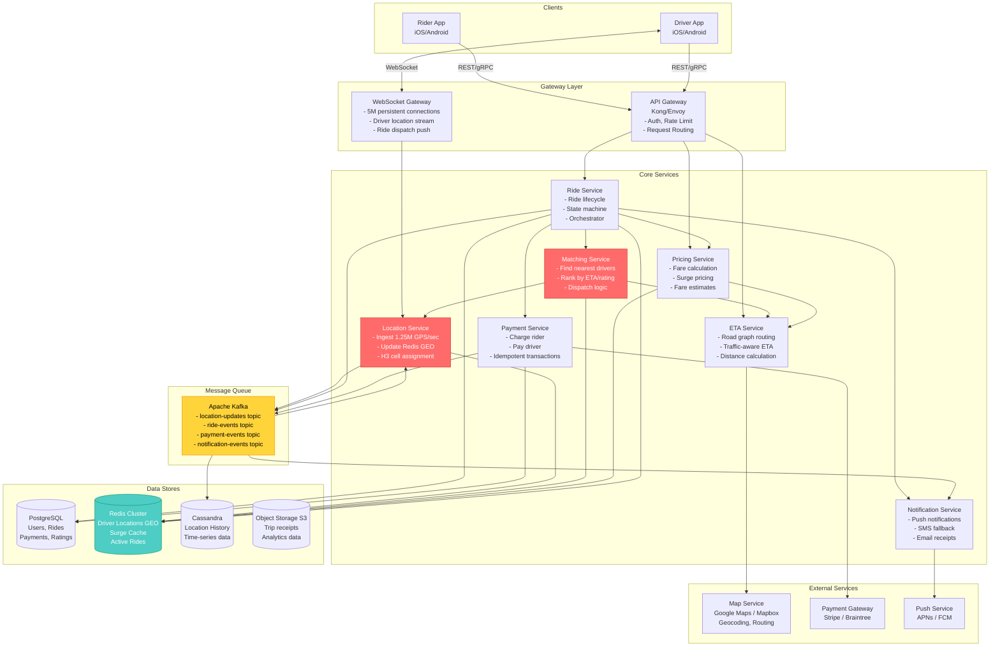

---

## 3. Component Deep Dive

### 3.1 Location Service (The Scale Challenge)

**Responsibility:** Ingest, process, and store 1.25 million GPS updates per second
from online drivers.

**Why this is the hardest component:** At 1.25M writes/sec, this single service
handles more throughput than most entire platforms. Every decision here is about scale.

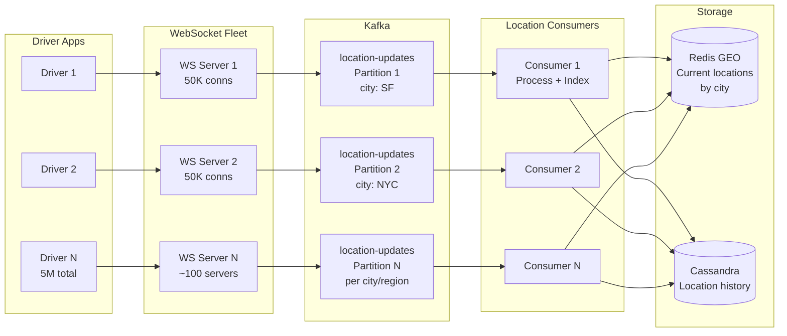

**Processing pipeline for each location update:**

```
1. Driver app sends GPS: { lat, lng, heading, speed, ts }
2. WebSocket server receives, validates, enriches with driver_id
3. Publish to Kafka topic "location-updates" (partitioned by city)
4. Location Consumer reads from Kafka:
   a. Compute H3 cell index (resolution 9 for matching, ~0.1 km^2)
   b. GEOADD to Redis: drivers:{city} {lng} {lat} {driver_id}
   c. Update H3 cell membership: SADD h3:{cell_id} {driver_id}
   d. Remove from old H3 cell if moved: SREM h3:{old_cell_id} {driver_id}
   e. Write to Cassandra: location_history (driver_id, date, ts, lat, lng, ...)
5. TTL on Redis keys: if no update in 60s, driver considered offline
```

**Key design choices:**
- **WebSocket, not HTTP polling**: 5M HTTP requests every 4 seconds would be 1.25M QPS of HTTP overhead. WebSocket eliminates connection setup cost.
- **Kafka as buffer**: Decouples ingestion rate from processing rate. If Redis is briefly slow, Kafka absorbs the backpressure.
- **Partitioned by city**: San Francisco drivers only need to match with San Francisco riders. City-level partitioning keeps data local.

---

### 3.2 Matching Service (The Brain)

**Responsibility:** When a rider requests a ride, find the best available driver
within acceptable distance and dispatch the request.

**Matching is the core value proposition of Uber.** A good matching algorithm
minimizes wait time for riders, maximizes utilization for drivers, and maximizes
revenue for the platform.

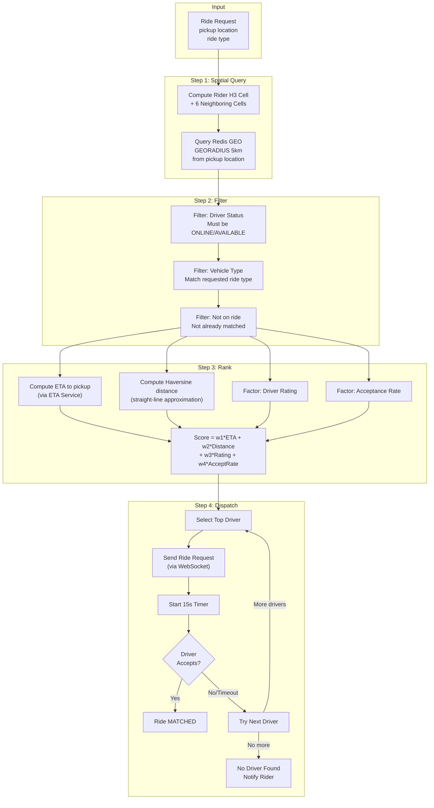

**Algorithm details:**

```
MATCH(rider_pickup, ride_type):
  1. cell = h3.geo_to_h3(rider_pickup.lat, rider_pickup.lng, resolution=9)
  2. search_cells = h3.k_ring(cell, k=1)    // center + 6 neighbors = 7 cells
  
  3. candidate_drivers = []
     for each cell in search_cells:
       drivers = redis.GEORADIUS(drivers:{city}, rider_pickup, 5km)
       candidate_drivers.extend(drivers)
  
  4. // Filter
     candidates = candidates.filter(
       status == AVAILABLE AND
       vehicle_type matches ride_type AND
       NOT in_active_ride
     )
  
  5. // Rank (in parallel for top candidates)
     for each driver in candidates[:20]:   // limit ETA calls
       driver.eta = eta_service.get_eta(driver.location, rider_pickup)
       driver.score = (
         0.4 * normalize(driver.eta) +      // lower ETA = higher score
         0.3 * normalize(driver.distance) +  // closer = higher score
         0.2 * driver.rating / 5.0 +         // higher rating = higher score
         0.1 * driver.acceptance_rate         // higher accept rate = higher score
       )
  
  6. candidates.sort_by(score, descending)
  
  7. // Sequential dispatch with timeout
     for driver in candidates:
       send_ride_request(driver, timeout=15s)
       if driver.accepts(): return MATCHED(driver)
  
  8. // No match
     if search_radius < 10km:
       expand radius, retry
     else:
       return NO_DRIVERS_AVAILABLE
```

**Edge cases handled:**
- **No nearby drivers**: Expand search radius in increments (5km -> 7km -> 10km)
- **All drivers reject**: Notify rider "No drivers available", suggest trying again
- **Driver goes offline mid-dispatch**: Timeout triggers, cascade to next driver
- **Multiple riders requesting same driver**: Use distributed lock per driver_id
- **Surge conditions**: Pass surge multiplier so drivers see potential earnings

---

### 3.3 Ride Service (The Orchestrator)

**Responsibility:** Manage the complete lifecycle of a ride from request to payment.
Acts as the central orchestrator coordinating all other services.

**State Machine:**

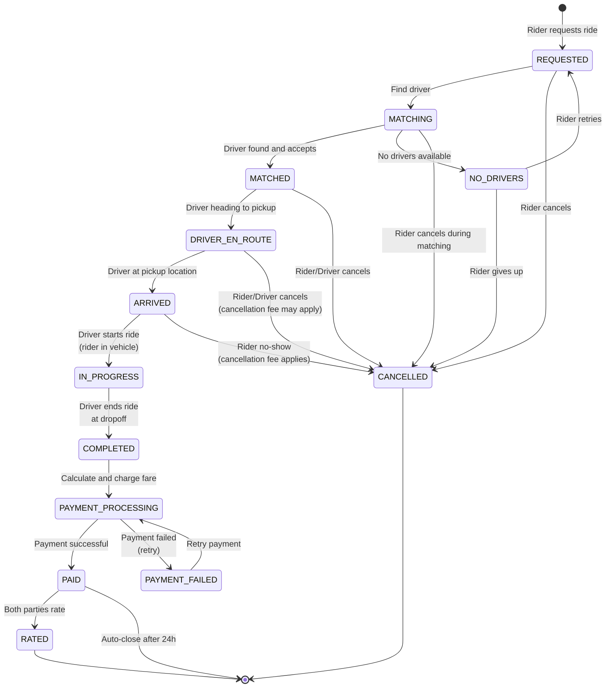

**Ride Service responsibilities at each state transition:**

```
REQUESTED:
  1. Validate request (pickup/dropoff valid, rider has payment method)
  2. Get fare estimate from Pricing Service
  3. Lock surge multiplier (guarantee quoted price)
  4. Create ride record in PostgreSQL (status=REQUESTED)
  5. Publish ride.requested event to Kafka
  6. Call Matching Service to find driver

MATCHED:
  1. Update ride record (status=MATCHED, driver_id)
  2. Mark driver as ON_RIDE in Redis
  3. Notify rider (driver details, ETA)
  4. Notify driver (rider details, pickup location)
  5. Start tracking driver-to-pickup ETA

DRIVER_EN_ROUTE:
  1. Driver's location is streamed to rider in real-time
  2. ETA updates sent to rider every 10 seconds
  3. If driver is not moving toward pickup, send reminder

ARRIVED:
  1. Notify rider: "Your driver has arrived"
  2. Start 5-minute wait timer
  3. If rider doesn't show in 5 min, allow driver to cancel (rider charged)

IN_PROGRESS:
  1. Start fare meter (time + distance)
  2. Record route waypoints for fare verification
  3. Stream driver location to rider app
  4. Update real-time ETA to dropoff

COMPLETED:
  1. Calculate final fare (Pricing Service)
  2. Record ride distance, duration, route
  3. Initiate payment (Payment Service)
  4. Publish ride.completed event
  5. Prompt both parties for rating
  6. Update driver status back to AVAILABLE
```

---

### 3.4 Pricing Service

**Responsibility:** Calculate fare estimates, final fares, and manage surge pricing.

**Fare formula:**

```
final_fare = (base_fare + (per_mile_rate * distance_miles) 
              + (per_minute_rate * duration_minutes) 
              + booking_fee) * surge_multiplier

Example (UberX in San Francisco):
  base_fare       = $2.55
  per_mile_rate   = $1.75
  per_minute_rate = $0.35
  booking_fee     = $2.75
  minimum_fare    = $8.00
  
  For a 10-mile, 25-minute ride with 1.5x surge:
  fare = ($2.55 + $1.75*10 + $0.35*25 + $2.75) * 1.5
       = ($2.55 + $17.50 + $8.75 + $2.75) * 1.5
       = $31.55 * 1.5
       = $47.33
```

**Surge pricing algorithm (detailed in deep-dive.md):**

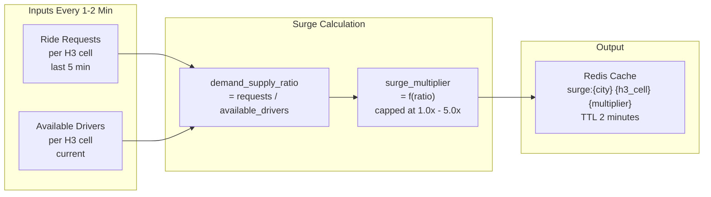

---

### 3.5 ETA Service

**Responsibility:** Calculate accurate estimated time of arrival between two points
considering road network and real-time traffic.

**Architecture:**

```
ETA calculation approaches (from simple to complex):
  
  1. Haversine distance / average_speed
     - Fastest to compute, least accurate
     - Good for initial filtering (discard drivers > 10km away)
  
  2. Road-network routing (Dijkstra/A*)
     - Precomputed road graph per city
     - Edges weighted by distance and speed limits
     - More accurate but ignores real-time conditions
  
  3. Traffic-aware routing (Uber's approach)
     - Road graph with LIVE edge weights
     - Weights updated from actual driver travel times
     - Historical patterns by time of day and day of week
     - Most accurate, used for final ETA displayed to user
  
  Uber uses approach 3 in production.
  For interview: describe approach 2 and mention approach 3 exists.
```

**Precomputed components:**
- **Road graph**: Nodes (intersections) + edges (road segments) loaded from OpenStreetMap
- **Routing tiles**: City divided into tiles, each with local road graph
- **Historical speeds**: Average speed per road segment per hour (168 hours/week)
- **Live speeds**: Updated every 1-2 minutes from actual driver GPS data

---

### 3.6 Payment Service

**Responsibility:** Handle all financial transactions -- charge riders, pay drivers,
manage refunds, ensure exactly-once payment semantics.

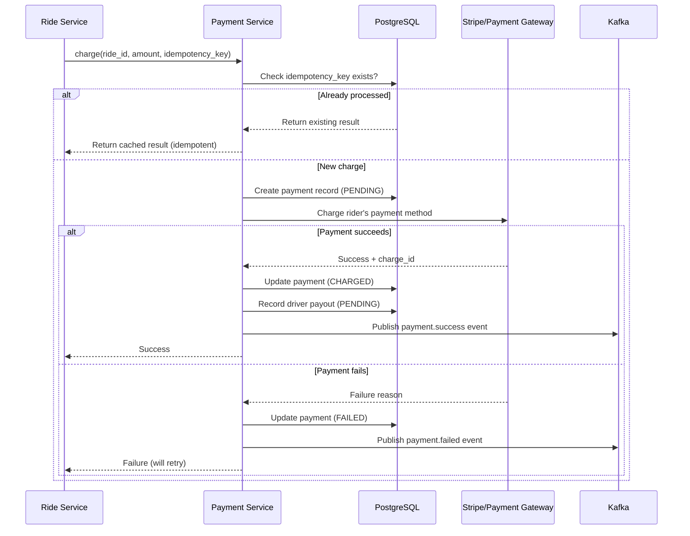

**Key design choices:**
- **Idempotency keys**: Every charge request includes a unique key (typically `ride_{ride_id}_charge`). If the same key is sent twice, return the cached result. This prevents double-charging if the Ride Service retries.
- **Saga pattern**: Ride completion involves: (1) charge rider, (2) calculate platform fee, (3) credit driver. If step 1 fails, no payout. If step 3 fails, retry with backoff.
- **Delayed driver payout**: Drivers are not paid instantly. Payouts batch weekly to reduce transaction costs and handle disputes.

---

### 3.7 Notification Service

**Responsibility:** Deliver real-time notifications to riders and drivers across
multiple channels (push notification, SMS, email, in-app WebSocket).

```
Notification types and channels:

| Event                | Rider Channel       | Driver Channel      |
|---------------------|---------------------|---------------------|
| Driver matched      | Push + In-app       | Push + In-app       |
| Driver arriving     | Push                | -                   |
| Driver arrived      | Push + SMS          | -                   |
| Ride started        | In-app              | In-app              |
| Ride completed      | Push + Email receipt | Push                |
| Payment processed   | Email               | Push (earnings)     |
| Rating reminder     | Push (after 1 hour) | Push (after 1 hour) |
| Surge alert         | -                   | Push                |
```

**Architecture:**

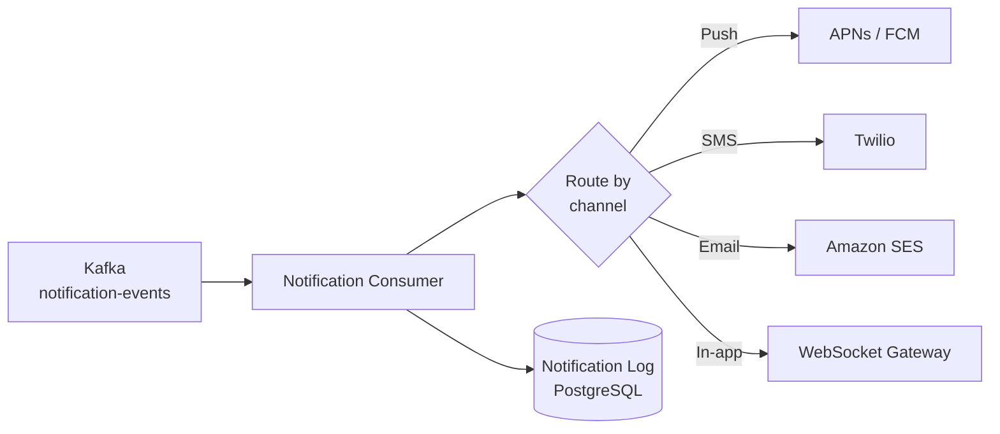

---

## 4. Data Flow Walkthroughs

### 4.1 Complete Ride Flow (End-to-End)

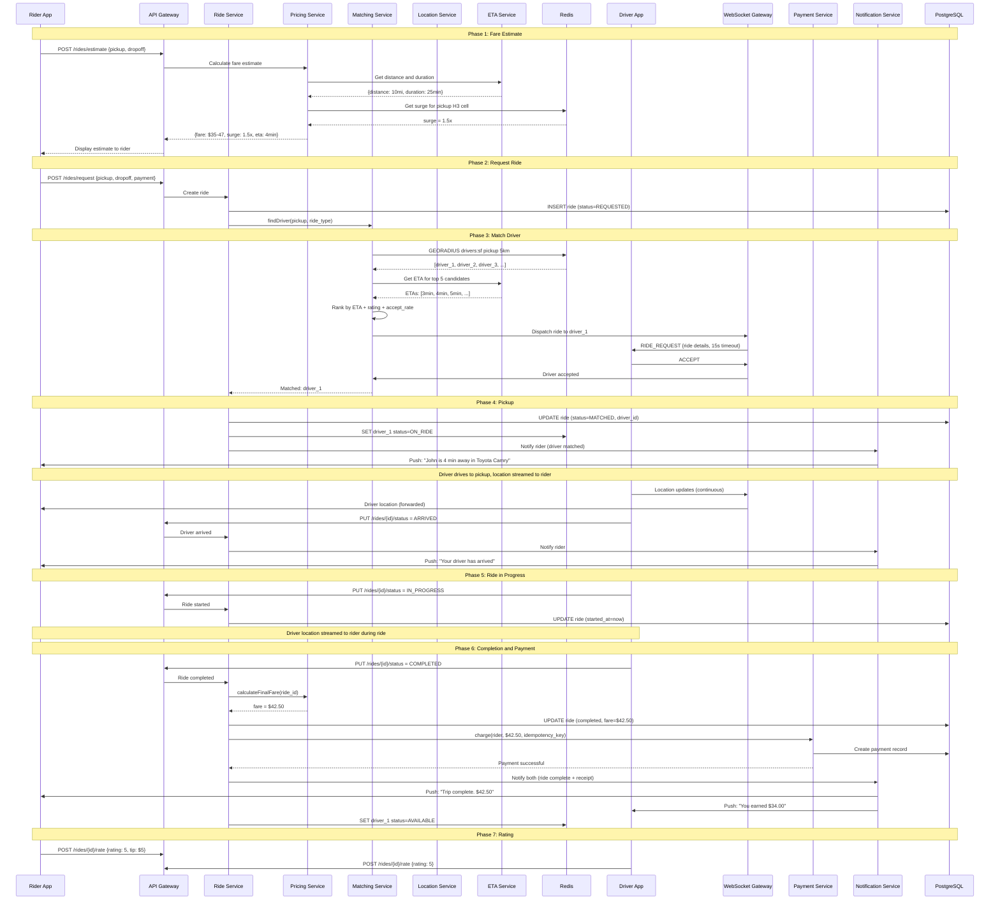

### 4.2 Driver Location Update Flow

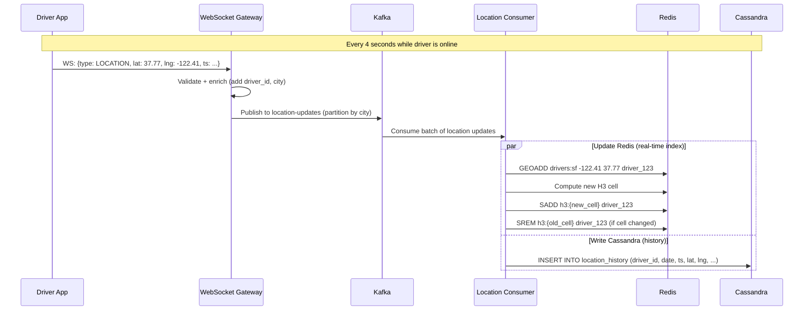

### 4.3 Surge Pricing Update Flow

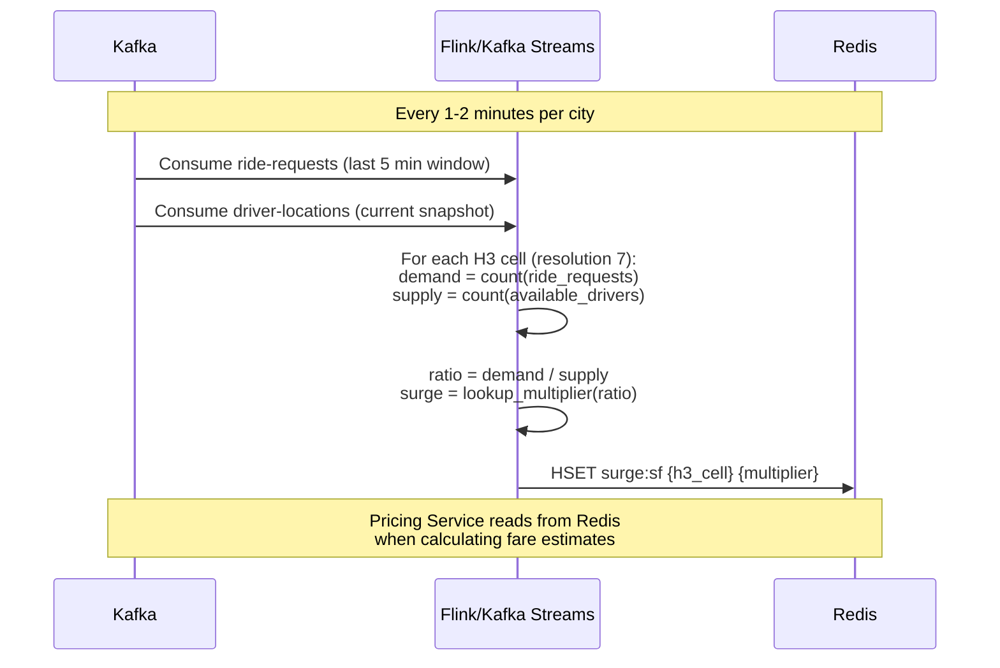

---

## 5. Database Design

### 5.1 Storage Strategy Overview

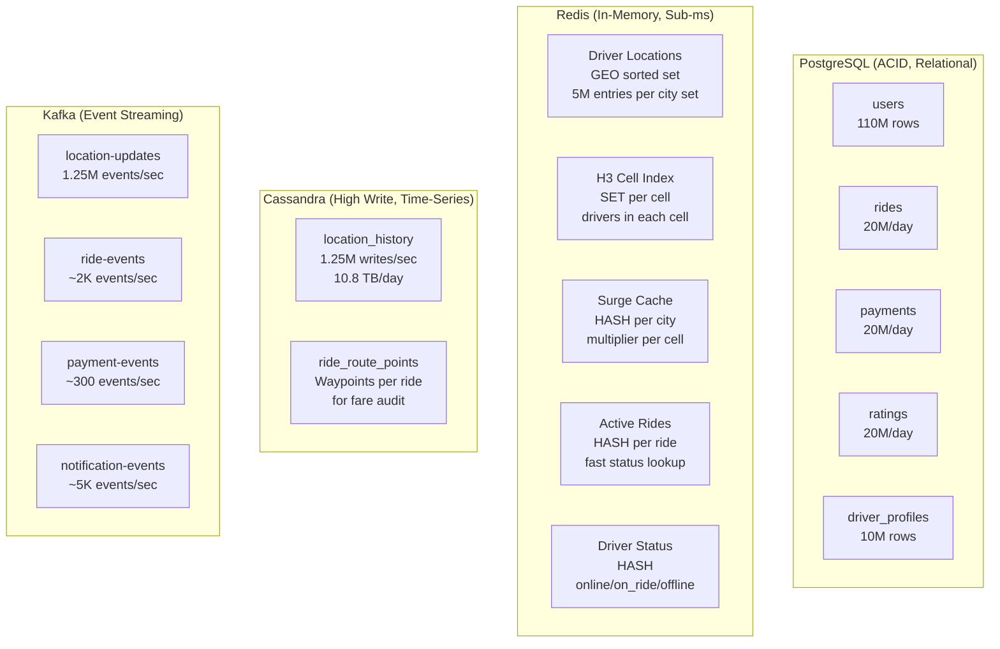

### 5.2 Indexing Strategy

```sql
-- PostgreSQL indexes for common queries

-- Find rides by rider (ride history)
CREATE INDEX idx_rides_rider_id ON rides(rider_id, created_at DESC);

-- Find rides by driver (earnings)
CREATE INDEX idx_rides_driver_id ON rides(driver_id, created_at DESC);

-- Find active rides (for monitoring)
CREATE INDEX idx_rides_active ON rides(status) WHERE status NOT IN ('COMPLETED', 'CANCELLED', 'PAID');

-- Payments by ride (lookup for idempotency)
CREATE UNIQUE INDEX idx_payments_idempotency ON payments(idempotency_key);
CREATE INDEX idx_payments_ride ON payments(ride_id);

-- Ratings aggregation
CREATE INDEX idx_ratings_rated ON ratings(rated_id, created_at DESC);
```

### 5.3 Sharding Strategy

```
PostgreSQL sharding:
  - Users: shard by user_id (hash-based)
  - Rides: shard by city + date (range-based)
    Why city: queries are city-local (riders/drivers in same city)
    Why date: most queries are recent (active rides, last week's earnings)
  - Payments: shard same as rides (co-located for join performance)

Redis sharding:
  - Driver locations: one Redis GEO set per city
    drivers:sf, drivers:nyc, drivers:london, ...
  - Each city's Redis can be on different nodes
  - Large cities split into sub-regions if needed

Cassandra sharding:
  - Automatic via partition key (driver_id, date)
  - Distributed across ring, no manual sharding needed
```

---

## 6. Communication Patterns

### 6.1 Synchronous (Request-Reply)

```
Used for: operations where the caller needs an immediate response

  Rider → API Gateway → Ride Service → Matching Service
  (Rider is waiting for a driver to be matched)

  Ride Service → Pricing Service → ETA Service
  (Need fare estimate before showing to rider)

  Ride Service → Payment Service → Stripe
  (Charge must complete before confirming ride payment)

Protocol: gRPC between services (efficient, typed, streaming support)
Timeout: 5s default, 30s for matching (includes driver acceptance)
Retry: exponential backoff with jitter, max 3 retries
Circuit breaker: trip after 50% failure rate in 10s window
```

### 6.2 Asynchronous (Event-Driven via Kafka)

```
Used for: high-throughput, fire-and-forget, or decoupled processing

  Driver location updates: WebSocket → Kafka → Location Consumer → Redis/Cassandra
  (1.25M/sec, cannot be synchronous)

  Notifications: Ride Service → Kafka → Notification Service → APNs/FCM
  (Don't block ride state transition on notification delivery)

  Analytics: All events → Kafka → Analytics Pipeline → Data Warehouse
  (Offline processing, no latency requirement)

  Surge calculation: Kafka (ride-requests + locations) → Flink → Redis
  (Stream processing, time-windowed aggregation)
```

### 6.3 Real-Time Push (WebSocket)

```
Used for: live bidirectional communication with drivers

  Driver → Server: GPS updates (every 4 seconds)
  Server → Driver: ride dispatch requests
  Server → Rider: driver location during ride (via WebSocket or push)

Connection management:
  - 5M concurrent WebSocket connections across ~100 servers
  - Sticky sessions: driver stays connected to same server (via connection_id)
  - Heartbeat: every 30 seconds to detect dead connections
  - Reconnect: driver app auto-reconnects with exponential backoff
  - If WebSocket fails: fall back to HTTP long-polling
```

### 6.4 Communication Decision Matrix

```
| Communication         | Pattern     | Why                                      |
|-----------------------|-------------|------------------------------------------|
| Location updates      | WebSocket   | High frequency, bidirectional needed      |
| Ride dispatch         | WebSocket   | Sub-second delivery to specific driver    |
| Fare estimate         | Sync gRPC   | Rider waiting for response               |
| Payment processing    | Sync gRPC   | Must confirm before completing ride       |
| Notifications         | Async Kafka | Don't block ride flow on notification     |
| Location storage      | Async Kafka | 1.25M/sec, must buffer for backpressure  |
| Surge calculation     | Async Kafka | Stream processing, periodic aggregation   |
| Rating submission     | Async Kafka | Non-critical path, eventual processing    |
| Analytics events      | Async Kafka | Offline processing                        |
```

---

## Key Interview Talking Points

> **Start with the architecture diagram.** Draw it on the whiteboard first. It gives
> the interviewer a mental map and lets them steer the conversation to what they care about.

> **Highlight the 3 hard problems:** (1) Location ingestion at 1.25M/sec, (2) Real-time
> matching with spatial queries, (3) Surge pricing with stream processing. Everything
> else is standard CRUD.

> **Mention Uber-specific tech:** H3 hexagonal grid (Uber open-sourced this), Kafka
> (Uber is one of the largest Kafka users), Cadence/Temporal for workflow orchestration,
> Schemaless (Uber's MySQL wrapper). This shows you've done your homework.
