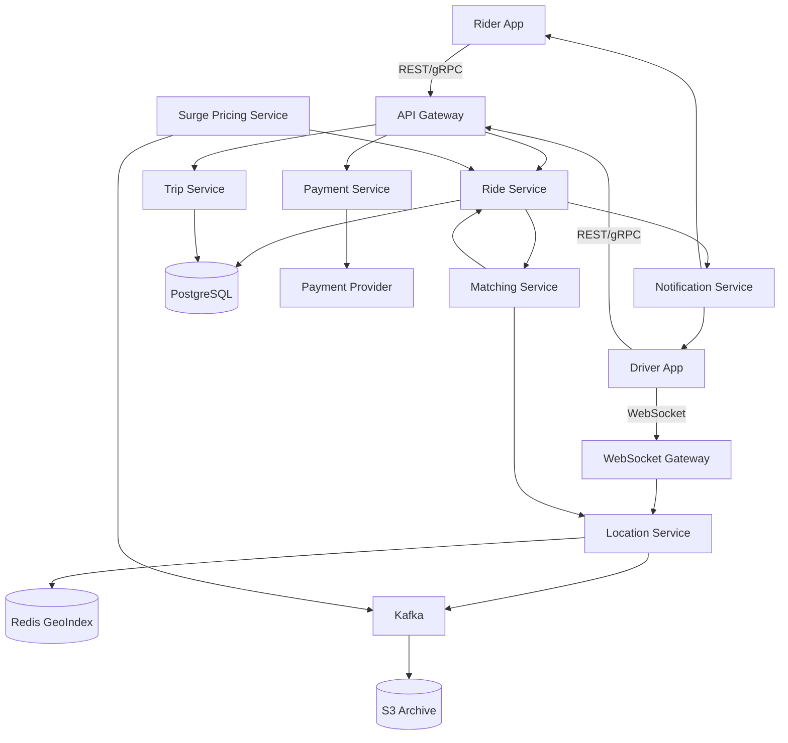

# Design Uber -- Interview Script (45 min)

## Opening (0:00 - 0:30)

> "Thanks for the problem! Designing a ride-sharing service like Uber is a great challenge -- it touches on real-time systems, geospatial indexing, matching algorithms, and financial transactions. Before I jump into the design, I'd like to ask a few clarifying questions to make sure I scope this correctly."

---

## Clarifying Questions (0:30 - 3:00)

Ask these questions one by one. Pause after each for the interviewer's response.

> **Q1:** "What's the expected scale we're designing for -- how many daily active riders and drivers? I want to make sure my design handles the right order of magnitude."
>
> **Expected answer:** ~100M riders, ~5M drivers, concentrated in metro areas.

> **Q2:** "Are we designing the full Uber experience -- ride request, matching, trip tracking, payment -- or should I focus on a specific subset?"
>
> **Expected answer:** Full ride lifecycle from request to payment.

> **Q3:** "How frequently do drivers send location updates? I assume this is the highest-throughput signal in the system."
>
> **Expected answer:** Every 3-4 seconds per active driver. You can assume ~1.25M location updates per second at peak.

> **Q4:** "Do we need to support different ride types -- UberX, Pool, Black -- or can I treat them as a single tier for now?"
>
> **Expected answer:** Start with single tier, mention how you'd extend it.

> **Q5:** "For matching, is it strictly nearest-driver, or do we factor in ETA, driver rating, acceptance rate?"
>
> **Expected answer:** Start with nearest driver, discuss multi-factor as a deep dive.

> **Q6:** "What's more important for this system -- consistency or availability? For example, can two riders ever get matched to the same driver?"
>
> **Expected answer:** We absolutely cannot double-book a driver. Strong consistency on matching.

> **Q7:** "Should I cover surge pricing in the design, or treat that as out of scope?"
>
> **Expected answer:** Yes, cover it at a high level.

---

## Requirements Summary (3:00 - 5:00)

> "Great, let me summarize what we're building before I start drawing."

> **"Functional Requirements:"**
> 1. "Riders can request a ride by specifying pickup and dropoff locations."
> 2. "The system matches a rider with the nearest available driver."
> 3. "Drivers send real-time location updates; riders see the driver approaching."
> 4. "The system tracks the trip in progress and calculates the fare."
> 5. "Payment is processed automatically at trip completion."
> 6. "Surge pricing adjusts fares based on supply/demand in a region."

> **"Non-Functional Requirements:"**
> 1. "Low latency on matching -- rider should see a driver within 5-10 seconds."
> 2. "Location ingestion at 1.25M updates/sec with minimal lag."
> 3. "Strong consistency on driver-to-rider matching -- no double-booking."
> 4. "High availability -- the system should be up 99.99% of the time."
> 5. "Payments must be exactly-once -- no double charges, no missed charges."

> "I'll focus the design on matching, location tracking, and trip management. Payment and surge pricing I'll cover at a slightly higher level."

---

## Back-of-Envelope Estimation (5:00 - 8:00)

> "Let me do some quick math to guide the design."

> **Location updates:**
> "5M drivers, maybe 25% active at peak = 1.25M active drivers. Each sends an update every 4 seconds. That's 1.25M / 4 = ~312K writes/sec just for location. Actually, the interviewer said 1.25M/sec at peak, so let me use that directly."

> **Ride requests:**
> "100M DAU riders. If 10% take a ride on a given day, that's 10M rides/day. Over 24 hours but concentrated in 8 peak hours: 10M / (8 * 3600) = ~350 ride requests/sec average, maybe 1K-2K/sec at peak."

> **Storage for location:**
> "Each location update: driver_id (8 bytes) + lat (8) + lng (8) + timestamp (8) + metadata (16) = ~48 bytes. At 1.25M/sec = 60MB/sec = ~5TB/day if we store all of them. We probably only need the latest location in a hot store, and archive the rest."

> **Storage for trips:**
> "10M trips/day, each trip record ~1KB = 10GB/day = ~3.6TB/year. Very manageable."

> "So the key bottleneck is location ingestion throughput -- 1.25M writes/sec. That's going to need a specialized solution, not a traditional RDBMS."

---

## High-Level Design (8:00 - 20:00)

> "Let me start with the high-level architecture. I'll draw the main components and then walk through the ride lifecycle."

### Step 1: Draw the clients

> "We have two clients -- the Rider App and the Driver App. The driver app is special because it continuously streams location data."

### Step 2: Draw the gateway layer

> "Both clients talk to an API Gateway, which handles authentication, rate limiting, and routes requests to the right service. For the driver location stream, we'll use a separate WebSocket gateway to handle persistent connections."

### Step 3: Draw the core services

> "Behind the gateway, I'll draw out the key microservices:"
>
> 1. **Ride Service** -- "Handles ride requests, manages the ride state machine."
> 2. **Matching Service** -- "Finds the best available driver for a ride request."
> 3. **Location Service** -- "Ingests and serves driver locations."
> 4. **Trip Service** -- "Manages in-progress trips, fare calculation."
> 5. **Payment Service** -- "Handles billing at trip completion."
> 6. **Surge Pricing Service** -- "Computes dynamic pricing per region."
> 7. **Notification Service** -- "Pushes real-time updates to riders and drivers."

### Step 4: Draw the data stores

> "For data stores:"
> - "**Redis / in-memory geospatial store** for real-time driver locations -- this is the hot path."
> - "**PostgreSQL** for ride and trip records -- strong consistency, ACID."
> - "**Kafka** as the event backbone -- location updates, ride events, all flow through here."
> - "**S3 / data lake** for archiving raw location data for analytics."

### Step 5: Whiteboard diagram

> "Here's what the whiteboard should look like at this point:"



### Step 6: Walk through the ride flow

> "Let me walk through the main flow -- a rider requesting a ride:"
>
> 1. "Rider opens the app, enters destination, taps 'Request Ride'."
> 2. "Request hits the API Gateway, routes to the Ride Service."
> 3. "Ride Service calls Surge Pricing Service to get the current multiplier for that zone."
> 4. "Ride Service calls the Matching Service with the pickup location."
> 5. "Matching Service queries the Location Service -- 'give me available drivers within 3km of this point'."
> 6. "Location Service does a geospatial query on Redis using GEORADIUS -- returns a ranked list."
> 7. "Matching Service picks the top candidate, atomically marks them as 'in-matching' to prevent double-booking."
> 8. "A ride offer is pushed to the driver via WebSocket."
> 9. "Driver accepts -- Matching Service confirms, Ride Service transitions to 'driver en route'."
> 10. "If driver declines or times out (15 sec), Matching Service picks the next candidate."
> 11. "During the trip, driver location updates stream through the Location Service and are pushed to the rider in real time."
> 12. "At trip end, Trip Service calculates fare, Payment Service charges the rider."

---

## API Design (within high-level)

> "Let me define the key APIs."

```
POST /api/v1/rides/request
Body: { rider_id, pickup_lat, pickup_lng, dropoff_lat, dropoff_lng }
Response: { ride_id, estimated_fare, surge_multiplier, eta_seconds }

POST /api/v1/rides/{ride_id}/accept      (driver)
Response: { ride_id, rider_info, pickup_location }

POST /api/v1/rides/{ride_id}/complete     (driver)
Response: { ride_id, fare, payment_status }

PUT /api/v1/drivers/{driver_id}/location  (high-frequency)
Body: { lat, lng, timestamp, heading, speed }
Response: 200 OK (minimal payload for throughput)
```

> "The location update endpoint is the highest-throughput API in the system. I'd keep the response minimal -- just a 200 -- to reduce bandwidth."

---

## Data Model (within high-level)

> "For the data model, I'd use these key tables in PostgreSQL:"

```sql
-- Rides table: source of truth for ride lifecycle
rides (
    ride_id         UUID PRIMARY KEY,
    rider_id        UUID NOT NULL,
    driver_id       UUID,
    pickup_lat      DECIMAL(10,7),
    pickup_lng      DECIMAL(10,7),
    dropoff_lat     DECIMAL(10,7),
    dropoff_lng     DECIMAL(10,7),
    status          ENUM('requested','matched','driver_en_route','in_progress','completed','cancelled'),
    surge_multiplier DECIMAL(3,2),
    fare_cents      INTEGER,
    created_at      TIMESTAMP,
    completed_at    TIMESTAMP
)

-- Driver availability (could also be in Redis)
drivers (
    driver_id       UUID PRIMARY KEY,
    status          ENUM('offline','available','in_matching','on_trip'),
    current_lat     DECIMAL(10,7),
    current_lng     DECIMAL(10,7),
    last_updated    TIMESTAMP
)
```

> "The driver's real-time location lives in Redis using the GEO data structure. PostgreSQL stores the canonical driver record."

---

## Deep Dive 1: Location Tracking and Driver Matching (20:00 - 30:00)

> "Now let me dive deeper into what I think is the hardest part of this system -- ingesting 1.25 million location updates per second and using that data for fast nearest-driver matching."

### Location Ingestion Pipeline

> "A single Redis instance can handle maybe 100K-200K operations/sec. For 1.25M/sec, I need to shard. My approach:"
>
> 1. "Partition the world into geospatial cells using something like Google S2 or Uber's H3 hexagonal grid."
> 2. "Each cell maps to a specific Redis shard. When a driver sends a location update, we hash their cell ID to determine which shard handles them."
> 3. "With 10-15 Redis shards, each handles ~80K-125K writes/sec -- well within capacity."
> 4. "Driver location updates flow: Driver App -> WebSocket Gateway -> Kafka (location topic) -> Location Consumer -> Redis GEO."

> "Kafka acts as a buffer here. If Redis is momentarily slow, Kafka absorbs the burst. The consumer can also fan-out to the analytics pipeline."

### Nearest Driver Query

> "When the Matching Service needs nearby drivers:"
>
> 1. "It determines which H3 cells are within the search radius of the pickup point."
> 2. "It queries the relevant Redis shards in parallel using GEORADIUS."
> 3. "Results are merged, sorted by distance, and filtered for availability."
> 4. "The top candidate is selected and atomically locked."

> "The locking part is critical. I'd use a Redis WATCH/MULTI/EXEC transaction: read the driver's status, if 'available', set to 'in_matching', all atomically. If someone else grabbed them first, the transaction fails and we move to the next candidate."

### Handling Driver Movement Across Shards

> "When a driver crosses from one H3 cell to another, they might move to a different Redis shard. The Location Service detects this on each update, removes the driver from the old shard, and adds them to the new one. There's a brief inconsistency window, but since we're talking about physical movement, a few hundred milliseconds of lag is fine."

### :microphone: Interviewer might ask:

> **"How do you find the nearest driver?"**
> **My answer:** "I use a geospatial index -- specifically Redis's GEO data structure backed by a sorted set. Drivers are indexed by their lat/lng. When a ride is requested, I run a GEORADIUS query centered on the pickup point with an expanding radius -- start at 1km, expand to 3km, then 5km if needed. The H3 hexagonal grid helps me determine which Redis shard to query. For a dense city, the first query usually returns 10-20 candidates. I sort by distance and pick the closest available one."

> **"What if a driver's location is stale?"**
> **My answer:** "Each location entry has a timestamp. During matching, I filter out any driver whose last update is older than 30 seconds -- they might be in a tunnel or have lost connectivity. I also have a TTL on the Redis GEO entries so stale drivers expire automatically."

> **"What about the thundering herd problem -- many riders requesting in the same area?"**
> **My answer:** "Good question. If 100 ride requests come in for the same area simultaneously, they'd all compete for the same top-3 drivers. The atomic locking prevents double-booking, but the retry storms could be expensive. I'd use an optimistic approach: each request gets a slightly randomized candidate ranking (add a small jitter to distance scores) to spread contention. Alternatively, I could use a centralized matching queue per region that batches requests every 500ms and does optimal assignment."

---

## Deep Dive 2: Surge Pricing and Payment Safety (30:00 - 38:00)

> "Another critical component is surge pricing and payment reliability. Let me dive into both."

### Surge Pricing

> "Surge pricing is fundamentally a supply-demand signal computed per geographic zone."
>
> 1. "I divide the service area into zones (using H3 cells at a coarser resolution than location tracking)."
> 2. "Every 30-60 seconds, a background job computes: demand = ride requests in zone / time window, supply = available drivers in zone."
> 3. "The surge multiplier is a function of demand/supply ratio. If ratio > 1.5, surge kicks in. If ratio > 3, heavy surge."
> 4. "The multiplier is written to a fast read store -- Redis or a local cache on the Ride Service instances."
> 5. "When a ride is requested, the Ride Service looks up the current surge for that zone and includes it in the fare estimate."

> "Key design choice: the surge multiplier is locked in at request time. Even if surge changes during matching, the rider pays what they were quoted."

### Payment Safety

> "Payment is the most sensitive part. I need exactly-once semantics."
>
> 1. "At ride request, I create a payment intent with an idempotency key (ride_id) -- no charge yet."
> 2. "At trip completion, Trip Service calculates the final fare (base + distance + time + surge)."
> 3. "Trip Service publishes a 'trip_completed' event to Kafka."
> 4. "Payment Service consumes the event, charges the rider using the pre-authorized payment method."
> 5. "The idempotency key ensures that even if the event is consumed twice (Kafka at-least-once delivery), the payment provider only charges once."
> 6. "Payment result is written back to the rides table and a receipt is sent."

### :microphone: Interviewer might ask:

> **"What if payment fails mid-ride?"**
> **My answer:** "Payment doesn't actually happen during the ride -- it happens at completion. But if the charge fails at completion, here's the flow: The Payment Service retries with exponential backoff (the card network might be temporarily down). If it still fails after 3 retries, the ride is marked as 'payment_pending' and the rider's account is flagged. They can't request another ride until the balance is settled. We also try alternative payment methods if the rider has them on file. For the driver, they still get paid -- Uber absorbs the credit risk."

> **"What if the driver's app crashes during a trip?"**
> **My answer:** "The trip state lives in the database, not on the device. If the driver's app reconnects, it fetches the current trip state and resumes. If the driver goes completely offline for more than 5 minutes, the system triggers an alert. The rider can cancel, and we use the last known location to compute a partial fare."

> **"How do you prevent fraud -- fake rides, GPS spoofing?"**
> **My answer:** "For GPS spoofing, we cross-check driver locations against expected movement patterns. If a driver teleports 50km in 3 seconds, we flag it. We also compare the trip's GPS trace against expected routes from a mapping service. For fake rides, we monitor for patterns like the same rider and driver repeatedly taking very short trips -- that's a sign of fraud for driver incentive bonuses."

---

## Trade-offs and Wrap-up (38:00 - 43:00)

> "Let me discuss some key trade-offs I considered during this design."

> **Trade-off 1: Redis GEO vs. dedicated geospatial database (PostGIS, ElasticSearch)**
> "I chose Redis because of raw throughput -- 1.25M writes/sec needs in-memory speed. PostGIS is more feature-rich for complex queries but can't match this write throughput. ElasticSearch geo queries are powerful but the indexing lag would make locations stale. The trade-off is that Redis GEO has simpler query capabilities -- I can't do polygon-based queries easily. But for nearest-neighbor, it's ideal."

> **Trade-off 2: Synchronous vs. asynchronous matching**
> "I chose synchronous matching -- the rider waits while we find a driver. An alternative is async: accept the request, return immediately, notify the rider when matched. Sync gives a better UX (instant feedback) but means the rider is blocked. At our scale, matching should complete in under 2 seconds, so sync is fine."

> **Trade-off 3: Push vs. pull for rider location updates**
> "I chose push via WebSocket -- the server streams the driver's location to the rider. The alternative is the rider polling every 2 seconds. Push is more efficient at scale (no wasted requests) and gives lower latency, but it requires maintaining WebSocket connections for all active riders. At 350K concurrent trips, that's 350K WebSocket connections -- manageable with horizontal scaling."

> **Trade-off 4: Strong consistency on matching vs. eventual consistency**
> "I chose strong consistency using Redis atomic transactions for the matching lock. The alternative is optimistic concurrency with conflict resolution. Strong consistency prevents double-booking at the cost of slightly higher latency on contention. Given that double-booking a driver would be a terrible user experience, this is the right call."

---

## Future Improvements (43:00 - 45:00)

> "If I had more time, I'd also consider these extensions:"

> 1. **"Ride pooling (UberPool)"** -- "This changes matching from 1:1 to N:1. I'd need a route-matching algorithm that computes whether adding a new rider to an existing pool trip still keeps detour under a threshold. This is an optimization problem -- possibly solved with a scoring function that balances detour time, driver utilization, and rider wait time."

> 2. **"Predictive driver positioning"** -- "Using historical demand data, we can predict where rides will be requested in the next 15-30 minutes and suggest drivers relocate proactively. This improves ETAs and reduces dead miles."

> 3. **"Multi-region / disaster recovery"** -- "Right now I've designed for a single region. For global deployment, I'd replicate the architecture per region with independent matching and location services. Cross-region concerns are mainly for user accounts and payment -- those could use a global database with local read replicas."

---

## Red Flags to Avoid

- **Don't say:** "We'll just use a SQL database for location tracking." 1.25M writes/sec demands an in-memory or specialized solution.
- **Don't forget:** The atomic locking on driver matching. Double-booking is the single worst failure mode.
- **Don't ignore:** The WebSocket infrastructure for real-time updates. REST polling won't cut it for live driver tracking.
- **Don't hand-wave:** Payment safety. Interviewers love to probe exactly-once payment semantics.
- **Don't skip:** Back-of-envelope math. The 1.25M/sec number should drive your entire storage architecture.

---

## Power Phrases That Impress

- "The key insight here is that location tracking is a write-heavy, read-moderate workload -- 1.25M writes/sec but only ~1K-2K matching reads/sec. This asymmetry means I can optimize the write path independently."
- "The trade-off between matching latency and matching quality is central to this design -- we could spend 10 seconds finding the globally optimal driver, but the rider expects an answer in 3."
- "I'm choosing H3 hexagonal cells over square grid cells because hexagons have uniform adjacency -- every neighbor is equidistant from the center, which eliminates edge-distance bias in geospatial queries."
- "For payment, idempotency keys are non-negotiable. In a distributed system with at-least-once delivery, the payment provider must be the deduplication layer."
- "The surge pricing signal is inherently eventually consistent -- and that's okay, because pricing doesn't need the same real-time guarantees as driver matching."
