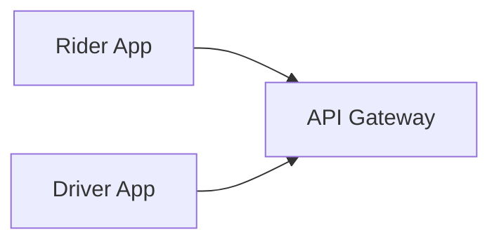
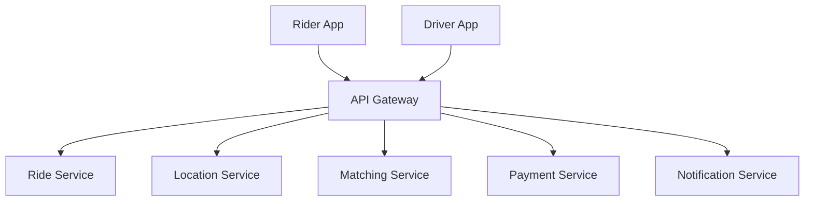
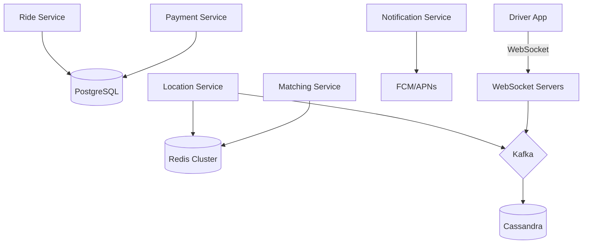
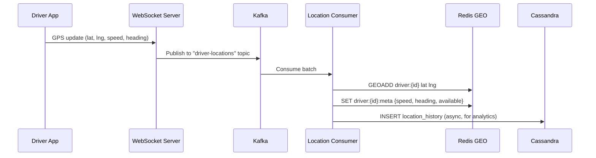
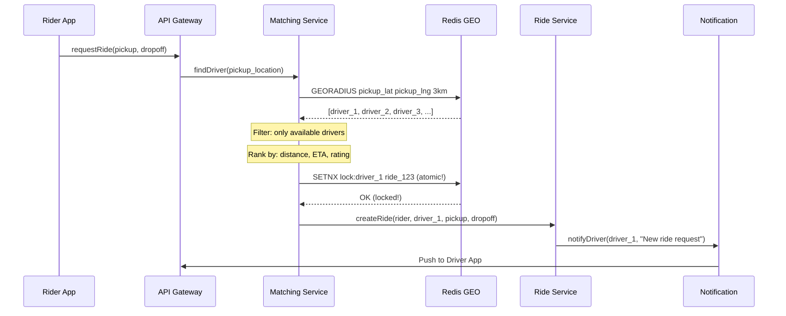

# Design Uber — How to Actually Nail This Interview

> This is NOT a script to memorize. This is how a senior engineer THINKS through this problem in real-time. Read it like you're watching someone design — understand the REASONING, not the words.

---

## Phase 1: Setting the Stage

The interviewer says: *"Design a ride-sharing service like Uber."*

Don't jump into drawing boxes. Start by **showing you think before you draw**.

---

### What to ask (and WHY you're asking it)

You're not asking questions to fill time. Each question shapes a DESIGN DECISION:

**"How many rides happen per day?"**

This isn't small talk. If the answer is 10K rides/day, you're building a monolith with PostgreSQL. If it's 20M rides/day, you need distributed services, message queues, sharding. The number changes EVERYTHING.

*Let's assume: 20M rides/day, 100M riders, 5M drivers.*

**"How often do drivers send their location?"**

This is THE most important question for Uber. Why? Because:
- 5M active drivers × 1 update every 4 seconds = **1.25 MILLION location writes per second**
- This single number dominates your entire architecture
- No SQL database handles 1.25M writes/sec — you need in-memory (Redis)
- This is what makes Uber's system design HARD — not the ride booking (that's only ~230/sec)

*Answer: Every 3-4 seconds. So 1.25M writes/sec.*

**"Can two riders ever get matched to the same driver?"**

This tells you about consistency requirements. The answer is obviously NO — so your matching service needs **strong consistency** for the driver lock. Everything else (location tracking, notifications) can be eventually consistent.

**"Should I cover surge pricing?"**

You're scoping. Interviewers appreciate when you actively manage scope. If they say yes, you know to allocate 5-10 minutes for it. If no, you saved time for deeper dives elsewhere.

---

### Summarize requirements — but make it FEEL like thinking, not reciting

Don't say: *"The functional requirements are: 1, 2, 3..."*

Instead:

*"So the core flow is: a rider opens the app, enters pickup and dropoff, the system finds the best available driver, the driver accepts, both track each other in real-time until pickup, the trip happens with live tracking, and at the end we charge the rider and pay the driver. The really interesting engineering challenge here is handling 1.25 million location updates per second while keeping the matching fast and accurate."*

See the difference? You've listed the same requirements, but you've shown you understand what's HARD about this problem.

---

## Phase 2: The Numbers Game (Estimation)

Don't do estimation as a separate "step." Weave it into your design naturally:

*"Before I draw anything, let me figure out what scale we're dealing with..."*

**Rides:**
- 20M rides/day ÷ 86,400 seconds = ~230 rides/sec
- Peak: 5× = ~1,150 rides/sec
- This is... not that much. A single PostgreSQL instance handles this easily.

**Location Updates (the real challenge):**
- 5M drivers × 1 update / 4 sec = 1.25M writes/sec
- Each update: ~100 bytes (driver_id, lat, lng, timestamp, heading, speed)
- Bandwidth: 1.25M × 100 bytes = ~125 MB/sec ingestion
- This is MASSIVE. This is what shapes our architecture.

**Storage:**
- Ride data: 20M × 1KB = 20GB/day — trivial
- Location history: 1.25M × 100 bytes × 86,400 = ~10TB/day — need time-series storage with TTL

**The key insight to communicate:**

*"So the ride booking itself is only ~230 QPS — that's easy. The HARD part is 1.25 million location updates per second. That's what drives most of our architecture decisions."*

This one sentence tells the interviewer you understand the REAL challenge. Most candidates design the whole system around ride booking and miss this entirely.

---

## Phase 3: Drawing the Architecture

### The Whiteboard Evolution

Don't draw the full architecture at once. BUILD it up layer by layer, explaining WHY each piece exists.

### Step 1: Start with the two clients

*"We have two types of clients — the Rider App and the Driver App. Both go through an API Gateway for auth, rate limiting, and routing."*

### Step 2: The obvious services

*"Behind the gateway, I need a few core services..."*

*"Ride Service manages the ride lifecycle. Location Service handles the 1.25M driver pings per second. Matching Service pairs riders with drivers. Payment handles charging. Notification pushes updates to both apps."*

### Step 3: Now add the data layer — this is where it gets interesting

*"Now, for data stores, I need to think carefully because different data has very different access patterns..."*

Now explain EACH choice:

*"PostgreSQL for rides and payments — these need ACID transactions. If a payment is half-committed, we have a problem."*

*"Redis for current driver locations — this is the only thing fast enough for 1.25M writes/sec. Redis GEO commands give us geospatial queries natively."*

*"Cassandra for location history — massive write throughput, time-series friendly, we set TTL of 30 days."*

*"Kafka as the transport layer between services — decouples the location ingestion from processing."*

*"WebSocket for driver connections — we need persistent bidirectional communication for real-time updates."*

**This is a critical interview skill**: justifying EVERY technology choice. Not "I'll use Redis" but "I'll use Redis BECAUSE 1.25M writes/sec requires in-memory storage, and Redis GEO gives me built-in geospatial indexing."

---

## Phase 4: Walking Through the Core Flows

### Flow 1: Driver Location Update (the high-throughput flow)

*"Let me walk through the most critical flow first — driver location updates, since this is the highest throughput in the system."*

*"The driver sends GPS coordinates every 4 seconds over a persistent WebSocket connection. The WebSocket server doesn't process the location — it just publishes to Kafka. A pool of Location Consumers reads from Kafka, updates Redis GEO (for spatial queries) and writes to Cassandra (for history). This decoupling via Kafka is important because if Redis is temporarily slow, Kafka buffers the messages — we don't lose data and don't block the WebSocket server."*

### Flow 2: Ride Matching (the brain)

*"Now when a rider requests a ride, the Matching Service needs to find the best driver..."*

Now pause and explain the **critical design decisions**:

*"There are three really important things happening here:*

*First, I'm using Redis GEORADIUS to find drivers within 3km. This is O(N+log(M)) where M is total drivers — extremely fast.*

*Second, the SETNX command — this is an atomic lock. If two riders try to get the same driver at the exact same time, only one SETNX succeeds. The other rider gets a different driver. This is how we prevent double-booking without needing a distributed lock.*

*Third, I'm querying by geospatial proximity, not just straight-line distance. In a production system, you'd use the ETA service to rank by actual road-network time, not just Haversine distance. But geospatial radius is the first filter to narrow from millions of drivers to maybe 20 candidates."*

---

## Phase 5: The Deep Dive

This is where you WIN or LOSE the interview. The interviewer will pick something and go deep.

### If they ask: "Tell me more about the location tracking at scale"

*"Great question. 1.25M writes per second is the defining challenge of this system. Let me break down how I'd handle it."*

**The naive approach and why it fails:**

*"If I tried to write 1.25M rows/sec to PostgreSQL, the database would die. Even a sharded MySQL cluster would struggle. The write amplification from indexes alone would kill it."*

**The architecture:**

*"So I need an in-memory data store — Redis. But even Redis has limits. A single Redis instance handles about 100K-200K ops/sec. For 1.25M, I need sharding."*

*"I'd partition by city/region. New York City gets its own Redis cluster. San Francisco gets another. This is natural for Uber because riders and drivers in NYC never interact with those in SF. Within a city, if I still need more throughput, I shard by geohash prefix."*

**The data flow:**

*"Drivers connect via WebSocket — one persistent TCP connection per driver. With 5M active drivers, that's 5M WebSocket connections. At ~50K connections per server, I need about 100 WebSocket servers. These servers are stateless — they just receive GPS pings and forward to Kafka.*

*Why Kafka in between? Three reasons: (1) It buffers during Redis maintenance or spikes. (2) Multiple consumers — I can add analytics, fraud detection, or heat map services without touching the location pipeline. (3) If a consumer crashes, it resumes from its Kafka offset — no data loss."*

**H3 Hexagonal Grid (show you know Uber's tech):**

*"For the spatial index, Uber actually uses H3 — their own hexagonal hierarchical grid. Instead of storing driver positions as exact lat/lng, each location is mapped to an H3 cell at resolution 9 (roughly 0.1 km²). To find nearby drivers, I query the rider's cell plus the 6 neighboring cells. This is faster than Redis GEORADIUS for Uber's scale because it's a simple hash lookup per cell, not a range query."*

---

### If they ask: "How does surge pricing work?"

*"Surge pricing is essentially a real-time supply-demand calculation per geographic area."*

*"I divide the city into H3 cells at resolution 7 — each about 5 km². For each cell, every 1-2 minutes, I calculate:*
- *Supply: number of available drivers in the cell*
- *Demand: number of ride requests in the last 5 minutes*
- *Surge multiplier = f(demand / supply) — usually a lookup table or sigmoid function, capped at 3-5×*

*This is a classic stream processing problem. Ride request events and driver availability events flow into Kafka. A Flink job consumes both, computes the ratio per H3 cell using a tumbling window (2 minutes), and outputs the surge multiplier to a Redis cache. When the Pricing Service calculates a fare, it looks up the surge multiplier for the pickup cell."*

*"The interesting edge case is spatial smoothing — you don't want a hard boundary where one side of a street has 3× surge and the other side has 1×. So I average the surge multiplier with neighboring cells."*

---

### If they ask: "What happens if [X] fails?"

**Redis goes down:**
*"If a Redis shard fails, we lose recent location data for drivers in that shard. But not forever — Kafka still has the messages. The failover takes maybe 10-30 seconds with Redis Sentinel. During that window, matching in that geographic area is degraded — we might serve stale driver positions. We don't block rides entirely; we fall back to a wider search radius."*

**Driver disconnects mid-ride:**
*"The WebSocket server detects the disconnect via heartbeat timeout (30 seconds). We DON'T immediately cancel the ride. The driver might be in a tunnel. We wait 2 minutes. If they reconnect, we resume. If not, we try to reach them via push notification. After 5 minutes with no response, we reassign the ride to another driver and notify the rider."*

**Payment fails:**
*"This is a saga. The flow is: Complete Ride → Charge Rider → Pay Driver. If the charge fails, we retry with exponential backoff (card networks have transient errors). We use an idempotency key so retries don't double-charge. If it permanently fails (declined card), we flag the ride for manual review and still pay the driver (Uber eats the cost). This is a business decision — you never punish the driver for a rider's payment issue."*

---

## Phase 6: Trade-offs (Show Maturity)

Don't wait for the interviewer to ask about trade-offs. Proactively discuss them:

*"Let me mention a few trade-offs I made:*

**1. Push vs Pull for location data**
*"I chose push (driver sends every 4 sec) over pull (server polls) because pull at 1.25M/sec means the server initiates 1.25M requests — that's worse. Push is natural since the driver already has a WebSocket connection."*

**2. H3/Geohash vs Quadtree for spatial indexing**
*"Geohash/H3 works better at this scale because it's a simple hash lookup, not a tree traversal. Quadtrees need rebalancing as drivers move, which is expensive with 1.25M updates/sec. Geohash cells are fixed — update is just removing from old cell and adding to new cell."*

**3. Kafka vs Direct RPC between services**
*"I could have the WebSocket server directly write to Redis. But Kafka gives me durability (if Redis is down, messages are buffered), fan-out (analytics service can also consume), and replay (if we need to reprocess). The trade-off is added latency — maybe 50-100ms. For location updates, that's acceptable."*

---

## Phase 7: Wrapping Up

*"If I had more time, I'd also design:*
- *ETA prediction using ML — historical travel times combined with real-time traffic*
- *Fraud detection — fake GPS locations, ride manipulation*
- *Multi-region deployment — each city is essentially independent, so we can partition by geography"*

---

## What Makes THIS Answer Great

| What you did | Why it impresses |
|-------------|-----------------|
| Identified 1.25M writes/sec as THE challenge | Shows you understand what's actually HARD, not just drawing boxes |
| Justified every tech choice with a reason | "Redis BECAUSE..." not just "I'll use Redis" |
| Used SETNX for driver locking | Shows practical distributed systems knowledge |
| Mentioned H3 hexagonal grid | Shows you know Uber's actual tech stack |
| Discussed Kafka as buffer + fan-out | Shows understanding of system resilience |
| Proactively discussed trade-offs | Shows engineering maturity, not just knowledge |
| Handled failure scenarios naturally | Shows production-thinking, not textbook-thinking |

## What NOT to Do

| Mistake | Why it's bad |
|---------|-------------|
| Drawing the full architecture first, then explaining | Interviewer can't follow your thinking |
| Saying "I'll use microservices" without justification | Everyone says this; it's meaningless |
| Spending 15 minutes on estimation | 3-5 minutes max, then move on |
| Ignoring the 1.25M writes/sec problem | Missing the elephant in the room |
| Saying "I'll use a NoSQL database" without specifying which | Shows surface-level understanding |
| Not asking any questions | Shows you don't think before designing |
| Treating surge pricing as simple "multiply by 2" | It's a real-time stream processing problem |

## The One Sentence That Wins This Interview

> *"The key insight is that Uber's system design is NOT dominated by ride bookings at 230 QPS — it's dominated by 1.25 million driver location updates per second. Every architectural decision flows from that number."*

If you say this in the first 5 minutes, the interviewer knows you get it.
