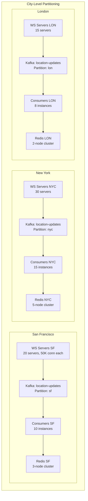
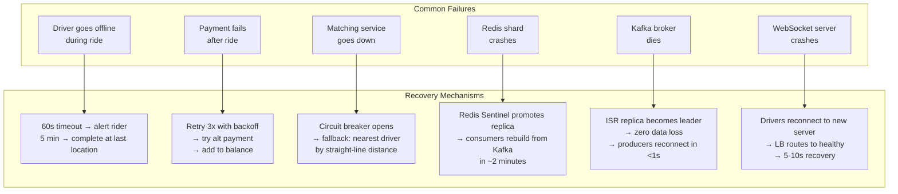
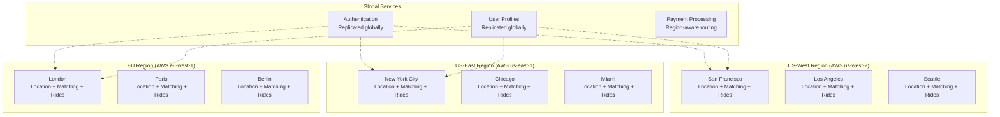

# Design Uber / Ride-Sharing Service: Scaling and Trade-offs

## Table of Contents
- [1. Database Choices and Justification](#1-database-choices-and-justification)
- [2. Scaling Strategies](#2-scaling-strategies)
- [3. Failure Handling](#3-failure-handling)
- [4. Multi-Region Architecture](#4-multi-region-architecture)
- [5. Monitoring and Observability](#5-monitoring-and-observability)
- [6. Trade-offs Discussion](#6-trade-offs-discussion)
- [7. Interview Tips and Common Mistakes](#7-interview-tips-and-common-mistakes)

---

## 1. Database Choices and Justification

### 1.1 Decision Matrix

```
| Data              | Store       | Why                                                   |
|-------------------|-------------|-------------------------------------------------------|
| Users, Rides      | PostgreSQL  | ACID transactions, relational joins, proven at scale   |
| Payments          | PostgreSQL  | Financial data requires strong consistency             |
| Driver locations  | Redis GEO   | 1.25M writes/sec needs in-memory speed (<1ms)         |
| Surge cache       | Redis HASH  | Read-heavy, low-latency, TTL-based expiry             |
| Active rides      | Redis HASH  | Frequent reads/writes during ride lifecycle            |
| Location history  | Cassandra   | 1.25M writes/sec, time-series, auto-TTL               |
| Events/streaming  | Kafka       | Decouple producers/consumers, replay, multi-consumer  |
| Trip receipts     | S3          | Immutable documents, cheap at scale                    |
| Analytics         | Data warehouse | Offline queries over petabytes of historical data   |
```

### 1.2 Why PostgreSQL for Core Data

```
Rides and payments are the revenue backbone. They need:
  - ACID transactions: rider charged exactly once, driver credited correctly
  - Referential integrity: ride must reference valid rider and driver
  - Complex queries: "rides by rider in last 30 days", "earnings by driver this week"
  - Well-understood operations: decades of tooling, backup, replication

What about Uber's actual database?
  Uber famously migrated from PostgreSQL to MySQL (2016) and built Schemaless
  (a MySQL-backed document store). The reasons were specific to their scale:
  - PostgreSQL replication was write-amplified at their volume
  - They needed more flexible schema evolution
  
  For an interview, PostgreSQL is the correct answer. It demonstrates you
  understand ACID requirements. Mention Uber's Schemaless as an optimization
  if the interviewer asks about Uber's actual stack.
```

### 1.3 Why Redis for Real-Time Data

```
The location service needs:
  - 1.25M writes/sec (GEOADD commands)
  - Sub-millisecond reads (GEORADIUS for matching)
  - Geospatial operations (built into Redis since 3.2)
  
Redis benchmarks:
  - Single instance: ~100K ops/sec (pipelined: ~500K)
  - With cluster: scales linearly across shards
  - 15 shards → ~1.5M ops/sec (covers our 1.25M + reads)

Why not a dedicated geospatial database (PostGIS, MongoDB)?
  - PostGIS: disk-based, ~50K ops/sec max
  - MongoDB: better than PostGIS but still disk-based at scale
  - Redis: pure in-memory, 10-100x faster for our write volume

Redis data size:
  5M drivers x 100 bytes = 500 MB
  This fits in a single machine's memory, but we shard by city
  for isolation and fault tolerance.
```

### 1.4 Why Cassandra for Location History

```
Requirements:
  - 1.25M inserts/sec (write-heavy)
  - 10.8 TB/day of location data
  - 30-day retention (auto-expire old data)
  - Time-series query pattern: "all locations for driver X on date Y"
  
Why Cassandra fits perfectly:
  1. LINEAR WRITE SCALING: add nodes to add throughput
     3 nodes → 1.5M writes/sec, 6 nodes → 3M writes/sec
  2. MASTERLESS: no single point of failure, any node accepts writes
  3. TTL: SET default_time_to_live = 2592000 (30 days), data auto-deletes
  4. TIME-SERIES OPTIMIZED: TimeWindowCompactionStrategy designed for this
  5. TUNABLE CONSISTENCY: CL=ONE for writes (fast), CL=ONE for reads (acceptable)

Why not a time-series database (InfluxDB, TimescaleDB)?
  - InfluxDB: excellent for metrics but struggles at 1M+ writes/sec
  - TimescaleDB: PostgreSQL-based, limited by single-master writes
  - Cassandra: proven at this exact use case (Uber, Netflix, Apple)
```

### 1.5 Why Kafka for Event Streaming

```
Kafka's role in the architecture:
  1. BUFFER between WebSocket servers and storage (absorb write spikes)
  2. FAN-OUT to multiple consumers (Redis, Cassandra, Flink, Analytics)
  3. REPLAY capability (re-process events if consumer had a bug)
  4. ORDERING within partition (city-level ordering for location events)

Throughput requirements:
  location-updates: 1.25M events/sec x 100 bytes = 125 MB/sec
  ride-events: ~2K events/sec (negligible)
  payment-events: ~300 events/sec (negligible)

Kafka can handle 200 MB/sec per broker. With 5 brokers and
replication factor 3, we have 1 GB/sec capacity (8x headroom).

Why not RabbitMQ or Redis Streams?
  - RabbitMQ: broker-centric, does not scale to 1M+ msg/sec
  - Redis Streams: possible but Kafka has better durability guarantees,
    multi-consumer group support, and ecosystem (Flink, Connect)
  - Kafka is purpose-built for this use case. Uber is one of the
    largest Kafka deployments in the world (trillions of messages/day).
```

---

## 2. Scaling Strategies

### 2.1 Location Service Scaling



```
Key insight: drivers in San Francisco never match with riders in New York.
City-level partitioning is PERFECT for this domain.

Benefits:
  - Each city scales independently (NYC gets more resources than Boise)
  - Redis dataset per city fits comfortably in memory
  - Kafka consumers only process their city's data
  - Failure in one city's infrastructure does not affect others
  - New city launch = new partition + new Redis shard (simple provisioning)

Large city sub-partitioning:
  NYC might have 500K online drivers. Can sub-partition by borough:
    - drivers:nyc:manhattan
    - drivers:nyc:brooklyn
    - drivers:nyc:queens
  Matching searches across boroughs near boundaries.
```

### 2.2 Matching Service Scaling

```
Matching is CPU-intensive but stateless:
  1. Read nearby drivers from Redis (I/O)
  2. Call ETA service for top candidates (I/O)
  3. Score and rank (CPU)
  4. Dispatch via WebSocket (I/O)

Scaling approach:
  - Stateless instances behind load balancer
  - Scale based on ride request QPS (peak ~1,150 QPS)
  - Each instance handles ~100 matching requests/sec
  - 12-15 instances cover peak with headroom

Partition by city:
  - Matching Service instances can be city-aware
  - Instance receives request → reads from city's Redis shard
  - No cross-city coordination needed
```

### 2.3 General Scaling Principles

```
Stateless services (horizontal scaling):
  - Ride Service, Matching Service, Pricing Service, ETA Service
  - Deploy N instances behind load balancer
  - Auto-scale based on CPU/QPS metrics
  - No sticky sessions (except WebSocket)

Stateful stores (vertical + horizontal):
  - PostgreSQL: read replicas for queries, primary for writes
    Shard by city for rides, hash-shard for users
  - Redis: cluster mode with hash slots
    Manual shard assignment by city
  - Cassandra: add nodes to ring (automatic rebalancing)

Message queues (partition scaling):
  - Kafka: add partitions per city/region
  - Each partition has independent throughput
  - Consumer group auto-rebalances across consumers
```

---

## 3. Failure Handling

### 3.1 Failure Scenarios and Recovery



### 3.2 Detailed Failure Handling

**Driver goes offline during ride:**

```
Detection:
  - No location updates for 60 seconds
  - WebSocket heartbeat fails (no pong response)
  - Location consumer notices gap in driver's update stream

Response:
  Phase 1 (0-60s): No location update → could be tunnel/bad signal
    Action: Continue ride, show last known location to rider
  
  Phase 2 (60-120s): Confirmed offline
    Action: Push notification to rider: "Connection with driver lost"
    Action: Alert driver via SMS: "Your connection was lost. Open app to reconnect."
  
  Phase 3 (>5 min): Driver does not reconnect
    Action: Complete ride at last known location
    Action: Calculate fare for distance traveled so far
    Action: Charge rider for partial ride
    Action: Open support case for review
```

**Payment fails after ride:**

```
Strategy: Idempotent retry with exponential backoff

  Attempt 1: Charge rider's default payment method
    → Card declined
  
  Wait 30 seconds
  Attempt 2: Retry same charge (same idempotency key)
    → Card declined again
  
  Wait 60 seconds  
  Attempt 3: Retry
    → Card declined
  
  Fallback: Try alternative payment method on file
    → Second card succeeds → PAID
  
  If all methods fail:
    - Add outstanding balance to rider's account
    - Rider cannot request new rides until balance paid
    - Send email: "Update your payment information"
    - Driver is still credited (Uber absorbs the risk)
```

**Matching service goes down:**

```
Circuit breaker pattern:
  
  Normal: Ride Service calls Matching Service
  
  When Matching Service errors > 50% in 10-second window:
    Circuit breaker OPENS
    
  Fallback behavior (degraded but functional):
    1. Query Redis GEORADIUS directly (skip ranking)
    2. Pick the nearest available driver by straight-line distance
    3. Skip ETA calculation (show "driver on the way" without ETA)
    4. Dispatch to nearest driver
    
  This gives ~80% of matching quality with 0% of Matching Service dependency.
  
  Circuit breaker auto-closes after 30 seconds of successful health checks.
```

### 3.3 Idempotency Design

```
Every write operation must be idempotent:

  Ride creation:
    - Client generates request_id (UUID)
    - Server checks: does a ride with this request_id exist?
    - If yes: return existing ride (duplicate request, safe to ignore)
    - If no: create ride
    
  Payment:
    - Idempotency key: "ride_{ride_id}_charge_{attempt}"
    - Payment Service stores key → result mapping
    - Duplicate charge requests return cached result
    
  Driver dispatch:
    - Redis SETNX lock per driver
    - Only one ride can be dispatched to a driver at a time
    - Lock auto-expires after 20 seconds
    
  Location updates:
    - GEOADD is inherently idempotent (updates existing entry)
    - Cassandra UPSERT with same primary key is idempotent
    - Kafka: at-least-once delivery + idempotent consumers
```

---

## 4. Multi-Region Architecture

### 4.1 Uber's Actual Approach: City-Level Partitioning



```
Why city-level partitioning works perfectly for ride-sharing:

  1. NO CROSS-CITY RIDES (mostly)
     A rider in SF will never match with a driver in NYC.
     Each city is a self-contained marketplace.
     
  2. LATENCY LOCALITY
     Rider in London should hit London servers (not US servers).
     City partitioning naturally maps to geo-proximity.
     
  3. INDEPENDENT SCALING
     NYC (large city) gets 10x resources of Boise (small city).
     Each city's infrastructure scales based on its market size.
     
  4. FAILURE ISOLATION
     If SF's Redis crashes, NYC rides continue unaffected.
     Blast radius limited to one city.
     
  5. REGULATORY COMPLIANCE
     EU data stays in EU region (GDPR).
     City-level partitioning makes this straightforward.

What IS globally shared:
  - User profiles (rider who travels SF → NYC needs same account)
  - Authentication (single sign-on across cities)
  - Payment configuration (payment methods, balances)
  - These are replicated globally with eventual consistency (acceptable)
```

### 4.2 Driver Routing on City Boundaries

```
Edge case: driver near the border of two cities

Example: driver is in Newark (near NYC boundary)
  - Rider in Manhattan requests a ride
  - Driver in Newark is actually closest

Solution:
  - Each city has a "boundary zone" that overlaps with adjacent cities
  - Newark drivers near the NYC boundary are indexed in BOTH cities' Redis
  - Matching Service queries both city shards for boundary riders
  - This adds minor complexity but prevents "invisible wall" at city borders
```

---

## 5. Monitoring and Observability

### 5.1 Key Metrics (Uber's Actual Metrics)

```
Business Metrics:
  - Ride completion rate: % of requested rides that complete (target: >95%)
  - Time to match (p50, p99): how long until driver accepts (target: p50 <15s)
  - ETA accuracy: predicted vs actual pickup time (target: within 2 minutes)
  - Surge coverage: % of rides affected by surge pricing
  - Driver utilization: % of online time drivers are on rides (target: >60%)
  - Cancellation rate: rider and driver cancellations (target: <5%)

Technical Metrics:
  - Location ingestion lag: time from GPS ping to Redis update (target: <2s)
  - Matching latency (p99): from ride request to driver dispatch (target: <3s)
  - Kafka consumer lag: messages behind in each partition (target: <1000)
  - Redis operation latency: GEOADD and GEORADIUS p99 (target: <5ms)
  - WebSocket connection count: total and per server (alert if >80% capacity)
  - Payment success rate: first-attempt charge success (target: >98%)
  
Alerts:
  - Ride completion rate drops below 90% → PAGE
  - Matching p99 > 10 seconds → PAGE
  - Kafka consumer lag > 100,000 → WARNING
  - Redis shard unreachable → PAGE
  - WebSocket server at 90% connection capacity → WARNING
  - Payment failure rate > 5% → PAGE
```

### 5.2 Distributed Tracing

```
Every ride generates a trace that spans all services:

  Trace: ride_request_abc123
    ├── Ride Service: create ride (5ms)
    ├── Pricing Service: get surge (3ms)
    │   └── Redis: HGET surge:sf (0.5ms)
    ├── Matching Service: find driver (1200ms)
    │   ├── Redis: GEORADIUS (2ms)
    │   ├── ETA Service: batch ETA for 10 drivers (150ms)
    │   │   └── Road Graph: A* routing (120ms)
    │   ├── Scoring + ranking (5ms)
    │   └── WebSocket dispatch (800ms) ← driver thinking time
    │       └── Driver acceptance (800ms)
    ├── Notification Service: notify rider (50ms)
    │   └── APNs: push notification (45ms)
    └── PostgreSQL: update ride record (3ms)

Tools: Jaeger (open-source, Uber-created) or Datadog APM
```

---

## 6. Trade-offs Discussion

### 6.1 Push vs Pull for Driver Locations

```
PUSH model (Uber's approach -- what we designed):
  Driver app pushes GPS every 4 seconds via WebSocket
  
  Pros:
    + Server always has fresh data
    + Can adjust push frequency dynamically (every 2s in city, every 10s on highway)
    + Bidirectional channel (server can push ride requests back)
    + Lower total network usage (no request/response overhead)
  
  Cons:
    - Server must maintain 5M persistent connections (resource-intensive)
    - Connection management complexity (reconnects, load balancing)
    - Battery drain on driver phones (mitigated by batching)

PULL model (alternative):
  Server polls each driver for location when needed (e.g., during matching)
  
  Pros:
    + No persistent connections needed
    + Simpler server architecture
    + Less resource usage when drivers are idle
  
  Cons:
    - Location data is stale (fetched on-demand, not pre-indexed)
    - Matching would need to query each driver → very slow
    - Cannot build spatial index proactively
    - Much higher latency for matching (poll 50 drivers = 50 round trips)

VERDICT: Push is clearly better for this use case. The spatial index needs
continuous updates to enable sub-second matching. Pull is only viable if
you don't need real-time matching.
```

### 6.2 H3 vs Geohash vs Quadtree for Spatial Indexing

```
H3 (Uber's choice):
  - Hexagonal grid, hierarchical resolutions (0-15)
  - UNIFORM ADJACENCY: 6 neighbors, all equidistant
  - Compact cell IDs (64-bit integer)
  - Open-sourced by Uber, designed for ride-sharing
  
  Best for:
    + Defining areas (surge zones, heat maps)
    + Uniform neighbor queries (no diagonal artifacts)
    + Hierarchical aggregation (zoom in/out)
  
  Limitations:
    - Not natively supported in Redis/databases (need application-level mapping)
    - More complex to implement than geohash

Geohash (Redis GEO's internal approach):
  - Rectangular grid, encoded as string (e.g., "9q8yyk8")
  - PREFIX MATCHING: "9q8yy" contains all cells starting with "9q8yy"
  - Natively supported in Redis GEO, PostgreSQL PostGIS, Elasticsearch
  
  Best for:
    + Database-native spatial queries
    + Simple proximity search
    + Well-established tooling
  
  Limitations:
    - NON-UNIFORM ADJACENCY: 8 neighbors, diagonals are farther
    - "Edge effect": nearby points can have very different geohashes
      (at hash boundaries)
    - Rectangular cells distort near poles

Quadtree:
  - Recursive spatial subdivision
  - Each node splits into 4 quadrants
  - Tree depth adapts to point density (dense areas have deeper trees)
  
  Best for:
    + Variable density (more detail where there are more points)
    + Efficient range queries in-memory
  
  Limitations:
    - Not a standard data structure in databases
    - Rebalancing needed as points move
    - More complex implementation

RECOMMENDATION FOR INTERVIEW:
  Use BOTH: Redis GEO (geohash under the hood) for real-time nearest-driver queries,
  H3 on the application layer for surge pricing and area-based analytics.
  This is exactly what Uber does.
```

### 6.3 Kafka vs Direct RPC for Service Communication

```
Kafka (async, event-driven):
  Used for: location updates, notifications, analytics, surge processing
  
  Pros:
    + Decouples producer from consumer (producer doesn't know/care who reads)
    + Absorbs traffic spikes (Kafka buffers on disk)
    + Multiple consumers read same data independently
    + Replay: reprocess events from any point in time
    + Exactly-once semantics with transactions
  
  Cons:
    - Higher latency (10-100ms vs 1-5ms for direct RPC)
    - Operational complexity (Kafka cluster management)
    - Not suitable when caller needs immediate response

Direct RPC (gRPC, synchronous):
  Used for: matching, fare calculation, ETA, payment
  
  Pros:
    + Low latency (1-5ms within same data center)
    + Request-response pattern is simple to reason about
    + Type-safe with protobuf schemas
    + Streaming support (useful for some use cases)
  
  Cons:
    - Tight coupling (caller blocks waiting for response)
    - No built-in retry/replay (need separate retry logic)
    - Single consumer (no fan-out)
    - If downstream is slow, upstream is slow

RULE OF THUMB:
  - Need immediate response? → gRPC
  - Fire-and-forget? → Kafka
  - High throughput (>100K/sec)? → Kafka (mandatory buffer)
  - Multiple consumers need same data? → Kafka
  - Financial transaction? → gRPC (need synchronous confirmation)
```

### 6.4 Consistency vs Availability Trade-offs

```
CAP theorem applied to Uber:

  Driver Locations (AP - Availability + Partition tolerance):
    - If Redis is partitioned, we prefer serving slightly stale data
      over refusing to match rides
    - A driver's location being 4 seconds stale is acceptable
    - Choose: eventual consistency, high availability
  
  Ride State (CP - Consistency + Partition tolerance):
    - A ride MUST NOT be assigned to two drivers simultaneously
    - If PostgreSQL is partitioned, we must refuse writes rather than
      create inconsistent state
    - Choose: strong consistency, sacrifice availability briefly
  
  Payments (CP - strong consistency):
    - Cannot double-charge riders
    - Cannot miss charging (Uber loses money)
    - Idempotency keys enforce exactly-once semantics
    - Choose: strong consistency always
  
  Surge Pricing (AP - availability):
    - If surge cache is stale by 30 seconds, that's fine
    - Better to show slightly old surge than show no price
    - Choose: eventual consistency, high availability
```

---

## 7. Interview Tips and Common Mistakes

### 7.1 What Interviewers Look For

```
1. SCALE AWARENESS
   - Do you recognize that location updates (1.25M/sec) dominate the system?
   - Do you know the difference between 1K QPS (trivial) and 1M QPS (hard)?
   - Can you do back-of-envelope math quickly and correctly?

2. REAL-TIME SYSTEM DESIGN
   - WebSocket for persistent connections (not HTTP polling)
   - Kafka for high-throughput buffering
   - Redis for sub-millisecond spatial queries
   - This combination appears in nearly every real-time system

3. SPATIAL REASONING
   - How do you find the nearest drivers to a rider?
   - How do you partition the world for supply-demand calculation?
   - What is H3/geohash and why does it matter?

4. STATE MANAGEMENT
   - Ride lifecycle state machine (state transitions, side effects)
   - Handling concurrent modifications (distributed locks)
   - Idempotency for payment processing

5. TRADE-OFF ARTICULATION
   - Every design decision has pros and cons
   - "We use Redis because..." not just "we use Redis"
   - "The trade-off is... and we accept it because..."
```

### 7.2 Common Mistakes

```
MISTAKE 1: Spending too long on requirements/API design
  Fix: 5 minutes max on requirements, then draw the architecture.
       The interviewer wants to see system design, not API documentation.

MISTAKE 2: Not identifying the scale bottleneck
  Fix: ALWAYS call out that location updates (1.25M/sec) are the hard part.
       Ride requests at ~1K QPS are easy. If you don't mention this,
       the interviewer thinks you don't understand the problem.

MISTAKE 3: Using HTTP polling for driver locations
  Fix: WebSocket. Always. 5M HTTP requests every 4 seconds is absurd.
       If you suggest HTTP polling, immediately correct yourself.

MISTAKE 4: Storing locations in PostgreSQL
  Fix: Redis for real-time spatial index, Cassandra for history.
       PostgreSQL cannot handle 1.25M inserts/sec.

MISTAKE 5: Ignoring the matching race condition
  Fix: Explain distributed locking. Two riders requesting the same driver
       at the same time MUST be handled. Redis SETNX is the standard solution.

MISTAKE 6: Forgetting about surge pricing
  Fix: Surge pricing is a key differentiator for Uber. Mention it during
       high-level design, offer to deep dive if the interviewer is interested.

MISTAKE 7: Not mentioning failure modes
  Fix: For each component, know what happens when it fails.
       "If Redis goes down, matching degrades to..." shows production thinking.
```

### 7.3 How to Stand Out

```
LEVEL 1 (Pass): Correct architecture, reasonable database choices,
  identify location updates as the scale challenge.

LEVEL 2 (Strong): All of Level 1 plus:
  - H3 hexagonal grid for spatial indexing
  - Kafka as buffer between WebSocket and storage
  - State machine for ride lifecycle
  - Idempotency for payments

LEVEL 3 (Exceptional): All of Level 2 plus:
  - Mention Uber-specific tech: H3, Cadence/Temporal, Schemaless
  - Batch matching vs greedy matching optimization
  - Surge pricing with stream processing (Flink/Kafka Streams)
  - City-level partitioning as the scaling strategy
  - Discuss trade-offs unprompted: "I chose X over Y because..."
  - Failure modes and graceful degradation for each service
```

### 7.4 Suggested 45-Minute Timeline

```
Minutes 0-5:   Requirements + estimation
                Clarify scope, state key numbers (20M rides/day, 1.25M loc/sec)
                
Minutes 5-10:  High-level architecture
                Draw the full diagram: 7 services + data stores + Kafka + clients
                
Minutes 10-20: Component walkthrough
                Explain each service briefly (1-2 min each)
                Focus on Location Service and Matching Service
                
Minutes 20-35: Deep dive (interviewer choice or yours)
                Location ingestion pipeline (WebSocket → Kafka → Redis/Cassandra)
                OR Matching algorithm (spatial query → rank → dispatch)
                OR Surge pricing (H3 cells → stream processing → cache)
                
Minutes 35-42: Scaling + trade-offs
                Database choices, city partitioning, failure handling
                Push vs pull, H3 vs geohash, Kafka vs RPC
                
Minutes 42-45: Q&A / extensions
                Ride pooling, scheduled rides, driver fraud detection
```

### 7.5 Quick Reference: Uber's Actual Tech Stack

```
For dropping knowledge in the interview:

  Spatial indexing:    H3 hexagonal grid (open-sourced by Uber)
  Workflow engine:     Cadence → now Temporal (open-sourced by Uber)
  Database:           Schemaless (MySQL-backed, built by Uber)
  Event streaming:    Kafka (one of the world's largest deployments)
  Stream processing:  Apache Flink (replaced Samza)
  Service framework:  TChannel → gRPC
  Service mesh:       Envoy-based
  Languages:          Go (most services), Java (some), Python (ML)
  Machine learning:   Michelangelo (Uber's ML platform)
  Maps:              In-house maps team + H3 + OSRM
  Driver matching:   ML-based reinforcement learning (production)
  Data warehouse:    Apache Hive + Presto
  Monitoring:        M3 (open-sourced by Uber, built on Prometheus)
```

---

## Summary: The Complete Mental Model

```
The Uber system has 3 layers of difficulty:

EASY (standard CRUD):
  - User profiles, ride history, payments, ratings
  - PostgreSQL, standard web services, nothing special

MEDIUM (real-time coordination):
  - Ride state machine with proper transitions
  - Notifications delivered within 2 seconds
  - Matching with spatial queries and ranking

HARD (massive scale):
  - 1.25M location updates/sec → WebSocket + Kafka + Redis pipeline
  - Sub-second matching across millions of drivers → geospatial indexing
  - Dynamic surge pricing → stream processing with H3 grid

The interviewer is testing whether you can identify which parts are hard,
design specifically for those challenges, and articulate the trade-offs
in your choices.
```
