# Design WhatsApp / Chat Messaging System -- Deep Dive and Scaling

## Table of Contents

- [1. Deep Dive: WebSocket Connection Management at Scale](#1-deep-dive-websocket-connection-management-at-scale)
- [2. Deep Dive: Message Ordering and Delivery Guarantees](#2-deep-dive-message-ordering-and-delivery-guarantees)
- [3. Deep Dive: Group Messaging at Scale](#3-deep-dive-group-messaging-at-scale)
- [4. Scaling Strategies](#4-scaling-strategies)
- [5. Database Schema -- Complete](#5-database-schema----complete)
- [6. Failure Handling](#6-failure-handling)
- [7. Monitoring and Observability](#7-monitoring-and-observability)
- [8. Trade-offs and Alternatives](#8-trade-offs-and-alternatives)
- [9. Interview Tips and Common Follow-ups](#9-interview-tips-and-common-follow-ups)

---

## 1. Deep Dive: WebSocket Connection Management at Scale

### The Scale of the Problem

```
Concurrent users:           100,000,000 (100M)
WebSocket connections:      100,000,000 (1 per user)
Connections per server:     50,000 (practical limit with epoll/kqueue)
WS Gateway servers needed:  100M / 50K = 2,000 servers
Memory per connection:      ~10 KB (TCP buffers + session state)
Memory per server:          50K * 10 KB = ~500 MB just for connections
```

Each WS Gateway server is a high-performance event-loop server (e.g., written in
Erlang/BEAM like WhatsApp, or Go/Rust) that multiplexes 50K connections on a single
process using non-blocking I/O.

### User-to-Server Routing Table

The core challenge: when User A sends a message to User B, how does the Chat Service
know which of the 2,000 WS Gateway servers holds User B's connection?

**Solution: Redis-based routing table.**

```
Key:    conn:{user_id}
Value:  {"gateway": "ws-gw-087", "conn_id": "c_29481", "connected_at": 1712500000}
TTL:    None (explicitly deleted on disconnect)
```

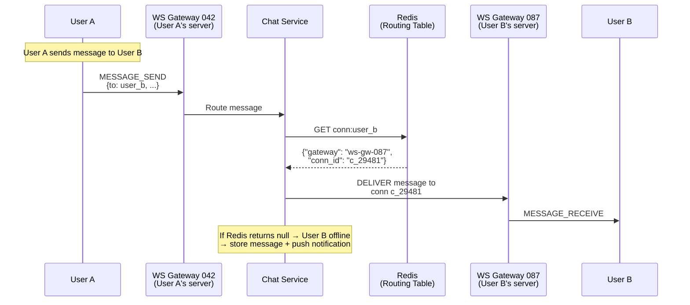

### Connection Lifecycle Management

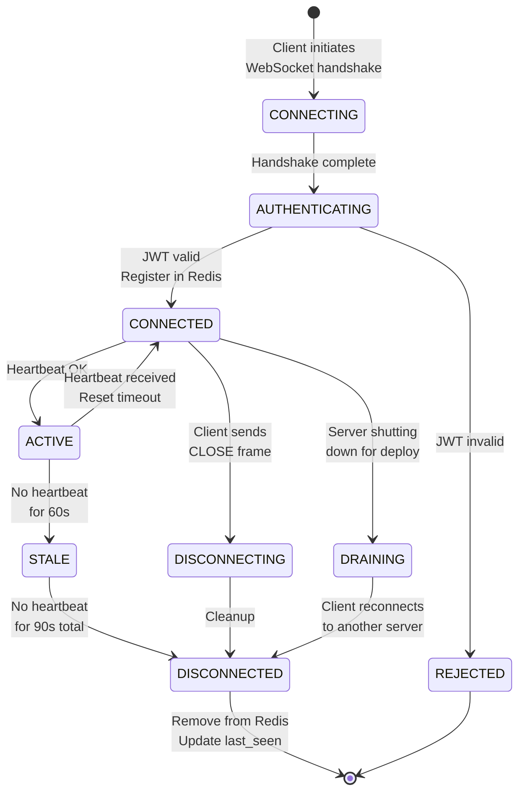

### Handling Server Failures

When a WS Gateway server crashes, its 50K connections are lost:

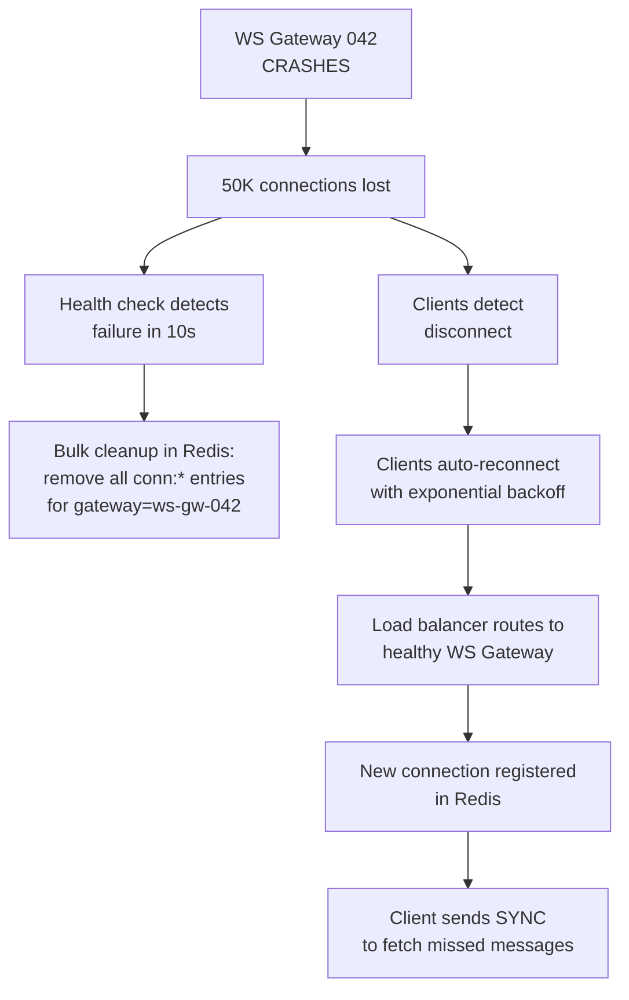

**Reconnection strategy:**

1. Client detects disconnect (no PONG response, TCP reset, etc.).
2. Reconnect with exponential backoff: 1s, 2s, 4s, 8s... up to 60s max.
3. Add jitter to prevent thundering herd (50K clients reconnecting simultaneously).
4. On reconnect, client sends SYNC with `last_sequence` per chat to catch up on missed messages.

### Gateway Fleet Deployment (Zero Downtime)

Rolling deployments of 2,000 servers require **connection draining:**

1. Mark server as "draining" -- it stops accepting new connections.
2. Send `RECONNECT` frame to all connected clients with a different server address.
3. Clients gracefully disconnect and reconnect to the new server.
4. Wait for all connections to drain (timeout: 60 seconds).
5. Shut down the old server process.
6. Repeat for next batch (deploy 5% of fleet at a time → 100 servers per batch).

### Multi-Region WebSocket Routing

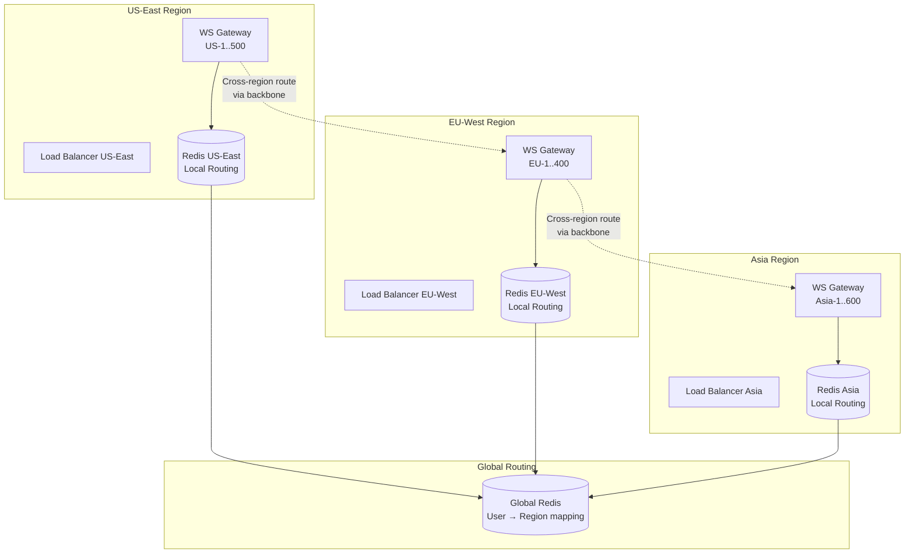

**Routing logic when User A (US) messages User B (Asia):**

1. Chat Service in US-East looks up `conn:user_b` in local Redis → miss.
2. Looks up in Global Redis → `{region: "asia", gateway: "ws-asia-312"}`.
3. Routes message over the inter-DC backbone to the Asia region.
4. Asia Chat Service delivers to WS Gateway Asia-312 → User B.
5. Added latency: ~100-150ms for cross-region hop.

---

## 2. Deep Dive: Message Ordering and Delivery Guarantees

### The Ordering Problem

In a distributed system, messages can arrive out of order due to:
- Network latency variance between different WS Gateway servers.
- Retries after transient failures.
- Cross-region routing delays.
- Group fan-out happening at different speeds for different members.

### Solution: Per-Chat Monotonic Sequence Numbers

```mermaid
graph TD
    subgraph "Chat Service"
        A[Message arrives] --> B[Acquire per-chat<br>sequence counter]
        B --> C{Counter mechanism}
        C -->|Option 1| D[Redis INCR<br>chat_seq:{chat_id}]
        C -->|Option 2| E[Cassandra<br>LWT counter]
        C -->|Option 3| F[ZooKeeper<br>sequential node]
        D --> G[Assign sequence_number<br>to message]
        E --> G
        F --> G
        G --> H[Persist with<br>sequence_number]
    end
```

**Chosen approach: Redis INCR**

```
INCR chat_seq:chat_abc123  → returns 48292
```

- Redis INCR is atomic and returns the new value.
- Single-threaded Redis ensures no gaps or duplicates.
- Performance: ~100K INCR/sec per Redis instance.
- For 50K chats/sec, we shard across multiple Redis instances by `chat_id`.

### Client-Side Ordering

The client maintains messages sorted by `sequence_number`, not by timestamp:

```
Scenario: Two messages arrive out of order

Received: msg_B (seq=48292) arrives before msg_A (seq=48291)

Client buffer:
  Position 1: [empty - seq 48291 expected]
  Position 2: msg_B (seq=48292)

After msg_A arrives:
  Position 1: msg_A (seq=48291)  ← inserted in correct position
  Position 2: msg_B (seq=48292)

Client renders in sequence order, not arrival order.
```

### Exactly-Once Semantics

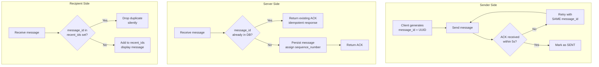

**Server-side dedup:**

```sql
-- Before inserting, check if message_id exists
-- Use Cassandra LWT (Lightweight Transaction) for atomic check-and-insert:
INSERT INTO messages (chat_id, sequence_num, message_id, ...)
VALUES ('chat_abc', 48292, 'msg_uuid_123', ...)
IF NOT EXISTS;
```

**Client-side dedup:**

The client maintains a Bloom filter or LRU set of the last 10,000 `message_id` values.
Any incoming message with a known ID is silently dropped.

### Offline Delivery Guarantee

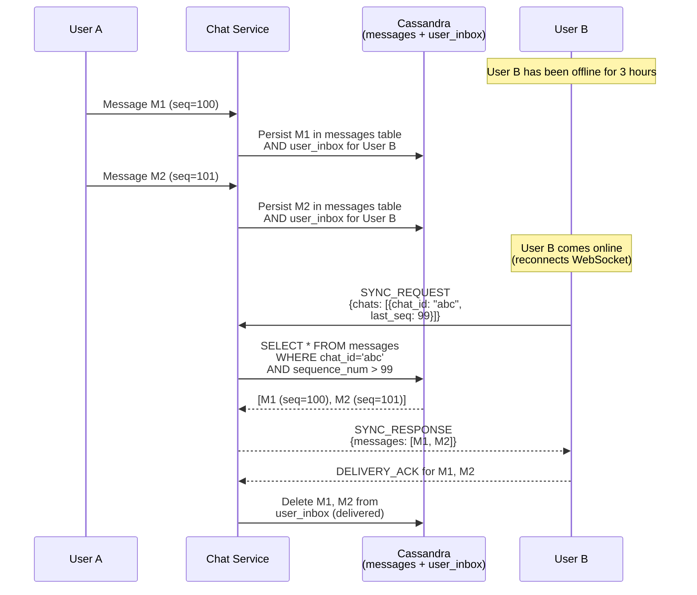

**Multi-chat sync on reconnect:**

When a user reconnects, they may have missed messages across many chats. The client
sends a single SYNC request with `{chat_id, last_sequence}` for each active chat.
The server batches responses.

```json
{
  "event": "SYNC_REQUEST",
  "chats": [
    {"chat_id": "chat_abc", "last_seq": 99},
    {"chat_id": "chat_def", "last_seq": 500},
    {"chat_id": "group_xyz", "last_seq": 1200}
  ]
}
```

---

## 3. Deep Dive: Group Messaging at Scale

### Fan-Out on Write (WhatsApp's Approach)

For a group of N members, when one member sends a message:

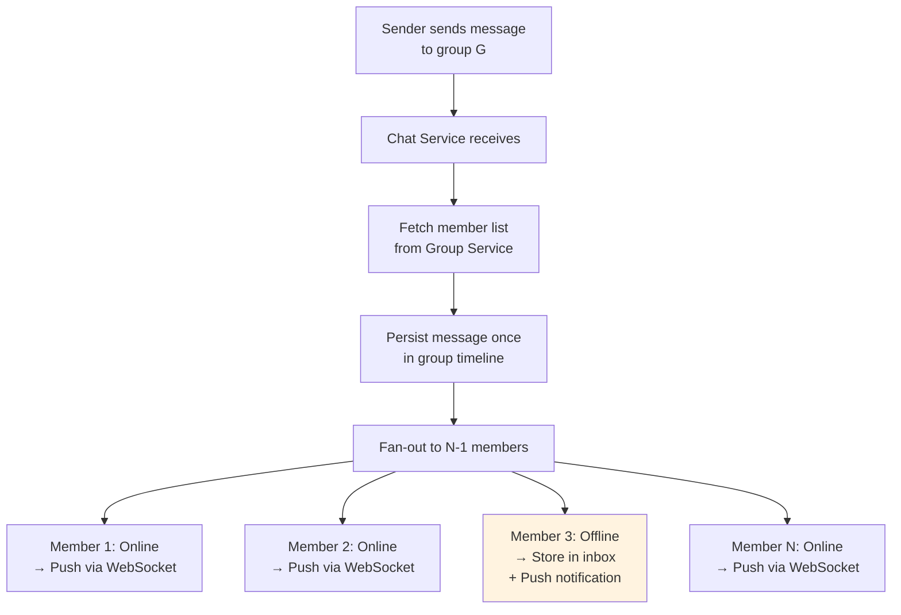

**Write amplification analysis:**

```
Group size:                  256 members
Messages per group per day:  ~500 (active group)
Fan-out writes per message:  255 (to each member except sender)
Total writes per group/day:  500 * 255 = 127,500
Total groups:                ~500 million
Active groups per day:       ~100 million

Total fan-out writes/day:    100M groups * 500 msgs * 255 fan-out
                            = ~12.75 trillion... too high?

Reality: most groups are small (5-10 people) and not highly active.
Average group size:          ~12 members
Average messages/group/day:  ~50
Fan-out writes/day:          100M * 50 * 11 = 55 billion
```

This is manageable with Cassandra's write throughput.

### Fan-Out Workers Architecture

To avoid the Chat Service becoming a bottleneck during group fan-out, the work is
offloaded to dedicated **fan-out workers** via Kafka:

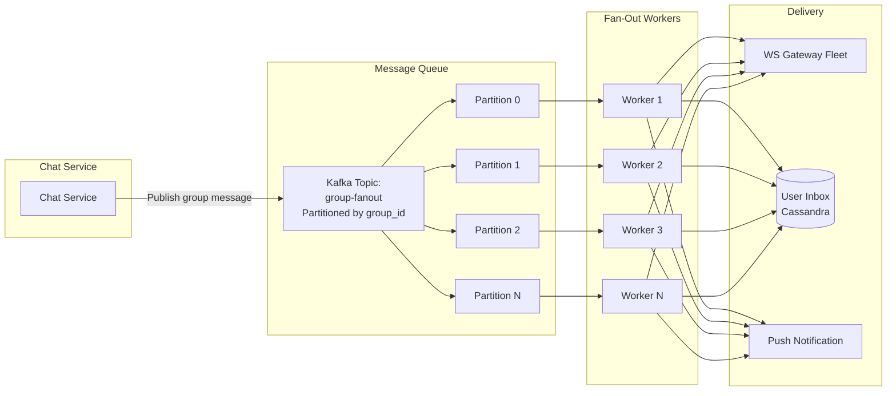

**Fan-out worker logic:**

```
1. Consume message from Kafka partition.
2. Fetch group member list (cached in local memory, refreshed every 5 min).
3. For each member (excluding sender):
   a. Check presence in Redis.
   b. If online → route to their WS Gateway server.
   c. If offline → write to user_inbox in Cassandra + enqueue push notification.
4. Commit Kafka offset after all members processed.
```

### Group Member List Management

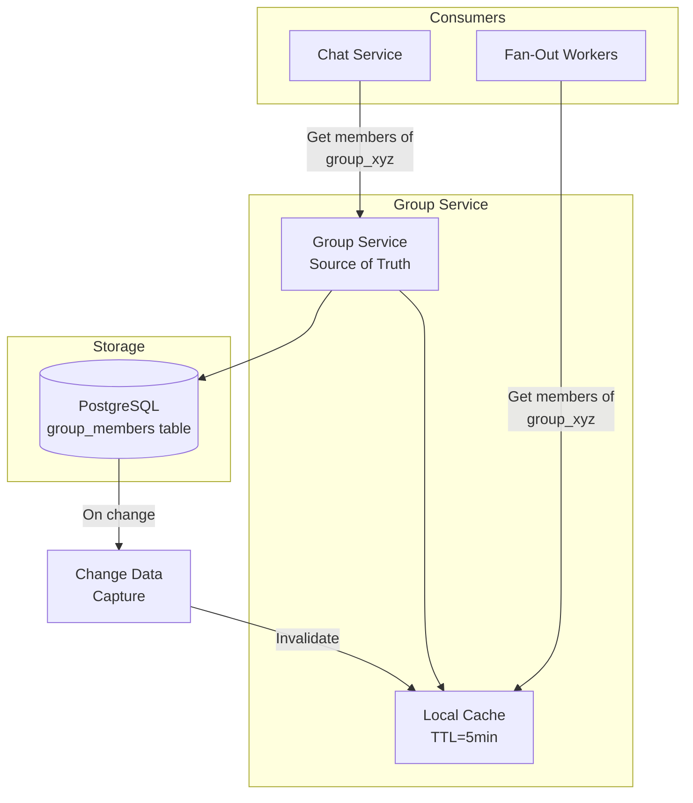

When a member is added or removed:
1. Group Service updates PostgreSQL.
2. CDC (Change Data Capture) invalidates the cached member list.
3. Next fan-out request fetches the updated list.
4. A "member joined/left" system message is sent to the group.

### Fan-Out on Read (Alternative for Large Groups)

If WhatsApp increased the group limit to, say, 10,000 members (like Telegram channels),
fan-out on write becomes impractical. The alternative:

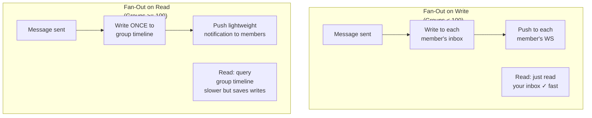

| Strategy | Writes per Message | Reads per Message | Best For |
|---|---|---|---|
| Fan-out on Write | O(N) - one per member | O(1) - read own inbox | Small groups, active users |
| Fan-out on Read | O(1) - one write | O(N) - each member queries | Large groups, many lurkers |

**WhatsApp's choice:** Fan-out on write for all groups (max 256), because:
- 256 writes per message is acceptable.
- Users expect instant delivery without pulling.
- Read latency matters more than write amplification at this group size.

---

## 4. Scaling Strategies

### 4.1 Partitioning Strategy

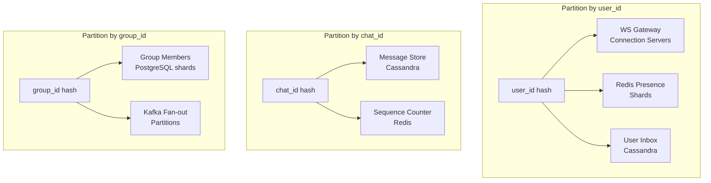

### 4.2 Horizontal Scaling Plan

| Component | Scaling Dimension | Current | Scale Factor |
|---|---|---|---|
| WS Gateway | Connections | 2,000 servers | Add servers, 50K conn each |
| Chat Service | Messages/sec | Stateless, auto-scale | Kubernetes HPA on CPU |
| Cassandra (Messages) | Storage + throughput | 1000-node cluster | Add nodes, rebalance |
| Redis (Presence) | Users online | 100-node cluster | Shard by user_id hash |
| Redis (Routing) | Connections | 50-node cluster | Shard by user_id hash |
| Kafka | Message throughput | 500-node cluster | Add partitions + brokers |
| Media (S3) | Storage | Managed service | Infinite scale |
| PostgreSQL (Users) | Reads | Read replicas + Vitess | Shard by user_id |

### 4.3 Caching Strategy

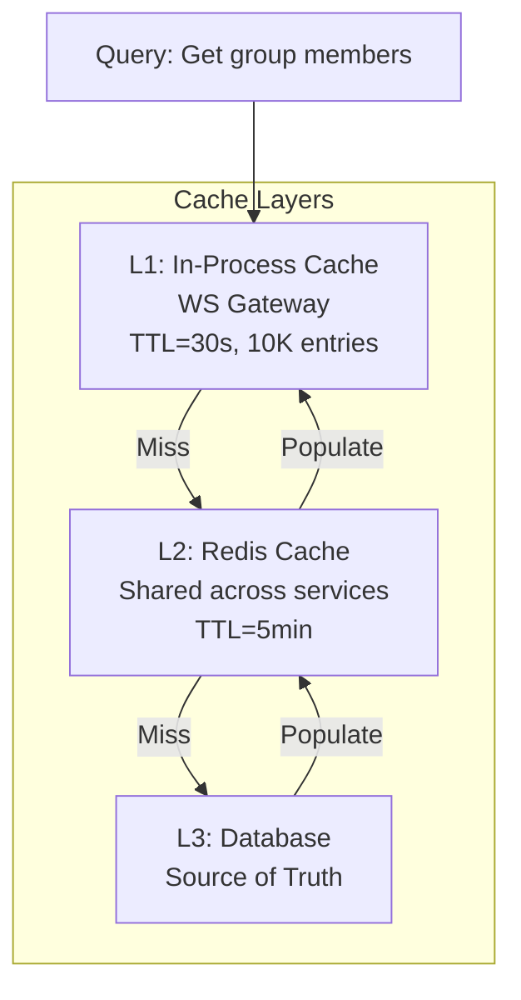

**What to cache:**

| Data | Cache Location | TTL | Invalidation |
|---|---|---|---|
| User profile | Redis | 1 hour | On profile update |
| Group member list | Redis + local | 5 min | On member change (CDC) |
| User presence | Redis | 90s (heartbeat) | TTL expiry |
| Connection routing | Redis | None | Explicit delete on disconnect |
| Sequence counters | Redis | None | Persistent (INCR) |

### 4.4 Hot Partition Handling

Some chats are extremely active (celebrity groups, company-wide groups). These can
create hot partitions in Cassandra.

**Mitigation strategies:**

1. **Rate limiting:** Enforce per-chat message rate limits (e.g., 100 messages/min).
2. **Partition splitting:** For hot chats, use a composite partition key:
   `(chat_id, bucket)` where `bucket = sequence_num / 10000`.
3. **Write buffering:** Batch writes for very hot chats (write every 100ms instead of per-message).
4. **Read caching:** Cache recent messages for hot chats in Redis.

---

## 5. Database Schema -- Complete

### PostgreSQL (User and Group Metadata)

```sql
-- Users table
CREATE TABLE users (
    user_id         UUID PRIMARY KEY DEFAULT gen_random_uuid(),
    phone_number    VARCHAR(20) UNIQUE NOT NULL,
    display_name    VARCHAR(100),
    about           VARCHAR(500),
    profile_pic_url TEXT,
    identity_key    BYTEA,          -- E2EE public identity key
    created_at      TIMESTAMPTZ DEFAULT NOW(),
    last_seen       TIMESTAMPTZ,
    is_active       BOOLEAN DEFAULT TRUE
);

CREATE INDEX idx_users_phone ON users (phone_number);

-- Groups (chat metadata for group chats)
CREATE TABLE groups (
    group_id        UUID PRIMARY KEY DEFAULT gen_random_uuid(),
    chat_id         UUID UNIQUE NOT NULL,
    name            VARCHAR(100) NOT NULL,
    description     VARCHAR(500),
    icon_url        TEXT,
    created_by      UUID REFERENCES users(user_id),
    created_at      TIMESTAMPTZ DEFAULT NOW(),
    max_members     INT DEFAULT 256
);

-- Chat members (both 1:1 and group)
CREATE TABLE chat_members (
    chat_id         UUID,
    user_id         UUID,
    role            VARCHAR(10) DEFAULT 'member', -- admin, member
    last_read_seq   BIGINT DEFAULT 0,
    muted_until     TIMESTAMPTZ,
    joined_at       TIMESTAMPTZ DEFAULT NOW(),
    PRIMARY KEY (chat_id, user_id)
);

CREATE INDEX idx_chat_members_user ON chat_members (user_id);

-- E2EE Key Bundles
CREATE TABLE key_bundles (
    user_id         UUID REFERENCES users(user_id),
    signed_pre_key  BYTEA NOT NULL,
    spk_signature   BYTEA NOT NULL,
    spk_id          INT NOT NULL,
    uploaded_at     TIMESTAMPTZ DEFAULT NOW(),
    PRIMARY KEY (user_id)
);

CREATE TABLE one_time_pre_keys (
    user_id         UUID,
    key_id          INT,
    public_key      BYTEA NOT NULL,
    used            BOOLEAN DEFAULT FALSE,
    PRIMARY KEY (user_id, key_id)
);

-- Device tokens for push notifications
CREATE TABLE device_tokens (
    user_id         UUID,
    device_id       UUID,
    platform        VARCHAR(10),    -- ios, android, web
    push_token      TEXT NOT NULL,
    updated_at      TIMESTAMPTZ DEFAULT NOW(),
    PRIMARY KEY (user_id, device_id)
);
```

### Cassandra (Messages)

```sql
-- Primary message store
-- Partition: chat_id ensures all messages for a chat are co-located
-- Clustering: sequence_num DESC for efficient "latest messages" query
CREATE TABLE messages (
    chat_id         UUID,
    sequence_num    BIGINT,
    message_id      UUID,
    sender_id       UUID,
    msg_type        TEXT,          -- text, image, video, document, audio, system
    encrypted_body  BLOB,          -- E2E encrypted ciphertext
    media_url       TEXT,
    media_thumb_url TEXT,
    media_size      BIGINT,
    reply_to_seq    BIGINT,        -- sequence of message being replied to
    status          TEXT,          -- sent, delivered, read
    created_at      TIMESTAMP,
    PRIMARY KEY (chat_id, sequence_num)
) WITH CLUSTERING ORDER BY (sequence_num DESC)
  AND compaction = {'class': 'TimeWindowCompactionStrategy',
                    'compaction_window_size': 1,
                    'compaction_window_unit': 'DAYS'}
  AND gc_grace_seconds = 864000
  AND default_time_to_live = 2592000;  -- 30 days for server-side storage

-- User inbox for offline delivery
-- When user comes online, query this table to get all pending messages
CREATE TABLE user_inbox (
    user_id         UUID,
    created_at      TIMESTAMP,
    chat_id         UUID,
    message_id      UUID,
    sequence_num    BIGINT,
    sender_id       UUID,
    encrypted_body  BLOB,
    msg_type        TEXT,
    PRIMARY KEY (user_id, created_at)
) WITH CLUSTERING ORDER BY (created_at ASC)
  AND default_time_to_live = 2592000;  -- 30 days

-- Message receipt tracking (for group read receipts)
CREATE TABLE message_receipts (
    chat_id         UUID,
    sequence_num    BIGINT,
    user_id         UUID,
    status          TEXT,          -- delivered, read
    timestamp       TIMESTAMP,
    PRIMARY KEY ((chat_id, sequence_num), user_id)
);
```

### Redis Key Design

```
# Connection routing (which WS Gateway server holds user's connection)
conn:{user_id}              → {"gateway": "ws-gw-087", "conn_id": "c_29481"}

# Presence (online/offline with TTL)
presence:{user_id}          → {"status": "online", "gateway": "ws-gw-087"}
                              TTL: 90 seconds (refreshed by heartbeat)

# Typing indicators (ephemeral)
typing:{chat_id}:{user_id}  → 1
                              TTL: 5 seconds

# Per-chat sequence counter
chat_seq:{chat_id}          → 48292  (INCR for each new message)

# Presence subscriptions (who wants to know when user_id comes online)
subs:{user_id}              → SET of subscriber user_ids

# Rate limiting
rate:{user_id}:msg          → count
                              TTL: 60 seconds (sliding window)
```

---

## 6. Failure Handling

### Failure Scenarios and Mitigations

```mermaid
graph TD
    subgraph "Failure: WS Gateway Crash"
        F1A[WS Gateway crashes] --> F1B[50K connections lost]
        F1B --> F1C[Clients auto-reconnect<br>with backoff + jitter]
        F1C --> F1D[SYNC on reconnect<br>catches up missed messages]
    end

    subgraph "Failure: Chat Service Down"
        F2A[Chat Service pod fails] --> F2B[Kubernetes restarts pod<br>in 10-30s]
        F2B --> F2C[Load balancer routes<br>to healthy pods]
        F2C --> F2D[Client retries with<br>same message_id<br>server-side dedup handles it]
    end

    subgraph "Failure: Cassandra Node Down"
        F3A[Cassandra node fails] --> F3B[Replication factor 3<br>2 replicas still available]
        F3B --> F3C[Read/Write at QUORUM<br>still succeeds with 2/3]
        F3C --> F3D[Failed node replaced<br>or repaired]
    end

    subgraph "Failure: Redis Down"
        F4A[Redis node fails] --> F4B[Redis Cluster failover<br>replica promoted in 10s]
        F4B --> F4C[During failover:<br>messages go to push notification<br>path as fallback]
    end
```

### Message Loss Prevention Checklist

```
1. Client retries until ACK received        → No loss on send path
2. Server persists BEFORE sending ACK       → No loss on server crash
3. Cassandra RF=3, QUORUM writes            → No loss on single node failure
4. Offline messages stored + push notified  → No loss for offline users
5. Client SYNC on reconnect                 → No loss on connection drop
6. Client-generated message_id + dedup      → No duplicates on retry
7. 30-day TTL on undelivered messages       → Eventually garbage collected
```

### Split-Brain and Network Partition Handling

If a network partition splits the WS Gateway fleet:

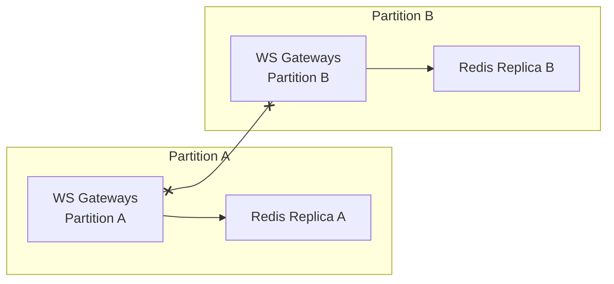

**Mitigation:**

1. Stale routing entries in Redis may point to servers in the other partition.
2. Delivery failures trigger fallback to **push notification path**.
3. Messages are still persisted in Cassandra (which handles partitions via its own protocol).
4. When the partition heals, clients reconnect and SYNC catches up.
5. Worst case: messages are delayed, never lost.

---

## 7. Monitoring and Observability

### Key Metrics Dashboard

| Metric | Target | Alert Threshold |
|---|---|---|
| Message delivery latency (P50) | < 100ms | > 150ms |
| Message delivery latency (P99) | < 500ms | > 1000ms |
| WebSocket connection count | 100M | < 80M (capacity risk) |
| Messages sent per second | ~50K | > 250K (peak threshold) |
| Cassandra write latency (P99) | < 20ms | > 50ms |
| Redis operation latency (P99) | < 5ms | > 10ms |
| Push notification delivery rate | > 98% | < 95% |
| Message delivery success rate | > 99.99% | < 99.95% |
| WebSocket reconnection rate | < 1%/min | > 5%/min (infra issue) |
| Undelivered message queue depth | < 1M | > 10M |

### Distributed Tracing

Every message gets a **trace_id** that follows it through the system:

```
trace_id: abc123
span 1: [Client A → WS Gateway]     12ms
span 2: [WS Gateway → Chat Service]  3ms
span 3: [Chat Service → Cassandra]    8ms
span 4: [Chat Service → Redis]        2ms
span 5: [Chat Service → WS Gateway B] 4ms
span 6: [WS Gateway B → Client B]    15ms
─── Total: 44ms ───
```

### Health Checks

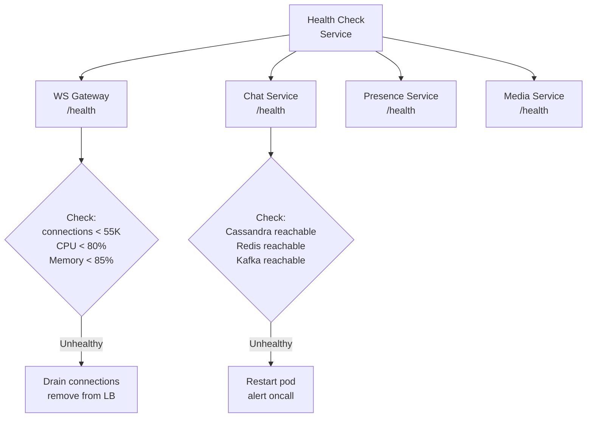

---

## 8. Trade-offs and Alternatives

### Key Design Decisions

| Decision | Chosen | Alternative | Why |
|---|---|---|---|
| Connection protocol | WebSocket | MQTT / gRPC streaming | WebSocket is standard; MQTT better for low-bandwidth |
| Message store | Cassandra | HBase / ScyllaDB / TiKV | Cassandra: proven at scale, tunable consistency |
| Presence store | Redis | In-memory on WS servers | Redis: shared state, survives single server failure |
| Message queue | Kafka | RabbitMQ / SQS | Kafka: high throughput, partitioned, replay capability |
| Group fan-out | Write-time | Read-time | Small groups (max 256) make write fan-out feasible |
| Encryption | Signal Protocol | Custom / TLS-only | Signal: gold standard, proven, open-source |
| Sequence numbers | Redis INCR | DB sequence / Snowflake ID | Redis: fast, atomic, simple |
| Media storage | S3 | Custom blob store | S3: managed, durable, CDN-integrated |

### What WhatsApp Actually Uses (Known from Public Information)

- **Language:** Erlang/BEAM (for the server -- exceptional at handling millions of concurrent connections).
- **Database:** Mnesia (Erlang's built-in distributed database) for routing; custom storage for messages.
- **Protocol:** Custom binary protocol based on XMPP, later migrated to Noise Protocol Framework.
- **Encryption:** Signal Protocol (adopted in 2016 for all messages).
- **Infrastructure:** Originally bare-metal servers. Now part of Meta infrastructure.
- **Scale fact:** WhatsApp served 450 million users with just 32 engineers in 2014.

### Multi-Device Support (WhatsApp's Challenge)

WhatsApp originally was single-device (phone is the primary device). Multi-device
support was added later as "linked devices":

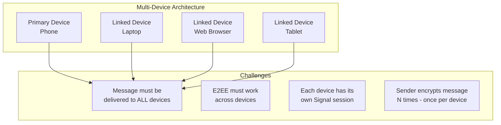

For multi-device E2EE, the sender encrypts the message once per recipient device
(not just per recipient user). This increases encryption overhead but maintains
the security guarantee that only intended devices can decrypt.

---

## 9. Interview Tips and Common Follow-ups

### How to Structure Your Answer (45 Minutes)

```
Minutes 0-5:    Clarify requirements, scope the problem
Minutes 5-10:   Back-of-envelope estimation
Minutes 10-15:  High-level architecture (draw the main diagram)
Minutes 15-25:  Core message flow (1:1 chat: send → store → deliver)
Minutes 25-35:  Deep dive (interviewer picks: encryption? scaling? ordering?)
Minutes 35-45:  Trade-offs, failure handling, monitoring
```

### Common Interviewer Questions and Answers

**Q: How do you handle a user with 1000 group chats coming online?**

A: On reconnect, the client sends a single SYNC request with `{chat_id, last_seq}` for
each chat. The server batches responses. For efficiency, the server first returns chats
with the most unread messages. The client can paginate per-chat. Critical optimization:
the server maintains a lightweight "has unread" index per user.

**Q: How do you ensure messages are not lost if the server crashes right after
receiving but before persisting?**

A: The server sends the SENT ACK only after the Cassandra write is confirmed (quorum
acknowledged). If the server crashes before persisting, no ACK is sent, and the client
retries with the same `message_id`. If the server crashes after persisting but before
sending ACK, the client retries, and the server returns an idempotent ACK (message
already exists).

**Q: How does E2EE work with server-side message search?**

A: It does not. Server-side full-text search is impossible with E2EE because the server
only has ciphertext. WhatsApp search is client-side only (searches the local message
database on the device). This is a deliberate trade-off: privacy over convenience.

**Q: How would you add message reactions?**

A: Reactions are lightweight messages sent to the chat with `type=reaction`,
`reply_to_seq` pointing to the reacted message, and `content` being the emoji.
Fan-out follows the same path as regular messages. Reactions are aggregated client-side.

**Q: How do you handle the "last seen" privacy setting?**

A: The Presence Service checks the sender's privacy settings before returning presence
information. If User A has set "last seen" to "nobody" or "my contacts," the Presence
Service filters the response based on the relationship between the requester and the user.

**Q: What happens if Kafka goes down?**

A: Kafka is used for asynchronous fan-out and push notifications. If Kafka is unavailable:
- Group fan-out falls back to synchronous delivery (slower but functional).
- Push notifications are buffered in a local queue on the Chat Service and retried.
- Messages are already persisted in Cassandra before Kafka publish, so no message loss.

**Q: How would you support message editing and deletion?**

A: Both are "update" messages:
- **Edit:** A new message with `type=edit`, `reply_to_seq` referencing the original, and
  new content. Clients replace the original message's display.
- **Delete for everyone:** A message with `type=delete`, `reply_to_seq` referencing the
  original. Clients remove the message. A 1-hour time window is enforced (client + server).
  Server marks the original message as tombstoned.

### Red Flags to Avoid

1. **"Just use a single MySQL database"** -- This does not scale to 50K messages/sec.
2. **Ignoring E2EE entirely** -- Encryption is core to WhatsApp's design. At least mention it.
3. **HTTP polling for real-time** -- WebSocket/persistent connections are essential.
4. **No offline handling** -- A huge percentage of messages are delivered to offline users.
5. **Ignoring message ordering** -- Without sequence numbers, conversations become garbled.
6. **"Store everything forever"** -- WhatsApp is a transient relay; messages belong on devices.

### Key Numbers to Memorize

```
2 billion:       Registered users
100 million:     Peak concurrent connections
100 billion:     Messages per day
50,000:          WebSocket connections per server
2,000:           WebSocket Gateway servers
256:             Max group size
30 days:         Server-side message retention
< 200ms:         Target message delivery latency
Signal Protocol: X3DH + Double Ratchet for E2EE
Cassandra:       Partition by chat_id, cluster by sequence_number
Redis:           Presence (TTL=90s), routing (conn:{user_id}), sequence counters
```

### Comparison with Similar Systems

| Feature | WhatsApp | Telegram | Discord | Slack |
|---|---|---|---|---|
| E2EE | Default for all | Optional (secret chats) | No | No |
| Group size | 256 | 200,000 | Unlimited (servers) | Unlimited (channels) |
| Message storage | On-device | Server-side cloud | Server-side | Server-side |
| Media retention | 30 days server | Permanent | Permanent | Permanent |
| Protocol | Custom binary | MTProto | WebSocket | WebSocket |
| Fan-out strategy | Write | Read (channels) | Read | Read |
| Search | Client-side | Server-side | Server-side | Server-side |

---

*This completes the full system design walkthrough for WhatsApp / Chat Messaging System.
Review [Requirements and Estimation](./requirements-and-estimation.md) and
[High-Level Design](./high-level-design.md) for the complete picture.*
