# Design WhatsApp / Chat Messaging System -- High-Level Design

## Table of Contents

- [1. Architecture Overview](#1-architecture-overview)
- [2. Component Breakdown](#2-component-breakdown)
- [3. Message Flow -- 1:1 Chat](#3-message-flow----11-chat)
- [4. Message Flow -- Group Chat](#4-message-flow----group-chat)
- [5. Media Service](#5-media-service)
- [6. Presence Service](#6-presence-service)
- [7. Push Notification Service](#7-push-notification-service)
- [8. Message Storage](#8-message-storage)
- [9. Delivery Semantics](#9-delivery-semantics)
- [10. End-to-End Encryption](#10-end-to-end-encryption)
- [11. Delivered and Read Receipts](#11-delivered-and-read-receipts)
- [12. System Diagram Summary](#12-system-diagram-summary)

---

## 1. Architecture Overview

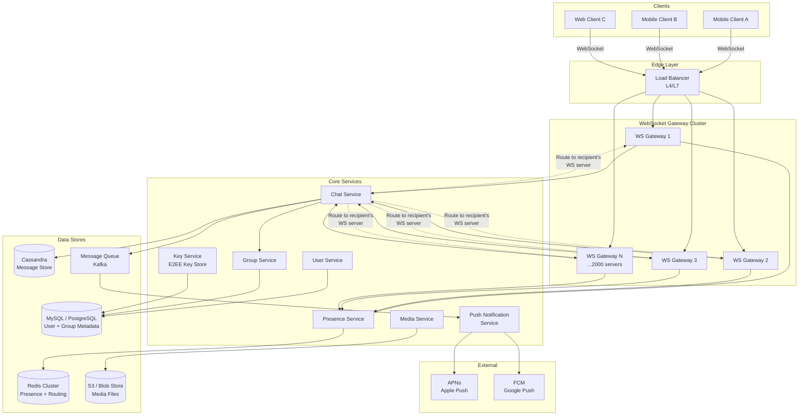

### Key Design Principles

1. **WebSocket-first:** All real-time communication flows through persistent WebSocket connections.
2. **Server as relay:** The server relays encrypted ciphertext; it never sees plaintext.
3. **Stateless services:** Chat Service, Presence Service, etc. are stateless; state lives in data stores.
4. **Transient message storage:** Messages are stored until delivered, then logically belong to the client.
5. **Fan-out at the gateway layer:** For group messages, the Chat Service determines recipients, then the gateway layer handles fan-out to individual WebSocket connections.

---

## 2. Component Breakdown

### 2.1 WebSocket Gateway

The WebSocket Gateway is the most critical component -- it holds **100 million concurrent
persistent connections**.

**Responsibilities:**

- Maintain persistent WebSocket (or MQTT for low-bandwidth) connections with clients.
- Authenticate connections on handshake (JWT token validation).
- Route incoming messages to the Chat Service.
- Deliver outgoing messages from the Chat Service to the correct client connection.
- Handle heartbeats (ping/pong every 30 seconds) to detect dead connections.
- Manage graceful connection draining during deployments.

**Design Details:**

```
Concurrent connections:         100,000,000
Connections per server:         50,000
Number of WS Gateway servers:   2,000
Memory per connection:          ~10 KB (buffers + metadata)
Memory per server:              50,000 * 10 KB = 500 MB (connection state only)
```

**Connection Protocol:**

```
1. Client opens WebSocket to wss://chat.whatsapp.com/ws
2. Load balancer routes to a WS Gateway server (sticky via IP hash or connection ID)
3. Client sends AUTH frame with JWT token
4. Gateway validates token with User Service
5. Gateway registers {user_id → gateway_server_id, connection_id} in Redis
6. Heartbeat loop begins (client sends PING every 30s, server responds PONG)
7. If no heartbeat for 90s, connection is considered dead → cleanup
```

**Why WebSocket (not HTTP long-polling or SSE)?**

| Protocol | Latency | Bidirectional | Overhead | Battery |
|---|---|---|---|---|
| WebSocket | ~50ms | Yes | Low (2-byte frame header) | Good |
| Long Polling | ~200ms | Simulated | High (HTTP headers each poll) | Poor |
| SSE | ~100ms | No (server→client only) | Medium | Medium |
| MQTT | ~30ms | Yes | Very low | Excellent |

WhatsApp uses a **custom protocol over TCP** (similar to XMPP-derived Noise Protocol),
but for this design we model it as WebSocket for clarity.

### 2.2 Chat Service

The stateless core that handles message routing logic.

**Responsibilities:**

- Receive messages from the WebSocket Gateway.
- Validate message structure, enforce rate limits.
- Assign server-side `sequence_number` (per-chat monotonic counter).
- Persist the message to Cassandra.
- Determine the recipient(s):
  - **1:1 chat:** Look up the other user.
  - **Group chat:** Fetch the member list from Group Service.
- Route the message to the correct WebSocket Gateway server(s).
- If the recipient is offline, enqueue for Push Notification Service.
- Return a SENT acknowledgment to the sender.

**Message Processing Pipeline:**

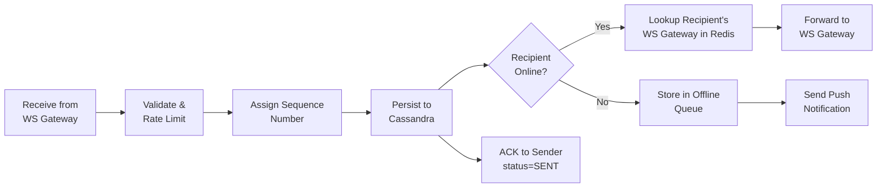

### 2.3 Presence Service

Tracks user online/offline/typing status.

**Responsibilities:**

- Maintain online status via heartbeats from the WebSocket Gateway.
- Expose `last_seen` timestamps.
- Handle ephemeral "typing" indicators.
- Publish presence changes to interested subscribers (contacts who have the chat open).

**Implementation with Redis TTL:**

```
Key:    presence:{user_id}
Value:  {"status": "online", "server": "ws-gateway-042"}
TTL:    90 seconds (refreshed on every heartbeat)

When TTL expires → user is offline.
When heartbeat arrives → SETEX refreshes the TTL.
```

**Typing Indicators:**

```
Key:    typing:{chat_id}:{user_id}
Value:  1
TTL:    5 seconds (auto-expires if user stops typing)
```

Typing indicators are **not persisted**. They are broadcast over WebSocket to the other
participant(s) in the chat. If the typing user goes offline, the TTL expires and the
indicator disappears.

### 2.4 User Service

Handles user registration, authentication, profile management.

- Phone number verification via SMS (Twilio/internal).
- JWT token generation and refresh.
- Profile CRUD (display name, avatar, about).
- Contact list synchronization (hash phone numbers, find registered users).
- Stores public keys for E2EE key exchange.

### 2.5 Group Service

Manages group lifecycle and membership.

- Create/delete groups.
- Add/remove members (admin-only operations).
- Store group metadata (name, icon, description).
- Provide member list to Chat Service for fan-out.
- Cache member lists aggressively (groups change infrequently).

### 2.6 Key Service (E2EE)

Stores and distributes public key bundles for the Signal Protocol.

- Stores each user's **identity key**, **signed pre-key**, and **one-time pre-keys**.
- When User A wants to message User B for the first time, User A fetches User B's key bundle.
- One-time pre-keys are consumed on use (deleted after fetch).
- The Key Service never sees private keys or message content.

---

## 3. Message Flow -- 1:1 Chat

This is the core flow. User A sends a message to User B.

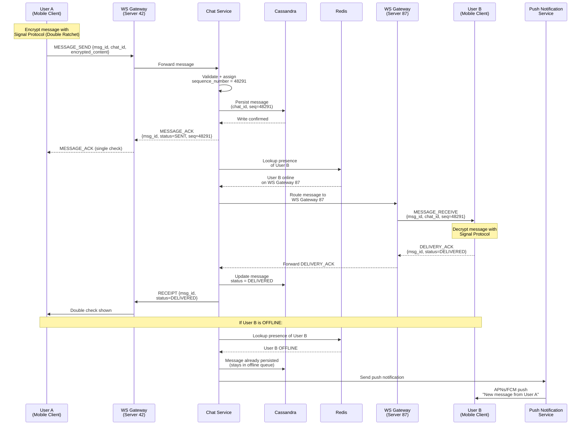

### Critical Path Analysis

The **critical path** for the sender is:

```
Client A → WS Gateway → Chat Service → Cassandra Write → ACK back to Client A
```

Target: **< 100ms** for the sender to see the single check.

The **delivery path** to the recipient is:

```
Chat Service → Redis lookup → Route to WS Gateway → Client B
```

Target: **< 200ms** total (sender-to-recipient).

---

## 4. Message Flow -- Group Chat

### Fan-Out Strategy Decision

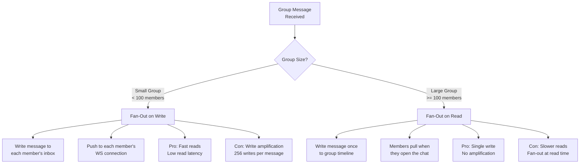

**WhatsApp's approach:** Since groups are capped at 256 members, **fan-out on write** is
used for all groups. The write amplification (max 256x) is acceptable given the group
size limit.

### Group Message Sequence

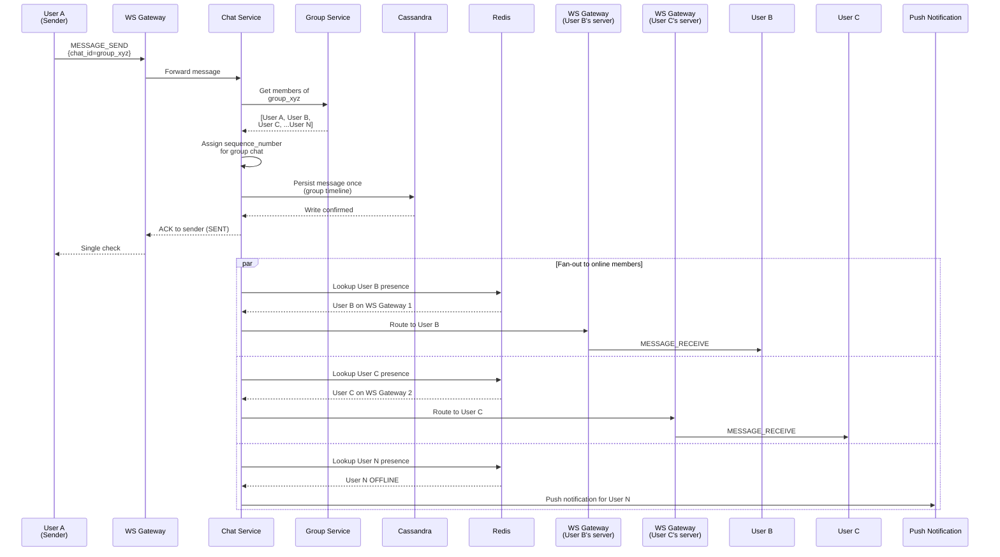

### Group Fan-Out Optimization

For a group with 256 members:
- **Best case:** All members online on different WS servers → 256 route lookups + 256 pushes.
- **Batching:** Group members on the same WS server are batched into a single delivery.
- **Async fan-out:** The sender gets ACK immediately after persistence. Fan-out happens
  asynchronously via a message queue (Kafka) to avoid blocking.

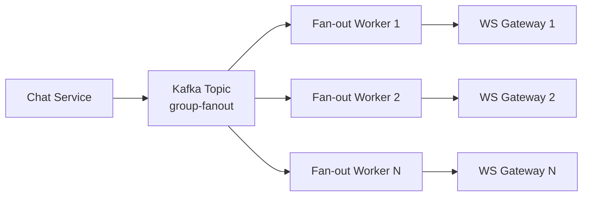

---

## 5. Media Service

Media sharing is handled separately from text messages to keep the message path fast.

### Media Upload and Delivery Flow

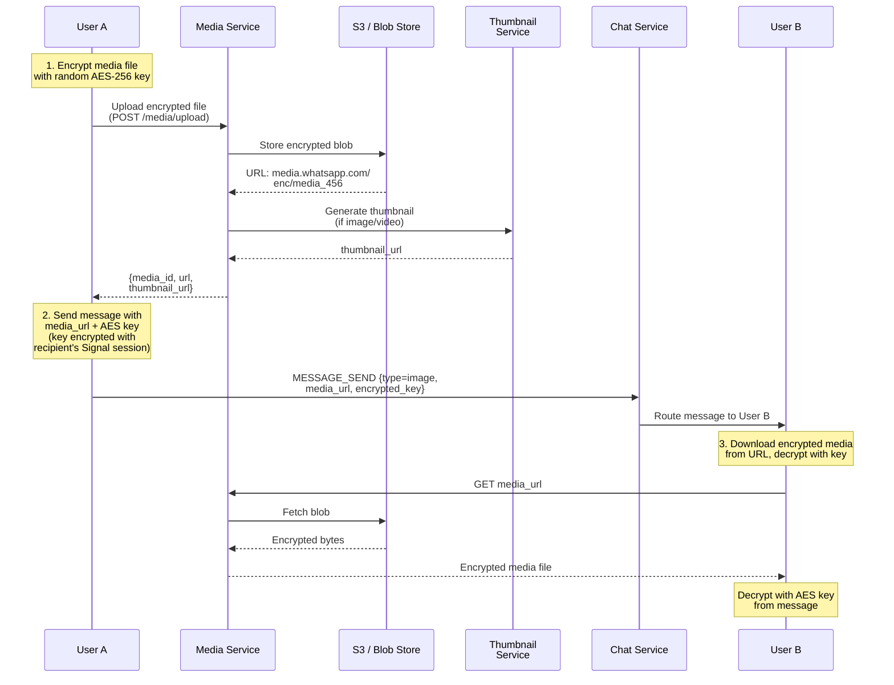

### Media Service Design Details

**Upload Path:**

1. Client encrypts the media file locally with a random AES-256-GCM key.
2. Client uploads the encrypted file to the Media Service via HTTPS.
3. Media Service stores it in S3 (or a distributed blob store).
4. For images/videos, a Thumbnail Service generates encrypted thumbnails.
5. Media Service returns the URL and thumbnail URL.
6. Client sends a chat message containing the URL and the AES key (encrypted with the
   recipient's Signal session key).

**Why encrypt before upload?**

- The server (and S3) only ever stores ciphertext.
- Even if the server is compromised, media files are unreadable.
- The AES key travels in the E2E-encrypted message, which only the recipient can decrypt.

**Storage and Cleanup:**

- Media is stored for **30 days** or until all recipients have downloaded it.
- A background job scans for expired media and deletes from S3.
- Estimated active media storage: ~150 PB (30-day rolling window).

**CDN Integration:**

- Media URLs are served through a CDN (CloudFront / Akamai) for low-latency download.
- Since files are encrypted, CDN caching is safe -- cached ciphertext is useless without the key.

---

## 6. Presence Service

### Heartbeat-Based Presence with Redis TTL

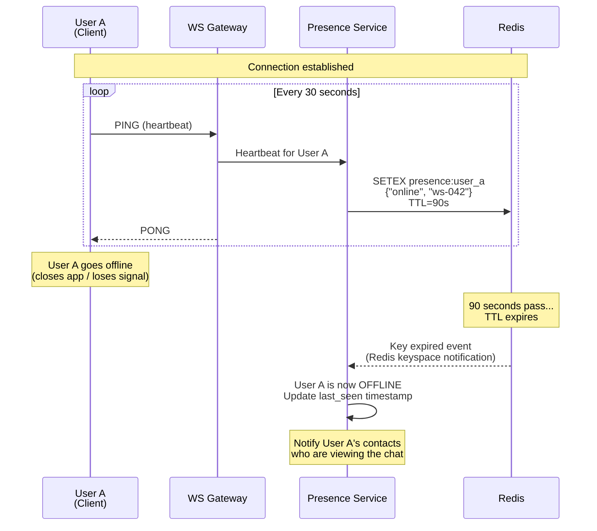

### Presence Subscription Model

Not all users need presence updates for all contacts. Presence is **lazily subscribed**:

1. When User B opens a chat with User A, User B subscribes to User A's presence.
2. The Presence Service pushes updates only to active subscribers.
3. When User B leaves the chat screen, the subscription is dropped.

This avoids the "thundering herd" problem where a popular user going online triggers
millions of notifications.

```
Active presence subscriptions:
  - User opens chat → subscribe to other participant's presence
  - User closes chat → unsubscribe
  - Subscription stored in Redis SET: subscribers:{user_id}
```

---

## 7. Push Notification Service

When a user is offline (no active WebSocket connection), the Push Notification Service
delivers a lightweight notification via platform-native channels.

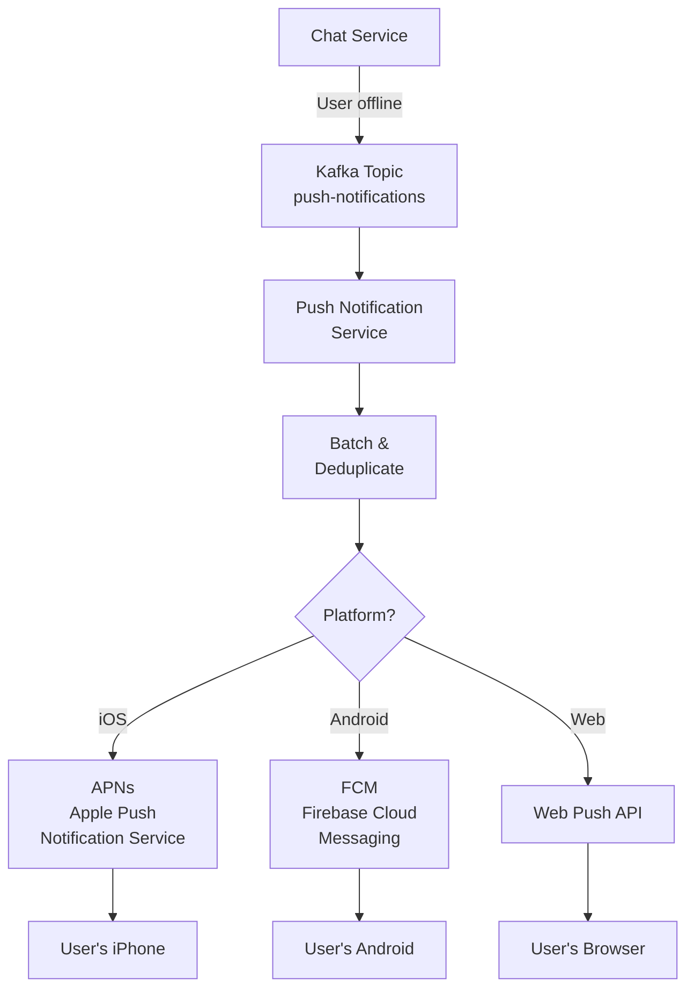

**Push Notification Content (privacy-preserving):**

Because of E2EE, the push notification **cannot contain the message content**. Instead:

```json
{
  "title": "New message",
  "body": "You have a new message from a contact",
  "data": {
    "chat_id": "chat_abc123",
    "badge_count": 3
  }
}
```

WhatsApp uses a **background data push** that wakes the app, which then establishes a
brief connection to download and decrypt the actual message. This is why WhatsApp
notifications can show message previews -- the app decrypts locally.

**Batching and Deduplication:**

- If a user receives 10 messages while offline, they do not get 10 push notifications.
- Messages are batched with a short delay (2-5 seconds).
- Only one notification is sent per chat, with the count of unread messages.

---

## 8. Message Storage

### Why Cassandra?

| Requirement | Why Cassandra Fits |
|---|---|
| Write-heavy workload | 50K+ writes/sec → Cassandra excels at writes |
| Time-series data | Messages are naturally time-ordered |
| Horizontal scaling | Add nodes to scale linearly |
| Tunable consistency | Per-chat consistency with quorum reads |
| No complex joins | Messages queried by chat_id + time range |

### Cassandra Schema

```sql
-- Messages table: partition by chat_id, cluster by sequence
CREATE TABLE messages (
    chat_id       TEXT,
    sequence_num  BIGINT,
    message_id    TEXT,
    sender_id     TEXT,
    type          TEXT,          -- text, image, video, doc, audio
    content       BLOB,          -- encrypted ciphertext
    media_url     TEXT,
    media_thumb   TEXT,
    status        TEXT,          -- sent, delivered, read
    created_at    TIMESTAMP,
    PRIMARY KEY (chat_id, sequence_num)
) WITH CLUSTERING ORDER BY (sequence_num DESC);

-- Efficient query: "Get latest 50 messages for chat_abc123"
-- SELECT * FROM messages WHERE chat_id = 'chat_abc123'
--   ORDER BY sequence_num DESC LIMIT 50;

-- Efficient query: "Get messages after sequence 48200"
-- SELECT * FROM messages WHERE chat_id = 'chat_abc123'
--   AND sequence_num > 48200 ORDER BY sequence_num ASC;
```

```sql
-- User inbox: for offline message delivery
-- Partition by recipient, cluster by timestamp
CREATE TABLE user_inbox (
    user_id       TEXT,
    created_at    TIMESTAMP,
    chat_id       TEXT,
    message_id    TEXT,
    sequence_num  BIGINT,
    sender_id     TEXT,
    content       BLOB,
    PRIMARY KEY (user_id, created_at)
) WITH CLUSTERING ORDER BY (created_at ASC)
  AND default_time_to_live = 2592000; -- 30 days TTL
```

### Partition Key Design

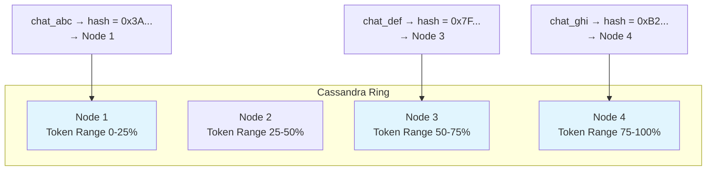

**Why partition by `chat_id`?**

- All messages for a single conversation are co-located on the same partition.
- Reading a conversation's history is a single-partition query (fast).
- Hot chats (very active groups) may create hot partitions → mitigated by the 256-member
  group cap and message rate limits.

**Replication:**

- Replication factor = 3 (across different racks/AZs).
- Write consistency = QUORUM (2 of 3 replicas must acknowledge).
- Read consistency = QUORUM for message sync, ONE for presence.

---

## 9. Delivery Semantics

### At-Least-Once Delivery with Client-Side Deduplication

WhatsApp guarantees **at-least-once delivery** at the system level and achieves
**effectively exactly-once** through client-side deduplication.

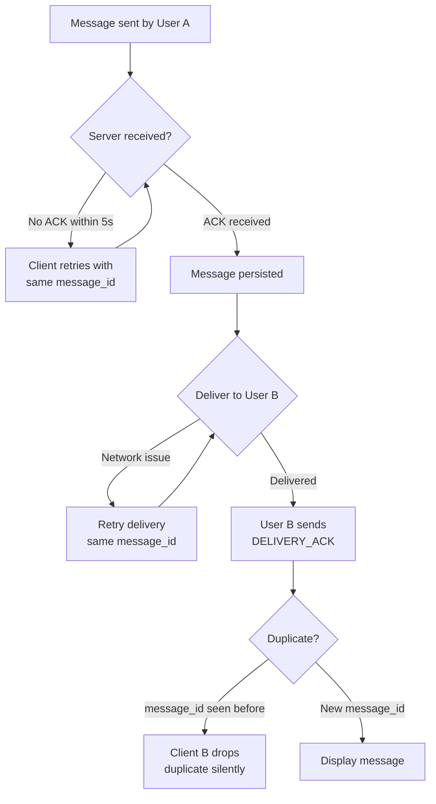

**How it works:**

1. **Client-generated `message_id`:** Each message gets a UUID on the client before sending.
2. **Server-side idempotency:** If the server receives the same `message_id` twice (client
   retry), it returns ACK without double-persisting.
3. **Client-side dedup:** The recipient client maintains a set of recently seen `message_id`
   values. If a message arrives with a known ID, it is silently dropped.
4. **Sequence numbers:** Even if dedup fails, the per-chat `sequence_number` ensures correct
   ordering and the UI can reconcile.

### Offline Message Delivery

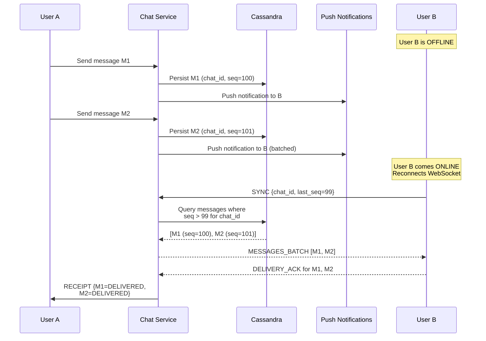

---

## 10. End-to-End Encryption

WhatsApp uses the **Signal Protocol**, which combines:

1. **X3DH (Extended Triple Diffie-Hellman):** Initial key agreement between two users.
2. **Double Ratchet Algorithm:** Ongoing key evolution for forward secrecy.

### Signal Protocol Key Types

| Key | Purpose | Lifetime |
|---|---|---|
| Identity Key (IK) | Long-term identity | Permanent |
| Signed Pre-Key (SPK) | Medium-term key, signed by IK | Rotated weekly |
| One-Time Pre-Key (OPK) | Single-use, consumed on first message | One-time |
| Root Key (RK) | Derived during X3DH, seeds the ratchet | Per session |
| Chain Key (CK) | Derived from ratchet step, generates message keys | Evolves per message |
| Message Key (MK) | Encrypts a single message | Single use |

### X3DH Key Exchange Flow

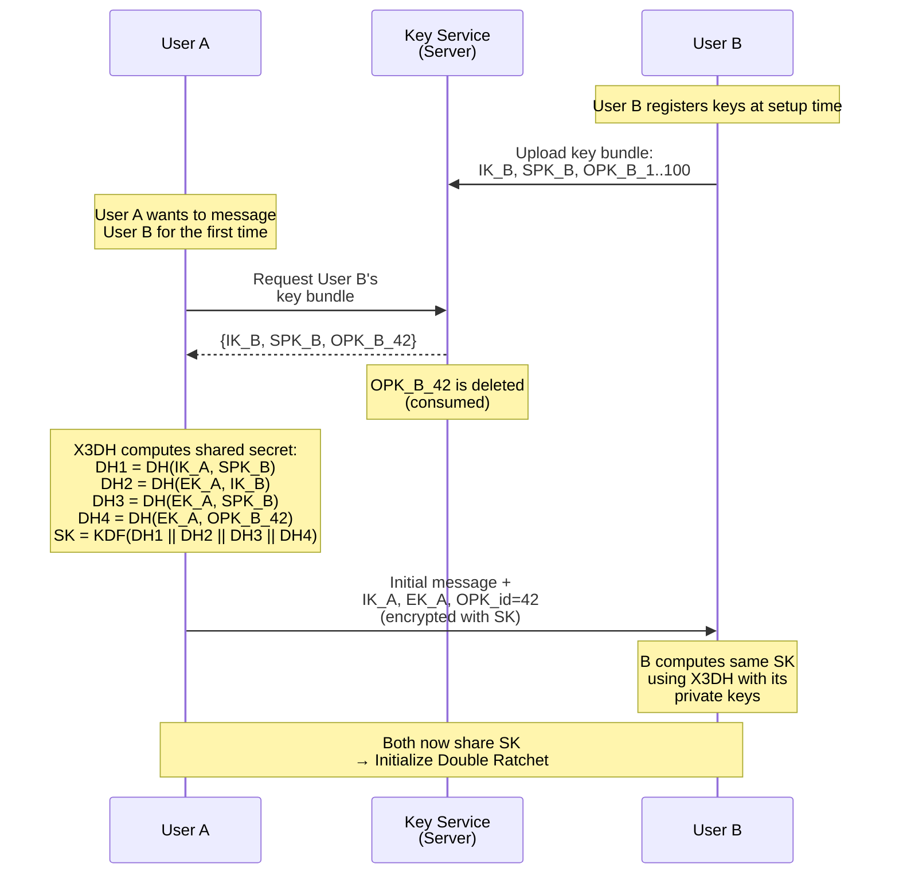

### Double Ratchet Overview

After the initial X3DH, every message uses the **Double Ratchet** to derive fresh keys:

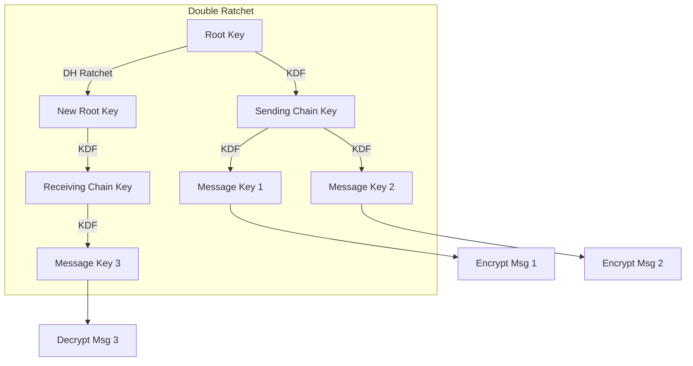

**Forward Secrecy:** Each message uses a unique key derived from the ratchet. Compromising
one message key does not reveal past or future messages.

**Post-Compromise Security:** The DH ratchet step (using new ephemeral keys) ensures that
even if session state is compromised, future messages become secure again after a round-trip.

### Group E2EE

For group chats, WhatsApp uses the **Sender Keys** protocol:

1. Each member generates a "Sender Key" and distributes it to all other members.
2. When sending a message, the sender encrypts once with their Sender Key.
3. All recipients can decrypt with the sender's Sender Key they received earlier.
4. This avoids encrypting the message N times (once per recipient).

```
Without Sender Keys: N encryptions per message (one per recipient)
With Sender Keys:    1 encryption per message + N key distributions (once)
```

---

## 11. Delivered and Read Receipts

Receipts are lightweight status messages that flow back from the recipient to the sender.

### Receipt State Machine

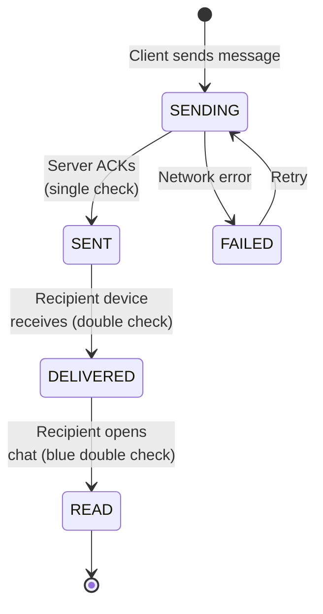

### Full Receipt Flow

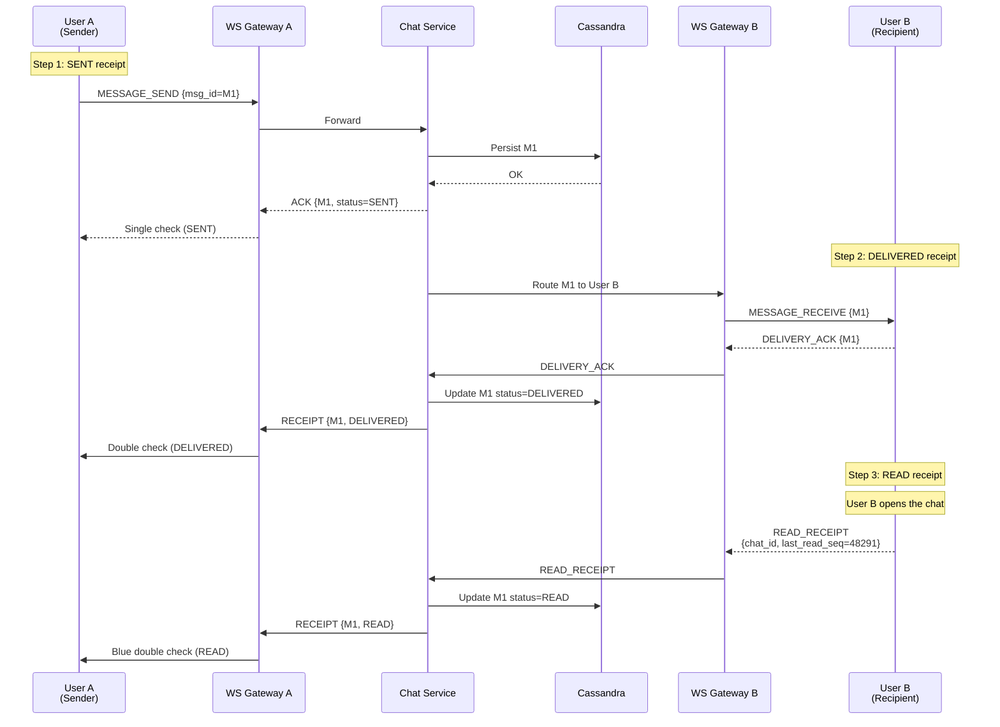

### Group Read Receipts

For groups, receipts work per-member:

- **Delivered:** When any member's device receives the message.
- **Read:** When any member opens the group chat.
- The sender can see detailed per-member receipt status (tap on message → info).
- Receipts are **not** sent for each individual member to avoid O(N^2) messages.
  Instead, they are batched and queried on demand.

---

## 12. System Diagram Summary

### Full Request Flow Summary

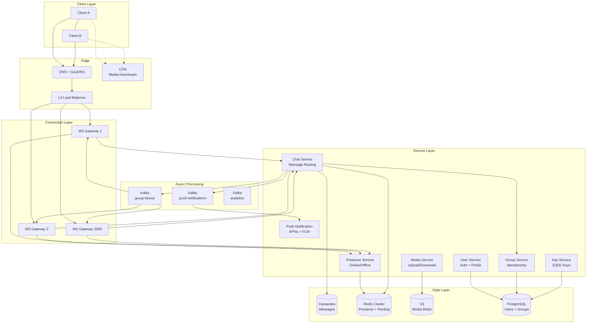

### Latency Budget Breakdown

```
Total target: < 200ms sender-to-recipient

Sender → WS Gateway:             ~20ms (TCP + TLS)
WS Gateway → Chat Service:       ~5ms  (internal RPC)
Chat Service → Cassandra Write:   ~10ms (quorum write)
Chat Service → ACK to Sender:     ~5ms  (return path)
─── Sender sees SENT check: ~40ms ───

Chat Service → Redis Lookup:      ~2ms  (recipient server)
Chat Service → WS Gateway B:      ~5ms  (internal route)
WS Gateway B → Recipient:         ~20ms (TCP push)
─── Recipient receives: ~67ms ───

Total: ~107ms (well within 200ms budget)
Cross-region adds ~50-100ms for inter-DC routing.
```

---

*Next: [Deep Dive and Scaling](./deep-dive-and-scaling.md) covers WebSocket management
at scale, message ordering guarantees, and group messaging deep dives.*
