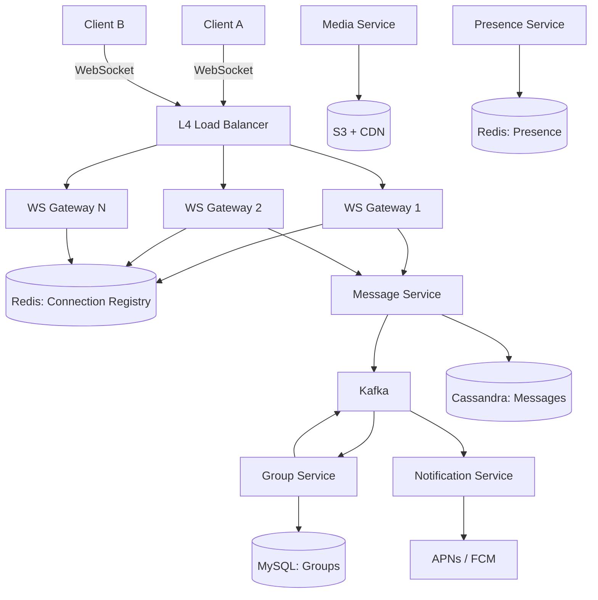

# Design WhatsApp -- Interview Script (45 min)

## Opening (0:00 - 0:30)

> "Thanks for the problem! Designing a messaging system like WhatsApp is a classic real-time systems challenge. It involves persistent connections at massive scale, message ordering guarantees, delivery semantics, and end-to-end encryption. Let me start with some clarifying questions."

---

## Clarifying Questions (0:30 - 3:00)

> **Q1:** "What's the expected scale -- daily active users and messages per day?"
>
> **Expected answer:** ~2B users, ~500M DAU, ~100B messages/day.

> **Q2:** "Are we designing 1:1 messaging, group messaging, or both?"
>
> **Expected answer:** Both. Groups can have up to 1024 members.

> **Q3:** "Do we need to support media messages -- images, videos, voice notes -- or just text?"
>
> **Expected answer:** Support media. Treat media storage as a separate concern from message delivery.

> **Q4:** "What are the delivery guarantees? Do we need read receipts, delivery confirmations?"
>
> **Expected answer:** Yes -- sent, delivered, read status. Messages must be delivered at least once, ideally exactly once.

> **Q5:** "Do we need end-to-end encryption, or is server-side encryption sufficient?"
>
> **Expected answer:** E2E encryption is expected. Server should never see plaintext.

> **Q6:** "How many concurrent connections should we plan for at peak?"
>
> **Expected answer:** ~100M concurrent WebSocket connections.

> **Q7:** "Is message history stored forever, or is there a retention window?"
>
> **Expected answer:** Messages are stored on the server until delivered. After delivery, they live on the client device. Server can expire after 30 days.

---

## Requirements Summary (3:00 - 5:00)

> "Let me summarize what we're building."

> **"Functional Requirements:"**
> 1. "1:1 messaging -- send text messages between two users."
> 2. "Group messaging -- up to 1024 members per group."
> 3. "Media sharing -- images, video, voice notes, documents."
> 4. "Message status -- sent, delivered, read receipts."
> 5. "Online/offline presence and last-seen indicators."
> 6. "End-to-end encryption -- the server never sees message content."
> 7. "Offline message delivery -- messages queue when recipient is offline."

> **"Non-Functional Requirements:"**
> 1. "Ultra-low latency -- messages delivered in under 200ms when both users are online."
> 2. "100M concurrent WebSocket connections."
> 3. "Message ordering -- messages within a conversation appear in the order they were sent."
> 4. "Exactly-once delivery semantics at the application level."
> 5. "99.99% availability."
> 6. "E2E encryption with no server-side plaintext access."

> "I'll focus my design on the messaging pipeline, WebSocket infrastructure, group messaging fan-out, and E2E encryption. Media upload I'll cover at a high level."

---

## Back-of-Envelope Estimation (5:00 - 8:00)

> "Let me do some quick math."

> **Messages:**
> "100B messages/day. Over 86,400 seconds = ~1.15M messages/sec average. At peak (2-3x), that's ~3M messages/sec."

> **Connections:**
> "100M concurrent WebSocket connections. Each connection uses ~10-20KB of memory for buffers and state. So 100M * 15KB = ~1.5TB of memory just for connections. If each server handles 50K-100K connections, we need 1,000-2,000 WebSocket servers."

> **Storage:**
> "Average message size: 100 bytes for text. 100B messages * 100 bytes = 10TB/day for text alone. Media is much larger -- assume 10% of messages have media averaging 200KB = 10B * 200KB = 2PB/day for media. Media goes to object storage (S3), only metadata goes to the message store."

> **Bandwidth:**
> "For text: 10TB/day = ~115MB/sec outbound. For media: much more, but served from CDN. The real bottleneck is the number of concurrent connections, not raw bandwidth."

> "So the key challenges are: (1) managing 100M concurrent WebSocket connections, (2) processing 3M messages/sec at peak, and (3) maintaining message ordering."

---

## High-Level Design (8:00 - 20:00)

> "Let me start with the high-level architecture."

### Step 1: Clients

> "We have mobile clients -- iOS, Android, and a web client. All establish a persistent WebSocket connection to the server for real-time messaging."

### Step 2: Connection Layer

> "The first thing the client hits is a WebSocket Gateway layer. This is a fleet of stateful servers that maintain the persistent connections. Each server holds 50K-100K connections in memory."

> "In front of the WebSocket servers, I'd put a Layer 4 load balancer -- not Layer 7, because we need the TCP connection to persist to a specific server."

### Step 3: Connection Registry

> "We need a Connection Registry -- a distributed lookup table that maps user_id to which WebSocket server they're connected to. This is a key-value store in Redis. When a user connects, their server registers them; when they disconnect, the entry is removed."

### Step 4: Core Services

> "Behind the gateway:"
> 1. **Message Service** -- "Handles sending, storing, and routing messages."
> 2. **Group Service** -- "Manages group membership and fan-out."
> 3. **Presence Service** -- "Tracks online/offline status and last-seen."
> 4. **Media Service** -- "Handles upload, storage, and download of media files."
> 5. **Notification Service** -- "Sends push notifications when user is offline."

### Step 5: Data Stores

> "For data stores:"
> - **"Cassandra / HBase"** -- "For the message store. Write-heavy, append-only, excellent for time-series data partitioned by conversation_id."
> - **"Redis"** -- "For the connection registry and presence cache."
> - **"S3 + CDN"** -- "For media files."
> - **"Kafka"** -- "As the message bus between services."
> - **"MySQL/PostgreSQL"** -- "For user profiles and group metadata."

### Step 6: Whiteboard Diagram

> "Here's what the whiteboard should look like:"



### Step 7: Walk through the 1:1 message flow

> "Let me trace a message from User A to User B:"
>
> 1. "User A's client encrypts the message with User B's public key (E2E encryption)."
> 2. "The encrypted message is sent over User A's WebSocket connection to WS Gateway 1."
> 3. "WS Gateway 1 forwards it to the Message Service."
> 4. "Message Service assigns a server-side message_id (monotonically increasing per conversation) and persists to Cassandra."
> 5. "Message Service sends a 'sent' acknowledgment back to User A via the WebSocket."
> 6. "Message Service looks up User B in the Connection Registry."
> 7. **If User B is online:** "The registry returns WS Gateway 3. Message Service sends the message to WS Gateway 3, which pushes it to User B."
> 8. **If User B is offline:** "Message is already persisted. A push notification is sent via APNs/FCM."
> 9. "When User B receives the message, their client sends a 'delivered' ack back through the pipeline."
> 10. "When User B opens the conversation, a 'read' receipt is sent."

---

## API Design (within high-level)

> "Let me define the key APIs. These are WebSocket message types, not REST endpoints, since everything goes over the persistent connection."

```
-- Send message (client -> server)
{
  "type": "send_message",
  "conversation_id": "conv_abc",
  "recipient_id": "user_B",
  "client_message_id": "uuid-123",   // client-generated, for dedup
  "encrypted_content": "base64...",
  "content_type": "text",
  "timestamp": 1680000000
}

-- Message acknowledgment (server -> sender)
{
  "type": "message_ack",
  "client_message_id": "uuid-123",
  "server_message_id": "msg_456",
  "status": "sent"
}

-- Receive message (server -> recipient)
{
  "type": "new_message",
  "conversation_id": "conv_abc",
  "server_message_id": "msg_456",
  "sender_id": "user_A",
  "encrypted_content": "base64...",
  "content_type": "text",
  "timestamp": 1680000000
}

-- Delivery receipt (client -> server)
{
  "type": "delivery_ack",
  "server_message_id": "msg_456"
}
```

> "Note the client_message_id -- the client generates this. If the client retries a send (network hiccup), the server uses this to deduplicate. The server_message_id is assigned by the server and used for ordering."

---

## Data Model (within high-level)

> "For the data model:"

```sql
-- Messages table (Cassandra) -- partitioned by conversation_id
messages (
    conversation_id   TEXT,
    server_message_id BIGINT,      -- monotonic per conversation
    sender_id         TEXT,
    encrypted_content BLOB,
    content_type      TEXT,         -- text, image, video, audio
    media_url         TEXT,         -- null for text messages
    status            TEXT,         -- sent, delivered, read
    created_at        TIMESTAMP,
    PRIMARY KEY (conversation_id, server_message_id)
) WITH CLUSTERING ORDER BY (server_message_id DESC);

-- User conversations (Cassandra) -- inbox
user_conversations (
    user_id           TEXT,
    conversation_id   TEXT,
    last_message_id   BIGINT,
    last_message_preview TEXT,     -- encrypted on client, blank on server
    unread_count      INT,
    updated_at        TIMESTAMP,
    PRIMARY KEY (user_id, updated_at)
) WITH CLUSTERING ORDER BY (updated_at DESC);

-- Groups (MySQL)
groups (
    group_id          VARCHAR(36) PRIMARY KEY,
    name              VARCHAR(255),
    created_by        VARCHAR(36),
    created_at        TIMESTAMP,
    max_members       INT DEFAULT 1024
);

group_members (
    group_id          VARCHAR(36),
    user_id           VARCHAR(36),
    role              ENUM('admin','member'),
    joined_at         TIMESTAMP,
    PRIMARY KEY (group_id, user_id)
);
```

---

## Deep Dive 1: WebSocket Infrastructure at Scale (20:00 - 30:00)

> "The hardest engineering challenge here is managing 100 million concurrent WebSocket connections. Let me break this down."

### Connection Management

> "Each WebSocket server maintains ~65K-100K connections. That means we need ~1,000-1,500 servers just for the connection tier."

> "Key design decisions:"
> 1. "**Epoll-based event loop** -- each server uses a non-blocking I/O model (like Go's goroutines or Java's Netty) to handle tens of thousands of connections with minimal threads."
> 2. "**Connection stickiness** -- once a client connects to a server, all their traffic goes to that server. The L4 load balancer uses consistent hashing on the client IP or a connection ID."
> 3. "**Heartbeats** -- clients send a ping every 30 seconds. If a server doesn't receive a heartbeat for 90 seconds, it closes the connection and removes the user from the registry."

### Connection Registry Design

> "The Connection Registry is critical -- it's queried on every single message send."
>
> "I'd use Redis Cluster for this. The key is user_id, the value is {ws_server_id, connection_id, connected_at}."
>
> "At 500M total users, only 100M are connected at any time. 100M keys * ~100 bytes per entry = ~10GB. Fits easily in a Redis cluster."
>
> "Read throughput: 3M messages/sec means ~3M registry lookups/sec. A Redis cluster with 10 shards handles ~1M ops/sec per shard = 10M total. Plenty of headroom."

### Graceful Failover

> "When a WebSocket server crashes or is being deployed:"
> 1. "The health checker detects the failure within 5-10 seconds."
> 2. "All connections on that server are marked as disconnected in the registry."
> 3. "Clients detect the dropped connection and reconnect to a new server (via the load balancer)."
> 4. "On reconnection, the client fetches any messages it missed since its last received message_id."

### :microphone: Interviewer might ask:

> **"How do you handle 100M concurrent connections?"**
> **My answer:** "I horizontally scale the WebSocket gateway tier. Each server handles 65-100K connections using an epoll-based event loop -- technologies like Go, Netty, or Erlang are great for this. With 1,000-1,500 servers, we cover 100M connections. The Connection Registry in Redis maps each user to their server. An L4 load balancer distributes new connections, and consistent hashing ensures reconnections hit different servers to spread load."

> **"What if the Connection Registry (Redis) goes down?"**
> **My answer:** "Redis Cluster provides replication -- each master has 1-2 replicas. If a master fails, a replica is promoted automatically. During the failover window (a few seconds), messages to users on that shard are queued in Kafka and retried. The users are still connected to their WebSocket servers -- we just temporarily can't route messages to them. Once Redis recovers, the backlog drains."

> **"How do you handle message ordering?"**
> **My answer:** "Each conversation has a monotonically increasing sequence number (server_message_id). The Message Service assigns this using an atomic counter per conversation -- in Cassandra, I use a lightweight transaction, or I could use a separate sequence generator in Redis (INCR). On the client side, messages are displayed sorted by this server-assigned sequence number, not by client timestamp. This handles clock skew between devices."

---

## Deep Dive 2: Group Messaging and E2E Encryption (30:00 - 38:00)

> "Let me dive into group messaging and end-to-end encryption -- these are the two features that add the most complexity."

### Group Messaging Fan-out

> "When User A sends a message to a group of 500 members, we need to deliver it to 499 other users. There are two approaches:"

> **Write-time fan-out (push model):**
> "When the message arrives, immediately create 499 individual delivery tasks. Each one is routed to the recipient's WebSocket server."
>
> "Pros: read path is simple -- each user just reads their own inbox."
> "Cons: a single message in a 500-person group creates 499 writes. Expensive."

> **Read-time fan-out (pull model):**
> "Store the message once, tagged with the group_id. When a user opens the group, they query by group_id."
>
> "Pros: one write per message. Efficient."
> "Cons: read path is complex. Every time a user opens a group, they query the message store."

> "I'd use a **hybrid approach**: write-time fan-out for small groups (under 50 members) and read-time fan-out for large groups (50+). Small groups are the vast majority and benefit from instant delivery. Large groups are rare and can tolerate the pull model."

> "For the fan-out, I'd use Kafka. The Message Service publishes a 'group_message' event. A Group Fan-out Consumer reads it, fetches the member list, and for each member, publishes an individual delivery event. These are consumed by the routing layer that pushes to WebSocket servers."

### End-to-End Encryption

> "For E2E encryption, I'd use the Signal Protocol, which is what WhatsApp actually uses."

> "Here's how it works at a high level:"
> 1. "Each user generates a key pair on their device -- a long-term identity key and ephemeral pre-keys."
> 2. "The public keys are uploaded to a Key Server managed by us."
> 3. "When User A wants to message User B for the first time, A fetches B's public pre-key from the Key Server."
> 4. "A performs a Diffie-Hellman key exchange to derive a shared secret. This happens entirely on the client."
> 5. "All messages are encrypted with the shared secret before leaving the device. The server only sees ciphertext."
> 6. "The key ratchets forward after each message (Double Ratchet Algorithm), providing forward secrecy."

> "For group messaging, each member has a pairwise encryption key with every other member. When sending a group message, the sender encrypts it once with a shared group key, which is itself distributed by encrypting it N times (once per member, with their individual key)."

> "The server's role is limited to: storing encrypted blobs, delivering them to the right recipient, and hosting the public key directory. It never has access to plaintext."

### :microphone: Interviewer might ask:

> **"What about group messaging at scale -- a group with 1024 members?"**
> **My answer:** "For large groups, I use read-time fan-out to avoid the write amplification of 1024x per message. The message is stored once, and each member pulls from the group's message stream. For delivery notifications, I batch them -- instead of pushing each message individually, I push a 'you have N new messages in group X' notification. When the user opens the group, they sync incrementally from their last-read message_id. For E2E encryption in large groups, the sender-key protocol is more efficient: the sender creates one encrypted payload using a sender key, and each member has the key to decrypt it. This avoids N separate encryptions."

> **"How do you handle a user with multiple devices?"**
> **My answer:** "Each device is treated as a separate endpoint. When User A has a phone and a laptop, both have WebSocket connections registered in the Connection Registry under the same user_id but different device_ids. When a message arrives for User A, it's delivered to all connected devices. Each device has its own encryption key pair, so the sender actually encrypts the message multiple times -- once per device. This is the standard Signal Protocol multi-device approach."

> **"What if a user never comes online to receive their messages?"**
> **My answer:** "Messages are persisted in Cassandra. They sit there until the user comes online and syncs. We set a TTL of 30 days -- if the user doesn't come online within 30 days, the message expires. For push notifications, we'd send periodic reminders like 'You have X unread messages.' When the user finally reconnects, the client sends its last-received message_id, and the server sends all messages after that ID."

---

## Trade-offs and Wrap-up (38:00 - 43:00)

> "Let me discuss the key trade-offs I made."

> **Trade-off 1: WebSocket vs. Long Polling vs. Server-Sent Events**
> "I chose WebSocket because messaging requires full-duplex communication -- both the client and server need to push data at any time. Long polling adds latency and wastes connections. SSE is server-to-client only, so the client would still need a separate channel for sending. WebSocket is the right tool for real-time bidirectional messaging. The trade-off is operational complexity -- maintaining millions of persistent connections requires careful server management and graceful failover."

> **Trade-off 2: Cassandra vs. traditional RDBMS for message storage**
> "I chose Cassandra because messaging is write-heavy (100B messages/day) and the access pattern is well-suited -- partition by conversation_id, query in reverse chronological order. An RDBMS would struggle with this write volume and would require complex sharding. The trade-off is that Cassandra's consistency model is eventual by default -- but for messages partitioned by conversation, single-partition queries are strongly consistent, which is what we need."

> **Trade-off 3: Hybrid fan-out for groups (write-time for small, read-time for large)**
> "Pure write-time fan-out is simple but doesn't scale for large groups -- a message to a 1000-person group becomes 1000 writes. Pure read-time fan-out means slower delivery for all groups. The hybrid approach optimizes for the common case (small groups) while handling the edge case (large groups) gracefully."

> **Trade-off 4: E2E encryption vs. server-side features**
> "E2E encryption means the server can't do spam filtering, content moderation, or server-side search on message content. These are real product trade-offs. WhatsApp handles this by doing abuse detection on metadata (frequency, contacts, group behavior) rather than content. Search is purely client-side."

---

## Future Improvements (43:00 - 45:00)

> "If I had more time, I'd also consider:"

> 1. **"Message reactions and replies"** -- "These are lightweight additions to the message model but need careful UI synchronization across group members."

> 2. **"Stories / Status feature"** -- "Ephemeral content with a 24-hour TTL, delivered to all contacts. This is a fan-out-on-read problem similar to a social media feed."

> 3. **"Voice and video calling"** -- "This requires a completely different infrastructure -- WebRTC for peer-to-peer media, TURN/STUN servers for NAT traversal, and an SFU (Selective Forwarding Unit) for group calls. It's a separate system design problem."

---

## Red Flags to Avoid

- **Don't say:** "We'll use HTTP polling for real-time messaging." WebSocket is essential for a messaging app.
- **Don't forget:** The Connection Registry. Without it, you have no way to route a message to the correct WebSocket server.
- **Don't ignore:** Message ordering. "Just use timestamps" fails because of clock skew. You need a server-assigned sequence number.
- **Don't skip:** E2E encryption. If the interviewer asks for it, you need to explain the Signal Protocol at least at a high level.
- **Don't assume:** That all messages fit in memory. 100B messages/day requires a durable, disk-backed store like Cassandra.

---

## Power Phrases That Impress

- "The key insight here is that a messaging system is fundamentally a routing problem -- every message needs to find its way to the right server holding the recipient's connection."
- "The trade-off between write-time and read-time fan-out is the central design decision for group messaging. It depends on the group size distribution."
- "E2E encryption is not just a feature -- it's an architectural constraint. Once you commit to it, the server becomes a dumb pipe, and many server-side features become impossible."
- "For message ordering, I'm relying on a per-conversation monotonic counter, not wall-clock timestamps. Distributed clocks lie; sequence numbers don't."
- "At 100M concurrent connections, the WebSocket tier is essentially a distributed router. The Connection Registry is its routing table."
