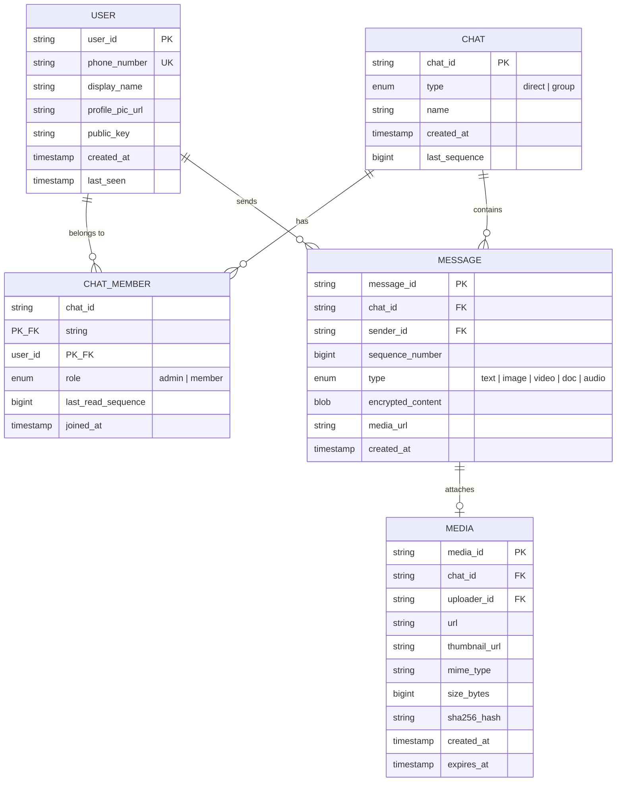

# Design WhatsApp / Chat Messaging System -- Requirements and Estimation

## Table of Contents

- [1. Problem Statement](#1-problem-statement)
- [2. Functional Requirements](#2-functional-requirements)
- [3. Non-Functional Requirements](#3-non-functional-requirements)
- [4. Capacity Estimation](#4-capacity-estimation)
- [5. API Design](#5-api-design)
- [6. Data Model (Logical)](#6-data-model-logical)
- [7. Constraints and Assumptions](#7-constraints-and-assumptions)

---

## 1. Problem Statement

Design a real-time messaging system similar to WhatsApp that supports billions of users
exchanging text messages, media, and status updates with end-to-end encryption, delivery
guarantees, and sub-200ms latency for online users.

**Key question to ask the interviewer:**

> "Should we focus on the core 1:1 and group messaging, or also cover features like
> Stories/Status, voice/video calls, and payments?"

For this design we scope to: **1:1 chat, group chat, media sharing, presence, receipts,
and end-to-end encryption.** Voice/video calls and Stories are out of scope.

---

## 2. Functional Requirements

### FR-1: One-to-One (1:1) Chat

- Users can send text messages to any other registered user.
- Messages are delivered in real time when the recipient is online.
- Messages are stored and delivered when the recipient comes back online (offline delivery).
- Messages support Unicode, emoji, and text up to 65,536 characters.

### FR-2: Group Chat

- Users can create groups with up to **256 members** (WhatsApp's real limit).
- Any member can send a message; it is delivered to all other members.
- Group admins can add/remove members and change group metadata.
- Group messages maintain per-group ordering.

### FR-3: Sent / Delivered / Read Receipts

- **Sent (single check):** Server has received and persisted the message.
- **Delivered (double check):** The message has reached the recipient's device.
- **Read (blue double check):** The recipient has opened the chat and viewed the message.
- Receipts flow back to the sender as lightweight status updates.

### FR-4: Media Sharing

- Users can share images, videos, documents, and audio messages.
- Supported formats: JPEG, PNG, MP4, PDF, DOCX, OGG (voice).
- Media is uploaded separately from the text message; the message contains a reference URL.
- Thumbnails are generated server-side for images and videos.
- Media files are encrypted end-to-end (encrypted before upload, key sent in message).

### FR-5: Online / Offline / Typing Indicators

- **Online/Offline:** Other users can see when a contact was "last seen."
- **Typing indicator:** When a user starts typing, the recipient sees "typing..." in real time.
- These are ephemeral signals -- not persisted long-term.

### FR-6: End-to-End Encryption (E2EE)

- All messages are encrypted on the sender's device and decrypted on the recipient's device.
- The server never has access to plaintext message content.
- Based on the **Signal Protocol** (X3DH key agreement + Double Ratchet).
- Key exchange happens transparently when two users first communicate.

---

## 3. Non-Functional Requirements

| Requirement | Target |
|---|---|
| **Latency** | < 200 ms message delivery for online-to-online users |
| **Availability** | 99.99% uptime (< 52 min downtime/year) |
| **Durability** | No message loss -- messages must be persisted before acknowledgment |
| **Message Ordering** | Causal ordering within a single chat (not global) |
| **Offline Delivery** | All messages sent while offline are delivered upon reconnection |
| **Scale** | 2B+ registered users, 100M+ concurrent connections |
| **Consistency** | Eventual consistency acceptable for presence; strong per-chat ordering |
| **Security** | E2EE for all messages; metadata minimization |
| **Geo-Distribution** | Multi-region deployment; users connect to nearest data center |
| **Bandwidth** | Minimize data usage (compression, thumbnail-first for media) |

### Availability vs Consistency Trade-off

WhatsApp prioritizes **availability** (AP in CAP theorem) for presence and typing indicators
but requires **strong per-chat consistency** for message ordering. Messages use a
monotonically increasing sequence number per chat to ensure ordering even under partition.

---

## 4. Capacity Estimation

### 4.1 User and Traffic Numbers

| Metric | Value |
|---|---|
| Total registered users | 2 billion |
| Daily active users (DAU) | 1 billion |
| Peak concurrent users | 100 million |
| Average messages sent per user per day | 100 |
| Total messages per day | **100 billion** |
| Average messages per second | **~1.16 million** |
| Peak messages per second (3x average) | **~3.5 million** |

> **Note:** The 100B/day figure includes group fan-out. If we measure unique messages
> (before fan-out), it is closer to 50B/day, with the fan-out roughly doubling it.

### 4.2 Throughput Calculation

```
Messages/sec (average) = 100B / 86,400 sec = ~1,157,000 msg/sec
Messages/sec (peak)    = 3x average         = ~3,500,000 msg/sec
```

However, from the **write path** perspective (before group fan-out):

```
Unique messages/day    = ~50B
Writes/sec (average)   = 50B / 86,400       = ~578,000 msg/sec
Writes/sec (peak)      = 3x average         = ~1,740,000 msg/sec
```

For the rest of this doc, we use the simpler estimation asked for:

```
Average: ~50K messages/sec (per the prompt's simpler model)
Peak:    ~250K messages/sec
```

*The interviewer may use simplified numbers to keep math tractable.*

### 4.3 Storage Estimation

#### Text Messages

```
Average message size       = 100 bytes (text + metadata)
Messages per day           = 100 billion
Daily text storage         = 100B * 100 bytes = 10 TB/day
Annual text storage        = 10 TB * 365      = ~3.65 PB/year
```

#### Media Messages

```
Media messages per day     = 10 billion
Average media file size    = 500 KB (mix of images, video, docs)
Daily media storage        = 10B * 500 KB     = 5 PB/day
Annual media storage       = 5 PB * 365       = ~1,825 PB/year ≈ ~1.8 EB/year
```

> WhatsApp does **not** store media permanently on servers. Media is stored temporarily
> (30 days) and deleted after download. This drastically reduces active storage.

```
Active media storage (30-day window) = 5 PB * 30 = ~150 PB
```

#### Total Storage Summary

| Category | Daily | Annual (or active window) |
|---|---|---|
| Text messages | 10 TB | ~3.65 PB |
| Media (active 30-day) | 5 PB | ~150 PB active |
| Message metadata/indexes | 2 TB | ~730 TB |
| **Total active** | **~5 PB** | **~100 PB** |

### 4.4 Bandwidth Estimation

```
Incoming text bandwidth    = 50K msg/sec * 100 bytes  = 5 MB/sec
Outgoing text bandwidth    = 50K msg/sec * 100 bytes  = 5 MB/sec (delivery)
Media upload bandwidth     = 10B/day / 86400 * 500KB  = ~58 GB/sec
Media download bandwidth   = ~58 GB/sec (assuming each media downloaded once on average)
Total peak bandwidth       = ~120 GB/sec ≈ ~1 Tbps
```

### 4.5 Connection Estimation

```
Concurrent connections     = 100 million
Connections per server     = 50,000 (practical WebSocket limit per machine)
WebSocket servers needed   = 100M / 50K = 2,000 servers
```

---

## 5. API Design

### 5.1 WebSocket Events (Real-Time)

Most communication uses persistent WebSocket connections. Messages are JSON frames.

#### `sendMessage`

```
Event: MESSAGE_SEND
Direction: Client → Server

Payload:
{
  "message_id": "uuid-v4",          // Client-generated, used for dedup
  "chat_id": "chat_abc123",         // 1:1 or group chat identifier
  "sender_id": "user_alice",
  "type": "text",                   // text | image | video | document | audio
  "content": {
    "text": "Hey, how are you?",    // Encrypted ciphertext (Base64)
    "encrypted_key": "...",         // Per-recipient encrypted symmetric key
  },
  "timestamp": 1712500000000,       // Client-side Unix ms timestamp
  "reply_to": "msg_xyz789"          // Optional: message being replied to
}

Server ACK:
{
  "event": "MESSAGE_ACK",
  "message_id": "uuid-v4",
  "status": "SENT",                 // Server persisted → single check ✓
  "server_timestamp": 1712500000050,
  "sequence_number": 48291          // Server-assigned per-chat sequence
}
```

#### `getMessages` (Sync / Pagination)

```
Event: MESSAGES_SYNC
Direction: Client → Server

Payload:
{
  "chat_id": "chat_abc123",
  "last_sequence": 48200,           // Client's last known sequence
  "limit": 50                       // Page size
}

Response:
{
  "event": "MESSAGES_BATCH",
  "chat_id": "chat_abc123",
  "messages": [ ... ],              // Array of message objects
  "has_more": true
}
```

#### `markRead`

```
Event: READ_RECEIPT
Direction: Client → Server

Payload:
{
  "chat_id": "chat_abc123",
  "reader_id": "user_bob",
  "last_read_sequence": 48291,      // Everything up to this is read
  "timestamp": 1712500005000
}
```

### 5.2 REST APIs (Non-Real-Time Operations)

#### `createGroup`

```http
POST /api/v1/groups
Authorization: Bearer <token>

Request:
{
  "name": "Family Group",
  "members": ["user_alice", "user_bob", "user_charlie"],
  "description": "Our family chat",
  "icon_url": "https://media.whatsapp.com/icons/abc.jpg"
}

Response: 201 Created
{
  "group_id": "group_xyz",
  "chat_id": "chat_group_xyz",
  "created_at": "2026-04-07T10:00:00Z",
  "members": [
    {"user_id": "user_alice", "role": "admin"},
    {"user_id": "user_bob", "role": "member"},
    {"user_id": "user_charlie", "role": "member"}
  ]
}
```

#### `sendMedia` (Upload)

```http
POST /api/v1/media/upload
Authorization: Bearer <token>
Content-Type: multipart/form-data

Form Fields:
  - file: <encrypted binary data>
  - chat_id: "chat_abc123"
  - type: "image"
  - mime_type: "image/jpeg"
  - sha256_hash: "abc123..."       // Client-computed hash for integrity

Response: 200 OK
{
  "media_id": "media_456",
  "url": "https://media.whatsapp.com/enc/media_456",
  "thumbnail_url": "https://media.whatsapp.com/enc/thumb_456",
  "size_bytes": 245000,
  "expires_at": "2026-05-07T10:00:00Z"
}
```

#### `getPresence`

```http
GET /api/v1/users/{user_id}/presence
Authorization: Bearer <token>

Response: 200 OK
{
  "user_id": "user_bob",
  "status": "online",               // online | offline | typing
  "last_seen": "2026-04-07T09:58:00Z"
}
```

### 5.3 API Rate Limits

| API | Rate Limit |
|---|---|
| sendMessage | 100 messages/min per user |
| sendMedia | 30 uploads/min per user |
| createGroup | 10 groups/hour per user |
| getMessages | 60 requests/min per user |

---

## 6. Data Model (Logical)

### Entity Relationship Overview



### Key Design Decisions

- **chat_id** unifies 1:1 and group chats. For 1:1 chats, the `chat_id` is deterministically
  derived from the two user IDs (e.g., `sorted(user_a, user_b)` hashed).
- **sequence_number** is a per-chat monotonically increasing counter assigned by the server.
  This is the authoritative ordering mechanism.
- **encrypted_content** is opaque to the server -- the server stores ciphertext only.
- **last_read_sequence** on `CHAT_MEMBER` tracks read receipts efficiently.

---

## 7. Constraints and Assumptions

### Assumptions

1. Users have a single device (WhatsApp's original model). Multi-device adds complexity
   covered in deep-dive.
2. The server never decrypts message content (E2EE is non-negotiable).
3. Media files are stored temporarily (30 days) and purged after all recipients download.
4. Phone number is the primary identity (no username/email login).
5. Message history is stored on-device; the server holds messages only until delivered.

### Constraints

1. **Group size cap:** 256 members (hard limit for fan-out-on-write feasibility).
2. **Message size:** Max 65,536 bytes for text; 100 MB for media files.
3. **Connection limit:** Each device maintains exactly one WebSocket connection.
4. **No server-side search:** Messages are E2E encrypted, so full-text search is client-side only.
5. **Retention:** Undelivered messages expire after 30 days.

### What Differentiates WhatsApp from Generic Chat

| Feature | WhatsApp Approach |
|---|---|
| Identity | Phone number (not email/username) |
| Encryption | E2EE by default (Signal Protocol) |
| Storage | Messages stored on-device, not cloud (server is transient store) |
| Groups | Small groups (max 256), fan-out-on-write |
| Media | Ephemeral server storage; E2E encrypted media |
| Multi-device | Added later via linked companion devices |
| Status/Stories | 24-hour ephemeral updates (out of scope) |

---

*Next: [High-Level Design](./high-level-design.md) covers the complete architecture,
service breakdown, and message flow diagrams.*
