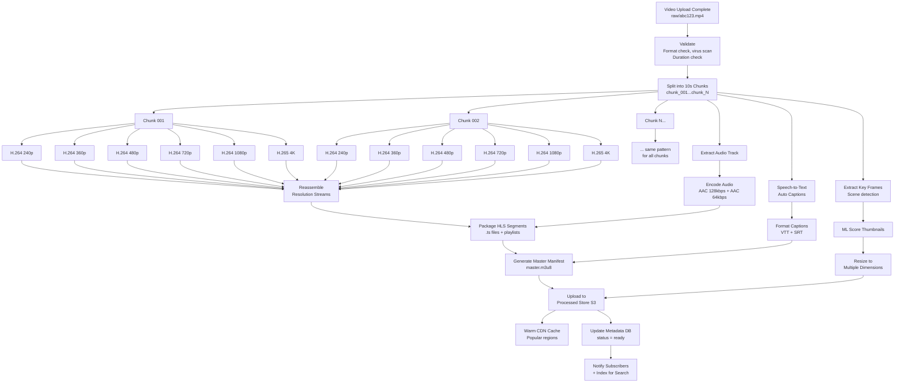
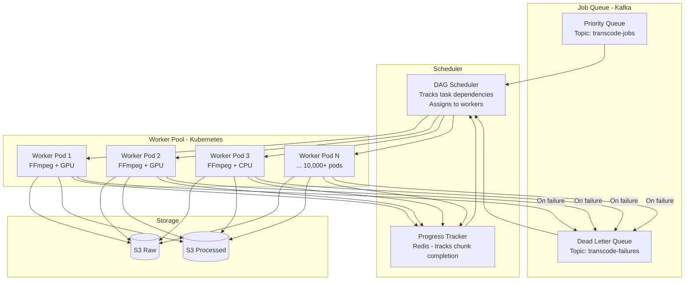
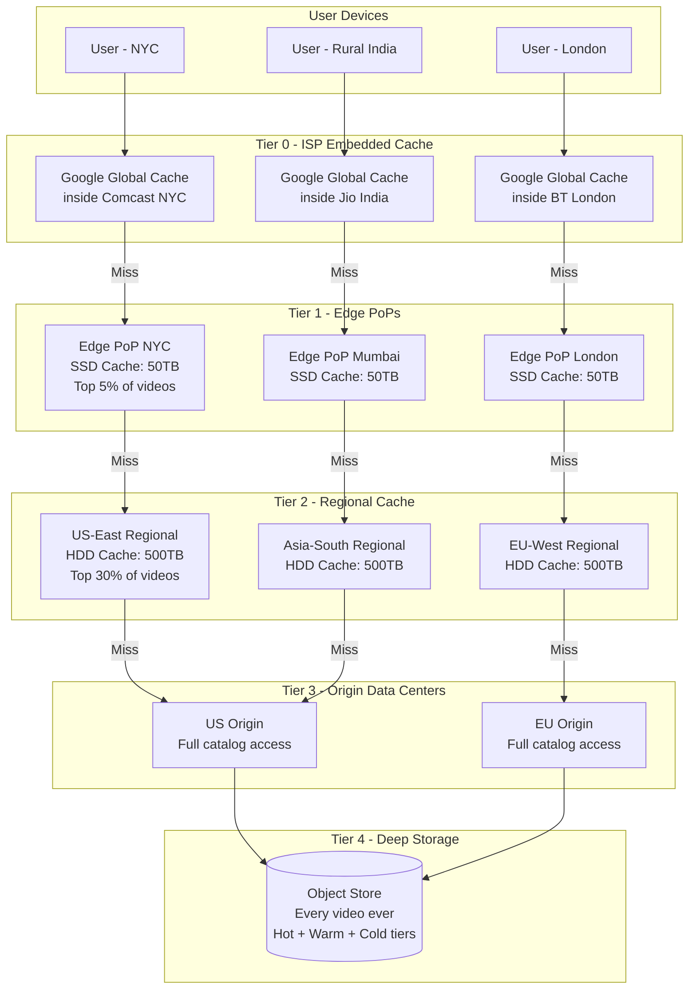
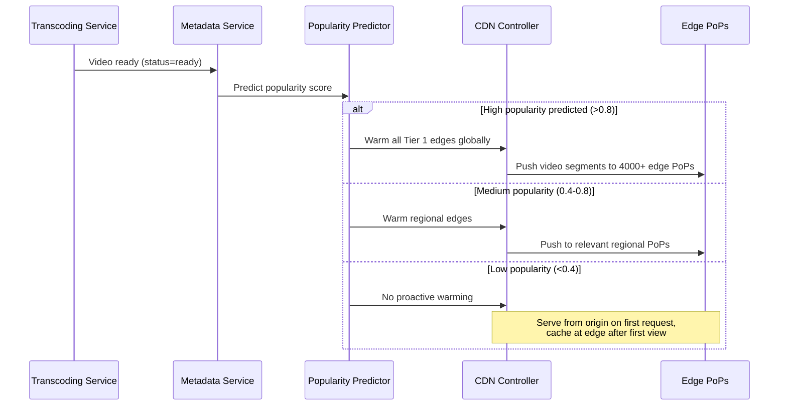
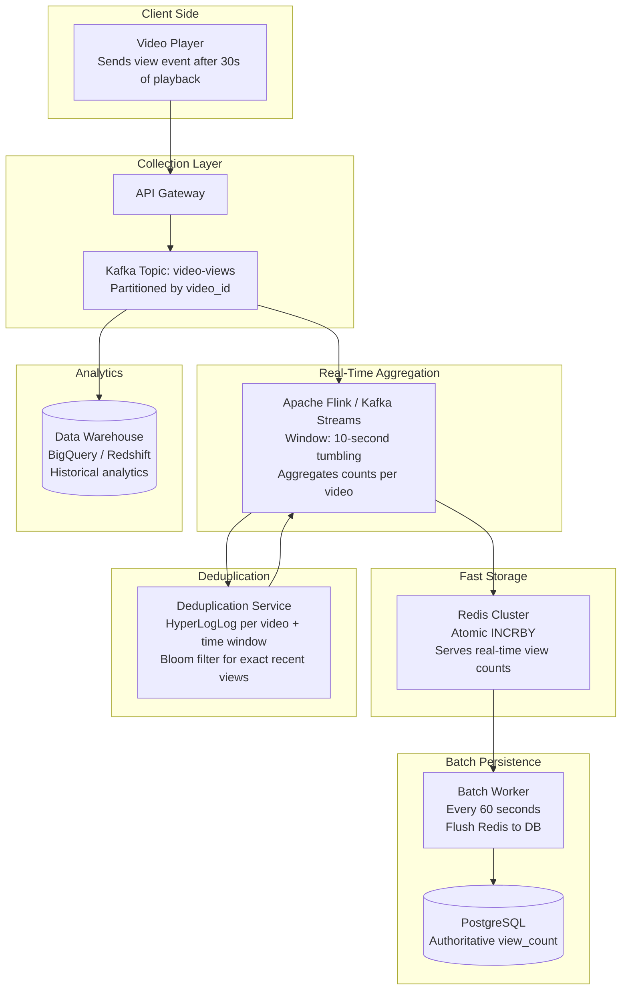
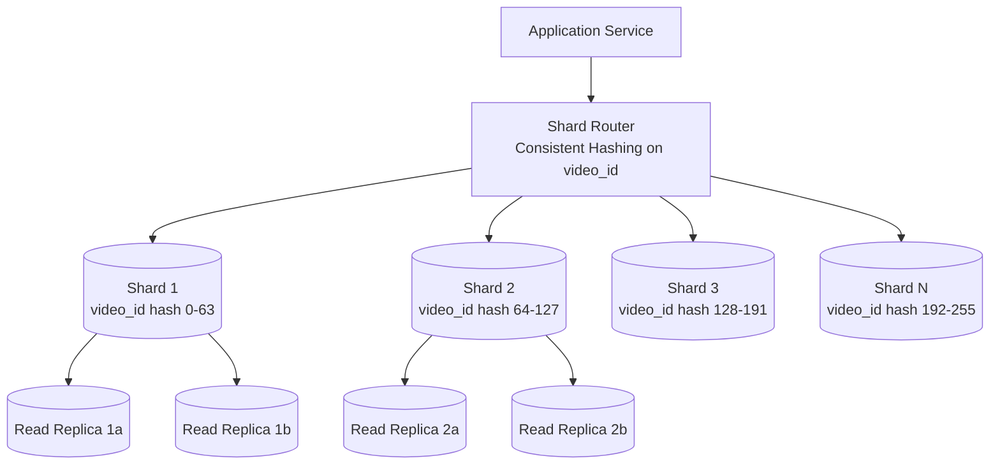
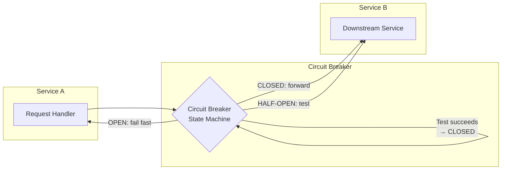
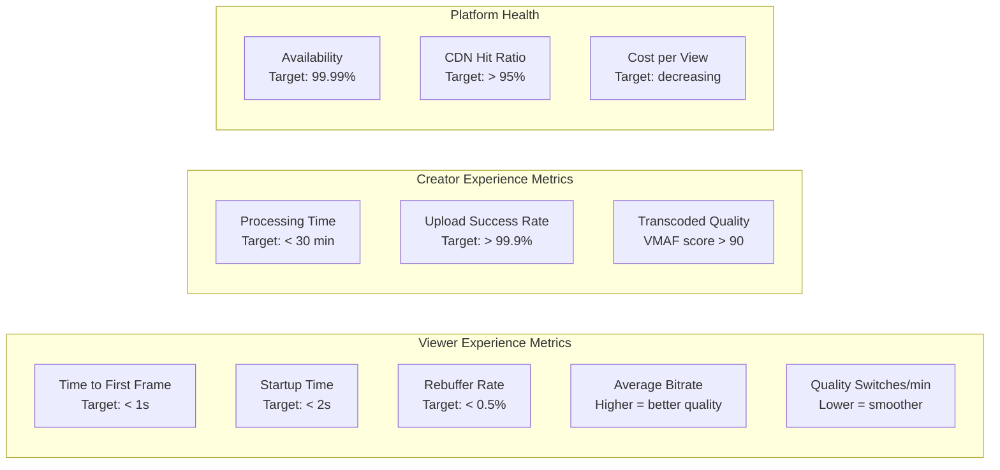

# Design YouTube / Video Streaming Platform -- Deep Dive and Scaling

## Table of Contents

1. [Deep Dive 1: Video Transcoding Pipeline at Scale](#deep-dive-1-video-transcoding-pipeline-at-scale)
2. [Deep Dive 2: CDN and Global Video Delivery](#deep-dive-2-cdn-and-global-video-delivery)
3. [Deep Dive 3: View Count at Scale](#deep-dive-3-view-count-at-scale)
4. [Database Scaling Strategies](#database-scaling-strategies)
5. [Failure Modes and Resilience](#failure-modes-and-resilience)
6. [Cost Optimization](#cost-optimization)
7. [Monitoring and Observability](#monitoring-and-observability)
8. [Trade-offs and Decisions](#trade-offs-and-decisions)
9. [Interview Tips](#interview-tips)

---

## Deep Dive 1: Video Transcoding Pipeline at Scale

Transcoding is the most compute-intensive operation in the entire system. YouTube processes 500 hours of new video every minute, and each hour needs to be transcoded into 6+ resolutions across 2+ codecs. This section covers how to build a transcoding pipeline that handles this volume reliably and cost-effectively.

### The Transcoding DAG in Detail

A single video upload triggers a complex Directed Acyclic Graph of tasks. Each node in the DAG is an independent unit of work that can be scheduled on any worker.



### Scale Math for Transcoding

```
Upload rate:           500 hours/min = 30,000 hours/day
Average video length:  7 minutes
Videos per day:        ~6.2 million

Per video:
  - 6 resolutions (240p, 360p, 480p, 720p, 1080p, 4K)
  - Average 42 chunks per video (7 min / 10s)
  - 42 chunks * 6 resolutions = 252 encode tasks per video

Total encode tasks per day:  6.2M * 252 = ~1.56 billion tasks/day
Tasks per second:            ~18,000 encode tasks/sec

Average encode time per chunk:  ~3 seconds (240p) to ~30 seconds (4K)
Weighted average:               ~10 seconds per task

Required concurrent workers:    18,000 * 10 = 180,000 concurrent encode tasks
With overhead (scheduling, I/O): ~250,000 worker slots needed
```

### Transcoding Worker Architecture



### Error Handling in Transcoding

Transcoding at this scale means failures are not exceptional -- they are constant. A robust error handling strategy is essential.

**Types of Failures:**

| Failure Type | Frequency | Handling Strategy |
|-------------|-----------|-------------------|
| Worker crash (OOM, hardware) | Common | Retry the chunk on a different worker (max 3 retries) |
| Corrupt input segment | Occasional | Skip segment, fill with black frame, flag for review |
| Unsupported codec in source | Rare | Fall back to software decode, slower but handles anything |
| Stuck job (no progress for 5 min) | Occasional | Kill + reassign to different worker |
| Poison pill (causes repeated crashes) | Rare | After 3 retries, move to DLQ, alert on-call, mark video as failed |

**Idempotency**: Every transcode task must be idempotent. If a chunk is encoded twice, the output is identical. The upload to S3 uses the same key, so duplicate processing just overwrites with the same content.

**Chunk-level retry**: If chunk 37 of 42 fails, we only re-encode chunk 37, not the entire video. This is the key advantage of the chunk-based DAG approach over monolithic transcoding.

```python
# Pseudocode for chunk-level retry with backoff
async def process_chunk(job):
    for attempt in range(MAX_RETRIES):
        try:
            raw = await download_chunk(job.raw_url, job.chunk_index)
            encoded = await encode(raw, job.resolution, job.codec)
            await upload_chunk(encoded, job.output_path)
            await mark_complete(job.video_id, job.chunk_index, job.resolution)
            return SUCCESS
        except TransientError as e:
            wait = BACKOFF_BASE * (2 ** attempt) + random_jitter()
            await sleep(wait)
        except PermanentError as e:
            await send_to_dlq(job, error=e)
            return PERMANENT_FAILURE
    await send_to_dlq(job, error="max retries exceeded")
    return RETRY_EXHAUSTED
```

### Priority Queuing

Not all videos are equal. A video from a channel with 50 million subscribers should be transcoded before a video from a brand-new creator with 0 subscribers.

**Priority levels:**

| Priority | Criteria | Target Processing Time |
|----------|----------|----------------------|
| P0 - Critical | Live-to-VOD recordings, platform content | < 5 minutes |
| P1 - High | Channels with 1M+ subscribers | < 15 minutes |
| P2 - Normal | Regular uploads | < 60 minutes |
| P3 - Low | Re-encoding jobs, quality upgrades | Best effort |

### Cost Optimization with Spot Instances

Transcoding is the single largest compute cost. Two strategies dramatically reduce it:

**1. Spot/Preemptible Instances** (60-80% cheaper than on-demand)
- Transcoding is perfectly suited for spot: stateless, retry-safe, non-urgent
- If a spot instance is reclaimed, the in-progress chunk is simply retried elsewhere
- YouTube reportedly processes most transcoding on preemptible VMs

**2. Hardware Acceleration**
- GPU encoding (NVIDIA NVENC): 10-20x faster than CPU for H.264/H.265
- Custom ASICs: Google uses custom video encoding chips called Argos VCU (Video Coding Unit)
- Trade-off: GPU produces slightly larger files than CPU at same quality, but the speed gain justifies it

```
Cost comparison for processing 500 hours/min:
  On-demand CPU:    ~$5M/month
  Spot CPU:         ~$1.5M/month  (70% savings)
  Spot GPU:         ~$800K/month  (84% savings, faster)
  Custom ASIC:      ~$300K/month  (amortized, Google's approach)
```

---

## Deep Dive 2: CDN and Global Video Delivery

The CDN layer is where the money is made or lost. A 1% improvement in cache hit ratio translates to terabits per second of origin traffic saved.

### Multi-Tier CDN Deep Architecture



### Cache Hit Ratio by Tier

| Tier | Cache Hit Ratio | Latency | Capacity per Node |
|------|----------------|---------|------------------|
| ISP-embedded (GGC) | 60-70% of all traffic | < 2ms | 100 TB HDD |
| Edge PoP | 20-25% (cumulative ~90%) | 5-20ms | 50 TB SSD |
| Regional | 5-8% (cumulative ~95%) | 20-50ms | 500 TB HDD |
| Origin | 5% (all cache misses) | 50-200ms | Full catalog |

### The Power-Law Distribution of Video Popularity

Video popularity follows a Zipf distribution (power law), which is the fundamental reason CDN caching works:

```
Top 0.1% of videos:   ~20% of all views   (viral hits)
Top 1% of videos:     ~50% of all views   (popular content)
Top 10% of videos:    ~80% of all views   (Pareto principle)
Top 20% of videos:    ~90% of all views
Bottom 80% of videos: ~10% of all views   (long-tail)
```

This means a relatively small cache can serve the vast majority of traffic.

### Cache Warming Strategy

For popular content, waiting for a cache miss is too slow. We proactively push content to edges.



**Popularity prediction** considers:
- Channel subscriber count
- Channel's average video performance
- Upload time (prime time vs. off-hours)
- Title/thumbnail appeal score (ML)
- Whether it matches trending topics

### ISP-Embedded Caching (Google Global Cache)

This is YouTube's secret weapon for performance. Google places dedicated cache servers inside ISP data centers:

**How it works:**
1. Google provides hardware (servers with large HDD/SSD arrays) to ISPs at no cost
2. The ISP places these servers in their network
3. When a user on that ISP requests a YouTube video, the traffic is routed to the local GGC node first
4. If the video is cached locally, it never leaves the ISP network
5. If not cached, GGC fetches from the next tier and caches for subsequent requests

**Benefits for ISPs:**
- Reduces expensive transit/peering bandwidth (video is 50%+ of internet traffic)
- Better user experience for their customers
- No cost for the hardware

**Benefits for Google:**
- Dramatically lower CDN cost
- Single-digit millisecond latency for most video requests
- Deep penetration into global networks (deployed in 1000+ ISP networks)

> **Real-world reference**: Netflix's equivalent is called Open Connect. Netflix reports that 95%+ of their traffic is served from Open Connect appliances embedded in ISP networks. A single Netflix OCA (Open Connect Appliance) can serve 100+ Gbps.

### Handling Geographic Spikes

When a video goes viral in a specific region (e.g., a local news event), the CDN must handle sudden demand spikes:

```
Normal state:  Video cached at 3 edges near the event
Viral spike:   Demand increases 1000x in 10 minutes

Response strategy:
1. [0-30s]   Existing cache handles initial surge
2. [30s-2m]  CDN controller detects spike pattern
3. [2m-5m]   Proactively push to all nearby edges
4. [5m+]     Anycast routing spreads load across multiple PoPs
```

---

## Deep Dive 3: View Count at Scale

"Just increment a counter" is the most dangerous oversimplification in system design. At YouTube's scale, view counting is a distributed systems problem with real-world consequences (ad revenue depends on accurate counts).

### Why This is Hard

```
Views per second (average):      46,000
Views per second (peak):         200,000
Views on a single viral video:   Could be 10,000+/sec on ONE video

If we do: UPDATE videos SET view_count = view_count + 1 WHERE video_id = 'xyz'
  - 10,000 writes/sec to a SINGLE ROW
  - Row-level lock contention
  - PostgreSQL falls over
  - MySQL falls over
  - Even Cassandra struggles with single-partition hotspots at this rate
```

### Multi-Layer View Counting Architecture



### The View Counting Pipeline

**Step 1: Client-side gating**
- A "view" is only counted after 30 seconds of playback (prevents accidental/bot views)
- The player sends a single `view` event, not continuous signals
- Client includes: video_id, user_id (if logged in), session_id, timestamp, device_type

**Step 2: Collection into Kafka**
- The API gateway writes view events to a Kafka topic partitioned by video_id
- This ensures all views for the same video go to the same partition (ordered processing)
- Kafka handles the 200K events/sec at peak easily across a modest cluster

**Step 3: Stream processing (Flink)**
- Flink consumes from Kafka with 10-second tumbling windows
- Aggregates: "video XYZ had 847 views in this 10-second window"
- Deduplication: checks HyperLogLog to filter repeated views from same user

**Step 4: Redis for real-time counts**
- Flink writes aggregated counts to Redis: `INCRBY views:video_xyz 847`
- Redis serves read queries: "How many views does this video have?" (fast, near real-time)

**Step 5: Batch persistence**
- A background worker reads from Redis every 60 seconds
- Batch-updates PostgreSQL: `UPDATE videos SET view_count = view_count + <delta>`
- One UPDATE per video per minute instead of 10,000 per second

### Deduplication with HyperLogLog

YouTube cares about **unique** view counts (the same user refreshing shouldn't count 100 times). Exact deduplication for 2B users across 800M videos is impossible to store. HyperLogLog provides approximate unique counts with ~0.8% error using only 12 KB of memory per counter.

```python
# Pseudocode for HLL-based deduplication
class ViewDeduplicator:
    def __init__(self):
        # One HLL per video per hour (rotated hourly)
        self.hlls = {}  # video_id -> HyperLogLog

    def should_count_view(self, video_id, user_id):
        if video_id not in self.hlls:
            self.hlls[video_id] = HyperLogLog(precision=14)  # ~12KB

        hll = self.hlls[video_id]
        count_before = hll.count()
        hll.add(user_id)
        count_after = hll.count()

        # If count increased, this is a new unique viewer
        return count_after > count_before
```

### Exact vs. Approximate Counting Trade-offs

| Approach | Memory per Video | Accuracy | Speed | Use Case |
|----------|-----------------|----------|-------|----------|
| Exact (Set of user IDs) | Unbounded (GBs for popular videos) | 100% | Slow | Not feasible at scale |
| Bloom filter (recent window) | ~1 MB for 1M users | ~99% (false positives) | Fast | Short-term dedup (1 hour) |
| HyperLogLog | 12 KB | ~99.2% | Very fast | Unique viewer count |
| Probabilistic counting | 1 KB | ~95% | Fastest | Real-time display only |

YouTube uses a combination: Bloom filters for short-term exact deduplication and HyperLogLog for long-term unique viewer estimates.

### View Count Consistency Model

```
Event happens:     User watches video at T=0
Kafka receives:    T + 100ms
Flink aggregates:  T + 10 seconds
Redis updated:     T + 11 seconds
Display to users:  T + 11 seconds  (reading from Redis)
PostgreSQL:        T + 60 seconds  (batch flush)
Analytics:         T + hours       (warehouse ETL)
```

The view count displayed to users is eventually consistent with about 10-15 seconds of delay. This is perfectly acceptable -- no one notices if a video shows 1,400,000,012 vs. 1,400,000,025 views.

---

## Database Scaling Strategies

### PostgreSQL Sharding (Video Metadata)



**Sharding scheme:**
- 256 logical shards (allows redistribution without full rehash)
- Consistent hashing on video_id
- Each physical node hosts multiple logical shards
- Read replicas per shard for read scaling (read:write = 640:1)

**Handling cross-shard queries:**
- "All videos by user X": scatter-gather across all shards (acceptable since this is infrequent)
- "Trending videos": maintained as a separate materialized view updated every few minutes
- "Search": delegated to Elasticsearch entirely (not a SQL query)

### Cassandra for Activity Feeds

```sql
-- Watch history (write-heavy, time-ordered)
CREATE TABLE watch_history (
    user_id     BIGINT,
    watched_at  TIMEUUID,
    video_id    TEXT,
    watch_duration_sec INT,
    PRIMARY KEY (user_id, watched_at)
) WITH CLUSTERING ORDER BY (watched_at DESC)
  AND default_time_to_live = 31536000;  -- 1 year TTL

-- Subscription feed (fan-out on write)
CREATE TABLE subscription_feed (
    user_id      BIGINT,
    published_at TIMEUUID,
    video_id     TEXT,
    channel_id   BIGINT,
    PRIMARY KEY (user_id, published_at)
) WITH CLUSTERING ORDER BY (published_at DESC);
```

**Fan-out strategy for subscription feed:**
When a creator uploads a video, we fan-out to each subscriber's feed. For a creator with 50M subscribers, this is 50M writes -- handled by Cassandra's write throughput, spread across the cluster.

For ultra-popular channels (100M+ subscribers), use a **hybrid push/pull** model:
- Push to active users only (users who logged in within 7 days)
- Pull from source for inactive users when they return

### Redis Cluster Configuration

```
Cluster size:           30 nodes (15 primaries + 15 replicas)
Memory per node:        256 GB
Total cluster memory:   7.68 TB
Hash slots:             16,384 (standard Redis Cluster)

Key patterns:
  views:{video_id}        -> INT (real-time view count)
  meta:{video_id}         -> HASH (cached metadata)
  session:{session_id}    -> HASH (user session)
  rate:{user_id}:{action} -> INT (rate limit counter, TTL 60s)
  trending:{region}       -> ZSET (sorted set of trending videos)
```

---

## Failure Modes and Resilience

### Failure Scenarios and Mitigations

| Failure | Impact | Mitigation |
|---------|--------|------------|
| **CDN edge node failure** | Users in that PoP experience latency spike | Anycast routing automatically redirects to next-nearest PoP. DNS TTL < 60s. |
| **Transcoding worker crash** | In-progress chunk lost | Chunk retried on different worker. Idempotent task design. |
| **Kafka broker failure** | View events delayed | Kafka replication factor=3. Automatic leader election. |
| **Redis node failure** | View counts temporarily stale | Redis Cluster promotes replica. Counts catch up within 30s. |
| **PostgreSQL primary failure** | Metadata writes fail | Automatic failover to synchronous replica (< 30s). Reads continue from replicas. |
| **S3 outage** | New videos cannot be stored/served | Multi-region replication. CDN cache shields viewers from S3 issues (hours of buffer). |
| **Elasticsearch cluster failure** | Search unavailable | Fallback to degraded search (title-only prefix match from PostgreSQL). |
| **Entire data center failure** | All services in that DC down | Active-active across 3+ regions. DNS failover within 60 seconds. |

### Circuit Breaker Pattern



Every service-to-service call uses circuit breakers. When the recommendation service is slow, the home feed degrades gracefully by showing trending videos instead of personalized recommendations.

### Graceful Degradation Hierarchy

```
Level 0 (healthy):    Full personalized recommendations + search + comments
Level 1 (partial):    Recommendations degraded → show trending instead
Level 2 (degraded):   Search degraded → show cached popular results
Level 3 (minimal):    Comments disabled, only video playback works
Level 4 (emergency):  Only serve from CDN cache, all backend offline
```

Video playback is always the last thing to fail because CDN caching means the video can keep playing even if every backend service is down.

---

## Cost Optimization

### Cost Breakdown (Estimated Monthly for YouTube Scale)

| Component | Monthly Cost | % of Total | Optimization Lever |
|-----------|-------------|------------|-------------------|
| **CDN / Bandwidth** | ~$50-100M | 35-45% | ISP caching (GGC), better codecs |
| **Storage (S3/GCS)** | ~$30-50M | 20-25% | Tiered storage, delete unpopular old resolutions |
| **Transcoding Compute** | ~$20-40M | 15-20% | Spot instances, custom ASICs, skip unnecessary resolutions |
| **Serving Infrastructure** | ~$10-20M | 8-12% | Efficient caching, right-size instances |
| **Databases** | ~$5-10M | 4-6% | Read replicas, caching reduces DB load |
| **ML / Recommendations** | ~$5-10M | 4-6% | Efficient model serving, precomputed results |
| **Other (monitoring, etc.)** | ~$5M | 3-5% | -- |

### Storage Tiering

Not all videos need all resolutions forever. A tiered storage strategy:

```
Hot tier (SSD, S3 Standard):
  - Videos viewed in last 30 days
  - All resolutions available
  - ~5% of total videos, ~40% of views

Warm tier (HDD, S3 Infrequent Access):
  - Videos viewed in last 365 days
  - Keep 480p, 720p, 1080p only (drop 240p, 360p, 4K)
  - ~15% of total videos, ~30% of views

Cold tier (S3 Glacier):
  - Videos not viewed in over 1 year
  - Keep 720p only
  - ~80% of total videos, ~30% of views
  - Re-transcode on demand if higher resolution requested
```

### Codec Evolution for Bandwidth Savings

| Codec | Bandwidth Savings vs H.264 | Encode Cost | Adoption |
|-------|---------------------------|-------------|----------|
| H.264 (AVC) | Baseline | Low | Universal |
| H.265 (HEVC) | 30-40% | 3-5x | Most modern devices |
| VP9 | 30-40% | 3-5x | Chrome, Android, YouTube default |
| AV1 | 50-60% | 10-20x | Growing (Netflix, YouTube transitioning) |

YouTube is actively migrating to AV1 encoding. A 50% bandwidth savings at YouTube's scale translates to tens of millions of dollars per month in CDN costs.

> **Real-world reference**: Netflix completed their AV1 migration for most content by 2024. YouTube serves AV1 to compatible devices and falls back to VP9/H.264 for older ones.

---

## Monitoring and Observability

### Key Metrics Dashboard

| Metric | Target | Alert Threshold |
|--------|--------|----------------|
| **Video startup time (p50/p95/p99)** | p50 < 1s, p95 < 2s | p95 > 3s |
| **Rebuffer rate** | < 0.5% of play sessions | > 1% |
| **CDN cache hit ratio** | > 95% | < 90% |
| **Transcoding queue depth** | < 10,000 jobs | > 50,000 jobs |
| **Transcoding p95 latency** | < 30 min | > 60 min |
| **Upload success rate** | > 99.9% | < 99.5% |
| **Search p95 latency** | < 200ms | > 500ms |
| **View count pipeline lag** | < 30 seconds | > 2 minutes |
| **Error rate (5xx)** | < 0.1% | > 0.5% |

### Quality of Experience (QoE) Metrics

These are the metrics that directly correlate with user satisfaction:



> **Real-world reference**: Netflix uses a metric called "Start Play Failure" (SPF) as their primary reliability KPI. YouTube uses "Time to First Byte" (TTFB) and "Join Time" (time from click to first frame rendered) as their north-star playback metrics.

---

## Trade-offs and Decisions

### Key Trade-offs Summary

| Decision | Option A | Option B | Our Choice | Why |
|----------|---------|---------|-------------|-----|
| View counting | Exact real-time | Approximate batched | Approximate | Cannot write 46K/sec to a row; 10s delay is invisible |
| Transcoding timing | Eager (all resolutions) | Lazy (on first request) | Eager for popular, lazy for long-tail | Balance cost vs. first-view latency |
| Subscription feed | Fan-out on write | Fan-out on read | Hybrid | Push to active users, pull for inactive |
| CDN caching | Push all | Pull on demand | Push popular, pull long-tail | Top 20% = 90% of views; saves origin bandwidth |
| Search freshness | Real-time indexing | Batch indexing | Near real-time (seconds) | Elasticsearch handles it; users expect new videos to be searchable quickly |
| Consistency model | Strong consistency | Eventual consistency | Eventual (with caveats) | Only video upload status needs strong consistency; everything else can be eventual |

### CAP Theorem Applied

```
Video Metadata:     CP (Consistency + Partition tolerance)
  - A video should never show stale status (e.g., "processing" when it's ready)
  - PostgreSQL with synchronous replication

View Counts:        AP (Availability + Partition tolerance)
  - Approximate counts are fine
  - Redis cluster with async replication

CDN Cache:          AP (Availability + Partition tolerance)
  - Serve stale content rather than nothing
  - Cache-Control headers manage staleness

Search Index:       AP (Availability + Partition tolerance)
  - A few seconds of index lag is acceptable
  - Elasticsearch with async replication
```

---

## Interview Tips

### What Interviewers Look For

1. **Start with requirements and scale** -- Do not jump into architecture. Spend 3-5 minutes clarifying scope and doing back-of-envelope math.

2. **Identify the hard problems** -- Video streaming has several non-obvious challenges:
   - Transcoding at scale (DAG parallelism, not linear pipeline)
   - View counting (batched, not per-view DB writes)
   - CDN strategy (push vs. pull, multi-tier)
   - Adaptive bitrate (explain HLS/DASH manifests)

3. **Know the numbers** -- Being able to estimate 46K views/sec and 2 PB/day of raw uploads shows quantitative thinking.

4. **Explain trade-offs** -- Do not just state decisions. Explain what you gave up: "We chose eventual consistency for view counts because exact real-time counts would require 46K writes/sec to a single row, which is impossible."

5. **Reference real systems** -- Mentioning YouTube's Argos VCU, Netflix Open Connect, or the Two-Tower recommendation model shows depth.

### Common Follow-Up Questions

| Question | Key Points |
|----------|------------|
| "How do you handle a video going viral?" | CDN spike detection, proactive cache warming, anycast load spreading |
| "How do you prevent bot views?" | Client-side 30s gate, server-side rate limiting, HyperLogLog dedup, ML-based anomaly detection |
| "How do you handle copyright?" | Content ID system (audio/video fingerprinting), reference database, automated claims |
| "What if transcoding falls behind?" | Priority queuing, auto-scaling spot instances, degrade gracefully (720p first, other resolutions later) |
| "How do you reduce CDN costs?" | ISP-embedded caching, AV1 codec migration, tiered storage, drop unused resolutions for cold content |
| "How do you scale the recommendation system?" | Offline batch training, online serving with precomputed embeddings, ANN index for candidate generation |

### 35-Minute Interview Timeline

```
[0-5 min]   Requirements and clarifications
[5-10 min]  Back-of-envelope estimation (do the math out loud)
[10-25 min] High-level design (upload pipeline, streaming pipeline, CDN, search, recs)
[25-35 min] Deep dive on 1-2 topics (interviewer's choice)
             - If asked about scale: view counting, CDN tiers
             - If asked about ML: recommendation architecture
             - If asked about reliability: failure modes, graceful degradation
```

### Phrases That Impress

- "The read:write ratio is 640:1, so this is overwhelmingly a caching and CDN problem."
- "We cannot write to the database on every view -- at 46K views/sec, we need to batch in memory and flush periodically."
- "Transcoding is a DAG, not a pipeline. We split into chunks and transcode in parallel across thousands of workers."
- "The video player does not download a file -- it fetches a manifest listing all quality levels, then downloads 6-second segments one at a time, switching quality adaptively."
- "Popular videos are pushed to CDN edges proactively. Long-tail content is pulled on demand. The power-law distribution makes this work -- the top 20% of videos account for 90% of views."
- "Google embeds cache servers inside ISP networks (Google Global Cache), so most YouTube traffic never crosses the broader internet."
